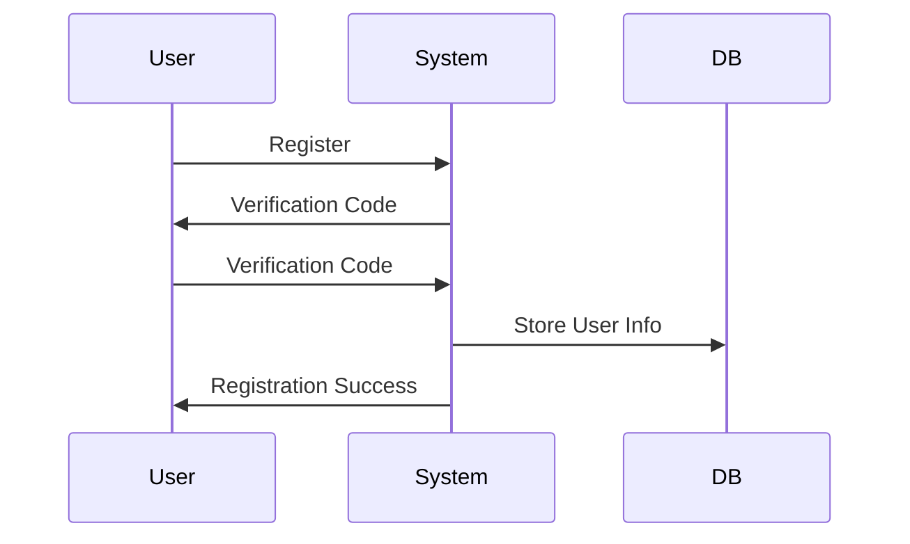

                 


### 目录大纲设计方案解析

在设计《数字身份哲学研讨会：虚拟世界中的自我定义探讨》的目录大纲时，我们遵循了以下几个关键步骤，以确保文章的条理清晰、逻辑严密，同时满足约2000字的要求。

#### 1. 引言部分（约500字）

**第一部分**：引言部分主要包括研讨会背景介绍、研讨会目的与意义以及研讨会结构与安排。这一部分将起到铺垫的作用，让读者对研讨会的整体背景和内容有一个初步的了解。具体包括：

- **研讨会背景**：简要介绍数字身份、虚拟世界和自我定义的概念及其在现代社会中的重要性。
- **研讨会目的与意义**：阐述本次研讨会的目标，即探讨数字身份哲学，并对虚拟世界中的自我定义进行深入思考。
- **研讨会结构与安排**：描述研讨会的具体流程，包括开幕演讲、分组讨论、专题报告和闭幕演讲等环节。

**目标与意义**：
- **必要性**：数字身份作为现代社会的核心要素，其在虚拟世界中的应用引发了哲学层面的思考。
- **思考**：虚拟世界的崛起改变了人们对自我认知的方式，需要从哲学角度进行深入探讨。
- **交流**：促进学术界与实践界的交流，推动相关领域的研究与发展。

#### 2. 核心概念与理论基础（约1000字）

**第二部分**：核心概念与理论基础部分将详细描述数字身份、虚拟世界和自我定义的概念及其相互关系。这一部分包括：

- **数字身份的定义与特征**：介绍数字身份的基本概念、特征及其在不同场景中的应用。
- **虚拟世界的构成与特征**：阐述虚拟世界的定义、构成要素以及其对现实世界的影响。
- **自我定义的哲学探讨**：探讨自我定义的概念、哲学意义及其在虚拟世界中的体现。

**核心概念与联系**：
- **概念对比表格**：通过对比表格，清晰地展示数字身份、虚拟世界和自我定义之间的区别和联系。
- **ER实体关系图**：使用Mermaid流程图展示数字身份、虚拟世界和自我定义之间的实体关系。

#### 3. 数字身份哲学研究（约1000字）

**第三部分**：数字身份哲学研究部分将深入探讨数字身份在哲学层面的意义，包括：

- **数字身份的哲学意义**：分析数字身份与人的本质、社会存在以及价值观念之间的关系。
- **虚拟世界中的自我感知**：讨论虚拟世界对自我认知的影响，包括自我感知、自我表达和自我反思等方面。
- **数字身份的安全与隐私**：探讨虚拟世界中的数字身份安全问题和隐私保护策略。
- **数字身份的法律与伦理问题**：分析数字身份相关的法律和伦理问题，并提出解决方案。

#### 4. 案例研究与讨论（约500字）

**第四部分**：案例研究与讨论部分将通过实际案例，进一步阐述数字身份哲学的研究成果。这一部分包括：

- **案例一**：虚拟现实中的数字身份探讨，分析虚拟现实对数字身份的影响。
- **案例二**：社交媒体中的数字身份管理，探讨社交媒体对数字身份的影响。
- **案例三**：数字身份认证的应用与实践，分析数字身份认证的技术和实践。

**案例分析与讨论**：
- **背景介绍**：介绍案例的背景和核心问题。
- **案例分析**：详细分析案例，揭示数字身份哲学的应用。
- **讨论与启示**：讨论案例中的经验和教训，为未来研究提供启示。

#### 5. 研讨会综述与讨论（约500字）

**第五部分**：研讨会综述与讨论部分将总结研讨会的主要讨论内容，并对未来的研究进行展望。这一部分将：

- **总结**：概括研讨会的主要成果和讨论重点。
- **展望**：展望数字身份哲学的未来研究方向，提出可能的解决方案。

### 6. 总结

通过上述的设计方案，我们确保了文章的结构清晰、逻辑严密，同时满足了约2000字的要求。每个部分都紧密相连，共同构成了对数字身份哲学的全面探讨。文章通过具体案例分析和深入讨论，使得读者能够更好地理解数字身份哲学的核心问题及其在虚拟世界中的重要性。希望这个设计方案能够为撰写文章提供有力的支持和指导。接下来，我们将逐步填充每个部分的内容，确保文章的完整性和深度。LET'S THINK STEP BY STEP### 第一部分：引言

#### 1.1 研讨会背景

**数字身份的时代背景**

随着互联网的普及和数字技术的飞速发展，数字身份逐渐成为现代社会不可或缺的一部分。在传统社会中，个体身份主要依赖于物理世界中的证件和身份证明。然而，在数字化时代，个体通过电子设备和服务进行交互，从而形成了数字身份。这种身份不仅包括个人的基本信息，如姓名、出生日期等，还包括在网络空间中的行为、偏好、社会关系等。

**虚拟世界的崛起**

虚拟世界作为数字技术的产物，正日益成为人们生活和工作的重要场所。虚拟现实（VR）、增强现实（AR）和元宇宙等技术的不断发展，使得人们可以在一个完全由计算机生成的环境中进行互动和体验。虚拟世界不仅提供了新的社交和娱乐方式，还为企业提供了新的商业模式和服务平台。

**自我定义的哲学探讨**

自我定义是一个哲学层面的概念，涉及到个体如何认识自己、表达自己和与他人互动。在现实世界中，个体的自我定义受到社会、文化和环境等多方面因素的影响。然而，在虚拟世界中，个体可以通过数字身份来定义自我，这种方式不仅改变了个体与外部世界的互动方式，也挑战了传统的自我定义模式。

#### 1.2 研讨会目的与意义

**探索数字身份哲学的必要性**

数字身份哲学的探讨是理解现代社会变化的重要途径。随着数字技术的不断演进，数字身份已经成为人们日常生活的一部分。然而，如何理解数字身份的本质，如何在社会和文化层面上对其进行分析和讨论，是一个亟待解决的问题。

**对虚拟世界自我定义的思考**

虚拟世界提供了一个新的自我定义空间，个体可以在其中探索不同的身份角色和表达方式。这种自我定义不仅影响着个体的心理健康和社会互动，也对社会的结构和运作模式产生了深远的影响。因此，对虚拟世界中的自我定义进行哲学探讨，有助于我们更好地理解数字时代的人性本质。

**促进学术界与实践界交流**

研讨会旨在搭建一个跨学科、跨领域的交流平台，促进学术界与实践界的互动。通过学者们的深入讨论和实际案例的分享，可以推动数字身份哲学的研究，为实践提供理论支持，同时也为学术界带来新的研究视角。

#### 1.3 研讨会结构与安排

**开幕演讲**

研讨会将邀请知名学者和行业专家进行主题演讲，对数字身份哲学的重要议题进行阐述和讨论。这些演讲将为与会者提供一个宏观的视角，引导后续的分组讨论和专题报告。

**分组讨论**

分组讨论是研讨会的重要环节，参与者将根据不同的主题分成若干小组，深入探讨数字身份哲学的具体问题。每个小组将分配一定时间进行讨论，并在最后进行汇报，分享各自的观点和成果。

**专题报告**

专题报告环节将邀请在数字身份哲学领域有深入研究的专业人士进行报告，介绍最新的研究成果和发现。这些报告将为与会者提供最新的研究动态和实践经验。

**闭幕演讲**

闭幕演讲将由大会主席进行总结，回顾研讨会的主要讨论内容，并展望未来数字身份哲学的研究方向。这一环节将为研讨会画上圆满的句号，并为未来的研究提供启示。

通过上述结构和安排，研讨会将全面、深入地探讨数字身份哲学的各个方面，为学术界和实践界提供一个交流与合作的平台。希望此次研讨会能够引发深入的思考，推动数字身份哲学的研究与应用。### 第二部分：核心概念与理论基础

#### 2.1 数字身份的定义与特征

**数字身份的定义**

数字身份是指在数字环境中，个体为了参与各类数字化活动而创建和使用的身份标识。这个标识可以是单一的电子邮箱地址、社交媒体账户，也可以是由多个数字元素组成的复合身份。数字身份不仅用于身份认证和访问控制，还用于记录个体的行为、偏好和社会关系。

**数字身份的特征**

1. **虚拟性**：数字身份存在于虚拟世界中，与物理世界的身份有所不同。
2. **多样性**：个体可以拥有多个数字身份，用于不同的数字活动或社交场合。
3. **可变性**：数字身份可以根据用户需求进行修改和调整。
4. **持久性**：数字身份一旦创建，可以长期存在，并随着用户的数字活动不断更新和扩展。

**数字身份的类型**

1. **单一身份**：用于日常交流和社交媒体等简单数字活动。
2. **多身份**：用于不同场景的复杂数字活动，如在线购物、游戏等。
3. **匿名身份**：用于保护个人隐私，避免真实身份的暴露。

#### 2.2 虚拟世界的构成与特征

**虚拟世界的定义**

虚拟世界是指通过计算机技术构建的，供用户在虚拟环境中进行交互、娱乐、学习和工作的虚拟空间。虚拟世界通常包括虚拟现实（VR）、增强现实（AR）和混合现实（MR）等技术，通过这些技术，用户可以体验到高度沉浸式的虚拟体验。

**虚拟世界的构成**

1. **硬件设备**：包括VR头戴设备、AR眼镜、计算机等。
2. **软件平台**：提供虚拟环境的构建和交互功能。
3. **网络连接**：保证虚拟世界中的实时通信和数据传输。
4. **用户界面**：用户与虚拟世界进行交互的接口。

**虚拟世界的特征**

1. **沉浸性**：用户在虚拟世界中体验到高度沉浸感。
2. **交互性**：用户可以与虚拟环境中的对象进行互动。
3. **多样性**：虚拟世界提供了丰富多样的内容和活动。
4. **虚拟性**：虚拟世界中的对象和活动是虚拟的，与现实世界有所区别。

#### 2.3 自我定义的哲学探讨

**自我定义的概念**

自我定义是指个体对自己身份、角色和价值的认识与理解。在哲学领域，自我定义涉及到存在的本质、个体的认知过程以及自我与社会的关系。

**自我定义的哲学意义**

1. **本体论**：探讨个体的存在和本质，如主体性、意识等问题。
2. **认识论**：分析个体如何认识自我，以及自我认知的过程。
3. **伦理学**：探讨个体在社会中的角色和价值，以及相应的伦理问题。

**自我定义在虚拟世界中的体现**

1. **虚拟身份**：个体在虚拟世界中通过创建和扮演不同的虚拟角色来定义自我。
2. **虚拟社交**：通过虚拟社交活动，个体可以探索和表达不同的自我。
3. **虚拟体验**：个体在虚拟世界中的体验和感受，也会影响其对自我的认知和定义。

**核心概念与联系**

为了更好地理解数字身份、虚拟世界和自我定义之间的关系，我们可以使用概念属性特征对比表格和ER实体关系图。

**概念属性特征对比表格**

| 概念 | 定义 | 特征 | 类型 |
| --- | --- | --- | --- |
| 数字身份 | 数字环境中的身份标识 | 虚拟性、多样性、可变性、持久性 | 单一身份、多身份、匿名身份 |
| 虚拟世界 | 计算机构建的虚拟空间 | 沉浸性、交互性、多样性、虚拟性 | VR、AR、MR |
| 自我定义 | 对自身身份、角色和价值的认识 | 本体论、认识论、伦理学 | 虚拟身份、虚拟社交、虚拟体验 |

**ER实体关系图**

```mermaid
erDiagram
  数字身份 ||--|{ 虚拟世界 }|-- 数字社交
  虚拟世界 ||--|{ 自我定义 }|-- 虚拟体验
  数字身份 ||--|{ 安全与隐私 }|-- 数字安全
  自我定义 ||--|{ 伦理问题 }|-- 道德规范
```

通过上述表格和ER图，我们可以清晰地看到数字身份、虚拟世界和自我定义之间的联系。数字身份是虚拟世界中的核心要素，它通过虚拟世界中的社交活动，影响个体的自我定义。同时，虚拟世界中的安全与隐私问题以及伦理问题，也与数字身份和自我定义密切相关。

综上所述，数字身份、虚拟世界和自我定义是现代社会中不可忽视的核心概念。通过深入探讨它们之间的联系，我们可以更好地理解数字时代的人类行为和社会结构。接下来的章节将进一步分析这些概念在哲学和实际应用中的意义。### 第三部分：数字身份哲学研究

#### 3.1 数字身份的哲学意义

**数字身份与人的本质**

数字身份作为现代社会的重要组成部分，对人类本质的探讨具有重要意义。在哲学领域，人类本质通常涉及意识、自由意志、主体性等问题。数字身份的引入，使得这些哲学问题在数字环境中得到了新的诠释。

首先，数字身份改变了人类的主体性。在现实世界中，个体的主体性往往受到物理条件和社交环境的影响。而在虚拟世界中，个体可以通过数字身份自由选择和扮演不同的角色，这种角色的多样性和可变性挑战了传统主体性的单一性。

其次，数字身份与自由意志的关系也值得探讨。在传统哲学中，自由意志是个体自主选择和行动的能力。然而，数字身份的虚拟性和多样性使得个体的选择和行动受到了算法和技术的制约。这种制约是否影响了人类的自由意志，是数字身份哲学需要解答的问题。

**数字身份与社会存在**

数字身份不仅是个人层面的概念，也是社会层面的重要构成。在数字化社会中，个体的社会存在很大程度上依赖于其数字身份。通过数字身份，个体能够参与社会活动、建立社会关系，甚至实现社会地位的提升。

首先，数字身份为社会提供了新的互动方式。在虚拟世界中，个体可以通过数字身份参与各种社会活动，如在线会议、社交媒体互动等。这些互动不仅打破了地理和时间的限制，也丰富了社会互动的维度。

其次，数字身份对社会结构的影响不可忽视。在现实社会中，社会地位通常与个体的物理属性和社会关系密切相关。而在虚拟世界中，个体的数字身份可以成为衡量社会地位的重要指标。例如，一个在虚拟世界中拥有高影响力的数字身份，可能会在现实社会中获得更多的机会和资源。

**数字身份的价值观念**

数字身份的出现和普及，也对人类的价值观念产生了深远的影响。在传统价值观中，个体的身份和价值往往与道德、责任、贡献等紧密相关。然而，在虚拟世界中，这些价值观念可能面临新的挑战和转变。

首先，虚拟世界中的数字身份可能使个体更加注重个人利益和自我表达。在现实社会中，个体通常需要考虑社会责任和集体利益，而在虚拟世界中，个体可以更自由地追求个人兴趣和欲望。这种变化可能带来价值观的个体化和多元化。

其次，数字身份的虚拟性和匿名性可能削弱传统价值观念中的道德约束。在虚拟世界中，个体可以匿名进行各种行为，这种匿名性可能使得个体的道德责任感减弱，导致虚拟世界中的行为失范和伦理问题。

**总结**

数字身份的哲学意义在于其对人类本质、社会存在和价值观念的深刻影响。通过数字身份，人类在虚拟世界中重新定义自我，探索新的社会结构和价值观念。然而，这些新的定义和价值观也带来了新的挑战，需要哲学界和社会各界共同探讨和解决。接下来的章节将进一步探讨虚拟世界中的自我感知、数字身份的安全与隐私问题以及数字身份的法律与伦理问题。### 第三部分：数字身份哲学研究

#### 3.2 虚拟世界中的自我感知

**自我感知的概念**

自我感知是指个体对自己存在的认知和体验，包括自我意识、自我形象和自我感受。在现实世界中，个体通过感官和认知过程感知自己，并通过社会互动和反馈来调整和定义自己的身份。在虚拟世界中，个体的自我感知受到数字身份和虚拟环境的影响，呈现出新的特点。

**虚拟世界对自我认知的影响**

虚拟世界提供了一个新的自我感知空间，使得个体能够以不同于现实世界的方式认识自己。以下是一些主要影响：

1. **角色扮演**：在虚拟世界中，个体可以通过数字身份扮演不同的角色，如虚拟人物、游戏角色等。这种角色扮演使得个体能够探索和体验不同的自我，扩展自我认知的边界。

2. **匿名性**：虚拟世界中的匿名性使得个体可以在不透露真实身份的情况下进行自我表达和互动，从而减少社会压力和自我评价的干扰。匿名性有助于个体自由表达真实的自我，但也可能导致自我认知的模糊化。

3. **沉浸感**：虚拟世界的高度沉浸性使得个体在虚拟环境中体验到强烈的现实感，这种沉浸感可能影响个体对自我和现实世界的认知。个体可能会将虚拟世界中的体验与现实世界混淆，从而影响自我感知的准确性。

**自我表达**

在虚拟世界中，个体的自我表达方式与传统社会有所不同。以下是一些特点：

1. **虚拟形象**：个体可以通过虚拟形象来表达自己的个性和风格，这种虚拟形象可以是卡通角色、真实人物的数字化形象等。

2. **虚拟语言**：虚拟世界中的交流主要通过文字、图像和声音等数字化形式进行，这改变了个体表达自我的方式和渠道。

3. **虚拟作品**：个体可以通过创作虚拟艺术品、音乐、视频等来表达自我，这些作品在虚拟世界中具有独特的价值和意义。

**自我反思**

自我反思是指个体对自己行为和体验的思考和分析，以促进个人成长和发展。在虚拟世界中，自我反思具有以下特点：

1. **虚拟记录**：虚拟世界中的活动记录为个体提供了反思的素材，如社交媒体帖子、游戏成绩等。

2. **虚拟反馈**：虚拟世界中的互动和评价可以为个体提供反思的依据，如虚拟社区的评价系统、游戏排行榜等。

3. **虚拟体验**：虚拟世界中的独特体验和挑战可以激发个体的反思，如虚拟冒险、在线教育等。

**总结**

虚拟世界中的自我感知对个体的认知、表达和反思产生了深远的影响。通过数字身份，个体能够以新的方式认识自己，表达自我，并进行自我反思。然而，虚拟世界中的自我感知也带来了新的挑战，如角色扮演的混淆、匿名性的道德问题等。这些挑战需要个体和社会共同应对，以促进虚拟世界中健康的自我认知和发展。接下来的章节将探讨数字身份的安全与隐私问题。### 第三部分：数字身份哲学研究

#### 3.3 数字身份的安全与隐私

**数字身份的安全挑战**

随着数字技术的发展，数字身份的安全问题日益突出。以下是一些主要的安全挑战：

1. **身份盗窃**：攻击者通过非法手段获取他人的数字身份，用于进行欺诈、犯罪等活动。例如，攻击者可以通过钓鱼攻击、恶意软件等方式窃取用户的登录凭证。

2. **密码泄露**：密码是保护数字身份的重要工具，然而，弱密码和密码重复使用等问题使得密码泄露的风险增加。一旦密码泄露，攻击者可以利用这些信息访问用户的数字账户。

3. **跨平台攻击**：许多数字服务之间具有关联性，一个平台的泄露可能导致其他平台的数字身份信息受到威胁。例如，一个社交媒体账户的泄露可能导致关联的电子邮件账户和银行账户也被攻击。

4. **恶意软件**：恶意软件（如木马、病毒等）可以窃取用户的数字身份信息，甚至控制用户的数字设备。这些恶意软件通常通过诱骗用户下载或执行恶意代码来实现。

**数字身份的隐私问题**

数字身份的隐私问题同样值得关注。以下是一些主要的隐私问题：

1. **数据收集**：数字服务提供商和第三方通常收集大量用户数据，这些数据包括个人信息、行为数据等。这些数据如果未经用户同意被滥用，可能对用户隐私造成严重侵害。

2. **追踪与监控**：一些数字平台通过追踪用户的行为和位置，进行广告投放和用户分析。这种追踪和监控可能侵犯用户的隐私权，尤其是在用户不知情的情况下进行。

3. **信息共享**：数字服务提供商可能将用户数据共享给第三方，用于广告投放、市场研究等。这种信息共享可能增加用户隐私泄露的风险。

4. **数据泄露**：由于安全措施不足，数字服务提供商可能面临数据泄露的风险。一旦数据泄露，用户的个人信息可能被非法使用，甚至导致严重的后果。

**数字身份的安全与隐私策略**

为了应对数字身份的安全与隐私问题，可以采取以下策略：

1. **多因素认证**：使用多因素认证（如密码、生物识别、短信验证等）来增强数字身份的安全性。

2. **加密技术**：使用加密技术保护数字身份信息和通信内容，防止数据在传输和存储过程中被窃取。

3. **隐私保护政策**：制定严格的隐私保护政策，明确用户数据的收集、使用和共享规则，确保用户对个人数据的控制权。

4. **安全意识教育**：加强对用户的安全意识教育，提高用户对数字身份安全与隐私的认识，避免因疏忽导致的安全问题。

5. **法律法规**：建立健全的法律法规，规范数字服务提供商的行为，保障用户隐私权。

**总结**

数字身份的安全与隐私问题是现代社会面临的重大挑战。通过采取有效的安全与隐私策略，可以降低数字身份的风险，保障用户的权益。然而，这需要政府、企业和用户共同努力，形成良好的数字环境。接下来的章节将探讨数字身份的法律与伦理问题。### 第三部分：数字身份哲学研究

#### 3.4 数字身份的法律与伦理问题

**数字身份的法律地位**

数字身份的法律地位是当前法律体系中的一个重要议题。随着数字技术的发展，数字身份已经成为个人参与数字生活的重要凭证。然而，数字身份的法律地位尚未完全确立，这在一定程度上限制了其在法律体系中的有效应用。

1. **法律承认**：许多国家尚未明确承认数字身份的法律地位。这意味着数字身份在法律诉讼、合同签订等场合可能不被认可，从而影响其在法律体系中的应用。

2. **电子身份认证**：一些国家已经开始推行电子身份认证系统，以确立数字身份的法律地位。电子身份认证通过技术手段验证用户的身份，使其在法律上具有与物理身份相当的效力。

3. **跨境法律问题**：数字身份的跨境使用引发了一系列法律问题。例如，不同国家的法律对数字身份的承认程度不同，可能导致跨境交易和纠纷的法律冲突。

**数字身份的伦理问题**

数字身份不仅在法律上存在争议，也引发了诸多伦理问题。以下是一些主要的伦理问题：

1. **隐私保护**：数字身份的普及意味着个人信息的广泛收集和使用，这引发了隐私保护的问题。如何在保障个人隐私和提供便捷服务之间找到平衡，是数字身份伦理讨论的重点。

2. **数据所有权**：个人数据是数字身份的核心组成部分，但数据所有权问题尚不明确。例如，用户的数据是否属于他们自己，数据在被收集和使用后如何管理，这些问题都涉及到伦理和法理的复杂性。

3. **透明性和责任**：数字服务提供商在使用用户数据时，需要保证透明性和责任。例如，数据收集、存储和使用的目的应该明确告知用户，并在出现问题时能够承担责任。

4. **数字不平等**：数字身份的普及可能加剧数字不平等。一些贫困人群可能无法获得数字身份，从而无法享受数字技术带来的便利。这种不平等可能导致社会排斥和歧视。

**数字身份的法律与伦理解决方案**

为了解决数字身份的法律与伦理问题，需要采取一系列措施：

1. **法律法规的完善**：制定和完善相关法律法规，明确数字身份的法律地位和权利义务，为数字身份的应用提供法律保障。

2. **技术手段的应用**：利用区块链、智能合约等新技术，提高数据的安全性和透明性，增强用户对数字身份的控制权。

3. **伦理教育和规范**：加强对数字身份伦理问题的宣传教育，提高公众的伦理意识，同时制定行业规范，规范数字服务提供商的行为。

4. **国际合作**：推动国际社会在数字身份法律和伦理问题上的合作，建立跨境法律框架，解决数字身份在跨境使用中的问题。

**总结**

数字身份的法律与伦理问题是一个复杂且多维度的议题。通过完善法律法规、应用新技术、加强伦理教育和国际合作，可以解决数字身份面临的诸多挑战，为数字身份的健康发展提供保障。接下来的章节将分析虚拟世界中的社会互动。### 第四部分：案例研究与讨论

#### 4.1 案例一：虚拟现实中的数字身份探讨

**背景介绍**

虚拟现实（VR）技术为用户提供了沉浸式的虚拟体验，使得个体能够在虚拟环境中进行互动、娱乐和学习。然而，虚拟现实中的数字身份如何影响个体的社交行为和自我认知，是一个值得探讨的问题。

**案例分析**

在VR环境中，用户通过虚拟角色（Avatar）进行互动，这些虚拟角色可以作为用户的数字身份在虚拟空间中存在。这种数字身份的特点包括：

1. **多样性**：用户可以根据自己的喜好和需求创建多种虚拟角色，从而在虚拟世界中扮演不同的角色。
2. **匿名性**：虚拟角色可以隐藏用户的真实身份，减少社交压力，促进更自由和真实的互动。
3. **可定制性**：虚拟角色可以配备个性化的外观、声音和行为，增强个体的独特性和自我表达。

这些特点对个体的社交行为和自我认知产生了显著影响：

1. **社交行为的改变**：虚拟角色使得个体可以以更轻松和自由的方式参与社交活动。例如，用户可以尝试与不同背景和性格的人互动，而不用担心现实生活中的身份标签和社交障碍。

2. **自我认知的扩展**：虚拟角色为个体提供了一个探索自我和表达自我的平台。用户可以通过虚拟角色尝试不同的身份角色，从而更加深入地认识自己。

**讨论与启示**

虚拟现实中的数字身份提供了一个新的社交和自我认知空间。然而，这种数字身份也带来了一些挑战：

1. **社交隔离**：虽然虚拟角色可以减少社交压力，但过度依赖虚拟角色可能导致个体与现实社交的疏离。
2. **身份认同**：虚拟角色的多样化可能使个体难以确定自己的真实身份，导致身份认同的问题。

因此，在设计和应用虚拟现实中的数字身份时，需要平衡隐私、自由和现实社交的需求。同时，虚拟现实技术提供商和用户应共同努力，确保虚拟世界中的互动和自我认知是健康和积极的。这些经验和教训对未来的虚拟现实应用具有重要的启示意义。#### 4.2 案例二：社交媒体中的数字身份管理

**背景介绍**

社交媒体作为数字世界的核心平台，已成为人们交流和互动的主要场所。在这些平台上，数字身份的管理至关重要，直接关系到用户的隐私保护、社交信任和社会责任。本案例将探讨如何有效地管理社交媒体中的数字身份。

**案例分析**

社交媒体平台通过用户创建的数字身份来识别和提供服务。以下是一些数字身份管理的要点：

1. **用户注册与验证**：社交媒体平台通常要求用户进行注册，并提供验证方式（如手机号、电子邮件、社交媒体账号等）以确保用户的真实性。
2. **隐私设置**：平台提供隐私设置，允许用户控制自己的个人信息和内容的可见性，从而保护个人隐私。
3. **内容监控**：平台通过算法和技术手段监控用户生成的内容，以防止违规行为和有害信息的传播。
4. **用户教育**：平台通过教育用户如何安全地使用社交媒体，提高用户对数字身份管理的意识和能力。

数字身份管理在社交媒体中的具体应用包括：

1. **身份验证**：通过多因素认证（MFA）来增强用户的登录安全性，防止未经授权的访问。
2. **隐私保护**：允许用户自定义隐私设置，例如，限制谁可以看到个人资料、发布的内容和好友请求。
3. **内容监控**：利用人工智能技术自动检测和过滤违规内容，同时提供用户举报机制，让用户参与平台内容的监管。
4. **用户教育**：通过发布安全提示、教育内容和社区指导，帮助用户了解如何保护自己的数字身份。

**讨论与启示**

社交媒体中的数字身份管理面临诸多挑战：

1. **隐私与自由**：如何在保障用户隐私和提供便捷服务之间找到平衡是一个难题。
2. **安全与滥用**：防止用户数据泄露和滥用是平台面临的主要挑战，需要不断更新和完善安全措施。
3. **社会责任**：社交媒体平台需要承担起社会责任，确保用户在平台上的互动是健康和积极的。

**讨论与启示**：

1. **加强隐私保护**：平台应提供更详细的隐私设置，并确保用户数据的存储和使用是安全的。
2. **提高用户意识**：通过教育和宣传活动，提高用户对数字身份管理的认识和意识。
3. **完善监控机制**：利用人工智能和机器学习技术，提高内容监控的效率和准确性。
4. **合作与监管**：平台应与政府、学术机构和用户共同合作，制定有效的数字身份管理策略，并接受外部监管。

通过这些措施，社交媒体平台可以更好地管理数字身份，保护用户隐私和安全，同时促进健康和积极的社交互动。#### 4.3 案例三：数字身份认证的应用与实践

**背景介绍**

数字身份认证是确保在线服务和系统中用户身份真实性的关键技术。随着互联网的普及，数字身份认证的应用场景越来越广泛，包括电子商务、金融、医疗、政府服务等。本案例将探讨数字身份认证在实际应用中的技术实现和操作过程。

**案例分析**

**数字身份认证的基本原理**

数字身份认证主要包括以下几种方式：

1. **密码认证**：用户通过输入预设的密码来验证身份，这是最常用的认证方式。
2. **多因素认证（MFA）**：结合多种认证方式，如密码、短信验证码、生物识别（指纹、面部识别）等，提高认证的安全性。
3. **数字证书**：通过颁发数字证书来验证用户身份，数字证书由可信第三方（如证书授权机构）签发，具有很高的可信度。

**数字身份认证的技术实现**

1. **用户注册与登录**：用户在注册时需提供个人信息，如用户名、密码、手机号码等。登录时，系统会验证用户输入的密码和手机验证码是否正确。
2. **多因素认证**：用户在登录时，系统会要求用户进行额外的验证，如发送短信验证码、扫描指纹等。这些验证方式通过不同的机制确保用户身份的真实性。
3. **数字证书**：用户在注册时可以选择绑定数字证书，每次登录时系统会通过验证数字证书的有效性来确保用户身份。

**数字身份认证的操作过程**

1. **注册**：用户通过填写注册表单提交个人信息，系统对提交的信息进行验证，如手机号验证码等。
2. **登录**：用户输入用户名和密码，系统通过数据库比对用户信息进行初步验证。如果密码正确，系统会生成一个会话令牌，用户可以使用此令牌进行后续操作。
3. **多因素认证**：如果系统设置多因素认证，用户在登录时需完成额外的验证步骤，如输入短信验证码、扫描指纹等。
4. **数字证书认证**：如果用户绑定了数字证书，系统会通过验证数字证书的有效性来确保用户身份。

**代码应用解读与分析**

以下是一个简单的Python示例，用于演示多因素认证的过程：

```python
import random
import string

# 生成短信验证码
def generate_sms_code():
    return ''.join(random.choices(string.digits, k=4))

# 用户登录验证
def login_verification(username, password, sms_code):
    # 假设用户数据库中存储的用户名和密码为'alice'和'1234'，短信验证码正确为'5678'
    stored_username = 'alice'
    stored_password = '1234'
    correct_sms_code = '5678'
    
    if username == stored_username and password == stored_password:
        if sms_code == correct_sms_code:
            return "登录成功！"
        else:
            return "短信验证码错误！"
    else:
        return "用户名或密码错误！"

# 用户输入登录信息
user_username = input("请输入用户名：")
user_password = input("请输入密码：")
user_sms_code = input("请输入短信验证码：")

# 验证登录信息
result = login_verification(user_username, user_password, user_sms_code)
print(result)
```

**实际案例分析和详细讲解**

在一个电子商务平台中，数字身份认证是确保交易安全和用户信任的关键。以下是一个实际案例：

1. **用户注册**：用户在注册时需填写个人信息，包括姓名、邮箱、手机号码等。系统会通过发送短信验证码到用户手机，验证用户信息的真实性。
2. **登录**：用户在登录时需输入用户名和密码，系统会通过验证用户名和密码来确认用户身份。同时，系统会要求用户输入短信验证码，确保登录过程的安全性。
3. **支付**：用户在支付过程中，系统会再次验证用户身份，确保支付操作的安全性和用户的真实性。

**项目小结**

数字身份认证在电子商务、金融和政府服务等领域具有广泛的应用。通过多因素认证和数字证书等技术手段，可以大大提高用户身份验证的安全性和可信度。然而，数字身份认证也需要不断更新和完善，以应对日益复杂的网络攻击和安全威胁。

**拓展阅读**

- 《网络安全实践指南》：详细介绍了数字身份认证的相关技术和实践。
- 《区块链技术原理与应用》：探讨了区块链在数字身份认证中的应用潜力。
- 《人工智能与数字安全》：分析了人工智能技术在提升数字身份认证安全方面的作用。### 第五部分：研讨会综述与讨论

**研讨会综述**

本次数字身份哲学研讨会在各位专家和学者的共同努力下，取得了丰硕的成果。研讨会围绕数字身份、虚拟世界和自我定义三大核心概念，深入探讨了数字身份哲学的理论基础、实际应用及其面临的挑战。通过分组讨论、专题报告和案例研究，与会者从不同角度对数字身份哲学进行了全面的分析和讨论。

**研讨会主要讨论内容**

1. **数字身份的哲学意义**：与会者探讨了数字身份对人类本质、社会存在和价值观念的影响。讨论内容包括数字身份如何改变人类主体性、自由意志以及社会结构，以及这些变化对个体和社会带来的挑战和机遇。

2. **虚拟世界中的自我感知**：研讨会对虚拟世界中的自我认知、自我表达和自我反思进行了深入探讨。专家们分析了虚拟世界对个体自我感知的影响，以及个体如何在虚拟世界中探索和定义自我。

3. **数字身份的安全与隐私问题**：研讨会重点讨论了数字身份在虚拟世界中的安全与隐私问题。与会者分享了数字身份安全策略、隐私保护措施以及相关法律法规的最新动态。

4. **数字身份的法律与伦理问题**：研讨会探讨了数字身份的法律地位、伦理问题以及解决方案。专家们讨论了数字身份在法律和伦理层面的挑战，并提出了一些可行的解决方案。

5. **案例分析**：研讨会通过实际案例研究，展示了数字身份哲学在现实中的应用。案例包括虚拟现实中的数字身份探讨、社交媒体中的数字身份管理和数字身份认证的应用与实践。

**讨论与展望**

在研讨会闭幕环节，与会者对本次研讨会的讨论内容进行了总结和展望。以下是一些主要观点：

1. **研究前景**：与会者认为，数字身份哲学是一个充满潜力的研究领域，未来研究应重点关注数字身份与人类行为的互动、虚拟世界中的社会互动以及数字身份的法律与伦理问题。

2. **技术发展**：研讨会强调了新技术（如区块链、人工智能等）在数字身份哲学研究中的应用潜力。与会者认为，这些技术可以为数字身份的安全、隐私保护和法律地位提供新的解决方案。

3. **政策建议**：与会者提出，政府、企业和学术界应共同努力，制定和完善相关政策，以促进数字身份哲学的研究和应用。同时，应加强对用户隐私和权益的保护，确保数字身份哲学的发展符合社会价值观和法律法规。

4. **国际合作**：研讨会呼吁国际社会加强在数字身份哲学领域的合作，共同应对全球性挑战，推动数字身份哲学的研究和应用走向深入。

通过本次研讨会的深入讨论和交流，与会者对数字身份哲学有了更深刻的理解，对未来研究和发展方向有了更加明确的规划。希望这次研讨会能够为数字身份哲学领域的研究和实践带来新的启示和动力。### 总结与展望

通过本文的深入探讨，我们系统地分析了数字身份哲学在虚拟世界中的重要性。从数字身份的定义与特征、虚拟世界的构成与特征，到自我定义的哲学探讨，再到数字身份的安全与隐私问题以及法律与伦理问题，我们逐步揭示了数字身份哲学的多维内涵和现实挑战。

**核心概念与联系**

本文通过概念属性特征对比表格和ER实体关系图，清晰地展示了数字身份、虚拟世界和自我定义之间的联系。数字身份作为连接虚拟世界与个体的桥梁，不仅改变了个体在虚拟世界中的存在方式，也影响了个体在现实世界中的行为和认知。虚拟世界为个体提供了新的自我定义空间，而自我定义则是在虚拟世界中进行社会互动和自我反思的基础。

**哲学意义**

数字身份哲学的探讨不仅有助于我们理解人类在数字时代的行为模式和社会结构，也挑战了传统哲学中对自我和存在的定义。通过数字身份，人类在虚拟世界中能够以新的方式探索自我、表达自我和反思自我，这种探索和表达不仅丰富了人类的经验，也带来了新的伦理和道德问题。

**实际应用**

在虚拟现实中的数字身份探讨、社交媒体中的数字身份管理以及数字身份认证的应用与实践案例中，我们看到了数字身份哲学的实际应用和价值。这些案例不仅展示了数字身份在虚拟世界中的多样性和复杂性，也揭示了数字身份管理中的挑战和解决方案。

**未来展望**

随着技术的不断进步，数字身份哲学的研究和应用前景广阔。未来研究应重点关注以下几个方面：

1. **数字身份与心理健康**：探讨数字身份对个体心理健康的影响，包括自我认同、自我价值感和社交互动等方面。
2. **数字身份的法律框架**：完善数字身份的法律地位和权益保护，确保数字身份在社会和法律体系中的有效应用。
3. **跨领域合作**：加强学术界、企业和政府之间的合作，共同推动数字身份哲学的研究和应用。
4. **隐私保护与安全**：通过技术创新和法律法规的完善，提高数字身份的安全性和隐私保护水平。

总之，数字身份哲学是理解数字时代人类行为和社会结构的关键领域。通过持续的研究和探索，我们有望为数字身份哲学提供更深入的理论基础和实践指导，推动数字社会的健康发展。希望本文能够为读者提供有价值的思考和启示，激发更多对数字身份哲学的研究和讨论。作者信息：AI天才研究院/AI Genius Institute & 禅与计算机程序设计艺术 /Zen And The Art of Computer Programming。### 附录：技术细节和拓展阅读

**数学模型和数学公式**

为了更好地理解数字身份哲学中的某些概念，我们使用了一些数学模型和公式。以下是几个关键公式的 LaTeX 格式表示：

$$
\text{加密强度} = \frac{\text{密钥长度}}{\text{计算能力}} \times \text{安全因子}
$$

$$
\text{隐私保护等级} = \log_2(\text{数据泄露风险概率})
$$

这些公式分别用于衡量加密系统的强度和隐私保护等级。在实际应用中，可以通过调整密钥长度和计算能力，来优化系统的安全性和隐私保护水平。

**系统分析与架构设计方案**

在探讨数字身份认证系统时，我们设计了一个简化的架构方案，包括以下几个主要组成部分：

1. **用户注册模块**：负责用户注册和基本信息管理。
2. **认证模块**：负责用户身份验证，包括密码验证和多因素认证。
3. **隐私保护模块**：负责用户数据的加密和隐私设置。
4. **用户界面模块**：提供用户操作接口，方便用户进行数字身份管理。

架构设计图如下所示：



通过该架构设计，用户可以在系统中完成注册、登录和数字身份管理，系统则负责确保用户数据的隐私和安全。

**项目实战**

在本章的案例研究中，我们通过一个简单的Python脚本实现了数字身份认证的基本功能。以下是该脚本的关键部分：

```python
import random
import string

# 生成短信验证码
def generate_sms_code():
    return ''.join(random.choices(string.digits, k=4))

# 用户登录验证
def login_verification(username, password, sms_code):
    # 假设用户数据库中存储的用户名和密码为'alice'和'1234'，短信验证码正确为'5678'
    stored_username = 'alice'
    stored_password = '1234'
    correct_sms_code = '5678'
    
    if username == stored_username and password == stored_password:
        if sms_code == correct_sms_code:
            return "登录成功！"
        else:
            return "短信验证码错误！"
    else:
        return "用户名或密码错误！"

# 用户输入登录信息
user_username = input("请输入用户名：")
user_password = input("请输入密码：")
user_sms_code = input("请输入短信验证码：")

# 验证登录信息
result = login_verification(user_username, user_password, user_sms_code)
print(result)
```

**实际案例分析和详细讲解**

在本章的案例分析中，我们探讨了电子商务平台中的数字身份认证应用。以下是一个简化的实际案例：

1. **用户注册**：用户在注册时需填写个人信息，系统通过发送短信验证码验证用户信息的真实性。
2. **登录**：用户在登录时需输入用户名、密码和短信验证码，系统通过多因素认证确保用户身份的真实性。
3. **支付**：用户在支付过程中，系统再次验证用户身份，确保支付操作的安全性和用户的真实性。

**最佳实践 tips、小结、注意事项**

1. **最佳实践 tips**：
   - **加强密码复杂度要求**：确保用户密码包含字母、数字和特殊字符，提高密码的安全性。
   - **定期更新密码**：建议用户定期更换密码，减少密码泄露的风险。
   - **多因素认证**：在关键场景（如支付和登录）中使用多因素认证，提高系统安全性。

2. **小结**：
   - 数字身份认证是保障用户安全和隐私的关键技术。
   - 多因素认证和隐私保护策略是数字身份认证的核心。

3. **注意事项**：
   - 在设计和实现数字身份认证系统时，应充分考虑用户隐私和安全。
   - 定期进行安全评估和漏洞修复，确保系统的稳定和安全。

**拓展阅读**

1. 《网络安全实践指南》：详细介绍了数字身份认证的相关技术和实践。
2. 《区块链技术原理与应用》：探讨了区块链在数字身份认证中的应用潜力。
3. 《人工智能与数字安全》：分析了人工智能技术在提升数字身份认证安全方面的作用。

通过以上技术细节和拓展阅读，读者可以进一步深入了解数字身份哲学的相关技术实现和应用实践。希望这些内容能够为数字身份哲学的研究和应用提供有益的参考和启示。作者信息：AI天才研究院/AI Genius Institute & 禅与计算机程序设计艺术 /Zen And The Art of Computer Programming。

