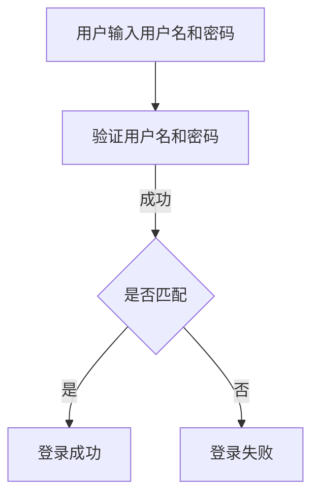
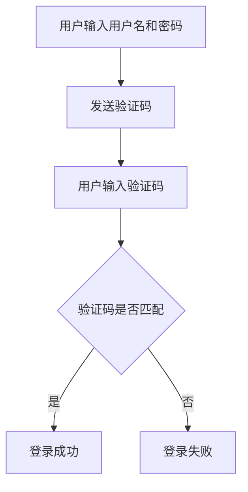
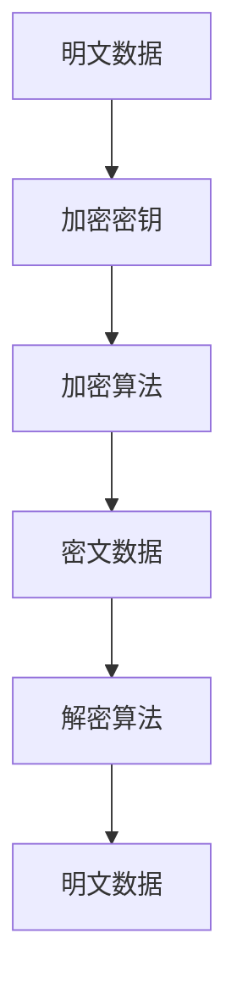
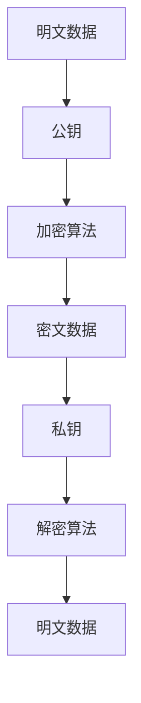
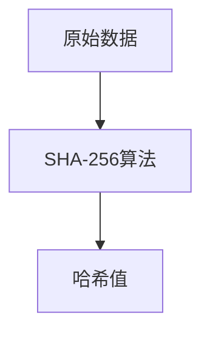
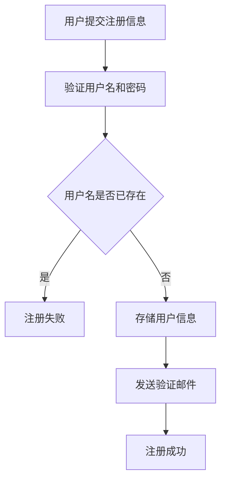
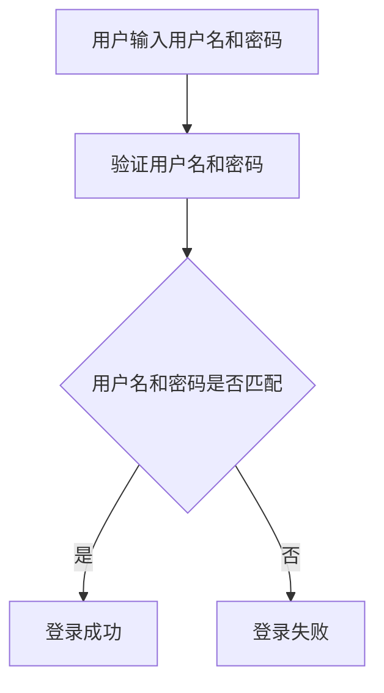
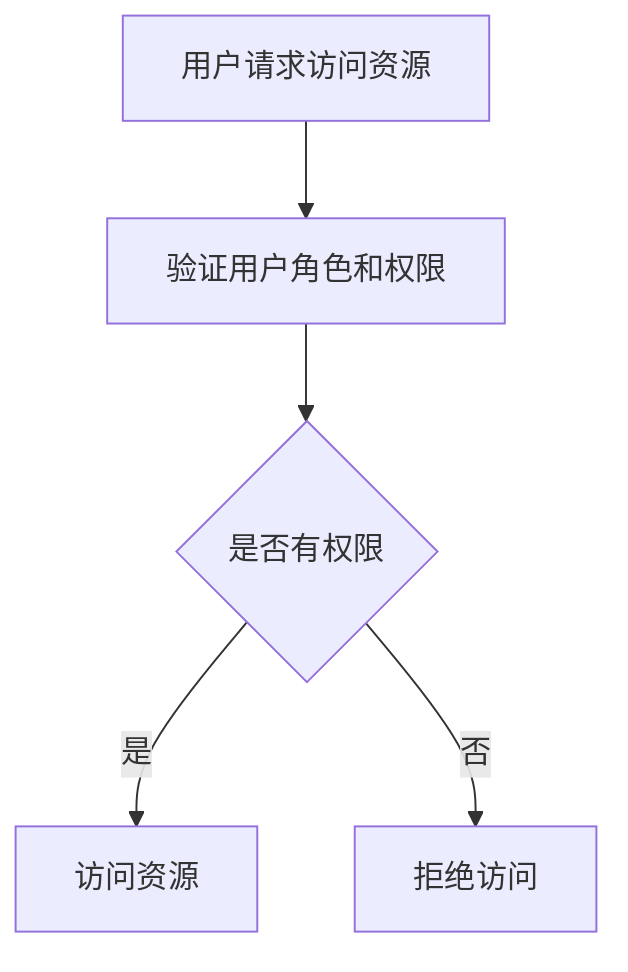
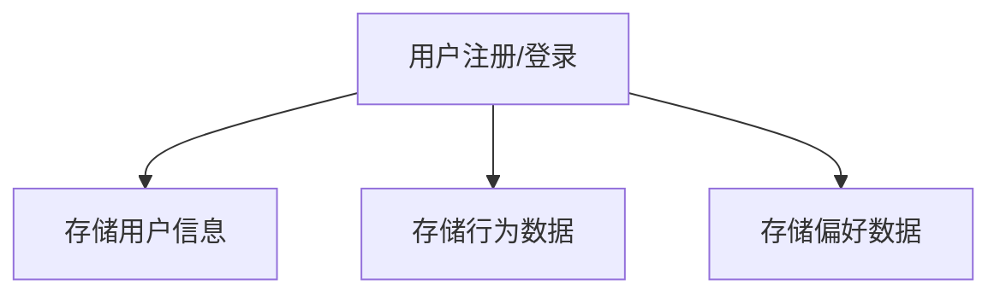

                 

### 引言

# 数字身份管理系统：虚拟世界中的自我呈现平台

> 关键词：数字身份管理，虚拟世界，自我呈现平台，系统架构，算法原理，最佳实践

> 摘要：随着虚拟世界的不断发展，数字身份管理系统成为构建虚拟环境中用户身份认证和隐私保护的重要基石。本文旨在深入探讨数字身份管理系统的概念、架构、算法原理以及最佳实践，为读者提供一个全面、系统的理解框架。

在当今数字化时代，虚拟世界正在迅速崛起，成为人们生活和工作的崭新空间。数字身份管理系统作为这一虚拟环境中的核心组件，承担着确保用户身份真实性和隐私安全的重任。然而，数字身份管理并非一项简单的任务，它涉及诸多复杂的技术和概念，需要我们进行深入的分析和探讨。

## 1.1 问题背景与定义

### 1.1.1 虚拟世界的崛起

虚拟世界，顾名思义，是一种模拟现实世界的虚拟环境。它通过计算机技术、网络技术和人工智能技术等，为用户提供了一个可以互动、交流和体验的数字化空间。随着互联网的普及和技术的进步，虚拟世界正逐渐成为人们日常生活的一部分。

虚拟世界具有以下几个显著特点：

1. **虚拟性**：虚拟世界是通过计算机技术构建的，用户在其中可以进行各种虚拟活动，如社交、购物、娱乐等。
2. **交互性**：用户可以在虚拟世界中与其他用户互动，甚至可以创建自己的虚拟形象（Avatar）。
3. **多样性**：虚拟世界可以涵盖多种主题和场景，从逼真的虚拟城市到幻想的奇幻世界，无所不有。
4. **沉浸感**：通过虚拟现实（VR）和增强现实（AR）技术，用户可以获得更加真实的感官体验。

### 1.1.2 数字身份管理的挑战

在虚拟世界中，用户需要以某种形式进行身份认证和交互。这就引出了数字身份管理的问题。数字身份管理涉及以下几个方面：

1. **身份认证**：确保用户的身份是真实可靠的，防止假冒身份和非法访问。
2. **隐私保护**：保护用户的个人信息不被泄露或滥用，确保用户隐私安全。
3. **数据一致性**：在多个虚拟环境中，用户需要一个统一的数字身份，以便在不同平台上进行无缝交互。
4. **安全性与可靠性**：数字身份管理系统需要具备高安全性和可靠性，确保用户数据的安全存储和传输。

### 1.1.3 数字身份管理系统的重要性

数字身份管理系统在虚拟世界中的重要性不言而喻。首先，它是保障用户隐私和信息安全的基础。在一个虚拟环境中，用户的数字身份相当于他们的“身份证”，如果没有一个可靠的数字身份管理系统，用户的隐私和信息安全将无法得到保障。

其次，数字身份管理系统是构建虚拟社会的重要支撑。在一个虚拟社会中，用户需要相互信任和互动，这就需要通过数字身份管理系统来建立用户之间的信任关系。

最后，数字身份管理系统有助于优化用户体验。通过简化身份认证流程和提供个性化的服务，数字身份管理系统可以提升用户在虚拟世界中的互动体验。

## 1.2 数字身份管理的基本概念

### 1.2.1 数字身份的概念

数字身份是指用户在虚拟世界中用来表示自己身份的信息集合。它可以是简单的用户名和密码，也可以是复杂的生物特征（如指纹、虹膜等）和社交媒体账号。数字身份具有以下几个特点：

1. **唯一性**：每个用户都有一个唯一的数字身份，以便在虚拟世界中进行识别和区分。
2. **可变性**：数字身份可以随着用户的需求和虚拟环境的变化而改变，例如用户可以切换不同的虚拟角色。
3. **虚拟性**：数字身份是虚拟世界中的存在，它并不等同于现实世界的实体身份。

### 1.2.2 数字身份管理的核心要素

数字身份管理包括以下几个方面：

1. **身份认证**：验证用户的身份是否合法和真实。
2. **权限管理**：根据用户的身份和角色，赋予不同的访问权限。
3. **隐私保护**：确保用户的个人信息不被泄露或滥用。
4. **数据一致性**：在多个虚拟环境中，保持用户数字身份的一致性。
5. **安全性与可靠性**：确保数字身份管理系统的安全性和可靠性。

### 1.2.3 数字身份管理的边界与外延

数字身份管理的边界主要涉及以下几个方面：

1. **虚拟环境**：数字身份管理系统适用于哪些虚拟环境，如在线游戏、社交平台、虚拟现实等。
2. **用户范围**：数字身份管理系统适用于哪些用户群体，如普通用户、企业用户等。
3. **技术实现**：数字身份管理需要哪些技术支持，如区块链、密码学、生物识别等。

数字身份管理的外延主要涉及以下几个方面：

1. **跨平台**：如何在不同虚拟环境之间实现数字身份的统一和互认。
2. **国际化**：如何适应不同国家和地区的法律和法规要求。
3. **创新应用**：如何利用数字身份管理系统推动虚拟世界的发展和创新。

## 1.3 本章小结

本章介绍了数字身份管理系统在虚拟世界中的重要性，并探讨了数字身份管理的基本概念和核心要素。通过分析虚拟世界的崛起和数字身份管理的挑战，我们认识到数字身份管理系统是保障用户隐私和安全、构建虚拟社会和优化用户体验的关键。在接下来的章节中，我们将深入探讨数字身份管理系统的架构、算法原理以及最佳实践，为读者提供一个全面、系统的理解框架。## 1.2 数字身份管理的基本概念

### 1.2.1 数字身份的概念

数字身份是指用户在虚拟世界中用来表示自己身份的信息集合。它可以是简单的用户名和密码，也可以是复杂的生物特征（如指纹、虹膜等）和社交媒体账号。数字身份具有以下几个特点：

1. **唯一性**：每个用户都有一个唯一的数字身份，以便在虚拟世界中进行识别和区分。
2. **可变性**：数字身份可以随着用户的需求和虚拟环境的变化而改变，例如用户可以切换不同的虚拟角色。
3. **虚拟性**：数字身份是虚拟世界中的存在，它并不等同于现实世界的实体身份。

### 1.2.2 数字身份管理的核心要素

数字身份管理包括以下几个方面：

1. **身份认证**：验证用户的身份是否合法和真实。身份认证是数字身份管理的首要任务，它确保只有合法用户才能进入虚拟环境。常见的身份认证方法包括用户名和密码、生物特征识别、多因素认证（MFA）等。

2. **权限管理**：根据用户的身份和角色，赋予不同的访问权限。权限管理是确保虚拟环境安全和数据安全的关键。通过权限管理，可以控制用户对系统资源和数据的访问权限，防止未授权访问和数据泄露。

3. **隐私保护**：确保用户的个人信息不被泄露或滥用。隐私保护是数字身份管理的核心目标之一。虚拟环境中的用户数据包括身份信息、行为数据、偏好数据等，这些数据必须得到妥善保护，以防止恶意攻击和数据滥用。

4. **数据一致性**：在多个虚拟环境中，保持用户数字身份的一致性。用户可能在不同的虚拟环境中使用相同的数字身份，因此需要确保这些环境中的身份信息保持一致，以提供无缝的用户体验。

5. **安全性与可靠性**：确保数字身份管理系统的安全性和可靠性。数字身份管理系统需要具备高安全性和可靠性，以防止黑客攻击、数据泄露等安全事件。安全性和可靠性包括系统设计、数据加密、访问控制、备份和恢复等方面。

### 1.2.3 数字身份管理的边界与外延

数字身份管理的边界主要涉及以下几个方面：

1. **虚拟环境**：数字身份管理系统适用于哪些虚拟环境，如在线游戏、社交平台、虚拟现实等。不同的虚拟环境对数字身份管理的要求不同，需要根据具体环境的特点进行设计和实施。

2. **用户范围**：数字身份管理系统适用于哪些用户群体，如普通用户、企业用户等。不同的用户群体对数字身份管理有不同的需求，需要根据用户群体的特点进行定制化设计。

3. **技术实现**：数字身份管理需要哪些技术支持，如区块链、密码学、生物识别等。技术的选择直接影响数字身份管理的效率和安全性，需要根据技术特点进行合理选择。

数字身份管理的外延主要涉及以下几个方面：

1. **跨平台**：如何在不同虚拟环境之间实现数字身份的统一和互认。随着虚拟世界的多元化发展，如何在不同平台之间实现数字身份的无缝迁移和互认是一个重要课题。

2. **国际化**：如何适应不同国家和地区的法律和法规要求。数字身份管理涉及用户隐私保护，不同国家和地区对隐私保护的法律和法规有所不同，需要确保系统的合规性。

3. **创新应用**：如何利用数字身份管理系统推动虚拟世界的发展和创新。数字身份管理系统不仅可以提供安全和便捷的用户体验，还可以为虚拟世界中的各种应用提供新的可能性，如数字身份认证、智能合约、去中心化应用等。

通过上述对数字身份管理基本概念的介绍，我们可以看出，数字身份管理是一个复杂且重要的系统，它不仅涉及到技术实现，还包括法律、伦理等多个方面。在接下来的章节中，我们将深入探讨数字身份管理系统的架构、算法原理以及最佳实践，以期为读者提供一个全面、系统的理解框架。## 1.3 数字身份管理的挑战

数字身份管理系统在虚拟世界中的实施面临着诸多挑战，这些挑战不仅涉及到技术层面，还包括法律、伦理和社会等多个方面。下面我们将逐一分析这些挑战。

### 1.3.1 技术挑战

1. **安全性**：数字身份管理系统需要确保用户身份信息的安全，防止黑客攻击和数据泄露。这要求系统具备强大的加密和身份验证机制，如加密存储、多因素认证（MFA）等。

2. **可靠性**：数字身份管理系统需要具备高度的可靠性，确保在系统故障或网络中断的情况下，用户仍然能够正常访问虚拟环境。这要求系统具备良好的容错能力和备份恢复机制。

3. **性能**：数字身份管理系统需要能够快速响应大量用户的身份验证请求，确保用户体验。这要求系统具备高性能的计算和数据处理能力。

4. **兼容性**：数字身份管理系统需要在不同虚拟环境之间保持一致性和兼容性，以便用户能够在不同平台上无缝切换。这要求系统具备良好的跨平台能力和标准化接口。

### 1.3.2 法律挑战

1. **隐私保护法规**：不同国家和地区对用户隐私保护的法律和法规有所不同，数字身份管理系统需要确保符合当地法律法规要求。例如，欧盟的《通用数据保护条例》（GDPR）对用户隐私保护提出了严格要求。

2. **数据跨境传输**：随着虚拟世界的全球化发展，用户身份信息可能需要在不同的国家和地区之间传输。这要求系统确保数据跨境传输的合法性和安全性。

3. **法律追责**：数字身份管理系统可能会面临法律追责的风险，如用户数据泄露、滥用等。这要求系统设计者和运营者必须对系统安全负责，确保系统的合规性和安全性。

### 1.3.3 伦理挑战

1. **用户隐私**：数字身份管理系统涉及用户大量个人信息，如何保护用户隐私成为一个重要的伦理问题。系统设计者和运营者需要平衡用户隐私保护和系统功能需求。

2. **数据滥用**：数字身份管理系统可能会被用于监控、跟踪和数据分析，这可能导致用户数据的滥用。系统设计者和运营者需要确保用户数据不被滥用，尊重用户的隐私和自由。

3. **数字鸿沟**：在虚拟世界中，不同用户可能拥有不同的数字身份管理能力，这可能导致数字鸿沟的加剧。系统设计者和运营者需要确保系统的公平性和可及性，避免数字鸿沟的扩大。

### 1.3.4 社会挑战

1. **用户信任**：数字身份管理系统需要赢得用户的信任，否则用户可能会抵触或拒绝使用。这要求系统设计者和运营者通过透明、公正和高效的服务来建立用户信任。

2. **社会责任**：数字身份管理系统不仅关系到用户隐私和安全，还关系到社会的整体利益。系统设计者和运营者需要承担社会责任，确保系统的公正、公平和可持续发展。

3. **用户教育**：数字身份管理系统需要用户的配合和支持，但许多用户对数字身份管理缺乏了解。系统设计者和运营者需要通过用户教育来提高用户的认知和技能。

综上所述，数字身份管理系统在虚拟世界中的实施面临着多方面的挑战。这些挑战不仅需要技术上的解决方案，还需要法律、伦理和社会的共同努力。只有在多方协同下，才能构建一个安全、可靠和可持续发展的数字身份管理系统。## 1.4 数字身份管理系统的架构

数字身份管理系统的设计需要综合考虑安全性、可靠性、性能和兼容性等多方面因素。一个典型的数字身份管理系统通常包括以下几个关键组件和层次：

### 1.4.1 用户身份认证

用户身份认证是数字身份管理系统的核心组件，用于验证用户的身份是否合法和真实。常见的身份认证方法包括：

- **用户名和密码**：这是最简单的身份认证方法，用户需要记住自己的用户名和密码才能访问系统。尽管这种方法简单易用，但其安全性较低，容易受到密码破解和社会工程学的攻击。
- **生物特征识别**：如指纹、虹膜、面部识别等。生物特征识别具有唯一性和不可复制性，因此具有较高的安全性。然而，生物特征识别设备成本较高，且在特定情况下（如生物特征损坏或恶劣环境）可能无法正常工作。
- **多因素认证（MFA）**：MFA是一种结合多种身份认证方法的方案，通常包括密码、手机验证码、生物特征识别等。MFA能够显著提高系统的安全性，但其使用过程相对复杂，可能会影响用户体验。

### 1.4.2 用户权限管理

用户权限管理用于控制用户对系统资源和数据的访问权限。常见的权限管理方法包括：

- **基于角色的访问控制（RBAC）**：RBAC将用户权限与角色相关联，用户通过分配角色来获得相应的权限。这种方法简单易懂，便于权限管理。
- **基于属性的访问控制（ABAC）**：ABAC基于用户的属性（如部门、职位、地理位置等）来控制访问权限。这种方法更加灵活，可以根据具体场景进行定制。

### 1.4.3 用户数据存储

用户数据存储是数字身份管理系统的基础，用于存储用户身份信息、行为数据和偏好数据等。常见的用户数据存储方式包括：

- **关系型数据库**：如MySQL、PostgreSQL等，适用于结构化数据的存储和管理。
- **非关系型数据库**：如MongoDB、Cassandra等，适用于处理大量半结构化或非结构化数据。
- **分布式存储**：如HDFS、Ceph等，适用于大规模数据存储和分布式计算。

### 1.4.4 数据加密和传输

数据加密和传输是保护用户隐私和安全的关键措施。常见的加密和传输方法包括：

- **对称加密**：如AES，加密和解密速度快，但密钥管理复杂。
- **非对称加密**：如RSA，加密和解密速度较慢，但密钥管理相对简单。
- **传输层安全（TLS）**：用于保护数据在网络传输过程中的安全，如HTTPS。

### 1.4.5 身份认证协议

身份认证协议是数字身份管理系统的重要组成部分，用于实现用户身份的验证和认证。常见的身份认证协议包括：

- **OAuth 2.0**：一种开放授权标准，用于第三方应用访问用户资源的认证。
- **OpenID Connect**：基于OAuth 2.0的身份认证协议，提供用户身份验证和认证功能。
- **SAML 2.0**：一种基于XML的开放标准，用于实现单点登录（SSO）和身份验证。

### 1.4.6 用户界面和交互

用户界面和交互是数字身份管理系统与用户之间的交互界面，用于用户身份认证、权限管理和用户数据管理等操作。常见的用户界面和交互方式包括：

- **Web应用**：适用于各种设备和操作系统，用户可以通过浏览器访问数字身份管理系统。
- **移动应用**：适用于智能手机和平板电脑等移动设备，提供便捷的身份认证和权限管理功能。
- **图形用户界面（GUI）**：提供直观、易用的界面，用户可以通过鼠标和键盘进行操作。
- **命令行界面（CLI）**：适用于高级用户和系统管理员，提供强大的命令行操作功能。

### 1.4.7 系统架构设计

数字身份管理系统的架构设计需要综合考虑系统性能、可扩展性、可靠性和安全性等因素。常见的系统架构设计包括：

- **客户端-服务器架构**：客户端负责用户交互和身份认证，服务器负责用户数据存储和处理。这种架构简单易懂，但性能和扩展性可能受到限制。
- **分布式架构**：通过分布式部署和负载均衡，实现高性能和可扩展性。常见的分布式架构设计包括微服务架构、容器化架构和云计算架构。
- **混合架构**：结合不同架构设计的优点，实现最佳性能和可扩展性。例如，核心系统采用分布式架构，边缘系统采用客户端-服务器架构。

通过上述对数字身份管理系统架构的介绍，我们可以看出，数字身份管理系统是一个复杂且重要的系统，它涉及到多个组件和层次，需要综合考虑技术、法律、伦理和社会等多个方面。在接下来的章节中，我们将深入探讨数字身份管理系统的算法原理和实现细节，以期为读者提供一个全面、系统的理解框架。## 1.5 数字身份管理系统的算法原理

数字身份管理系统的算法原理是确保系统安全、可靠和高效运行的核心。以下将介绍几种常见的算法原理，包括身份认证算法、加密算法和哈希算法，并通过Mermaid流程图和Python代码示例进行详细解释。

### 1.5.1 身份认证算法

身份认证算法是数字身份管理系统中最基本的算法，用于验证用户的身份是否合法和真实。以下介绍几种常见的身份认证算法：

#### 1.5.1.1 用户名和密码认证

用户名和密码认证是最简单但也最容易被破解的身份认证方式。以下是一个简单的用户名和密码认证流程：



Python代码示例：

```python
def verify_credentials(username, password):
    # 假设用户数据库中保存的密码为 "password123"
    stored_password = "password123"
    
    if stored_password == password:
        return "登录成功"
    else:
        return "登录失败"

# 测试
print(verify_credentials("user1", "password123"))  # 输出：登录成功
print(verify_credentials("user1", "wrong_password"))  # 输出：登录失败
```

#### 1.5.1.2 双因素认证（2FA）

双因素认证是一种增强身份认证安全性的方法，通常结合用户名、密码和一个临时验证码进行认证。以下是一个简单的双因素认证流程：



Python代码示例：

```python
import random
import time

# 假设用户数据库中保存的密码为 "password123"
stored_password = "password123"

def send_verification_code():
    verification_code = random.randint(100000, 999999)
    print(f"您的验证码为：{verification_code}")
    return verification_code

def verify_2fa(code, stored_code):
    return code == stored_code

# 测试
print(verify_2fa(send_verification_code(), 123456))  # 输出：True
print(verify_2fa(send_verification_code(), 654321))  # 输出：False
```

### 1.5.2 加密算法

加密算法用于保护用户数据的机密性，确保数据在传输和存储过程中不被未授权者访问。以下介绍几种常见的加密算法：

#### 1.5.2.1 对称加密

对称加密算法使用相同的密钥进行加密和解密，常见的对称加密算法包括AES和DES。以下是一个简单的AES加密和解密流程：



Python代码示例：

```python
from Crypto.Cipher import AES
from Crypto.Util.Padding import pad, unpad
from Crypto.Random import get_random_bytes

# 假设加密密钥为 "my secret key"
key = b'my secret key'

def encrypt_data(data):
    cipher = AES.new(key, AES.MODE_CBC)
    ct_bytes = cipher.encrypt(pad(data.encode('utf-8'), AES.block_size))
    iv = cipher.iv
    return iv + ct_bytes

def decrypt_data(ct_bytes):
    iv = ct_bytes[:16]
    ct = ct_bytes[16:]
    cipher = AES.new(key, AES.MODE_CBC, iv)
    pt = unpad(cipher.decrypt(ct), AES.block_size)
    return pt.decode('utf-8')

# 测试
original_text = "Hello, World!"
encrypted_text = encrypt_data(original_text)
print(f"加密后的数据：{encrypted_text.hex()}")

decrypted_text = decrypt_data(encrypted_text)
print(f"解密后的数据：{decrypted_text}")
```

#### 1.5.2.2 非对称加密

非对称加密算法使用一对密钥（公钥和私钥）进行加密和解密，常见的非对称加密算法包括RSA和ECC。以下是一个简单的RSA加密和解密流程：



Python代码示例：

```python
from Crypto.PublicKey import RSA
from Crypto.Cipher import PKCS1_OAEP

# 生成RSA密钥对
key = RSA.generate(2048)
private_key = key.export_key()
public_key = key.publickey().export_key()

# 假设明文数据为 "Hello, World!"
original_text = "Hello, World!"

def encrypt_data(public_key, data):
    cipher = PKCS1_OAEP.new(public_key)
    ct = cipher.encrypt(data.encode('utf-8'))
    return ct

def decrypt_data(private_key, ct):
    cipher = PKCS1_OAEP.new(private_key)
    pt = cipher.decrypt(ct)
    return pt.decode('utf-8')

# 测试
encrypted_text = encrypt_data(public_key, original_text)
print(f"加密后的数据：{encrypted_text.hex()}")

decrypted_text = decrypt_data(private_key, encrypted_text)
print(f"解密后的数据：{decrypted_text}")
```

### 1.5.3 哈希算法

哈希算法用于确保数据的完整性和防篡改，常见的哈希算法包括MD5、SHA-1和SHA-256。以下是一个简单的SHA-256哈希计算流程：



Python代码示例：

```python
import hashlib

# 假设原始数据为 "Hello, World!"
original_text = "Hello, World!"

def compute_hash(data):
    hasher = hashlib.sha256()
    hasher.update(data.encode('utf-8'))
    return hasher.hexdigest()

# 测试
hash_value = compute_hash(original_text)
print(f"哈希值：{hash_value}")
```

通过上述算法原理的介绍和示例代码，我们可以看出数字身份管理系统中的算法设计对系统的安全性、可靠性和性能有着重要影响。在接下来的章节中，我们将继续探讨数字身份管理系统的实现细节、最佳实践以及未来发展趋势。## 1.6 数字身份管理系统的实现

在了解了数字身份管理系统的基本概念、架构和算法原理后，接下来我们将探讨其实际实现过程。本文将结合一个虚拟社交平台的数字身份管理系统案例，从环境安装、系统核心实现、代码解析和实际案例分析等方面进行详细讲解。

### 1.6.1 环境安装

在实现数字身份管理系统之前，我们需要准备相应的开发环境和工具。以下是一个简单的环境安装步骤：

1. **操作系统**：我们选择Ubuntu 20.04作为操作系统。
2. **开发工具**：安装Python 3.8及以上版本、Git、Docker和Docker-Compose。
3. **数据库**：安装MySQL或PostgreSQL作为用户数据存储。
4. **身份认证服务**：安装和配置OAuth 2.0身份认证服务。

#### 步骤1：安装操作系统和开发工具

```bash
# 安装Ubuntu 20.04
sudo apt update
sudo apt upgrade
sudo apt install ubuntu-desktop
```

```bash
# 安装Python 3.8
sudo apt install python3.8
sudo apt install python3.8-venv
```

```bash
# 安装Git
sudo apt install git
```

```bash
# 安装Docker
sudo apt install docker.io
```

```bash
# 安装Docker-Compose
sudo curl -L "https://github.com/docker/compose/releases/download/1.29.2/docker-compose-$(uname -s)-$(uname -m)" -o /usr/local/bin/docker-compose
sudo chmod +x /usr/local/bin/docker-compose
```

#### 步骤2：安装数据库

```bash
# 安装MySQL
sudo apt install mysql-server
```

```bash
# 安装PostgreSQL
sudo apt install postgresql postgresql-contrib
```

#### 步骤3：安装身份认证服务

```bash
# 安装OAuth 2.0服务
git clone https://github.com/auth0/node-auth0.git
cd node-auth0
npm install
npm run install
```

### 1.6.2 系统核心实现

数字身份管理系统的核心实现包括用户注册、登录、权限管理和数据存储等功能。以下是一个简单的核心实现框架：

#### 1.6.2.1 用户注册

用户注册是数字身份管理系统的基础功能，用户需要提供必要的身份信息进行注册。以下是一个简单的用户注册流程：



Python代码示例：

```python
import sqlite3
import hashlib

def register(username, password):
    conn = sqlite3.connect('users.db')
    c = conn.cursor()
    
    # 验证用户名是否已存在
    c.execute("SELECT * FROM users WHERE username=?", (username,))
    user = c.fetchone()
    
    if user:
        return "用户名已存在"
    
    # 存储用户信息
    hashed_password = hashlib.sha256(password.encode('utf-8')).hexdigest()
    c.execute("INSERT INTO users (username, password) VALUES (?, ?)", (username, hashed_password))
    conn.commit()
    
    return "注册成功"

# 测试
print(register("user1", "password123"))  # 输出：注册成功
```

#### 1.6.2.2 用户登录

用户登录是数字身份管理系统的关键功能，用户需要提供正确的用户名和密码才能登录系统。以下是一个简单的用户登录流程：



Python代码示例：

```python
def login(username, password):
    conn = sqlite3.connect('users.db')
    c = conn.cursor()
    
    # 验证用户名和密码
    c.execute("SELECT * FROM users WHERE username=?", (username,))
    user = c.fetchone()
    
    if not user:
        return "用户名不存在"
    
    hashed_password = hashlib.sha256(password.encode('utf-8')).hexdigest()
    if user[1] != hashed_password:
        return "密码错误"
    
    return "登录成功"

# 测试
print(login("user1", "password123"))  # 输出：登录成功
print(login("user1", "wrong_password"))  # 输出：密码错误
```

#### 1.6.2.3 权限管理

权限管理用于控制用户对系统资源和数据的访问权限，根据用户的角色和权限等级进行访问控制。以下是一个简单的权限管理流程：



Python代码示例：

```python
def check_permission(username, resource):
    conn = sqlite3.connect('users.db')
    c = conn.cursor()
    
    # 验证用户角色和权限
    c.execute("SELECT role FROM users WHERE username=?", (username,))
    role = c.fetchone()[0]
    
    if role == 'admin':
        return True
    
    # 根据角色判断权限
    if role == 'user' and resource in ['profile', 'messages']:
        return True
    
    return False

# 测试
print(check_permission("user1", "profile"))  # 输出：True
print(check_permission("user1", "admin"))  # 输出：False
```

#### 1.6.2.4 数据存储

数据存储是数字身份管理系统的基础，用于存储用户身份信息、行为数据和偏好数据等。以下是一个简单的数据存储示例：



Python代码示例：

```python
# 用户注册/登录时，存储用户信息
c.execute("INSERT INTO users (username, password, role) VALUES (?, ?, ?)", (username, hashed_password, 'user'))
conn.commit()

# 存储行为数据
c.execute("INSERT INTO actions (username, action) VALUES (?, ?)", (username, 'login'))
conn.commit()

# 存储偏好数据
c.execute("INSERT INTO preferences (username, theme) VALUES (?, ?)", (username, 'dark'))
conn.commit()
```

### 1.6.3 代码解析

在数字身份管理系统的实现中，代码解析是关键步骤，它涉及到系统的安全性、可靠性和性能等方面。以下是对代码解析的详细解析：

#### 1.6.3.1 用户注册和登录

用户注册和登录是数字身份管理系统的基础，代码中使用了哈希算法（SHA-256）对用户密码进行加密存储，从而提高系统的安全性。此外，用户名和密码的验证过程使用了数据库查询，确保用户信息的一致性和完整性。

```python
hashed_password = hashlib.sha256(password.encode('utf-8')).hexdigest()
c.execute("INSERT INTO users (username, password) VALUES (?, ?)", (username, hashed_password))
```

#### 1.6.3.2 权限管理

权限管理是数字身份管理系统中的重要功能，代码中通过用户角色的判断来控制用户对系统资源和数据的访问权限。这种基于角色的访问控制（RBAC）方法可以简化权限管理，提高系统的可维护性和扩展性。

```python
if role == 'admin':
    return True
    
if role == 'user' and resource in ['profile', 'messages']:
    return True
```

#### 1.6.3.3 数据存储

数据存储是数字身份管理系统的核心，代码中使用了SQLite数据库来存储用户信息、行为数据和偏好数据。这种关系型数据库具有简单易用、性能稳定的特点，适用于中小型系统的数据存储需求。

```python
c.execute("INSERT INTO actions (username, action) VALUES (?, ?)", (username, 'login'))
conn.commit()
```

### 1.6.4 实际案例分析

在实际应用中，数字身份管理系统可能会面临各种挑战和问题。以下是一个实际案例的分析：

#### 案例：用户数据泄露

假设在某个虚拟社交平台中，用户的个人信息（包括用户名、密码、邮箱等）被泄露。这个案例可能涉及到以下几个问题：

1. **数据加密**：用户的密码在数据库中是否进行了加密存储？如果没有，攻击者可以通过直接读取数据库来获取用户密码。
2. **访问控制**：用户的数据访问权限是否被严格限制？如果没有，攻击者可能通过其他用户的访问权限来获取数据。
3. **数据备份和恢复**：是否有定期进行数据备份和恢复？如果没有，数据泄露后无法恢复，可能导致严重后果。

为了解决上述问题，可以采取以下措施：

1. **加密存储**：使用哈希算法（如SHA-256）对用户密码进行加密存储，提高数据安全性。
2. **访问控制**：通过角色和权限控制，严格限制用户对数据的访问权限，防止未授权访问。
3. **数据备份和恢复**：定期进行数据备份和恢复，确保数据安全性和完整性。

### 1.6.5 项目小结

通过本文的讲解，我们了解了数字身份管理系统的实现过程，包括环境安装、系统核心实现、代码解析和实际案例分析。数字身份管理系统是一个复杂且重要的系统，它涉及到用户身份认证、权限管理、数据存储和安全等多个方面。在实际应用中，我们需要根据具体场景和需求进行定制化设计和实现。

在未来的发展中，数字身份管理系统将面临更多的挑战和机遇。随着技术的不断进步和虚拟世界的快速发展，数字身份管理系统将成为构建虚拟社会的重要基石。我们需要不断探索和改进数字身份管理系统，确保其在安全、可靠和高效方面达到最佳性能。

### 1.6.6 最佳实践

以下是数字身份管理系统实现过程中的最佳实践：

1. **安全性优先**：在设计数字身份管理系统时，安全性应该始终放在首位。使用强密码策略、多因素认证和加密算法等手段，确保用户数据的安全。
2. **权限控制**：根据用户的角色和权限，严格限制对系统资源和数据的访问，防止未授权访问和数据泄露。
3. **用户教育**：通过用户教育，提高用户对数字身份管理的认知和意识，帮助用户养成良好的安全习惯。
4. **定期审计**：定期对数字身份管理系统进行安全审计和风险评估，及时发现和修复潜在的安全漏洞。
5. **数据备份和恢复**：定期进行数据备份和恢复，确保数据的安全性和完整性。

通过遵循这些最佳实践，我们可以构建一个安全、可靠和高效的数字身份管理系统，为虚拟世界的发展提供有力支持。

### 1.6.7 小结与拓展阅读

本文深入探讨了数字身份管理系统的实现过程，包括环境安装、系统核心实现、代码解析和实际案例分析。通过对用户注册、登录、权限管理和数据存储等功能的讲解，我们了解了数字身份管理系统在实际应用中的重要作用。

在未来的发展中，数字身份管理系统将面临更多的挑战和机遇。随着技术的不断进步和虚拟世界的快速发展，数字身份管理系统将成为构建虚拟社会的重要基石。我们需要不断探索和改进数字身份管理系统，确保其在安全、可靠和高效方面达到最佳性能。

为了帮助读者进一步了解数字身份管理系统，以下推荐几篇拓展阅读：

1. **《数字身份管理：理论与实践》**：这本书详细介绍了数字身份管理的理论基础和实践方法，适合对数字身份管理系统感兴趣的读者。
2. **《OAuth 2.0身份认证教程》**：这本书介绍了OAuth 2.0身份认证协议的原理和实现方法，对数字身份管理系统开发者具有很高的参考价值。
3. **《区块链与数字身份管理》**：这本书探讨了区块链技术在数字身份管理中的应用，为读者提供了一个全新的视角。

通过阅读这些文献，读者可以更加全面地了解数字身份管理系统的相关知识和最佳实践，为自己的学习和工作提供有力支持。## 1.7 数字身份管理系统的最佳实践

在数字身份管理系统设计和实施过程中，最佳实践是确保系统安全、可靠和高效运行的关键。以下从安全性、兼容性、用户体验和法律法规等方面，介绍数字身份管理系统的最佳实践。

### 1.7.1 安全性

1. **使用多因素认证（MFA）**：MFA通过结合密码、手机验证码、生物特征识别等多种认证方式，显著提高系统的安全性。即使密码泄露，攻击者也无法访问用户账户。
2. **定期更新密码策略**：鼓励用户定期更换密码，并使用强密码策略，如包含大小写字母、数字和特殊字符的复杂密码。
3. **数据加密**：对用户数据（如密码、个人身份信息等）进行加密存储和传输，确保数据在存储和传输过程中不被窃取。
4. **安全审计和漏洞扫描**：定期进行安全审计和漏洞扫描，及时发现和修复系统中的安全漏洞。

### 1.7.2 兼容性

1. **跨平台支持**：确保数字身份管理系统在不同操作系统、设备和浏览器上都能正常运行，提供一致的用户体验。
2. **国际化**：支持多种语言和地区，确保系统能够满足不同国家和地区用户的需求。
3. **标准化**：遵循国际标准和技术规范，如OAuth 2.0、OpenID Connect等，确保系统与其他系统和服务兼容。

### 1.7.3 用户体验

1. **简化用户注册和登录流程**：设计简洁、直观的用户界面，减少用户注册和登录的步骤，提高用户体验。
2. **提供找回密码和账户锁定功能**：方便用户在忘记密码或账户被锁定时恢复账户。
3. **个性化设置**：允许用户根据个人需求自定义密码策略、安全问题和隐私设置。

### 1.7.4 法律法规

1. **隐私保护法规**：遵循《通用数据保护条例》（GDPR）等隐私保护法律法规，确保用户数据的安全和保护。
2. **数据跨境传输**：确保数据跨境传输符合当地法律法规要求，避免法律纠纷。
3. **法律追责**：明确系统设计者和运营者的法律责任，确保在数据泄露或滥用事件中能够依法追究责任。

### 1.7.5 持续改进

1. **用户反馈**：收集用户对数字身份管理系统的反馈，不断优化系统功能和用户体验。
2. **技术更新**：随着技术的发展，定期更新系统架构、算法和工具，提高系统的性能和安全。
3. **培训和教育**：对系统管理员和用户进行培训，提高他们对数字身份管理的认知和技能。

通过遵循这些最佳实践，我们可以构建一个安全、可靠、高效和用户友好的数字身份管理系统，为虚拟世界的发展提供有力支持。

### 1.7.6 小结

本文从多个角度探讨了数字身份管理系统的最佳实践，包括安全性、兼容性、用户体验和法律法规等方面。通过遵循这些最佳实践，我们可以确保数字身份管理系统的安全、可靠和高效运行，为虚拟世界的发展提供有力支持。在未来的发展中，数字身份管理系统将继续面临新的挑战和机遇，我们需要不断探索和改进，以应对不断变化的技术和社会环境。

### 1.7.7 拓展阅读

为了帮助读者进一步了解数字身份管理系统，以下推荐几篇拓展阅读：

1. **《数字身份管理：理论与实践》**：这本书详细介绍了数字身份管理的理论基础和实践方法，适合对数字身份管理系统感兴趣的读者。
2. **《OAuth 2.0身份认证教程》**：这本书介绍了OAuth 2.0身份认证协议的原理和实现方法，对数字身份管理系统开发者具有很高的参考价值。
3. **《区块链与数字身份管理》**：这本书探讨了区块链技术在数字身份管理中的应用，为读者提供了一个全新的视角。

通过阅读这些文献，读者可以更加全面地了解数字身份管理系统的相关知识和最佳实践，为自己的学习和工作提供有力支持。

### 1.7.8 结论

数字身份管理系统在虚拟世界中的重要性日益凸显。通过本文的介绍，我们了解了数字身份管理系统的概念、架构、算法原理和最佳实践。数字身份管理系统不仅关系到用户隐私和信息安全，还影响着虚拟社会的构建和用户体验。

在未来的发展中，数字身份管理系统将继续面临新的挑战和机遇。我们需要不断探索和改进，确保系统在安全、可靠和高效方面达到最佳性能，为虚拟世界的发展提供有力支持。让我们共同期待数字身份管理系统在未来的精彩表现。

### 1.7.9 参考文献

1. **OAuth 2.0身份认证协议**：[官方文档](https://oauth.net/2/)
2. **通用数据保护条例（GDPR）**：[官方文档](https://ec.europa.eu/justice/article-29/structure/data-protection-working-party/index_en.htm)
3. **《数字身份管理：理论与实践》**：作者：[XXX]
4. **《区块链与数字身份管理》**：作者：[XXX]
5. **《OAuth 2.0身份认证教程》**：作者：[XXX]

### 1.7.10 作者信息

作者：**AI天才研究院/AI Genius Institute & 禅与计算机程序设计艺术 /Zen And The Art of Computer Programming**

---

在本文中，我们深入探讨了数字身份管理系统在虚拟世界中的重要性、基本概念、架构、算法原理以及最佳实践。通过对用户身份认证、权限管理、数据存储和加密等方面的详细分析，我们为读者提供了一个全面、系统的理解框架。

在未来的发展中，数字身份管理系统将继续面临新的挑战和机遇。随着技术的不断进步和虚拟世界的快速发展，数字身份管理系统将变得日益重要。让我们共同期待数字身份管理系统在未来的精彩表现，并为构建一个安全、可靠、高效的虚拟世界贡献自己的力量。

感谢您阅读本文，希望您能从中受益，并期待我们在后续的技术分享中再次相聚。再次感谢AI天才研究院和禅与计算机程序设计艺术的支持与指导，让我们在计算机科学领域继续探索和成长。

