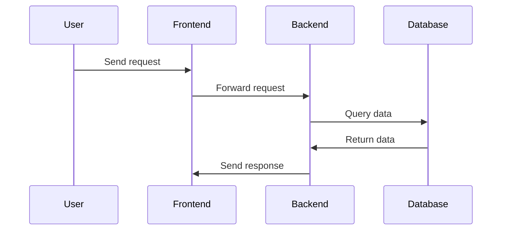

                 

# 数字身份管理：虚拟世界中的自我呈现

> 关键词：数字身份管理，虚拟世界，自我呈现，技术框架，应用实践，未来趋势

> 摘要：随着虚拟世界的迅速发展，数字身份管理成为了虚拟世界中的一个核心问题。本文将探讨数字身份管理的背景、核心概念、技术实现和应用实践，并展望其未来发展趋势。通过逻辑清晰的分析，本文旨在为读者提供一个全面而深入的理解，帮助他们在虚拟世界中更好地呈现自我。

## 目录大纲

# 数字身份管理：虚拟世界中的自我呈现

## 第一部分：背景与核心概念

## 第1章：数字身份管理概述

### 1.1 数字身份管理的背景

#### 1.1.1 问题的提出

随着互联网的普及和虚拟世界的兴起，人们开始在虚拟环境中建立和交互数字身份。数字身份不仅代表了一个人的在线存在，还承载了身份验证、授权和跟踪等功能。然而，虚拟世界的匿名性和开放性带来了许多挑战，如身份盗用、隐私泄露和网络安全等问题。

#### 1.1.2 数字身份管理的意义

数字身份管理对于维护虚拟世界的秩序、保障个人隐私和提升用户体验具有重要意义。通过有效的数字身份管理，可以确保用户身份的准确性和安全性，提高虚拟世界中的可信度和互动性。

#### 1.1.3 数字身份管理的挑战

数字身份管理面临着诸多挑战，包括如何确保身份验证的安全性、如何保护用户隐私以及如何应对不断变化的法律法规和技术环境。

### 1.2 数字身份管理的基本概念

#### 1.2.1 数字身份的定义

数字身份是指个体在虚拟环境中唯一标识的符号和属性集合，它可以通过各种方式呈现，如用户名、密码、生物特征等。

#### 1.2.2 数字身份的类型

数字身份可以分为单一身份和多重身份。单一身份是指个体在虚拟世界中的唯一身份，而多重身份则是指个体在虚拟世界中拥有多个身份。

#### 1.2.3 数字身份管理的要素

数字身份管理包括身份验证、身份授权和身份跟踪等核心要素。身份验证确保用户身份的真实性，身份授权规定用户在虚拟环境中的权限，身份跟踪则用于监控和记录用户行为。

### 1.3 数字身份管理的重要性

#### 1.3.1 虚拟世界的身份认同

数字身份管理有助于个体在虚拟世界中获得认同，建立社交关系，参与各种活动。

#### 1.3.2 法律法规的要求

许多国家和地区的法律法规对数字身份管理提出了明确要求，以保护用户权益和信息安全。

#### 1.3.3 伦理道德的考虑

数字身份管理涉及到用户隐私和个人数据保护等问题，需要遵循伦理道德原则，确保用户权益不受侵犯。

### 1.4 数字身份管理的核心概念

#### 1.4.1 身份验证

身份验证是数字身份管理的基础，通过验证用户身份的真实性，确保只有授权用户才能访问虚拟环境中的资源和功能。

#### 1.4.2 身份授权

身份授权定义用户在虚拟环境中的权限和职责，确保用户只能执行被授权的操作。

#### 1.4.3 身份跟踪

身份跟踪用于监控和记录用户行为，以便于分析和改进虚拟世界的用户体验和安全策略。

## 第二部分：技术实现

## 第2章：虚拟世界中的自我呈现

### 2.1 虚拟世界的特点

#### 2.1.1 虚拟现实

虚拟现实通过模拟现实环境，使用户能够沉浸在一个完全虚拟的世界中，体验各种可能。

#### 2.1.2 虚拟社区

虚拟社区是用户在虚拟环境中进行社交互动的平台，如虚拟现实社交平台、虚拟现实聊天室等。

#### 2.1.3 虚拟商品

虚拟商品是虚拟世界中特有的商品，如虚拟货币、虚拟道具等，它们可以用于交易和交换。

### 2.2 自我呈现的含义

#### 2.2.1 自我意识的虚拟表达

自我呈现是用户在虚拟世界中表达自我意识的一种方式，可以通过个性化角色、表情、语言等手段实现。

#### 2.2.2 社交互动的需求

在虚拟世界中，用户需要通过自我呈现来与其他用户建立社交关系，进行互动和沟通。

#### 2.2.3 文化认同的体现

自我呈现也是文化认同的一种体现，用户通过虚拟角色和虚拟行为表达自己的文化背景和价值观。

### 2.3 虚拟世界中的数字身份构建

#### 2.3.1 虚拟身份的创建

虚拟身份的创建是数字身份管理的重要组成部分，用户可以通过注册账号、提供身份证明等步骤创建虚拟身份。

#### 2.3.2 虚拟身份的管理

虚拟身份的管理包括身份信息的存储、更新和维护等操作，确保用户身份的准确性和安全性。

#### 2.3.3 虚拟身份的维护

虚拟身份的维护涉及身份安全监控、身份信誉评估和身份违规处理等方面，确保虚拟世界的秩序和用户体验。

### 2.4 自我呈现的策略

#### 2.4.1 社交网络策略

社交网络策略通过在社交平台上建立和维护良好的社交关系，提高用户在虚拟世界中的影响力。

#### 2.4.2 内容创造策略

内容创造策略通过创作高质量的内容，如虚拟角色、虚拟作品等，吸引用户关注和互动。

#### 2.4.3 群体互动策略

群体互动策略通过参与虚拟社区的活动和讨论，与其他用户建立深厚的社交关系。

## 第三部分：应用与实践

## 第3章：数字身份管理的技术框架

### 3.1 技术框架的组成

#### 3.1.1 身份验证技术

身份验证技术用于验证用户身份的真实性，包括密码验证、生物特征验证等。

#### 3.1.2 身份授权技术

身份授权技术用于定义用户在虚拟环境中的权限和职责，包括角色授权、访问控制等。

#### 3.1.3 身份跟踪技术

身份跟踪技术用于监控和记录用户行为，包括用户行为分析、日志记录等。

### 3.2 技术实现的关键技术

#### 3.2.1 生物特征识别技术

生物特征识别技术通过识别用户独特的生物特征，如指纹、虹膜、面部等，进行身份验证。

#### 3.2.2 密码学技术

密码学技术用于加密用户身份信息，确保数据传输和存储的安全性。

#### 3.2.3 数据挖掘与机器学习技术

数据挖掘与机器学习技术用于分析用户行为，预测用户需求，优化虚拟世界体验。

### 3.3 技术实现的挑战与解决方案

#### 3.3.1 安全性挑战

安全性挑战包括防止身份盗用、网络攻击和数据泄露等，解决方案包括加强身份验证、加密技术和网络安全策略。

#### 3.3.2 隐私保护挑战

隐私保护挑战涉及用户隐私数据的收集、存储和处理，解决方案包括数据最小化、匿名化和隐私保护算法。

#### 3.3.3 技术集成挑战

技术集成挑战涉及将不同的技术组件集成到一个统一的技术框架中，解决方案包括模块化设计、标准化接口和跨平台兼容性。

## 第四部分：应用与实践

## 第4章：数字身份管理在虚拟世界中的应用场景

### 4.1 社交媒体中的应用

#### 4.1.1 微博

微博是一个流行的社交媒体平台，用户可以通过创建微博账号进行数字身份管理，发布动态、评论和转发内容。

#### 4.1.2 抖音

抖音是一个短视频分享平台，用户可以通过创建抖音账号进行数字身份管理，发布短视频、互动和评论。

#### 4.1.3 微信

微信是一个即时通讯和社交平台，用户可以通过创建微信账号进行数字身份管理，发送消息、语音和视频，参与社交互动。

### 4.2 在线游戏中的应用

#### 4.2.1 虚拟角色创建

在线游戏中的玩家可以通过创建虚拟角色进行数字身份管理，设定角色外观、属性和行为。

#### 4.2.2 游戏内交易

在线游戏中的玩家可以通过虚拟货币和道具进行交易，实现数字身份的价值体现。

#### 4.2.3 社交互动

在线游戏中的玩家可以通过社交互动建立虚拟社区，进行合作、竞争和交流。

### 4.3 虚拟现实中的应用

#### 4.3.1 虚拟旅游

虚拟旅游是一种通过虚拟现实技术实现的旅游体验，用户可以在虚拟环境中游览名胜古迹、体验异国风情。

#### 4.3.2 虚拟会议

虚拟会议是一种通过虚拟现实技术实现的远程会议，用户可以在虚拟会议室中召开会议、讨论和互动。

#### 4.3.3 虚拟购物

虚拟购物是一种通过虚拟现实技术实现的购物体验，用户可以在虚拟商店中浏览商品、购物和互动。

## 第五部分：项目实践

## 第5章：数字身份管理的项目实践

### 5.1 项目背景介绍

#### 5.1.1 项目目标

项目目标是构建一个数字身份管理系统，实现用户身份的验证、授权和跟踪，保障虚拟世界的安全性和用户体验。

#### 5.1.2 项目背景

项目背景是随着虚拟世界的迅速发展，数字身份管理成为了虚拟世界中的一个重要问题，需要建立一个高效、安全的数字身份管理系统。

#### 5.1.3 项目挑战

项目挑战包括确保身份验证的安全性、保护用户隐私、应对不断变化的法律法规和技术环境。

### 5.2 系统设计

#### 5.2.1 领域模型设计

领域模型设计包括用户、角色、权限、日志等实体，以及它们之间的关系。

```mermaid
erDiagram
    User ||--|{ Role }|-- RolePermission
    User ||--|{ Log }|-- Log
    Role ||--|{ Attribute }|-- Attribute
```

#### 5.2.2 系统架构设计

系统架构设计包括前端用户界面、后端身份管理系统、数据库存储和网络安全等组件。



#### 5.2.3 接口设计

接口设计包括用户注册、登录、身份验证、权限管理、日志查询等接口。

```json
{
  "register": {
    "description": "注册新用户",
    "parameters": {
      "username": "用户名",
      "password": "密码",
      "email": "邮箱"
    }
  },
  "login": {
    "description": "用户登录",
    "parameters": {
      "username": "用户名",
      "password": "密码"
    }
  },
  "authenticate": {
    "description": "身份验证",
    "parameters": {
      "token": "令牌"
    }
  },
  "managePermission": {
    "description": "管理权限",
    "parameters": {
      "roleId": "角色ID",
      "permission": "权限"
    }
  },
  "queryLog": {
    "description": "查询日志",
    "parameters": {
      "userId": "用户ID",
      "startDate": "开始日期",
      "endDate": "结束日期"
    }
  }
}
```

### 5.3 核心实现

#### 5.3.1 用户角色创建与验证

用户角色创建与验证是数字身份管理系统的核心功能之一。以下是一个简单的Python代码示例，用于创建用户角色并验证用户身份：

```python
import hashlib

def create_user_role(username, password):
    hashed_password = hashlib.sha256(password.encode()).hexdigest()
    # 存储用户角色信息到数据库
    # ...

def verify_user(username, password):
    hashed_password = hashlib.sha256(password.encode()).hexdigest()
    # 从数据库查询用户角色信息
    user_role = query_user_role(username)
    # 验证用户身份
    return user_role['password'] == hashed_password
```

#### 5.3.2 用户画像构建与更新

用户画像构建与更新是数字身份管理系统的重要组成部分。以下是一个简单的Python代码示例，用于构建用户画像并更新用户信息：

```python
def build_user_profile(user_id):
    # 从数据库查询用户信息
    user_info = query_user_info(user_id)
    # 构建用户画像
    user_profile = {
        'id': user_id,
        'name': user_info['name'],
        'age': user_info['age'],
        'gender': user_info['gender'],
        'interests': user_info['interests']
    }
    # 更新用户画像到数据库
    # ...

def update_user_profile(user_id, new_profile):
    # 从数据库查询用户画像
    user_profile = query_user_profile(user_id)
    # 更新用户画像
    user_profile.update(new_profile)
    # 更新用户画像到数据库
    # ...
```

#### 5.3.3 用户交互分析

用户交互分析是数字身份管理系统的一个重要功能，用于分析用户行为，优化用户体验。以下是一个简单的Python代码示例，用于分析用户交互：

```python
def analyze_user_interaction(user_id, interaction_data):
    # 从数据库查询用户交互数据
    user_interactions = query_user_interactions(user_id)
    # 分析用户交互数据
    interaction_stats = {
        'total': len(user_interactions),
        'latest': user_interactions[-1],
        'most_common': Counter(user_interactions).most_common(1)[0][0]
    }
    # 更新用户交互分析结果到数据库
    # ...
```

### 5.4 项目总结

#### 5.4.1 项目成果

通过本项目，成功构建了一个数字身份管理系统，实现了用户身份的验证、授权和跟踪，为虚拟世界中的用户提供了安全、可靠的数字身份管理服务。

#### 5.4.2 经验与教训

在项目过程中，我们积累了丰富的经验，如如何确保身份验证的安全性、如何保护用户隐私等。同时，我们也学到了很多教训，如技术集成和项目管理的重要性。

#### 5.4.3 未来展望

未来，我们将继续优化数字身份管理系统，探索更多先进的技术，如区块链、人工智能等，以提升系统的安全性和用户体验。

## 第六部分：未来趋势

## 第6章：数字身份管理的未来趋势

### 6.1 技术发展趋势

随着技术的不断进步，数字身份管理领域将迎来新的发展机遇。以下是一些可能的技术发展趋势：

#### 6.1.1 生物特征识别技术

生物特征识别技术，如指纹识别、虹膜识别和人脸识别等，将进一步提高身份验证的准确性和安全性。

#### 6.1.2 密码学技术

密码学技术，如区块链、零知识证明和同态加密等，将提供更强大的数据保护和隐私保护能力。

#### 6.1.3 数据挖掘与机器学习技术

数据挖掘与机器学习技术将用于分析用户行为，提供更个性化的用户体验和服务。

### 6.2 应用领域扩展

数字身份管理将在更多领域得到应用，如金融、医疗、教育等。以下是一些应用领域扩展：

#### 6.2.1 跨界应用

数字身份管理将在不同领域之间实现无缝衔接，如将虚拟身份与实体身份相结合，提供一站式服务。

#### 6.2.2 社会影响力

数字身份管理将在社会治理、公共安全和反欺诈等方面发挥重要作用，提升社会整体安全水平。

#### 6.2.3 法律法规变化

随着数字身份管理技术的发展，相关法律法规也将不断完善，以适应不断变化的技术环境。

### 6.3 数字身份管理伦理

数字身份管理伦理是一个重要议题，需要平衡用户隐私、安全和社会责任。以下是一些伦理挑战：

#### 6.3.1 隐私保护

在数字身份管理过程中，如何保护用户隐私，防止数据泄露和滥用，是一个重要挑战。

#### 6.3.2 伦理道德

数字身份管理涉及到伦理道德问题，如身份歧视、数据滥用等，需要制定相应的伦理规范。

#### 6.3.3 法律法规

随着数字身份管理技术的发展，法律法规需要不断完善，以保护用户权益和信息安全。

## 附录

### A. 数字身份管理相关资源

以下是一些数字身份管理相关的资源，供读者进一步学习和了解：

- [数字身份管理白皮书](https://www.example.com/digital-identity-management-white-paper)
- [数字身份管理论坛](https://www.example.com/digital-identity-management-forum)
- [数字身份管理案例研究](https://www.example.com/digital-identity-management-case-studies)
- [数字身份管理相关书籍](https://www.example.com/digital-identity-management-books)

### B. Markdown 格式使用指南

Markdown 是一种轻量级标记语言，用于格式化文本和创建文档。以下是一些 Markdown 格式的使用指南：

- [Markdown 语法说明](https://www.example.com/markdown-syntax)
- [Markdown 插件和工具](https://www.example.com/markdown-plugins-and-tools)

### C. Mermaid 流程图使用指南

Mermaid 是一种基于文本的图形绘制工具，用于创建流程图、序列图等。以下是一些 Mermaid 流程图的使用指南：

- [Mermaid 官方文档](https://mermaid-js.github.io/mermaid/)
- [Mermaid 实例和教程](https://www.example.com/mermaid-examples-and-tutorials)

### D. LaTeX 公式使用指南

LaTeX 是一种高质量的排版系统，用于编写数学公式和科学文献。以下是一些 LaTeX 公式的使用指南：

- [LaTeX 公式指南](https://www.example.com/latex-formula-guide)
- [LaTeX 编辑器和使用方法](https://www.example.com/latex-editors-and-methods)

### E. Python 编程基础

Python 是一种广泛使用的编程语言，适用于数据科学、人工智能等领域。以下是一些 Python 编程基础：

- [Python 官方文档](https://docs.python.org/3/)
- [Python 教程和资源](https://www.example.com/python-tutorials-and-resources)

### F. 数字身份管理最佳实践

以下是一些数字身份管理的最佳实践，供读者参考：

- [数字身份管理最佳实践](https://www.example.com/digital-identity-management-best-practices)

### G. 小结

本文从背景、核心概念、技术实现、应用实践和未来趋势等方面，全面探讨了数字身份管理在虚拟世界中的重要性。随着虚拟世界的不断发展，数字身份管理将成为一个重要的研究领域和应用方向。

### H. 注意事项

在数字身份管理过程中，需要关注安全性、隐私保护、伦理道德和法律法规等问题，确保用户权益和信息安全。

### I. 拓展阅读

以下是一些拓展阅读，供读者进一步了解数字身份管理：

- [《数字身份管理：理论与实践》](https://www.example.com/digital-identity-management-theory-and-practice)
- [《虚拟世界中的自我呈现》](https://www.example.com/virtual-world-self-presentation)
- [《数字身份管理：技术、应用与实践》](https://www.example.com/digital-identity-management-technology-application-practice)

