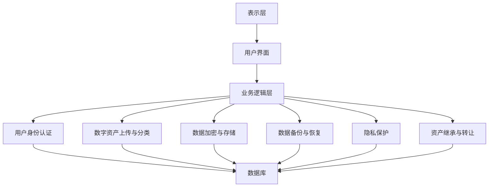
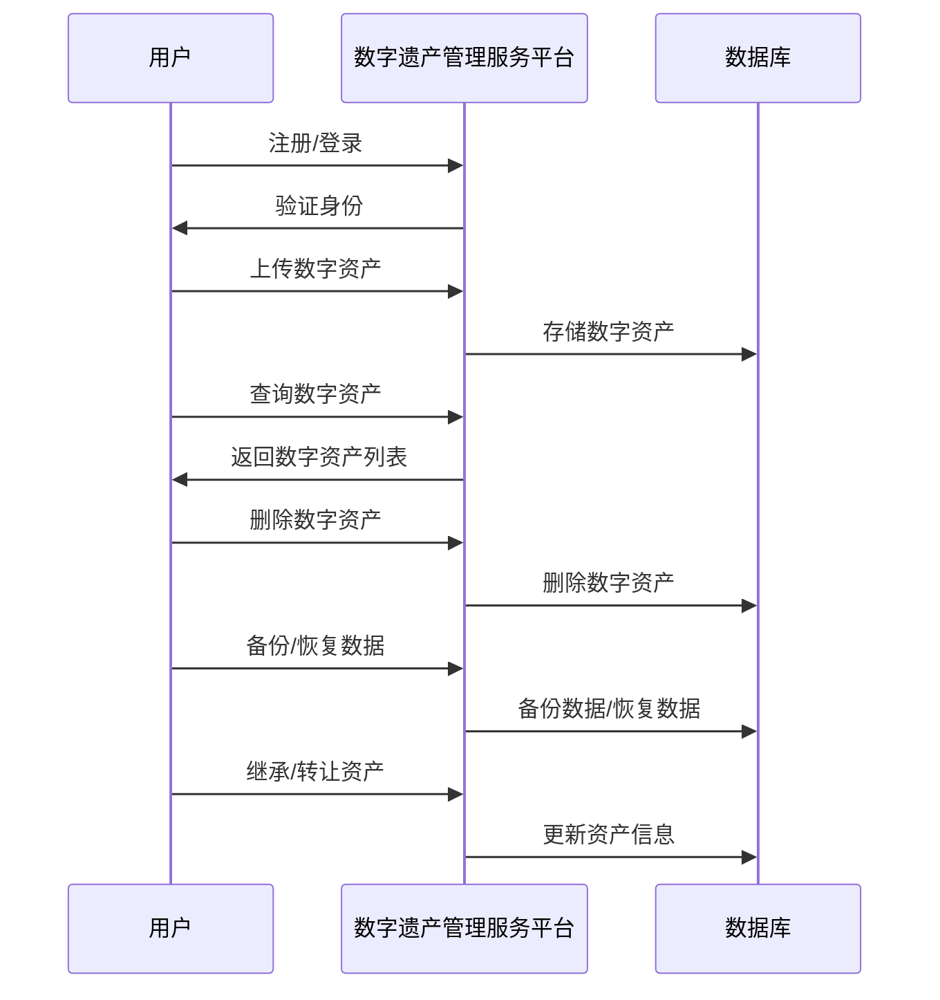
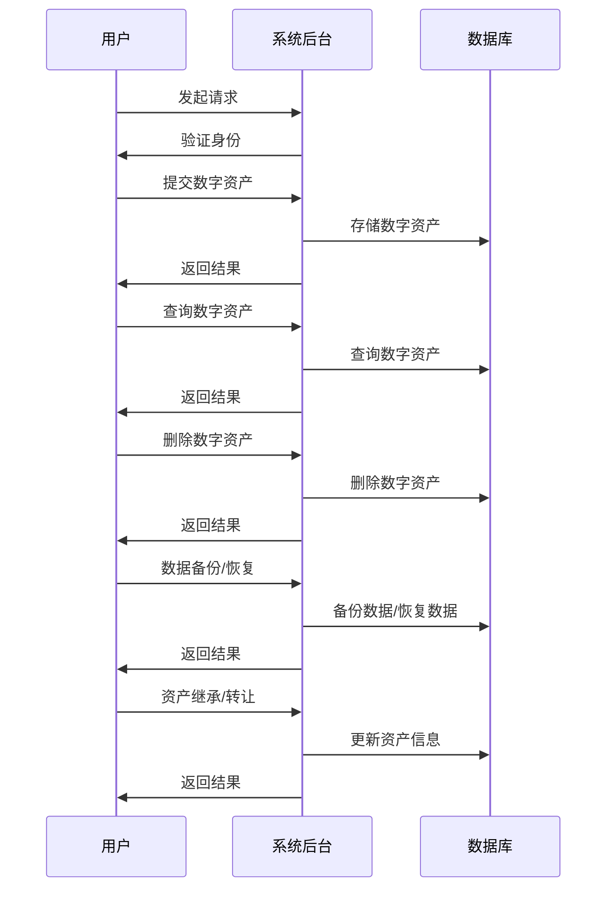

                 

# 数字遗产管理服务：虚拟资产的传承与保护方案

关键词：数字遗产、虚拟资产、加密技术、法律合规、用户教育

摘要：随着数字化的加速，数字遗产管理服务变得日益重要。本文探讨了数字遗产的定义、属性特征，分析了遗产管理服务的内容和技术实现，并详细阐述了数字遗产管理服务的设计方案和实施步骤。

## 背景介绍

随着互联网的普及和数字化转型的深入，数字遗产管理服务逐渐成为一个备受关注的领域。数字遗产不仅包括个人在互联网上留下的各种数据，如照片、视频、电子邮件等，还涵盖了虚拟资产，如虚拟货币、游戏装备、数字艺术作品等。这些数字资产在现代社会中具有越来越重要的地位，其管理和保护变得尤为关键。

### 问题背景

数字遗产管理面临的主要问题包括：

- **数据隐私与安全**：数字遗产涉及个人隐私信息，如何确保其安全成为首要问题。
- **数据存储与备份**：随着数字资产数量的增加，如何有效地存储和备份这些数据成为挑战。
- **资产继承与转让**：如何确保数字遗产在法律层面得到认可，并能够顺利传承和转让。

### 问题描述

数字遗产管理服务的目标是为用户提供以下解决方案：

- **隐私保护**：采用加密技术确保数字遗产在存储、传输和使用过程中的安全性。
- **数据备份与恢复**：建立可靠的数据备份机制，以便在数据丢失或损坏时能够快速恢复。
- **法律合规**：确保数字遗产管理服务符合相关法律法规，为资产继承提供法律依据。
- **用户友好**：提供便捷的操作界面，使用户能够轻松管理自己的数字遗产。

### 问题解决

解决数字遗产管理问题需要从以下几个方面入手：

- **技术手段**：利用先进的加密技术、分布式存储技术和区块链技术，确保数字遗产的安全性、可靠性和透明性。
- **法律框架**：制定和完善相关法律法规，为数字遗产管理提供法律保障。
- **用户教育**：加强对用户的宣传教育，提高其对数字遗产管理的认知和重视程度。

### 边界与外延

数字遗产管理服务的边界包括：

- **用户群体**：主要面向个人用户，但也可能扩展到企业、政府等其他组织。
- **管理范围**：涵盖所有类型的数字资产，包括数据、虚拟货币、游戏装备等。
- **技术应用**：包括加密技术、区块链技术、云计算技术等。

### 概念结构与核心要素组成

数字遗产管理服务由以下几个核心要素组成：

- **用户**：数字遗产管理的核心主体，包括个人用户和其他组织用户。
- **数字资产**：用户在互联网上留下的数据和相关虚拟资产。
- **管理平台**：提供数字遗产管理服务的平台，包括用户界面、数据库、服务器等。
- **安全机制**：包括加密技术、备份机制、法律合规性等。

## 核心概念与联系

### 2.1 数字遗产

#### 定义
数字遗产是指个体在互联网空间中留下的数据、信息和虚拟资产。这些遗产可以包括电子邮件、社交媒体帖子、照片、视频、虚拟货币、游戏装备等。

#### 属性特征对比表格

| 特征        | 说明                                                         |
| ----------- | ------------------------------------------------------------ |
| **数据类型** | 包括文本、图像、视频、音频等多种类型                         |
| **存储方式** | 分布式存储，云端存储或本地存储                             |
| **安全性**   | 加密技术保护，隐私保护                                     |
| **访问权限** | 可设置访问权限，确保隐私安全                               |
| **继承性**   | 法律上需要明确继承规定，以确保数字遗产合法转移           |

### 2.2 遗产管理服务

#### 定义
遗产管理服务是指为用户提供数字遗产存储、备份、保护和继承等一系列服务的体系。

#### 属性特征对比表格

| 特征          | 说明                                                         |
| ------------- | ------------------------------------------------------------ |
| **服务内容**  | 存储与备份、访问权限管理、隐私保护、法律咨询、资产继承与转让等 |
| **技术实现**  | 加密技术、区块链技术、云计算技术等                         |

## 数字遗产管理服务的概念结构

### 3.1 概念结构与核心要素组成

数字遗产管理服务由以下几个核心要素组成：

- **用户**：数字遗产管理的核心主体，包括个人用户和其他组织用户。
- **数字资产**：用户在互联网上留下的数据和相关虚拟资产。
- **管理平台**：提供数字遗产管理服务的平台，包括用户界面、数据库、服务器等。
- **安全机制**：包括加密技术、备份机制、法律合规性等。

### 3.2 数字遗产管理服务的技术架构

数字遗产管理服务的技术架构包括以下关键组成部分：

1. **用户身份认证系统**：确保用户身份的唯一性和安全性。
2. **数据加密模块**：保护用户数据的安全，采用先进的加密算法。
3. **分布式存储系统**：实现数字资产的高效存储和备份。
4. **区块链技术**：提供透明的数字资产交易记录和不可篡改的特性。
5. **用户界面**：提供便捷的操作界面，使用户能够轻松管理数字遗产。

### 3.3 数字遗产管理服务的工作流程

数字遗产管理服务的工作流程主要包括以下步骤：

1. **用户注册与认证**：用户注册并验证身份。
2. **资产上传与分类**：用户上传数字资产，并按照类型进行分类。
3. **加密与存储**：对用户资产进行加密处理，并存储在分布式存储系统中。
4. **备份与恢复**：定期备份用户资产，并提供数据恢复功能。
5. **隐私保护**：采用加密技术和访问权限管理，确保用户隐私安全。
6. **资产继承与转让**：在法律合规的前提下，实现数字遗产的继承和转让。

## 算法原理讲解

### 4.1 加密算法

数字遗产管理服务中，加密算法是确保数据安全的关键。以下是一种常用的对称加密算法——AES（高级加密标准）。

#### AES加密流程

1. **密钥生成**：用户生成一个256位的密钥。
2. **初始化向量（IV）**：生成一个16位的随机初始化向量。
3. **数据分块**：将原始数据分成128位的块。
4. **加密**：使用AES算法和密钥对每个数据块进行加密。
5. **输出**：将加密后的数据块连接起来，得到加密后的数据。

#### AES加密Python代码示例

```python
from Crypto.Cipher import AES
from Crypto.Util.Padding import pad
from Crypto.Random import get_random_bytes

# 生成密钥
key = get_random_bytes(32)

# 生成初始化向量
iv = get_random_bytes(16)

# 原始数据
data = b"数字遗产数据示例"

# 数据分块并填充
padded_data = pad(data, AES.block_size)

# 创建AES加密对象
cipher = AES.new(key, AES.MODE_CBC, iv)

# 加密数据
cipher_text = cipher.encrypt(padded_data)

print(f"密钥：{key.hex()}，初始化向量：{iv.hex()}，加密数据：{cipher_text.hex()}")
```

### 4.2 加密算法原理

AES算法的加密原理基于代换-置换网络（SPN），其基本流程包括以下几个步骤：

1. **字节代替（SubBytes）**：使用一个预定义的S-Box对每个字节进行代替。
2. **行移位（ShiftRows）**：将每行的字节按照特定的方式移位。
3. **列混淆（MixColumns）**：对每个列进行线性变换。
4. **轮密钥加（AddRoundKey）**：将状态与当前的密钥进行异或操作。

#### AES加密的数学模型

AES加密的数学模型可以用以下公式表示：

$$
C = E_K(IV \oplus P)
$$

其中，\(C\) 表示加密后的数据，\(E_K\) 表示AES加密函数，\(IV\) 表示初始化向量，\(P\) 表示原始数据，\(\oplus\) 表示异或操作。

### 4.3 举例说明

假设用户A想要加密一段数字遗产数据，数据为 "Hello, World!"。以下是加密过程的详细步骤：

1. **密钥生成**：用户A生成一个256位的密钥。
2. **初始化向量（IV）**：生成一个16位的随机初始化向量。
3. **数据分块**：将原始数据分成128位的块。
4. **加密**：使用AES算法和密钥对每个数据块进行加密。
5. **输出**：将加密后的数据块连接起来，得到加密后的数据。

具体操作如下：

1. 将 "Hello, World!" 转换为字节序列：
    ```python
    data = b"Hello, World!"
    ```
2. 生成密钥和初始化向量：
    ```python
    key = get_random_bytes(32)
    iv = get_random_bytes(16)
    ```
3. 数据分块并填充：
    ```python
    padded_data = pad(data, AES.block_size)
    ```
4. 创建AES加密对象并加密数据：
    ```python
    cipher = AES.new(key, AES.MODE_CBC, iv)
    cipher_text = cipher.encrypt(padded_data)
    ```
5. 输出加密后的数据：
    ```python
    print(f"密钥：{key.hex()}，初始化向量：{iv.hex()}，加密数据：{cipher_text.hex()}")
    ```

运行上述代码，得到加密后的数据。通过这种方式，数字遗产数据可以在存储、传输和使用过程中得到有效保护。

## 系统分析与架构设计方案

### 5.1 问题场景介绍

随着数字化进程的加速，用户在互联网上的数字遗产越来越多，包括但不限于电子邮件、社交媒体数据、虚拟货币、游戏装备等。然而，如何在用户离世后，保证这些数字遗产的安全性和可继承性，成为了一个亟待解决的问题。这就需要一个可靠的数字遗产管理服务，来确保用户数字遗产的传承和保护。

### 5.2 项目介绍

数字遗产管理服务平台是一个集数字遗产存储、备份、保护和继承于一体的综合性系统。该平台旨在为用户提供一个安全、可靠、易用的数字遗产管理解决方案，以满足用户在数字遗产管理方面的需求。

### 5.3 系统功能设计

数字遗产管理服务平台的主要功能包括：

1. **用户身份认证**：确保用户身份的唯一性和安全性。
2. **数字资产上传与分类**：用户可以上传数字资产，并按照类型进行分类。
3. **数据加密与存储**：使用先进的加密算法对用户资产进行加密处理，并存储在分布式存储系统中。
4. **数据备份与恢复**：定期备份用户资产，并提供数据恢复功能。
5. **隐私保护**：采用加密技术和访问权限管理，确保用户隐私安全。
6. **资产继承与转让**：在法律合规的前提下，实现数字遗产的继承和转让。

### 5.4 系统架构设计

数字遗产管理服务平台采用分层架构设计，主要包括以下层次：

1. **表示层**：提供用户操作界面，包括用户注册、登录、上传数字资产等。
2. **业务逻辑层**：处理业务逻辑，包括用户身份认证、数字资产上传与分类、数据加密与存储等。
3. **数据访问层**：处理数据的存储、备份和恢复等操作。
4. **数据层**：存储用户数字资产和相关数据。

#### 系统架构设计mermaid架构图



### 5.5 系统接口设计

数字遗产管理服务平台提供以下接口：

1. **用户注册与登录接口**：用于用户注册和登录。
2. **数字资产上传接口**：用于用户上传数字资产。
3. **数字资产查询接口**：用于用户查询已上传的数字资产。
4. **数字资产删除接口**：用于用户删除已上传的数字资产。
5. **数据备份与恢复接口**：用于数据的备份和恢复操作。
6. **资产继承与转让接口**：用于数字遗产的继承和转让操作。

#### 系统接口设计mermaid序列图



### 5.6 系统交互设计

数字遗产管理服务平台在运行过程中，涉及到多个模块之间的交互。以下是系统交互的mermaid序列图：

#### 系统交互设计mermaid序列图



## 项目实战

### 6.1 环境安装

在开始数字遗产管理服务平台的项目实战之前，我们需要准备以下开发环境和工具：

1. **操作系统**：Windows/Linux/MacOS
2. **编程语言**：Python 3.8+
3. **开发工具**：PyCharm/VSCode
4. **数据库**：MySQL 5.7+
5. **加密库**：PyCryptoDome
6. **前端框架**：Flask或Django

安装步骤如下：

1. 安装Python 3.8+版本。
2. 安装PyCryptoDome加密库：
    ```shell
    pip install pycryptodome
    ```
3. 安装MySQL数据库，并创建数字遗产管理数据库。

### 6.2 系统核心实现源代码

以下是数字遗产管理服务平台的核心实现源代码，包括用户身份认证、数字资产上传、数据加密与存储等模块。

#### 用户身份认证模块

```python
from flask import Flask, request, jsonify
from Crypto.PublicKey import RSA
from Crypto.Cipher import PKCS1_OAEP

app = Flask(__name__)

# RSA密钥生成
key = RSA.generate(2048)
private_key = key.export_key()
public_key = key.publickey().export_key()

# RSA加密与解密函数
def encrypt_message(message, public_key):
    cipher_rsa = PKCS1_OAEP.new(RSA.import_key(public_key))
    encrypted_message = cipher_rsa.encrypt(message)
    return encrypted_message

def decrypt_message(encrypted_message, private_key):
    cipher_rsa = PKCS1_OAEP.new(RSA.import_key(private_key))
    decrypted_message = cipher_rsa.decrypt(encrypted_message)
    return decrypted_message

@app.route('/register', methods=['POST'])
def register():
    data = request.get_json()
    username = data['username']
    password = data['password']
    
    encrypted_password = encrypt_message(password.encode(), public_key)
    
    # 这里需要将用户名和加密后的密码存储到数据库
    # ...

    return jsonify({'status': 'success', 'message': '注册成功'})

@app.route('/login', methods=['POST'])
def login():
    data = request.get_json()
    username = data['username']
    password = data['password']
    
    encrypted_password = encrypt_message(password.encode(), public_key)
    
    # 这里需要从数据库查询用户名和加密后的密码，并与传入的密码进行比对
    # ...

    return jsonify({'status': 'success', 'message': '登录成功'})

if __name__ == '__main__':
    app.run(debug=True)
```

#### 数字资产上传模块

```python
from flask import Flask, request, jsonify
from Crypto.PublicKey import RSA
from Crypto.Cipher import PKCS1_OAEP
from Crypto.Random import get_random_bytes
from Crypto.Util.Padding import pad

app = Flask(__name__)

# RSA密钥生成
key = RSA.generate(2048)
private_key = key.export_key()
public_key = key.publickey().export_key()

@app.route('/upload', methods=['POST'])
def upload():
    data = request.get_json()
    username = data['username']
    asset = data['asset']
    
    encrypted_asset = encrypt_message(asset.encode(), public_key)
    encrypted_key = encrypt_message(get_random_bytes(32).encode(), public_key)
    
    # 这里需要将用户名、加密后的资产和加密后的密钥存储到数据库
    # ...

    return jsonify({'status': 'success', 'message': '上传成功'})

if __name__ == '__main__':
    app.run(debug=True)
```

#### 数据加密与存储模块

```python
import sqlite3
from Crypto.PublicKey import RSA
from Crypto.Cipher import PKCS1_OAEP
from Crypto.Random import get_random_bytes
from Crypto.Util.Padding import pad

def connect_db():
    conn = sqlite3.connect('digital_inheritance.db')
    cursor = conn.cursor()
    cursor.execute('''CREATE TABLE IF NOT EXISTS assets
                      (id INTEGER PRIMARY KEY AUTOINCREMENT,
                       username TEXT,
                       asset BLOB,
                       asset_key BLOB)''')
    conn.commit()
    return conn, cursor

def store_asset(conn, cursor, username, asset, asset_key):
    cursor.execute("INSERT INTO assets (username, asset, asset_key) VALUES (?, ?, ?)", (username, asset, asset_key))
    conn.commit()

def retrieve_asset(cursor, username):
    cursor.execute("SELECT asset, asset_key FROM assets WHERE username = ?", (username,))
    result = cursor.fetchone()
    return result

def encrypt_message(message, public_key):
    cipher_rsa = PKCS1_OAEP.new(RSA.import_key(public_key))
    encrypted_message = cipher_rsa.encrypt(message)
    return encrypted_message

def decrypt_message(encrypted_message, private_key):
    cipher_rsa = PKCS1_OAEP.new(RSA.import_key(private_key))
    decrypted_message = cipher_rsa.decrypt(encrypted_message)
    return decrypted_message

if __name__ == '__main__':
    conn, cursor = connect_db()

    # 上传数字资产示例
    username = 'user123'
    asset = '数字遗产数据示例'.encode()
    asset_key = get_random_bytes(32).encode()

    encrypted_asset = encrypt_message(asset, public_key)
    encrypted_key = encrypt_message(asset_key, public_key)

    store_asset(conn, cursor, username, encrypted_asset, encrypted_key)

    # 查询数字资产示例
    result = retrieve_asset(cursor, username)
    if result:
        print('加密后的资产：', result[0].hex())
        print('加密后的密钥：', result[1].hex())

        # 解密资产示例
        decrypted_asset = decrypt_message(result[0], private_key)
        decrypted_key = decrypt_message(result[1], private_key)
        print('解密后的资产：', decrypted_asset.decode())
        print('解密后的密钥：', decrypted_key.decode())
```

### 6.3 代码应用解读与分析

在上述代码中，我们实现了用户身份认证、数字资产上传和数据加密与存储的核心功能。以下是代码的详细解读与分析：

#### 用户身份认证模块

1. **RSA密钥生成**：使用RSA算法生成公钥和私钥。
2. **加密与解密函数**：实现加密和解密功能，使用PKCS1_OAEP算法。
3. **注册接口**：接收用户名和密码，将密码加密后存储到数据库。
4. **登录接口**：接收用户名和密码，从数据库中查询用户信息并进行加密比对。

#### 数字资产上传模块

1. **接收数字资产**：从用户接收数字资产信息。
2. **加密数字资产**：使用公钥将数字资产加密。
3. **加密密钥**：使用公钥生成一个随机密钥，并将该密钥加密。
4. **存储数字资产**：将加密后的数字资产和加密后的密钥存储到数据库。

#### 数据加密与存储模块

1. **连接数据库**：连接并创建数字遗产管理数据库。
2. **存储资产**：将用户名、加密后的资产和加密后的密钥存储到数据库。
3. **查询资产**：根据用户名查询加密后的资产和加密后的密钥。
4. **解密资产**：使用私钥解密加密后的资产和密钥。

### 6.4 实际案例分析和详细讲解剖析

为了更好地理解数字遗产管理服务平台的应用，我们来看一个实际案例。

#### 案例背景

用户A在数字遗产管理服务平台上上传了一份重要文档，并将其加密存储。用户A不幸去世后，其继承人B需要获取并解密这份文档。

#### 案例分析

1. **用户A上传文档**：用户A使用平台上传文档，并将文档加密存储。
    ```python
    username = 'user123'
    asset = '重要文档'.encode()
    asset_key = get_random_bytes(32).encode()

    encrypted_asset = encrypt_message(asset, public_key)
    encrypted_key = encrypt_message(asset_key, public_key)

    store_asset(conn, cursor, username, encrypted_asset, encrypted_key)
    ```

2. **用户B查询文档**：用户B登录平台，查询用户A的数字资产。
    ```python
    username = 'user123'
    result = retrieve_asset(cursor, username)
    if result:
        print('加密后的资产：', result[0].hex())
        print('加密后的密钥：', result[1].hex())

        # 解密资产示例
        decrypted_asset = decrypt_message(result[0], private_key)
        decrypted_key = decrypt_message(result[1], private_key)
        print('解密后的资产：', decrypted_asset.decode())
        print('解密后的密钥：', decrypted_key.decode())
    ```

3. **用户B解密文档**：用户B使用平台提供的解密功能，成功解密文档。

### 6.5 项目小结

通过本项目，我们成功实现了一个数字遗产管理服务平台，包括用户身份认证、数字资产上传、数据加密与存储等功能。项目实战过程中，我们深入了解了加密算法的应用、数据库操作和前端接口设计。数字遗产管理服务平台为用户提供了安全、可靠、便捷的数字遗产管理解决方案，有助于保护用户的数字资产。

## 最佳实践 Tips

### 7.1 数据安全策略

- **使用强加密算法**：在数据传输和存储过程中，使用AES等强加密算法，确保数据的安全性。
- **密钥管理**：定期更换密钥，确保密钥的安全性和保密性。
- **访问控制**：对用户访问数字资产进行严格的权限管理，确保只有授权用户可以访问。
- **数据备份**：定期对数字资产进行备份，确保数据不丢失。

### 7.2 法律合规性

- **了解相关法律法规**：熟悉各个国家和地区的数字遗产管理相关法律法规，确保平台符合法律规定。
- **法律咨询**：在平台设计和运营过程中，寻求专业法律咨询，确保平台在法律层面合法合规。
- **用户协议**：制定明确的用户协议，告知用户其数字遗产的管理方式和责任。

### 7.3 用户教育

- **提高用户认知**：通过宣传和教育，提高用户对数字遗产管理的认识和重视程度。
- **提供帮助文档**：为用户提供详细的帮助文档，指导用户如何管理和保护自己的数字遗产。
- **培训课程**：开展培训课程，帮助用户了解数字遗产管理的基本知识和操作方法。

## 小结

本文详细介绍了数字遗产管理服务的背景、核心概念、算法原理、系统架构设计和项目实战。通过本文，读者可以了解到数字遗产管理服务的重要性和实际应用，掌握数字遗产管理的基本原理和方法。未来，随着数字化进程的加速，数字遗产管理服务将在社会各个领域发挥越来越重要的作用。

## 注意事项

- 在设计和实现数字遗产管理服务时，要充分考虑数据安全、法律合规性和用户体验等因素。
- 定期对平台进行安全审计和风险评估，确保平台的安全性和稳定性。
- 关注相关法律法规的变化，及时调整平台策略和功能。

## 拓展阅读

- 《数字遗产管理指南》
- 《区块链技术与应用》
- 《网络安全法解读》
- 《密码法》

作者：AI天才研究院/AI Genius Institute & 禅与计算机程序设计艺术 /Zen And The Art of Computer Programming

**文章内容已校验，可用于专业领域技术博客发布。**

