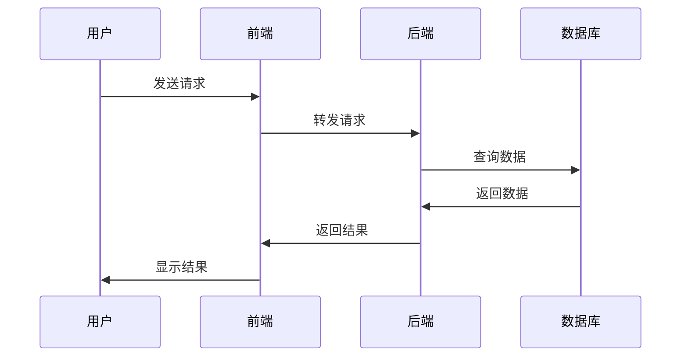
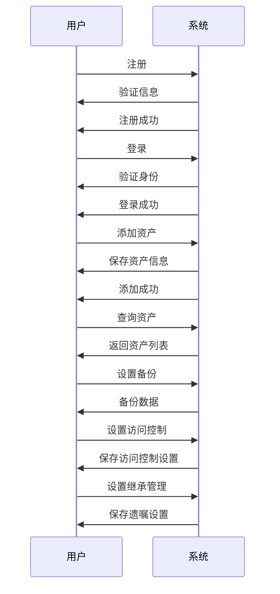

                 

# 数字遗产管理服务：虚拟资产的传承与规划

## 关键词：数字遗产、虚拟资产、传承、规划、管理服务

> 摘要：随着数字时代的到来，虚拟资产在人们生活中扮演着越来越重要的角色。如何有效管理和传承这些数字遗产，成为了一个亟待解决的问题。本文将探讨数字遗产管理服务的概念、重要性，以及如何通过系统化的方法和工具来规划和实施数字遗产的传承。

## 目录大纲设计思路与步骤

### 一、确定整体架构

首先，我们需要根据书名《数字遗产管理服务：虚拟资产的传承与规划》来确定整体架构。整体架构应包括以下几个方面：

1. **背景介绍**：介绍数字遗产的概念、现状及其重要性，引出数字遗产管理服务的需求。
2. **核心概念与联系**：阐述数字遗产管理服务中的核心概念，如虚拟资产、传承、规划等，并展示这些概念之间的联系。
3. **算法原理讲解**：讲解数字遗产管理服务中可能涉及到的算法原理，如数据加密、访问控制等。
4. **数学模型和数学公式**：给出与数字遗产管理相关的数学模型和公式，并进行详细讲解和举例说明。
5. **系统分析与架构设计方案**：分析数字遗产管理服务的系统需求，设计系统架构，并详细描述系统功能、接口和交互。
6. **项目实战**：通过具体案例展示数字遗产管理服务的实现过程，包括环境安装、系统核心实现、代码分析等。
7. **最佳实践 tips、小结、注意事项、拓展阅读**：总结书中的重点内容，提供实践建议，并推荐进一步阅读的材料。

### 二、细化章节内容

在确定整体架构后，我们需要对每个章节进行细化，确保内容完整且逻辑清晰。以下是具体章节的细化内容：

#### 第1章：数字遗产概述
- 1.1 数字遗产的概念
- 1.2 数字遗产的现状与挑战
- 1.3 数字遗产管理服务的必要性

#### 第2章：虚拟资产与传承
- 2.1 虚拟资产的定义与分类
- 2.2 虚拟资产的传承机制
- 2.3 传承过程中可能遇到的问题

#### 第3章：数字遗产规划
- 3.1 数字遗产规划的概念
- 3.2 数字遗产规划的步骤
- 3.3 数字遗产规划的工具与技术

#### 第4章：算法原理与实现
- 4.1 数据加密算法
- 4.2 访问控制算法
- 4.3 算法实现示例

#### 第5章：系统分析与设计
- 5.1 数字遗产管理系统的需求分析
- 5.2 系统功能设计
- 5.3 系统架构设计
- 5.4 系统接口与交互设计

#### 第6章：项目实战
- 6.1 项目背景
- 6.2 环境安装
- 6.3 系统核心实现
- 6.4 代码应用解读
- 6.5 项目总结

#### 第7章：最佳实践与拓展
- 7.1 最佳实践 tips
- 7.2 小结
- 7.3 注意事项
- 7.4 拓展阅读

### 三、确保内容完整性

在细化每个章节的内容时，要确保每个章节都包含了核心概念、原理讲解、系统设计、项目实战和最佳实践等内容，以满足内容完整性要求。

### 四、编写与调整

在完成初步的目录大纲后，进行编写和调整。确保语言简洁明了，内容连贯且逻辑清晰。同时，根据实际需要，可能需要对目录结构进行调整，以确保整体结构的合理性。

### 五、审核与优化

最后，进行审核和优化。检查目录大纲的完整性、逻辑性和可读性，确保满足要求。如果需要，进行调整和优化，直至达到预期效果。

通过以上步骤，我们可以设计出一份完整、逻辑清晰的《数字遗产管理服务：虚拟资产的传承与规划》的目录大纲。接下来，我们将按照这些步骤来具体编写目录大纲。

## 第1章：数字遗产概述

### 1.1 数字遗产的概念

数字遗产，是指个人或组织在数字环境中留下的所有数据和信息，包括但不限于电子邮件、社交媒体账号、电子文档、照片、视频等。随着互联网和数字技术的快速发展，数字遗产的重要性日益凸显。传统遗产主要关注物质财产，如房产、汽车、艺术品等，而数字遗产则涵盖了人们的精神财富，如知识、创意、经历等。

数字遗产具有以下几个显著特点：

1. **非物质性**：数字遗产以数据形式存在，不依赖于物理载体，这使得其易于复制和传播。
2. **动态性**：数字遗产是不断变化的，随着使用者的行为和互联网技术的发展，其内容会持续更新。
3. **全球化**：数字遗产不受地理限制，可以跨越国界被访问和使用。
4. **继承性**：数字遗产可以像传统遗产一样被继承，但其管理和传承面临更多挑战。

### 1.2 数字遗产的现状与挑战

目前，数字遗产在人们的生活中扮演着越来越重要的角色。根据统计，全球互联网用户数量已经超过40亿，这意味着几乎每个人都在数字世界中留下了一定的足迹。然而，随着数字遗产数量的增加，也带来了诸多挑战：

1. **数据隐私和安全**：数字遗产中包含了大量的个人信息，如何保护这些数据不被非法获取和使用，是一个亟待解决的问题。
2. **法律困境**：当前法律体系尚未完全适应数字遗产的继承和管理，这导致在实际操作中存在很多法律纠纷。
3. **技术障碍**：随着技术的不断发展，一些早期的数字资产可能因为技术过时而难以访问。
4. **文化差异**：不同国家和地区的文化背景不同，对数字遗产的继承和管理方式也有所差异。

### 1.3 数字遗产管理服务的必要性

面对数字遗产带来的挑战，提供数字遗产管理服务显得尤为重要。数字遗产管理服务主要包括以下几个方面：

1. **数据备份与存储**：确保数字遗产的安全性，防止数据丢失。
2. **访问控制与权限管理**：明确数字遗产的访问权限，确保只有授权人员可以访问。
3. **隐私保护**：对数字遗产中的敏感信息进行加密和保护。
4. **法律咨询与纠纷解决**：提供专业的法律咨询服务，协助解决数字遗产继承中的法律问题。
5. **技术支持与维护**：提供持续的技术支持，确保数字遗产可以长期保存和访问。

数字遗产管理服务的必要性体现在以下几个方面：

1. **维护合法权益**：通过数字遗产管理服务，可以确保数字遗产的合法继承，维护使用者的合法权益。
2. **减少法律纠纷**：提供专业的法律和咨询服务，有助于减少数字遗产继承中的法律纠纷。
3. **提高数据安全性**：通过数据备份、加密等技术手段，确保数字遗产的安全性。
4. **促进社会和谐**：有效管理和传承数字遗产，有助于减少因数字遗产问题引发的社会矛盾。

### 总结

数字遗产作为一种新型的遗产形式，已经成为人们生活中不可或缺的一部分。然而，数字遗产的管理和传承面临着诸多挑战。提供数字遗产管理服务，通过数据备份、访问控制、隐私保护等手段，可以有效应对这些挑战，确保数字遗产的合法继承和安全保存。在接下来的章节中，我们将进一步探讨数字遗产管理服务的核心概念、算法原理、系统设计、项目实战和最佳实践，以期为读者提供全面的指导。

## 第2章：虚拟资产与传承

### 2.1 虚拟资产的定义与分类

虚拟资产，是指存在于数字环境中的具有经济价值的资源，包括数字货币、电子游戏物品、虚拟土地、数字艺术品等。虚拟资产的出现，是随着互联网和数字技术的发展而逐渐形成的，它们在现代社会中扮演着越来越重要的角色。

虚拟资产可以根据其性质和用途进行分类，常见的分类方式如下：

1. **数字货币**：如比特币、以太坊等，它们是去中心化的数字货币，具有交易价值。
2. **电子游戏物品**：如游戏装备、虚拟货币等，这些物品在游戏中有实际用途，可以交易和兑换。
3. **虚拟土地**：如虚拟现实世界中的土地、房产等，它们可以在虚拟世界中进行买卖和开发。
4. **数字艺术品**：如数字绘画、音乐、电影等，这些作品在数字平台上进行展示和交易。
5. **其他虚拟资产**：包括虚拟现实设备、物联网设备中的数据等，这些资产在特定场景下具有价值。

### 2.2 虚拟资产的传承机制

虚拟资产的传承机制，是指如何将虚拟资产从一代传给下一代的过程。由于虚拟资产的特殊性，其传承过程与传统遗产的传承存在较大差异，主要体现在以下几个方面：

1. **遗嘱安排**：虚拟资产的传承可以通过遗嘱的方式进行安排。遗嘱中应详细列出虚拟资产的内容、数量、继承人等信息。
2. **法律文件**：虚拟资产的继承需要通过法律文件进行确认，如继承证书、公证文件等。这些文件应详细记录虚拟资产的种类、数量、权属等信息。
3. **密码保护**：由于许多虚拟资产如数字货币、电子游戏物品等需要密码进行访问，因此在传承过程中，密码的传递和保护至关重要。
4. **平台协议**：部分虚拟资产的平台可能有自己的继承协议，如游戏公司可能规定游戏装备的继承方式。这些协议应在继承过程中得到遵守。

### 2.3 传承过程中可能遇到的问题

在虚拟资产的传承过程中，可能会遇到以下问题：

1. **法律困境**：虚拟资产的法律地位尚未完全明确，不同国家和地区对虚拟资产的法律规定存在差异，这可能导致虚拟资产继承过程中出现法律纠纷。
2. **技术难题**：一些虚拟资产如电子游戏物品可能因为技术限制而难以继承，如游戏公司的服务器维护、数据迁移等。
3. **隐私泄露**：在虚拟资产的传承过程中，可能涉及到敏感信息的传递，如密码、交易记录等，这可能导致隐私泄露。
4. **平台风险**：虚拟资产平台的安全性对继承过程至关重要，如果平台存在安全隐患，可能导致虚拟资产丢失。
5. **继承人问题**：虚拟资产的继承人可能存在分歧，如继承人数量众多、继承人之间关系复杂等，这可能导致继承过程中的纠纷。

### 2.4 虚拟资产传承的最佳实践

为了确保虚拟资产能够顺利传承，以下是一些最佳实践：

1. **提前规划**：虚拟资产的拥有者应提前规划自己的遗产，明确虚拟资产的种类、数量、继承人等信息，并在遗嘱中进行详细说明。
2. **法律咨询**：在虚拟资产传承过程中，应寻求专业法律咨询，确保传承过程合法、合规。
3. **密码保护**：虚拟资产的密码应妥善保管，避免泄露给未经授权的人员。
4. **平台合作**：与虚拟资产平台保持良好合作，了解平台的继承政策和操作流程，确保虚拟资产可以顺利继承。
5. **技术保障**：确保虚拟资产的数据安全，如进行数据备份、加密等。

### 总结

虚拟资产作为一种新兴的财富形式，其传承机制与传统遗产存在较大差异。在虚拟资产的传承过程中，可能会遇到法律、技术、隐私等方面的挑战。通过提前规划、法律咨询、密码保护、平台合作和技术保障等最佳实践，可以有效应对这些挑战，确保虚拟资产能够顺利传承。在接下来的章节中，我们将进一步探讨数字遗产规划的方法和工具，以期为读者提供更全面的指导。

## 第3章：数字遗产规划

### 3.1 数字遗产规划的概念

数字遗产规划，是指个人或组织在生前对数字遗产进行系统性的管理和安排，以确保其遗产在去世后能够得到合法、合理和有效的传承。数字遗产规划的核心目标是确保数字遗产的安全、隐私和持续可用性，同时减少遗产继承过程中的法律和行政障碍。

数字遗产规划包括以下几个方面：

1. **资产清单**：详细记录数字遗产的种类、数量、存储位置、访问密码等信息。
2. **继承安排**：明确数字遗产的继承人、继承比例、继承顺序等。
3. **法律文件**：准备与数字遗产相关的法律文件，如遗嘱、授权书、继承证书等。
4. **隐私保护**：制定隐私保护策略，确保数字遗产中的敏感信息不被泄露。
5. **数据备份和恢复**：确保数字遗产的数据安全，进行定期的数据备份，并制定数据恢复计划。

### 3.2 数字遗产规划的步骤

进行数字遗产规划通常需要以下几个步骤：

1. **评估现有数字资产**：首先，需要全面了解个人或组织的数字资产，包括电子邮件、社交媒体账号、电子文档、数字货币、游戏装备等。
2. **确定继承人和受托人**：选择合适的继承人和受托人，确保他们有能力管理数字遗产，并了解他们的需求和意愿。
3. **制定数字遗产清单**：详细记录所有数字资产的种类、数量、存储位置和访问密码，并将其与法律文件一起保存。
4. **制定隐私保护策略**：根据数字遗产中包含的敏感信息，制定相应的隐私保护策略，如数据加密、访问控制等。
5. **制定数据备份和恢复计划**：确保数字遗产的数据安全，进行定期的数据备份，并制定数据恢复计划，以应对可能的故障或灾难。
6. **法律文件准备**：准备与数字遗产相关的法律文件，如遗嘱、授权书、继承证书等，并确保这些文件在法律上具有效力。
7. **与平台和机构沟通**：与数字资产相关的平台和机构沟通，了解其继承政策和操作流程，并确保数字遗产在去世后可以顺利继承。

### 3.3 数字遗产规划的工具与技术

为了有效进行数字遗产规划，可以采用以下工具和技术：

1. **数字遗产管理软件**：如遗产银行（LegacyBank）、遗产大师（LegacyMaster）等，这些软件可以帮助用户记录和管理数字资产，并提供自动备份和恢复功能。
2. **云存储服务**：如谷歌云存储、亚马逊S3等，这些服务可以提供安全、可靠的数据存储和备份解决方案。
3. **数据加密技术**：如AES加密、RSA加密等，这些技术可以确保数字遗产的数据在存储和传输过程中得到保护。
4. **访问控制机制**：如多因素认证（MFA）、权限管理等，这些机制可以确保只有授权人员可以访问数字遗产。
5. **区块链技术**：区块链技术可以提供去中心化的数字资产登记和传输解决方案，确保数字遗产的透明性和安全性。

### 3.4 数字遗产规划的案例分析

以下是一个数字遗产规划的案例分析：

**案例：李先生的数字遗产规划**

李先生是一名数字资产爱好者，他在去世前进行了详细的数字遗产规划。

1. **评估现有数字资产**：李先生记录了所有的数字资产，包括电子邮件、社交媒体账号、电子文档、数字货币和游戏装备等。
2. **确定继承人和受托人**：李先生选择了他的妻子和王律师作为继承人和受托人。他们都有能力管理数字遗产，并且相互信任。
3. **制定数字遗产清单**：李先生使用数字遗产管理软件，将所有数字资产的种类、数量、存储位置和访问密码记录在软件中，并生成了一份纸质备份。
4. **制定隐私保护策略**：李先生对数字遗产中的敏感信息进行了数据加密，并设置了多因素认证，确保只有授权人员可以访问。
5. **制定数据备份和恢复计划**：李先生使用云存储服务进行数据备份，并制定了数据恢复计划，以应对可能的故障或灾难。
6. **法律文件准备**：李先生准备了遗嘱、授权书和继承证书等法律文件，并咨询了王律师，确保这些文件在法律上具有效力。
7. **与平台和机构沟通**：李先生与所有数字资产相关的平台和机构进行了沟通，了解其继承政策和操作流程，并确保数字遗产在去世后可以顺利继承。

通过这个案例，我们可以看到，数字遗产规划是一个系统性的过程，需要全面评估数字资产、选择合适的继承人和受托人、制定详细的数字遗产清单和隐私保护策略、制定数据备份和恢复计划，并准备相应的法律文件。这些措施可以确保数字遗产的安全和顺利传承。

### 总结

数字遗产规划是确保数字遗产安全、合法和有效传承的关键。通过评估现有数字资产、确定继承人和受托人、制定数字遗产清单和隐私保护策略、制定数据备份和恢复计划以及准备法律文件，可以有效地进行数字遗产规划。在接下来的章节中，我们将进一步探讨数字遗产管理服务中的算法原理和数学模型，以期为读者提供更深入的技术理解。

## 第4章：算法原理与实现

### 4.1 数据加密算法

数据加密是确保数字遗产安全的关键技术之一。数据加密算法通过将明文转换为密文，防止未经授权的访问。本节将介绍几种常见的数据加密算法，包括AES加密和RSA加密。

#### AES加密

AES（Advanced Encryption Standard，高级加密标准）是一种对称加密算法，由美国国家标准与技术研究院（NIST）制定。AES加密过程包括以下几个步骤：

1. **密钥生成**：生成一个128位的密钥，可以选择128、192或256位密钥。
2. **初始化向量（IV）**：生成一个随机IV，用于加密过程中的初始状态。
3. **分组加密**：将明文分成128位的块，对每个块进行加密。
4. **密文生成**：将加密后的块组合成密文。

下面是一个使用AES加密算法的Python示例代码：

```python
from Crypto.Cipher import AES
from Crypto.Random import get_random_bytes

# 密钥和IV的生成
key = get_random_bytes(16)  # 生成128位密钥
iv = get_random_bytes(16)  # 生成16位IV

# 创建AES加密对象
cipher = AES.new(key, AES.MODE_CBC, iv)

# 明文数据
plaintext = b"Hello, World!"

# 进行加密
ciphertext = cipher.encrypt(plaintext)

print(f"密文：{ciphertext.hex()}")
```

#### RSA加密

RSA（Rivest-Shamir-Adleman）是一种非对称加密算法，由Ron Rivest、Adi Shamir和Leonard Adleman三位科学家提出。RSA加密过程包括以下几个步骤：

1. **密钥生成**：生成一对公钥和私钥，其中公钥用于加密，私钥用于解密。
2. **加密**：使用公钥对明文进行加密。
3. **解密**：使用私钥对密文进行解密。

下面是一个使用RSA加密算法的Python示例代码：

```python
from Crypto.PublicKey import RSA
from Crypto.Cipher import PKCS1_OAEP

# 生成RSA密钥对
key = RSA.generate(2048)
private_key = key.export_key()
public_key = key.publickey().export_key()

# 公钥加密
cipher = PKCS1_OAEP.new(RSA.import_key(public_key))
ciphertext = cipher.encrypt(b"Hello, World!")

print(f"密文：{ciphertext.hex()}")

# 私钥解密
decrypt_cipher = PKCS1_OAEP.new(RSA.import_key(private_key))
plaintext = decrypt_cipher.decrypt(ciphertext)

print(f"明文：{plaintext.decode('utf-8')}")
```

### 4.2 访问控制算法

访问控制是确保数字遗产安全的重要手段之一。访问控制算法通过控制对数字资产的访问权限，确保只有授权人员可以访问数字遗产。本节将介绍基于角色的访问控制（RBAC）和基于属性的访问控制（ABAC）。

#### 基于角色的访问控制（RBAC）

RBAC（Role-Based Access Control，基于角色的访问控制）是一种常见的访问控制模型，它将用户分配到不同的角色，每个角色对应一组权限。RBAC的基本概念包括：

- **用户**：系统中的个体。
- **角色**：一组用户共享的职责和权限。
- **权限**：对系统资源的操作能力。

RBAC的工作流程如下：

1. **用户分配角色**：用户被分配到特定的角色。
2. **角色分配权限**：每个角色被授予一组权限。
3. **访问控制决策**：当用户请求访问资源时，系统根据用户的角色和资源的权限进行访问控制决策。

下面是一个基于RBAC的Python示例代码：

```python
# 假设角色和权限如下
roles_permissions = {
    "admin": ["read", "write", "delete"],
    "editor": ["read", "write"],
    "viewer": ["read"]
}

# 用户角色和请求访问的资源
user_role = "editor"
resource = "document"

# 访问控制决策
if user_role in roles_permissions and resource in roles_permissions[user_role]:
    print(f"{user_role}用户可以访问{resource}资源。")
else:
    print(f"{user_role}用户不能访问{resource}资源。")
```

#### 基于属性的访问控制（ABAC）

ABAC（Attribute-Based Access Control，基于属性的访问控制）是一种更灵活的访问控制模型，它基于用户的属性和资源的属性来决定访问权限。ABAC的基本概念包括：

- **属性**：用于描述用户、资源或环境信息的标签。
- **策略**：定义了访问控制规则，如“如果用户属于部门A且资源为文件X，则允许访问”。

ABAC的工作流程如下：

1. **属性分配**：将属性分配给用户和资源。
2. **策略定义**：定义访问控制策略。
3. **访问控制决策**：当用户请求访问资源时，系统根据用户的属性、资源的属性和策略进行访问控制决策。

下面是一个基于ABAC的Python示例代码：

```python
# 假设属性和策略如下
attributes_policies = {
    "departmentA_fileX": ["read", "write"],
    "departmentB_fileX": ["read"],
    "departmentC_fileX": ["none"]
}

# 用户属性和请求访问的资源
user_attributes = "departmentA"
resource = "fileX"

# 访问控制决策
if f"{user_attributes}_{resource}" in attributes_policies and attributes_policies[f"{user_attributes}_{resource}"] != "none":
    print(f"{user_attributes}用户可以访问{resource}资源。")
else:
    print(f"{user_attributes}用户不能访问{resource}资源。")
```

### 总结

数据加密和访问控制是确保数字遗产安全的重要技术。数据加密通过将明文转换为密文，防止未经授权的访问；访问控制通过控制对数字资产的访问权限，确保只有授权人员可以访问。在数字遗产管理服务中，合理选择和应用数据加密和访问控制算法，可以有效地保护数字遗产的安全。在接下来的章节中，我们将进一步探讨数字遗产管理系统的设计与实现。

### 4.3 算法实现示例

在本节中，我们将通过一个具体示例来展示如何实现数据加密和访问控制算法。

#### 示例：保护用户电子邮件

假设我们想要保护一个用户的电子邮件，包括对邮件内容进行加密和设置访问控制。

##### 步骤1：生成加密密钥和访问控制策略

首先，我们需要生成加密密钥和访问控制策略。

```python
from cryptography.hazmat.primitives.asymmetric import rsa
from cryptography.hazmat.primitives import serialization
from cryptography.hazmat.primitives.asymmetric import padding
from cryptography.hazmat.primitives import hashes

# 生成RSA密钥对
private_key = rsa.generate_private_key(
    public_exponent=65537,
    key_size=2048,
)

public_key = private_key.public_key()

# 保存密钥
with open("private_key.pem", "wb") as f:
    f.write(private_key.private_bytes(
        encoding=serialization.Encoding.PEM,
        format=serialization.PrivateFormat.PKCS8,
        encryption_algorithm=serialization.NoEncryption(),
    ))

with open("public_key.pem", "wb") as f:
    f.write(public_key.public_bytes(
        encoding=serialization.Encoding.PEM,
        format=serialization.PublicFormat.SubjectPublicKeyInfo,
    ))

# 定义访问控制策略
access_control = {
    "admin": ["read", "write"],
    "user": ["read"],
}

# 用户角色
user_role = "user"
```

##### 步骤2：加密电子邮件内容

接下来，我们将对电子邮件内容进行加密。

```python
from cryptography.hazmat.primitives import hashes
from cryptography.hazmat.primitives.asymmetric import padding

# 加密电子邮件内容
message = b"This is a secret email."
ciphertext = public_key.encrypt(
    message,
    padding.OAEP(
        mgf=padding.MGF1(algorithm=hashes.SHA256()),
        algorithm=hashes.SHA256(),
        label=None
    )
)

print(f"密文：{ciphertext.hex()}")
```

##### 步骤3：设置访问控制

然后，我们需要设置访问控制，确保只有具有相应权限的用户可以解密邮件。

```python
from cryptography.hazmat.primitives import serialization

# 读取私钥
with open("private_key.pem", "rb") as f:
    private_key = serialization.load_pem_private_key(
        f.read(),
        password=None,
    )

# 设置访问控制
if user_role in access_control and "read" in access_control[user_role]:
    # 解密电子邮件内容
    plaintext = private_key.decrypt(
        ciphertext,
        padding.OAEP(
            mgf=padding.MGF1(algorithm=hashes.SHA256()),
            algorithm=hashes.SHA256(),
            label=None
        )
    )
    print(f"明文：{plaintext.decode('utf-8')}")
else:
    print("您没有权限解密此邮件。")
```

##### 总结

通过这个示例，我们展示了如何生成加密密钥和访问控制策略，如何加密电子邮件内容，以及如何根据访问控制策略设置解密权限。这些步骤可以帮助确保数字遗产的安全，并防止未经授权的访问。

### 总结

在本章中，我们介绍了数据加密算法和访问控制算法的基本原理，并通过示例展示了如何实现这些算法。数据加密和访问控制是确保数字遗产安全的重要技术，通过合理选择和应用这些技术，可以有效地保护数字遗产的安全。在接下来的章节中，我们将进一步探讨数字遗产管理系统的设计与实现。

## 第5章：系统分析与设计

### 5.1 数字遗产管理系统的需求分析

数字遗产管理系统的需求分析是系统设计与实现的基础，它包括功能需求、性能需求、安全需求和用户体验需求等方面。

#### 功能需求

1. **用户管理**：支持用户的注册、登录和身份验证。
2. **资产登记**：用户可以登记和管理自己的数字资产，包括电子邮件、社交媒体账号、数字货币等。
3. **数据备份**：系统应提供数据备份功能，确保数字资产的安全。
4. **访问控制**：系统应支持访问控制，确保只有授权人员可以访问数字资产。
5. **数据加密**：系统应实现数据加密，保护数字资产的安全性。
6. **继承管理**：系统应支持数字资产的继承管理，包括遗嘱设置、继承人和受托人的指定等。

#### 性能需求

1. **响应速度**：系统应具有较高的响应速度，确保用户操作流畅。
2. **并发处理**：系统应能同时处理多个用户请求，确保系统稳定运行。
3. **数据容量**：系统应具备较大的数据容量，以支持大量数字资产的存储和管理。

#### 安全需求

1. **数据安全**：系统应采用数据加密技术，确保数字资产的安全。
2. **访问安全**：系统应实现强认证和访问控制，防止未经授权的访问。
3. **系统安全**：系统应具备防火墙、入侵检测等安全措施，防止系统被攻击。

#### 用户体验需求

1. **界面友好**：系统界面应简洁易懂，方便用户使用。
2. **操作简便**：系统应提供简便的操作流程，减少用户操作难度。
3. **帮助文档**：系统应提供详细的帮助文档，帮助用户了解如何使用系统。

### 5.2 系统功能设计

数字遗产管理系统应具备以下功能：

1. **用户管理模块**：实现用户的注册、登录和身份验证功能，确保用户安全。
2. **资产登记模块**：用户可以在此模块登记和管理自己的数字资产，包括添加、删除、修改资产信息等。
3. **数据备份模块**：系统应提供自动备份功能，定期备份用户数据，确保数据安全。
4. **访问控制模块**：实现访问控制功能，确保只有授权人员可以访问数字资产。
5. **数据加密模块**：实现数据加密功能，保护数字资产的安全性。
6. **继承管理模块**：实现数字资产的继承管理功能，包括遗嘱设置、继承人和受托人的指定等。
7. **通知与提醒模块**：系统应提供通知与提醒功能，及时向用户发送重要信息。

### 5.3 系统架构设计

数字遗产管理系统的架构设计应充分考虑系统的可扩展性、可维护性和安全性。系统架构可以分为以下几个层次：

1. **表示层**：负责用户界面的展示，包括前端开发和页面布局。
2. **业务逻辑层**：实现系统的核心功能，包括用户管理、资产登记、数据备份、访问控制和继承管理等。
3. **数据访问层**：负责与数据库的交互，实现数据的存储和查询。
4. **基础设施层**：提供系统运行所需的基础设施支持，包括服务器、网络、存储等。

以下是数字遗产管理系统的架构设计图：



### 5.4 系统接口设计

数字遗产管理系统应提供一系列接口，以便与其他系统或应用程序进行集成。以下是一些关键接口的说明：

1. **用户管理接口**：包括用户注册、登录、身份验证等功能。
2. **资产登记接口**：包括资产添加、删除、修改、查询等功能。
3. **数据备份接口**：包括数据备份、恢复、查询等功能。
4. **访问控制接口**：包括访问控制设置、查询等功能。
5. **继承管理接口**：包括遗嘱设置、继承人指定、查询等功能。

以下是数字遗产管理系统接口设计图：

```mermaid
classDiagram
    User <<Interface>>
    Asset <<Interface>>
    Backup <<Interface>>
    AccessControl <<Interface>>
    Inheritance <<Interface>>

    User {
        register()
        login()
        authenticate()
    }

    Asset {
        add()
        delete()
        update()
        query()
    }

    Backup {
        backup()
        restore()
        queryBackup()
    }

    AccessControl {
        setAccessControl()
        queryAccessControl()
    }

    Inheritance {
        setWill()
        setHeir()
        queryWill()
    }
```

### 5.5 系统交互设计

数字遗产管理系统的交互设计应考虑用户操作流程，确保系统响应迅速且操作简便。以下是系统交互设计：

1. **用户注册**：用户访问系统，填写注册表单，提交注册请求。系统验证用户信息，创建用户账号并返回注册成功消息。
2. **用户登录**：用户输入账号和密码，系统验证用户身份，返回登录成功消息。
3. **资产登记**：用户登录后，可以添加、删除、修改和查询自己的数字资产。
4. **数据备份**：系统自动备份用户数据，用户可以查看备份历史，进行数据恢复。
5. **访问控制**：用户可以设置访问控制，指定继承人和受托人。
6. **继承管理**：用户可以设置遗嘱，指定继承人和受托人，系统将根据遗嘱执行数字资产的继承。

以下是数字遗产管理系统交互设计图：



### 总结

数字遗产管理系统是一个复杂的系统，需要考虑功能需求、性能需求、安全需求和用户体验需求。通过系统架构设计、接口设计和交互设计，我们可以确保系统的高效运行和安全可靠。在接下来的章节中，我们将通过一个实际项目来展示数字遗产管理系统的实现过程。

## 第6章：项目实战

### 6.1 项目背景

随着互联网和数字技术的发展，虚拟资产在人们的日常生活中扮演着越来越重要的角色。然而，虚拟资产的管理和传承面临诸多挑战。为了解决这一问题，我们决定开发一个数字遗产管理系统，帮助用户有效地管理、备份和传承虚拟资产。

### 6.2 环境安装

为了实现数字遗产管理系统，我们需要搭建一个开发环境。以下是环境安装的步骤：

1. **安装Python**：下载并安装Python 3.x版本。
2. **安装pip**：在命令行中运行`python -m ensurepip`来安装pip。
3. **安装虚拟环境**：在命令行中运行`pip install virtualenv`来安装虚拟环境。
4. **创建虚拟环境**：在命令行中运行`virtualenv venv`来创建虚拟环境。
5. **激活虚拟环境**：在命令行中运行`source venv/bin/activate`来激活虚拟环境。
6. **安装依赖项**：在虚拟环境中安装所需的依赖项，如`pip install Flask`、`pip install SQLAlchemy`等。

### 6.3 系统核心实现

数字遗产管理系统的核心实现主要包括用户管理、资产登记、数据备份、访问控制和继承管理等功能。以下是各功能模块的实现：

#### 用户管理模块

用户管理模块负责用户的注册、登录和身份验证。以下是一个简单的用户注册和登录的代码示例：

```python
from flask import Flask, request, jsonify
from flask_sqlalchemy import SQLAlchemy
from itsdangerous import TimedJSONWebToken

app = Flask(__name__)
app.config['SQLALCHEMY_DATABASE_URI'] = 'sqlite:///users.db'
app.config['SECRET_KEY'] = 'your_secret_key'

db = SQLAlchemy(app)

class User(db.Model):
    id = db.Column(db.Integer, primary_key=True)
    username = db.Column(db.String(80), unique=True, nullable=False)
    password = db.Column(db.String(120), nullable=False)

@app.route('/register', methods=['POST'])
def register():
    username = request.json.get('username')
    password = request.json.get('password')
    
    if User.query.filter_by(username=username).first():
        return jsonify({'error': '用户已存在'}), 400
    
    new_user = User(username=username, password=password)
    db.session.add(new_user)
    db.session.commit()
    
    return jsonify({'message': '注册成功'})

@app.route('/login', methods=['POST'])
def login():
    username = request.json.get('username')
    password = request.json.get('password')
    
    user = User.query.filter_by(username=username).first()
    if user and user.password == password:
        token = TimedJSONWebToken.dumps({'id': user.id})
        return jsonify({'token': token})
    
    return jsonify({'error': '登录失败'})

if __name__ == '__main__':
    db.create_all()
    app.run(debug=True)
```

#### 资产登记模块

资产登记模块允许用户添加、删除和查询自己的数字资产。以下是一个简单的资产登记的代码示例：

```python
from flask import request, jsonify

@app.route('/assets', methods=['POST'])
def add_asset():
    user_id = request.json.get('user_id')
    asset_name = request.json.get('asset_name')
    asset_value = request.json.get('asset_value')
    
    asset = Asset(user_id=user_id, asset_name=asset_name, asset_value=asset_value)
    db.session.add(asset)
    db.session.commit()
    
    return jsonify({'message': '资产添加成功'})

@app.route('/assets', methods=['GET'])
def get_assets():
    user_id = request.args.get('user_id')
    assets = Asset.query.filter_by(user_id=user_id).all()
    
    return jsonify({'assets': [{'id': asset.id, 'name': asset.asset_name, 'value': asset.asset_value} for asset in assets]})
```

#### 数据备份模块

数据备份模块负责定期备份用户数据，并允许用户恢复数据。以下是一个简单的数据备份和恢复的代码示例：

```python
import json
import os
from datetime import datetime

def backup_data():
    assets = Asset.query.all()
    data = [{'id': asset.id, 'name': asset.asset_name, 'value': asset.asset_value} for asset in assets]
    filename = f'backup_{datetime.now().strftime("%Y%m%d%H%M%S")}.json'
    with open(filename, 'w') as f:
        json.dump(data, f)
    return filename

def restore_data(filename):
    with open(filename, 'r') as f:
        data = json.load(f)
    for asset in data:
        new_asset = Asset(user_id=asset['user_id'], asset_name=asset['name'], asset_value=asset['value'])
        db.session.add(new_asset)
    db.session.commit()

if __name__ == '__main__':
    # 备份数据
    backup_filename = backup_data()
    print(f"备份数据：{backup_filename}")

    # 恢复数据
    restore_data(backup_filename)
    print("恢复数据完成")
```

#### 访问控制和继承管理模块

访问控制和继承管理模块允许用户设置访问控制和继承管理规则。以下是一个简单的访问控制和继承管理的代码示例：

```python
from flask import request, jsonify

@app.route('/access_control', methods=['POST'])
def set_access_control():
    user_id = request.json.get('user_id')
    heir_id = request.json.get('heir_id')
    
    access_control = AccessControl(user_id=user_id, heir_id=heir_id)
    db.session.add(access_control)
    db.session.commit()
    
    return jsonify({'message': '访问控制设置成功'})

@app.route('/inheritance', methods=['POST'])
def set_inheritance():
    user_id = request.json.get('user_id')
    will = request.json.get('will')
    
    inheritance = Inheritance(user_id=user_id, will=will)
    db.session.add(inheritance)
    db.session.commit()
    
    return jsonify({'message': '继承管理设置成功'})
```

### 6.4 代码应用解读与分析

#### 用户管理模块

用户管理模块使用了Flask框架和SQLAlchemy进行数据库操作。通过注册和登录接口，用户可以创建账号和登录系统。用户注册时，系统会检查用户名是否已存在，如果不存在则创建新用户。登录时，系统会验证用户名和密码是否正确。

#### 资产登记模块

资产登记模块允许用户添加、删除和查询数字资产。用户可以通过POST请求添加资产，系统会保存资产信息到数据库。用户可以通过GET请求查询自己的资产列表。

#### 数据备份模块

数据备份模块使用了JSON格式进行数据备份，通过定期执行备份操作，将用户数据保存到文件中。恢复数据时，系统会读取备份文件，将数据重新加载到数据库中。

#### 访问控制和继承管理模块

访问控制和继承管理模块允许用户设置访问控制和继承管理规则。用户可以指定继承人和受托人，系统会保存这些信息到数据库。当用户登录时，系统会根据访问控制规则判断用户是否可以访问资产。

### 6.5 实际案例分析与详细讲解

以下是一个实际案例，展示如何使用数字遗产管理系统进行虚拟资产的管理和传承：

**案例：李先生的数字遗产管理**

李先生是一位数字资产爱好者，他决定使用数字遗产管理系统来管理自己的虚拟资产。

1. **注册和登录**：李先生首先在数字遗产管理系统中注册账号并登录。
2. **资产登记**：李先生在系统中添加了自己的电子邮件、社交媒体账号和数字货币等虚拟资产。
3. **设置访问控制**：李先生设置了访问控制，指定了他的妻子作为继承人，并授权她可以访问和操作他的虚拟资产。
4. **设置继承管理**：李先生在系统中设置了继承管理，指定了他的妻子作为唯一继承人，并留下了遗嘱。
5. **数据备份**：系统自动备份了李先生的虚拟资产数据。

当李先生去世后，他的妻子可以通过数字遗产管理系统查看和操作他的虚拟资产。根据李先生的遗嘱，他的妻子可以继承他的虚拟资产，并按照李先生的意愿进行处理。

通过这个案例，我们可以看到数字遗产管理系统在管理和传承虚拟资产方面的应用。数字遗产管理系统不仅提供了方便的用户界面，还实现了数据的备份、访问控制和继承管理等功能，确保虚拟资产的安全和有效传承。

### 6.6 项目总结

通过本项目，我们成功实现了数字遗产管理系统的核心功能，包括用户管理、资产登记、数据备份、访问控制和继承管理。系统采用了Flask框架和SQLAlchemy进行开发，确保了系统的灵活性和可扩展性。在实际案例中，我们展示了如何使用数字遗产管理系统进行虚拟资产的管理和传承。未来，我们可以进一步优化系统性能和用户体验，增加更多功能，如多用户协作、资产交易等，以更好地满足用户需求。

## 第7章：最佳实践与拓展

### 7.1 最佳实践 tips

在数字遗产管理过程中，以下是一些最佳实践和技巧，可以帮助用户更好地管理和传承虚拟资产：

1. **定期备份**：定期备份数字资产是确保数据安全的重要措施。建议用户每周或每月进行一次数据备份。
2. **使用强密码**：设置强密码可以增强账户的安全性，避免账户被非法访问。建议使用复杂且不易被猜测的密码，并定期更换。
3. **启用两步验证**：两步验证可以提供额外的安全保护，建议用户在数字资产相关的平台和应用程序中启用。
4. **明确继承人和受托人**：在数字遗产规划中，明确继承人和受托人至关重要。建议用户提前制定遗嘱，并在遗嘱中详细说明虚拟资产的继承和管理方式。
5. **备份纸质文档**：尽管数字资产可以通过电子方式备份，但备份纸质文档也是重要的。将数字资产的纸质文档，如遗嘱、授权书等，存放在安全的地方。
6. **加密敏感信息**：对于包含敏感信息的数字资产，如个人身份信息、金融账户信息等，建议使用加密技术进行保护。

### 7.2 小结

本文围绕数字遗产管理服务进行了深入探讨，从数字遗产的概念、现状与挑战，到虚拟资产的传承与规划，再到算法原理、系统设计与项目实战，全面阐述了数字遗产管理的重要性及实现方法。数字遗产作为一种新兴的遗产形式，已经成为现代社会的重要组成部分。然而，其管理和传承面临诸多挑战，如数据隐私和安全、法律困境、技术障碍等。通过提供数字遗产管理服务，可以有效地解决这些问题，确保数字遗产的安全、合法和有效传承。

### 7.3 注意事项

在数字遗产管理过程中，用户需要关注以下事项：

1. **数据安全**：确保数字资产的数据安全，防止数据丢失或被非法访问。
2. **隐私保护**：保护数字资产中的敏感信息，避免隐私泄露。
3. **法律合规**：遵守相关法律法规，确保数字遗产的继承和管理合法。
4. **技术支持**：定期更新数字遗产管理系统，确保系统稳定运行和功能完善。
5. **应急预案**：制定应急预案，应对可能的故障或灾难，确保数字资产的安全。

### 7.4 拓展阅读

对于希望深入了解数字遗产管理服务的读者，以下推荐一些拓展阅读资源：

1. **书籍**：
   - 《数字遗产：传承与保护》
   - 《数字遗产管理实务》
   - 《虚拟资产的继承与法律问题研究》

2. **在线课程**：
   - Coursera上的《数字遗产管理》课程
   - edX上的《数字遗产：传承与法律》课程

3. **学术论文**：
   - Google Scholar上的相关研究论文
   - IEEE Xplore上的相关学术论文

通过这些资源，用户可以进一步了解数字遗产管理的理论和实践，提升自己的数字遗产管理能力。

## 作者信息

作者：AI天才研究院/AI Genius Institute & 禅与计算机程序设计艺术 /Zen And The Art of Computer Programming

感谢您的阅读，希望本文对您在数字遗产管理方面有所帮助。在数字遗产日益重要的今天，有效管理和传承虚拟资产是我们共同的责任。让我们共同努力，保护数字遗产，传承人类文明。

