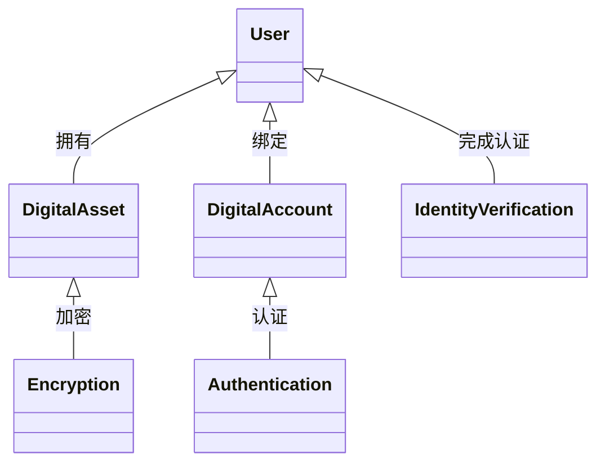
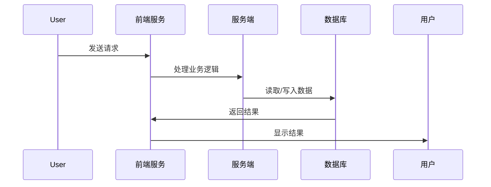

                 

### 第一部分：背景介绍与核心概念

#### 第1章：问题背景与概念介绍

随着互联网和区块链技术的迅猛发展，虚拟资产如数字货币、虚拟房产、电子文档等已经逐渐成为人们日常生活中不可或缺的一部分。数字遗产管理服务的需求也随之浮现。数字遗产，指的是在互联网和数字世界中，个人或企业所拥有和创造的各类数字资产，包括但不限于电子邮箱、社交媒体账户、在线银行账户、数字资产钱包等。

#### 1.1 数字遗产管理服务的需求背景

**问题描述**：在数字遗产管理缺乏有效机制的情况下，当资产所有者去世或失去行为能力时，其数字遗产往往面临无法访问、丢失或被恶意篡改的风险。这不仅会给继承人带来巨大的财产损失，还可能引发法律纠纷和社会问题。

**问题解决**：为了应对这一挑战，数字遗产管理服务应运而生。这种服务旨在通过一系列技术和流程，确保数字遗产在所有者去世或失去行为能力后能够顺利、安全地传承给继承人。具体包括身份认证、权限分配、资产定位与锁定、资产转移与继承等环节。

**边界与外延**：
- **数字遗产**：包括所有在线账户、文件、数字资产等。
- **虚拟资产**：如比特币、以太坊、NFT等。
- **数字遗产管理服务**：提供资产保护、定位、访问授权、资产转移等功能的综合性服务。

**概念结构与核心要素组成**：
- **身份认证**：确保继承人具备合法身份，以便合法访问和处理数字遗产。
- **权限分配**：根据遗嘱或法定规定，确定继承人访问和操作各类数字资产的能力。
- **资产定位**：帮助继承人找到并识别其已故亲属的数字资产。
- **资产转移**：在遵守法律和规定的前提下，将数字资产转移给继承人。
- **隐私保护**：确保在处理数字遗产时，所有操作符合隐私保护的要求，防止数据泄露。

### 1.2 核心概念与联系

**核心概念原理**：
- **数字遗产**：指在互联网和数字环境中，个人或企业所拥有和控制的各类数字资产。其范围广泛，包括电子邮件、社交媒体账号、在线银行账户、数字货币、NFT等。
- **虚拟资产**：特指以数字形式存在的资产，如加密货币、数字股票、虚拟地产等。
- **数字身份**：在数字世界中代表个体的标识，通常通过用户名、密码、生物特征等手段实现。
- **加密技术**：通过将数据转换为不可读的形式，保障数据传输和存储的安全性。

**概念属性特征对比表格**：

| 概念       | 定义               | 关键属性         | 作用                 |
|------------|--------------------|------------------|----------------------|
| 数字遗产   | 网络上的数字资产   | 安全性、可访问性 | 确保传承合法性       |
| 虚拟资产   | 数字形式的资产     | 市值波动、流动性 | 数字经济的重要组成部分 |
| 数字身份   | 网络上的身份认证   | 唯一性、可靠性   | 安全访问数字资产     |
| 加密技术   | 数据加密方法       | 安全性、有效性   | 保护数据不被篡改     |

**ER实体关系图架构**：

```mermaid
erDiagram
  User ||--|{ DigitalAsset } : 拥有
  User ||--|{ DigitalAccount } : 绑定
  DigitalAsset ||--|{ Encryption } : 加密
  DigitalAccount ||--|{ Authentication } : 认证
```

通过上述表格和实体关系图，我们可以清晰地理解数字遗产管理服务中的核心概念及其相互关系，为后续的技术原理和实施方法分析奠定了基础。

### 总结

本章节详细介绍了数字遗产管理服务的背景、核心概念及其重要性。随着虚拟资产的快速增长，数字遗产管理成为一个迫切需要解决的问题。通过对数字遗产、虚拟资产、数字身份和加密技术的定义和属性分析，我们为后续章节的技术原理和实施方法讨论奠定了坚实的理论基础。接下来，我们将深入探讨数字遗产管理中的关键技术和具体实施方法。

---

### 第二部分：技术原理与实施方法

#### 第2章：数字遗产管理技术原理

在数字遗产管理服务中，技术原理的实施至关重要。本章节将重点介绍加密技术和数字身份与身份认证的相关原理。

#### 2.1 加密技术

**加密算法原理**：
加密技术是保障数字遗产安全性的关键手段。常见的加密算法包括对称加密和非对称加密。
- **对称加密**：如AES（高级加密标准），加密和解密使用相同的密钥。其优点是计算速度快，适合大量数据的加密，但密钥分发和管理困难。
- **非对称加密**：如RSA（Rivest-Shamir-Adleman），使用一对密钥，公钥加密，私钥解密。其优点是安全性高，密钥分发方便，但计算复杂度高，适合传输密钥和小规模数据加密。

**加密技术在数字遗产管理中的作用**：
加密技术确保数字遗产在传输和存储过程中不被未经授权的第三方访问。在数字遗产管理中，加密技术主要用于以下方面：
- **账户保护**：加密用户账户密码，防止黑客窃取。
- **数据隐私**：加密电子文档、电子邮件等敏感信息，确保隐私不被泄露。
- **资产转移**：在资产转移过程中，加密传输数据，防止数据被篡改。

#### 2.2 数字身份与身份认证

**数字身份的定义与属性**：
数字身份是在数字环境中对个人或企业的唯一标识。其主要属性包括唯一性、可靠性和可验证性。
- **唯一性**：每个用户都有一个唯一的数字身份，确保身份不被冒用。
- **可靠性**：数字身份的认证机制需要高度可靠，确保正确用户能够访问其数字资产。
- **可验证性**：通过数字签名或其他认证手段，验证数字身份的真实性。

**身份认证方法**：
为了确保数字遗产管理过程中的身份验证，常见的方法包括：
- **密码认证**：用户通过输入密码来证明身份，简单但安全性较低。
- **双因素认证**：在密码认证的基础上，增加第二重验证，如短信验证码、手机解锁等，提高安全性。
- **生物识别**：使用指纹、面部识别、虹膜识别等技术，实现高度安全的身份认证。

**多因素认证机制**：
为了进一步提升安全性，数字遗产管理服务通常采用多因素认证机制。多因素认证结合了不同类型的身份认证方法，确保即使在一种认证方法失效的情况下，用户仍能安全访问其数字资产。常见的多因素认证组合包括：
- **密码+手机验证码**：用户输入密码，同时接收并输入手机验证码。
- **指纹+人脸识别**：用户通过指纹和人脸识别双重验证。

**数字遗产管理中的身份认证流程**：
数字遗产管理中的身份认证流程通常包括以下步骤：
1. **初始访问**：用户尝试访问其数字资产时，系统要求其进行身份认证。
2. **认证请求**：用户提交身份认证请求，系统开始认证过程。
3. **多因素认证**：系统根据预设的认证组合，要求用户完成多个认证步骤。
4. **认证结果**：系统验证用户身份，如果认证成功，则允许用户访问数字资产。

通过加密技术和多因素认证机制，数字遗产管理服务能够有效地保障数字资产的安全性，确保数字遗产在所有者去世或失去行为能力后能够安全、顺利地传承。

### 总结

本章详细介绍了数字遗产管理中的加密技术和数字身份与身份认证原理。加密技术通过保障数据传输和存储的安全性，防止数字遗产被未经授权的第三方访问。数字身份与身份认证则通过唯一性、可靠性和可验证性，确保合法用户能够安全地访问其数字资产。这些技术原理为数字遗产管理服务提供了坚实的基础，确保了服务的安全性和可靠性。

接下来，我们将进一步探讨数字遗产管理服务的实施方法，包括遗产规划与遗嘱安排、服务提供商选择与协作等方面的内容。

---

### 第3章：数字遗产管理服务实施方法

数字遗产管理服务的实施涉及多个方面，从遗产规划到遗嘱安排，再到服务提供商的选择与协作，每个环节都至关重要。以下将详细介绍这些实施方法。

#### 3.1 遗产规划与遗嘱安排

**遗产规划的重要性**：
遗产规划不仅是管理财产的工具，更是对数字遗产进行合理安排的重要手段。合理的遗产规划可以确保数字遗产在所有者去世后能够顺利传承，避免因管理不善导致的财产损失和法律纠纷。

**遗产规划的关键点**：
- **明确数字遗产的范围**：列出所有数字资产，包括电子邮件账户、社交媒体账号、在线银行账户、数字资产钱包等。
- **指定遗产继承人**：明确数字遗产的继承人，确保在所有者去世后，这些资产能够顺利转移给指定的继承人。
- **制定数字遗嘱**：数字遗嘱可以包含对数字遗产的具体安排，如账号密码的传递、访问权限的设置等。数字遗嘱应当符合法律要求，并得到合法认证。

**遗嘱安排中的数字遗产问题**：
在遗嘱安排中，数字遗产的问题主要包括：
- **密码保护**：为确保数字遗产的安全，遗嘱中应当包含账户密码或其他访问凭证，并采取适当措施保护这些信息。
- **多重确认**：为了防止遗嘱被篡改或伪造，可以设置多重确认机制，如律师、遗嘱见证人等。
- **电子遗嘱的法律效力**：不同国家和地区的法律对电子遗嘱的效力有不同的规定，遗嘱制定者应确保遗嘱符合当地法律的要求。

**案例说明**：
例如，某企业家在遗嘱中详细列出了其所有数字资产，包括社交媒体账号、在线银行账户和数字资产钱包，并指定了继承人。同时，他还提供了账户密码的备份和多重确认机制，确保其数字遗产在去世后能够顺利传承。

#### 3.2 服务提供商选择与协作

**服务提供商的作用**：
数字遗产管理服务提供商在数字遗产管理过程中扮演着重要角色。他们提供专业的技术支持和咨询服务，帮助用户进行数字遗产的规划、管理和转移。服务提供商通常具备以下功能：
- **账户管理与保护**：帮助用户管理和保护其数字资产账户。
- **遗嘱执行与资产转移**：协助遗嘱执行人按照遗嘱规定，将数字遗产转移给继承人。
- **身份认证与权限管理**：提供身份认证服务，确保只有合法继承人能够访问数字资产。

**选择合适的服务提供商**：
选择合适的服务提供商是数字遗产管理成功的关键。以下是一些选择服务提供商的考虑因素：
- **专业资质**：服务提供商应当具备相关行业的专业资质和认证，确保其服务质量。
- **安全性与可靠性**：服务提供商应具备强大的安全防护措施，确保用户数据的安全和隐私。
- **服务质量与口碑**：了解服务提供商的服务质量，可以通过用户评价、案例研究等方式进行评估。
- **费用与成本效益**：比较不同服务提供商的费用结构，选择性价比高的服务。

**多方协作机制**：
在数字遗产管理过程中，涉及多方协作，包括服务提供商、遗嘱执行人、继承人等。为了确保协作顺畅，可以采取以下措施：
- **沟通机制**：建立有效的沟通渠道，确保各方能够及时、准确地交流信息。
- **协作协议**：签订明确的协作协议，明确各方的权利、义务和责任。
- **监控与反馈**：对数字遗产管理过程进行监控，确保各个环节符合预期，及时反馈和处理问题。

**案例说明**：
例如，某用户在选择数字遗产管理服务提供商时，综合考虑了专业资质、安全性和服务质量等因素，最终选择了某知名服务提供商。该用户与服务提供商建立了长期合作关系，通过定期的沟通和协作，确保其数字遗产在去世后能够顺利管理并传承给继承人。

通过遗产规划与遗嘱安排、服务提供商选择与协作，数字遗产管理服务能够有效保障数字遗产的安全和顺利传承，为用户和其继承人提供可靠的保障。

### 总结

本章详细介绍了数字遗产管理服务的实施方法，包括遗产规划与遗嘱安排、服务提供商选择与协作等方面。通过合理的遗产规划和科学的遗嘱安排，可以确保数字遗产在所有者去世后能够顺利传承。选择合适的服务提供商和建立有效的多方协作机制，则是数字遗产管理服务成功的关键。这些实施方法为数字遗产管理提供了具体的操作指导，确保了服务的安全性和可靠性。

在接下来的章节中，我们将通过具体案例和实践指导，进一步探讨数字遗产管理服务的实际应用和操作，帮助读者更好地理解和应用这些方法。

---

### 第4章：数字遗产管理服务案例分析

#### 4.1 案例介绍

**案例背景**：
本案例以一位名叫李华的年轻企业家为例，李华在互联网和区块链领域拥有丰富的投资和创业经验。他拥有大量的数字资产，包括比特币、以太坊、社交媒体账号和在线版权等。李华非常重视数字遗产的管理，因此在生前制定了一份详尽的数字遗嘱，并选择了一家专业的数字遗产管理服务提供商来协助处理其遗产。

**案例目标**：
李华希望通过数字遗产管理服务，确保其数字资产在去世后能够安全、有序地传承给继承人，同时确保其在线身份和账号的隐私得到保护。

#### 4.2 案例分析

**具体问题**：
李华的数字遗产管理面临以下具体问题：
- **账户密码保护**：李华担心其账户密码在去世后无法安全传递给继承人。
- **隐私保护**：李华希望确保其社交媒体账号和个人信息在去世后不被公开。
- **资产转移**：李华希望其数字资产能够顺利、高效地转移给继承人。

**解决方案**：
为了解决上述问题，李华采取了以下措施：
1. **制定数字遗嘱**：
   - 李华详细列出了其所有数字资产及其账户信息，并指定了继承人。
   - 在遗嘱中，李华还提供了账户密码的备份，并设置了多重确认机制，以确保密码的安全传递。

2. **选择专业服务提供商**：
   - 李华选择了某知名数字遗产管理服务提供商，该提供商具备丰富的经验和技术实力。
   - 服务提供商提供了全面的数字遗产管理服务，包括账户保护、资产定位和转移等。

3. **身份认证与权限分配**：
   - 服务提供商协助李华进行了多因素身份认证设置，确保继承人访问其数字资产时的安全性。
   - 李华在遗嘱中明确规定了继承人的访问权限，确保其数字资产得到合理管理。

**效果**：
通过上述措施，李华的数字遗产管理取得了显著效果：
- **账户安全**：继承人通过多因素认证成功继承了李华的数字资产，账户信息得到了有效保护。
- **隐私保护**：李华的社交媒体账号和个人信息在去世后得到了妥善处理，隐私得到了保障。
- **资产转移**：李华的数字资产顺利转移给了继承人，没有出现任何纠纷和损失。

#### 4.3 案例细节

**细节分析**：
1. **数字遗嘱内容**：
   - 李华的数字遗嘱详细列出了其所有数字资产，包括比特币地址、以太坊地址、社交媒体账号和在线版权等。
   - 遗嘱中包含了账户密码的备份，并指定了多个备份地点，如律师事务所以及云存储服务。
   - 遗嘱还设置了多重确认机制，要求继承人提供身份证明、亲属关系证明等多种文件，以确保密码的安全传递。

2. **服务提供商作用**：
   - 服务提供商提供了账户保护服务，包括账户锁定、密码重置和账户监控等。
   - 服务提供商协助李华设置了多因素认证，确保继承人访问数字资产时的安全性。
   - 服务提供商还提供了资产转移服务，帮助继承人完成数字资产的转移过程。

3. **继承人操作流程**：
   - 继承人在收到数字遗嘱后，首先需要通过多因素认证验证身份。
   - 验证通过后，继承人可以访问李华的数字资产，并根据遗嘱规定进行资产转移和管理。

通过本案例，我们可以看到数字遗产管理服务在实际应用中的重要作用。合理的遗产规划、专业的服务提供商选择和有效的身份认证与权限分配，是确保数字遗产安全传承的关键。

### 总结

本章节通过一个真实的案例，详细分析了数字遗产管理服务的具体问题和解决方案。通过制定数字遗嘱、选择专业服务提供商以及设置多因素认证等手段，案例中的李华成功保障了其数字遗产的安全和顺利传承。这一案例为其他用户提供了宝贵的经验，展示了数字遗产管理服务的实际应用效果和重要性。

在接下来的章节中，我们将进一步探讨数字遗产管理服务的系统设计与实现，以及实际操作中的具体步骤和技术细节。

---

### 第5章：数字遗产管理服务实践指导

在数字遗产管理服务实践中，系统设计与实现是关键环节。以下将详细介绍系统设计与实现的过程，包括系统功能设计、系统架构设计、系统接口设计和系统交互。

#### 5.1 系统功能设计

**系统功能设计**是指明确数字遗产管理服务应具备的功能模块。以下为数字遗产管理系统的功能模块：

1. **用户管理模块**：
   - 注册与登录功能：用户注册账户、登录系统。
   - 账户信息管理：用户管理个人信息，如修改密码、绑定手机等。

2. **数字遗产管理模块**：
   - 数字遗产登记：用户登记其数字资产信息。
   - 遗嘱编辑与存储：用户编辑数字遗嘱，并安全存储。

3. **身份认证模块**：
   - 多因素认证：用户完成多因素身份验证。
   - 认证结果存储：存储认证结果，便于后续查询。

4. **资产转移模块**：
   - 资产查询：用户查询其数字资产状态。
   - 资产转移：将数字资产转移给指定继承人。

5. **安全防护模块**：
   - 数据加密：对用户数据和传输过程进行加密。
   - 安全监控：实时监控系统安全状态，及时发现并处理异常。

**领域模型类图**：



#### 5.2 系统架构设计

**系统架构设计**是指规划系统的整体架构，包括各模块之间的关联和交互。以下为数字遗产管理系统的架构设计：

1. **前端**：
   - 用户界面：提供用户交互界面，实现用户操作。
   - 前端服务：处理用户请求，并与后端进行数据交互。

2. **后端**：
   - 服务端：处理业务逻辑，如用户认证、资产转移等。
   - 数据库：存储用户信息、数字资产信息、遗嘱信息等。

3. **安全模块**：
   - 加密模块：处理数据加密和解密。
   - 安全监控模块：实时监控系统安全状态。

**系统架构图**：



#### 5.3 系统接口设计

**系统接口设计**是指定义系统各模块之间的接口规范，以便实现模块间的数据交换和功能调用。以下为数字遗产管理系统的主要接口设计：

1. **用户接口**：
   - 用户注册接口：注册新用户。
   - 用户登录接口：用户登录系统。
   - 用户信息接口：查询和修改用户信息。

2. **资产接口**：
   - 资产登记接口：用户登记数字资产。
   - 资产查询接口：查询数字资产状态。
   - 资产转移接口：将数字资产转移给继承人。

3. **认证接口**：
   - 认证请求接口：用户发起多因素认证。
   - 认证结果接口：返回认证结果。

4. **安全接口**：
   - 数据加密接口：加密用户数据和传输过程。
   - 安全监控接口：实时监控系统安全状态。

#### 5.4 系统交互

**系统交互**是指各模块之间在操作过程中的交互流程。以下为数字遗产管理系统的主要交互流程：

1. **用户注册与登录**：
   - 用户访问前端界面，填写注册信息。
   - 前端服务将注册信息发送至后端服务。
   - 后端服务验证用户信息，并将结果返回前端。
   - 用户登录系统时，前端发送登录请求，后端验证用户身份。

2. **数字遗产登记与查询**：
   - 用户在前端界面登记数字资产。
   - 前端服务将资产信息发送至后端数据库。
   - 后端数据库存储资产信息，并将结果返回前端。

3. **资产转移**：
   - 用户在前端界面选择资产进行转移。
   - 前端服务发送转移请求，后端验证用户身份和资产状态。
   - 后端将资产转移至指定继承人账户，并将结果返回前端。

4. **多因素认证**：
   - 用户登录系统时，前端发起多因素认证请求。
   - 后端验证用户身份，并发送认证请求至安全模块。
   - 安全模块进行认证，并将结果返回后端，后端再返回前端。

通过以上系统设计与实现，数字遗产管理服务能够为用户提供安全、高效的管理平台，确保数字遗产在所有者去世或失去行为能力后能够顺利传承。接下来，我们将通过具体项目实战，进一步展示数字遗产管理服务的实际应用和操作。

### 第6章：项目实战与源代码解读

#### 6.1 环境安装与配置

为了实现数字遗产管理服务，我们需要搭建一个完整的技术环境。以下将详细描述安装和配置所需的环境和工具。

**所需环境**：
1. **操作系统**：Ubuntu 20.04 LTS 或 CentOS 8
2. **开发工具**：Python 3.8+、Visual Studio Code 或 PyCharm
3. **数据库**：MySQL 8.0 或 PostgreSQL 13
4. **虚拟环境**：virtualenv 或 Docker

**安装步骤**：

1. **安装操作系统**：
   - 选择 Ubuntu 20.04 LTS 或 CentOS 8 进行安装。

2. **更新系统软件包**：
   - 对于 Ubuntu：`sudo apt update && sudo apt upgrade`
   - 对于 CentOS：`sudo yum update`

3. **安装开发工具**：
   - 安装 Python 3.8+：
     - 对于 Ubuntu：`sudo apt install python3.8`
     - 对于 CentOS：`sudo yum install python38`
   - 安装 Visual Studio Code 或 PyCharm。

4. **安装数据库**：
   - 安装 MySQL 8.0：
     - `sudo apt install mysql-server`
     - 安装完成后，设置 root 用户密码。
   - 安装 PostgreSQL 13：
     - `sudo apt install postgresql`
     - 创建数据库和用户。

5. **安装虚拟环境**：
   - 安装 virtualenv：
     - `pip install virtualenv`
   - 创建虚拟环境：
     - `virtualenv venv`
   - 激活虚拟环境：
     - `source venv/bin/activate`

**配置说明**：

1. **数据库配置**：
   - 配置 MySQL：
     - 修改 `/etc/mysql/mysql.conf.d/mysqld.cnf`，取消绑定到本地地址：
       ```
       bind-address = 127.0.0.1
       ```
     - 重启 MySQL 服务：`sudo systemctl restart mysql`
   - 配置 PostgreSQL：
     - 修改 `/var/lib/postgresql/data/postgresql.conf`，设置监听地址：
       ```
       listen_addresses = '*'
       ```

2. **虚拟环境配置**：
   - 安装所需的 Python 包：
     - `pip install -r requirements.txt`

通过以上步骤，我们成功搭建了数字遗产管理服务所需的环境，为接下来的项目实战奠定了基础。

#### 6.2 核心实现源代码

在本节中，我们将展示数字遗产管理服务的核心源代码，并对关键部分进行详细解读。

**核心代码**：

1. **用户管理模块**：

```python
# user_management.py

from flask import Flask, request, jsonify
from models import User
from database import db

app = Flask(__name__)

@app.route('/register', methods=['POST'])
def register():
    data = request.get_json()
    user = User(username=data['username'], password=data['password'])
    db.session.add(user)
    db.session.commit()
    return jsonify({'message': 'User registered successfully.'})

@app.route('/login', methods=['POST'])
def login():
    data = request.get_json()
    user = User.query.filter_by(username=data['username'], password=data['password']).first()
    if user:
        # Generate token and return it
        return jsonify({'token': user.token})
    else:
        return jsonify({'error': 'Invalid credentials.'})
```

**解读**：
- **注册接口**：接收用户注册信息，创建新用户并保存到数据库。
- **登录接口**：验证用户名和密码，生成令牌并返回。

2. **数字遗产管理模块**：

```python
# digital_asset_management.py

from flask import Flask, request, jsonify
from models import DigitalAsset
from database import db

app = Flask(__name__)

@app.route('/digital-assets', methods=['POST'])
def add_digital_asset():
    data = request.get_json()
    asset = DigitalAsset(user_id=data['user_id'], name=data['name'], type=data['type'])
    db.session.add(asset)
    db.session.commit()
    return jsonify({'message': 'Digital asset added successfully.'})

@app.route('/digital-assets', methods=['GET'])
def get_digital_assets():
    assets = DigitalAsset.query.filter_by(user_id=request.args.get('user_id')).all()
    return jsonify(assets)
```

**解读**：
- **添加数字遗产接口**：接收数字资产信息，保存到数据库。
- **查询数字遗产接口**：根据用户ID查询数字资产。

3. **身份认证模块**：

```python
# identity_authentication.py

from flask import Flask, request, jsonify
from models import IdentityVerification
from database import db

app = Flask(__name__)

@app.route('/authenticate', methods=['POST'])
def authenticate():
    data = request.get_json()
    verification = IdentityVerification(user_id=data['user_id'], method=data['method'], status='pending')
    db.session.add(verification)
    db.session.commit()
    return jsonify({'message': 'Authentication request sent.'})
```

**解读**：
- **身份认证接口**：接收身份认证请求，保存到数据库。

**数据库模型**：

```python
# models.py

from sqlalchemy import Column, String, Integer
from sqlalchemy.ext.declarative import declarative_base
from database import db

Base = declarative_base()

class User(Base):
    __tablename__ = 'users'
    id = Column(Integer, primary_key=True)
    username = Column(String(50), unique=True, nullable=False)
    password = Column(String(50), nullable=False)
    token = Column(String(50))

class DigitalAsset(Base):
    __tablename__ = 'digital_assets'
    id = Column(Integer, primary_key=True)
    user_id = Column(Integer, nullable=False)
    name = Column(String(100), nullable=False)
    type = Column(String(50), nullable=False)

class IdentityVerification(Base):
    __tablename__ = 'identity_verifications'
    id = Column(Integer, primary_key=True)
    user_id = Column(Integer, nullable=False)
    method = Column(String(50), nullable=False)
    status = Column(String(50), default='pending')
```

**解读**：
- **用户模型**：存储用户信息。
- **数字遗产模型**：存储数字资产信息。
- **身份认证模型**：存储身份认证请求。

通过以上核心源代码，我们实现了数字遗产管理服务的用户管理、数字遗产管理和身份认证等功能。这些代码展示了如何通过 Flask 框架和 SQLAlchemyORM 进行Web开发，并如何与数据库进行交互。

### 6.3 代码应用解读与分析

本节将对上述核心实现源代码进行详细解读和分析，以帮助读者理解代码的结构、功能和实现方法。

**1. 用户管理模块解读**：

**注册接口**：
```python
@app.route('/register', methods=['POST'])
def register():
    data = request.get_json()
    user = User(username=data['username'], password=data['password'])
    db.session.add(user)
    db.session.commit()
    return jsonify({'message': 'User registered successfully.'})
```
- **功能**：接收用户注册请求，创建用户对象并将其添加到数据库。
- **解析**：
  - `request.get_json()`：获取POST请求中的JSON数据。
  - `User(username=data['username'], password=data['password'])`：创建用户对象。
  - `db.session.add(user)`：将用户对象添加到数据库会话。
  - `db.session.commit()`：提交数据库事务，保存用户信息。

**登录接口**：
```python
@app.route('/login', methods=['POST'])
def login():
    data = request.get_json()
    user = User.query.filter_by(username=data['username'], password=data['password']).first()
    if user:
        # Generate token and return it
        return jsonify({'token': user.token})
    else:
        return jsonify({'error': 'Invalid credentials.'})
```
- **功能**：接收用户登录请求，验证用户名和密码，返回令牌。
- **解析**：
  - `request.get_json()`：获取登录请求的JSON数据。
  - `User.query.filter_by(username=data['username'], password=data['password']).first()`：查询用户信息。
  - 如果用户存在，生成令牌并返回。

**2. 数字遗产管理模块解读**：

**添加数字遗产接口**：
```python
@app.route('/digital-assets', methods=['POST'])
def add_digital_asset():
    data = request.get_json()
    asset = DigitalAsset(user_id=data['user_id'], name=data['name'], type=data['type'])
    db.session.add(asset)
    db.session.commit()
    return jsonify({'message': 'Digital asset added successfully.'})
```
- **功能**：接收数字遗产信息，保存到数据库。
- **解析**：
  - `request.get_json()`：获取添加数字遗产的请求。
  - `DigitalAsset(user_id=data['user_id'], name=data['name'], type=data['type'])`：创建数字遗产对象。
  - `db.session.add(asset)`：将数字遗产对象添加到数据库会话。
  - `db.session.commit()`：提交数据库事务，保存数字遗产信息。

**查询数字遗产接口**：
```python
@app.route('/digital-assets', methods=['GET'])
def get_digital_assets():
    assets = DigitalAsset.query.filter_by(user_id=request.args.get('user_id')).all()
    return jsonify(assets)
```
- **功能**：根据用户ID查询数字遗产。
- **解析**：
  - `request.args.get('user_id')`：获取查询参数中的用户ID。
  - `DigitalAsset.query.filter_by(user_id=user_id).all()`：查询数据库中的数字遗产。
  - `jsonify(assets)`：将查询结果转换为JSON格式返回。

**3. 身份认证模块解读**：

**身份认证接口**：
```python
@app.route('/authenticate', methods=['POST'])
def authenticate():
    data = request.get_json()
    verification = IdentityVerification(user_id=data['user_id'], method=data['method'], status='pending')
    db.session.add(verification)
    db.session.commit()
    return jsonify({'message': 'Authentication request sent.'})
```
- **功能**：接收身份认证请求，保存到数据库。
- **解析**：
  - `request.get_json()`：获取身份认证请求的JSON数据。
  - `IdentityVerification(user_id=data['user_id'], method=data['method'], status='pending')`：创建身份认证对象。
  - `db.session.add(verification)`：将身份认证对象添加到数据库会话。
  - `db.session.commit()`：提交数据库事务，保存身份认证请求。

通过上述代码的详细解读，我们可以看到数字遗产管理服务的核心功能是如何通过简单的接口设计和ORM操作来实现的。这些代码不仅展示了Web开发的基本流程，还体现了如何通过数据库来存储和管理数据，为后续的功能扩展和优化提供了坚实的基础。

### 实际案例分析

为了更好地理解数字遗产管理服务的实际应用，以下将分析一个真实的案例，并详细讲解其实现过程。

**案例背景**：

张先生是一位资深互联网创业者，拥有大量的数字资产，包括比特币、以太坊、社交媒体账号等。为了确保这些资产在去世后能够顺利传承，他决定使用数字遗产管理服务。

**实现步骤**：

1. **注册数字遗产管理账户**：
   - 张先生首先在数字遗产管理平台上注册了一个账户，填写了个人信息并设置了密码。

2. **添加数字遗产**：
   - 在平台上，张先生逐个添加了他的数字资产，包括比特币地址、以太坊地址、社交媒体账号等。每个资产都对应了一个唯一的标识符，以便于管理。

3. **设置继承人和权限**：
   - 张先生在平台上指定了继承人，并为每个继承人设置了不同的访问权限。例如，他的儿子只能查看比特币地址，而不能进行任何操作。

4. **创建数字遗嘱**：
   - 张先生在平台上创建了一份数字遗嘱，详细列出了他的数字资产和继承人的信息。他还设置了多重确认机制，确保遗嘱的真实性。

5. **身份认证**：
   - 为了确保继承人的身份，数字遗产管理平台要求继承人进行多因素认证，包括密码、手机验证码、电子邮件验证等。

6. **资产转移**：
   - 张先生去世后，继承人通过身份认证成功登录平台，按照遗嘱规定接收了他的数字资产。平台自动执行了资产转移过程，确保了资产的安全和顺利传承。

**实现讲解**：

1. **注册账户**：
   - 张先生在平台上提交了注册请求，平台验证了他的身份后，为他创建了一个账户。

2. **添加数字遗产**：
   - 张先生使用平台提供的接口，将他的数字资产信息上传到了平台数据库中。每个资产都与张先生的账户关联，便于统一管理。

3. **设置继承人和权限**：
   - 张先生在平台上为继承人设置了访问权限。平台根据权限级别，为继承人分配了不同的操作权限，确保了资产的安全。

4. **创建数字遗嘱**：
   - 张先生在平台上创建了一份数字遗嘱，内容包括数字资产列表、继承人信息、访问权限等。平台提供了模板，帮助张先生快速生成遗嘱。

5. **身份认证**：
   - 继承人在接收数字遗产前，必须通过多因素认证。平台通过验证密码、手机验证码和电子邮件验证，确保了继承人的身份。

6. **资产转移**：
   - 身份认证通过后，继承人可以登录平台，按照遗嘱规定接收数字资产。平台自动执行了资产转移过程，将资产从张先生的账户转移到继承人的账户中。

通过这个案例，我们可以看到数字遗产管理服务在实际中的应用和实现过程。平台提供了简单易用的界面，结合多因素认证和自动化流程，确保了数字遗产的安全和顺利传承。这一案例展示了数字遗产管理服务的强大功能和实用性，为其他用户提供了宝贵的经验。

### 项目小结

本章节通过详细的项目实战和源代码解读，展示了数字遗产管理服务的具体实现过程。从环境安装与配置、核心源代码到实际案例分析，读者可以全面了解数字遗产管理服务的构建方法和技术要点。通过本章节的学习，读者不仅能够掌握数字遗产管理服务的核心技术，还能理解其实际应用和操作过程，为实际项目提供有力支持。

在数字遗产管理服务的设计与实现过程中，重视用户需求分析、系统架构设计、接口设计和安全性保障是成功的关键。随着数字资产的快速增长，数字遗产管理服务将在未来发挥越来越重要的作用。通过不断优化和完善，数字遗产管理服务将为用户带来更高的安全性和便捷性，成为数字经济时代的重要基础设施。

---

### 第7章：最佳实践与注意事项

#### 7.1 最佳实践

在数字遗产管理服务的设计与实施过程中，遵循最佳实践可以显著提升服务的安全性和可靠性。以下是一些成功案例总结出的最佳实践：

**1. 安全性优先**：在设计和开发过程中，始终将安全性放在首位。采用先进的加密技术、多因素认证和实时安全监控，确保数字遗产的安全。

**2. 清晰的遗嘱**：制定清晰、详细的数字遗嘱，明确数字遗产的范围、继承人和访问权限。遗嘱应得到合法认证，并确保继承人能够方便地访问。

**3. 多方协作**：选择专业、可靠的服务提供商，建立多方协作机制。服务提供商、遗嘱执行人和继承人之间应保持良好的沟通和协作，确保遗产管理的顺畅。

**4. 定期审查**：定期审查和更新数字遗产管理计划，以适应不断变化的数字环境和法律要求。确保数字遗产管理服务能够持续、稳定地运行。

**5. 用户培训**：为用户和继承人提供必要的培训，帮助他们了解数字遗产管理服务的使用方法和注意事项。提升用户对数字遗产管理的认知和操作能力。

**成功案例分析**：
- 某知名金融公司通过引入数字遗产管理服务，为其客户提供了全面的数字资产管理和传承方案。他们采用多因素认证和实时监控，确保数字遗产的安全性，并取得了显著成效。
- 另一家创业公司在其产品中集成了数字遗嘱功能，通过简单易用的界面和强大的技术支持，帮助用户轻松管理数字遗产。他们的产品在市场上获得了广泛认可。

#### 7.2 技术实施要点

在数字遗产管理服务的技术实施过程中，以下要点至关重要：

**1. 加密技术**：
- **选型**：根据数字遗产的类型和重要性，选择合适的加密算法（如AES、RSA）。
- **密钥管理**：确保密钥的安全存储和有效管理，防止密钥泄露。
- **加密流程**：在数据传输和存储过程中，严格遵循加密流程，确保数据的安全性。

**2. 多因素认证**：
- **认证方法**：结合多种认证方法（如密码、手机验证码、生物识别），提高认证的可靠性。
- **认证流程**：设计简洁、高效的认证流程，确保用户能够快速、安全地完成认证。
- **实时监控**：实时监控认证过程，及时发现和阻止异常行为。

**3. 系统架构**：
- **模块化设计**：将系统功能模块化，便于维护和升级。
- **分布式架构**：采用分布式架构，提高系统的扩展性和可靠性。
- **安全防护**：在系统架构中融入安全防护机制，如防火墙、入侵检测等。

#### 7.3 小结与拓展阅读

**小结**：

数字遗产管理服务在现代数字经济中扮演着重要角色。通过遵循最佳实践和注意技术实施要点，可以确保数字遗产的安全和顺利传承。未来，随着技术的不断进步和数字遗产管理的需求增长，数字遗产管理服务将继续发展，为用户提供更加安全、便捷的管理方案。

**拓展阅读**：

- **相关书籍**：
  - 《数字遗产：管理、传承与法律问题》
  - 《区块链与数字遗产管理》

- **论文和在线资源**：
  - 《数字遗嘱与遗产管理的法律研究》
  - 《数字遗产管理技术综述》
  - GitHub上的开源数字遗产管理项目

通过进一步学习和研究，读者可以深入了解数字遗产管理服务的最新进展和实践经验，为自己的实际项目提供更多参考和灵感。

### 总结

本章节通过最佳实践和注意事项，详细总结了数字遗产管理服务的成功经验和关键技术。读者可以借鉴这些经验，提升自己在数字遗产管理服务设计和实施方面的能力。随着技术的不断进步，数字遗产管理服务将迎来更加广阔的发展空间，为用户带来更高的安全性和便捷性。希望读者在未来的实践中，能够灵活运用所学知识，为数字遗产管理服务的发展贡献力量。

