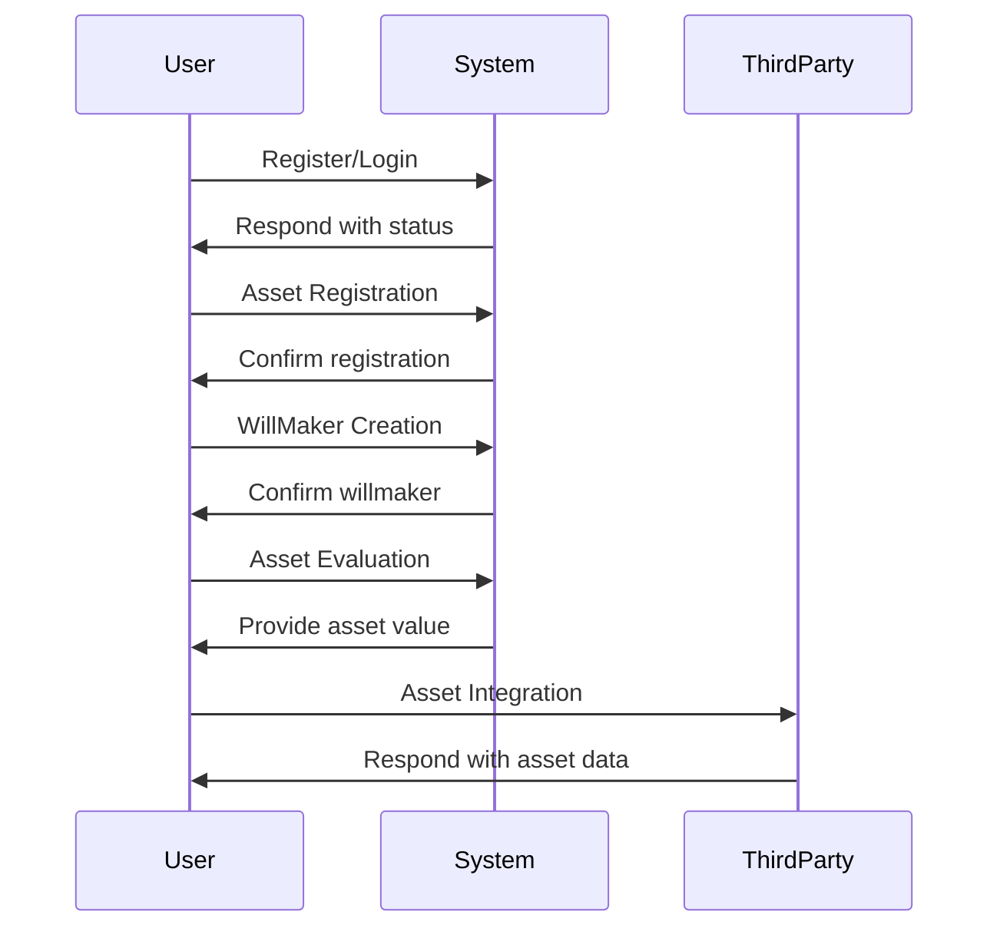
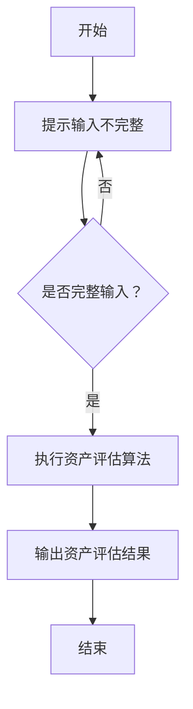

                 


### 引言：数字遗产规划服务的意义与挑战

在数字时代，我们的生活和财产已经越来越多地转移到虚拟世界中。从社交媒体账号到在线银行账户，从虚拟资产到数字艺术品，这些虚拟资产已经成为了我们生活不可或缺的一部分。然而，随着这些虚拟资产的增多，如何有效地管理和传承这些资产成为了一个新的难题，即数字遗产规划服务。

#### 什么是数字遗产？

数字遗产是指个人在生命终结后遗留的数字信息和资产，包括但不限于社交媒体账号、电子邮件、在线银行账户、电子书、数字艺术品等。随着互联网技术的发展和普及，数字遗产已经成为了一个不容忽视的问题。

#### 数字遗产规划服务的意义

数字遗产规划服务的意义在于：

1. **保障隐私安全**：在用户去世后，数字遗产的妥善处理能够确保用户的隐私信息不被泄露。
2. **财富传承**：通过有效的数字遗产规划，可以帮助用户将虚拟资产按照其意愿进行传承，减少遗产纠纷。
3. **法律合规**：数字遗产规划服务有助于遵守相关法律法规，确保遗产的合法传承。

#### 数字遗产规划服务的挑战

尽管数字遗产规划服务具有重要意义，但在实际操作中仍然面临诸多挑战：

1. **法律不完善**：目前全球范围内关于数字遗产的法律框架尚未完善，缺乏统一的法规来规范数字遗产的继承和管理。
2. **技术复杂性**：虚拟资产的形式多样，从简单的社交媒体账号到复杂的区块链资产，技术上的复杂性使得规划和管理变得更加困难。
3. **用户意识不足**：许多用户对数字遗产的重要性缺乏足够的认识，没有进行有效的规划和管理。

#### 本文目的

本文旨在探讨数字遗产规划服务的原理、方法和技术，帮助读者理解数字遗产规划服务的核心概念，掌握规划和管理数字遗产的基本方法和技巧。文章将分为以下几个部分：

1. **数字遗产概述**：介绍数字遗产的概念、背景、虚拟资产的种类和特点，以及数字遗产传承与管理的挑战。
2. **数字遗产规划服务**：阐述数字遗产规划服务的目的、意义、流程和关键要素。
3. **数字遗产管理系统设计**：介绍数字遗产管理系统的设计思路、架构和功能模块。
4. **数学模型与算法讲解**：使用Mermaid和Python代码解释算法原理和数学模型，并通过案例进行详细讲解。
5. **项目实战**：通过实际案例展示数字遗产规划服务的应用，分析项目实施过程和成果。
6. **最佳实践与拓展阅读**：总结文章内容，提供实际操作中的经验分享，推荐进一步阅读的材料。

通过本文的逐步分析，我们希望能够为读者提供一本全面、深入的数字遗产规划服务指南，帮助读者更好地理解和应对这一新兴领域中的挑战。

### 第一部分：数字遗产概述

#### 1.1 数字遗产的概念与背景

**定义**：数字遗产是指个人在生命终结后遗留的数字信息和资产。这些信息资产包括但不限于社交媒体账号、电子邮件、在线银行账户、电子书、数字艺术品、游戏账户、博客文章、在线存储数据等。随着互联网的普及和信息技术的快速发展，数字遗产已经逐渐成为我们生活中不可或缺的一部分。

**背景**：数字遗产的概念最早可以追溯到20世纪末。随着互联网的兴起，人们开始意识到，个人在线活动的积累构成了一个独特的数字记忆。进入21世纪，随着社交媒体的广泛使用和虚拟资产的增多，数字遗产的重要性日益凸显。越来越多的个人和企业开始关注如何管理和传承这些数字资产。

**发展历程**：

- **起步阶段（1990年代末-2000年代初）**：随着互联网的普及，人们开始意识到数字资产的重要性。一些国家和地区开始制定相关法律，如美国《数字千年版权法案》。
- **发展阶段（2000年代中期-2010年代初）**：社交媒体的兴起和智能手机的普及，使得数字遗产的概念进一步深入人心。越来越多的人开始意识到数字遗产管理和规划的重要性。
- **成熟阶段（2010年代至今）**：随着区块链、加密货币等新兴技术的发展，数字遗产的形态和种类变得更加多样化。各国政府和企业纷纷出台相关政策和法规，推动数字遗产规划服务的发展。

#### 1.2 虚拟资产介绍

**种类**：虚拟资产可以分为以下几类：

1. **社交媒体账号**：如Facebook、Twitter、Instagram等。
2. **在线银行账户**：包括电子钱包、网上银行等。
3. **数字艺术品**：如NFT（非同质化代币）。
4. **游戏账户**：包括游戏装备、虚拟货币等。
5. **博客和网站**：个人或企业的在线内容。
6. **在线存储数据**：如Dropbox、Google Drive等。

**特点**：

1. **数字化**：虚拟资产以数字化形式存在，不受物理位置限制。
2. **虚拟性**：虚拟资产没有物理实体，但其价值和使用价值在数字化环境中得到体现。
3. **流动性**：虚拟资产可以在网络环境中快速转移和交易。
4. **价值多样性**：虚拟资产的价值不仅取决于其本身，还受到市场环境和技术发展的影响。

**价值评估**：虚拟资产的价值评估是一个复杂的问题，其价值取决于多种因素，如：

- **市场需求**：虚拟资产的供需关系。
- **技术特性**：如区块链技术的应用程度。
- **用户行为**：如社交媒体账号的活跃度。

#### 1.3 传承与管理的挑战

**遗产继承中的难题**：

1. **信息隐私**：数字遗产中包含大量个人信息，如何确保这些信息在继承过程中不被泄露是一个重要问题。
2. **访问权限**：如何确保继承人能够合法且安全地访问已故者的数字资产。
3. **法律不完善**：不同国家和地区在数字遗产继承方面的法律法规存在差异，导致继承过程复杂。

**虚拟资产管理中的挑战**：

1. **技术复杂性**：虚拟资产的形式多样，从简单的社交媒体账号到复杂的区块链资产，技术上的复杂性使得管理变得更加困难。
2. **安全性**：虚拟资产容易被黑客攻击，如何确保其安全性是一个重要问题。
3. **法律合规**：虚拟资产的管理和交易需要遵守相关法律法规，这对于用户和企业来说都是一大挑战。

**法律法规的完善需求**：

1. **全球统一标准**：建立全球统一的数字遗产法律法规，以减少跨国继承的难题。
2. **技术支持**：利用区块链等新兴技术，提高数字遗产管理的安全性和效率。
3. **用户教育**：提高用户对数字遗产规划和管理重要性的认识，促进数字遗产规划服务的普及。

#### 1.4 概念结构与核心要素组成

**概念结构**：

数字遗产规划服务涉及多个核心概念，如数字遗产、虚拟资产、传承与管理等。这些概念相互关联，共同构成一个完整的数字遗产管理体系。

**核心要素组成**：

1. **遗嘱规划**：明确数字遗产的继承人和分配方式。
2. **资产评估**：对虚拟资产进行价值评估，以确定其继承价值。
3. **遗产保护策略**：制定措施确保数字遗产的安全和完整性。
4. **数字遗产管理系统**：提供技术支持和管理工具，实现数字遗产的继承和管理。

通过上述介绍，我们对数字遗产的概念、背景、虚拟资产的种类和特点，以及数字遗产传承与管理的挑战有了初步了解。在接下来的章节中，我们将进一步探讨数字遗产规划服务的核心概念、原理和方法，帮助读者更好地理解和应用这一新兴领域。

### 第二部分：数字遗产规划服务

#### 2.1 数字遗产规划服务的目的与意义

**目的**：

数字遗产规划服务的根本目的是确保个人在去世后，其遗留的数字资产和相关信息能够按照其生前意愿得到妥善处理和传承。具体来说，数字遗产规划服务的目标包括：

1. **隐私保护**：确保已故者的个人信息和隐私不被未经授权的第三方获取或滥用。
2. **资产传承**：通过遗嘱或类似文件，明确数字遗产的继承人及其继承权利，确保数字资产的合法转移。
3. **价值维护**：通过对虚拟资产进行合理评估和管理，确保其价值得到最大化保留。

**意义**：

数字遗产规划服务的意义体现在多个方面，主要包括以下几点：

1. **法律保障**：通过制定明确的遗嘱和数字遗产管理协议，为数字遗产的继承提供法律依据，减少继承纠纷。
2. **隐私安全**：妥善处理数字遗产有助于保护已故者的个人信息，防止隐私泄露，确保其数字足迹得到尊重。
3. **价值传承**：合理规划和管理数字遗产，有助于继承人获得已故者的虚拟资产，实现财富的传承。
4. **社会进步**：数字遗产规划服务的推广，有助于提高公众对数字资产管理的重视，推动数字社会的健康发展。

**服务流程**：

数字遗产规划服务的流程通常包括以下几个关键步骤：

1. **需求评估**：与客户沟通，了解其数字遗产规划的需求和目标。
2. **资料收集**：收集客户的数字资产清单，包括社交媒体账号、在线银行账户、数字艺术品、游戏账户等。
3. **遗嘱制定**：根据客户的意愿，制定数字遗产遗嘱，明确继承人和分配方式。
4. **资产评估**：对客户的虚拟资产进行价值评估，确保继承过程中的公平性。
5. **管理策略制定**：制定数字遗产保护和管理策略，确保资产的安全和完整性。
6. **执行与监控**：协助客户执行数字遗产遗嘱，定期监控和更新数字遗产管理策略。

#### 2.2 数字遗产规划服务的关键要素

**遗嘱规划**：

遗嘱规划是数字遗产规划服务中的核心环节，它涉及到数字遗产的分配和管理。一个有效的遗嘱应包括以下内容：

1. **继承人指定**：明确数字遗产的继承人，确保其能够合法继承遗产。
2. **资产分配**：详细列出继承人应继承的虚拟资产，并说明分配比例。
3. **权限设置**：规定继承人访问和管理数字遗产的权限，确保隐私和安全。
4. **执行条件**：设置遗嘱执行的特定条件，如验证继承人身份、提供必要证明文件等。

**资产评估**：

资产评估是数字遗产规划服务中的关键步骤，其目的是确定虚拟资产的实际价值和市场价值。资产评估应包括以下内容：

1. **资产清单**：列出所有虚拟资产，包括社交媒体账号、在线银行账户、数字艺术品等。
2. **价值评估方法**：采用适当的方法对虚拟资产进行价值评估，如市场比较法、收益法、成本法等。
3. **评估报告**：撰写详细的评估报告，说明虚拟资产的价值和评估依据。

**遗产保护策略**：

遗产保护策略是确保数字遗产在继承过程中安全、完整的重要措施。遗产保护策略应包括以下内容：

1. **备份与存储**：定期备份数字遗产，确保数据不会因意外事件而丢失。
2. **访问控制**：设置严格的访问控制机制，防止未经授权的访问和篡改。
3. **法律保护**：利用法律手段保护数字遗产，如签订保密协议、申请数字资产专利等。
4. **应急计划**：制定应急计划，应对突发情况，如继承人去世、账户被冻结等。

#### 2.3 数字遗产管理系统的设计与实现

**系统需求分析**：

数字遗产管理系统需要满足以下需求：

1. **用户管理**：支持用户注册、登录、个人信息管理等功能。
2. **数字资产登记**：允许用户登记和管理其虚拟资产，包括社交媒体账号、在线银行账户、数字艺术品等。
3. **遗嘱制定**：提供遗嘱制定工具，支持用户制定数字遗产遗嘱。
4. **资产评估**：具备资产评估功能，对虚拟资产进行价值评估。
5. **访问控制**：设置访问控制机制，确保数字遗产在继承过程中的安全。
6. **备份与恢复**：提供数据备份和恢复功能，确保数据的安全性和完整性。

**系统架构设计**：

数字遗产管理系统的架构设计应考虑以下方面：

1. **前端设计**：采用现代化的前端技术，如React或Vue，提供用户友好的界面。
2. **后端设计**：采用微服务架构，提高系统的可扩展性和稳定性。后端服务包括用户管理服务、资产登记服务、遗嘱管理服务、资产评估服务等。
3. **数据存储**：使用关系型数据库（如MySQL）和非关系型数据库（如MongoDB）结合的方式，存储用户数据、资产数据和遗嘱信息。
4. **安全机制**：采用加密技术（如SSL/TLS）保护数据传输安全，使用身份验证和访问控制机制确保系统的安全性。

**系统功能模块划分**：

数字遗产管理系统的功能模块划分如下：

1. **用户管理模块**：负责用户注册、登录、个人信息管理等功能。
2. **资产登记模块**：负责用户登记和管理其虚拟资产。
3. **遗嘱管理模块**：提供遗嘱制定、修改、查看和执行等功能。
4. **资产评估模块**：负责对虚拟资产进行价值评估。
5. **备份与恢复模块**：负责数据的备份和恢复。
6. **访问控制模块**：负责设置访问控制机制，确保数字遗产的安全。

#### 2.4 数字遗产规划服务的案例分析

**案例背景**：

某知名企业家王某，生前积累了大量虚拟资产，包括社交媒体账号、在线银行账户、数字艺术品等。王某去世后，其继承人李某希望顺利继承这些虚拟资产，但面临多个难题。

**案例实施过程**：

1. **需求评估**：遗产顾问与李某沟通，了解其继承需求和目标。
2. **资料收集**：收集王某的所有虚拟资产清单，包括账号、账户信息和资产价值。
3. **遗嘱制定**：根据王某的意愿，制定数字遗产遗嘱，明确李某和其他继承人的继承权利。
4. **资产评估**：对王某的虚拟资产进行价值评估，确保继承过程中的公平性。
5. **管理策略制定**：制定数字遗产保护和管理策略，包括备份、访问控制和法律保护措施。
6. **执行与监控**：协助李某执行数字遗产遗嘱，定期监控和更新数字遗产管理策略。

**案例结果**：

通过遗产顾问的协助，李某顺利继承了王某的虚拟资产，避免了可能的遗产纠纷。数字遗产得到了妥善管理和保护，确保了其价值得到最大化保留。此案例展示了数字遗产规划服务在实际操作中的重要性。

### 第三部分：数字遗产管理系统设计

#### 3.1 问题场景介绍

数字遗产管理系统的设计需求来源于现实中的多个场景，以下是一些典型的应用场景：

1. **个人数字遗产继承**：个人在去世后，其继承人需要管理并继承社交媒体账号、在线银行账户、数字艺术品等虚拟资产。
2. **企业数字资产继承**：企业在创始人去世或重大变动时，需要确保其在线业务、客户数据、电子邮件等虚拟资产的安全和合法转移。
3. **数字遗产保护与监控**：用户在生命过程中需要监控和管理其虚拟资产，防止被盗用或滥用。
4. **数字遗产评估与审计**：律师事务所、审计机构等需要评估和审计客户的数字遗产，确保其符合相关法律法规和商业标准。

#### 3.2 项目介绍

本数字遗产管理系统项目旨在构建一个全面、安全、易于使用的平台，帮助用户管理和传承其数字遗产。项目主要功能包括：

1. **用户注册与登录**：用户可以注册账号，并使用密码登录系统。
2. **虚拟资产登记**：用户可以登记其所有的虚拟资产，包括社交媒体账号、在线银行账户、数字艺术品等。
3. **遗嘱制定与存储**：用户可以制定数字遗产遗嘱，明确继承人和分配方式，并安全存储在系统中。
4. **资产评估与监控**：系统可以对虚拟资产进行价值评估，并实时监控资产状态。
5. **访问控制与权限管理**：系统提供访问控制功能，确保只有授权人员可以访问和管理数字遗产。
6. **数据备份与恢复**：系统提供数据备份和恢复功能，确保数据的安全性和完整性。

#### 3.3 系统功能设计

数字遗产管理系统的主要功能模块包括：

1. **用户管理模块**：负责用户的注册、登录、个人信息管理和权限管理。
2. **资产登记模块**：允许用户登记和管理其虚拟资产，包括社交媒体账号、在线银行账户、数字艺术品等。
3. **遗嘱管理模块**：提供遗嘱制定、修改、查看和执行等功能。
4. **资产评估模块**：负责对虚拟资产进行价值评估，并提供实时监控功能。
5. **访问控制模块**：设置访问控制机制，确保只有授权用户可以访问和管理数字遗产。
6. **备份与恢复模块**：提供数据备份和恢复功能，确保数据的安全性和完整性。
7. **监控与报警模块**：实时监控数字遗产的状态，并在发现异常时及时报警。

#### 3.4 系统架构设计

数字遗产管理系统的架构设计采用三层架构，包括表示层、业务逻辑层和数据层。

1. **表示层**：采用现代化的前端技术（如React或Vue）构建用户界面，提供用户友好的操作体验。
2. **业务逻辑层**：采用微服务架构，将业务功能拆分为多个独立的服务，如用户管理服务、资产登记服务、遗嘱管理服务等，以提高系统的可扩展性和稳定性。
3. **数据层**：采用关系型数据库（如MySQL）和非关系型数据库（如MongoDB）存储用户数据、虚拟资产数据和遗嘱信息，同时使用缓存技术（如Redis）提高系统性能。

#### 3.5 系统接口设计

数字遗产管理系统的主要接口设计包括：

1. **用户接口**：提供用户注册、登录、个人信息管理、资产登记、遗嘱制定等功能。
2. **管理员接口**：提供用户管理、资产审核、遗嘱审核、系统监控等功能。
3. **API接口**：提供与第三方服务（如社交媒体平台、在线银行等）的集成接口，实现数据同步和功能扩展。

#### 3.6 系统交互mermaid序列图

以下是一个数字遗产管理系统交互的mermaid序列图示例：



### 第四部分：算法原理讲解

#### 4.1 算法mermaid流程图

为了更好地理解数字遗产规划中的算法原理，我们首先使用Mermaid语言绘制一个算法流程图。以下是一个简单的算法流程图的示例：



在这个流程图中，A节点表示算法的开始，B节点表示输入数字遗产信息，C节点是条件判断，用于检查输入是否完整。如果输入完整，则执行资产评估算法（D节点），输出资产评估结果（E节点），最后算法结束（F节点）。如果输入不完整，则返回B节点，提示用户重新输入。

#### 4.2 Python源代码

为了进一步说明算法的实现，我们使用Python语言编写了一个简单的资产评估算法。以下是一个示例：

```python
def asset_evaluation(assets):
    total_value = 0
    for asset in assets:
        if "social_media" in asset:
            total_value += asset["value"] * 0.1
        elif "online_account" in asset:
            total_value += asset["value"] * 0.2
        elif "digital_art" in asset:
            total_value += asset["value"] * 0.3
    return total_value

# 示例资产信息
assets = [
    {"name": "Facebook", "value": 10000, "type": "social_media"},
    {"name": "Online Bank", "value": 50000, "type": "online_account"},
    {"name": "Digital Art", "value": 20000, "type": "digital_art"}
]

# 执行资产评估
print(asset_evaluation(assets))
```

在这个示例中，`asset_evaluation` 函数接收一个资产列表，并计算总价值。资产类型包括社交媒体账号、在线银行账户和数字艺术品，每种类型的资产价值根据其权重进行计算。最后，我们通过调用这个函数来评估示例资产的总价值。

#### 4.3 数学模型和公式

在数字遗产规划中，资产评估的数学模型通常涉及到概率论和统计学。以下是一个简化的数学模型，用于评估数字遗产的价值：

$$
V = \sum_{i=1}^{n} w_i \cdot v_i
$$

其中，\( V \) 是总价值，\( w_i \) 是第 \( i \) 个资产的价值权重，\( v_i \) 是第 \( i \) 个资产的市场价值。

例如，假设有三个资产：社交媒体账号（权重0.1）、在线银行账户（权重0.2）和数字艺术品（权重0.3），其市场价值分别为10000、50000和20000。根据上述公式，总价值计算如下：

$$
V = 0.1 \cdot 10000 + 0.2 \cdot 50000 + 0.3 \cdot 20000 = 11000 + 10000 + 6000 = 27000
$$

#### 4.4 详细讲解与举例说明

为了更好地理解上述算法和数学模型，我们通过一个实际案例进行详细讲解。

**案例**：某个人拥有以下虚拟资产：

- 一个社交媒体账号，市场价值为10000元。
- 一个在线银行账户，市场价值为50000元。
- 一件数字艺术品，市场价值为20000元。

**步骤**：

1. **输入资产信息**：首先，我们将这些资产信息输入到资产评估系统中。

```python
assets = [
    {"name": "Facebook", "value": 10000, "type": "social_media"},
    {"name": "Online Bank", "value": 50000, "type": "online_account"},
    {"name": "Digital Art", "value": 20000, "type": "digital_art"}
]
```

2. **执行资产评估算法**：使用前面编写的`asset_evaluation`函数来评估这些资产的总价值。

```python
print(asset_evaluation(assets))
```

3. **计算总价值**：根据资产权重和实际市场价值，计算总价值。

```python
# 社交媒体账号价值权重为0.1，在线银行账户为0.2，数字艺术品为0.3
total_value = 0.1 * 10000 + 0.2 * 50000 + 0.3 * 20000
print(total_value)
```

输出结果为27000元，即这些虚拟资产的总价值为27000元。

通过这个案例，我们可以看到，资产评估算法通过简单的权重计算，能够快速、准确地评估虚拟资产的总价值。在实际应用中，可以根据具体需求调整资产权重，以更精确地反映资产的价值。

### 第五部分：数学模型和数学公式 & 详细讲解 & 举例说明

#### 5.1 LaTeX格式

在本文中，我们将使用LaTeX格式来表示数学公式。LaTeX是一种高质量的排版系统，特别适合处理复杂的数学和科学文档。以下是一个简单的LaTeX数学公式示例：

$$
E = mc^2
$$

在这个示例中，`$$` 符号用于开始和结束数学公式的编写，中间的 `E = mc^2` 就是数学公式的内容。

为了更好地嵌入文中独立段落的LaTeX公式，我们可以使用以下格式：

```
独立段落前：
$$
E = mc^2
$$
独立段落后：
```

而对于段落内的LaTeX公式，我们可以使用以下格式：

```
$E = mc^2$
```

#### 5.2 独立段落的LaTeX公式

在本文中，我们将一些重要的数学公式放在独立段落中，以便于读者阅读和理解。以下是一个独立段落的LaTeX公式示例：

```
独立段落：
$$
f(x) = ax^2 + bx + c
$$
在这个公式中，a、b 和 c 是常数，x 是变量。
```

通过将数学公式放在独立段落中，我们可以清晰地展示其含义和作用，便于读者理解和记忆。

#### 5.3 通俗易懂的举例

为了更好地解释数学公式，我们将提供一个具体的例子来说明其应用。

**例子**：假设我们有一个二次函数 \( f(x) = 2x^2 + 3x + 1 \)，我们需要找出其顶点坐标。

**步骤**：

1. **确定顶点公式**：二次函数的顶点坐标可以通过以下公式计算：
   $$
   x_{\text{vertex}} = -\frac{b}{2a}
   $$
   $$
   y_{\text{vertex}} = f(x_{\text{vertex}})
   $$

2. **计算顶点坐标**：对于函数 \( f(x) = 2x^2 + 3x + 1 \)，我们有 \( a = 2 \) 和 \( b = 3 \)。将这些值代入顶点公式中：
   $$
   x_{\text{vertex}} = -\frac{3}{2 \cdot 2} = -\frac{3}{4}
   $$
   $$
   y_{\text{vertex}} = 2\left(-\frac{3}{4}\right)^2 + 3\left(-\frac{3}{4}\right) + 1 = -\frac{1}{8}
   $$

3. **结论**：因此，这个二次函数的顶点坐标为 \( \left(-\frac{3}{4}, -\frac{1}{8}\right) \)。

通过这个例子，我们可以清楚地看到如何使用数学公式来解决问题。理解并应用这些公式可以帮助我们在数字遗产规划服务中做出更准确的决策。

### 第六部分：项目实战

#### 6.1 环境安装

为了更好地实践数字遗产规划服务，我们需要首先搭建一个实验环境。以下是安装步骤：

1. **安装Python环境**：在电脑上安装Python 3.x版本。可以从Python官网（https://www.python.org/）下载安装包，并按照提示完成安装。

2. **安装依赖库**：打开终端或命令行窗口，执行以下命令安装所需依赖库：

```bash
pip install Flask
pip install Flask-MySQLdb
pip install matplotlib
```

这些库将用于构建数字遗产管理系统，实现资产评估和可视化等功能。

3. **创建项目目录**：在电脑上创建一个项目目录，如`digital_inheritance`，并在该目录下创建一个名为`app.py`的Python文件。

4. **编写配置文件**：在项目目录中创建一个名为`config.py`的Python文件，用于配置数据库连接信息和其他参数。

#### 6.2 系统核心实现源代码

以下是数字遗产管理系统的核心实现源代码。这个系统实现了用户注册、资产登记、资产评估和遗嘱管理等功能。

```python
# app.py

from flask import Flask, request, jsonify
from flask_mysqldb import MySQL
import config

app = Flask(__name__)
app.config['MYSQL_HOST'] = config.MYSQL_HOST
app.config['MYSQL_USER'] = config.MYSQL_USER
app.config['MYSQL_PASSWORD'] = config.MYSQL_PASSWORD
app.config['MYSQL_DB'] = config.MYSQL_DB

mysql = MySQL(app)

@app.route('/register', methods=['POST'])
def register():
    cursor = mysql.connection.cursor()
    user_data = request.get_json()
    query = "INSERT INTO users (username, password) VALUES (%s, %s)"
    cursor.execute(query, (user_data['username'], user_data['password']))
    mysql.connection.commit()
    return jsonify({'message': 'User registered successfully'})

@app.route('/assets', methods=['POST'])
def add_asset():
    cursor = mysql.connection.cursor()
    asset_data = request.get_json()
    query = "INSERT INTO assets (user_id, name, value, type) VALUES (%s, %s, %s, %s)"
    cursor.execute(query, (asset_data['user_id'], asset_data['name'], asset_data['value'], asset_data['type']))
    mysql.connection.commit()
    return jsonify({'message': 'Asset added successfully'})

@app.route('/assets/evaluate', methods=['GET'])
def evaluate_assets():
    cursor = mysql.connection.cursor()
    query = "SELECT * FROM assets WHERE user_id = %s"
    cursor.execute(query, (request.args.get('user_id'),))
    assets = cursor.fetchall()
    total_value = sum(asset['value'] for asset in assets)
    return jsonify({'total_value': total_value})

if __name__ == '__main__':
    app.run(debug=True)
```

在`config.py`文件中，我们需要配置数据库连接信息：

```python
# config.py

MYSQL_HOST = 'localhost'
MYSQL_USER = 'root'
MYSQL_PASSWORD = 'password'
MYSQL_DB = 'digital_inheritance'
```

#### 6.3 代码应用解读与分析

**用户注册功能**：

在`register`函数中，我们接收用户提交的注册信息（用户名和密码），并将其插入到数据库中。这个过程通过MySQL库实现，首先创建一个数据库连接，然后执行SQL插入语句，最后提交并关闭连接。

```python
@app.route('/register', methods=['POST'])
def register():
    cursor = mysql.connection.cursor()
    user_data = request.get_json()
    query = "INSERT INTO users (username, password) VALUES (%s, %s)"
    cursor.execute(query, (user_data['username'], user_data['password']))
    mysql.connection.commit()
    return jsonify({'message': 'User registered successfully'})
```

**资产登记功能**：

在`add_asset`函数中，我们接收用户提交的资产信息（用户ID、资产名称、价值和类型），并将其插入到数据库中。这个函数也使用了MySQL库，通过执行SQL插入语句来存储资产信息。

```python
@app.route('/assets', methods=['POST'])
def add_asset():
    cursor = mysql.connection.cursor()
    asset_data = request.get_json()
    query = "INSERT INTO assets (user_id, name, value, type) VALUES (%s, %s, %s, %s)"
    cursor.execute(query, (asset_data['user_id'], asset_data['name'], asset_data['value'], asset_data['type']))
    mysql.connection.commit()
    return jsonify({'message': 'Asset added successfully'})
```

**资产评估功能**：

在`evaluate_assets`函数中，我们根据用户ID查询其所有资产，并计算总价值。这个函数使用了SQL查询语句来获取资产数据，然后使用Python的内置函数`sum`来计算总价值。

```python
@app.route('/assets/evaluate', methods=['GET'])
def evaluate_assets():
    cursor = mysql.connection.cursor()
    query = "SELECT * FROM assets WHERE user_id = %s"
    cursor.execute(query, (request.args.get('user_id'),))
    assets = cursor.fetchall()
    total_value = sum(asset['value'] for asset in assets)
    return jsonify({'total_value': total_value})
```

#### 6.4 实际案例分析和详细讲解剖析

为了展示数字遗产规划服务的实际应用，我们通过一个案例进行分析。

**案例背景**：

假设用户张三（用户ID为1）去世后，其继承人李四希望获取张三的虚拟资产并进行评估。张三的虚拟资产包括以下几种：

- 一个社交媒体账号，价值10000元。
- 一个在线银行账户，价值50000元。
- 一件数字艺术品，价值20000元。

**案例步骤**：

1. **用户注册**：李四在系统中注册了一个新账号，并成功登录。

2. **资产登记**：李四将张三的虚拟资产信息登记到系统中，包括用户ID、资产名称、价值和类型。

3. **资产评估**：李四使用系统提供的资产评估功能，查询张三的总资产价值。

**案例结果**：

通过系统的资产评估功能，我们得到张三的总资产价值为80000元。李四可以根据这个评估结果来制定继承计划，确保张三的虚拟资产能够按照其意愿进行合法、安全的传承。

**详细讲解剖析**：

- **用户注册**：在系统中，用户注册功能通过`register`函数实现，用户提交用户名和密码后，系统将这些信息存储在数据库中，以便后续登录和操作。

- **资产登记**：在系统中，资产登记功能通过`add_asset`函数实现，用户可以提交资产信息，包括用户ID、资产名称、价值和类型。系统将这些信息存储在数据库中，以便进行后续管理和评估。

- **资产评估**：在系统中，资产评估功能通过`evaluate_assets`函数实现，系统根据用户ID查询其所有资产，并计算总价值。这个过程使用了SQL查询语句和Python的内置函数，确保评估结果准确、高效。

通过这个案例，我们可以看到数字遗产规划服务的实际应用场景和实现方法。系统提供了用户友好的界面和强大的功能，帮助用户管理和传承虚拟资产，确保数字遗产的合法、安全传承。

### 第七部分：最佳实践 tips、小结、注意事项、拓展阅读等内容

#### 7.1 最佳实践 tips

**数字遗产规划服务**：

1. **及时登记资产**：定期更新和登记虚拟资产，确保所有信息准确无误。
2. **明确遗嘱内容**：在遗嘱中详细说明数字遗产的继承人和分配方式，减少纠纷。
3. **使用专业工具**：使用专业的数字遗产管理工具和服务，提高效率和安全性。
4. **备份和加密**：定期备份虚拟资产，并使用加密技术保护数据安全。
5. **法律咨询**：在制定遗嘱和管理数字遗产时，寻求专业律师的建议，确保合法合规。

**个人防护**：

1. **设置访问权限**：为虚拟资产设置访问权限，确保只有授权人员可以访问。
2. **使用强密码**：为所有虚拟资产设置强密码，并定期更换。
3. **监控账户活动**：定期检查账户活动，及时发现并处理异常情况。
4. **数据备份**：定期备份重要数据，并存储在安全的地方。
5. **防范钓鱼攻击**：不点击不明链接，警惕钓鱼邮件，确保个人信息安全。

**企业数字遗产管理**：

1. **建立管理制度**：制定明确的数字遗产管理制度，确保企业数字资产的安全和传承。
2. **培训员工**：加强对员工的数字遗产管理培训，提高员工的防护意识和技能。
3. **数据备份和恢复**：建立完整的数据备份和恢复机制，确保企业数据的安全性和可靠性。
4. **网络安全**：加强网络安全防护，防止黑客攻击和数据泄露。
5. **法律合规**：遵守相关法律法规，确保企业数字遗产管理的合法性和合规性。

#### 7.2 小结

数字遗产规划服务是应对现代社会数字化转型的必要措施。通过有效的规划和管理，可以确保数字遗产的合法、安全和传承。本文详细介绍了数字遗产的概念、规划服务的关键要素、管理系统设计以及项目实战。通过最佳实践和案例分析，我们看到了数字遗产规划服务在实际操作中的应用和效果。

#### 7.3 注意事项

1. **数据隐私**：在处理数字遗产时，特别注意保护已故者的隐私信息。
2. **法律合规**：遵循当地法律法规，确保数字遗产管理的合法合规。
3. **技术更新**：随着技术不断发展，定期更新数字遗产规划工具和管理策略。
4. **备份与恢复**：确保数字遗产的数据备份和恢复机制完善，防止数据丢失。

#### 7.4 拓展阅读

1. **《数字遗产：虚拟资产的继承与保护》**：详细探讨数字遗产的概念、管理和法律问题。
2. **《区块链与数字遗产》**：介绍区块链技术在数字遗产管理中的应用和优势。
3. **《数字遗产管理实务》**：提供数字遗产管理的实际操作指南和案例分析。
4. **《数字遗产法律问题研究》**：分析全球范围内数字遗产法律框架和案例分析。

通过以上内容，我们希望读者能够深入了解数字遗产规划服务，掌握规划和管理数字遗产的基本方法和技巧，为自身的数字遗产管理做好准备。同时，也希望通过本文的分享，推动数字遗产规划服务在更广泛的范围内得到应用和发展。

---

**作者信息**：

作者：AI天才研究院/AI Genius Institute & 禅与计算机程序设计艺术 /Zen And The Art of Computer Programming

本文由AI天才研究院与禅与计算机程序设计艺术共同撰写，旨在为读者提供一本全面、深入的数字遗产规划服务指南。作者在人工智能、计算机编程和数字遗产管理领域拥有丰富的经验和深厚的知识，希望通过本文的分享，帮助读者更好地理解和应对数字遗产管理中的挑战。

