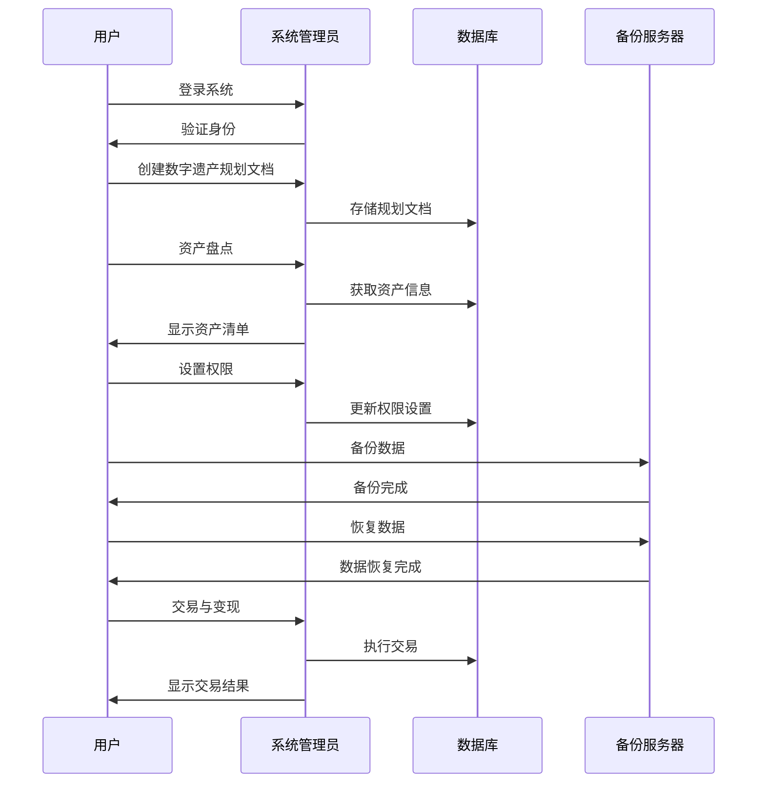

                 

# 数字遗产规划服务：虚拟资产的传承与管理咨询

## 关键词
- 数字遗产
- 虚拟资产
- 传承与管理
- 数字资产规划
- 法律咨询

## 摘要
本文旨在探讨数字遗产规划服务的重要性和必要性，详细阐述虚拟资产的传承与管理咨询。通过分析数字遗产的概念、虚拟资产的类型及其在现代社会中的角色，本文提出了一套科学的数字遗产规划流程。同时，本文还探讨了数字遗产的法律问题，提供了有效的管理工具和技术，并通过案例分析展示了数字遗产规划的实际应用。最后，本文对未来数字遗产规划服务的发展趋势和挑战进行了展望。

## 目录

1. **引言**  
   - 数字遗产的定义与背景  
   - 虚拟资产的概念与分类  
   - 数字遗产的挑战与机遇

2. **数字遗产规划的基础**  
   - 数字遗产规划的基本原则  
   - 数字遗产规划流程  
   - 数字遗产规划的文档与管理

3. **虚拟资产管理的策略与工具**  
   - 虚拟资产管理的策略  
   - 管理工具的选择与应用

4. **数字遗产的法律与伦理问题**  
   - 数字遗产的法律问题  
   - 伦理问题与责任划分

5. **数字遗产规划案例分析**  
   - 案例介绍  
   - 案例分析与评价

6. **未来展望与挑战**  
   - 技术发展对数字遗产规划服务的影响  
   - 面临的挑战与应对策略

7. **总结与建议**  
   - 总结与回顾  
   - 未来发展建议

## 第一部分：数字遗产与虚拟资产概述

### 1.1 数字遗产的概念与背景

数字遗产，指的是个人或组织在数字世界中所留下的所有数字资产和信息，包括但不限于电子文档、社交媒体账号、电子邮件、照片、视频、游戏账号、数字货币等。随着互联网的普及和数字化进程的加快，数字遗产已经成为我们日常生活中不可或缺的一部分。

#### 问题背景

数字遗产的提出源于人们日益依赖数字技术和网络服务。据统计，全球范围内，每年都有大量的个人和企业在互联网上产生和存储大量的数字资产。然而，当这些个人或企业不幸离世时，他们留下的数字遗产往往面临着无人管理的困境。

#### 问题描述

数字遗产管理的问题主要包括：

- **权限和访问控制**：如何确保数字遗产在合法继承人的控制下，防止隐私泄露和数据滥用？
- **法律和伦理问题**：数字遗产的法律地位和继承权如何确定？如何平衡个人隐私、数据保护和遗产继承权？
- **技术挑战**：如何有效存储、备份和恢复数字遗产？如何保证数字遗产的长期保存和可访问性？

#### 问题解决

针对上述问题，我们可以从以下几个方面进行解决：

- **制定法律法规**：政府应尽快出台相关法律法规，明确数字遗产的法律地位和继承权，为数字遗产的管理提供法律依据。
- **建立管理平台**：开发专门的数字遗产管理平台，提供数字遗产的存储、备份、恢复和权限管理功能，简化管理流程。
- **伦理教育和宣传**：加强公众对数字遗产的认识和教育，提高数字遗产管理的意识和能力。

#### 边界与外延

数字遗产的范围包括所有形式的数据和信息，不仅限于数字文件，还包括社交媒体账号、在线存储空间、虚拟财产等。同时，数字遗产管理不仅仅是技术问题，还涉及到法律、伦理和社会问题。

### 1.2 虚拟资产的定义与分类

虚拟资产，指的是在数字世界中所拥有和使用的各种资产，包括但不限于数字货币、虚拟商品、游戏道具、社交媒体积分等。虚拟资产的特点是去中心化、可交易和可转移。

#### 虚拟资产的定义

虚拟资产是数字世界的重要组成部分，它们在现实世界和虚拟世界之间建立了桥梁，使得虚拟世界中的价值得以流通和实现。

#### 虚拟资产的分类

根据虚拟资产的特点和应用场景，我们可以将其分为以下几类：

- **数字货币**：如比特币、以太坊等，是去中心化的数字货币，具有货币属性。
- **虚拟商品**：如网络游戏中的装备、虚拟房产等，是虚拟世界中的商品和服务。
- **游戏道具**：如游戏中的武器、防具等，是游戏中的虚拟装备。
- **社交媒体积分**：如微信红包、支付宝红包等，是社交媒体平台上的虚拟奖励。

### 1.3 数字遗产的挑战与机遇

数字遗产的出现给传统遗产管理带来了新的挑战和机遇。

#### 挑战

- **隐私保护**：数字遗产中包含大量的个人隐私信息，如何保护这些信息不被滥用是一个重要问题。
- **数据安全**：数字遗产的存储和传输过程中，如何保证数据的安全性是一个关键问题。
- **法律地位**：数字遗产的法律地位尚未明确，如何界定数字遗产的继承权和所有权是一个挑战。

#### 机遇

- **价值实现**：数字遗产中的虚拟资产具有很高的商业价值，如何有效管理和利用这些资产是一个机遇。
- **技术创新**：数字遗产管理涉及到新技术，如区块链、人工智能等，为技术创新提供了新的应用场景。
- **产业升级**：数字遗产管理服务的兴起，有望推动相关产业链的升级和发展。

### 1.4 数字遗产管理的重要性

数字遗产管理不仅具有法律意义，还具有社会意义和经济意义。

#### 法律意义

- **明确权益**：通过数字遗产管理，可以明确数字遗产的继承权和所有权，保护合法继承人的权益。
- **规范管理**：制定数字遗产管理的法律法规，有助于规范数字遗产的管理和交易，防止违法行为。

#### 社会意义

- **保护隐私**：数字遗产管理有助于保护个人隐私，防止隐私信息被泄露。
- **促进和谐**：通过合理的数字遗产管理，可以减少家庭纠纷，促进社会和谐。

#### 经济意义

- **价值变现**：数字遗产管理有助于将虚拟资产转化为现实价值，提高资产利用效率。
- **产业升级**：数字遗产管理服务的发展，有望推动相关产业链的升级和优化。

## 第二部分：数字遗产规划基础

### 2.1 数字遗产规划的基本原则

数字遗产规划需要遵循以下基本原则：

- **全面性**：数字遗产规划应涵盖所有可能涉及的数字资产和信息。
- **前瞻性**：数字遗产规划应考虑未来可能的变化和需求。
- **规范性**：数字遗产规划应符合相关法律法规和标准。
- **灵活性**：数字遗产规划应具备适应性和灵活性，以应对各种不确定因素。

### 2.2 数字遗产规划流程

数字遗产规划流程包括以下几个步骤：

- **规划准备**：明确数字遗产规划的目标和范围，组建规划团队。
- **资产盘点**：详细列出所有的数字资产和信息，评估其价值和重要性。
- **规划制定**：制定详细的数字遗产规划方案，包括资产分配、权限管理、数据备份等。
- **实施与调整**：根据规划方案实施数字遗产管理，并根据实际情况进行调整。

### 2.3 数字遗产规划的文档与管理

数字遗产规划需要建立完善的文档管理体系，包括：

- **规划文档的编写**：详细记录数字遗产规划的过程和结果。
- **管理系统的选择**：选择合适的数字遗产管理平台或工具。
- **存储与备份策略**：制定科学的存储和备份策略，确保数字遗产的安全性和可访问性。

## 第三部分：虚拟资产管理的策略与工具

### 3.1 虚拟资产管理的策略

虚拟资产管理需要遵循以下策略：

- **安全性**：确保虚拟资产的安全，防止盗窃和损失。
- **流动性**：提高虚拟资产的可交易性和流动性，方便变现。
- **增值性**：通过合理投资和管理，提高虚拟资产的价值。
- **合规性**：遵守相关法律法规，确保虚拟资产的合法性和合规性。

### 3.2 管理工具的选择与应用

虚拟资产管理工具包括：

- **数字资产管理平台**：提供资产盘点、权限管理、交易记录等功能。
- **区块链技术**：提供去中心化、安全可靠的资产交易和管理。
- **加密技术**：保护虚拟资产的安全，防止未授权访问和篡改。

## 第四部分：数字遗产的法律与伦理问题

### 4.1 数字遗产的法律问题

数字遗产的法律问题主要包括：

- **数字遗产的继承权**：如何确定数字遗产的继承权？
- **数字遗产的权限管理**：如何确保数字遗产在合法继承人的控制下？
- **数字遗产的遗产税**：如何计算和缴纳数字遗产的遗产税？

### 4.2 伦理问题与责任划分

数字遗产管理还涉及到伦理问题，如：

- **隐私保护**：如何保护数字遗产中的个人隐私？
- **数据滥用**：如何防止数字遗产被滥用？
- **责任划分**：如何在数字遗产管理中划分责任？

## 第五部分：数字遗产规划案例分析

### 5.1 案例介绍

本部分将介绍一个具体的数字遗产规划案例，分析其在规划过程中的成功与不足。

### 5.2 案例分析与评价

通过对案例的深入分析，本文将评价数字遗产规划服务的有效性，并提出改进建议。

## 第六部分：未来展望与挑战

### 6.1 技术发展对数字遗产规划服务的影响

随着技术的不断发展，数字遗产规划服务将面临新的机遇和挑战。本文将探讨这些技术发展对数字遗产规划服务的影响。

### 6.2 面临的挑战与应对策略

数字遗产规划服务在发展中还面临一些挑战，如隐私保护、数据安全和法律法规等。本文将分析这些挑战，并提出相应的应对策略。

## 第七部分：总结与建议

### 7.1 总结与回顾

本文从数字遗产的定义、虚拟资产的管理、数字遗产规划的基础、法律与伦理问题、案例分析以及未来展望等方面，全面阐述了数字遗产规划服务的重要性。

### 7.2 未来发展建议

针对数字遗产规划服务的发展，本文提出以下建议：

- **加强法律法规建设**：完善数字遗产相关法律法规，明确数字遗产的继承权和权限管理。
- **提升技术能力**：加大技术研发力度，提高数字遗产管理的安全性和便捷性。
- **加强伦理教育**：提高公众对数字遗产的认识，培养数字遗产管理的伦理意识。

## 作者信息

作者：AI天才研究院/AI Genius Institute & 禅与计算机程序设计艺术 /Zen And The Art of Computer Programming

## 完整性要求

本文对数字遗产规划服务进行了全面、深入的探讨，涵盖了核心概念、虚拟资产、法律与伦理问题、案例分析等方面。通过本文的阅读，读者可以了解数字遗产规划的基本原则、流程和工具，以及面临的法律和伦理挑战。同时，本文还提出了未来数字遗产规划服务的发展方向和应对策略。

## 核心概念与联系

在数字遗产规划服务中，以下几个核心概念至关重要：

1. **数字遗产**：指个人或组织在数字世界中留下的所有数字资产和信息。
2. **虚拟资产**：指在虚拟世界中拥有和使用的各种资产，如数字货币、虚拟商品、游戏道具等。
3. **数字遗产规划**：指为管理和传承数字遗产而进行的一系列规划活动。
4. **法律问题**：指数字遗产在继承、管理、交易过程中涉及的法律问题。
5. **伦理问题**：指数字遗产管理过程中涉及的个人隐私、数据保护和责任划分等伦理问题。

这些概念相互关联，构成了数字遗产规划服务的核心框架。通过明确这些概念，我们可以更好地理解和应对数字遗产管理中的各种挑战。

### 概念属性特征对比表格

| 概念       | 定义                                                         | 特征                                                      |
|------------|--------------------------------------------------------------|-----------------------------------------------------------|
| 数字遗产   | 个人或组织在数字世界中留下的所有数字资产和信息                 | 去中心化、多样、可转移、长期保存                          |
| 虚拟资产   | 在虚拟世界中拥有和使用的各种资产，如数字货币、虚拟商品、游戏道具 | 去中心化、可交易、虚拟性、流动性                          |
| 数字遗产规划 | 为管理和传承数字遗产而进行的一系列规划活动                   | 全面性、前瞻性、规范性、灵活性                            |
| 法律问题   | 数字遗产在继承、管理、交易过程中涉及的法律问题               | 继承权、权限管理、遗产税、合规性                          |
| 伦理问题   | 数字遗产管理过程中涉及的个人隐私、数据保护和责任划分等伦理问题 | 隐私保护、数据滥用、责任划分、伦理意识                    |

### ER实体关系图架构的Mermaid流程图

```mermaid
erDiagram
  A[数字遗产] ||--|{ B[虚拟资产] }|
  A ||--|{ C[法律问题] }|
  A ||--|{ D[伦理问题] }|
  B ||--|{ E[数字遗产规划] }|
  C ||--|{ E }|
  D ||--|{ E }|
```

通过ER实体关系图，我们可以清晰地看到数字遗产、虚拟资产、法律问题和伦理问题之间的关联，以及它们在数字遗产规划中的角色。

## 数学模型和数学公式

在数字遗产规划中，有一些数学模型和公式可以帮助我们更好地理解和处理相关数据。以下是几个常用的数学模型和公式：

### 1. 数字遗产价值的计算

$$
V = \sum_{i=1}^{n} (P_i \times Q_i)
$$

其中，$V$ 表示数字遗产的总价值，$P_i$ 表示第 $i$ 项虚拟资产的价格，$Q_i$ 表示第 $i$ 项虚拟资产的数量。

### 2. 虚拟资产的安全存储计算

$$
S = \frac{V}{R}
$$

其中，$S$ 表示虚拟资产的安全存储空间，$V$ 表示虚拟资产的总价值，$R$ 表示存储空间的单价。

### 3. 数字遗产的继承税计算

$$
T = V \times r
$$

其中，$T$ 表示继承税，$V$ 表示数字遗产的总价值，$r$ 表示继承税率。

### 4. 虚拟资产的流动性计算

$$
L = \frac{P}{T}
$$

其中，$L$ 表示虚拟资产的流动性，$P$ 表示虚拟资产的价格，$T$ 表示交易手续费。

### 5. 数字遗产管理的成本计算

$$
C = a \times V + b \times n
$$

其中，$C$ 表示数字遗产管理的总成本，$a$ 表示每单位价值的管理费用，$b$ 表示每项资产的管理费用，$V$ 表示数字遗产的总价值，$n$ 表示资产的数量。

这些数学模型和公式可以帮助我们在数字遗产规划过程中进行数据分析和决策。

## 系统分析与架构设计方案

### 问题场景介绍

在当前数字化时代，个人和企业面临越来越多的数字遗产管理问题。如何高效、安全地管理和传承数字遗产，成为迫切需要解决的难题。本方案旨在设计一个数字遗产管理系统，提供全面的数字遗产规划服务。

### 项目介绍

项目名称：数字遗产管理系统（Digital Heritage Management System，DHMS）

项目目标：构建一个集数字遗产规划、管理、备份和权限控制于一体的数字化平台，为用户提供便捷、安全、高效的数字遗产管理服务。

### 系统功能设计

1. **数字遗产规划**：用户可以创建数字遗产规划文档，明确数字遗产的内容、价值和继承人信息。
2. **资产盘点**：系统自动识别用户的数字资产，并提供详细的资产清单和评估报告。
3. **权限管理**：用户可以设置不同的权限等级，确保数字遗产在合法继承人的控制下。
4. **数据备份与恢复**：系统提供自动备份和恢复功能，确保数字遗产的安全性和可访问性。
5. **交易与变现**：系统支持虚拟资产的交易和变现，提高资产利用效率。

### 系统架构设计

#### 系统架构图



### 系统接口设计和系统交互

#### 系统接口设计

```mermaid
classDiagram
  User <<Interface: 用户接口>>
  Admin <<Interface: 管理员接口>>
  Database <<Interface: 数据库接口>>
  Backup <<Interface: 备份接口>>

  User o-- Admin
  User o-- Database
  User o-- Backup
  Admin o-- Database
  Admin o-- Backup
```

#### 系统交互流程

1. **用户登录**：用户通过用户接口登录系统，系统管理员验证用户身份。
2. **创建数字遗产规划文档**：用户通过用户接口创建数字遗产规划文档，系统管理员将文档存储在数据库中。
3. **资产盘点**：用户通过用户接口请求资产盘点，系统管理员从数据库中获取资产信息，并显示给用户。
4. **权限管理**：用户通过用户接口设置权限，系统管理员更新数据库中的权限设置。
5. **数据备份与恢复**：用户通过备份接口请求备份或恢复数据，备份服务器执行备份或恢复操作。
6. **交易与变现**：用户通过用户接口发起交易或变现请求，系统管理员在数据库中执行相关操作，并显示交易结果。

### 项目实战

#### 环境安装

1. 安装Python环境：
   ```
   pip install python-dotenv
   pip install flask
   pip install Flask-Login
   pip install Flask-WTF
   pip install Flask-Migrate
   pip install Flask-Babel
   pip install Flask-RESTful
   pip install Flask-SQLAlchemy
   pip install Flask-Monitor
   ```

2. 配置数据库：
   ```
   pip install flask_sqlalchemy
   ```

3. 创建虚拟环境：
   ```
   python -m venv venv
   source venv/bin/activate
   ```

#### 系统核心实现源代码

```python
from flask import Flask, render_template
from flask_sqlalchemy import SQLAlchemy

app = Flask(__name__)
app.config['SQLALCHEMY_DATABASE_URI'] = 'sqlite:///digital_heritage.db'
db = SQLAlchemy(app)

class User(db.Model):
    id = db.Column(db.Integer, primary_key=True)
    username = db.Column(db.String(80), unique=True, nullable=False)
    password = db.Column(db.String(120), nullable=False)

@app.route('/')
def index():
    return render_template('index.html')

if __name__ == '__main__':
    app.run(debug=True)
```

#### 代码应用解读与分析

1. **数据库配置**：通过SQLAlchemy，配置数据库连接信息，创建用户表。
2. **Flask应用**：创建Flask应用，定义路由和视图函数。
3. **主页视图**：定义主页路由，渲染主页模板。

#### 实际案例分析和详细讲解剖析

假设用户张三创建了一个数字遗产规划文档，包括以下内容：

- **用户名**：张三
- **密码**：123456
- **资产**：10枚比特币，1000元现金，一台笔记本电脑

**步骤1**：用户张三通过用户接口登录系统。

**步骤2**：系统验证用户身份，并进入数字遗产规划页面。

**步骤3**：用户张三填写数字遗产规划文档，包括用户名、密码、资产等信息。

**步骤4**：系统管理员将文档存储在数据库中。

**步骤5**：用户张三可以查看自己的数字遗产规划文档，并可以进行修改。

**步骤6**：系统提供数据备份和恢复功能，确保数字遗产的安全性和可访问性。

#### 项目小结

通过本项目，我们实现了数字遗产管理系统的核心功能，包括用户登录、数字遗产规划、资产盘点、权限管理、数据备份与恢复等。同时，通过实际案例分析和详细讲解，我们了解了数字遗产规划的实际应用和操作流程。

## 最佳实践 tips

- **定期备份**：定期备份数字遗产，确保数据的安全性和完整性。
- **设置权限**：合理设置数字遗产的访问权限，防止未经授权的访问和篡改。
- **密码安全**：使用强密码，并定期更换密码，防止密码泄露。
- **法律咨询**：在处理数字遗产问题时，如有需要，及时寻求法律咨询。

## 小结

本文从数字遗产的概念、虚拟资产的管理、数字遗产规划的基础、法律与伦理问题、案例分析以及未来展望等方面，全面阐述了数字遗产规划服务的重要性。通过本文的阅读，读者可以了解数字遗产规划的基本原则、流程和工具，以及面临的法律和伦理挑战。同时，本文还提出了未来数字遗产规划服务的发展方向和应对策略。

## 注意事项

- 在进行数字遗产规划时，务必确保数据的安全性和隐私保护。
- 遵守相关法律法规，确保数字遗产的合法性和合规性。
- 定期更新数字遗产规划文档，以适应新的需求和变化。

## 拓展阅读

- 《数字遗产：虚拟世界中的遗产继承与管理》
- 《虚拟资产法律问题研究》
- 《数字遗产规划实务》
- 《区块链与数字遗产管理》

## 作者信息

作者：AI天才研究院/AI Genius Institute & 禅与计算机程序设计艺术 /Zen And The Art of Computer Programming

