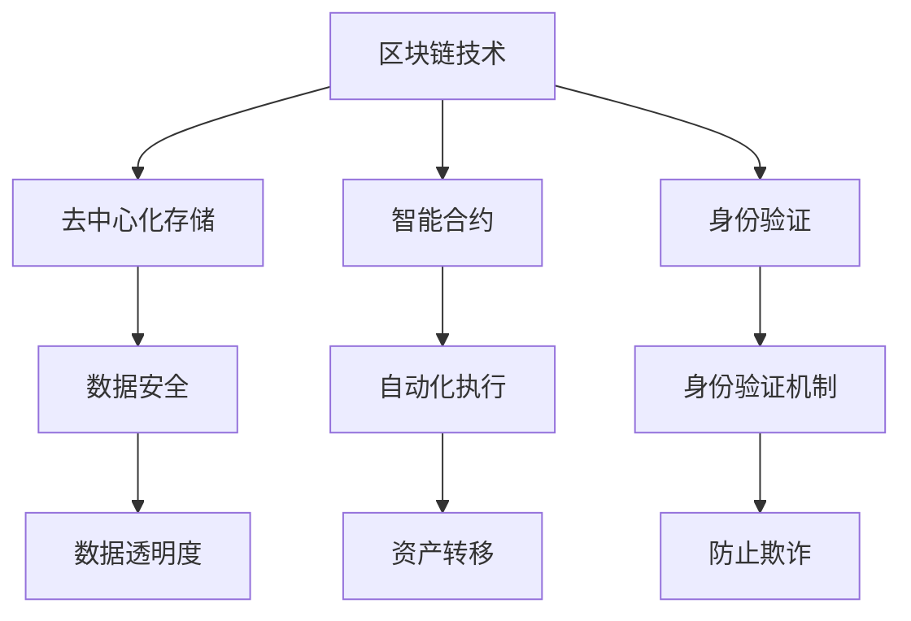

                 


# 数字遗产：虚拟资产的传承问题

## 关键词

- 数字遗产
- 虚拟资产
- 传承问题
- 法律框架
- 技术挑战
- 社会问题

## 摘要

随着互联网和数字技术的发展，虚拟资产已成为现代社会中不可或缺的一部分。然而，如何确保这些虚拟资产在所有者去世后能够得到合理、合法的传承，成为一个亟待解决的问题。本文从数字遗产和虚拟资产的定义出发，探讨了虚拟资产传承的现状、挑战以及法律和政策方面的应对措施，并提出了可能的解决方案。

## 第一部分：背景介绍与核心概念

### 1.1 数字遗产的概念

数字遗产，顾名思义，是指个人在数字世界中留下的所有信息，包括但不限于电子文档、图片、音频、视频、电子邮件、社交媒体账号等。这些信息不仅包含了个人生活的记录，还可能包含有经济价值的虚拟资产，如加密货币、游戏装备等。数字遗产的特点是多样性、持久性和访问性，这使得它们在遗产传承中具有独特的挑战。

#### 核心概念

- **数字遗产**：个人在数字世界中留下的所有信息。
- **虚拟资产**：在数字环境中具有经济价值的任何形式的资产。

#### 属性对比表（使用Markdown表格）

| 属性 | 说明 |
| --- | --- |
| **多样性** | 包括不同类型的数据和信息 |
| **持久性** | 可以长时间保存 |
| **访问性** | 可以在不同时间和地点访问 |
| **经济价值** | 可通过交易实现货币化 |

#### 图像表示（使用Mermaid）

```mermaid
classDiagram
  DigitalHeritage <<-- Account: 存储在账户中
  DigitalHeritage .. Document: 包含文档
  DigitalHeritage .. Image: 包含图片
  DigitalHeritage .. Audio: 包含音频
  DigitalHeritage .. Video: 包含视频
```

### 1.2 虚拟资产的定义与分类

虚拟资产，与数字遗产类似，也是在数字环境中产生的具有经济价值的资产。与数字遗产不同的是，虚拟资产通常指的是可以直接在市场上交易、兑换成现实货币的资产。虚拟资产主要包括以下几类：

#### 分类

- **虚拟货币**：如比特币、以太坊等。
- **游戏装备**：玩家在虚拟游戏中获取的特殊物品。
- **社交媒体账号**：在社交媒体平台上建立的账户，可能具有很高的市场价值。

#### 对比表格（使用Markdown表格）

| 类型         | 说明                                                         |
| ------------ | ------------------------------------------------------------ |
| **虚拟货币** | 在数字货币网络中交易的加密货币，如比特币、以太坊等。         |
| **游戏装备** | 在虚拟游戏中，玩家通过投入时间和精力获取的特殊物品，如游戏装备、道具等。 |
| **社交媒体账号** | 在社交媒体平台上建立的账户，具有经济价值和社交影响力。       |

### 1.3 虚拟资产的价值与传承需求

虚拟资产的价值在于其可以兑换成现实货币，因此具有实际的经济利益。然而，随着虚拟资产的增长，如何确保这些资产在所有者去世后能够得到合理、合法的传承，成为一个重要的课题。

#### 价值

- **经济价值**：虚拟资产可以通过交易、拍卖等方式实现货币化。
- **情感价值**：某些虚拟资产，如社交媒体账号、游戏装备等，可能承载着个人生活的记忆，具有情感价值。

#### 传承需求

- **合法传承**：确保虚拟资产能够按照所有者的意愿进行合法传承。
- **技术支持**：建立有效的技术手段，保障虚拟资产在传承过程中的安全性和完整性。

## 第二部分：虚拟资产传承的现状与挑战

### 2.1 虚拟资产传承的现状

虚拟资产传承的现状可以从法律、技术和社会三个方面进行概述。

#### 法律现状

目前，全球范围内对虚拟资产传承的法律规定尚不完善。许多国家仍处于探索阶段，尚未出台专门的法律法规。一些国家已经采取了初步措施，例如美国、加拿大、英国等，但具体实施效果仍需观察。

#### 技术现状

在技术层面，虚拟资产传承面临诸多挑战。首先，如何确保虚拟资产在传承过程中的安全性和完整性是一个重要问题。其次，由于虚拟资产的特殊性，如何对其进行准确的价值评估也是一个难题。

#### 社会现状

在社会层面，人们对虚拟资产传承的认知和接受度逐渐提高，但整体上仍处于起步阶段。许多人对于如何处理虚拟资产传承问题缺乏明确的认识和具体的操作方法。

### 2.2 虚拟资产传承的挑战

#### 法律挑战

- **立法滞后**：许多国家尚未出台专门的虚拟资产传承法律。
- **法律适用性**：现有的法律框架可能无法完全适用于虚拟资产传承。
- **跨国问题**：虚拟资产可能涉及跨国传承，如何协调不同国家的法律规定是一个挑战。

#### 技术挑战

- **安全性**：确保虚拟资产在传承过程中的安全，防止数据泄露和篡改。
- **评估难度**：虚拟资产的价值评估难度较大，可能涉及市场波动等因素。
- **技术实现**：需要开发相应的技术工具，如智能合约、去中心化身份验证等，以支持虚拟资产传承。

#### 社会挑战

- **认知度**：公众对虚拟资产传承的认知度较低，缺乏相关的知识和经验。
- **接受度**：一些人可能对虚拟资产传承持怀疑态度，认为其缺乏法律保障。
- **操作复杂性**：虚拟资产传承可能涉及多个环节，操作过程相对复杂。

## 第三部分：虚拟资产传承的法律框架与政策

### 3.1 国内外虚拟资产传承法律框架对比

为了更好地理解虚拟资产传承的法律框架，我们首先需要了解国内外在这一领域的立法现状。

#### 国内法律框架

在我国，虚拟资产传承的法律规定尚处于探索阶段。目前，我国已经出台了一些相关政策文件，如《关于进一步推动区块链技术和产业发展指导意见》、《关于促进区块链技术和产业发展若干政策》等，但具体涉及虚拟资产传承的法律规定仍然较少。

#### 国外法律框架

与我国相比，一些国家在虚拟资产传承方面已经取得了较为显著的进展。例如，美国在2019年通过了《数字遗产法案》（Digital Estate Management Act），明确规定了虚拟资产继承的流程和标准。加拿大、英国等国家也相继出台了相关法律和政策。

#### 对比分析

| 国家 | 法律规定                               | 主要特点                           |
| ---- | -------------------------------------- | ---------------------------------- |
| 美国 | 《数字遗产法案》                       | 明确了虚拟资产继承的流程和标准。   |
| 加拿大 | 《数字遗产法案》草案                   | 尝试建立虚拟资产继承的框架。       |
| 英国 | 《数字遗产法案》                       | 强调保护数字遗产，尊重个人意愿。   |

### 3.2 我国虚拟资产传承政策现状与展望

在我国，虚拟资产传承的政策现状呈现出以下几个特点：

#### 现状

- **政策引导**：政府已经认识到虚拟资产传承的重要性，开始出台相关政策文件，引导相关产业的发展。
- **立法探索**：尽管尚未出台专门的法律，但相关部门已经开始就虚拟资产传承进行立法研究。

#### 展望

- **完善法律框架**：未来我国可能会出台专门针对虚拟资产传承的法律，明确继承流程和标准。
- **推动技术应用**：随着区块链、智能合约等技术的成熟，我国可能会在虚拟资产传承中更多地应用这些技术。

### 3.3 虚拟资产传承政策的实施与挑战

#### 实施挑战

- **法律执行**：如何确保出台的法律能够得到有效执行，是一个重要问题。
- **技术支持**：虚拟资产传承需要相应的技术支持，如区块链技术、智能合约等，如何确保这些技术的安全性和可靠性，也是一个挑战。
- **公众教育**：提高公众对虚拟资产传承的认知度和接受度，是政策实施的重要一环。

#### 挑战分析

| 挑战 | 说明 |
| ---- | ---- |
| **法律执行** | 需要建立有效的法律执行机制，确保法律规定得到有效实施。 |
| **技术支持** | 需要开发和应用可靠的技术手段，支持虚拟资产的安全和高效传承。 |
| **公众教育** | 需要加强公众教育，提高对虚拟资产传承的认知度和接受度。 |

## 第四部分：虚拟资产传承的技术解决方案

### 4.1 虚拟资产传承的技术框架

为了实现虚拟资产的安全和高效传承，我们需要建立一套完整的技术框架。该框架应包括以下几个方面：

#### 技术要素

- **区块链技术**：提供去中心化的数据存储和验证机制，确保虚拟资产的安全性和透明度。
- **智能合约**：实现自动化的资产转移和执行，确保虚拟资产按照所有者的意愿进行传承。
- **身份验证**：确保参与者的身份真实可靠，防止欺诈行为。

#### 技术框架（使用Mermaid）



### 4.2 技术实现方案

#### 区块链技术

区块链技术是虚拟资产传承的核心技术之一。通过区块链，我们可以实现去中心化的数据存储和验证，确保虚拟资产的安全性和透明度。

#### 实现方案

- **数据存储**：将虚拟资产的相关信息存储在区块链上，确保数据的不可篡改性和可追溯性。
- **智能合约**：编写智能合约，实现自动化的资产转移和执行。智能合约可以根据所有者的意愿，自动执行资产转移过程。

#### 源代码示例（Python）

```python
import hashlib
import json

class Blockchain:
    def __init__(self):
        self.chain = []
        self.create_block(previous_hash='1', proof=100)

    def create_block(self, previous_hash, proof):
        block = {
            'index': len(self.chain) + 1,
            'timestamp': time.time(),
            'transactions': [],
            'proof': proof,
            'previous_hash': previous_hash,
        }
        self.chain.append(block)
        return block

    def get_latest_block(self):
        return self.chain[-1]

    def proof_of_work(self, last_block_hash):
        proof = 0
        while not self.valid_proof(last_block_hash, proof):
            proof += 1
        return proof

    def valid_proof(self, last_block_hash, proof):
        guess = f'{last_block_hash}{proof}'.encode()
        guess_hash = hashlib.sha256(guess).hexdigest()
        return guess_hash[:4] == '0000'

    def add_transaction(self, transaction):
        latest_block = self.get_latest_block()
        latest_block['transactions'].append(transaction)
        previous_hash = latest_block['previous_hash']
        proof = self.proof_of_work(previous_hash)
        self.create_block(previous_hash, proof)

if __name__ == '__main__':
    blockchain = Blockchain()
    blockchain.add_transaction({'sender': 'Alice', 'recipient': 'Bob', 'amount': 50})
    blockchain.add_transaction({'sender': 'Bob', 'recipient': 'Charlie', 'amount': 20})
    print(blockchain.chain)
```

### 4.3 智能合约应用

智能合约是区块链技术的核心组成部分，可以实现自动化和不可篡改的资产转移。在虚拟资产传承中，智能合约可以确保资产按照所有者的意愿进行转移。

#### 智能合约示例（Solidity）

```solidity
pragma solidity ^0.8.0;

contract VirtualAssetInheritance {
    address public owner;
    mapping(address => uint256) public assets;

    constructor() {
        owner = msg.sender;
    }

    function depositAsset(address recipient, uint256 amount) public {
        require(msg.sender == owner, "Only the owner can deposit assets.");
        assets[recipient] += amount;
    }

    function releaseAssets() public {
        require(msg.sender == owner, "Only the owner can release assets.");
        uint256 total_assets = 0;
        for (uint256 i = 0; i < assets.length; i++) {
            total_assets += assets[i];
        }
        owner.transfer(total_assets);
        selfdestruct(owner);
    }
}
```

## 第五部分：虚拟资产传承的案例分析

### 5.1 案例介绍

本案例选取了一则真实的虚拟资产传承案例，涉及一名游戏玩家在去世后其游戏账号和装备的传承问题。

#### 案例背景

- **玩家背景**：该玩家在游戏《魔兽世界》中投入大量时间和金钱，积累了丰富的游戏资源和装备。
- **玩家去世**：由于意外，该玩家去世，其游戏账号和装备成为遗产。
- **遗产问题**：玩家的亲属希望继承其游戏账号和装备，但游戏公司表示无法直接转移账号和装备。

#### 案例分析

1. **法律问题**：由于我国尚未出台专门针对虚拟资产传承的法律，游戏公司无法按照法律规定处理该遗产问题。
2. **技术问题**：游戏公司使用了区块链技术进行游戏资产的管理，但缺乏相应的智能合约和自动化处理机制，导致无法自动完成资产转移。
3. **社会问题**：玩家亲属对于游戏账号和装备的价值缺乏认知，认为其无法与实物资产相比。

### 5.2 解决方案

针对该案例，我们可以从以下几个方面提出解决方案：

1. **法律层面**：完善虚拟资产传承的法律规定，明确游戏账号和装备的法律地位。
2. **技术层面**：开发智能合约和自动化处理机制，确保游戏资产能够按照所有者的意愿进行转移。
3. **社会层面**：提高公众对虚拟资产价值的认知，鼓励游戏公司和平台制定合理的资产继承政策。

## 第六部分：最佳实践与未来展望

### 6.1 最佳实践

为了更好地解决虚拟资产传承问题，我们可以借鉴一些最佳实践：

1. **建立法律框架**：出台专门针对虚拟资产传承的法律，明确继承流程和标准。
2. **开发技术工具**：开发智能合约、自动化处理机制等，确保虚拟资产的安全和高效传承。
3. **加强公众教育**：提高公众对虚拟资产价值的认知，普及虚拟资产传承的知识和操作方法。

### 6.2 未来展望

随着数字技术和区块链技术的不断发展，虚拟资产传承问题有望得到进一步解决。未来，我们可能会看到以下几个方面的发展：

1. **法律完善**：全球范围内将出台更多针对虚拟资产传承的法律，提供更加明确的指导和保障。
2. **技术进步**：智能合约、区块链等技术将进一步发展，为虚拟资产传承提供更加安全、高效的解决方案。
3. **社会共识**：随着虚拟资产在生活中的广泛应用，公众对虚拟资产价值的认知将不断提高，虚拟资产传承问题将得到更广泛的关注和解决。

## 结语

虚拟资产传承问题是一个复杂而重要的问题，涉及到法律、技术和社会多个方面。本文从数字遗产和虚拟资产的定义出发，分析了虚拟资产传承的现状与挑战，探讨了法律框架与政策，提出了技术解决方案，并进行了案例分析。希望本文能为相关领域的研究和实践提供一些有益的启示。

### 作者

**AI天才研究院** & **《禅与计算机程序设计艺术》作者**

### 拓展阅读

1. **《数字遗产管理：法律与技术挑战》**
2. **《区块链与智能合约：下一代应用程序开发》**
3. **《虚拟资产传承法律研究：国际比较与趋势分析》**

