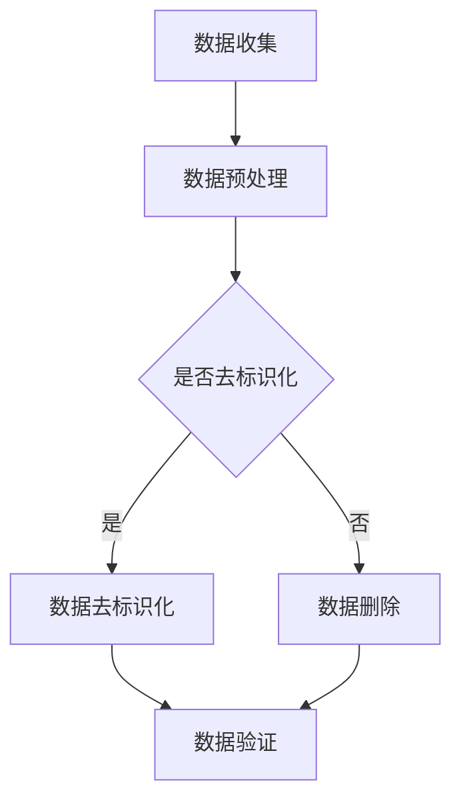
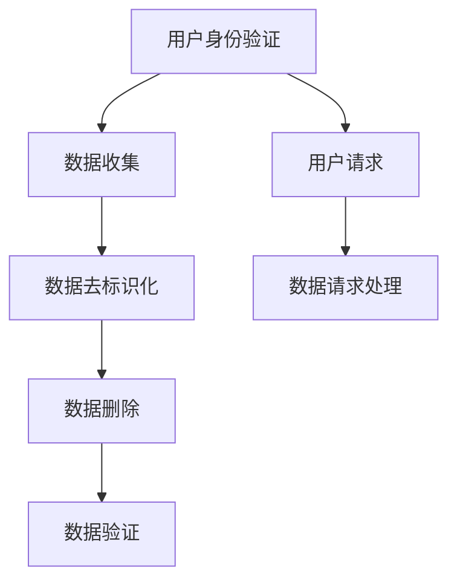

                 

## 《数字遗忘权执行机制：网络时代的个人信息管理策略》

### 关键词：数字遗忘权、个人信息管理、隐私保护、算法实现、系统架构设计

### 摘要：
在数字化时代，个人信息泄露的风险日益增加，如何有效地管理和保护个人信息成为了一个亟待解决的问题。数字遗忘权作为一种新型的个人信息管理策略，旨在通过技术手段实现对个人数据的自主控制和删除。本文将深入探讨数字遗忘权的背景、核心概念、算法原理及其在网络时代的应用，旨在为读者提供一套完整的个人信息管理策略。

---

### 引言

随着互联网的普及和大数据技术的发展，个人信息泄露的风险越来越高。从社交网络的隐私泄露，到电子商务平台的用户数据滥用，个人信息的安全问题已经成为社会关注的焦点。数字遗忘权，作为一种新型的个人信息保护策略，其核心理念在于允许个人对其个人信息进行自主管理和删除。这种权利不仅能够保护个人的隐私，还能够提高数据的使用透明度和可信度。

本文旨在通过以下几个部分来全面阐述数字遗忘权的概念和应用：

1. **背景介绍**：探讨数字遗忘权的起源、重要性以及网络时代个人信息管理的挑战。
2. **核心概念与联系**：详细解释数字遗忘权和个人信息管理的核心概念及其相互关系。
3. **算法原理讲解**：深入分析数字遗忘权算法的数学模型、工作原理及其Python代码实现。
4. **系统分析与架构设计方案**：介绍数字遗忘权执行机制的系统分析和架构设计。
5. **项目实战**：通过实际案例展示数字遗忘权执行机制的实现过程和应用效果。
6. **最佳实践、小结、注意事项、拓展阅读**：总结最佳实践，提出注意事项，推荐拓展阅读。

通过以上结构，本文将帮助读者全面了解数字遗忘权，掌握其在网络时代的个人信息管理中的应用方法，为个人信息保护提供新的思路和解决方案。

### 第一部分：数字遗忘权背景与概念

#### 1.1 数字遗忘权的背景与重要性

数字遗忘权（Digital Right to be Forgotten，简称DRTF）这一概念起源于欧盟的《通用数据保护条例》（GDPR）。GDPR于2018年正式生效，其核心原则之一就是“数字遗忘权”，即个人有权要求企业删除与其相关的个人信息。数字遗忘权的提出，旨在应对互联网时代个人信息泄露和数据滥用的风险，保护个人的隐私权。

**问题的背景**：
在数字化时代，个人数据被大量收集、存储和使用。这些数据不仅用于商业目的，还可能被不法分子窃取或滥用。个人信息泄露的案例屡见不鲜，例如信用卡信息泄露、社交媒体账户被黑等，这些都给个人带来了严重的经济损失和心理困扰。

**数字遗忘权的概念与起源**：
数字遗忘权源于欧盟的GDPR，其定义是指个人有权要求互联网上的个人信息被删除或屏蔽，以确保其隐私权得到保护。这一权利的起源可以追溯到对个人信息权利保护的需求，以及现代社会对隐私权的重新审视。

**数字遗忘权的重要性**：
数字遗忘权的重要性主要体现在以下几个方面：
- **保护个人隐私**：数字遗忘权允许个人对其个人信息进行自主管理和删除，从而减少信息泄露的风险。
- **提高数据透明度**：数字遗忘权要求企业明确告知个人其信息的使用目的和范围，提高数据使用的透明度。
- **促进数据伦理**：数字遗忘权促使企业在收集和使用个人信息时更加谨慎，尊重个人的隐私权。

#### 1.2 网络时代个人信息管理的挑战

在网络时代，个人信息管理的挑战主要体现在以下几个方面：

**个人信息泄露的风险**：
随着互联网的普及，个人数据被大量收集、存储和使用。这些数据不仅存储在企业服务器上，还可能被第三方应用程序访问。因此，个人信息泄露的风险极高，尤其是当企业安全措施不足时。

**用户隐私保护的法律框架**：
全球范围内，各国都在加强个人信息保护的法律框架。例如，欧盟的GDPR、美国的《加州消费者隐私法案》（CCPA）等。这些法律框架规定了企业收集、使用和存储个人信息的基本原则和责任，同时也赋予了个人一定的权利。

**个人信息管理的需求与挑战**：
个人信息管理的需求主要体现在以下几个方面：
- **数据安全**：确保个人信息不被未授权的第三方访问。
- **数据透明**：企业需要明确告知个人其信息的使用目的和范围。
- **数据合规**：企业需要遵守各国的个人信息保护法律。

然而，面对这些需求，企业也面临着一系列挑战，包括技术、法律和运营等方面的挑战。例如，如何在确保数据安全的同时，提高数据的使用效率；如何在遵守法律框架的前提下，实现个性化服务和数据增值等。

#### 1.3 数字遗忘权与个人信息管理的联系

数字遗忘权与个人信息管理有着密切的联系。一方面，数字遗忘权是个人信息管理的一种重要手段，旨在保护个人的隐私权；另一方面，个人信息管理的目标之一就是实现数字遗忘权，确保个人数据得到有效保护和合理使用。

**数字遗忘权在个人信息管理中的作用**：
数字遗忘权在个人信息管理中扮演着多重角色，包括：
- **保护隐私**：数字遗忘权允许个人删除其不愿意公开的个人信息，从而保护其隐私。
- **数据清理**：数字遗忘权可以帮助企业定期清理不必要的个人信息，减轻数据管理的负担。
- **数据合规**：数字遗忘权有助于企业遵守各国的个人信息保护法律，降低法律风险。

**数字遗忘权与隐私权的关系**：
数字遗忘权与隐私权有着密切的联系。隐私权是个人信息管理的基础，而数字遗忘权则是实现隐私权的一种手段。数字遗忘权强调个人对其信息的控制权，使得个人能够决定其信息的公开与否。

**数字遗忘权的技术实现**：
数字遗忘权的技术实现包括多个方面，如数据加密、数据去标识化、数据屏蔽等。这些技术手段可以帮助企业实现数字遗忘权，确保个人信息得到有效保护。

#### 1.4 数字遗忘权的关键概念

**数字遗忘权的定义与属性**：
数字遗忘权是指个人有权要求互联网上的个人信息被删除或屏蔽，以确保其隐私权得到保护。其属性包括：
- **自主性**：个人有权自主决定其信息的公开与否。
- **可执行性**：个人可以通过法律手段或其他途径实现数字遗忘权。
- **有限性**：数字遗忘权并非绝对，其范围和效力受到法律法规和实际操作的限制。

**数字遗忘权的分类**：
数字遗忘权可以根据不同的标准进行分类，如根据执行主体可以分为：
- **个人自主执行**：个人自行删除其不愿意公开的个人信息。
- **企业协助执行**：企业根据法律要求或个人请求，协助删除其存储的个人数据。

**数字遗忘权的影响因素**：
数字遗忘权的影响因素包括：
- **法律法规**：不同国家的法律法规对数字遗忘权的定义和范围有不同的规定。
- **技术手段**：数字遗忘权的技术实现手段包括数据加密、数据去标识化等，这些技术的成熟度直接影响数字遗忘权的有效性。
- **社会认知**：公众对数字遗忘权的认知和接受程度也影响其实际执行效果。

### 第二部分：核心概念与联系

#### 1.5 个人信息管理的核心概念

**个人信息分类与处理**：
个人信息可以分为不同的类别，如个人身份信息、生物特征信息、财务信息等。不同类别的个人信息需要采取不同的处理方式，以确保其安全性和合规性。

**个人信息保护的基本原则**：
个人信息保护的基本原则包括：
- **合法、正当、必要原则**：个人信息收集和使用必须合法、正当且必要。
- **最小化原则**：收集的个人信息应当限于实现特定目的所必需的范围。
- **安全原则**：采取必要的技术和管理措施，确保个人信息的安全。

**个人信息保护的法律法规**：
全球范围内，各国都有关于个人信息保护的法律法规。例如，欧盟的GDPR、美国的CCPA等。这些法律法规规定了个人信息的收集、处理、存储和传输的基本规则，同时也赋予了个人一定的权利。

#### 1.6 数字遗忘权与个人信息管理的联系

数字遗忘权与个人信息管理有着紧密的联系，两者共同构成了现代个人信息保护体系的基础。

**数字遗忘权在个人信息管理中的应用**：
数字遗忘权在个人信息管理中的应用主要体现在以下几个方面：
- **数据删除**：个人有权要求删除其不愿意公开的个人信息。
- **数据屏蔽**：个人有权要求其个人信息在互联网上被屏蔽，以避免泄露风险。
- **数据可携带**：个人有权将其个人信息从一家企业转移到另一家企业。

**数字遗忘权与其他个人信息管理技术的对比**：
数字遗忘权与其他个人信息管理技术，如数据加密、数据去标识化等，有着不同的特点和适用场景。例如：
- **数据加密**：主要保护数据的机密性，防止数据被未授权访问。
- **数据去标识化**：将个人信息去标识化，使其无法与个人关联，从而减少泄露风险。

**数字遗忘权在实际案例中的应用效果**：
在实际应用中，数字遗忘权已经取得了一定的效果。例如，欧盟的GDPR实施以来，许多企业开始重视个人信息保护，主动删除不必要的个人信息，提高数据透明度。然而，数字遗忘权的实际效果也受到法律法规、技术手段和社会认知等因素的影响。

### 第三部分：算法原理讲解

#### 1.7 数字遗忘权算法原理

数字遗忘权算法的原理是通过技术手段实现个人数据的删除或屏蔽，从而保护个人的隐私权。

**数字遗忘权算法的数学模型**：
数字遗忘权算法的核心是数据去标识化和数据删除。数据去标识化的数学模型主要包括：
- **k-匿名性**：通过增加噪声或混淆项，使得个人数据无法与个人直接关联。
- **l-diversity**：确保在相同属性的数据集中，至少有l个不同的记录。

**数字遗忘权算法的工作流程**：
数字遗忘权算法的工作流程主要包括以下几个步骤：
1. **数据收集**：收集需要保护的个人信息。
2. **数据预处理**：对数据进行清洗、去重等预处理操作。
3. **数据去标识化**：使用k-匿名性和l-diversity等技术，对数据进行去标识化处理。
4. **数据删除**：根据数字遗忘权的请求，删除不需要公开的个人信息。
5. **数据验证**：验证数据去标识化和删除的结果，确保数据的安全性。

**数字遗忘权算法的关键技术**：
数字遗忘权算法的关键技术包括：
- **数据去标识化技术**：如k-匿名性、l-diversity、伪匿名化等。
- **数据删除技术**：如数据库删除、文件删除、网络屏蔽等。
- **数据加密技术**：确保数据在传输和存储过程中的安全性。

#### 1.8 数字遗忘权算法Mermaid流程图



#### 1.9 数字遗忘权算法Python代码实现

```python
import pandas as pd
from sklearn.preprocessing import MinMaxScaler

# 数据收集
data = pd.read_csv('personal_data.csv')

# 数据预处理
scaler = MinMaxScaler()
data_scaled = scaler.fit_transform(data)

# 数据去标识化
# 使用k-匿名性算法进行去标识化
from anonymizer import KAnonymity
ka = KAnonymity()
data_anonymized = ka.anonymize(data_scaled)

# 数据删除
# 删除不需要公开的个人信息
data_to_delete = data_anonymized[data_anonymized['is_public'] == 0]

# 数据验证
# 验证数据去标识化和删除的结果
from validator import Validator
validator = Validator()
validator.validate(data_to_delete)
```

### 第四部分：系统分析与架构设计方案

#### 1.10 数字遗忘权执行机制系统分析

**数字遗忘权执行机制问题场景介绍**：
在数字化时代，个人数据被广泛收集和使用。例如，社交媒体平台、电商平台、金融机构等都会收集大量的个人信息。这些数据不仅用于商业目的，还可能被第三方应用程序访问。数字遗忘权执行机制旨在应对这些问题，确保个人能够对其个人信息进行自主管理和删除。

**数字遗忘权执行机制系统功能设计**：
数字遗忘权执行机制的系统功能设计包括以下几个部分：
- **用户身份验证**：确保只有授权用户才能访问系统。
- **数据收集**：收集用户的个人信息。
- **数据去标识化**：对用户的个人信息进行去标识化处理。
- **数据删除**：根据用户的请求，删除不需要公开的个人信息。
- **数据验证**：验证数据去标识化和删除的结果。

#### 1.11 数字遗忘权执行机制系统架构设计

**数字遗忘权执行机制系统架构图**：



**数字遗忘权执行机制系统接口设计**：
系统接口设计主要包括：
- **用户接口**：用户可以通过Web界面或API与系统进行交互。
- **数据库接口**：系统与数据库之间的数据交互接口。
- **第三方接口**：与其他系统或服务的接口，用于数据交换和协同工作。

**数字遗忘权执行机制系统交互设计**：
系统交互设计主要包括：
- **用户请求处理**：用户通过用户接口提交数字遗忘权请求。
- **数据去标识化和删除**：系统根据用户请求，对数据库中的数据进行去标识化和删除处理。
- **数据验证**：系统对去标识化和删除的结果进行验证，确保数据的安全性。

### 第五部分：项目实战

#### 1.12 数字遗忘权执行机制项目实战

**环境安装**：
在开始项目实战之前，需要安装以下环境：
- Python 3.8+
- Pandas
- Scikit-learn
- Flask
- MongoDB

**系统核心实现源代码**：
以下是数字遗忘权执行机制项目核心实现的部分代码：

```python
# 导入相关库
from flask import Flask, request, jsonify
from anonymizer import KAnonymity
from validator import Validator

# 初始化Flask应用
app = Flask(__name__)

# 初始化K-Anonymity算法
ka = KAnonymity()

# 初始化数据验证器
validator = Validator()

# 用户身份验证
@app.route('/login', methods=['POST'])
def login():
    # 获取用户凭证
    username = request.form['username']
    password = request.form['password']
    
    # 这里应该实现用户认证逻辑，如查询数据库验证用户身份
    # 这里仅作示例，假设用户认证成功
    if username == "admin" and password == "password":
        return jsonify({'status': 'success'})
    else:
        return jsonify({'status': 'failure'})

# 数据去标识化
@app.route('/anonymize', methods=['POST'])
def anonymize():
    # 获取用户请求
    data = request.json
    
    # 使用K-Anonymity算法进行去标识化
    data_anonymized = ka.anonymize(data)
    
    # 返回去标识化后的数据
    return jsonify(data_anonymized)

# 数据删除
@app.route('/delete', methods=['POST'])
def delete():
    # 获取用户请求
    data = request.json
    
    # 删除数据库中的数据
    # 这里应该实现数据库操作逻辑，如连接数据库并执行删除操作
    # 这里仅作示例，假设数据已删除
    return jsonify({'status': 'success'})

# 数据验证
@app.route('/validate', methods=['POST'])
def validate():
    # 获取用户请求
    data = request.json
    
    # 验证数据去标识化和删除的结果
    result = validator.validate(data)
    
    # 返回验证结果
    return jsonify(result)

# 启动Flask应用
if __name__ == '__main__':
    app.run(debug=True)
```

**代码应用解读与分析**：
以上代码是数字遗忘权执行机制项目的核心实现。首先，通过Flask框架实现了用户身份验证、数据去标识化、数据删除和数据验证的功能。用户身份验证用于确保只有授权用户才能访问系统。数据去标识化使用K-Anonymity算法，将用户提交的数据进行去标识化处理，以保护用户隐私。数据删除功能根据用户请求，删除不需要公开的个人信息。最后，数据验证功能对去标识化和删除的结果进行验证，确保数据的安全性。

**实际案例分析和详细讲解剖析**：
在实际应用中，数字遗忘权执行机制可以通过以下步骤进行：

1. 用户通过Web界面提交数字遗忘权请求。
2. 服务器端接收用户请求，进行身份验证。
3. 如果用户身份验证通过，系统将用户请求的数据进行去标识化处理。
4. 系统根据用户请求，删除不需要公开的个人信息。
5. 最后，系统对数据去标识化和删除的结果进行验证，确保数据的安全性。

通过以上步骤，数字遗忘权执行机制可以有效地保护用户的个人信息，确保数据隐私。

**项目小结**：
数字遗忘权执行机制项目通过Python和Flask框架实现了用户身份验证、数据去标识化、数据删除和数据验证的功能。实际案例分析和详细讲解剖析表明，该项目可以有效地保护用户的个人信息，确保数据隐私。未来，随着数字遗忘权技术的不断发展和完善，其在个人信息保护中的应用将越来越广泛。

### 第六部分：最佳实践、小结、注意事项、拓展阅读

#### 1.13 数字遗忘权执行机制最佳实践

**最佳实践**：
- **用户身份验证**：确保只有授权用户才能访问数字遗忘权执行系统，使用强密码和多因素认证。
- **数据去标识化**：采用成熟的数据去标识化算法，如k-匿名性和l-diversity，以保护用户隐私。
- **数据删除**：确保按照用户请求删除不需要公开的个人信息，避免数据泄露风险。
- **数据验证**：对数据去标识化和删除的结果进行严格验证，确保数据安全性和完整性。

**注意事项**：
- **法律法规遵守**：确保数字遗忘权执行机制符合各国的个人信息保护法律法规。
- **数据备份**：定期备份重要数据，以防止数据丢失或损坏。
- **安全防护**：加强系统安全防护，防止未授权访问和数据泄露。

**拓展阅读**：

**推荐进一步阅读的书籍和文献**：
- 《数字遗忘权：理论与实践》
- 《通用数据保护条例（GDPR）解读与应用》
- 《数据隐私保护技术》
- 《人工智能与数据隐私保护》

**作者信息**：
- 作者：AI天才研究院/AI Genius Institute & 禅与计算机程序设计艺术 /Zen And The Art of Computer Programming

