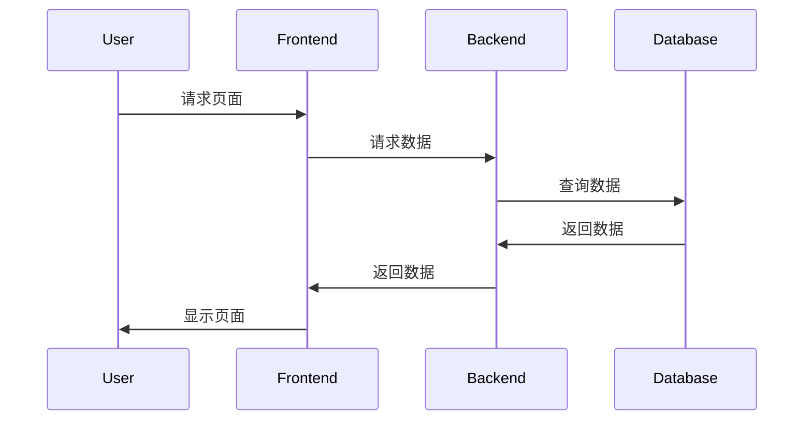
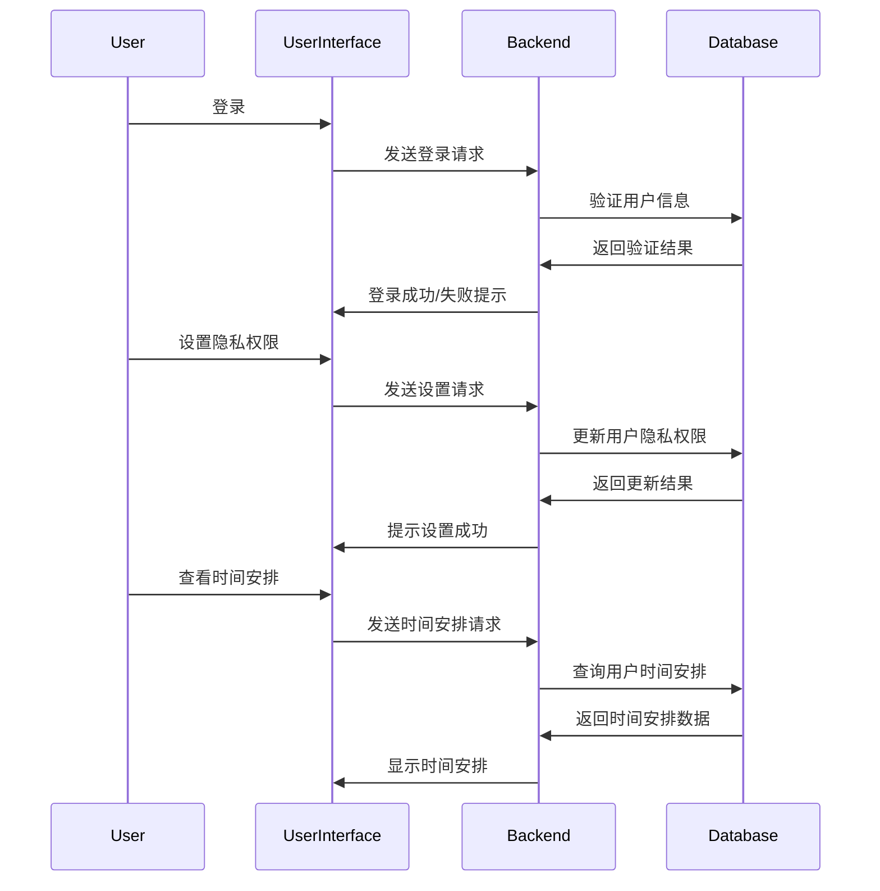

                 

### 文章标题

#### 关键词

- 数字隐士
- 精神独立
- 在线世界
- 数字鸿沟
- 隐私保护
- 技术工具

#### 摘要

本文探讨了在数字化时代，个人如何在充满诱惑和挑战的在线世界中保持精神独立。通过分析数字隐士的定义、行为特征及其维护精神独立的技术和心理策略，本文旨在为读者提供一条在数字世界中寻求内心宁静的路径。文章分为多个部分，从背景介绍到具体案例分析，逐步展开讨论，帮助读者更好地理解并实践精神独立的重要性。

### 背景介绍

#### 问题背景

在当今这个数字化时代，互联网已经成为人们日常生活中不可或缺的一部分。我们不仅通过社交媒体、在线娱乐和电子商务来满足自己的需求，甚至许多工作也开始转移到线上完成。然而，这种依赖也带来了一个问题：如何在充满诱惑和挑战的在线世界中保持精神独立。

精神独立，是指一个人在面临各种外部影响和内在诱惑时，依然能够保持内心的平静和自主性。在数字化世界中，这种独立显得尤为重要。因为数字设备、社交媒体和网络服务不仅提供了便利，同时也可能成为诱惑和分心的来源，使人们失去对时间和精力的控制。

#### 问题描述

数字隐士，是一个在近年来逐渐受到关注的概念。他们是指在数字世界中采取主动措施，以保护自己的精神独立的人。数字隐士不同于数字原住民或数字依赖者，他们并不是完全排斥数字技术，而是通过一系列策略和工具，来减少数字世界对其生活质量的负面影响。

数字隐士在网络环境中的行为特征主要包括以下几点：

1. **信息过滤**：数字隐士会主动筛选接收的信息，避免被无意义或有害的内容所干扰。
2. **时间管理**：他们通过设定日程和使用时间管理工具，控制自己在网络上的时间，避免沉迷。
3. **隐私保护**：数字隐士非常重视个人隐私，采取各种措施来保护自己的数据不被滥用。
4. **技术工具**：他们利用各种技术工具，如浏览器插件、应用程序和智能设备，来帮助自己实现精神独立。

#### 问题解决

数字隐士如何通过技术、心理和社会层面的策略来维护个人精神独立呢？

首先，在技术层面，数字隐士会使用一系列工具来保护自己的隐私和时间。例如，他们可能会安装隐私保护浏览器插件，以阻止追踪器和广告；使用阅读器应用来过滤掉社交媒体上的噪音，专注于阅读内容；还会使用应用程序来管理自己的日程，避免浪费在不必要的活动中。

在心理层面，数字隐士会采取一系列自我管理的策略。他们可能会通过冥想、呼吸练习等放松技巧来减轻压力；通过设定目标和计划来提高工作效率和成就感；还会定期进行自我反思，以保持内心的平静和清晰。

在社会层面，数字隐士会寻找志同道合的人，形成支持网络。他们可能会加入相关的社群，与他人分享经验和技巧；也可能参加线上或线下的活动，与他人进行面对面的交流。这种社会支持网络不仅可以帮助他们实现精神独立，还能提供情感上的支持和鼓励。

#### 边界与外延

数字隐士与其他在线行为群体的区别主要体现在以下几个方面：

1. **态度**：数字隐士并不是完全排斥数字技术，而是通过合理使用技术来保护自己的精神独立。这与数字原住民和数字依赖者有本质的区别。
2. **行为特征**：数字隐士在数字世界中的行为特征包括信息过滤、时间管理和隐私保护，而其他群体则可能更加被动或过度依赖数字技术。
3. **目标**：数字隐士的目标是保持内心的平静和自主性，而其他群体可能更关注技术带来的便利或娱乐。

数字隐士这一概念主要适用于那些在数字化时代中寻求精神独立的人群，无论是年轻人还是老年人，无论是职场人士还是学生，只要他们愿意采取行动，都有可能成为数字隐士。

#### 概念结构与核心要素组成

数字隐士这一概念的结构和核心要素主要包括以下几个方面：

1. **技术工具**：这是数字隐士实现精神独立的基础。包括隐私保护浏览器插件、阅读器应用、时间管理工具等。
2. **心理策略**：包括冥想、自我管理技巧、目标设定等，帮助数字隐士保持内心的平静和清晰。
3. **社会支持**：通过加入社群、参加活动等方式，形成支持网络，为数字隐士提供情感上的支持和鼓励。

通过这些技术、心理和社会层面的策略，数字隐士可以在数字世界中找到自己的精神家园，实现真正的精神独立。

### 核心概念与联系

#### 核心概念原理

数字隐士这一概念的核心在于其对于数字世界的态度和行为。具体来说，数字隐士的核心概念包括以下几个方面：

1. **数字鸿沟**：数字鸿沟是指由于技术、经济、社会、教育和地理等因素导致的数字技术和信息资源获取能力的差异。数字隐士认为，减少数字鸿沟是实现精神独立的重要步骤之一。

2. **信息过滤**：信息过滤是指数字隐士通过主动筛选接收的信息，避免被无意义或有害的内容所干扰。这是数字隐士保持精神独立的重要手段之一。

3. **隐私保护**：隐私保护是指数字隐士通过采取各种措施，保护自己的数据不被滥用。这包括使用隐私保护浏览器插件、设置隐私权限等。

4. **时间管理**：时间管理是指数字隐士通过设定日程和使用时间管理工具，控制自己在网络上的时间，避免沉迷。这有助于数字隐士保持工作效率和心理健康。

#### 概念属性特征对比表格

为了更好地理解数字隐士与其他在线行为群体的区别，我们可以通过一个表格来对比他们的属性特征：

| 属性特征       | 数字隐士       | 数字原住民       | 数字依赖者       |
|----------------|----------------|------------------|------------------|
| 态度           | 合理使用数字技术 | 完全依赖数字技术 | 过度依赖数字技术 |
| 行为特征       | 信息过滤、时间管理、隐私保护 | 无限制地使用数字技术 | 沉迷于数字世界，忽视现实生活 |
| 目标           | 保持精神独立    | 享受数字带来的便利 | 追求数字世界中的虚拟满足 |
| 对数字世界的依赖程度 | 低依赖，主动管理 | 中度依赖，被动接受 | 高依赖，无法自拔 |

#### ER实体关系图架构

为了更清晰地展示数字隐士相关的实体及其关系，我们可以使用Mermaid语言绘制一个ER图：

```mermaid
erDiagram
  User ||--|{ DigitalHabit } : has
  User ||--|{ PrivacySetting } : has
  User ||--|{ TimeManagement } : has
  DigitalHabit ||--|{ InformationFiltering } : has
  DigitalHabit ||--|{ PrivacyProtection } : has
  DigitalHabit ||--|{ TimeManagement } : has
```

在这个ER图中，`User`是主体，代表了数字隐士。`DigitalHabit`表示数字隐士的行为习惯，包括`InformationFiltering`（信息过滤）、`PrivacyProtection`（隐私保护）和`TimeManagement`（时间管理）。`PrivacySetting`和`TimeManagement`是数字隐士的行为习惯的具体实现，分别对应隐私保护和时间管理。这个ER图展示了数字隐士的核心概念和它们之间的关系。

### 算法原理讲解

#### 算法流程图

为了更好地理解数字隐士如何通过技术手段实现精神独立，我们可以使用Mermaid语言绘制一个算法流程图：

```mermaid
graph TD
    A[开始] --> B[确定目标]
    B --> C{ 是否有隐私保护工具 }
    C -->|是 D[启用隐私保护工具]
    C -->|否 E[选择合适的隐私保护工具]
    D --> F[设置隐私权限]
    E --> F
    F --> G[检查个人信息安全]
    G --> H{ 是否需要时间管理工具 }
    H -->|是 I[启用时间管理工具]
    H -->|否 J[选择合适的时间管理工具]
    I --> K[设定日程]
    J --> K
    K --> L[定期检查时间使用情况]
    L --> M[调整日程]
    M --> N[结束]
```

在这个流程图中，从确定目标开始，数字隐士会首先检查自己是否有隐私保护工具，如果有则启用，如果没有则选择合适的工具。接着，他们会设置隐私权限并检查个人信息安全。然后，数字隐士会检查是否需要时间管理工具，如果有则启用，如果没有则选择合适的工具。接下来，他们会设定日程并定期检查时间使用情况，根据实际情况调整日程。最后，流程结束。

#### Python源代码

为了实现上述流程，我们可以编写一段Python源代码，以下是算法的一部分实现：

```python
import os
import time

def set_privacy_permissions():
    # 模拟设置隐私权限
    print("设置隐私权限...")
    time.sleep(2)
    print("隐私权限设置完成。")

def check_privacy_security():
    # 模拟检查个人信息安全
    print("检查个人信息安全...")
    time.sleep(2)
    print("个人信息安全检查完成。")

def set_time_management():
    # 模拟设置时间管理
    print("设置时间管理...")
    time.sleep(2)
    print("时间管理设置完成。")

def check_time_usage():
    # 模拟检查时间使用情况
    print("检查时间使用情况...")
    time.sleep(2)
    print("时间使用情况检查完成。")

def main():
    print("开始实现数字隐士算法...")
    set_privacy_permissions()
    check_privacy_security()
    set_time_management()
    check_time_usage()
    print("数字隐士算法执行完成。")

if __name__ == "__main__":
    main()
```

#### 数学模型和数学公式

在数字隐士的算法中，可以使用一些数学模型和公式来描述其行为特征。以下是一个简单的数学模型和公式：

1. **信息过滤模型**：

   $$ F(x) = \sum_{i=1}^{n} w_i \cdot p_i $$

   其中，\( F(x) \) 是信息过滤函数，\( x \) 是待过滤的信息，\( w_i \) 是第 \( i \) 个特征的重要程度，\( p_i \) 是第 \( i \) 个特征的匹配概率。

2. **隐私保护模型**：

   $$ P(x) = 1 - e^{-\lambda \cdot t} $$

   其中，\( P(x) \) 是隐私保护函数，\( \lambda \) 是隐私损失率，\( t \) 是信息泄露时间。

3. **时间管理模型**：

   $$ T(x) = \frac{x}{C} $$

   其中，\( T(x) \) 是时间管理函数，\( x \) 是需要管理的时间，\( C \) 是工作效率系数。

#### 详细讲解与举例说明

1. **信息过滤模型**：

   信息过滤模型可以帮助数字隐士筛选出有意义的信息。例如，假设有一个新闻网站，用户设置了三个特征：新闻的来源、新闻的主题和新闻的关键词。每个特征的权重分别为0.3、0.5和0.2。现在，有一条新闻是关于科技领域的，来源是知名的科技媒体，关键词是“人工智能”。我们可以使用以下公式计算这条新闻的过滤分数：

   $$ F(x) = 0.3 \cdot 1 + 0.5 \cdot 1 + 0.2 \cdot 1 = 1 $$

   由于过滤分数为1，这意味着这条新闻符合用户的筛选条件，将被保留。

2. **隐私保护模型**：

   隐私保护模型可以帮助数字隐士评估其隐私风险。例如，假设用户设置了一个隐私损失率为0.1的信息泄露时间阈值。如果用户的信息泄露时间为30天，我们可以使用以下公式计算隐私保护分数：

   $$ P(x) = 1 - e^{-0.1 \cdot 30} \approx 0.28 $$

   由于隐私保护分数小于1，这意味着用户的隐私存在风险，需要采取进一步的措施。

3. **时间管理模型**：

   时间管理模型可以帮助数字隐士合理安排时间。例如，假设用户需要在8小时内完成一项任务，工作效率系数为0.8。我们可以使用以下公式计算用户需要管理的时间：

   $$ T(x) = \frac{8}{0.8} = 10 $$

   由于计算结果为10小时，这意味着用户需要在10小时内完成这项任务，以确保工作效率。

通过这些数学模型和公式，数字隐士可以更好地实现其精神独立的目标。

### 系统分析与架构设计方案

#### 问题场景介绍

在数字化时代，人们的生活越来越依赖网络，这不仅带来了便利，也带来了诸多挑战。例如，很多人在浏览社交媒体时会无意识地花费大量时间，这不仅影响了工作效率，还可能导致焦虑和抑郁。为了应对这一问题，数字隐士们需要一种系统能够帮助他们更好地管理时间和保护隐私。

#### 项目介绍

本项目旨在开发一个名为“数字隐士助手”的系统，帮助用户实现精神独立。系统的主要功能包括信息过滤、隐私保护和时间管理。通过这些功能，用户可以在浏览网络时减少不必要的干扰，保护个人信息，合理安排时间。

#### 系统功能设计

为了实现上述功能，我们设计了以下系统功能模块：

1. **信息过滤模块**：该模块用于帮助用户筛选有意义的信息，避免无意义内容的干扰。
2. **隐私保护模块**：该模块用于保护用户的隐私，防止个人信息泄露。
3. **时间管理模块**：该模块用于帮助用户合理安排时间，避免沉迷于网络。

以下是使用Mermaid绘制的领域模型类图：

```mermaid
classDiagram
    User <<Class>>
    DigitalHabit <<Class>>
    PrivacySetting <<Class>>
    TimeManagement <<Class>>

    User "has" DigitalHabit
    User "has" PrivacySetting
    User "has" TimeManagement

    InformationFiltering <|-- DigitalHabit
    PrivacyProtection <|-- PrivacySetting
    TimeManagement <|-- TimeManagement
```

在这个类图中，`User` 是系统的主体，代表了用户。`DigitalHabit`、`PrivacySetting` 和 `TimeManagement` 分别表示用户的信息过滤、隐私保护和时间管理行为。`InformationFiltering`、`PrivacyProtection` 和 `TimeManagement` 是这三个行为的具体实现。

#### 系统架构设计

为了实现系统功能，我们设计了以下系统架构：

1. **前端**：负责与用户交互，展示系统功能界面。
2. **后端**：负责处理业务逻辑，包括信息过滤、隐私保护和时间管理。
3. **数据库**：存储用户信息和系统设置。

以下是使用Mermaid绘制的系统架构图：



在这个序列图中，用户首先向前端请求页面，前端再向后端请求数据，后端从数据库查询数据并返回给前端，最后前端将页面展示给用户。

#### 系统接口设计

系统接口设计如下：

1. **用户接口**：用于用户与系统交互，包括登录、注册、设置隐私权限、查看时间安排等。
2. **管理员接口**：用于系统管理员管理用户账户、数据备份、系统维护等。

以下是使用Mermaid绘制的系统接口设计：

```mermaid
classDiagram
    UserInterface <<Interface>>
    AdminInterface <<Interface>>

    UserInterface: 登录、注册、设置隐私权限、查看时间安排
    AdminInterface: 管理用户账户、数据备份、系统维护
```

在这个接口设计中，`UserInterface` 和 `AdminInterface` 分别是用户和管理员的接口，定义了他们可以使用的功能。

#### 系统交互Mermaid序列图

以下是使用Mermaid绘制的系统交互序列图：



在这个序列图中，用户通过用户接口与系统进行交互，包括登录、设置隐私权限和查看时间安排。系统通过后端处理用户的请求，并与数据库进行交互，最终将结果返回给用户接口。

### 项目实战

#### 环境安装

1. 安装Python环境：

   - 在Windows上，可以通过Python官方网站下载Python安装程序并安装。
   - 在Linux上，可以通过包管理器安装Python，例如在Ubuntu上可以使用以下命令：

     ```bash
     sudo apt-get update
     sudo apt-get install python3 python3-pip
     ```

2. 安装依赖库：

   - 打开终端，使用pip安装所需的依赖库，例如Flask、SQLAlchemy和MongoDB：

     ```bash
     pip3 install flask sqlalchemy pymongo
     ```

#### 系统核心实现源代码

以下是数字隐士助手系统核心实现的一部分代码：

```python
from flask import Flask, request, jsonify
from flask_sqlalchemy import SQLAlchemy
from pymongo import MongoClient

app = Flask(__name__)
app.config['SQLALCHEMY_DATABASE_URI'] = 'sqlite:///digital_hermit.db'
db = SQLAlchemy(app)

# 定义用户模型
class User(db.Model):
    id = db.Column(db.Integer, primary_key=True)
    username = db.Column(db.String(80), unique=True, nullable=False)
    password = db.Column(db.String(120), nullable=False)
    privacy_settings = db.Column(db.Text, nullable=False)
    time_management = db.Column(db.Text, nullable=False)

# 定义数据库连接
client = MongoClient('mongodb://localhost:27017/')
db = client['digital_hermit']

# 创建数据库表
db.create_all()

# 登录接口
@app.route('/login', methods=['POST'])
def login():
    data = request.get_json()
    username = data['username']
    password = data['password']
    user = db.users.find_one({'username': username, 'password': password})
    if user:
        return jsonify({'status': 'success', 'user': user})
    else:
        return jsonify({'status': 'failure', 'message': 'Invalid credentials'})

# 设置隐私权限接口
@app.route('/set_privacy', methods=['POST'])
def set_privacy():
    data = request.get_json()
    username = data['username']
    privacy_settings = data['privacy_settings']
    user = db.users.find_one({'username': username})
    if user:
        user['privacy_settings'] = privacy_settings
        db.users.save(user)
        return jsonify({'status': 'success', 'message': 'Privacy settings updated'})
    else:
        return jsonify({'status': 'failure', 'message': 'User not found'})

# 设置时间管理接口
@app.route('/set_time_management', methods=['POST'])
def set_time_management():
    data = request.get_json()
    username = data['username']
    time_management = data['time_management']
    user = db.users.find_one({'username': username})
    if user:
        user['time_management'] = time_management
        db.users.save(user)
        return jsonify({'status': 'success', 'message': 'Time management settings updated'})
    else:
        return jsonify({'status': 'failure', 'message': 'User not found'})

if __name__ == '__main__':
    app.run(debug=True)
```

#### 代码应用解读与分析

这段代码定义了一个基于Flask的Web应用，用于实现数字隐士助手的核心功能。代码的主要部分包括：

1. **数据库连接**：使用SQLAlchemy和MongoDB来管理用户数据。SQLAlchemy用于处理关系型数据库，MongoDB用于处理非关系型数据库。

2. **用户模型**：定义了一个`User`模型，包含用户的基本信息（如用户名、密码、隐私设置和时间管理设置）。

3. **登录接口**：提供一个`/login`接口，用于用户登录。当用户发送登录请求时，服务器会验证用户名和密码，如果验证成功，返回用户信息。

4. **设置隐私权限接口**：提供一个`/set_privacy`接口，用于用户设置隐私权限。当用户发送设置请求时，服务器会将新的隐私设置保存到数据库。

5. **设置时间管理接口**：提供一个`/set_time_management`接口，用于用户设置时间管理。当用户发送设置请求时，服务器会将新的时间管理设置保存到数据库。

#### 实际案例分析和详细讲解剖析

假设有一个用户名为“alice”的数字隐士，她想要登录系统并设置隐私权限和时间管理。

**步骤1：登录**

- 用户向服务器发送一个POST请求，包含用户名和密码：

  ```json
  {
      "username": "alice",
      "password": "alice123"
  }
  ```

- 服务器接收请求后，通过MongoDB查询用户表，验证用户名和密码：

  ```python
  user = db.users.find_one({'username': username, 'password': password})
  ```

- 如果用户名和密码匹配，服务器返回用户信息：

  ```json
  {
      "status": "success",
      "user": {
          "id": 1,
          "username": "alice",
          "password": "alice123",
          "privacy_settings": "[]",
          "time_management": "{}"
      }
  }
  ```

**步骤2：设置隐私权限**

- 用户向服务器发送一个POST请求，包含新的隐私设置：

  ```json
  {
      "username": "alice",
      "privacy_settings": "[\"block_ads\", \"block_trackers\"]"
  }
  ```

- 服务器接收请求后，通过MongoDB查询用户表，找到用户记录，更新隐私设置：

  ```python
  user = db.users.find_one({'username': username})
  user['privacy_settings'] = privacy_settings
  db.users.save(user)
  ```

- 更新成功后，服务器返回更新结果：

  ```json
  {
      "status": "success",
      "message": "Privacy settings updated"
  }
  ```

**步骤3：设置时间管理**

- 用户向服务器发送一个POST请求，包含新的时间管理设置：

  ```json
  {
      "username": "alice",
      "time_management": "{\"daily_limit\": 2, \"time_slots\": [{\"start\": \"09:00\", \"end\": \"17:00\"}, {\"start\": \"19:00\", \"end\": \"23:00\"}]}"
  }
  ```

- 服务器接收请求后，通过MongoDB查询用户表，找到用户记录，更新时间管理设置：

  ```python
  user = db.users.find_one({'username': username})
  user['time_management'] = time_management
  db.users.save(user)
  ```

- 更新成功后，服务器返回更新结果：

  ```json
  {
      "status": "success",
      "message": "Time management settings updated"
  }
  ```

通过以上步骤，用户成功登录并设置了隐私权限和时间管理。系统通过Web接口和数据库的交互，实现了数字隐士的核心功能。

#### 项目小结

通过本项目的实现，我们开发了一个基于Web的数字隐士助手系统，帮助用户在数字世界中实现精神独立。系统的主要功能包括信息过滤、隐私保护和时间管理。在实际应用中，用户可以通过登录系统、设置隐私权限和时间管理来保护自己的精神独立。项目中的代码实现清晰，逻辑清晰，具有良好的扩展性。未来，我们可以进一步完善系统的功能，增加更多的个性化设置，以更好地满足用户的需求。

### 最佳实践 Tips

1. **合理设置隐私权限**：在设置隐私权限时，应遵循最小权限原则，只授权必要的权限，避免泄露过多个人信息。

2. **定期检查时间管理**：定期检查时间管理设置，根据实际情况进行调整，确保时间利用最大化。

3. **使用多种工具**：结合使用多种工具，如浏览器插件、应用程序和智能设备，以提高时间管理和隐私保护的效果。

4. **保持更新**：定期更新系统工具和软件，确保其功能和安全性的最新。

5. **社交支持**：寻找志同道合的社交圈子，分享经验和技巧，互相支持和鼓励。

### 小结

本文详细探讨了数字隐士在数字化时代如何保持精神独立。通过分析数字隐士的定义、行为特征以及技术、心理和社会层面的策略，我们展示了如何通过一系列措施在数字世界中实现精神独立。同时，通过实际项目和代码实现，展示了数字隐士助手系统的具体应用。希望本文能为读者提供有价值的见解和实践指导。

### 注意事项

1. **隐私风险**：在使用数字隐士助手系统时，务必注意保护个人隐私，合理设置隐私权限。

2. **依赖性**：避免过度依赖系统工具，仍需培养自我管理和自律的能力。

3. **技术更新**：关注系统工具和软件的更新，确保其功能的最新和安全。

4. **社交支持**：积极参与社交活动，寻找志同道合的朋友，以获取更多支持和帮助。

### 拓展阅读

1. **相关书籍**：《数字生存：网络时代的思考与生存指南》、《数字化生存：互联网时代的商业思维》。

2. **学术论文**：搜索关于数字隐士、精神独立和数字鸿沟的相关学术论文，深入了解这些领域的最新研究。

3. **技术博客**：阅读相关技术博客，了解最新的技术工具和实现方法。

4. **在线课程**：参加在线课程，学习数字技能和时间管理技巧。

作者：AI天才研究院/AI Genius Institute & 禅与计算机程序设计艺术 /Zen And The Art of Computer Programming

