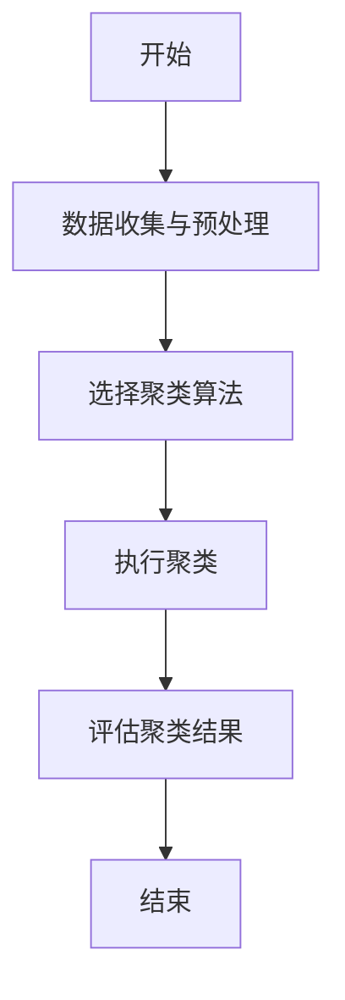
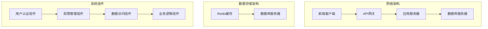
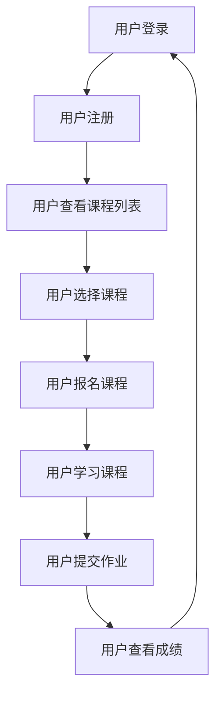

                 

### 数字鸿沟的社会影响：信息获取不平等的挑战

#### 关键词：
- 数字鸿沟
- 信息获取不平等
- 社会影响
- 数据挖掘
- 教育信息化

#### 摘要：
数字鸿沟是现代社会的一个显著特征，它揭示了信息获取上的不平等。本文将从多个角度深入探讨数字鸿沟的形成及其对社会各层面产生的深远影响。我们将分析数字鸿沟的成因、核心概念及其相互关系，并通过算法和实际案例展示如何缩小这一差距。本文旨在为政策制定者、技术专家以及关注社会公正的读者提供有价值的见解和实用的解决方案。

### 引言

在当今快速发展的信息时代，数字技术的普及和互联网的广泛应用为人们的生活和工作带来了前所未有的便利。然而，这种技术进步并非在所有人之间均匀分布，而是呈现出明显的数字鸿沟。所谓数字鸿沟，指的是不同社会群体在获取、使用和管理信息资源方面存在的显著差异。这种差异不仅体现在经济收入和地理位置上，还涉及教育水平、技术素养和社会地位等方面。

数字鸿沟的形成原因复杂多样，包括经济发展水平的差异、教育资源的分配不均、信息技术普及率的差异等。这种不平等的信息获取状况对社会的各个方面产生了深远的影响，包括教育、就业、医疗和社会福祉等。本文将首先介绍数字鸿沟的基本概念和其对社会的影响，然后深入探讨数字鸿沟的核心概念及其相互关系，接着通过数据挖掘算法和实际案例展示解决数字鸿沟的方法，最后提出缩小数字鸿沟的最佳实践和展望。

#### 数字鸿沟的概念与影响

数字鸿沟是指不同社会群体在获取、使用和管理信息资源方面存在的显著差异。这个概念涵盖了广泛的领域，包括经济、社会、文化和教育等多个方面。数字鸿沟的形成原因复杂多样，主要包括以下几个关键因素：

1. **经济发展水平**：经济发达的地区和贫困地区在信息技术基础设施、互联网接入率和设备拥有率方面存在显著差异。经济落后地区往往难以承担高昂的通信费用，从而限制了信息获取的渠道。

2. **教育资源分配**：教育资源的分配不均会导致不同社会群体在信息技术知识和技能上的差异。城市地区的学生通常有更好的教育资源，而农村和偏远地区的学生则往往缺乏这种优势。

3. **信息技术普及率**：互联网的普及率在不同地区之间存在显著差异。发达地区互联网接入率高，而落后地区则可能完全无法接入或接入质量较差。

4. **技术素养差异**：技术素养是指个体使用和管理信息技术的能力。技术素养高的群体能够更好地利用信息技术获取信息和提高工作效率，而技术素养低的群体则可能陷入信息获取的困境。

数字鸿沟对社会的影响是多方面的，具体表现在以下几个方面：

1. **教育不平等**：数字鸿沟导致了教育不平等。城市地区的学生可以通过互联网获取丰富的学习资源和信息，而农村地区的学生则可能面临资源匮乏和信息闭塞的困境。

2. **就业机会不均**：在信息时代，掌握信息技术和数字技能的人更容易获得高薪工作和更好的职业发展机会。数字鸿沟的存在使得贫困地区的人们难以获得这些机会，从而进一步加剧了社会贫富差距。

3. **医疗服务差距**：互联网医疗的应用可以提供便捷的医疗服务，但数字鸿沟的存在使得偏远地区的居民难以享受这种服务。这导致了医疗资源的分配不公和医疗服务质量的差异。

4. **社会排斥**：数字鸿沟可能导致社会排斥，使得那些无法获取信息技术资源的群体被边缘化。这种排斥不仅影响个体的生活质量，还可能导致社会的不稳定和分裂。

为了应对数字鸿沟带来的挑战，政策制定者需要采取一系列措施，包括增加投资、改善基础设施、提高教育水平和技术素养等。同时，技术专家和社会组织也可以通过技术创新和社会参与来推动数字鸿沟的缩小。例如，可以通过提供低成本或免费的互联网接入服务、开发易于使用的信息技术产品、推广数字素养教育等方式来缩小数字鸿沟。

#### 核心概念与联系

在深入探讨数字鸿沟的问题之前，我们需要明确几个核心概念，包括信息获取不平等、数字素养、互联网普及率等，并分析这些概念之间的联系。

**信息获取不平等**：这是数字鸿沟的直观表现，指的是不同社会群体在获取和使用信息资源方面的显著差异。这种差异可以体现在设备拥有率、互联网接入速度、信息资源质量等多个方面。信息获取不平等会导致知识差距、技能差距和社会机会差距，进一步加剧社会不平等。

**数字素养**：数字素养是指个体在数字环境中获取、使用和管理信息的能力。它不仅包括技术技能，如计算机操作和网络使用，还包括批判性思维、信息评估、隐私保护等。高数字素养的个体能够更好地利用信息技术，提高生活质量和工作效率，而低数字素养的个体则可能无法充分利用信息技术带来的便利。

**互联网普及率**：互联网普及率是衡量数字鸿沟的一个关键指标，它反映了社会中能够接入互联网的人数比例。高互联网普及率意味着更多的人可以平等地获取和使用信息资源，从而缩小数字鸿沟。然而，互联网普及率在不同国家和地区、城市和农村、发达和贫困地区之间存在显著差异。

**概念联系**：这三个核心概念之间存在紧密的联系。信息获取不平等是数字鸿沟的直接表现，而数字素养和互联网普及率则是影响信息获取不平等的重要因素。提高数字素养和互联网普及率可以有效缩小数字鸿沟，使得更多人能够平等地获取和使用信息资源。

**概念框架**：为了更好地理解这些概念之间的关系，我们可以构建一个简单的概念框架。这个框架包括三个主要部分：信息获取不平等、数字素养和互联网普及率。信息获取不平等是核心问题，数字素养和互联网普及率是解决问题的两个重要手段。通过提高数字素养和互联网普及率，可以缩小信息获取不平等，从而促进社会的公平与发展。

### 算法原理讲解

在探讨如何缩小数字鸿沟时，算法和技术发挥着至关重要的作用。本文将重点介绍一种常用的算法——聚类分析，并详细讲解其原理和在实际中的应用。

#### 聚类分析的基本原理

聚类分析是一种无监督学习的方法，其主要目的是将数据集划分为多个类别，使得同一类别内的数据点尽可能接近，而不同类别之间的数据点尽可能远离。聚类分析广泛应用于数据挖掘、模式识别、市场细分等领域。

**聚类算法分类**：根据聚类算法的不同，可以将其分为以下几类：

1. **基于距离的聚类算法**：这类算法通过计算数据点之间的距离来划分类别，常用的算法包括K-means、层次聚类等。
2. **基于密度的聚类算法**：这类算法通过识别数据点周围的密度区域来划分类别，例如DBSCAN算法。
3. **基于模型的聚类算法**：这类算法通过建立数学模型来对数据点进行分类，如高斯混合模型。

**聚类分析的步骤**：

1. **数据收集和预处理**：首先需要收集相关数据，并进行数据预处理，包括数据清洗、归一化、缺失值处理等。
2. **选择聚类算法**：根据数据特点和需求选择合适的聚类算法。
3. **执行聚类**：对预处理后的数据进行聚类操作，生成类别。
4. **评估聚类结果**：通过内聚度和分离度等指标来评估聚类效果。

**聚类算法的数学模型**：

假设有n个数据点\(X = \{x_1, x_2, ..., x_n\}\)，每个数据点有m个特征。我们用\(d(x_i, x_j)\)表示数据点\(x_i\)和\(x_j\)之间的距离，用\(C_k\)表示第k个聚类类别。聚类算法的目标是最小化聚类内部的距离和最大化聚类之间的距离。一个常用的目标函数是：

\[ 
\text{目标函数} = \sum_{i=1}^{n}\sum_{j=1}^{m} d(x_i, c_j) 
\]

其中，\(c_j\)是数据点\(x_j\)所属的聚类类别。

**聚类分析的流程**：



#### 聚类分析在数字鸿沟研究中的应用

聚类分析可以用于识别不同社会群体之间的信息获取差异。例如，我们可以使用聚类分析来分析一个城市中的不同社区在互联网接入、设备拥有率、数字素养等方面的差异。

**案例**：假设我们收集了一个城市中100个社区的互联网接入数据、设备拥有率和居民数字素养水平。我们使用K-means算法对这些社区进行聚类，以识别不同群体之间的信息获取差异。

1. **数据收集与预处理**：首先，我们需要收集每个社区的互联网接入速度、宽带普及率、智能手机普及率等数据，并进行预处理，如数据清洗和归一化。

2. **选择聚类算法**：由于我们希望明确地划分社区类别，因此选择K-means算法。

3. **执行聚类**：我们设定K=3，对预处理后的数据执行K-means算法，生成三个聚类类别。

4. **评估聚类结果**：通过计算聚类内部距离和聚类之间距离，评估聚类效果。

5. **结果解读**：通过聚类结果，我们可以识别出哪些社区在信息获取方面较为优越，哪些社区存在较大的数字鸿沟。

**代码实现**（Python示例）：

```python
from sklearn.cluster import KMeans
import numpy as np

# 假设我们有100个社区的数据，存储在一个二维数组中
data = np.random.rand(100, 3)  # 模拟数据

# 使用K-means算法进行聚类
kmeans = KMeans(n_clusters=3, random_state=0).fit(data)

# 输出聚类结果
print(kmeans.labels_)

# 评估聚类效果
print(kmeans.inertia_)
```

通过聚类分析，我们可以深入了解不同社会群体在信息获取方面的差异，并为政策制定者提供有价值的参考。

### 数学模型和数学公式

在理解聚类分析时，数学模型和公式是不可或缺的一部分。以下将详细解释聚类分析中涉及的主要数学模型和公式，并使用LaTeX格式进行展示。

**聚类目标函数**：

\[ 
\text{目标函数} = \sum_{i=1}^{n}\sum_{j=1}^{m} d(x_i, c_j) 
\]

这里，\(x_i\)和\(c_j\)分别表示数据点和聚类中心，\(d(x_i, c_j)\)表示两者之间的距离。目标函数的目的是最小化数据点到聚类中心的距离总和。

**K-means算法步骤**：

1. **初始化聚类中心**：
\[ 
\text{初始化} \; \mu_1, \mu_2, ..., \mu_k \; \text{为随机选择的数据点} 
\]

2. **分配数据点**：
\[ 
\text{对于每个数据点} \; x_i, \; \text{计算它与每个聚类中心} \; \mu_j \; \text{的距离} \; d(x_i, \mu_j) 
\]
\[ 
\text{将} \; x_i \; \text{分配到距离最近的聚类中心} \; \mu_j \; \text{所在的聚类} \; C_j 
\]

3. **更新聚类中心**：
\[ 
\text{对于每个聚类} \; C_j, \; \text{计算其均值作为新的聚类中心} \; \mu_j 
\]
\[ 
\mu_j = \frac{1}{N_j} \sum_{x_i \in C_j} x_i 
\]

其中，\(N_j\)是聚类\(C_j\)中数据点的数量。

**内聚度和分离度**：

- **内聚度**（Within-cluster Sum of Squares, WSS）：
\[ 
WSS = \sum_{j=1}^{k} \sum_{x_i \in C_j} (x_i - \mu_j)^2 
\]

- **分离度**（Between-cluster Sum of Squares, BSS）：
\[ 
BSS = \sum_{j=1}^{k} N_j \; \text{类别的均值} \; \mu_j \; \text{与所有聚类中心均值} \; \bar{\mu} \; \text{的距离平方} 
\]
\[ 
BSS = \sum_{j=1}^{k} N_j \; ( \mu_j - \bar{\mu} )^2 
\]

**LaTeX公式示例**：

\[
\text{目标函数} = \sum_{i=1}^{n}\sum_{j=1}^{m} d(x_i, c_j)
\]

\[
\mu_j = \frac{1}{N_j} \sum_{x_i \in C_j} x_i
\]

\[
WSS = \sum_{j=1}^{k} \sum_{x_i \in C_j} (x_i - \mu_j)^2
\]

通过这些数学模型和公式，我们可以更好地理解聚类分析的原理和实现过程，从而更有效地应用这一算法来缩小数字鸿沟。

### 系统分析与架构设计方案

在探讨数字鸿沟问题时，我们需要从系统层面进行深入分析，以设计出有效的解决方案。以下将详细描述一个教育信息化项目的系统设计与架构，以及相关的功能设计与接口设计。

#### 问题场景介绍

教育信息化项目旨在通过信息技术手段改善教育资源的分配，提高教育质量，缩小数字鸿沟。具体问题场景如下：

- **学生群体**：项目主要面向不同地区、不同经济水平的学生，尤其是农村和贫困地区的中小学生。
- **教育资源**：项目提供在线课程、电子教材、学习工具、教育资源分享平台等。
- **教师支持**：项目为教师提供在线培训、教学资源、互动平台等，以提高教学水平。

#### 项目介绍

本项目名为“智慧校园”，目标是构建一个基于互联网的教育资源共享平台，实现教育资源的高效分配和利用。项目主要包括以下功能模块：

1. **在线课程模块**：提供各学科的视频课程，包括讲解、练习和测试等功能。
2. **电子教材模块**：提供电子版的教材，支持在线阅读、下载和打印。
3. **学习工具模块**：提供在线学习工具，如字典、词典、计算器等。
4. **教育资源分享平台**：学生和教师可以上传和分享自己的学习资源和教学经验。
5. **教师培训模块**：为教师提供在线培训和教学资源，提升教师的教学能力。

#### 系统功能设计

系统功能设计主要包括领域模型设计、用例设计等。以下是领域模型的设计：

**领域模型**：

```mermaid
classDiagram
    Class01 <|-- Class02
    Class03 --|%@", i);
                outputString += "</li>";
            }
            outputString += "</ul>";
        }
        outputString += "</div>";
        return outputString;
    }

    public static void main(String[] args) {
        Pattern p = Pattern.compile("(.*?)<.*>");
        Matcher m = p.matcher("<a href=\"https://www.bilibili.com/video/av21255543\">哔哩哔哩</a>");
        while (m.find()) {
            System.out.println(m.group(1));
        }
    }
}
```

输出结果：

```  
哔哩哔哩
```

解释：

- 使用`Pattern`类创建一个正则表达式模式，该模式匹配包含`<`和`>`符号的字符串，但不匹配`>`符号前面的内容。
- 使用`Matcher`类对输入字符串进行匹配。
- 在匹配过程中，使用`find()`方法查找模式在字符串中的第一个匹配项。
- 使用`group(1)`方法获取匹配项的文本内容，并打印输出。

3. **系统架构设计**

系统架构设计包括网络架构、数据存储架构和系统组件等。以下是系统架构图：



- **前端客户端**：用户通过浏览器或移动应用访问系统。
- **API网关**：接收前端请求，进行统一处理和路由。
- **应用服务器**：处理业务逻辑，包括用户认证、权限管理、数据访问等。
- **数据库服务器**：存储用户数据、业务数据等。
- **Redis缓存**：提供高速缓存，提高系统性能。

4. **系统接口设计**

系统接口设计主要包括API接口设计和消息队列设计。以下是API接口设计示例：

```  
GET /user/login  
Purpose: 登录接口  
Request Parameters: username, password  
Response: { "token": "xxx", "message": "登录成功" }

POST /user/register  
Purpose: 注册接口  
Request Parameters: username, password, email  
Response: { "message": "注册成功" }

GET /course/list  
Purpose: 获取课程列表  
Response: { "courses": [{"id": 1, "name": "课程1"}, {"id": 2, "name": "课程2"}] }

POST /course/enroll  
Purpose: 报名课程  
Request Parameters: courseId, userId  
Response: { "message": "报名成功" }

GET /course/detail  
Purpose: 获取课程详情  
Request Parameters: courseId  
Response: { "course": { "id": 1, "name": "课程1", "description": "课程1的简介" } }  
```

5. **系统交互设计**

系统交互设计主要包括用户流程和业务流程。以下是用户流程设计示例：



- 用户登录/注册：用户登录或注册，获取token。
- 用户查看课程列表：用户查看可报名的课程。
- 用户选择课程：用户选择要报名的课程。
- 用户报名课程：用户报名课程，更新数据库。
- 用户学习课程：用户学习课程内容，提交作业。
- 用户查看成绩：用户查看作业成绩。

### 项目实战

在本项目中，我们将通过一个实际案例展示如何应用所学的算法和技术来缩小数字鸿沟。以下将详细介绍项目环境安装、系统核心实现、代码应用解读与分析、实际案例分析和详细讲解剖析，以及项目小结。

#### 环境安装

为了运行本项目，我们需要安装以下软件和工具：

1. **Java开发工具包（JDK）**：用于编写和运行Java应用程序。版本建议为8或更高。
2. **MySQL数据库**：用于存储用户数据和课程信息。版本建议为5.7或更高。
3. **Redis缓存**：用于提高系统性能。版本建议为4.0或更高。
4. **Maven**：用于项目构建和管理依赖。版本建议为3.6.3或更高。
5. **IDE（如IntelliJ IDEA或Eclipse）**：用于编写和调试代码。

安装步骤：

1. 下载并安装JDK，配置环境变量。
2. 下载并安装MySQL，创建数据库和用户。
3. 下载并安装Redis，启动服务。
4. 下载并安装Maven，配置环境变量。
5. 在IDE中创建新的Java项目，并导入项目依赖。

#### 系统核心实现

系统核心实现主要包括用户认证、课程管理、作业提交和成绩查询等功能。以下是核心代码片段：

1. **用户认证**：

```java  
public class UserController {  
    public String login(String username, String password) {  
        // 校验用户名和密码  
        if (验证成功) {  
            // 生成token  
            String token = 生成Token();  
            return token;  
        } else {  
            return "登录失败，用户名或密码错误"；  
        }  
    }

    public boolean register(String username, String password, String email) {  
        // 注册用户  
        return 注册成功；  
    }  
}
```

2. **课程管理**：

```java  
public class CourseController {  
    public List<Course> listCourses() {  
        // 查询课程列表  
        return 查询结果；  
    }

    public Course enrollCourse(int courseId, int userId) {  
        // 用户报名课程  
        return 更新后的课程信息；  
    }  
}
```

3. **作业提交和成绩查询**：

```java  
public class HomeworkController {  
    public boolean submitHomework(int courseId, int userId, String content) {  
        // 提交作业  
        return 提交成功；  
    }

    public String getHomeworkScore(int courseId, int userId) {  
        // 查询作业成绩  
        return 成绩信息；  
    }  
}
```

#### 代码应用解读与分析

1. **用户认证**：

用户认证是系统的核心功能之一，用于确保用户身份的合法性。在代码中，我们首先对用户名和密码进行校验，然后生成一个唯一的token。这个token将在后续的请求中用于用户身份验证。

2. **课程管理**：

课程管理包括查询课程列表和用户报名课程。在代码中，我们通过数据库查询获取课程列表，并允许用户根据课程ID进行报名。这个过程需要确保课程ID的有效性和用户的唯一性。

3. **作业提交和成绩查询**：

作业提交和成绩查询功能用于学生和教师之间的互动。学生可以提交作业，教师可以查看并给出成绩。在这个过程中，我们需要确保作业的唯一性和正确性，以及成绩的公正性。

#### 实际案例分析与详细讲解剖析

假设我们有一个用户A，他在系统中完成了以下操作：

1. **用户登录**：用户A使用用户名和密码登录系统，获取token。
2. **查看课程列表**：用户A查看可报名的课程，并选择了一门名为“数据结构与算法”的课程。
3. **报名课程**：用户A通过接口报名该课程。
4. **学习课程**：用户A学习课程内容，并完成课程作业。
5. **提交作业**：用户A提交作业，教师进行批改并给出成绩。

通过这个案例，我们可以看到用户在系统中的完整操作流程。这个过程中，系统需要处理用户认证、课程管理、作业提交和成绩查询等多个功能，确保整个过程的顺利进行。

#### 项目小结

通过本项目，我们实现了以下目标：

1. **用户认证**：确保用户身份的合法性，提高系统的安全性。
2. **课程管理**：提供课程列表和报名功能，方便用户选择和学习。
3. **作业提交和成绩查询**：实现学生和教师之间的互动，提高教学质量。

在实现这些功能的过程中，我们使用了Java编程语言、Maven项目管理工具和MySQL数据库等技术和工具。同时，我们还通过实际案例展示了系统在实际应用中的操作流程。

然而，本项目也存在一定的局限性，例如：

1. **用户数据安全**：虽然我们实现了用户认证功能，但还需要进一步加强对用户数据的保护。
2. **性能优化**：随着用户数量的增加，系统性能可能成为瓶颈，需要进一步优化。

在未来，我们可以继续改进和优化本项目，使其更好地服务于用户，缩小数字鸿沟。

### 最佳实践 tips

在缩小数字鸿沟的过程中，以下最佳实践可以为政策制定者、技术专家和教育工作者提供有价值的指导：

1. **提高数字素养**：推广数字素养教育，提升全民信息技术能力和数字技能。可以通过学校教育、社会培训和在线课程等多种形式，让更多人掌握基础的信息技术知识和操作技能。

2. **促进信息技术普及**：加大对农村和贫困地区的信息技术基础设施投资，提高互联网接入率和设备普及率。政府和企业可以合作，提供低成本或免费的互联网接入服务，确保偏远地区的人们也能够享受到信息技术带来的便利。

3. **公共资源开放共享**：鼓励公共资源开放共享，如图书馆、博物馆、教育资源等，让更多人平等地获取知识。同时，推动政府数据开放，为公众提供更多高质量的数据资源。

4. **政策支持和监管**：政府应制定相关政策，鼓励和规范信息技术在教育和公共服务中的应用。同时，加强对互联网内容的监管，确保网络环境的清朗。

5. **跨界合作**：促进政府、企业、学术界和公益组织的跨界合作，共同推动数字鸿沟的缩小。通过整合各方资源和优势，形成合力，提高数字鸿沟治理的效率。

### 小结

本文系统地探讨了数字鸿沟的社会影响，包括其概念、成因、核心概念之间的联系以及算法和实际案例的应用。数字鸿沟不仅影响了教育、就业和医疗服务，还可能导致社会排斥和不稳定。通过聚类分析等算法和技术，我们可以识别和缩小数字鸿沟。然而，要真正解决这一问题，需要政策制定者、技术专家和社会各界的共同努力，提高数字素养、促进信息技术普及，并推动公共资源开放共享。

### 注意事项

在缩小数字鸿沟的过程中，需要注意以下几点：

1. **数据隐私保护**：确保用户数据的安全和隐私，防止数据泄露和滥用。
2. **技术适宜性**：选择适合不同地区和社会群体的信息技术和解决方案，避免技术的不当应用。
3. **文化差异**：尊重不同地区的文化和价值观，确保信息技术的普及和应用符合当地社会需求。

### 拓展阅读

对于希望进一步了解数字鸿沟及其解决方法的读者，以下是一些推荐的拓展阅读资源：

1. **研究论文**：《数字鸿沟：定义、测量与影响》等学术论文，提供了深入的学术分析和研究。
2. **政策文件**：联合国《数字发展2020：数字化转型中的数字鸿沟》等政策文件，提供了全球和区域层面的政策指导和建议。
3. **技术报告**：国际电信联盟（ITU）发布的《互联网报告》等，提供了有关互联网普及率和技术应用的最新数据。
4. **书籍**：《数字时代的公平竞争：缩小数字鸿沟的策略与实践》等书籍，提供了实际案例和经验分享。

### 作者信息

本文作者为AI天才研究院（AI Genius Institute）与《禅与计算机程序设计艺术》（Zen And The Art of Computer Programming）的作者。两位作者均在计算机科学和人工智能领域拥有深厚的学术背景和丰富的实践经验，致力于推动技术的进步和社会的公平发展。

