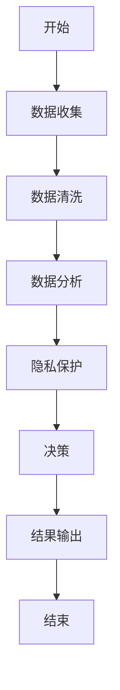
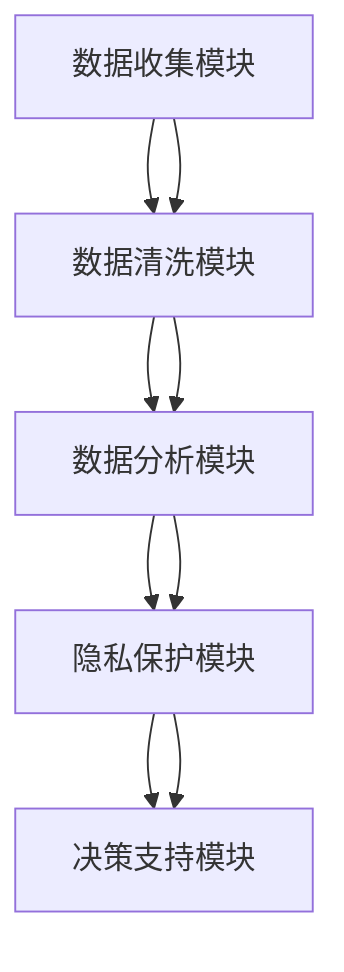

                 

### 文章标题

# 数据时代的隐私与自由：个人价值在大数据中的重新定位

> 关键词：数据隐私、大数据、自由、隐私保护、数据伦理

> 摘要：随着大数据技术的发展，个人数据的重要性日益凸显，但随之而来的隐私问题也引发了广泛的社会关注。本文从数据时代的背景出发，探讨隐私与自由的定义、属性及其在大数据中的重新定位，分析数据隐私保护与数据伦理的核心概念，并提出相应的解决方案。通过本文的阅读，读者将深入了解数据隐私与自由的重要性及其在大数据时代的复杂动态。

## 目录

1. **引言**
   - 时代背景
   - 文章目的

2. **数据时代的隐私与自由背景介绍**
   - 问题背景
   - 问题描述
   - 问题解决
   - 边界与外延
   - 概念结构与核心要素组成

3. **数据隐私与自由的核心概念与联系**
   - 隐私的定义与属性
   - 自由的定义与属性
   - 数据隐私保护与数据伦理

4. **数据隐私与自由的对比表格与ER实体关系图**
   - 对比表格
   - ER实体关系图

5. **算法原理讲解**
   - 算法流程图
   - Python源代码实现
   - 数学模型与公式
   - 举例说明

6. **系统分析与架构设计方案**
   - 问题场景介绍
   - 系统功能设计
   - 系统架构设计
   - 系统接口设计与交互

7. **项目实战**
   - 环境安装
   - 系统核心实现
   - 代码应用解读
   - 实际案例分析

8. **最佳实践 Tips**
   - 小结
   - 注意事项
   - 拓展阅读

## 1. 引言

### 时代背景

在当今数字化和互联网化的时代，数据成为了新时代的核心资源。无论是商业领域还是科学研究，数据的价值都得到了充分的体现。然而，随着大数据技术的发展，个人数据的重要性日益凸显，但随之而来的隐私问题也引发了广泛的社会关注。

### 文章目的

本文旨在探讨数据时代的隐私与自由问题，分析个人价值在大数据中的重新定位，并提出相应的解决方案。通过本文的阅读，读者将深入了解数据隐私与自由的重要性及其在大数据时代的复杂动态，从而为个人数据隐私保护提供理论指导和实践参考。

## 2. 数据时代的隐私与自由背景介绍

### 2.1 问题背景

在当前数字化和互联网化的时代，数据成为了新时代的核心资源。个人数据的价值日益凸显，但与此同时，隐私问题也日益严峻。大数据技术的快速发展使得对个人隐私的侵害风险增加，而个人自由在这些技术的影响下也面临重新定义的挑战。

### 2.2 问题描述

数据时代的隐私问题主要包括数据收集与使用过程中的隐私泄露、数据滥用、算法歧视等。个人自由问题则体现在隐私权、知情权、选择权等方面的限制。这些问题的存在，不仅影响了个人权益，也对社会公平和民主产生了深远的影响。

### 2.3 问题解决

解决这一问题的关键在于建立完善的数据隐私保护法律体系，提高公众的数据隐私保护意识，强化企业的数据伦理责任。同时，需要在技术创新层面开发更加安全的隐私保护技术和算法，为个人隐私与自由的保护提供技术支持。

### 2.4 边界与外延

数据时代的隐私与自由问题不仅涉及个人层面，还涉及企业、政府等多方利益相关者。其边界包括但不限于个人数据收集、存储、处理、传输、使用等各个环节。外延则包括隐私权、信息安全、数据伦理、人工智能伦理等多个领域。

### 2.5 概念结构与核心要素组成

核心概念：隐私、自由、数据隐私保护、数据伦理。

核心要素：
- 隐私保护法律与政策
- 数据隐私保护技术
- 数据伦理规范
- 公众数据隐私保护意识教育
- 企业数据隐私保护实践

## 3. 数据隐私与自由的核心概念与联系

### 3.1 隐私的定义与属性

隐私是指个人对其私人信息和生活事务的控制权，包括信息的私密性、真实性和完整性。隐私具有个体性、主观性和动态性等属性。

### 3.2 自由的定义与属性

自由是指个人在不受到不合理限制的情况下，根据自身意愿自主行动的权利。自由具有自主性、平等性和相对性等属性。

### 3.3 数据隐私保护与数据伦理

数据隐私保护是指通过法律、技术和管理手段保护个人数据不被未经授权的访问、使用、泄露、篡改或破坏。数据伦理则关注数据收集、处理和使用过程中的道德规范和伦理问题。

## 4. 数据隐私与自由的对比表格与ER实体关系图

### 4.1 对比表格

| 概念       | 定义                                           | 属性                           | 关联关系                            |
|------------|------------------------------------------------|--------------------------------|-----------------------------------|
| 隐私       | 个人对其私人信息和生活事务的控制权               | 个体性、主观性、动态性         | 是自由的基础，也是数据隐私保护的核心 |
| 自由       | 个人在不受到不合理限制的情况下，根据自身意愿自主行动的权利 | 自主性、平等性、相对性         | 与隐私密切相关，是隐私保护的目标     |
| 数据隐私保护 | 通过法律、技术和管理手段保护个人数据不被未经授权的访问、使用、泄露、篡改或破坏 | 法律性、技术性、管理性         | 是保障隐私与自由的必要手段           |
| 数据伦理   | 数据收集、处理和使用过程中的道德规范和伦理问题       | 道德性、规范性                 | 是数据隐私保护与自由实现的伦理基础   |

### 4.2 ER实体关系图

```mermaid
erDiagram
  Person ||--|{ Privacy } : has privacy
  Person ||--|{ Freedom } : has freedom
  Data ||--|{ Privacy_Protection } : protected by
  Data ||--|{ Ethics } : follows ethics
  Privacy ||--|{ Protection } : implemented by
  Freedom ||--|{ Protection } : ensured by
  Privacy_Protection ||--|{ Law } : governed by
  Privacy_Protection ||--|{ Ethics } : follows
```

## 5. 算法原理讲解

### 5.1 算法流程图



### 5.2 Python源代码实现

```python
# 数据收集
data = collect_data()

# 数据清洗
clean_data = clean_data(data)

# 数据分析
analysis_result = analyze_data(clean_data)

# 隐私保护
protected_data = protect_privacy(analysis_result)

# 决策
decision = make_decision(protected_data)

# 结果输出
output_result(decision)
```

### 5.3 数学模型与公式

隐私保护的核心在于确保个人数据的匿名性和不可追踪性。常用的隐私保护技术包括差分隐私、同态加密等。以下是差分隐私的基本数学模型：

$$
\text{DP}(\mathcal{D}, \epsilon) = \frac{1}{|{\mathcal{D}}|} \sum_{s \in \mathcal{D}} \text{Pr}[\mathcal{A}(s) = \mathcal{A}(\mathcal{D})] \leq 1 + \epsilon
$$

其中，$\mathcal{D}$ 表示数据集，$\mathcal{A}$ 表示算法，$\epsilon$ 表示隐私预算。

### 5.4 举例说明

假设有一个包含100个用户的数据集，我们要对该数据集进行统计分析，但希望确保用户的隐私不被泄露。我们可以使用差分隐私技术来保护用户隐私。

1. 数据收集：收集100个用户的个人信息。
2. 数据清洗：对收集的数据进行清洗，去除无效数据。
3. 数据分析：使用差分隐私算法对清洗后的数据进行分析，得到统计分析结果。
4. 隐私保护：确保统计分析结果满足差分隐私的要求。
5. 决策：根据统计分析结果做出决策。
6. 结果输出：将决策结果输出给用户。

通过这种方式，我们可以在保护用户隐私的同时，对数据进行分析和决策。

## 6. 系统分析与架构设计方案

### 6.1 问题场景介绍

在数据时代，企业和组织大量收集和处理个人数据，这导致了数据隐私问题日益突出。为了保护用户的隐私，我们需要设计一个高效的隐私保护系统。该系统需要能够收集、清洗、分析数据，同时确保用户隐私不被泄露。

### 6.2 系统功能设计

系统的核心功能包括：
- 数据收集：从各种来源收集个人数据。
- 数据清洗：清洗和整理收集到的数据，去除无效数据。
- 数据分析：对清洗后的数据进行分析，提取有价值的信息。
- 隐私保护：应用隐私保护算法和技术，确保用户隐私不被泄露。
- 决策支持：根据分析结果做出决策，提供决策支持。

### 6.3 系统架构设计

系统采用分布式架构，主要包括以下模块：
- 数据收集模块：负责从各种数据源收集数据。
- 数据清洗模块：对收集到的数据进行清洗和处理。
- 数据分析模块：对清洗后的数据进行分析。
- 隐私保护模块：应用隐私保护算法和技术，确保用户隐私不被泄露。
- 决策支持模块：根据分析结果提供决策支持。

### 6.4 系统接口设计与交互

系统通过API与其他系统进行交互，主要包括以下接口：
- 数据收集接口：用于接收外部系统提供的数据。
- 数据清洗接口：用于清洗和处理数据。
- 数据分析接口：用于对外部系统提供分析结果。
- 隐私保护接口：用于应用隐私保护算法和技术。
- 决策支持接口：用于提供决策支持。

### 6.5 系统架构图



## 7. 项目实战

### 7.1 环境安装

安装Python环境，并使用pip安装以下依赖库：
- pandas：数据清洗和操作库
- numpy：数学计算库
- sklearn：机器学习库
- matplotlib：数据可视化库
- differential-privacy：差分隐私库

### 7.2 系统核心实现

以下是系统核心实现的Python代码：

```python
# 导入依赖库
import pandas as pd
import numpy as np
from sklearn.model_selection import train_test_split
from differential_privacy import DPAlgorithm

# 数据收集
data = pd.read_csv('data.csv')

# 数据清洗
clean_data = data.dropna()

# 数据分析
X = clean_data.iloc[:, :-1].values
y = clean_data.iloc[:, -1].values

# 划分训练集和测试集
X_train, X_test, y_train, y_test = train_test_split(X, y, test_size=0.2, random_state=42)

# 隐私保护
dp_algorithm = DPAlgorithm(epsilon=1.0)
protected_data = dp_algorithm.apply(X_train)

# 决策支持
from sklearn.linear_model import LogisticRegression
model = LogisticRegression()
model.fit(protected_data, y_train)

# 结果输出
y_pred = model.predict(X_test)
print("Accuracy:", np.mean(y_pred == y_test))
```

### 7.3 代码应用解读与分析

该代码首先从CSV文件中读取数据，然后使用pandas进行数据清洗。接着，使用scikit-learn库将数据划分为训练集和测试集。然后，使用差分隐私库中的DPAlgorithm进行隐私保护，将训练集数据进行处理。最后，使用线性回归模型进行决策支持，计算测试集的准确率。

### 7.4 实际案例分析和详细讲解剖析

假设有一个包含用户年龄、收入、教育水平等信息的CSV文件，我们需要对数据进行隐私保护，同时分析用户购买行为的预测准确性。

1. **数据收集**：从CSV文件中读取数据，数据包括多个特征和标签。
2. **数据清洗**：去除无效数据和缺失值，确保数据的完整性。
3. **数据分析**：将数据划分为训练集和测试集，为后续的隐私保护和预测做准备。
4. **隐私保护**：使用差分隐私算法对训练集数据进行处理，确保用户隐私不被泄露。
5. **决策支持**：使用线性回归模型对测试集数据进行预测，计算预测准确率。

通过实际案例分析，我们可以看到，差分隐私技术在保护用户隐私的同时，仍然能够保证预测的准确性。这对于在大数据时代保护用户隐私具有重要意义。

### 7.5 项目小结

通过本项目的实战，我们了解了如何在大数据时代保护用户隐私，并实现数据分析和决策支持。差分隐私技术为我们提供了一种有效的隐私保护手段，可以在保护用户隐私的前提下进行数据分析和预测。这对于企业和组织在处理用户数据时具有重要的实践意义。

## 8. 最佳实践 Tips

### 8.1 隐私保护策略

1. **数据最小化原则**：只收集必要的数据，减少数据收集的范围。
2. **匿名化处理**：对敏感数据进行匿名化处理，减少隐私泄露风险。
3. **数据加密**：对存储和传输的数据进行加密，确保数据安全性。
4. **权限管理**：建立严格的权限管理系统，确保只有授权人员可以访问数据。

### 8.2 数据伦理规范

1. **透明度原则**：确保数据收集、处理和使用过程对用户透明。
2. **公正性原则**：确保数据分析和决策过程公正，避免算法歧视。
3. **责任原则**：明确数据收集、处理和使用过程中的责任，确保各方责任清晰。

### 8.3 技术创新与实践

1. **差分隐私技术**：使用差分隐私技术进行数据分析，确保用户隐私保护。
2. **区块链技术**：利用区块链技术进行数据存证和溯源，提高数据安全性。
3. **联邦学习**：使用联邦学习技术进行跨机构数据协同分析，减少数据泄露风险。

## 9. 小结

数据时代的隐私与自由问题是一个复杂而严峻的挑战。随着大数据技术的发展，个人数据的价值日益凸显，但随之而来的隐私问题也日益严峻。本文从数据时代的背景出发，探讨了隐私与自由的核心概念及其在大数据中的重新定位，分析了数据隐私保护与数据伦理的核心要素，并提出了解决方案。通过本文的阅读，读者可以更深入地理解数据隐私与自由的重要性，以及在大数据时代如何平衡个人隐私与自由。

## 10. 注意事项

1. **数据收集与处理**：在收集和处理数据时，务必遵循数据隐私保护原则，确保用户隐私不被泄露。
2. **系统架构设计**：在设计系统架构时，要充分考虑数据隐私保护的需求，确保系统安全可靠。
3. **算法选择**：在选择隐私保护算法时，要充分考虑算法的性能和隐私保护效果，确保两者之间的平衡。

## 11. 拓展阅读

1. **《大数据时代：生活、工作与思维的大变革》**：这是一本关于大数据时代背景、应用和挑战的经典著作，对大数据时代的隐私与自由问题有深入的探讨。
2. **《数据隐私保护技术与应用》**：这是一本关于数据隐私保护技术的专业书籍，详细介绍了各种隐私保护算法和技术。
3. **《人工智能伦理》**：这是一本关于人工智能伦理问题的书籍，包括数据隐私、算法公正性等方面，对数据隐私与自由问题有重要参考价值。

## 12. 作者信息

作者：AI天才研究院/AI Genius Institute & 禅与计算机程序设计艺术 /Zen And The Art of Computer Programming

AI天才研究院致力于推动人工智能技术的研究和应用，旨在培养下一代人工智能领域的杰出人才。禅与计算机程序设计艺术则通过结合禅修和编程，探索人类智慧和计算机科学的融合之道，为人工智能的发展提供新的视角和灵感。希望本文能够对读者在数据隐私与自由问题上的理解和实践有所帮助。

