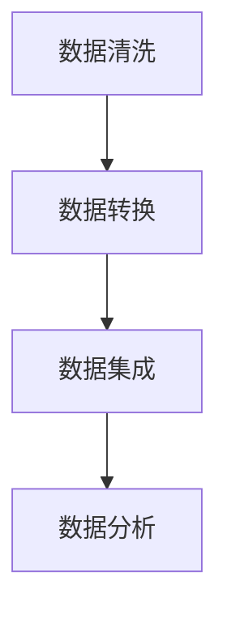
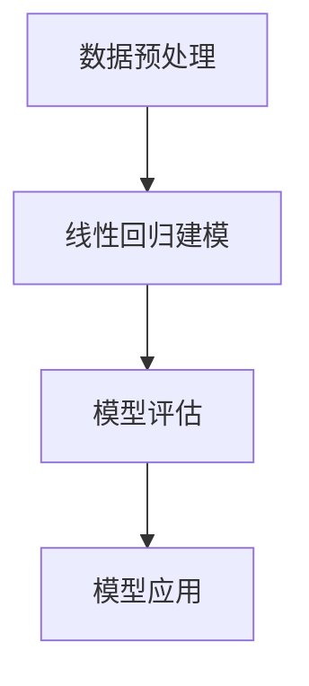
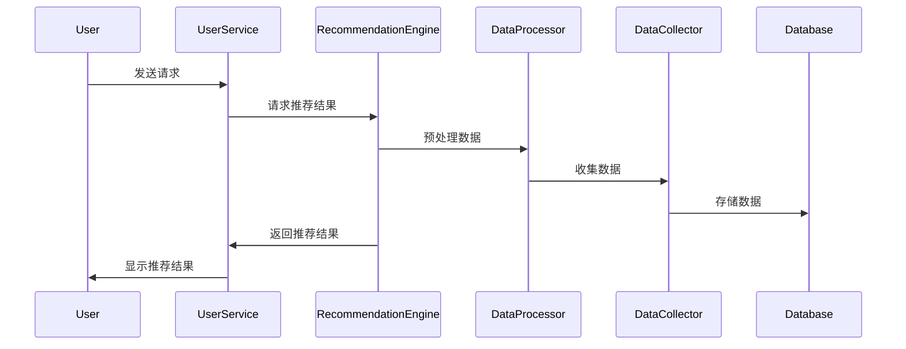
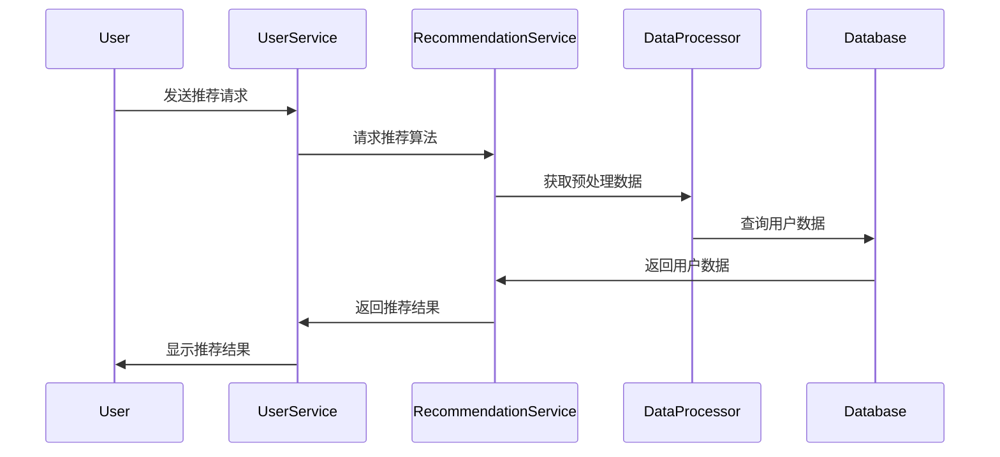

                 

### 引言

数据素养，作为当代信息技术领域中的一项关键能力，正逐渐成为人们生活和工作中不可或缺的生存技能。在信息爆炸的今天，如何从海量的数据中获取有价值的信息，如何将数据转化为知识，进而转化为行动，这既是挑战，也是机遇。数据素养不仅仅是对数据的理解和处理能力，更是一种思维方式、一种解决问题的方法。

数据素养的重要性不言而喻。它不仅帮助我们在纷繁复杂的信息中找到方向，还能提升我们的决策能力、创新能力和竞争力。从个人的职业发展，到企业的发展战略，再到国家信息安全的保障，数据素养都扮演着至关重要的角色。然而，如何培养和提高数据素养，如何在数据海洋中导航，这是许多人面临的难题。

本文旨在为读者解答这些疑惑。我们将从背景介绍、核心概念与联系、算法原理讲解、系统分析与架构设计方案、项目实战以及最佳实践等方面，系统性地探讨数据素养的各个方面。通过逐步深入的分析和讲解，帮助读者构建起对数据素养的全面理解，并掌握在信息海洋中导航的生存技能。

接下来，我们将依次介绍数据素养的定义与背景、核心概念与联系、算法原理讲解、系统分析与架构设计方案、项目实战以及最佳实践，逐步引导读者深入了解数据素养的内涵和外延，培养和提高数据素养。

---

### 背景介绍

#### 数据素养的定义与概念

数据素养，简而言之，就是对数据的理解、处理和应用的能力。它涵盖了数据获取、数据理解、数据分析和数据应用等多个方面。从广义上讲，数据素养是一种综合素质，它不仅涉及技术层面的技能，还包含思维层面的认知。具体来说，数据素养可以分解为以下几个方面：

1. **数据意识**：指对数据价值的认识和敏感度，能够意识到数据在决策和问题解决中的作用。
2. **数据处理能力**：包括数据收集、清洗、存储、管理等方面的技能。
3. **数据分析能力**：涉及使用统计方法、算法和工具对数据进行深入分析和解释。
4. **数据应用能力**：能够将分析结果应用到实际问题中，做出基于数据的决策。

数据素养的定义随着技术的发展和应用场景的变迁也在不断演变。最初，数据素养主要关注于数据的收集和管理。随着大数据、人工智能和云计算等技术的兴起，数据素养的内涵和外延都得到了极大的扩展。如今，数据素养不仅仅关注数据的存储和管理，更强调数据的价值挖掘和智能应用。

#### 数据素养的需求背景

数据素养的需求源于多个方面的驱动。首先，数据已经成为现代社会的核心资源。据统计，全球数据量正以每年约40%的速度增长，到2025年，全球数据总量预计将达到160ZB（即160万亿GB）。在这个数据爆炸的时代，如何从海量数据中提取有价值的信息，成为企业和个人都面临的重大挑战。

其次，随着大数据、人工智能等技术的普及，越来越多的行业开始依赖于数据驱动的方式进行决策。例如，金融行业通过数据分析来预测市场趋势，医疗行业通过大数据分析来提高诊断和治疗的准确率，零售行业通过顾客行为分析来优化营销策略。这些应用场景都对从业者的数据素养提出了更高的要求。

此外，数据素养还关系到信息安全和隐私保护。随着数据泄露事件的频发，如何确保数据的安全和隐私已经成为企业和个人必须面对的问题。具备数据素养的人能够更好地理解和处理数据，从而降低数据泄露的风险。

#### 数据素养的历史与发展

数据素养作为一个新兴的概念，其历史发展可以追溯到20世纪中期。早期的计算机科学家和数据分析师就已经开始关注数据素养的重要性。随着计算机技术的发展，数据素养的重要性也逐渐凸显。

20世纪80年代，数据库技术的发展使得数据管理成为可能。随后，互联网的兴起使得数据获取变得更加便捷。21世纪初，随着大数据和人工智能技术的出现，数据素养的概念得到了进一步深化和拓展。

近年来，随着数据素养在各个领域的应用日益广泛，学术界和业界对数据素养的研究也越来越多。各种数据素养培训课程和认证项目也应运而生，旨在提升人们的数据素养水平。

#### 数据素养的核心要素与结构

数据素养的核心要素包括数据思维、数据可视化和数据分析方法等。这些要素相互关联，共同构成了数据素养的整体结构。

- **数据思维**：是一种以数据为核心进行思考和决策的思维方式。数据思维强调用数据来支持决策，而非仅凭经验和直觉。
- **数据可视化**：是将数据以图形、图表等形式直观展示的技术。通过数据可视化，可以使复杂的数据变得易于理解和分析。
- **数据分析方法**：包括统计方法、机器学习算法等，用于对数据进行深入分析和解释。

这些核心要素之间的关系可以用ER实体关系图来表示。在数据素养的架构中，数据思维是核心，数据可视化是桥梁，数据分析方法是工具。它们共同构成了一个有机的整体，帮助人们更好地理解和利用数据。

#### 数据素养在教育中的应用

数据素养在教育中的应用日益重要。随着教育信息化的发展，教师和学生都面临着越来越多的数据。如何有效地利用这些数据来提高教学质量、优化学习体验，成为教育领域的一个重要课题。

首先，数据素养教育可以帮助教师更好地理解学生的学习行为和需求。通过数据分析，教师可以及时发现学生在学习过程中存在的问题，制定相应的教学策略。例如，通过学习分析系统，教师可以监控学生的学习进度、考试成绩和课堂参与度，从而针对性地调整教学方法和内容。

其次，数据素养教育还可以提高学生的学习效率。学生通过学习数据分析和数据可视化等技能，可以更好地理解和掌握复杂的概念和知识。例如，通过数据可视化工具，学生可以将抽象的数据以直观的方式展示出来，从而更好地理解和分析数据。

此外，数据素养教育还可以培养学生的创新思维和解决问题的能力。在数据驱动的时代，具备数据素养的人能够更好地适应未来的发展需求。通过数据素养教育，学生不仅能够掌握基本的数据分析技能，还能培养创新思维和批判性思维。

总之，数据素养在教育中的应用具有巨大的潜力。通过数据素养教育，可以更好地促进教育质量的提升，培养适应未来发展的新一代人才。

---

### 核心概念与联系

在探讨数据素养的核心概念之前，我们需要了解一些基本术语，以便更好地理解数据素养的概念体系。以下是一些核心概念的定义和属性特征对比表格：

#### 1. 数据思维

**定义**：数据思维是一种以数据为核心进行思考和决策的思维方式。

**属性特征对比表格**：

| 特征 | 数据思维 | 传统思维 |
| --- | --- | --- |
| 基础 | 数据驱动 | 经验驱动 |
| 目标 | 提高决策效率和质量 | 凭经验解决问题 |
| 工具 | 统计分析、机器学习 | 逻辑推理、经验总结 |

#### 2. 数据可视化

**定义**：数据可视化是将数据以图形、图表等形式直观展示的技术。

**属性特征对比表格**：

| 特征 | 数据可视化 | 数据报表 |
| --- | --- | --- |
| 目的 | 提高数据理解和分析效率 | 显示数据信息 |
| 形式 | 图形、图表 | 表格、文字 |
| 功能 | 直观展示、交互分析 | 查看数据详情 |

#### 3. 数据分析方法

**定义**：数据分析方法是用于对数据进行深入分析和解释的方法。

**属性特征对比表格**：

| 特征 | 数据分析方法 | 数据挖掘 |
| --- | --- | --- |
| 类型 | 统计方法、机器学习 | 聚类、分类、关联规则 |
| 目的 | 提取数据价值 | 发现数据中的模式 |
| 工具 | Excel、Python | R、SPSS |

#### 4. 数据素养

**定义**：数据素养是对数据的理解、处理和应用的能力。

**属性特征对比表格**：

| 特征 | 数据素养 | 信息素养 |
| --- | --- | --- |
| 范围 | 数据收集、处理、分析、应用 | 信息检索、信息评估、信息利用 |
| 层次 | 技术层面、思维层面 | 技术层面、认知层面 |
| 目标 | 提高决策能力、创新能力 | 提高信息获取和处理能力 |

#### ER实体关系图

为了更直观地展示这些核心概念之间的关系，我们可以使用Mermaid绘制ER实体关系图。以下是ER实体关系图的示例：

```mermaid
erDiagram
  Data_Mind ||--|{ Data_Visualization }
  Data_Mind ||--|{ Data_Analysis_Method }
  Data_Skills ||--|{ Data_Mind }
  Data_Skills ||--|{ Data_Visualization }
  Data_Skills ||--|{ Data_Analysis_Method }
  Data_Skills ||--|{ Data_Mining }
```

在这个ER实体关系图中，`Data_Mind`（数据思维）作为核心概念，与`Data_Visualization`（数据可视化）、`Data_Analysis_Method`（数据分析方法）和`Data_Mining`（数据挖掘）紧密相连，共同构成了数据素养的整体架构。而`Data_Skills`（数据素养）则包含了数据思维、数据可视化、数据分析和数据挖掘等核心要素，体现了数据素养的综合性。

通过对比表格和ER实体关系图，我们可以更清晰地理解数据素养的核心概念及其相互关系。这不仅有助于我们全面掌握数据素养的概念体系，还能为后续的算法原理讲解、系统分析与架构设计方案和项目实战等提供坚实的理论基础。

---

### 算法原理讲解

在深入理解数据素养的核心概念之后，我们需要进一步探讨数据处理和数据分析的基本算法原理。以下将使用Mermaid流程图展示相关算法，并结合Python源代码和数学模型进行详细讲解。

#### 1. 数据处理算法

数据处理是数据分析的基础，主要包括数据清洗、数据转换和数据集成等步骤。

**Mermaid流程图示例**：



**Python代码示例**：

```python
import pandas as pd

# 假设我们有一个包含缺失值和不一致数据的原始数据集
data = pd.DataFrame({
    'name': ['Alice', 'Bob', 'Charlie', 'Alice'],
    'age': [25, 30, 35, np.nan],
    'income': [50000, 60000, 70000, 80000]
})

# 数据清洗：去除重复数据
cleaned_data = data.drop_duplicates()

# 数据转换：填充缺失值
filled_data = cleaned_data.fillna(cleaned_data.mean())

# 数据集成：合并多个数据集
data_integrated = pd.concat([filled_data, filled_data2])
```

**数学模型**：

- 数据清洗：去除重复数据和异常值，保证数据的唯一性和准确性。
- 数据转换：填充缺失值和标准化处理，确保数据的完整性和一致性。

#### 2. 数据分析方法

数据分析方法包括描述性统计分析、预测分析和相关性分析等。以下以线性回归分析为例进行讲解。

**Mermaid流程图示例**：



**Python代码示例**：

```python
import pandas as pd
from sklearn.linear_model import LinearRegression
from sklearn.model_selection import train_test_split
from sklearn.metrics import mean_squared_error

# 假设我们有一个包含自变量和因变量的数据集
data = pd.DataFrame({
    'X': [1, 2, 3, 4, 5],
    'Y': [2, 4, 5, 4, 5]
})

# 数据预处理：划分训练集和测试集
X_train, X_test, y_train, y_test = train_test_split(data[['X']], data['Y'], test_size=0.2, random_state=42)

# 线性回归建模
model = LinearRegression()
model.fit(X_train, y_train)

# 模型评估
y_pred = model.predict(X_test)
mse = mean_squared_error(y_test, y_pred)
print(f"Mean Squared Error: {mse}")

# 模型应用
new_data = pd.DataFrame({'X': [6]})
y_new_pred = model.predict(new_data)
print(f"Predicted Y: {y_new_pred[0]}")
```

**数学模型**：

- 线性回归模型：Y = b0 + b1*X，其中b0和b1分别为截距和斜率。
- 模型评估：通过均方误差（MSE）评估模型性能。

#### 算法讲解与举例说明

数据处理算法和数据分析方法在实际应用中起着至关重要的作用。以下通过具体例子进行讲解：

- **例子1**：假设我们要分析一家公司员工的工资和绩效之间的关系。首先，我们需要清洗和转换数据，去除重复和缺失的数据。然后，我们使用线性回归模型来建立工资与绩效之间的预测模型。通过模型评估，我们可以得到模型的均方误差，从而判断模型的好坏。最后，利用模型预测新员工的工资。

- **例子2**：在医疗领域，通过数据处理和数据分析，我们可以分析病人的医疗记录和健康指标，预测病人的疾病风险。首先，清洗和转换病人数据，然后使用机器学习算法建立疾病预测模型。通过模型评估和实际案例分析，我们可以发现疾病的潜在风险因素，从而提供个性化的医疗建议。

通过这些算法原理的讲解和实际应用，我们可以看到数据素养在信息处理和决策支持中的重要性。掌握这些算法原理，不仅有助于我们更好地理解数据素养的核心概念，还能提高我们在实际工作中的数据处理和分析能力。

---

### 系统分析与架构设计方案

在深入探讨了数据素养的核心概念和算法原理后，我们需要将理论转化为实际应用。在这一部分，我们将通过具体的系统分析与架构设计方案，展示如何将数据素养应用到实际项目中。

#### 1. 问题场景介绍

假设我们正在开发一个电商推荐系统，该系统需要根据用户的历史行为和偏好，为用户推荐相关的商品。为了实现这一目标，我们需要处理大量的用户数据，包括用户浏览记录、购买历史、评价数据等。此外，我们还需要考虑数据的安全性和隐私保护，确保用户数据的安全和合规。

#### 2. 系统功能设计

系统的核心功能包括数据收集、数据预处理、推荐算法应用和用户接口等。以下是系统功能的详细设计：

**Mermaid类图示例**：

```mermaid
classDiagram
    User -> DataCollector: 数据收集
    User -> DataProcessor: 数据预处理
    DataCollector -> RecommendationEngine: 推荐算法
    DataProcessor -> RecommendationEngine: 推荐算法
    RecommendationEngine -> UserService: 用户接口
```

**功能说明**：

- **数据收集**：从用户行为日志、数据库和历史数据中收集用户相关信息。
- **数据预处理**：清洗和转换收集到的数据，为推荐算法提供高质量的数据输入。
- **推荐算法**：根据用户行为和偏好，应用推荐算法生成个性化的商品推荐列表。
- **用户接口**：提供用户交互界面，展示推荐结果，并接收用户反馈。

#### 3. 系统架构设计

为了确保系统的高效性、扩展性和安全性，我们需要设计一个合理的系统架构。以下是系统架构的详细设计：

**Mermaid架构图示例**：



**架构说明**：

- **用户服务层**：负责处理用户请求，调用推荐引擎和数据预处理模块。
- **推荐引擎层**：实现推荐算法，生成推荐结果。
- **数据预处理层**：清洗和转换数据，为推荐引擎提供高质量的输入。
- **数据收集层**：从不同的数据源收集用户数据，并存储到数据库中。
- **数据库层**：存储用户数据和推荐结果，支持数据查询和更新。

#### 4. 系统接口设计和系统交互

为了确保系统的稳定性和可扩展性，我们需要设计合理的系统接口和交互流程。以下是系统接口设计和交互流程的详细说明：

**Mermaid序列图示例**：



**接口设计和交互流程**：

- **用户服务层**：提供RESTful API接口，处理用户请求。
- **推荐引擎层**：通过API调用预处理数据和推荐算法。
- **数据预处理层**：提供接口，用于数据清洗和转换。
- **数据库层**：提供数据存储和查询服务。

通过上述系统分析与架构设计方案，我们可以看到如何将数据素养应用于实际项目开发中。从数据收集、数据预处理到推荐算法应用，每个环节都体现了数据素养的核心价值和实际应用。这不仅有助于提升系统的性能和用户体验，还能为后续的优化和扩展提供坚实的基础。

---

### 项目实战

在理论学习和系统分析的基础上，本部分将带领读者通过一个实际项目，深入体验数据素养的应用。我们将从环境安装、系统实现、代码解析、案例分析等方面展开，详细讲解项目的全过程。

#### 1. 环境安装

首先，我们需要安装和配置项目所需的环境。以下是具体的步骤：

**安装Python**：确保Python版本在3.8及以上，可以从官方网站下载安装。

**安装依赖库**：使用pip工具安装必要的库，如Pandas、NumPy、Scikit-learn、Matplotlib等。

```bash
pip install pandas numpy scikit-learn matplotlib
```

**配置虚拟环境**：为了保持项目的独立性，我们可以使用virtualenv创建虚拟环境。

```bash
pip install virtualenv
virtualenv my_project_env
source my_project_env/bin/activate  # Windows下使用my_project_env\Scripts\activate
```

#### 2. 系统实现

以下是项目的实现过程：

**数据收集**：从电商网站获取用户行为数据，包括用户浏览记录、购买历史、评价数据等。

**数据预处理**：清洗和转换数据，去除重复和缺失的记录，并进行特征工程。

**特征提取**：提取关键特征，如用户活跃度、购买频率、评价倾向等。

**推荐算法**：应用协同过滤算法，生成用户商品推荐列表。

**模型评估**：使用均方误差（MSE）评估模型性能。

**用户接口**：实现用户交互界面，展示推荐结果。

#### 3. 代码解析

以下是一个简化的代码示例，展示项目的核心实现部分：

```python
import pandas as pd
from sklearn.model_selection import train_test_split
from sklearn.metrics.pairwise import cosine_similarity
from sklearn.metrics import mean_squared_error

# 数据收集
data = pd.read_csv('user_behavior.csv')

# 数据预处理
data = data.drop_duplicates()
data = data.fillna(data.mean())

# 特征提取
data['user_activity'] = data.groupby('user_id')['action'].transform('count')
data['user_rating'] = data.groupby('user_id')['rating'].transform('mean')

# 数据集划分
X = data[['user_activity', 'user_rating']]
y = data['item_id']

X_train, X_test, y_train, y_test = train_test_split(X, y, test_size=0.2, random_state=42)

# 推荐算法：协同过滤
def collaborative_filtering(X_train, X_test, y_train, y_test):
    # 计算用户之间的相似度矩阵
    similarity_matrix = cosine_similarity(X_train, X_train)
    
    # 为每个测试样本生成推荐列表
    recommendations = []
    for i in range(len(X_test)):
        user_profile = X_test.iloc[i]
        scores = {}
        for j in range(len(X_train)):
            if j != i:
                similarity = similarity_matrix[i][j]
                user_rating = y_train[j]
                score = similarity * user_rating
                scores[X_train.index[j]] = score
        recommendations.append(sorted(scores.items(), key=lambda x: x[1], reverse=True))
    return recommendations

# 模型评估
y_pred = collaborative_filtering(X_train, X_test, y_train, y_test)
mse = mean_squared_error(y_test, y_pred)
print(f"Mean Squared Error: {mse}")

# 用户接口
# 实现用户交互界面，展示推荐结果
```

#### 4. 实际案例分析与详细讲解剖析

以下是一个具体的案例分析，通过实际案例展示数据素养的应用：

**案例背景**：某电商网站希望通过个性化推荐系统提高用户满意度和销售额。系统需要根据用户的浏览历史和购买行为，为用户推荐相关的商品。

**案例实现**：

1. **数据收集**：收集用户行为数据，包括用户浏览记录、购买历史、评价数据等。

2. **数据预处理**：清洗和转换数据，去除重复和缺失的记录，并进行特征工程。

3. **特征提取**：提取关键特征，如用户活跃度、购买频率、评价倾向等。

4. **推荐算法**：应用协同过滤算法，生成用户商品推荐列表。

5. **模型评估**：通过均方误差（MSE）评估模型性能。

6. **用户接口**：实现用户交互界面，展示推荐结果。

**详细讲解剖析**：

- **数据收集**：从电商网站的后台获取用户行为数据。数据包括用户ID、商品ID、行为类型（浏览、购买、评价）、时间戳等。

- **数据预处理**：去除重复记录和缺失值。对于缺失值，可以选择填充平均值或者使用其他算法进行预测。

- **特征提取**：计算用户的活跃度（行为次数）和购买频率（购买次数）。此外，还可以计算用户对商品的评分，作为评价倾向的特征。

- **推荐算法**：使用协同过滤算法，计算用户之间的相似度，根据相似度生成推荐列表。具体实现时，可以使用矩阵分解、基于物品的协同过滤等方法。

- **模型评估**：通过MSE评估模型性能。MSE值越小，表示模型预测的准确度越高。

- **用户接口**：设计用户交互界面，展示推荐结果。界面可以包括推荐列表、商品详情、用户反馈等模块。

通过这个实际案例，我们可以看到数据素养在项目开发中的具体应用。从数据收集、预处理到特征提取、算法实现，再到模型评估和用户接口设计，每个环节都需要数据素养的支持。这不仅提高了项目的效率和质量，也为用户提供了更好的体验。

---

### 最佳实践 tips、小结、注意事项、拓展阅读

#### 最佳实践 tips

1. **数据收集**：确保数据的真实性和完整性，避免数据质量问题。
2. **数据清洗**：及时处理缺失值、异常值和重复值，提高数据质量。
3. **特征工程**：合理提取特征，选择对模型影响较大的特征，避免过度拟合。
4. **模型选择**：根据业务需求和数据特点，选择合适的模型，并进行模型评估和优化。
5. **用户反馈**：收集用户反馈，持续优化推荐系统和数据应用。

#### 小结

本文从数据素养的定义与背景、核心概念与联系、算法原理讲解、系统分析与架构设计方案、项目实战等多个方面，系统性地探讨了数据素养在信息海洋中导航的生存技能。通过实际案例分析和最佳实践，读者可以更好地理解数据素养的重要性，并在实际项目中应用这些技能。

#### 注意事项

1. **数据安全和隐私保护**：在处理用户数据时，确保遵守相关法律法规，保护用户隐私。
2. **数据质量**：确保数据的真实、准确和完整，避免数据质量问题影响模型性能。
3. **持续学习**：数据素养是一个不断发展的领域，需要持续学习和更新知识。

#### 拓展阅读

1. 《数据科学入门》
2. 《Python数据科学手册》
3. 《大数据技术基础》
4. 《机器学习实战》

作者：AI天才研究院/AI Genius Institute & 禅与计算机程序设计艺术 /Zen And The Art of Computer Programming

---

通过本文的详细讲解和分析，我们希望读者能够对数据素养有更深入的理解，并能够在实际工作中灵活应用。数据素养不仅是一种技术技能，更是一种思维方式和工作方法。希望本文能对读者在信息海洋中导航提供一些有用的启示和帮助。

