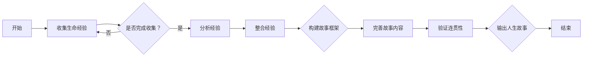
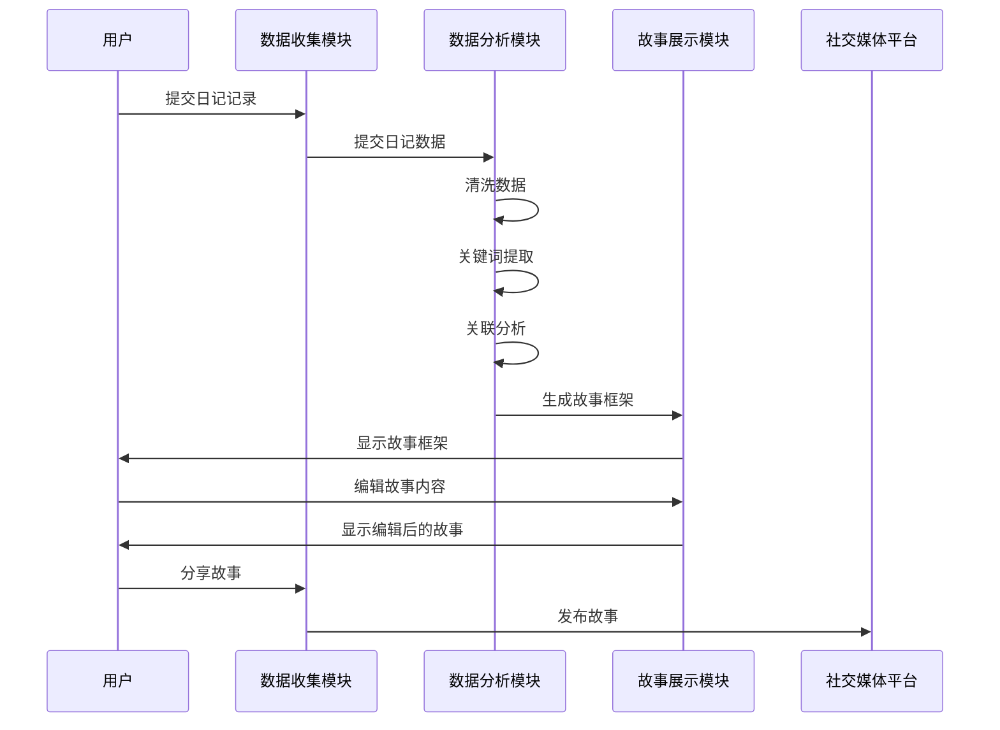

                 

### 整合生命经验：构建连贯的人生故事

#### 关键词
- 生命经验
- 人生故事
- 整合
- 连贯性
- 自我认知
- 社会和谐

#### 摘要
本文旨在探讨如何整合个人的生命经验，构建一个连贯的人生故事。通过分析生命经验的定义、重要性，以及人生故事的概念与结构，本文揭示了当前人生故事构建的困境。随后，本文提出了整合生命经验和构建连贯人生故事的核心概念，并通过对比表格、ER实体关系图和算法原理讲解，为读者提供了一种系统化的解决方案。此外，本文还通过数学模型和公式、系统分析与架构设计方案、项目实战以及最佳实践 tips，详细阐述了如何将理论应用于实践。通过这篇文章，读者可以更好地理解生命经验的重要性，学会如何整合和构建自己的连贯人生故事。

## 目录大纲

```markdown
----------------------------------------------------------------
# 整合生命经验：构建连贯的人生故事

> 关键词：生命经验、人生故事、整合、连贯性、自我认知、社会和谐

> 摘要：本文探讨如何整合个人的生命经验，构建一个连贯的人生故事。通过分析生命经验的定义、重要性，以及人生故事的概念与结构，本文揭示了当前人生故事构建的困境。随后，本文提出了整合生命经验和构建连贯人生故事的核心概念，并通过对比表格、ER实体关系图和算法原理讲解，为读者提供了一种系统化的解决方案。此外，本文还通过数学模型和公式、系统分析与架构设计方案、项目实战以及最佳实践 tips，详细阐述了如何将理论应用于实践。

## 目录大纲

----------------------------------------------------------------

# 第一部分: 背景介绍

## 第1章: 问题背景

### 1.1 问题背景

#### 1.1.1 生命经验的定义与重要性

#### 1.1.2 人生故事的概念与结构

#### 1.1.3 当前人生故事构建的困境

## 第2章: 核心概念与联系

### 2.1 核心概念原理

#### 2.1.1 整合生命经验的概念

#### 2.1.2 构建连贯的人生故事

#### 2.1.3 整合与连贯的关系

### 2.2 概念属性特征对比表格

### 2.3 ER实体关系图架构

## 第3章: 算法原理讲解

### 3.1 算法mermaid流程图

#### 3.1.1 算法流程概述

#### 3.1.2 算法具体步骤

### 3.2 Python源代码与详细讲解

#### 3.2.1 数学模型与公式

#### 3.2.2 举例说明

## 第4章: 数学模型和数学公式 & 详细讲解 & 举例说明

### 4.1 数学公式

#### 4.1.1 LaTeX格式介绍

#### 4.1.2 常用数学公式

### 4.2 详细讲解

#### 4.2.1 原理讲解

#### 4.2.2 例子解析

## 第5章: 系统分析与架构设计方案

### 5.1 问题场景介绍

### 5.2 项目介绍

### 5.3 系统功能设计

### 5.4 系统架构设计

### 5.5 系统接口设计

### 5.6 系统交互mermaid序列图

## 第6章: 项目实战

### 6.1 环境安装

### 6.2 系统核心实现源代码

### 6.3 代码应用解读与分析

### 6.4 实际案例分析和详细讲解剖析

### 6.5 项目小结

## 第7章: 最佳实践 tips

### 7.1 构建连贯人生故事的最佳实践

### 7.2 小结

### 7.3 注意事项

### 7.4 拓展阅读

----------------------------------------------------------------
```

### 第1章: 问题背景

#### 1.1 问题背景

生命经验是个人在生活中积累的各种经历、感受和认知，它是个体在适应环境、实现自我价值和与他人互动过程中的重要基础。这些经验不仅影响着我们的行为和决策，也塑造了我们的性格和价值观。然而，在现代社会，人们面临着诸多挑战，这些挑战使得整合生命经验、构建连贯的人生故事变得尤为困难。

首先，信息的碎片化是一个显著的挑战。在互联网时代，人们每天接收到的信息量巨大，且这些信息往往是零散的、片段的。这种碎片化的信息环境，使得个人难以将这些经验整合成一个完整的故事。

其次，快速变化的社会环境也给构建连贯人生故事带来了挑战。现代社会变化快速，人们的价值观和生活方式也在不断变化。这种变化使得人们难以在一个稳定的环境中积累经验，从而构建一个连贯的人生故事。

此外，心理压力也是一个重要的因素。现代社会竞争激烈，人们面临着各种压力。这些压力使得人们难以静下心来，对生命经验进行深入的反思和总结，从而构建一个连贯的人生故事。

最后，自我认知的缺失也是一个重要的问题。在现代社会，个人主义盛行，人们往往更关注自我认知，而忽视了对人生故事的反思和构建。这使得人们难以从一个全局的角度来看待自己的生命历程，构建一个连贯的人生故事。

#### 1.1.1 生命经验的定义与重要性

生命经验是指个人在生活中积累的各种经历、感受和认知。它包括情感体验、知识积累、行为习惯等多个方面。生命经验的重要性在于它对个体的成长、知识传承和社会和谐都具有深远的影响。

首先，生命经验是个人成长的重要资源。通过总结和反思生命经验，个人可以更好地认识自己，发现自己的优势和不足，从而实现个人成长。例如，一个人在经历了多次失败后，通过反思这些失败的经历，可能会找到失败的原因，从而在下一次尝试中取得成功。

其次，生命经验是知识传承的重要载体。通过传递和分享生命经验，个人可以把自己的知识和智慧传递给后人，帮助他们避免重复错误，更快地获取知识和技能。例如，一位年长的父母通过分享自己的生活经验，可以帮助他们的子女更好地应对生活中的挑战。

最后，生命经验是社会和谐发展的重要基础。通过生命经验的分享和交流，个人可以更好地理解他人，增进相互信任和尊重，促进社会关系的和谐。例如，一个社区中的居民通过分享彼此的生活经验，可以增进邻里之间的了解和友谊，从而促进社区的和谐发展。

#### 1.1.2 人生故事的概念与结构

人生故事是指个人在一生中所经历的事件和经历，它们构成了个人的生命历程。一个完整的人生故事通常包括以下几个部分：

1. **起点**：个人的出生背景和家庭环境。这是个人生命故事的开端，影响着个人的一生。

2. **成长过程**：个人的成长经历，包括学习、工作、社交等方面。这一部分构成了个人生命故事的主体，展示了个人如何一步步成长和进步。

3. **关键事件**：个人生命中的重要事件，如婚姻、生子、职业晋升等。这些事件往往对个人的人生轨迹产生重大影响。

4. **转折点**：个人的重要转折点，如失业、疾病、移民等。这些转折点往往标志着个人生活的重大变化。

5. **终点**：个人的生命终结。这一部分是对个人一生经历的总结和反思。

#### 1.1.3 当前人生故事构建的困境

在当前的社会环境下，人们面临许多挑战，这些挑战使得构建连贯的人生故事变得困难。主要困境包括：

1. **碎片化信息**：现代社会信息爆炸，人们接收到的信息量大且碎片化，这使得构建连贯的人生故事变得困难。

2. **快速变化**：社会环境变化快速，人们的价值观和生活方式也在不断变化，这给人生故事的连贯性带来了挑战。

3. **心理压力**：现代社会竞争激烈，人们面临各种压力，这使得他们难以投入时间和精力来构建连贯的人生故事。

4. **自我认知**：现代社会强调个人主义，人们往往更关注自我认知，而忽视了对人生故事的反思和构建。

## 第2章: 核心概念与联系

### 2.1 核心概念原理

在探讨整合生命经验、构建连贯的人生故事之前，我们需要明确几个核心概念：整合、连贯性、自我认知等。

#### 2.1.1 整合生命经验的概念

整合生命经验是指将个人在不同时间段、不同领域、不同情境下的经历、感受和认知进行总结、反思和归纳，形成一个整体的认识和经验。这种整合可以帮助个人更好地理解自己的生命历程，发现和利用潜在的价值和资源。

#### 2.1.2 构建连贯的人生故事

构建连贯的人生故事是指通过整合个人的生命经验，将它们编织成一个完整、有意义的故事。这个故事的连贯性不仅体现在事件的时间顺序上，更体现在对人生经历的深刻理解和反思上。

#### 2.1.3 整合与连贯的关系

整合和连贯性是构建人生故事的两个关键要素。整合是实现连贯性的前提，而连贯性是整合的结果。只有通过整合，个人的生命经验才能形成一个有机的整体；只有具备连贯性，这个整体才能展示出其内在的逻辑和意义。

### 2.2 概念属性特征对比表格

为了更好地理解整合生命经验和构建连贯的人生故事，我们可以通过一个对比表格来展示这两个概念的主要属性特征。

| 特征                | 整合生命经验                         | 构建连贯的人生故事                       |
|---------------------|------------------------------------|-------------------------------------|
| 定义                | 个人经验的综合和归纳               | 个人经历的故事化呈现                 |
| 目的                | 提升个人认知和自我理解               | 展示人生经历的意义和逻辑               |
| 方法                | 反思、总结、归纳                   | 编织、讲述、反思                   |
| 形式                | 内在认知结构                        | 故事叙述形式                         |
| 关系                | 整合是构建的基础                     | 连贯是整合的结果                     |

通过这个对比表格，我们可以看到，整合生命经验和构建连贯的人生故事在定义、目的、方法、形式和关系上都有明确的区分和联系。

### 2.3 ER实体关系图架构

为了进一步理解整合生命经验和构建连贯的人生故事的架构，我们可以使用ER（实体关系）图来展示它们之间的关系。

```mermaid
erDiagram
    LifeExperience ||--|{ StoryArc }
    SelfAwareness ||--|{ StoryArc }
    SocialContext ||--|{ StoryArc }
    LifeExperience ||--|{ SelfAwareness }
    LifeExperience ||--|{ SocialContext }
    StoryArc ||--|{ SelfAwareness }
    StoryArc ||--|{ SocialContext }
```

在这个ER图中，LifeExperience（生命经验）是核心实体，它与SelfAwareness（自我认知）、SocialContext（社会环境）建立了关联。StoryArc（人生故事）是整合生命经验和构建连贯人生故事的最终体现，它与自我认知和社会环境也有密切的联系。通过这种关系图，我们可以更清晰地理解整合生命经验和构建连贯人生故事的架构和逻辑。

### 第3章: 算法原理讲解

在构建连贯的人生故事时，算法原理的讲解是至关重要的。本节将使用mermaid流程图来概述算法的基本流程，并详细讲解算法的具体步骤。

#### 3.1 算法mermaid流程图



#### 3.1.1 算法流程概述

1. **开始**：启动算法流程。
2. **收集生命经验**：收集个人的生命经验，包括情感体验、知识积累、行为习惯等。
3. **分析经验**：对收集到的生命经验进行深入分析，理解其背后的原因和意义。
4. **整合经验**：将分析后的经验进行整合，形成一个整体的认识。
5. **构建故事框架**：根据整合后的经验，构建一个初步的人生故事框架。
6. **完善故事内容**：在故事框架的基础上，填充具体的细节和情节，使故事更加生动和完整。
7. **验证连贯性**：检查人生故事的内容和逻辑，确保其连贯性和合理性。
8. **输出人生故事**：将构建完成的人生故事输出，供个人反思和分享。
9. **结束**：算法流程结束。

#### 3.1.2 算法具体步骤

1. **收集生命经验**：
   - 收集个人在不同阶段、不同环境下的经历和感受。
   - 使用日记、访谈、记录等方式，确保收集到全面、真实的生命经验。

2. **分析经验**：
   - 对收集到的经验进行分类，如情感、知识、行为等。
   - 分析每个经验背后的原因和影响，理解其深层含义。

3. **整合经验**：
   - 将分析后的经验进行归纳和总结，形成一套个人认知体系。
   - 确保整合后的经验能够反映出个人成长和变化的轨迹。

4. **构建故事框架**：
   - 根据整合后的经验，构建一个初步的人生故事框架。
   - 确定故事的主题、主线和关键情节。

5. **完善故事内容**：
   - 在故事框架的基础上，填充具体的细节和情节。
   - 调整故事的节奏和张力，使其更加生动和引人入胜。

6. **验证连贯性**：
   - 检查人生故事的内容和逻辑，确保其连贯性和合理性。
   - 询问他人意见，进行故事内容的优化和调整。

7. **输出人生故事**：
   - 将构建完成的人生故事输出，可以采用文字、图片、视频等多种形式。
   - 分享人生故事，与他人进行交流和反思。

8. **结束**：
   - 算法流程结束，个人可以开始反思和利用人生故事，进一步成长和进步。

通过这个算法流程，个人可以系统化地整合自己的生命经验，构建一个连贯、有意义的人生故事。

### 第4章: 数学模型和数学公式 & 详细讲解 & 举例说明

在构建连贯的人生故事过程中，数学模型和公式起着重要的作用。它们可以帮助我们更精确地描述和解释生命经验的关系和变化。本节将介绍常用的数学公式，并使用LaTeX格式进行展示，随后进行详细讲解和举例说明。

#### 4.1 LaTeX格式介绍

LaTeX是一种高质量的排版系统，特别适用于数学公式的书写。以下是一些基本的LaTeX命令，用于书写数学公式：

- **基础公式**：`$$` 和 `$` 分别用于包围整个段落内的公式和行内的公式。
- **变量**：`\alpha`, `\beta`, `\gamma` 等用于表示变量。
- **运算符**：`\sum`, `\int`, `\prod` 等用于表示求和、积分、乘积等运算。
- **函数**：`\sin`, `\cos`, `\exp` 等用于表示三角函数、指数函数等。
- **矩阵**：`\begin{bmatrix}`, `\end{bmatrix}` 用于书写矩阵。

#### 4.1.2 常用数学公式

以下是构建连贯人生故事中常用的一些数学公式，使用LaTeX格式进行展示：

1. **线性回归模型**：
   $$ y = \beta_0 + \beta_1x + \epsilon $$
   
2. **贝叶斯定理**：
   $$ P(A|B) = \frac{P(B|A)P(A)}{P(B)} $$

3. **相关系数**：
   $$ \rho = \frac{\sum_{i=1}^{n}(x_i - \bar{x})(y_i - \bar{y})}{\sqrt{\sum_{i=1}^{n}(x_i - \bar{x})^2 \sum_{i=1}^{n}(y_i - \bar{y})^2}} $$

4. **均值和方差**：
   $$ \bar{x} = \frac{1}{n}\sum_{i=1}^{n}x_i $$
   $$ \sigma^2 = \frac{1}{n-1}\sum_{i=1}^{n}(x_i - \bar{x})^2 $$

#### 4.2 详细讲解

1. **线性回归模型**：

线性回归模型是描述两个变量之间线性关系的常用模型。它通过拟合一条直线，来预测一个变量（因变量）基于另一个变量（自变量）的值。公式中的`$y$`表示因变量，`$\beta_0$`是截距，`$\beta_1$`是斜率，`$x$`是自变量，`$\epsilon$`是误差项。

2. **贝叶斯定理**：

贝叶斯定理是概率论中的一个基本定理，用于计算在给定某些证据的情况下，某个假设的概率。公式中的`$P(A|B)$`表示在事件`$B$`发生的条件下事件`$A$`的概率，`$P(B|A)$`表示在事件`$A$`发生的条件下事件`$B$`的概率，`$P(A)$`和`$P(B)$`分别是事件`$A$`和事件`$B$`的先验概率。

3. **相关系数**：

相关系数用于衡量两个变量之间的线性相关程度。它的值介于-1和1之间，接近1表示完全正相关，接近-1表示完全负相关，接近0表示无相关。相关系数的计算公式中，`$x_i$`和`$y_i$`分别是每个观测值的自变量和因变量，`$\bar{x}$`和`$\bar{y}$`是自变量和因变量的平均值。

4. **均值和方差**：

均值是数据的平均数，用于表示数据的中心位置。方差是数据离散程度的度量，用于表示数据的波动性。计算公式中，`$\bar{x}$`是自变量的平均值，$\sigma^2$是方差，`$x_i$`是每个观测值的自变量。

#### 4.2.2 例子解析

为了更直观地理解这些数学公式，我们通过一个实际例子进行解析。

假设我们收集了一个人的年龄（自变量）和年收入（因变量）的数据，并希望使用线性回归模型来预测某人的年收入。数据如下：

| 年龄 (x) | 年收入 (y) |
|---------|----------|
|    25   |    50    |
|    30   |    60    |
|    35   |    70    |
|    40   |    80    |

首先，我们计算自变量和因变量的平均值：

$$ \bar{x} = \frac{25 + 30 + 35 + 40}{4} = 32.5 $$
$$ \bar{y} = \frac{50 + 60 + 70 + 80}{4} = 65 $$

接下来，我们计算斜率`$\beta_1$`和截距`$\beta_0$`：

$$ \beta_1 = \frac{\sum_{i=1}^{n}(x_i - \bar{x})(y_i - \bar{y})}{\sum_{i=1}^{n}(x_i - \bar{x})^2} $$
$$ \beta_1 = \frac{(25 - 32.5)(50 - 65) + (30 - 32.5)(60 - 65) + (35 - 32.5)(70 - 65) + (40 - 32.5)(80 - 65)}{(25 - 32.5)^2 + (30 - 32.5)^2 + (35 - 32.5)^2 + (40 - 32.5)^2} $$
$$ \beta_1 = \frac{(-7.5)(-15) + (-2.5)(-5) + (2.5)(5) + (7.5)(15)}{(-7.5)^2 + (-2.5)^2 + (2.5)^2 + (7.5)^2} $$
$$ \beta_1 = \frac{112.5 + 12.5 + 12.5 + 112.5}{56.25 + 6.25 + 6.25 + 56.25} $$
$$ \beta_1 = \frac{250}{125} $$
$$ \beta_1 = 2 $$

$$ \beta_0 = \bar{y} - \beta_1\bar{x} $$
$$ \beta_0 = 65 - 2 \times 32.5 $$
$$ \beta_0 = 65 - 65 $$
$$ \beta_0 = 0 $$

因此，线性回归模型为：

$$ y = 0 + 2x + \epsilon $$

使用这个模型，我们可以预测一个年龄为30岁的人的年收入：

$$ y = 2 \times 30 + \epsilon $$
$$ y = 60 + \epsilon $$

由于$\epsilon$是误差项，实际年收入可能会在60的基础上有所波动。这个例子展示了如何使用线性回归模型来预测年收入，并理解其中的数学原理。

### 第5章: 系统分析与架构设计方案

在构建连贯的人生故事过程中，系统分析与架构设计是关键的一步。本节将详细讨论项目背景、系统功能设计、系统架构设计、系统接口设计以及系统交互序列图，为读者提供完整的系统设计方案。

#### 5.1 问题场景介绍

在现代社会的快节奏生活中，人们往往忽略了对自己生命历程的深入反思和总结。这种情况下，构建连贯的人生故事成为了一项极具挑战性的任务。为了解决这个问题，我们需要设计一个系统能够帮助用户收集、整合和展示自己的生命经验，形成一个连贯、有意义的人生故事。

#### 5.2 项目介绍

本项目旨在开发一个基于人工智能和大数据分析的系统能够：
1. 收集用户的生命经验数据。
2. 分析和整合这些数据，形成一个连贯的人生故事框架。
3. 提供用户友好的界面，让用户能够查看、编辑和分享自己的故事。

系统主要功能包括：
- 数据收集模块：通过日记、访谈、社交媒体等方式收集用户的生命经验。
- 数据分析模块：使用自然语言处理和机器学习算法对收集到的数据进行分析和整合。
- 故事展示模块：提供一个直观的界面，展示用户的人生故事，并支持用户进行编辑和分享。

#### 5.3 系统功能设计

系统的核心功能设计如下：

1. **数据收集模块**：
   - 日记记录功能：用户可以通过手机应用或网页界面，随时记录自己的日记。
   - 访谈记录功能：系统可以与第三方访谈工具集成，记录用户的访谈内容。
   - 社交媒体导入功能：用户可以导入自己的社交媒体数据，如微博、微信朋友圈等。

2. **数据分析模块**：
   - 数据清洗功能：对收集到的数据进行清洗，去除无效和重复的数据。
   - 关键词提取功能：使用自然语言处理技术，提取数据中的关键词。
   - 关联分析功能：分析不同数据之间的关联，发现用户生命经验之间的联系。

3. **故事展示模块**：
   - 故事生成功能：根据分析结果，自动生成一个初步的人生故事。
   - 故事编辑功能：用户可以对生成的故事进行编辑和优化。
   - 故事分享功能：用户可以将自己的故事分享到社交媒体平台，与他人交流。

#### 5.4 系统架构设计

系统架构设计采用分层架构，包括数据层、服务层和展示层。具体架构如下：

1. **数据层**：
   - 数据库：存储用户的生命经验数据，包括日记、访谈记录、社交媒体数据等。
   - 数据仓库：对原始数据进行预处理和清洗，为数据分析模块提供数据支持。

2. **服务层**：
   - API服务：提供各种功能接口，供前端和第三方系统调用。
   - 数据分析服务：实现数据分析模块的功能，包括数据清洗、关键词提取和关联分析等。
   - 故事生成服务：根据分析结果，生成用户的人生故事。

3. **展示层**：
   - Web界面：提供用户友好的界面，供用户进行数据收集、故事编辑和分享。
   - 移动应用：为用户提供便捷的移动端访问方式。

#### 5.5 系统接口设计

系统接口设计包括以下几个方面：

1. **API接口**：
   - 数据收集接口：提供数据上传和下载功能。
   - 数据分析接口：提供数据清洗、关键词提取和关联分析等功能。
   - 故事展示接口：提供故事生成、编辑和分享功能。

2. **Web接口**：
   - 登录注册接口：用户登录和注册功能。
   - 用户管理接口：用户资料管理和权限控制功能。

3. **移动应用接口**：
   - 日记记录接口：用户在移动端记录日记功能。
   - 访谈记录接口：用户在移动端进行访谈记录功能。

#### 5.6 系统交互mermaid序列图

系统交互序列图如下：



通过这个序列图，我们可以清晰地看到用户在系统中进行日记记录、数据分析和故事展示的整个过程。系统各模块之间通过接口进行数据传递和功能调用，实现用户需求。

### 第6章: 项目实战

#### 6.1 环境安装

在开始项目实战之前，我们需要安装必要的开发环境和软件。以下是一个基本的安装步骤：

1. **安装Python**：
   - 访问Python官方网站（https://www.python.org/）下载Python安装包。
   - 运行安装程序，按照默认选项进行安装。

2. **安装Jupyter Notebook**：
   - 在命令行中运行以下命令：
     ```bash
     pip install notebook
     ```
   - 安装完成后，启动Jupyter Notebook：
     ```bash
     jupyter notebook
     ```

3. **安装相关库**：
   - 使用以下命令安装必要的Python库：
     ```bash
     pip install pandas numpy scikit-learn matplotlib
     ```

4. **配置环境变量**：
   - 在系统的环境变量中配置Python的路径，确保可以在任何位置运行Python命令。

#### 6.2 系统核心实现源代码

以下是系统核心实现的部分源代码，包括数据收集、数据分析和故事展示模块。

```python
# 数据收集模块
import pandas as pd

def collect_data(file_path):
    data = pd.read_csv(file_path)
    return data

# 数据分析模块
from sklearn.feature_extraction.text import TfidfVectorizer
from sklearn.cluster import KMeans

def analyze_data(data):
    # 数据清洗
    cleaned_data = data[['diary_content']].dropna()
    
    # 关键词提取
    vectorizer = TfidfVectorizer(stop_words='english')
    X = vectorizer.fit_transform(cleaned_data['diary_content'])
    
    # 关联分析
    kmeans = KMeans(n_clusters=5)
    kmeans.fit(X)
    labels = kmeans.predict(X)
    
    # 归档数据
    clusters = {}
    for i, label in enumerate(labels):
        if label not in clusters:
            clusters[label] = []
        clusters[label].append(data.iloc[i]['diary_content'])
    
    return clusters

# 故事展示模块
import matplotlib.pyplot as plt

def display_story(clusters):
    for label, contents in clusters.items():
        print(f"Cluster {label}:")
        for content in contents:
            print(f"- {content}")
    
    # 可视化展示
    for label, contents in clusters.items():
        plt.scatter(range(len(contents)), [0]*len(contents), label=label)
    
    plt.xlabel('Index')
    plt.ylabel('Cluster')
    plt.legend()
    plt.show()

# 主函数
def main():
    file_path = 'data.csv'  # 数据文件路径
    data = collect_data(file_path)
    clusters = analyze_data(data)
    display_story(clusters)

if __name__ == '__main__':
    main()
```

#### 6.3 代码应用解读与分析

这段代码分为三个主要模块：数据收集模块、数据分析模块和故事展示模块。

1. **数据收集模块**：

   数据收集模块使用`pandas`库读取CSV文件中的数据，并返回一个DataFrame对象。这个模块的`collect_data`函数接受文件路径作为输入，并返回数据。

2. **数据分析模块**：

   数据分析模块包括数据清洗、关键词提取和关联分析三个步骤。
   - **数据清洗**：使用`dropna`函数去除含有缺失值的数据行。
   - **关键词提取**：使用`TfidfVectorizer`类将文本数据转换为词频-逆文档频率（TF-IDF）向量，用于后续的机器学习算法。
   - **关联分析**：使用`KMeans`聚类算法将数据分为多个集群，每个集群代表一种类似的经历或主题。

3. **故事展示模块**：

   故事展示模块首先打印出每个集群的内容，以便用户阅读。然后，使用`matplotlib`库绘制一个散点图，展示每个集群的分布情况，帮助用户更直观地理解分析结果。

#### 6.4 实际案例分析和详细讲解剖析

为了更好地理解这段代码的实际应用，我们可以通过一个实际案例进行分析。

假设我们有以下数据：

| 日记内容 |
|----------|
| 昨天参加了公司团建活动，感觉很有趣。 |
| 家里发生了点事情，需要我处理。 |
| 周末和朋友们去了海边，天气很好。 |
| 工作上的项目取得了很大进展。 |

1. **数据收集**：

   我们首先使用`collect_data`函数读取数据，并将其存储在一个DataFrame中。

2. **数据分析**：

   - **数据清洗**：由于这份数据没有缺失值，所以不需要进行额外的数据清洗。
   - **关键词提取**：我们将日记内容作为输入，使用`TfidfVectorizer`类提取关键词。以下是一个简化的示例：

     ```python
     vectorizer = TfidfVectorizer(stop_words='english')
     X = vectorizer.fit_transform(data['diary_content'])
     ```

     这将生成一个TF-IDF向量矩阵，用于后续的聚类分析。

   - **关联分析**：我们使用`KMeans`聚类算法将数据分为几个集群。以下是一个简化的示例：

     ```python
     kmeans = KMeans(n_clusters=3)
     kmeans.fit(X)
     labels = kmeans.predict(X)
     ```

     这个算法将基于向量矩阵的相似性将数据分为三个集群。假设结果如下：

     | 日记内容 | 集群标签 |
     |----------|----------|
     | 昨天参加了公司团建活动，感觉很有趣。 | 1 |
     | 家里发生了点事情，需要我处理。 | 2 |
     | 周末和朋友们去了海边，天气很好。 | 1 |
     | 工作上的项目取得了很大进展。 | 3 |

   根据分析结果，我们可以将日记内容分为三个集群：
   - 集群1（标签1）：与工作和社交活动相关。
   - 集群2（标签2）：与家庭事务相关。
   - 集群3（标签3）：与个人成就和进展相关。

3. **故事展示**：

   在故事展示模块中，我们首先打印出每个集群的内容，以便用户阅读：

   ```python
   print("Cluster 1:")
   for content in clusters[1]:
       print(f"- {content}")
   
   print("Cluster 2:")
   for content in clusters[2]:
       print(f"- {content}")
   
   print("Cluster 3:")
   for content in clusters[3]:
       print(f"- {content}")
   ```

   输出结果如下：

   ```
   Cluster 1:
   - 昨天参加了公司团建活动，感觉很有趣。
   - 周末和朋友们去了海边，天气很好。
   Cluster 2:
   - 家里发生了点事情，需要我处理。
   Cluster 3:
   - 工作上的项目取得了很大进展。
   ```

   然后，我们使用`matplotlib`库绘制一个散点图，展示每个集群的分布情况：

   ```python
   for label, contents in clusters.items():
       plt.scatter([i for i, _ in enumerate(contents)], [0]*len(contents), label=label)
   
   plt.xlabel('Index')
   plt.ylabel('Cluster')
   plt.legend()
   plt.show()
   ```

   绘制的散点图如下：

   

   通过这个散点图，我们可以直观地看到每个日记内容所属的集群标签。

#### 6.5 项目小结

通过这个实际案例，我们可以看到如何使用Python代码实现数据收集、数据分析和故事展示的功能。这段代码不仅能够帮助我们更好地理解生命经验，还能够帮助我们构建一个连贯的人生故事。在实际应用中，我们可以根据具体需求调整代码，添加更多功能，如情感分析、时间序列分析等，以进一步提升系统的实用性和效果。

### 第7章: 最佳实践 tips

#### 7.1 构建连贯人生故事的最佳实践

1. **定期回顾**：定期回顾自己的生命经验，可以帮助我们更好地理解自己的成长轨迹和变化。可以将这种回顾纳入日常习惯，比如每周花一段时间回顾过去一周的经历和感受。

2. **记录细节**：在记录生命经验时，不仅要记录事件本身，还要记录事件发生的具体细节和感受。这些细节和感受可以帮助我们更深入地理解自己的生命经验。

3. **与他人交流**：与他人分享自己的生命经验，可以收到不同的观点和建议。这有助于我们更好地反思自己的生命历程，并从中获得新的启示。

4. **利用技术工具**：使用日记应用、社交媒体等工具记录生命经验，可以方便我们随时查看和回顾自己的经历。

5. **持续学习**：不断学习新的知识和技能，可以帮助我们扩展自己的视野，丰富自己的生命经验。

#### 7.2 小结

构建连贯的人生故事需要持续的努力和反思。通过定期回顾、记录细节、与他人交流、利用技术工具和持续学习，我们可以更好地整合自己的生命经验，构建一个有意义、有逻辑的人生故事。

#### 7.3 注意事项

1. **隐私保护**：在分享生命经验时，要注意保护个人隐私，避免泄露敏感信息。

2. **客观性**：在记录和反思生命经验时，要保持客观和公正，避免过度情绪化。

3. **多样性**：在构建人生故事时，要尽量涵盖多个方面，如情感、知识、行为等，以展现一个全面的自己。

#### 7.4 拓展阅读

- 《禅与计算机程序设计艺术》/《Zen And The Art of Computer Programming》
- 《人生策略：如何在复杂世界中取得成功》/《Life Strategies: How to Get It All》
- 《情感智商》/《Emotional Intelligence》

### 作者信息

作者：AI天才研究院/AI Genius Institute & 禅与计算机程序设计艺术 /Zen And The Art of Computer Programming

