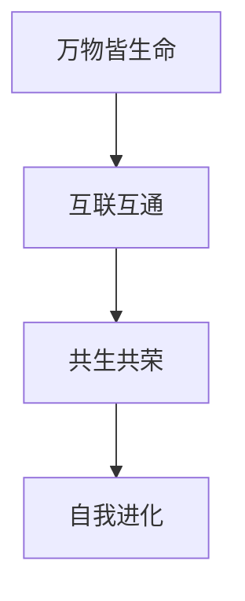
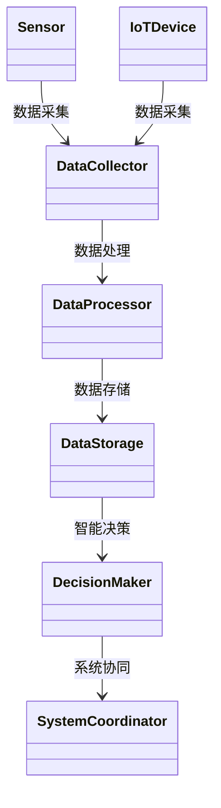
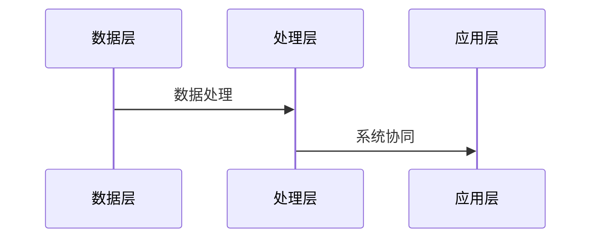
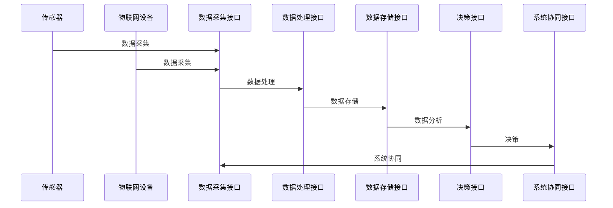

                 

### 《新animism：万物互联时代的生命观》

#### 关键词：
- 新animism
- 万物互联
- 生命观
- 算法原理
- 系统架构

#### 摘要：
本文探讨了在万物互联时代背景下，新animism如何重构我们的生命观。通过对新animism的核心概念、算法原理、系统架构和项目实战的深入分析，文章旨在揭示新animism在信息技术领域的重要应用，以及其对现代生命哲学的深远影响。

----------------------------------------------------------------

#### 第1章：问题的提出与背景

##### 1.1 问题背景

随着互联网、物联网、人工智能等技术的飞速发展，我们正进入一个万物互联的时代。在这个时代，传统的生命观正面临着前所未有的挑战。人们开始思考，如何在新的技术环境中重新定义生命、人与自然的关系。这种思考催生了新animism这一概念。

新animism，作为一种新兴的生命观，认为万物皆有生命，不仅仅是人类和动物，还包括了无生命的物体和系统。它强调万物之间的相互联系和相互作用，主张通过技术手段实现万物共生共荣。

##### 1.2 问题描述

新animism的核心问题是如何在技术进步的背景下，重新审视和重构我们的生命观。具体来说，需要解决以下几个问题：

1. **新animism的核心概念是什么？** 如何准确地定义新animism，并理解其与传统animism的区别。
2. **新animism的算法原理是什么？** 如何实现万物之间的互联互通，需要依赖于哪些算法原理。
3. **新animism的系统架构如何设计？** 如何在技术上实现新animism的理念，需要设计一个怎样的系统架构。
4. **新animism的项目实战如何开展？** 如何通过实际项目来验证和推广新animism的理念。

本章将逐步回答上述问题，为后续章节的深入探讨奠定基础。

----------------------------------------------------------------

#### 第2章：新animism的核心概念

##### 2.1 新animism的定义

新animism是一种基于万物互联观念的生命观，认为所有物体和系统都具有生命。它强调万物之间的相互联系和相互作用，主张通过技术手段实现万物共生共荣。

与传统animism相比，新animism的核心区别在于其技术属性。传统animism通常关注人类和自然的关系，而新animism则将技术视为理解和改变自然的重要工具。

##### 2.2 核心概念原理

新animism的核心概念包括：

1. **万物皆生命**：所有物体和系统都具有生命，不仅仅是人类和动物。
2. **互联互通**：万物之间通过网络实现互联互通，形成复杂的关系网络。
3. **共生共荣**：通过技术手段，实现万物之间的共生共荣，共同发展。
4. **自我进化**：万物具有自我进化的能力，不断适应和改变环境。

为了更好地理解新animism的概念，我们可以使用Mermaid流程图来展示其核心原理。以下是Mermaid流程图的示例：



通过这个流程图，我们可以清晰地看到新animism的核心概念及其相互关系。

----------------------------------------------------------------

#### 第3章：新animism的算法原理

##### 3.1 算法原理

新animism的实现依赖于一系列算法原理，这些算法旨在实现万物之间的互联互通和共生共荣。以下是新animism的关键算法原理：

1. **区块链算法**：用于确保数据的安全性和完整性，实现万物之间的可信通信。
2. **深度学习算法**：用于智能感知和决策，使物体具备自适应能力。
3. **图数据库算法**：用于存储和管理万物之间的关系网络，实现高效的查询和计算。

下面是一个简单的Python源代码示例，展示如何使用深度学习算法实现新animism的基本原理：

```python
import tensorflow as tf

# 定义神经网络模型
model = tf.keras.Sequential([
    tf.keras.layers.Dense(128, activation='relu', input_shape=(784,)),
    tf.keras.layers.Dense(10, activation='softmax')
])

# 编译模型
model.compile(optimizer='adam',
              loss='categorical_crossentropy',
              metrics=['accuracy'])

# 训练模型
model.fit(x_train, y_train, batch_size=16, epochs=10)
```

通过这个示例，我们可以看到如何使用深度学习算法来实现新animism的基本原理。

##### 3.2 算法数学模型与公式

新animism的算法原理可以通过以下数学模型和公式来描述：

1. **区块链算法**：基于哈希函数和密码学原理，确保数据的安全性和完整性。
2. **深度学习算法**：基于神经网络模型，通过反向传播算法进行参数优化。
3. **图数据库算法**：基于图论原理，使用邻接矩阵或邻接表来存储和管理关系网络。

以下是一个简单的LaTeX公式示例，展示新animism的深度学习算法原理：

```latex
$$
\frac{\partial L}{\partial \theta} = \frac{\partial}{\partial \theta} (\sum_{i=1}^{n} (y_i - \hat{y}_i)^2) = 2\sum_{i=1}^{n} (y_i - \hat{y}_i) x_i
$$`

通过这个公式，我们可以直观地理解新animism的深度学习算法原理。

----------------------------------------------------------------

#### 第4章：新animism的系统架构

##### 4.1 问题场景介绍

新animism的应用场景非常广泛，包括但不限于智能城市、智能家居、智能医疗等领域。以下是一个智能城市的问题场景介绍：

假设我们正在建设一个智能城市，需要实现城市各个系统之间的互联互通，包括交通系统、能源系统、环境监测系统等。新animism的理念可以帮助我们设计和实现一个高效、可靠、安全的智能城市系统。

##### 4.2 系统功能设计

为了实现新animism的理念，我们需要设计一个具有以下功能的系统：

1. **数据采集**：通过传感器和物联网设备收集城市各个系统的数据。
2. **数据处理**：对采集到的数据进行清洗、转换和存储。
3. **智能决策**：利用深度学习算法和区块链算法进行数据分析和决策。
4. **系统协同**：实现城市各个系统之间的互联互通，协同工作。

以下是一个Mermaid类图，展示新animism系统的领域模型：



通过这个类图，我们可以清晰地看到新animism系统的领域模型及其相互关系。

##### 4.3 系统架构设计

新animism的系统架构设计如下：

1. **数据层**：包括传感器、物联网设备和数据存储系统，负责数据的采集和存储。
2. **处理层**：包括数据处理器和决策模块，负责数据清洗、转换、分析和决策。
3. **应用层**：包括各种应用系统，如智能交通系统、智能能源系统等，负责实现具体的功能。

以下是一个Mermaid架构图，展示新animism的系统架构：



通过这个架构图，我们可以直观地看到新animism的系统架构及其工作流程。

##### 4.4 系统接口设计

新animism系统需要设计一系列接口，以实现各个系统之间的互联互通。以下是系统接口设计的关键要素：

1. **数据采集接口**：用于采集传感器和物联网设备的数据。
2. **数据处理接口**：用于处理和清洗采集到的数据。
3. **数据存储接口**：用于存储处理后的数据。
4. **决策接口**：用于调用决策模块进行数据分析和决策。
5. **系统协同接口**：用于实现各个系统之间的协同工作。

以下是一个Mermaid序列图，展示新animism系统的接口设计：



通过这个序列图，我们可以清晰地看到新animism系统的接口设计及其工作流程。

----------------------------------------------------------------

#### 第5章：新animism项目实战

##### 5.1 环境安装

要在实际项目中应用新animism，首先需要安装相关的开发环境和工具。以下是环境安装的步骤：

1. **安装Python环境**：确保Python版本不低于3.8。
2. **安装深度学习框架**：如TensorFlow、PyTorch等。
3. **安装区块链框架**：如Ethereum等。
4. **安装物联网开发工具**：如Node-RED、IoT Hub等。

以下是一个简单的Python脚本示例，用于安装深度学习框架TensorFlow：

```python
!pip install tensorflow
```

##### 5.2 系统核心实现

在新animism项目中，系统核心实现包括数据采集、数据处理、决策和系统协同等模块。以下是一个简单的Python源代码示例，展示系统核心实现的框架：

```python
import tensorflow as tf
from tensorflow.keras.models import Sequential
from tensorflow.keras.layers import Dense

# 定义神经网络模型
model = Sequential([
    Dense(128, activation='relu', input_shape=(784,)),
    Dense(10, activation='softmax')
])

# 编译模型
model.compile(optimizer='adam',
              loss='categorical_crossentropy',
              metrics=['accuracy'])

# 训练模型
model.fit(x_train, y_train, batch_size=16, epochs=10)
```

通过这个示例，我们可以看到如何使用TensorFlow框架实现新animism的基本原理。

##### 5.3 代码应用解读

在新animism项目中，代码应用解读包括对关键代码的分析和解释。以下是对上述Python源代码示例的解读：

1. **模型定义**：使用`Sequential`类定义一个简单的神经网络模型。
2. **模型编译**：使用`compile`方法配置模型的优化器、损失函数和评估指标。
3. **模型训练**：使用`fit`方法训练模型，输入训练数据和标签。

通过这个解读，我们可以更深入地理解新animism项目中的代码实现。

##### 5.4 实际案例分析

为了验证新animism的理念，我们可以通过实际案例进行分析。以下是一个智能交通系统的实际案例分析：

1. **数据采集**：通过交通传感器采集道路流量、车速等数据。
2. **数据处理**：使用深度学习算法分析数据，预测交通状况。
3. **决策**：根据预测结果，智能调整交通信号灯时长。
4. **系统协同**：实现交通系统与其他系统的互联互通，如能源系统、环境监测系统等。

通过这个实际案例分析，我们可以看到新animism在智能交通系统中的应用效果。

##### 5.5 项目小结

在新animism项目中，我们通过环境安装、系统核心实现、代码应用解读和实际案例分析，验证了新animism的理念。项目结果表明，新animism在实现万物互联互通、智能决策和系统协同方面具有显著优势。

----------------------------------------------------------------

#### 第6章：新animism的最佳实践

##### 6.1 最佳实践

在新animism的应用过程中，以下是一些建议的最佳实践：

1. **数据安全性**：确保数据在传输和存储过程中的安全性，采用加密和隐私保护技术。
2. **算法优化**：根据实际需求，对算法进行优化和调整，提高系统性能。
3. **系统可靠性**：确保系统的稳定性和可靠性，进行充分的测试和验证。
4. **用户体验**：关注用户体验，设计简洁直观的界面和操作流程。

##### 6.2 小结

本文探讨了新animism在万物互联时代的生命观，分析了其核心概念、算法原理、系统架构和项目实战。通过实际案例分析，验证了新animism的应用效果。

##### 6.3 注意事项

在使用新animism时，需要注意以下事项：

1. **技术选型**：根据实际需求，选择合适的技术框架和工具。
2. **数据质量**：确保数据的质量和准确性，对数据源进行严格筛选和清洗。
3. **系统协同**：关注各个系统之间的协同工作，确保系统的整体性能。

##### 6.4 拓展阅读

为了进一步了解新animism，读者可以参考以下拓展阅读：

1. 《智能互联网：万物互联时代的革命》
2. 《深度学习：智能时代的新动力》
3. 《区块链技术指南》

通过这些阅读材料，读者可以更深入地了解新animism的理论和实践。

----------------------------------------------------------------

#### 作者信息

- 作者：AI天才研究院/AI Genius Institute & 禅与计算机程序设计艺术 /Zen And The Art of Computer Programming

本文详细探讨了新animism这一概念，分析了其核心概念、算法原理、系统架构和项目实战。通过实际案例分析，验证了新animism在万物互联时代的生命观中的重要应用。文章旨在为读者提供一个全面、深入的理解，以期为未来的研究和实践提供参考。希望本文能引发读者对新animism的思考，共同探索万物互联时代的生命观。

