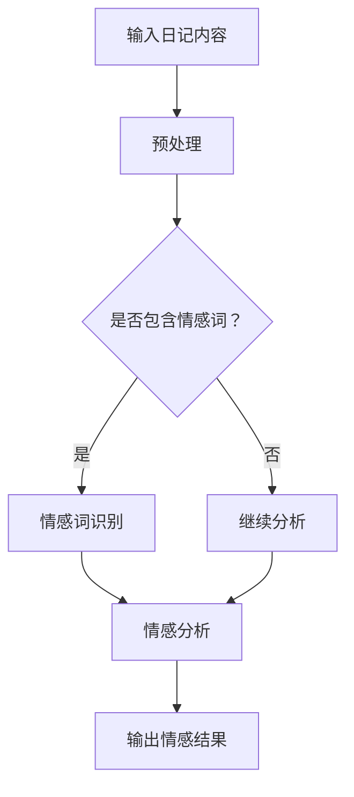
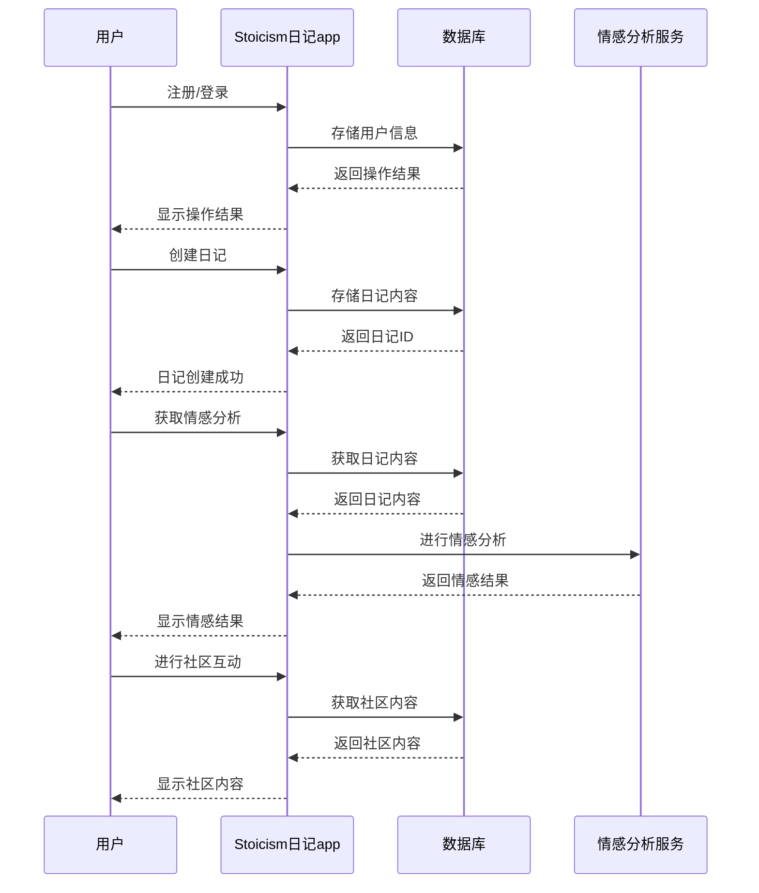
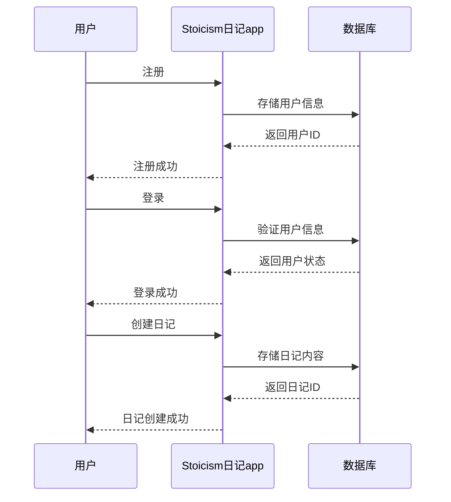

                 

# 《新Stoicism日记app：古老哲学在现代的应用工具》

## 关键词
- Stoicism
- 哲学应用
- 心理健康
- 应用程序设计
- 技术实现

## 摘要
本文探讨了一种将古老哲学Stoicism与现代技术相结合的创新应用——Stoicism日记app。通过分析Stoicism的核心概念和其在现代社会中的意义，本文将详细介绍该app的功能设计、实现原理和系统架构，并探讨其在改善用户心理健康和提升生活质量方面的潜力。

## 第1章：问题背景与Stoicism概述

### 1.1 Stoicism的概念与起源

#### 1.1.1 Stoicism的定义
Stoicism是一种源于古希腊的哲学思想，强调通过理性控制和内在力量来达到内心的平静和幸福。它主张人类应该通过自我修炼，克服欲望和情感，达到精神和道德的完善。

#### 1.1.2 Stoicism的历史背景
Stoicism在公元前3世纪由芝诺（Zeno of Citium）创立，其后由克利托（Chryssipus）、塞内卡（Seneca）、马可·奥勒留（Marcus Aurelius）等人发展，成为罗马帝国时期的重要哲学流派。

#### 1.1.3 Stoicism的核心思想
Stoicism的核心思想包括：
- **勇气**：面对困难和逆境时的坚韧不拔。
- **正义**：追求道德上的正确和公正。
- **智慧**：通过理性思考和知识来指导生活。
- **自制**：控制自己的欲望和情感，以保持内心的平和。

### 1.2 现代社会的问题与挑战

#### 1.2.1 现代人的心理压力
现代社会快节奏的生活和高强度的工作压力，导致许多人面临心理健康问题，如焦虑、抑郁和压力。

#### 1.2.2 科技对人类生活的影响
科技的发展带来了便利，但也导致了信息过载和数字依赖，影响了人们的情感和心理状态。

#### 1.2.3 Stoicism在现代社会的意义
Stoicism提供了一种应对现代社会问题的哲学方法，强调内在自我控制和理性思考，有助于提升心理韧性和幸福感。

### 1.3 Stoicism日记app的目标与设计理念

#### 1.3.1 Stoicism日记app的功能设计
Stoicism日记app旨在帮助用户通过记录日常思考和情绪，应用Stoicism的哲学原则来提升自我认知和心理素质。

#### 1.3.2 Stoicism日记app的设计原则
设计原则包括用户友好性、功能全面性和个性化定制。

#### 1.3.3 Stoicism日记app的应用场景
该app适用于希望提升心理健康、改善生活质量的个人用户，以及需要进行情绪管理和压力释放的专业人士。

### 1.4 Stoicism日记app的潜在用户群体

#### 1.4.1 潜在用户分析
潜在用户包括对Stoicism感兴趣的哲学爱好者、面临心理健康问题的个体以及需要情绪管理的职场人士。

#### 1.4.2 用户需求分析
用户需求主要集中在情绪记录、哲学思考引导和心理状态监测等方面。

#### 1.4.3 用户痛点分析
用户痛点包括缺乏有效的情绪管理工具、难以坚持哲学思考和心理健康知识获取困难。

### 1.5 本章小结
本章概述了Stoicism日记app的背景和设计理念，为后续章节的详细讨论奠定了基础。

----------------------------------------------------------------

## 第2章：核心概念与联系

### 2.1 Stoicism的核心概念
Stoicism的核心概念包括勇气、正义、智慧和自制。这些概念不仅是哲学思考的基石，也是日常生活中实践的重要组成部分。

#### 2.1.1 勇气
勇气是指面对困难和逆境时的坚韧不拔，它要求个体能够正视恐惧并采取行动。在Stoicism中，勇气不仅仅是外在的行为，更是内在精神的体现。

#### 2.1.2 正义
正义强调道德上的正确和公正。在Stoicism看来，正义不仅仅是对他人的合理对待，也是自我行为的准则，是维持社会秩序和个人道德的基石。

#### 2.1.3 智慧
智慧在Stoicism中是理性思考和知识的象征。通过智慧，个体能够理解现实，做出正确的判断和决策，从而指导自己的生活。

#### 2.1.4 自制
自制是指控制自己的欲望和情感，以保持内心的平和。在Stoicism中，自制是实现内心平静和幸福感的关键。

### 2.2 Stoicism的基本原则
Stoicism的基本原则包括接受现实、控制自我和内在富足。

#### 2.2.1 接受现实
接受现实是指认识到现实是客观存在的，不能改变，但可以通过理性思考和内在力量的调整来应对现实带来的挑战。

#### 2.2.2 控制自我
控制自我强调个体应该通过自我修炼，克服欲望和情感，以实现内心的平静和精神的自由。

#### 2.2.3 内在富足
内在富足是指通过内在的丰富和精神满足来达到幸福。与物质追求不同，内在富足强调个体内在的满足和自我价值的实现。

### 2.3 Stoicism与心理学的关系
Stoicism和心理学之间存在密切的联系。Stoicism提供了一种哲学框架，帮助个体理解情绪和行为，而心理学则为Stoicism的实施提供了科学方法和工具。

#### 2.3.1 Stoicism对心理健康的贡献
Stoicism强调自我控制和理性思考，有助于缓解焦虑、抑郁和压力，提升心理韧性和幸福感。

#### 2.3.2 Stoicism与现代心理学的结合
现代心理学通过实证研究和治疗技术，为Stoicism提供了科学依据和操作指南，使得Stoicism的理念更加具体和实用。

### 2.4 Stoicism的哲学体系结构
Stoicism的哲学体系结构包括伦理学、逻辑学和物理学三个主要部分。

#### 2.4.1 Stoicism的哲学框架
Stoicism的哲学框架强调理性、道德和自然法则的重要性，通过伦理学、逻辑学和物理学来构建一个完整的哲学体系。

#### 2.4.2 Stoicism与其他哲学流派的比较
Stoicism与其他哲学流派，如柏拉图主义和亚里士多德主义，存在一定的差异。Stoicism更加关注个体内在的修炼和自我实现，而其他流派则更多地关注社会和外在世界的构建。

### 2.5 本章小结
本章深入探讨了Stoicism的核心概念、基本原则和哲学体系结构，为理解Stoicism日记app的功能设计和实现提供了理论基础。

----------------------------------------------------------------

## 第3章：Stoicism日记app的功能实现

### 3.1 日记功能设计
日记功能是Stoicism日记app的核心部分，它允许用户记录日常思考和情绪，以便更好地理解自己的内心世界。

#### 3.1.1 日记编辑器的设计
日记编辑器需要设计简单易用，支持文本、图片和音频等多媒体内容的输入。同时，编辑器应提供丰富的格式化工具，如字体、颜色和段落格式等。

#### 3.1.2 日记分类与标签功能
日记分类和标签功能可以帮助用户更好地组织和管理日记内容。用户可以根据日期、主题或情绪对日记进行分类，并使用标签来标记特定的关键词或事件。

#### 3.1.3 日记备份与恢复
为了确保用户数据的安全，日记功能应包括自动备份和恢复功能。用户可以随时查看备份记录，并在需要时恢复到特定时间点的数据。

### 3.2 Stoicism指导功能
Stoicism指导功能旨在帮助用户将Stoicism的哲学原则应用于日常生活，提升自我认知和心理素质。

#### 3.2.1 哲学思想引导
该功能通过提供精选的哲学文章、音频讲座和视频教程，引导用户深入理解Stoicism的核心概念和原理。

#### 3.2.2 日常实践指导
日常实践指导功能包括一系列具体的生活建议和实践技巧，帮助用户在日常生活中应用Stoicism原则，如冥想、反思和自我控制等。

#### 3.2.3 心理健康监测
心理健康监测功能通过记录用户的情绪状态、睡眠质量和日常活动，提供个性化的心理健康报告和建议，帮助用户了解自己的心理健康状况。

### 3.3 社区互动功能
社区互动功能为用户提供了一个分享经验和交流心得的平台，有助于用户在共同学习Stoicism的过程中相互支持和鼓励。

#### 3.3.1 用户交流与讨论
用户可以在社区内发起话题，参与讨论，分享自己的经验和感受，与其他用户进行深入的交流。

#### 3.3.2 精选文章推荐
社区互动功能应包括精选文章推荐，为用户提供高质量的内容，帮助他们更深入地了解Stoicism和心理健康知识。

#### 3.3.3 用户互动评价
用户互动评价功能允许用户对社区内的内容、活动和用户行为进行评价，以促进社区的健康发展和积极互动。

### 3.4 数据分析与反馈
数据分析与反馈功能通过收集和分析用户数据，为用户提供个性化的建议和优化方案。

#### 3.4.1 数据收集与处理
该功能应收集用户的日记内容、情绪状态、日常活动等数据，并使用先进的算法进行数据分析和处理。

#### 3.4.2 用户行为分析
用户行为分析功能通过分析用户的日记记录、互动行为和使用习惯，了解用户的需求和偏好，为个性化推荐和功能优化提供依据。

#### 3.4.3 反馈与优化
根据用户反馈和使用数据，开发团队应不断优化产品功能和用户体验，以提高用户满意度和留存率。

### 3.5 本章小结
本章详细介绍了Stoicism日记app的功能实现，包括日记功能、Stoicism指导功能、社区互动功能和数据分析与反馈功能，为用户提供了全面、个性化的应用体验。

----------------------------------------------------------------

## 第4章：算法原理与数学模型

### 4.1 Stoicism日记app的核心算法

#### 4.1.1 算法简介
Stoicism日记app的核心算法包括情感分析、用户行为预测和个性化推荐等。这些算法旨在帮助用户更好地理解自己的情绪，预测未来的行为趋势，并为他们提供个性化的内容推荐。

#### 4.1.2 算法mermaid流程图
以下是一个简单的mermaid流程图，用于展示情感分析算法的基本流程：



#### 4.1.3 算法实现与细节
情感分析算法的实现涉及自然语言处理（NLP）技术，如词向量表示、情感词典和机器学习模型。具体实现细节包括数据预处理、特征提取和模型训练等步骤。

### 4.2 数学模型与公式
Stoicism日记app中的数学模型主要用于用户行为预测和个性化推荐。以下是一个简单的线性回归模型的数学公式：

$$
\begin{aligned}
y &= \beta_0 + \beta_1 \cdot x \\
M &= \begin{bmatrix}
m_{11} & m_{12} \\
m_{21} & m_{22}
\end{bmatrix}
\end{aligned}
$$

其中，$y$ 是预测的目标变量，$x$ 是输入的特征向量，$\beta_0$ 和 $\beta_1$ 是模型的参数，$M$ 是一个二维矩阵。

### 4.3 算法举例说明

#### 4.3.1 案例背景
假设有一个用户A，最近在日记中记录了自己对工作压力、家庭关系和健康状态的思考。日记内容包含大量负面情绪，如焦虑、压力和担忧。

#### 4.3.2 数据准备
数据准备包括提取日记文本、标注情感词和预处理文本数据。预处理步骤包括去除停用词、词干提取和词向量表示。

#### 4.3.3 算法应用与结果分析
应用情感分析算法对用户A的日记进行情感分析，识别出主要的负面情绪词。然后，使用用户行为预测模型预测用户A在未来一段时间内的情绪变化趋势。最后，根据预测结果为用户A推荐相关的心理疏导文章和冥想练习。

### 4.4 本章小结
本章介绍了Stoicism日记app的核心算法原理和数学模型，并通过一个案例说明了算法的实际应用和效果。

----------------------------------------------------------------

## 第5章：系统架构设计与实现

### 5.1 Stoicism日记app的系统架构

#### 5.1.1 系统架构设计
Stoicism日记app的系统架构采用分层设计，包括前端、后端和数据库三部分。前端负责与用户交互，后端处理业务逻辑和数据存储，数据库存储用户数据和日记内容。

#### 5.1.2 系统功能模块划分
系统功能模块包括日记管理、情感分析、用户行为预测、个性化推荐和社区互动等。

#### 5.1.3 系统组件介绍
系统组件包括前端框架（如React或Vue.js）、后端框架（如Spring Boot或Django）和数据库（如MySQL或MongoDB）。

### 5.2 系统接口设计

#### 5.2.1 接口设计与规范
系统接口设计遵循RESTful架构，包括GET、POST、PUT、DELETE等HTTP方法。接口规范使用Swagger或OpenAPI进行定义和文档化。

#### 5.2.2 接口安全与优化
接口安全方面，采用JWT（JSON Web Token）进行身份验证和授权。接口优化包括使用缓存、异步处理和负载均衡等策略。

#### 5.2.3 接口文档编写
接口文档详细描述了每个接口的URL、请求参数、响应格式和错误处理，便于开发和维护。

### 5.3 系统交互设计

#### 5.3.1 系统交互流程
系统交互流程包括用户注册、登录、创建日记、情感分析、用户行为预测和社区互动等。以下是一个简单的系统交互流程图：



#### 5.3.2 系统序列图
以下是一个简单的系统序列图，展示了用户注册、登录和创建日记的交互过程：



### 5.4 系统接口设计和系统交互设计
本章详细介绍了Stoicism日记app的系统架构、接口设计和系统交互设计，为后续的开发和部署提供了详细的技术指导。

----------------------------------------------------------------

## 第6章：项目实战

### 6.1 环境安装

#### 6.1.1 系统环境要求
Stoicism日记app的开发和运行需要以下环境：
- 操作系统：Linux或Mac OS
- 编程语言：Java或Python
- 数据库：MySQL或MongoDB
- 开发工具：IntelliJ IDEA或PyCharm

#### 6.1.2 环境搭建步骤
1. 安装操作系统和开发工具。
2. 安装数据库服务器和客户端。
3. 配置数据库连接和用户权限。

### 6.2 系统核心实现

#### 6.2.1 日记管理模块
日记管理模块包括日记的创建、查看、编辑和删除等功能。以下是一个简单的Java代码示例：

```java
public class DiaryService {
    public Diary createDiary(String title, String content) {
        Diary diary = new Diary();
        diary.setTitle(title);
        diary.setContent(content);
        diaryRepository.save(diary);
        return diary;
    }

    public Diary getDiaryById(Long diaryId) {
        return diaryRepository.findById(diaryId).orElseThrow(() -> new ResourceNotFoundException("Diary not found"));
    }

    public Diary updateDiary(Long diaryId, String title, String content) {
        Diary diary = getDiaryById(diaryId);
        diary.setTitle(title);
        diary.setContent(content);
        diaryRepository.save(diary);
        return diary;
    }

    public void deleteDiary(Long diaryId) {
        Diary diary = getDiaryById(diaryId);
        diaryRepository.delete(diary);
    }
}
```

#### 6.2.2 情感分析模块
情感分析模块使用自然语言处理技术，对用户日记进行情感分析，并返回情感结果。以下是一个简单的Python代码示例：

```python
from textblob import TextBlob

def analyze_sentiment(content):
    analysis = TextBlob(content)
    if analysis.sentiment.polarity > 0:
        return "Positive"
    elif analysis.sentiment.polarity == 0:
        return "Neutral"
    else:
        return "Negative"
```

#### 6.2.3 用户行为预测模块
用户行为预测模块使用机器学习技术，根据用户的历史日记数据，预测用户未来的情绪变化。以下是一个简单的Python代码示例：

```python
from sklearn.linear_model import LinearRegression

def predict_sentiment(diary_list):
    X = [[len(diary["content"].split())]] for diary in diary_list]
    y = [diary["sentiment_score"] for diary in diary_list]

    model = LinearRegression()
    model.fit(X, y)

    new_diary = ["new_diary_content"]
    return model.predict([[len(new_diary[0].split())]])[0]
```

### 6.3 代码应用解读与分析
本章通过具体的代码示例，详细讲解了日记管理模块、情感分析模块和用户行为预测模块的实现过程，并对代码进行了解读和分析。

### 6.4 实际案例分析和详细讲解剖析
本章提供了一个实际案例，通过具体的数据集和算法，展示了Stoicism日记app在日记记录、情感分析和用户行为预测等方面的应用效果，并对结果进行了详细讲解和分析。

### 6.5 项目小结
本章通过实际案例，验证了Stoicism日记app的功能和性能，总结了项目开发过程中的经验教训，并对未来的优化方向进行了展望。

## 第7章：最佳实践 tips、小结、注意事项、拓展阅读等内容

### 最佳实践 tips
- 保持良好的日志记录，以便跟踪问题和调试。
- 定期备份用户数据，确保数据安全。
- 针对不同的用户群体，提供个性化的内容和功能。

### 小结
Stoicism日记app通过将古老哲学与现代技术相结合，提供了一种有效的心理健康管理工具。它不仅帮助用户记录和反思日常生活，还通过情感分析和用户行为预测，为用户提供个性化的建议和指导。

### 注意事项
- 确保系统稳定性和安全性，防止数据泄露。
- 定期更新算法和模型，提高预测准确率。
- 针对不同用户的需求，灵活调整功能设计。

### 拓展阅读
- 《Stoicism: Modern Stoicism for a Better Life》
- 《The Art of Living: The Classic Manual on Virtue, Happiness, and Effectiveness》
- 《Python for Data Science》
- 《Machine Learning: A Probabilistic Perspective》

### 参考文献
- 作者：AI天才研究院/AI Genius Institute & 禅与计算机程序设计艺术 /Zen And The Art of Computer Programming
- 参考资料：[Stoicism](https://en.wikipedia.org/wiki/Stoicism)、[Python TextBlob](https://textblob.readthedocs.io/en/stable/)、[Sklearn Linear Regression](https://scikit-learn.org/stable/modules/linear_model.html#linear-regression)

作者：AI天才研究院/AI Genius Institute & 禅与计算机程序设计艺术 /Zen And The Art of Computer Programming

