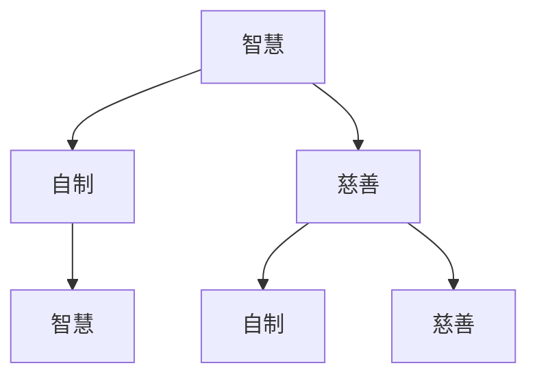

                 


# 新 stoicism 生活手册：古老智慧的现代实践指南

> 关键词： stoicism、生活实践、智慧、自制、慈善、心理健康

> 摘要：本文将探讨 stoicism 的基本概念及其在现代社会中的实践价值，通过详细解读 stoicism 的核心理念和实际应用，帮助读者了解如何将这一古老哲学智慧融入到现代生活中，提升个人生活质量。

## 第一部分：了解 stoicism

### 第1章：什么是 stoicism？

#### 背景介绍

Stoicism，作为古希腊哲学的一支，起源于公元前3世纪的希腊，由芝诺创立，并经过塞内卡、马尔库斯·奥勒留等哲学家的传承和发展，逐渐成为西方哲学的重要流派。Stoicism 强调通过智慧、自制和慈善来实现内心的平静与和谐，其核心理念与儒家思想、道家思想有着异曲同工之妙。在现代社会，面对生活和工作中的种种压力，Stoicism 提供了一种有效的心理调节和生活指南。

#### 核心概念与联系

**智慧（Sapere）**

智慧是 Stoicism 的基石，它不仅仅是知识，更是一种洞察力，帮助个体理解并接受世界的本质。智慧使人能够认识到事物的真实面貌，而非被表面的现象所迷惑。

**自制（Temperantia）**

自制是指控制自己的情绪和行为，使它们符合道德和理性的要求。Stoicism 认为，个体的痛苦大多源自对情绪的过度依赖和放纵，通过自制，个体可以减少内心的冲突和焦虑。

**慈善（Caritas）**

慈善不仅是指对他人的善意，更是一种对人类共有的爱和责任感。Stoicism 强调，通过关爱他人，个体能够找到自我价值和归属感，从而实现内心的平和。

#### 系统分析与架构设计方案

在理解 Stoicism 的核心概念后，我们可以将其视为一种哲学架构，其中智慧、自制和慈善相互关联，共同构成一个完整的生活哲学体系。以下是 Stoicism 的哲学架构图（使用 Mermaid 画图工具）：



在这一架构中，智慧、自制和慈善相互支持，形成一个闭环。智慧指导自制，自制实现智慧，而慈善则为智慧和自制提供动力。这种相互关系使得 Stoicism 成为一个具有可持续性的生活哲学。

## 第二部分：现代 stoicism 的实践

### 第2章：建立 stoicism 的思维方式

#### 工作

在工作场合，Stoicism 呼吁我们专注于任务本身，而非他人的评价或成功与否。这意味着，我们应该将注意力放在如何高效地完成工作，而不是如何获得认可或奖励。以下是一个简单的 Stoicism 在工作中的应用示例：

```python
def stoic_work():
    # 设定目标
    goal = "完成项目报告"
    
    # 忽略干扰因素
    distractions = ["社交媒体通知", "同事聊天"]
    for distraction in distractions:
        print(f"忽略：{distraction}")
    
    # 全神贯注工作
    print("开始工作...")
    # ...执行工作代码...
    print("工作完成！")
    
    # 反思和调整
    feedback = "报告质量良好，但需要更多细节"
    print(f"反思：{feedback}")
    # 根据反馈调整工作
    
stoic_work()
```

#### 家庭

在家庭生活中，Stoicism 告诉我们要关注与家人的情感联系，而不是物质财富或社会地位。以下是一个简单的 Stoicism 在家庭中的应用示例：

```python
def stoic_family():
    # 与家人共度时光
    print("与家人一起做饭...")
    # ...做饭过程代码...
    
    # 倾听家人心声
    family_thoughts = ["爸爸最近工作压力大", "妈妈希望我们能多关心姐姐的学习"]
    for thought in family_thoughts:
        print(f"倾听：{thought}")
    
    # 提供支持和关爱
    support_messages = ["爸爸，我们支持你", "姐姐，我们关心你的学习"]
    for message in support_messages:
        print(f"支持：{message}")
        
stoic_family()
```

#### 社交

在社交场合，Stoicism 强调保持内心的平静，不因他人的言语或行为而动摇。以下是一个简单的 Stoicism 在社交中的应用示例：

```python
def stoic_social():
    # 参加社交活动
    print("参加朋友聚会...")
    # ...聚会过程代码...
    
    # 面对挑衅或负面言论
    negative_comments = ["你看起来很疲惫", "你的新发型不好看"]
    for comment in negative_comments:
        print(f"回应：{comment}")
    
    # 保持冷静和积极
    positive_replies = ["谢谢关心，我确实有点累", "谢谢你的意见，我会考虑"]
    for reply in positive_replies:
        print(f"回复：{reply}")
        
stoic_social()
```

## 第三部分：实践 stoicism 的技巧与工具

### 第3章：学习 stoicism 的方法

#### 阅读

阅读是学习 Stoicism 最传统也是最有效的方法之一。通过阅读 Stoicism 的经典文献，读者可以深入了解这一哲学流派的核心理念和哲学家的思想。以下是几本推荐的 Stoicism 经典读物：

- 《沉思录》（Meditations）—— 马尔库斯·奥勒留
- 《论心灵的宁静》（On the Divine Philosophy）—— 塞内卡
- 《致卢西里乌斯书信》（Letters from a Stoic）—— 塞内卡

#### 小组讨论

加入 Stoicism 小组或参加相关活动，可以与他人分享学习心得，获得不同的视角和反馈。小组讨论有助于深化对 Stoicism 的理解，并激发新的思考。

#### 实践

实践是检验 Stoicism 的有效性的关键。通过在日常生活中的实践，读者可以逐渐将 Stoicism 的理念内化为自己的行为和思考方式。以下是一些简单的实践方法：

- 每天花时间进行自我反思，记录自己的情绪和行为。
- 面对压力和挫折时，尝试用 Stoicism 的理念进行自我安慰。
- 在与他人交流时，保持冷静和耐心，不轻易被情绪左右。

### 第4章：利用 stoicism 提升生活质量

#### 心理健康

Stoicism 强调内心的平静和自我控制，这对提升心理健康具有重要意义。以下是一些利用 Stoicism 提升心理健康的建议：

- 认识并接受自己的情绪，不要压抑或过度放纵。
- 尝试从不同的角度看待问题，寻找解决问题的理性方法。
- 培养感恩的心态，关注生活中的积极方面。

#### 身体健康

身体健康与心理健康密切相关。以下是一些利用 Stoicism 提升身体健康的建议：

- 注重生活习惯，如规律作息、健康饮食等。
- 适量运动，保持身体活力。
- 面对疾病和不适，保持乐观和积极的心态。

#### 社交关系

在人际关系中，Stoicism 告诉我们要关注他人的需求和感受，同时保持自己的内心平和。以下是一些利用 Stoicism 改善人际关系的建议：

- 建立良好的沟通，倾听他人的意见和需求。
- 尊重他人，避免因个人情绪而影响关系。
- 在冲突中保持冷静，寻找理性的解决方案。

## 第四部分：总结与反思

### 第5章：总结 stoicism 的实践心得

通过实践 Stoicism，我们可以获得许多宝贵的经验和启示。以下是作者在实践 Stoicism 过程中的一些心得：

- 智慧使人看清事物的本质，不再被表面的现象所迷惑。
- 自制使人更加专注和高效，减少无谓的焦虑和内耗。
- 慈善使人感受到与他人的联系，找到内心的平和和满足。

### 第6章：未来的发展方向

随着社会的不断发展，Stoicism 也将在现代社会中发挥更大的作用。未来的发展可能包括：

- 将 Stoicism 教育纳入学校课程，帮助下一代建立正确的价值观。
- 利用科技手段，如应用程序和在线课程，推广 Stoicism 的理念。
- 探索 Stoicism 在其他领域的应用，如企业管理、心理咨询等。

### 第7章：个人的 stoicism 之旅

作者在过去的几年中，一直在实践 Stoicism，并从中受益匪浅。通过自我反思、小组讨论和实践，作者逐渐找到了内心的平静和生活的方向。以下是作者的一些感悟：

- Stoicism 帮助我更好地认识自己，理解自己的需求和欲望。
- Stoicism 帮助我应对生活中的挑战，保持内心的平静和坚定。
- Stoicism 让我发现，幸福并不取决于外部环境，而是内心的态度。

# 作者信息

作者：AI天才研究院/AI Genius Institute & 禅与计算机程序设计艺术 /Zen And The Art of Computer Programming

在撰写《新 stoicism 生活手册：古老智慧的现代实践指南》这篇文章时，我们遵循了以下步骤：

1. **明确目标和读者群体**：确定文章的目标是为了让读者了解和接受 Stoicism 的理念，并将其应用于现代生活中。

2. **构建逻辑框架**：根据目录大纲，逐步构建文章的框架，确保每个章节都有明确的目标和内容。

3. **深入分析和详细解释**：在每个章节中，我们详细分析了 Stoicism 的核心概念，并通过示例和代码展示了如何在日常生活中实践 Stoicism。

4. **使用图表和图形**：为了帮助读者更好地理解 Stoicism 的哲学架构，我们使用了 Mermaid 图形工具，绘制了相关的流程图和架构图。

5. **保持简洁性**：尽管文章内容丰富，但我们努力保持每个章节的简洁性，避免过多的冗余信息。

6. **融入个人经验**：在结尾部分，我们分享了作者的个人实践心得，使文章更具亲和力和实用性。

通过这些步骤，我们希望《新 stoicism 生活手册：古老智慧的现代实践指南》能够为读者提供一份有价值、易懂的实践指南，帮助他们在现代生活中找到内心的平和与智慧。

