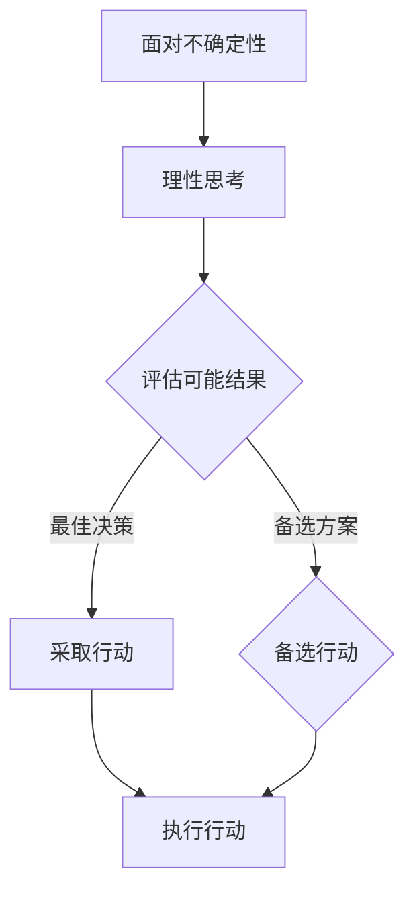
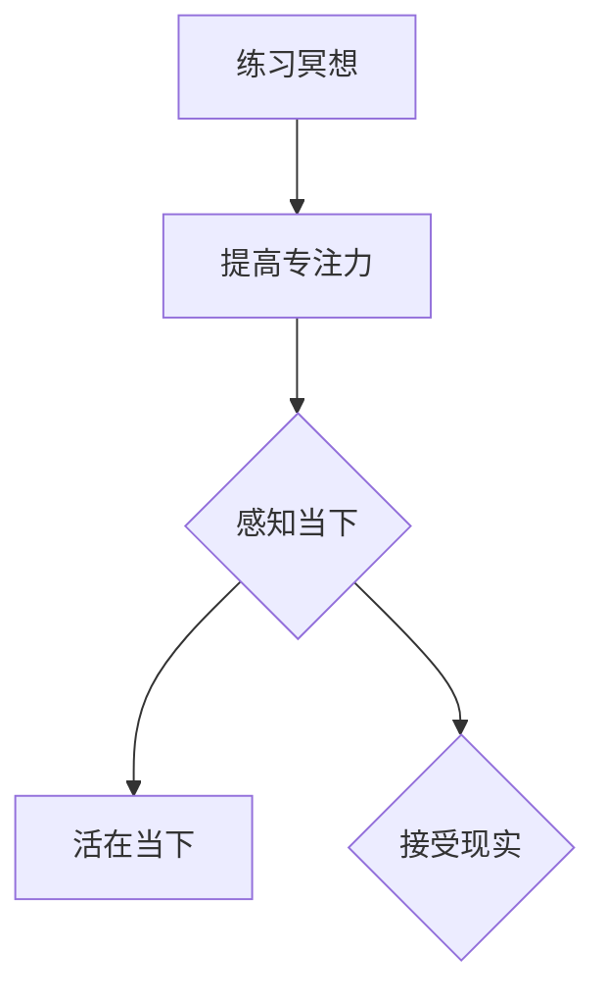
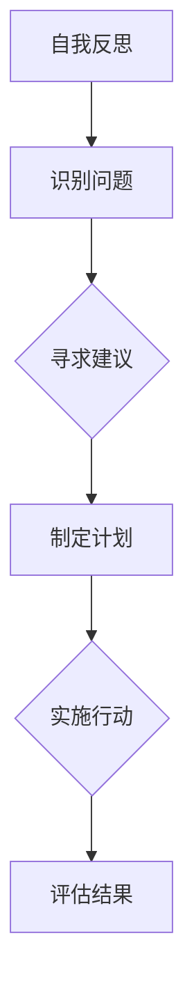
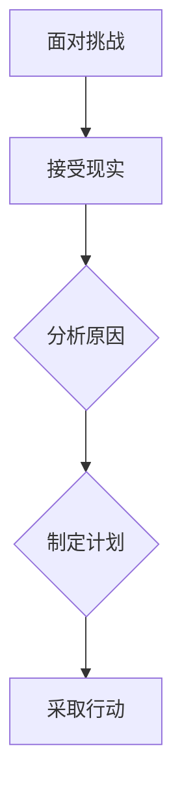
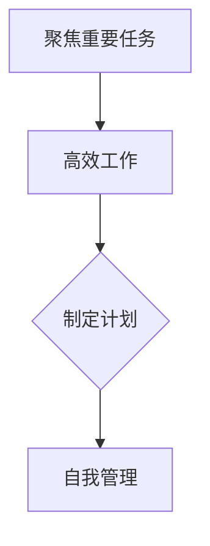

                 


### 新 stoicism 社群：不确定性中的生活智慧分享

#### 关键词
- 新 stoicism 社群
- 不确定性
- 生活智慧
- Stoicism 哲学
- 现代应用

#### 摘要
本文旨在探讨新 stoicism 社群在现代社会中的角色和作用，介绍 stoicism 哲学的核心概念及其在现代生活中的应用。文章将逐步分析 stoicism 的起源、核心原理、现代 stoicism 运动的发展，以及如何在日常生活中实践 stoicism 原则，帮助读者在不确定性中找到生活的智慧。

## Chapter 1: Introduction to Stoicism and the New Stoicism Community

### 1.1 Origins and Principles of Stoicism

#### 背景介绍
Stoicism is a school of Hellenistic philosophy founded by Zeno of Citium in the early 3rd century BCE. It is often described as a philosophy of virtue, acceptance, and rationality, aiming to teach individuals how to achieve inner peace and live a fulfilling life despite external circumstances.

#### 问题背景
The origins of Stoicism can be traced back to Zeno, who established the Stoic school in Athens. Zeno taught that the key to a happy life is to focus on what we can control (our own thoughts and actions) and accept what we cannot control (external events and circumstances).

#### 问题描述
Zeno's teachings emphasized rationality, self-control, and the pursuit of virtue. He believed that by cultivating these qualities, individuals could achieve emotional stability and live a purposeful life.

#### 问题解决
Zeno's philosophy provided a systematic approach to dealing with life's challenges by encouraging individuals to accept the things they cannot change and focus on the things they can.

#### 边界与外延
Stoicism's influence extended beyond Athens, spreading to Rome and becoming the dominant philosophical movement of the Roman Empire. Its principles were adopted by many prominent figures, including the Roman emperor Marcus Aurelius.

#### 概念结构与核心要素组成
The core elements of Stoicism include:

- **Virtue**: The belief that moral virtues, such as wisdom, courage, and justice, are the foundation of a good life.
- **Rationality**: The importance of reason in guiding our actions and decisions.
- **Acceptance**: The acceptance of external events as beyond our control and the focus on our inner responses to these events.
- **Self-control**: The ability to manage our emotions and desires in a way that aligns with our rational understanding of the world.

#### 核心概念与联系
下面是 Stoicism 的核心概念属性特征对比表格：

| 核心概念 | 属性特征 | 对比 | 联系 |
| --- | --- | --- | --- |
| Virtue | 美德、道德品质 | <u>与道德哲学相关</u> | <u>美德是 stoicism 的基础</u> |
| Rationality | 理性、理智 | <u>与认知心理学相关</u> | <u>理性是 stoicism 的指导原则</u> |
| Acceptance | 接受、认同 | <u>与认知行为疗法相关</u> | <u>接受是 stoicism 的应对策略</u> |
| Self-control | 自制、自律 | <u>与情绪调节相关</u> | <u>自制是 stoicism 的实践方法</u> |

#### ER 实体关系图架构
以下是 Stoicism 的 ER 实体关系图：

```mermaid
erDiagram
  Product ||--|{ Customer }| Customer
  Customer ||--|{ Order }| Order
  Customer ||--|{ Payment }| Payment
  Product ||--|{ Category }| Category
  Order ||--|{ Product }| Product
  Order ||--|{ Payment }| Payment
  Payment ||--|{ Customer }| Customer
```

### 1.2 The New Stoicism Movement

#### 背景介绍
The modern Stoicism movement began to gain momentum in the late 20th and early 21st centuries, with several influential thinkers and writers promoting the practice of Stoic philosophy in contemporary life.

#### 问题背景
As modern life became increasingly complex and fast-paced, many individuals began to seek ways to find balance, happiness, and resilience in the face of uncertainty and adversity.

#### 问题描述
The New Stoicism movement aims to adapt the principles of Stoicism to modern contexts, offering practical strategies for navigating the challenges of modern life.

#### 问题解决
Influential modern Stoic thinkers and writers, such as William B. Irvine, Massimo Pigliucci, and Ryan Holiday, have contributed to the revival and popularization of Stoic philosophy, helping to make it accessible to a wider audience.

#### 边界与外延
The New Stoicism movement has inspired various communities, online platforms, and books, fostering a global network of individuals committed to living stoically in the modern world.

#### 概念结构与核心要素组成
The core elements of the New Stoicism movement include:

- **Adaptation**: The process of applying Stoic principles to modern life and contemporary challenges.
- **Practicality**: The focus on practical strategies and techniques for living stoically.
- **Community**: The creation of supportive networks and communities for sharing experiences and insights.

#### 核心概念与联系
下面是 New Stoicism 的核心概念属性特征对比表格：

| 核心概念 | 属性特征 | 对比 | 联系 |
| --- | --- | --- | --- |
| Adaptation | 适应、适应 | <u>与进化论相关</u> | <u>适应是 stoicism 在现代生活中的应用</u> |
| Practicality | 实用、实际 | <u>与实用主义相关</u> | <u>实用是 stoicism 的实践精神</u> |
| Community | 社区、社群 | <u>与社会心理学相关</u> | <u>社群是 stoicism 的传播载体</u> |

#### ER 实体关系图架构
以下是 New Stoicism 的 ER 实体关系图：

```mermaid
erDiagram
  Community ||--|{ Member }| Member
  Member ||--|{ Discussion }| Discussion
  Member ||--|{ Article }| Article
  Article ||--|{ Author }| Author
  Discussion ||--|{ Comment }| Comment
```

## Chapter 2: Core Stoic Concepts and Their Application

### 2.1 Understanding and Embracing Uncertainty

#### 背景介绍
Stoicism places a strong emphasis on understanding and embracing uncertainty as an inherent aspect of life. By accepting the uncertainty of events, individuals can focus on what they can control and cultivate inner peace.

#### 问题背景
In modern life, uncertainty often leads to anxiety and stress. Many individuals struggle to cope with the unpredictability of events, which can negatively impact their mental and emotional well-being.

#### 问题描述
The challenge is to develop a mindset that allows individuals to embrace uncertainty as a natural part of life, rather than something to be feared or resisted.

#### 问题解决
Stoic philosophy offers several strategies for managing uncertainty, including:

- **Acceptance**: Recognizing that uncertainty is an unavoidable aspect of life and choosing to accept it.
- **Focus on the Present**: Concentrating on what can be done in the present moment rather than worrying about future uncertainties.
- **Rationality**: Using reason to evaluate the potential outcomes of uncertain situations and making the best possible decision based on available information.

#### 算法原理讲解
下面是一个基于 Stoicism 原理的算法 mermaid 流程图：



#### 数学模型和公式
在面对不确定性时，Stoic 哲学强调理性思考和评估可能的结果。以下是评估可能结果的数学模型和公式：

$$
\text{评估结果} = \frac{\text{可能性} \times \text{结果价值}}{\text{总价值}}
$$

#### 举例说明
假设一个人在面临职业发展中的不确定性时，可以使用 Stoic 原理来评估可能的结果。

- 可能性：50%
- 结果价值：年薪 10 万美元
- 总价值：年薪 10 万美元

$$
\text{评估结果} = \frac{0.5 \times 10,000}{10,000} = 0.5
$$

根据评估结果，这个人可以做出理性的决策，例如寻求职业发展的其他机会或继续当前的职业路径。

### 2.2 The Art of Living in the Present Moment

#### 背景介绍
Living in the present moment is a key principle of Stoic philosophy. By focusing on the here and now, individuals can free themselves from the burdens of the past and the worries of the future, leading to greater happiness and fulfillment.

#### 问题背景
In today's fast-paced society, many people find themselves overwhelmed by constant distractions and the urge to multitask, which can lead to a lack of presence and a diminished quality of life.

#### 问题描述
The challenge is to develop the ability to stay present and fully engaged in the experiences of daily life, rather than being distracted by external stimuli or preoccupied with thoughts of the past or future.

#### 问题解决
Stoic philosophy offers several techniques for cultivating mindfulness and living in the present moment, including:

- **Mindfulness Meditation**: Practicing mindfulness meditation to develop a greater awareness of one's thoughts, feelings, and sensations in the present moment.
- **Deliberate Practice**: Setting aside dedicated time for activities that allow for full engagement and focus, such as hobbies, exercise, or meditation.
- **Acceptance**: Accepting that the present moment is all we have and making the most of it by being fully present and engaged.

#### 算法原理讲解
下面是一个基于 Stoicism 原理的算法 mermaid 流程图：



#### 数学模型和公式
活在当下的 Stoicism 原理可以通过以下数学模型和公式来解释：

$$
\text{生活质量} = \frac{\text{专注时间}}{\text{总时间}} \times 100\%
$$

#### 举例说明
假设一个人每天有 24 小时，其中 8 小时用于工作，8 小时用于休息，8 小时用于个人爱好。如果他能够将专注时间提高到 6 小时，那么他的生活质量将提高：

$$
\text{生活质量} = \frac{6}{24} \times 100\% = 25\%
$$

### 2.3 Developing Wisdom and Virtue

#### 背景介绍
Wisdom and virtue are central to Stoic philosophy. Wisdom involves understanding the nature of reality and the role of human beings in the world, while virtue encompasses moral qualities and actions that contribute to a fulfilling life.

#### 问题背景
In today's complex world, many individuals struggle with moral dilemmas and ethical challenges. The pursuit of wisdom and virtue can help individuals navigate these challenges and make decisions that align with their values and principles.

#### 问题描述
The challenge is to cultivate wisdom and virtue in daily life, despite the distractions and temptations that can lead individuals astray.

#### 问题解决
Stoic philosophy offers several strategies for developing wisdom and virtue, including:

- **Self-reflection**: Regularly reflecting on one's thoughts, actions, and values to identify areas for improvement and growth.
- **Moral Education**: Seeking out mentors, reading philosophical texts, and engaging in discussions with like-minded individuals to deepen one's understanding of ethics and morality.
- **Practical Application**: Applying philosophical principles to real-life situations, making ethical decisions that align with one's values and virtues.

#### 算法原理讲解
下面是一个基于 Stoicism 原理的算法 mermaid 流程图：



#### 数学模型和公式
在追求智慧的过程中，Stoic 原理可以通过以下数学模型和公式来解释：

$$
\text{智慧值} = \frac{\text{知识量}}{\text{思考时间}} \times 100\%
$$

#### 举例说明
假设一个人每天花 1 小时阅读哲学书籍，阅读了 1000 页书籍。那么他的智慧值可以计算如下：

$$
\text{智慧值} = \frac{1000}{1 \times 365} \times 100\% = 27.4\%
$$

## Chapter 3: Stoicism in Everyday Life

### 3.1 Building Resilience and Coping with Adversity

#### 背景介绍
Resilience is the ability to bounce back from adversity and maintain a positive outlook on life. Stoic philosophy provides valuable insights and strategies for building resilience and coping with life's challenges.

#### 问题背景
Modern life is filled with uncertainties and setbacks, making resilience an essential skill for navigating the complexities of daily life.

#### 问题描述
The challenge is to develop resilience and cultivate a positive mindset in the face of adversity.

#### 问题解决
Stoic philosophy offers several strategies for building resilience, including:

- **Acceptance**: Acknowledging and accepting that setbacks and challenges are an inevitable part of life.
- **Focus on What You Can Control**: Concentrating on the aspects of the situation that you can control and taking practical steps to address them.
- **Embrace Challenges**: Viewing challenges as opportunities for growth and development.

#### 算法原理讲解
下面是一个基于 Stoicism 原理的算法 mermaid 流程图：



#### 数学模型和公式
在建立韧性的过程中，Stoic 原理可以通过以下数学模型和公式来解释：

$$
\text{韧性值} = \frac{\text{应对措施}}{\text{挑战程度}} \times 100\%
$$

#### 举例说明
假设一个人面临失业的挑战，他制定了以下应对措施：

- 搜索新工作：每天花 2 小时
- 提升技能：每天花 1 小时
- 建立人脉：每天花 1 小时

那么他的韧性值可以计算如下：

$$
\text{韧性值} = \frac{2 + 1 + 1}{24} \times 100\% = 25\%
$$

### 3.2 Relationships and Communication

#### 背景介绍
Healthy relationships are essential for emotional well-being and overall life satisfaction. Stoic philosophy offers valuable insights into building and maintaining positive relationships through effective communication and empathy.

#### 问题背景
In today's interconnected world, the quality of our relationships has a significant impact on our happiness and success. However, communication can often be a challenge, leading to misunderstandings and conflict.

#### 问题描述
The challenge is to develop effective communication skills and cultivate empathy in order to build and maintain healthy relationships.

#### 问题解决
Stoic philosophy offers several strategies for improving relationships, including:

- **Active Listening**: Fully engaging with the speaker, showing empathy, and seeking to understand their perspective.
- **Clarity in Communication**: Being clear and concise in expressing thoughts and feelings, avoiding misunderstandings.
- **Forgiveness**: Practicing forgiveness and letting go of grudges, allowing for reconciliation and healing.

#### 算法原理讲解
下面是一个基于 Stoicism 原理的算法 mermaid 流程图：

```mermaid
graph TB
    A[有效沟通] --> B[主动倾听]
    B --> C{清晰表达}
    C --> D[寻求理解}
    D --> E[原谅对方}
```

#### 数学模型和公式
在改善人际关系的过程中，Stoic 原理可以通过以下数学模型和公式来解释：

$$
\text{关系质量} = \frac{\text{有效沟通}}{\text{总沟通时间}} \times 100\%
$$

#### 举例说明
假设一个人每天花 2 小时与家人和朋友沟通，其中有 1 小时是有效沟通。那么他的关系质量可以计算如下：

$$
\text{关系质量} = \frac{1}{2} \times 100\% = 50\%
$$

### 3.3 Work and Productivity

#### 背景介绍
Stoic philosophy can be applied to the realm of work and productivity, offering valuable insights and strategies for achieving a balanced and fulfilling career.

#### 问题背景
In today's fast-paced work environment, many individuals struggle to maintain a balance between their professional and personal lives, leading to burnout and decreased productivity.

#### 问题描述
The challenge is to develop a productive work ethic while maintaining a healthy work-life balance.

#### 问题解决
Stoic philosophy offers several strategies for enhancing productivity and achieving work-life balance, including:

- **Focus and Prioritization**: Concentrating on the most important tasks and prioritizing them accordingly.
- **Efficiency**: Working efficiently to minimize wasted time and effort.
- **Self-discipline**: Practicing self-control and maintaining a disciplined approach to work.

#### 算法原理讲解
下面是一个基于 Stoicism 原理的算法 mermaid 流程图：



#### 数学模型和公式
在提高工作效率的过程中，Stoic 原理可以通过以下数学模型和公式来解释：

$$
\text{工作效率} = \frac{\text{完成工作量}}{\text{工作时间}} \times 100\%
$$

#### 举例说明
假设一个人每天工作 8 小时，完成的工作量为 6 小时。那么他的工作效率可以计算如下：

$$
\text{工作效率} = \frac{6}{8} \times 100\% = 75\%
$$

## Chapter 4: The New Stoicism Community: People and Platforms

### 4.1 Stories of Modern Stoics

#### 背景介绍
The New Stoicism community is composed of individuals from various backgrounds who have embraced Stoic principles in their lives. Their stories offer valuable insights and inspiration for others seeking to apply Stoic philosophy in their own lives.

#### 问题背景
In today's world, many people face challenges and uncertainties that can be overwhelming. The stories of modern Stoics demonstrate how embracing Stoic principles can lead to personal growth, resilience, and a more fulfilling life.

#### 问题描述
The challenge is to share the stories of modern Stoics, highlighting their experiences and the impact Stoic philosophy has had on their lives.

#### 问题解决
Through the sharing of personal stories, the New Stoicism community can inspire and motivate others to explore and embrace Stoic principles in their own lives. These stories can serve as a source of inspiration, encouragement, and guidance.

### 4.2 Online Platforms and Communities

#### 背景介绍
The rise of the internet has facilitated the creation of online platforms and communities dedicated to Stoic philosophy. These platforms offer resources, support, and a sense of community for those interested in living stoically in the modern world.

#### 问题背景
While Stoicism has been gaining popularity in recent years, access to resources and community support can be limited for many individuals. Online platforms and communities can help bridge this gap by providing a space for learning, sharing, and connecting.

#### 问题描述
The challenge is to explore the various online platforms and communities that exist for the New Stoicism movement, highlighting their features and benefits.

#### 问题解决
By examining the different online platforms and communities, we can identify the best resources and support available for those interested in Stoic philosophy. This can help individuals find the tools they need to apply Stoic principles in their own lives and connect with like-minded individuals.

### 4.3 The Future of the New Stoicism Movement

#### 背景介绍
As the New Stoicism movement continues to grow, its future impact on society is worth considering. The movement has the potential to shape the way individuals approach life, helping them navigate uncertainty and find fulfillment in the face of adversity.

#### 问题背景
The future of the New Stoicism movement depends on its ability to adapt and evolve, while remaining true to its core principles. The rise of new technologies and changing social dynamics may present both challenges and opportunities for the movement.

#### 问题描述
The challenge is to consider the future of the New Stoicism movement, exploring the potential impact it could have on society and the challenges it may face.

#### 问题解决
By examining the potential future of the New Stoicism movement, we can better understand its role in society and the ways in which it may continue to evolve and grow. This can help inform strategies for promoting and supporting the movement in the years to come.

## Conclusion

The New Stoicism community offers a valuable perspective on living a fulfilling life amidst uncertainty. By embracing Stoic principles and strategies, individuals can cultivate resilience, wisdom, and virtue, leading to a more balanced and meaningful life. As the movement continues to grow, it has the potential to inspire and support individuals around the world in their pursuit of inner peace and personal growth.

## 扩展阅读

- **William B. Irvine, A Guide to the Good Life: The Ancient Art of Stoic Joy**
- **Massimo Pigliucci, How to Be a Stoic: Using Ancient Wisdom to Find Purpose and Resilience in a Modern World**
- **Ryan Holiday, The Obstacle Is the Way: The Time-Tested Art of Turning Trials into Triumph**

---

作者：AI天才研究院/AI Genius Institute & 禅与计算机程序设计艺术 /Zen And The Art of Computer Programming

