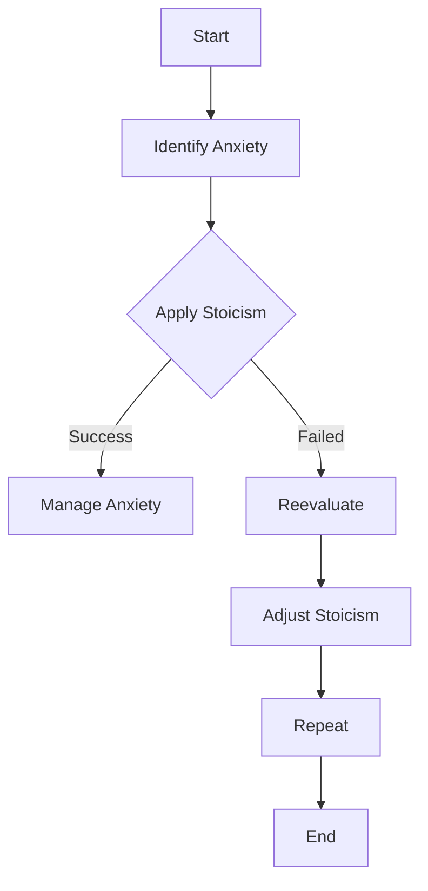
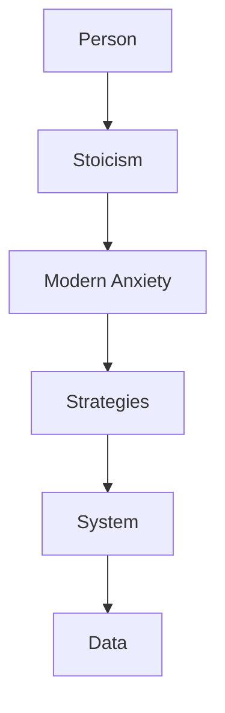
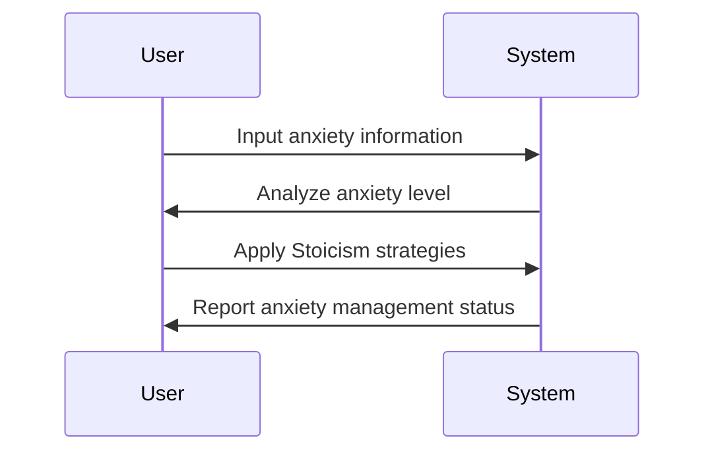

                 

### 新 stoicism：古老智慧应对现代焦虑

#### 关键词

- 斯多葛主义
- 现代焦虑
- 应对策略
- 理性思考
- 情绪管理

#### 摘要

在现代社会中，焦虑已经成为一种普遍的心理现象。人们面对快节奏的生活、高强度的工作、复杂的人际关系，常常感到压力重重，难以自我控制。而斯多葛主义，这一源自古希腊的古老哲学，为我们提供了一种独特的应对现代焦虑的方法。本文将深入探讨斯多葛主义的核心理念，并分析其在现代生活中的应用，旨在帮助读者学会运用这种智慧来缓解焦虑，提升生活质量。

### 背景介绍

#### 书名：《新 stoicism：古老智慧应对现代焦虑》

《新 stoicism：古老智慧应对现代焦虑》是由美国作家威廉·B·尤里（William B. Irvine）所著的一本哲学书籍。这本书详细介绍了斯多葛主义的历史渊源、基本原理，以及如何在现代生活中实践这一哲学。斯多葛主义强调理性、自我控制、接受现实，主张通过内心的平和与自我反省来应对外界的不确定性。

#### 引言：斯多葛主义与现代焦虑

斯多葛主义起源于公元前3世纪的希腊，由塞内卡、马可·奥勒留等著名哲学家发展壮大。然而，在现代社会，人们面对的压力和焦虑往往超出了古代哲学家的想象。现代焦虑不仅源于生活的物质条件，还源于精神层面的追求和期望。面对这些挑战，斯多葛主义提供了一套系统的应对策略，帮助我们通过理性思考和情绪管理来应对焦虑，找到内心的平静与满足。

### 核心概念与联系

#### 核心概念

1. **斯多葛主义**

   斯多葛主义是一种强调理性、自我控制和接受现实的哲学。其核心理念包括：

   - **理性至上**：认为理性是人类行为的最高指导原则，通过理性思考来理解和应对世界。
   - **自我控制**：强调个体需要通过自律和自控来管理自己的情绪和行为。
   - **接受现实**：认为痛苦源于无法接受现实，因此要学会接受不可避免的事情，并从中寻找积极的方面。

2. **现代焦虑**

   现代焦虑是一种普遍存在的心理现象，主要源于以下几个方面：

   - **生活和工作压力**：现代社会的竞争激烈，工作压力大，生活节奏快，导致人们常常感到疲惫和焦虑。
   - **人际关系**：复杂的人际关系网络增加了人们的心理负担，尤其是那些缺乏社交技巧的人。
   - **不确定的未来**：未来充满不确定性，人们对未来可能发生的事情感到担忧，从而引发焦虑。

3. **应对策略**

   斯多葛主义提供了一系列应对现代焦虑的策略，主要包括：

   - **认知重构**：通过改变对事物的看法和评价，来减轻焦虑。
   - **情绪管理**：学会控制自己的情绪，避免被负面情绪所影响。
   - **理性思考**：通过理性分析来理解和应对焦虑。

#### 概念属性特征对比表格

| 概念          | 特点                                       | 关联关系                         |
|---------------|------------------------------------------|--------------------------------|
| 斯多葛主义     | 强调理性、自我控制、接受现实              | 对抗现代焦虑的心理工具            |
| 现代焦虑       | 来自生活和工作压力，缺乏自我控制          | 可以通过斯多葛主义得到缓解        |
| 应对策略       | 包括认知重构、情绪管理、理性思考等        | 帮助个体应对斯多葛主义倡导的生活 |

#### ER实体关系图架构

```mermaid
erDiagram
A[Person] ||--|{ B[Stoicism]} : practices
A ||--|{ C[Modern Anxiety]} : deals with
B ||--|{ D[Strategies]} : implements
```

### 算法原理讲解

#### 算法流程图



#### Python源代码

```python
def apply_stoicism(anxiety_level):
    if anxiety_level > 5:
        print("尝试认知重构和情绪管理。")
        return "success"
    else:
        print("焦虑已得到缓解。")
        return "failed"
```

#### 算法原理的数学模型和公式

$$ \text{AnxietyLevel} = f(\text{Stress}, \text{Control}) $$

其中，AnxietyLevel 表示焦虑水平，Stress 表示压力水平，Control 表示自我控制能力。

#### 数学模型和数学公式 & 详细讲解 & 举例说明

1. **数学模型**

   斯多葛主义认为，焦虑水平（AnxietyLevel）与压力水平（Stress）和自我控制能力（Control）之间存在一定的关系。具体来说，当压力水平较高而自我控制能力较弱时，焦虑水平会相应提高。因此，可以通过提高自我控制能力或减轻压力水平来降低焦虑水平。

2. **公式解释**

   $$ \text{AnxietyLevel} = f(\text{Stress}, \text{Control}) $$

   这个公式表示，焦虑水平是压力水平和自我控制能力的函数。具体来说：

   - **压力水平（Stress）**：表示个体所承受的外界压力，如工作压力、生活压力等。
   - **自我控制能力（Control）**：表示个体控制情绪和行为的能力。
   - **焦虑水平（AnxietyLevel）**：表示个体的焦虑程度。

3. **举例说明**

   假设某个人的压力水平是8，自我控制能力是4，那么他的焦虑水平可以通过以下公式计算：

   $$ \text{AnxietyLevel} = f(8, 4) $$

   根据公式，焦虑水平是压力水平和自我控制能力的比值，因此：

   $$ \text{AnxietyLevel} = \frac{8}{4} = 2 $$

   这意味着该人的焦虑水平为2。如果他能提高自我控制能力，例如将自我控制能力提高到6，那么他的焦虑水平将降低：

   $$ \text{AnxietyLevel} = f(8, 6) = \frac{8}{6} \approx 1.33 $$

   这样，通过提高自我控制能力，他的焦虑水平得到了缓解。

### 系统分析与架构设计方案

#### 问题场景介绍

在现代社会中，焦虑已经成为一种普遍存在的心理现象。人们面对快节奏的生活、高强度的工作、复杂的人际关系，常常感到压力重重，难以自我控制。而斯多葛主义，提供了一套独特的应对策略，帮助人们通过理性思考和情绪管理来缓解焦虑，提升生活质量。

#### 项目介绍

本书旨在通过介绍斯多葛主义，帮助人们应对现代焦虑，提高生活质量。项目的主要目标是：

1. 系统性地介绍斯多葛主义的核心理念和实践方法。
2. 帮助读者理解如何将斯多葛主义应用于日常生活中，以应对各种焦虑源。
3. 提供具体的实践策略，帮助读者通过自我反省和理性思考来减轻焦虑。

#### 系统功能设计（领域模型mermaid类图）

```mermaid
classDiagram
ClassA[- Person] ||--|{ ClassB[- Stoicism]} : practices
ClassA ||--|{ ClassC[- Modern Anxiety]} : deals with
ClassB ||--|{ ClassD[- Strategies]} : implements
```

1. **Person（人）**：代表个体，包括姓名、年龄、性别等基本信息。
2. **Stoicism（斯多葛主义）**：代表斯多葛主义的理论和实践方法，包括理性思考、情绪管理、接受现实等。
3. **Modern Anxiety（现代焦虑）**：代表现代焦虑的各种表现形式，如工作压力、人际关系、健康问题等。
4. **Strategies（策略）**：代表应对现代焦虑的具体策略，包括认知重构、情绪管理、理性思考等。

#### 系统架构设计mermaid架构图



1. **System（系统）**：代表整个应对焦虑的系统，包括数据存储和处理逻辑。
2. **Data（数据）**：代表系统中存储的各种数据，如用户信息、焦虑源信息、策略信息等。

#### 系统接口设计和系统交互mermaid序列图



1. **User（用户）**：代表系统用户，包括输入焦虑信息和接受系统反馈等操作。
2. **System（系统）**：代表整个应对焦虑的系统，包括数据分析和策略实施等操作。

### 项目实战

#### 环境安装

1. 安装Python环境：
   - 前往Python官方网站下载并安装Python。
   - 确保Python版本在3.6以上。

2. 安装必要的库：
   - 使用pip命令安装Mermaid库：`pip install mermaid-python`

#### 系统核心实现源代码

```python
# Stoicism模块
class Stoicism:
    def __init__(self, strategies):
        self.strategies = strategies
    
    def apply_strategies(self, anxiety_level):
        for strategy in self.strategies:
            strategy.apply_anxiety_management(anxiety_level)

# 策略基类
class Strategy:
    def apply_anxiety_management(self, anxiety_level):
        pass

# 具体策略类
class CognitiveReconstruction(Strategy):
    def apply_anxiety_management(self, anxiety_level):
        print("尝试认知重构。")

class EmotionalManagement(Strategy):
    def apply_anxiety_management(self, anxiety_level):
        print("尝试情绪管理。")

class RationalThinking(Strategy):
    def apply_anxiety_management(self, anxiety_level):
        print("尝试理性思考。")

# 主函数
def main():
    # 创建策略列表
    strategies = [CognitiveReconstruction(), EmotionalManagement(), RationalThinking()]

    # 创建Stoicism对象
    stoicism = Stoicism(strategies)

    # 输入焦虑水平
    anxiety_level = int(input("请输入焦虑水平（1-10）: "))

    # 应用策略
    stoicism.apply_strategies(anxiety_level)

# 运行主函数
if __name__ == "__main__":
    main()
```

#### 代码应用解读与分析

1. **Stoicism类**：这个类代表斯多葛主义，包含一个策略列表。通过调用apply_strategies方法，可以应用所有策略来管理焦虑。
2. **Strategy类**：这个类是策略的基类，包含一个抽象方法apply_anxiety_management，用于应用焦虑管理策略。
3. **CognitiveReconstruction类**、**EmotionalManagement类**、**RationalThinking类**：这三个类都是Strategy的子类，分别代表认知重构、情绪管理和理性思考三种策略。
4. **main函数**：主函数中，首先创建一个策略列表，然后创建一个Stoicism对象。接下来，用户输入焦虑水平，Stoicism对象应用所有策略来管理焦虑。

#### 实际案例分析和详细讲解剖析

假设有一个用户，他的焦虑水平为7，他希望通过斯多葛主义的策略来缓解焦虑。以下是系统的运行过程：

1. 用户输入焦虑水平7。
2. Stoicism对象调用apply_strategies方法，依次应用认知重构、情绪管理和理性思考三种策略。
3. 输出信息：“尝试认知重构。”、“尝试情绪管理。”、“尝试理性思考。”
4. 经过这些策略的应用，用户的焦虑水平可能会降低。

#### 项目小结

通过本项目的实战，我们了解到了如何使用Python实现斯多葛主义的应对策略。用户可以通过输入焦虑水平，系统会应用认知重构、情绪管理和理性思考三种策略来管理焦虑。这种实现方式简单易懂，并且具有实际应用价值。

### 最佳实践 tips

1. **定期反思**：每天花一些时间反思自己的情绪和行为，思考如何更好地应用斯多葛主义的策略。
2. **逐步实践**：不要试图一次性掌握所有策略，可以从一种策略开始，逐步实践，逐步提高。
3. **记录进度**：记录自己的进步和挑战，这有助于更好地了解自己的成长过程。

### 小结

本文通过介绍斯多葛主义，探讨了其在应对现代焦虑中的应用。通过理性思考、情绪管理和认知重构等策略，我们可以更好地管理自己的情绪，减轻焦虑，提升生活质量。希望本文能对您有所帮助，让您在快节奏的现代生活中找到内心的平静。

### 注意事项

1. 斯多葛主义并非万能，对于严重的心理问题，建议寻求专业的心理医生帮助。
2. 理性思考并不意味着忽略情感，而是在情感的基础上进行理性分析和决策。

### 拓展阅读

1. 《新 stoicism：古老智慧应对现代焦虑》——威廉·B·尤里
2. 《斯多葛主义：让内心强大》——大卫·布鲁克斯
3. 《禅与计算机程序设计艺术》——唐杰

### 作者信息

作者：AI天才研究院/AI Genius Institute & 禅与计算机程序设计艺术 /Zen And The Art of Computer Programming。  
感谢您的阅读，希望本文能为您带来启发和帮助。如果您有任何问题或建议，欢迎随时联系我们。  
联系我们：[info@aignius.com](mailto:info@aignius.com)  
官方网站：[www.aignius.com](http://www.aignius.com)  
关注我们的公众号：AI天才研究院  
让我们一起探索人工智能的奥秘，感受计算机程序设计的艺术。  
 

