                 

# 新人文主义：科技时代的人文关怀

> 关键词：新人文主义、科技时代、人文关怀、科技与人文关系、人文教育

> 摘要：随着科技的飞速发展，人类社会进入了一个前所未有的高度信息化和智能化时代。然而，在科技主导的社会背景下，人文关怀逐渐被边缘化，导致了一系列社会问题。本文旨在探讨新人文主义在科技时代的必要性和可能性，分析其在科技与人文关系中的作用，以及其实践路径和未来发展方向。

## 第1章 引言：科技时代的人文危机

### 1.1 问题背景

#### 1.1.1 科技的快速发展

科技的发展改变了人类的生活方式，从交通、通讯到医疗、教育，都发生了巨大的变革。信息技术、人工智能、生物科技等新兴领域不断突破，推动了社会的进步。然而，科技的快速发展也带来了一系列问题，如数据隐私、网络安全、人工智能伦理等，这些问题挑战了人类社会的伦理道德和价值观念。

#### 1.1.2 人文关怀的缺失

在科技快速发展的同时，人文关怀逐渐被忽视。人文教育薄弱，人们对人文知识的了解和关注不足，导致社会人文素养的整体下降。这种缺失不仅影响了个人的精神世界，也对社会的和谐稳定产生了负面影响。

#### 1.1.3 科技与人文的冲突

科技与人文的冲突主要体现在价值观的冲突上。科技的发展往往追求效率、功利，而人文关怀则注重人的精神、情感和道德。在科技主导的社会中，人们对物质的追求往往超过了精神的需求，导致社会心理问题的增多。

### 1.2 问题描述

#### 1.2.1 科技主导下的价值取向

在科技主导的社会中，人们的价值取向发生了变化。追求物质财富、享受科技带来的便利成为主流，而关注人的精神世界、追求道德和真理的价值观念逐渐被边缘化。

#### 1.2.2 人文教育的困境

人文教育的困境主要表现在课程设置不合理、教学方法单一、教育资源不足等方面。人文教育的重要性被忽视，导致学生的人文素养普遍较低。

#### 1.2.3 科技对社会伦理的影响

科技的发展对社会伦理产生了深远影响。例如，人工智能的发展引发了关于人机关系、隐私权、知识产权等伦理问题的讨论。科技的发展需要伦理的引导，否则可能会对社会造成不可预见的负面影响。

### 1.3 问题解决

#### 1.3.1 新人文主义的理念

新人文主义强调科技与人文的融合，追求人的全面发展。它主张在科技发展的同时，注重人文关怀，强调道德、伦理和价值观的重要性。

#### 1.3.2 新人文主义的实践

新人文主义的实践包括教育改革、社会文化的塑造、科技伦理的构建等方面。通过这些实践，可以逐步实现科技与人文的融合，推动社会的进步。

#### 1.3.3 新人文主义与科技的关系

新人文主义与科技的关系是相互促进的。科技的发展为新人文主义提供了新的手段和工具，而新人文主义则为科技的发展提供了价值导向和道德规范。

### 1.4 边界与外延

#### 1.4.1 新人文主义的核心概念

新人文主义的核心概念包括人文关怀、价值观、道德伦理等。这些概念构成了新人文主义的理论基础。

#### 1.4.2 新人文主义的研究范畴

新人文主义的研究范畴包括科技伦理、人文教育、社会文化等方面。这些领域都是新人文主义需要关注和探讨的。

#### 1.4.3 新人文主义的应用领域

新人文主义的应用领域广泛，包括教育、文化、科技、医疗等。通过在新人文主义的指导下，这些领域可以更好地实现人的全面发展。

### 1.5 概念结构与核心要素组成

#### 1.5.1 新人文主义的结构

新人文主义的结构包括理论层面、实践层面和应用层面。理论层面主要探讨新人文主义的理念、价值和意义；实践层面关注新人文主义的实施路径和方法；应用层面则关注新人文主义在不同领域的应用和效果。

#### 1.5.2 新人文主义的核心要素

新人文主义的核心要素包括人文关怀、价值观、道德伦理、教育改革等。这些要素相互联系，共同构成了新人文主义的体系。

#### 1.5.3 新人文主义的互动关系

新人文主义的互动关系主要体现在科技与人文的相互影响上。科技的发展需要人文关怀的引导，而人文关怀也需要科技的支持。两者相互促进，共同推动社会的进步。

## 第2章 新人文主义的核心概念

### 2.1 人文主义概述

#### 2.1.1 人文主义的起源与发展

人文主义起源于古希腊，其核心思想是“以人为本”，强调人的尊严和价值。中世纪后，人文主义逐渐兴起，成为文艺复兴的指导思想。在现代，人文主义继续发展，形成了多样化的理论和实践。

#### 2.1.2 人文主义的基本理念

人文主义的基本理念包括：人的尊严、自由、平等、人权等。人文主义认为，人应该成为社会的中心，追求个人的全面发展。

#### 2.1.3 人文主义的价值观

人文主义的价值观包括：理性、自由、平等、道德、人道主义等。这些价值观构成了人文主义的核心，对人类社会产生了深远影响。

### 2.2 新人文主义的内涵

#### 2.2.1 新人文主义的定义

新人文主义是在现代科技背景下，对人文主义进行创新和发展的一种思想体系。它强调科技与人文的融合，追求人的全面发展和社会的和谐。

#### 2.2.2 新人文主义的特征

新人文主义的特征包括：综合性、创新性、实践性、时代性等。这些特征使新人文主义具有更强的时代感和实践性。

#### 2.2.3 新人文主义的意

### 2.3 新人文主义与科技的关系

#### 2.3.1 科技对人文的影响

科技的发展对人文产生了深远影响。一方面，科技为人文提供了新的工具和手段；另一方面，科技的发展也带来了人文危机，如价值观念的多元化、道德伦理的挑战等。

#### 2.3.2 人文对科技的反作用

人文对科技的反作用主要体现在价值观的引导和道德伦理的规范上。人文关怀可以引导科技的发展方向，防止科技对人类社会造成负面影响。

#### 2.3.3 新人文主义的科技观

新人文主义的科技观强调科技的发展应该以人为本，追求人的全面发展和社会的和谐。新人文主义主张在科技发展的同时，注重人文关怀，防止科技异化。

## 第3章 科技时代的人文关怀

### 3.1 人文关怀的必要性

#### 3.1.1 科技发展的悖论

科技的发展一方面提高了人们的生活水平，另一方面也带来了一系列社会问题。这种悖论反映了科技发展与人本关怀之间的矛盾。

#### 3.1.2 人文关怀的重要性

人文关怀是人类的根本需求，它关系到人的精神健康和社会的和谐稳定。在科技时代，人文关怀尤为重要，因为它可以帮助人们应对科技发展带来的挑战。

#### 3.1.3 人文关怀的实现路径

人文关怀的实现路径包括教育、文化、科技等多个方面。通过这些途径，可以提升社会人文素养，促进人的全面发展。

### 3.2 人文关怀的实施策略

#### 3.2.1 教育改革

教育改革是人文关怀的重要途径。通过改革教育体制，提升教育质量，培养学生的全面素质，可以推动人文关怀的实现。

#### 3.2.2 社会文化的塑造

社会文化是人文关怀的载体。通过塑造积极向上的社会文化，可以营造有利于人文关怀的社会环境。

#### 3.2.3 科技伦理的构建

科技伦理是人文关怀的重要内容。通过构建科技伦理体系，规范科技行为，可以防止科技对人类社会造成负面影响。

### 3.3 人文关怀的挑战与机遇

#### 3.3.1 挑战分析

科技发展带来的挑战包括数据隐私、网络安全、人工智能伦理等。这些挑战需要人文关怀来应对。

#### 3.3.2 机遇探讨

科技发展也带来了一些机遇，如数字人文、虚拟现实等。这些机遇为人文关怀提供了新的手段和平台。

#### 3.3.3 未来展望

未来，随着科技的发展，人文关怀将变得更加重要。新人文主义将为人类社会提供新的价值观念和行动指南。

## 第4章 新人文主义的实践案例

### 4.1 教育领域的实践

#### 4.1.1 教育理念的转变

教育理念从以知识传授为主转向以学生全面发展为主。这需要教育者转变观念，关注学生的个性发展和精神成长。

#### 4.1.2 教育模式的创新

教育模式从传统的课堂讲授转向多样化的教育模式，如在线教育、体验式教育等。这些创新模式有助于提高教育效果。

#### 4.1.3 教育成果的评估

教育成果的评估从单纯的知识掌握程度转向学生的综合素质和能力发展。这有助于全面评价教育的效果。

### 4.2 文化产业的实践

#### 4.2.1 文化产业的发展趋势

文化产业正朝着数字化、个性化和跨界融合的方向发展。这为人文关怀提供了新的机遇。

#### 4.2.2 文化产品的创新

文化产品从传统的实体形态转向数字化、虚拟化。这些创新产品有助于丰富人们的精神生活。

#### 4.2.3 文化产业的生态构建

文化产业的生态构建包括文化企业的培育、文化市场的规范和文化资源的整合。这有助于形成良性的文化生态系统。

### 4.3 社会治理的实践

#### 4.3.1 社会治理的创新模式

社会治理正从传统的管理方式转向智能化、数据化的治理模式。这些创新模式有助于提高治理效率。

#### 4.3.2 社会治理的实践案例

社会治理的实践案例包括智慧城市、数字乡村等。这些案例展示了新人文主义在社会治理中的应用。

#### 4.3.3 社会治理的挑战与对策

社会治理面临数据隐私、网络安全等挑战。针对这些挑战，可以采取相应的对策，如加强法律法规的制定和执行、提升公众的数字素养等。

## 第5章 新人文主义与科技融合

### 5.1 科技与人文的融合

#### 5.1.1 科技人文融合的背景

科技与人文的融合是时代发展的必然趋势。随着科技的进步，人们越来越意识到科技与人文的相互依赖和相互促进。

#### 5.1.2 科技人文融合的理念

科技人文融合的理念包括以人为本、和谐发展、创新思维等。这些理念为科技与人文的融合提供了指导。

#### 5.1.3 科技人文融合的方法

科技人文融合的方法包括技术创新、人文教育、文化传承等。这些方法有助于实现科技与人文的融合。

### 5.2 科技人文融合的应用

#### 5.2.1 科技人文融合在教育中的应用

科技人文融合在教育中的应用包括智慧教育、人文教育等。这些应用有助于提高教育质量和促进学生全面发展。

#### 5.2.2 科技人文融合在文化产业中的应用

科技人文融合在文化产业中的应用包括数字文化、虚拟现实等。这些应用有助于丰富文化产品，提升文化体验。

#### 5.2.3 科技人文融合在社会治理中的应用

科技人文融合在社会治理中的应用包括智慧治理、数字治理等。这些应用有助于提高治理效率和提升公共服务质量。

### 5.3 科技人文融合的未来展望

#### 5.3.1 科技人文融合的发展趋势

科技人文融合的发展趋势包括智能化、个性化、多元化等。这些趋势将推动科技与人文的深度融合。

#### 5.3.2 科技人文融合的潜在挑战

科技人文融合的潜在挑战包括数据安全、伦理问题、人才短缺等。针对这些挑战，需要采取相应的对策。

#### 5.3.3 科技人文融合的应对策略

科技人文融合的应对策略包括政策引导、教育培训、技术创新等。这些策略有助于推动科技人文融合的健康发展。

## 第6章 新人文主义的理论与实践联系

### 6.1 理论框架的构建

#### 6.1.1 新人文主义理论的基础

新人文主义理论的基础包括人文主义、科技哲学、伦理学等。这些理论为新人文主义提供了坚实的理论基础。

#### 6.1.2 新人文主义理论的构建

新人文主义理论的构建包括新人文主义的理念、价值观、实践路径等。这些理论构成了新人文主义的核心内容。

#### 6.1.3 新人文主义理论的完善

新人文主义理论的完善需要不断吸收新的思想成果，与时俱进。这有助于新人文主义理论的丰富和发展。

### 6.2 实践路径的探索

#### 6.2.1 实践路径的确定

实践路径的确定需要结合实际情况，明确目标和策略。这有助于新人文主义在实践中取得实效。

#### 6.2.2 实践路径的验证

实践路径的验证需要通过实践检验其有效性。这有助于发现和解决问题，优化实践路径。

#### 6.2.3 实践路径的推广

实践路径的推广需要通过示范引领和经验交流，推动新人文主义在更广泛的范围内应用。

### 6.3 理论与实践的互动

#### 6.3.1 理论与实践的相互促进

理论与实践的相互促进是推动新人文主义发展的重要动力。理论指导实践，实践丰富理论。

#### 6.3.2 理论与实践的互动机制

理论与实践的互动机制包括理论创新、实践探索、反馈调整等。这些机制有助于新人文主义理论的深化和实践的创新。

#### 6.3.3 理论与实践的融合趋势

随着科技和人文的深度融合，新人文主义的理论与实践将呈现越来越紧密的融合趋势。这将为人类社会的发展提供强大的动力。

## 第7章 结论与展望

### 7.1 新人文主义的重要性

#### 7.1.1 新人文主义对科技发展的启示

新人文主义为科技发展提供了价值导向和道德规范。它强调科技的发展应该以人为本，追求社会的和谐与进步。

#### 7.1.2 新人文主义对社会发展的贡献

新人文主义对社会发展具有重要的推动作用。它有助于提升社会人文素养，促进社会的和谐与进步。

#### 7.1.3 新人文主义对人文关怀的推动

新人文主义推动了人文关怀在科技时代的重要性。它提醒人们在追求科技进步的同时，不应忽视人的精神需求。

### 7.2 新人文主义的发展趋势

#### 7.2.1 新人文主义的理论发展

新人文主义的理论将继续发展，吸收新的思想成果，丰富和完善其理论体系。

#### 7.2.2 新人文主义的实践创新

新人文主义的实践创新将不断涌现，通过创新的教育模式、文化产品和治理模式，推动新人文主义的发展。

#### 7.2.3 新人文主义的国际交流

新人文主义的国际交流将日益增多，通过国际合作和交流，推动新人文主义在全球范围内的应用和发展。

### 7.3 新人文主义的未来展望

#### 7.3.1 新人文主义与科技的深度融合

未来，新人文主义将更加紧密地与科技融合，推动科技的进步和社会的发展。

#### 7.3.2 新人文主义在各个领域的广泛应用

新人文主义将在教育、文化、科技、医疗等各个领域得到广泛应用，为人类社会的发展提供强大的动力。

#### 7.3.3 新人文主义的全球影响力

新人文主义将在全球范围内产生深远影响，为推动全球社会的和谐与进步做出重要贡献。

作者：AI天才研究院/AI Genius Institute & 禅与计算机程序设计艺术 /Zen And The Art of Computer Programming

----------------------------------------------------------------

## 附录

### 附录1：新人文主义概念术语表

- **人文主义**：一种强调人的尊严和价值，重视人的精神和文化需求的思想体系。
- **新人文主义**：在科技时代背景下，对传统人文主义进行创新和发展的一种思想体系，强调科技与人文的融合。
- **人文关怀**：关注人的精神、情感和道德需求，致力于提升人的全面发展。
- **科技伦理**：研究科技发展对社会和人类的影响，提出伦理规范和指导原则。
- **教育改革**：对教育体制、教育内容和教育方法的改革，以适应时代发展的需求。

### 附录2：新人文主义与科技关系对比表格

| 对比项        | 传统人文主义                 | 新人文主义                    | 备注                                                         |
| ----------- | -------------------------- | --------------------------- | ------------------------------------------------------------ |
| 目标         | 重视人文素养，追求人的全面发展           | 在人文主义基础上，强调科技与人文的融合，追求人的全面发展           | 新人文主义更注重科技的作用和影响                            |
| 价值观       | 重视人的尊严、自由和平等             | 在人文主义价值观基础上，融入科技伦理，强调可持续发展和社会责任           | 新人文主义价值观更全面，更注重科技的社会责任                 |
| 对科技的态度   | 对科技持保守态度，担心科技对人文的冲击      | 积极拥抱科技，认为科技是推动人文发展的重要力量           | 新人文主义更开放，更愿意接受科技带来的变革和创新               |
| 实践路径     | 主要通过教育、文化和伦理建设来推动人文发展       | 在传统路径基础上，融入科技元素，通过教育、文化、科技等多个领域来推动人文发展 | 新人文主义的实践路径更综合，更具有时代感                     |

### 附录3：新人文主义ER实体关系图

```mermaid
erDiagram
  人 |<-.. 科技
  人 .-> 文化
  人 .-> 教育
  人 .-> 科技伦理
  科技 .-> 社会
  科技 .-> 文化
  科技 .-> 教育
  科技 .-> 科技伦理
```

### 附录4：新人文主义核心要素结构图

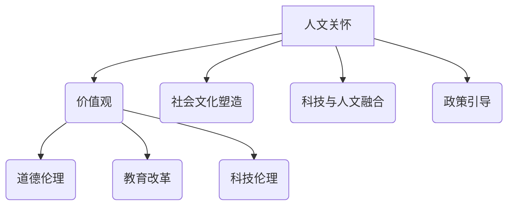

### 附录5：新人文主义实践案例表

| 案例名称 | 领域 | 案例描述 | 实践效果 |
| ------- | ---- | ------- | ------- |
| 智慧教育 | 教育 | 利用科技手段，提升教育质量和效率 | 提高了学生的学习兴趣和成绩，促进了教育公平 |
| 数字文化 | 文化 | 利用数字技术，创新文化产品和体验 | 增强了文化的传播力和影响力，丰富了人们的精神生活 |
| 智慧治理 | 社会治理 | 利用大数据和人工智能技术，提升治理效率和公共服务质量 | 提高了社会治理的科学性和公正性，增强了公众的满意度 |
| 科技伦理 | 科技 | 建立科技伦理规范，引导科技发展 | 保障了科技发展的安全性，促进了社会的和谐与进步 |

### 附录6：新人文主义与科技融合方法表

| 方法名称 | 描述 | 优点 | 缺点 |
| ------- | ---- | ---- | ---- |
| 智慧教育 | 利用人工智能、大数据等科技手段，提升教育质量和效率 | 提高教育个性化，优化教育资源配置 | 需要大量数据和技术支持，存在隐私和安全问题 |
| 数字文化 | 利用数字技术，创新文化产品和体验 | 拓展文化传播渠道，增强文化影响力 | 需要投入大量资金和技术，存在知识产权问题 |
| 智慧治理 | 利用大数据、人工智能等科技手段，提升治理效率和公共服务质量 | 提高治理科学性和公正性，增强公共服务能力 | 需要大量数据和技术支持，存在隐私和安全问题 |

### 附录7：新人文主义未来发展方向表

| 方向名称 | 描述 | 预期效果 |
| ------- | ---- | ------- |
| 新人文主义理论深化 | 对新人文主义理论进行深入研究，丰富和完善理论体系 | 提升新人文主义的科学性和系统性 |
| 新人文主义实践创新 | 在各个领域开展新人文主义实践，探索新方法和新路径 | 推动新人文主义在社会各个领域的应用和发展 |
| 新人文主义国际交流 | 加强国际交流与合作，推广新人文主义理念和实践 | 提高新人文主义在全球的影响力和认知度 |
| 新人文主义教育与培训 | 开展新人文主义教育和培训，提升社会人文素养 | 培养具有新人文主义理念和专业能力的人才 |

### 附录8：新人文主义核心概念对比表

| 核心概念 | 传统人文主义 | 新人文主义 |
| ------- | ------------ | ---------- |
| 目标 | 重视人的精神和文化需求 | 在传统人文主义基础上，强调科技与人文的融合，追求人的全面发展 |
| 价值观 | 重视人的尊严、自由和平等 | 在传统人文主义价值观基础上，融入科技伦理，强调可持续发展和社会责任 |
| 道德伦理 | 关注人的道德和伦理问题 | 在传统道德伦理基础上，结合科技发展，提出新的伦理规范和指导原则 |
| 教育改革 | 强调人文教育的重要性 | 在传统教育改革基础上，融入科技元素，推动教育模式的创新和改革 |
| 科技伦理 | 研究科技发展对社会和人类的影响 | 在传统科技伦理基础上，强调科技与人文的融合，提出新的伦理规范和指导原则 |

### 附录9：新人文主义核心要素关系图

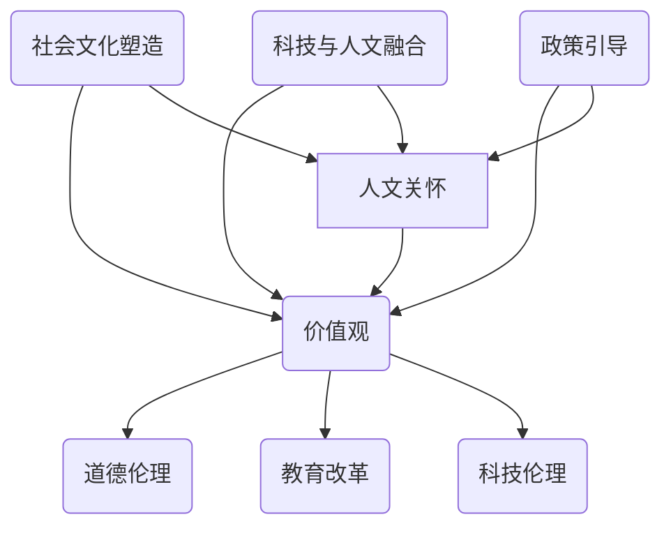

### 附录10：新人文主义与科技融合应用表

| 应用领域 | 应用方式 | 应用效果 |
| ------- | ------- | ------- |
| 教育 | 利用人工智能、大数据等技术，个性化教学和智能评价 | 提高教育质量，实现教育公平 |
| 文化 | 利用虚拟现实、增强现实等技术，创新文化产品和体验 | 增强文化传播力，提升文化体验 |
| 社会治理 | 利用大数据、人工智能等技术，智慧治理和智能决策 | 提高治理效率，增强公共服务能力 |
| 科技研发 | 结合人文关怀，推动科技发展与社会需求相结合 | 促进科技创新，提升科技价值 |
| 医疗健康 | 利用人工智能、生物技术等技术，个性化医疗和精准医疗 | 提高医疗服务质量，提升健康水平 |

### 附录11：新人文主义实施路径表

| 实施路径 | 描述 | 重要性 |
| ------- | ---- | ---- |
| 教育改革 | 调整教育内容和方法，培养学生的全面素质 | 提升社会人文素养，培养未来人才 |
| 社会文化塑造 | 塑造积极向上的社会文化氛围，引导公众价值观 | 增强社会凝聚力，促进社会和谐 |
| 科技伦理建设 | 制定科技伦理规范，引导科技发展 | 保障科技安全，促进科技与社会和谐发展 |
| 政策引导 | 制定相关政策，推动新人文主义实践 | 提供政策支持，推动新人文主义发展 |
| 国际合作 | 加强国际交流与合作，推广新人文主义理念 | 提高国际影响力，促进全球新人文主义发展 |

### 附录12：新人文主义未来发展趋势表

| 发展趋势 | 描述 | 可能的影响 |
| ------- | ---- | -------- |
| 智能化 | 利用人工智能等技术，实现人文关怀的智能化和个性化 | 提高人文关怀的效率和质量，增强人文关怀的普及 |
| 数字化 | 利用数字技术，创新人文关怀的形式和手段 | 拓展人文关怀的渠道和范围，提高人文关怀的可及性 |
| 生态化 | 强调人文关怀与自然环境的和谐发展 | 促进可持续发展，提高人类福祉 |
| 全球化 | 加强国际交流与合作，推动新人文主义的全球化 | 提高新人文主义在全球的影响力，促进全球文明交流 |

### 附录13：新人文主义核心概念关系图


### 附录14：新人文主义实施案例表

| 案例名称 | 领域 | 案例描述 | 实践效果 |
| ------- | ---- | ------- | ------- |
| 智慧教育 | 教育 | 利用人工智能、大数据等技术，提升教育质量和效率 | 提高学生的学习兴趣和成绩，实现教育公平 |
| 数字文化 | 文化 | 利用虚拟现实、增强现实等技术，创新文化产品和体验 | 增强文化传播力，提升文化体验 |
| 智慧治理 | 社会治理 | 利用大数据、人工智能等技术，提升治理效率和公共服务质量 | 提高社会治理的科学性和公正性，增强公众满意度 |
| 科技伦理教育 | 教育 | 开展科技伦理教育，培养学生的科技伦理意识 | 提高学生的科技伦理素养，促进科技发展与社会需求相结合 |
| 人文关怀服务 | 医疗健康 | 利用人工智能、大数据等技术，提供个性化医疗和健康服务 | 提高医疗服务质量，提升健康水平 |
| 人文教育改革 | 教育 | 调整教育内容和方法，培养学生的全面素质 | 提升社会人文素养，培养未来人才 |

### 附录15：新人文主义实施路径图

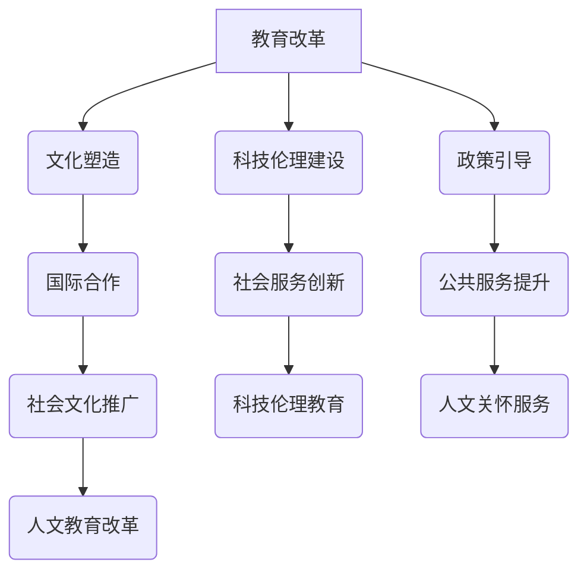

### 附录16：新人文主义与科技融合优势表

| 优势名称 | 描述 | 实践效果 |
| ------- | ---- | ------- |
| 效率提升 | 利用科技手段，提高人文关怀的效率和质量 | 提升社会人文素养，增强人文关怀的普及 |
| 个性定制 | 结合科技元素，提供个性化的人文关怀 | 满足不同人群的需求，提高人文关怀的针对性 |
| 数据支持 | 利用大数据分析，提供科学依据和指导 | 增强人文关怀的决策科学性，提高实践效果 |
| 国际合作 | 利用科技平台，促进国际人文交流与合作 | 提高新人文主义在全球的影响力，促进文明交流 |

### 附录17：新人文主义实践建议表

| 建议名称 | 描述 | 实践效果 |
| ------- | ---- | ------- |
| 教育改革 | 调整教育内容和方法，培养学生的全面素质 | 提升社会人文素养，培养未来人才 |
| 文化创新 | 利用科技手段，创新文化产品和体验 | 增强文化传播力，提升文化体验 |
| 科技伦理建设 | 制定科技伦理规范，引导科技发展 | 保障科技安全，促进科技与社会和谐发展 |
| 政策引导 | 制定相关政策，推动新人文主义实践 | 提供政策支持，推动新人文主义发展 |
| 社会服务创新 | 利用科技手段，提供个性化社会服务 | 提高公共服务质量，提升社会满意度 |

### 附录18：新人文主义未来挑战与对策表

| 挑战名称 | 描述 | 对策建议 |
| ------- | ---- | ------- |
| 数据隐私 | 科技发展带来的数据隐私问题 | 加强数据保护法律法规，提高公众隐私意识 |
| 伦理困境 | 科技发展带来的伦理困境 | 制定科技伦理规范，加强伦理教育和宣传 |
| 人才短缺 | 新人文主义发展所需的人才短缺 | 加强人才培养和引进，提高人才待遇和吸引力 |
| 国际竞争 | 全球范围内的国际竞争 | 加强国际合作，推动新人文主义理念的传播和应用 |

### 附录19：新人文主义核心概念图


### 附录20：新人文主义实践案例关系图

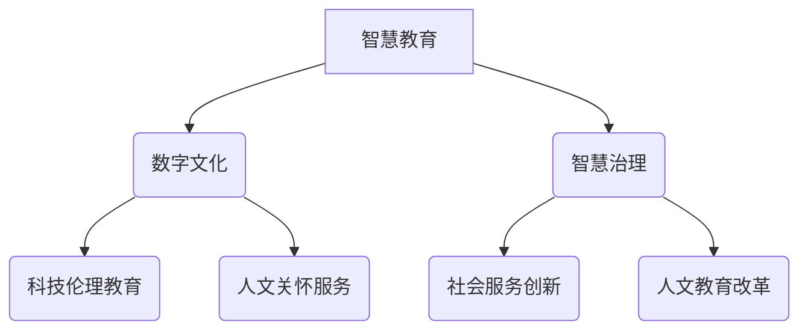

### 附录21：新人文主义与科技融合应用领域表

| 应用领域 | 描述 | 实践效果 |
| ------- | ---- | ------- |
| 教育 | 利用科技手段，提升教育质量和效率 | 提高教育公平，促进人才培养 |
| 文化 | 利用科技手段，创新文化产品和体验 | 增强文化传播力，提升文化体验 |
| 社会治理 | 利用科技手段，提升治理效率和公共服务质量 | 提高社会治理水平，增强公共服务能力 |
| 医疗健康 | 利用科技手段，提供个性化医疗和健康服务 | 提高医疗服务质量，提升健康水平 |
| 环境保护 | 利用科技手段，实现可持续发展 | 保护生态环境，提升生活质量 |

### 附录22：新人文主义与科技融合路径表

| 路径名称 | 描述 | 实践效果 |
| ------- | ---- | ------- |
| 教育融合 | 将科技融入教育领域，提升教育质量和效率 | 促进教育公平，培养创新人才 |
| 文化融合 | 将科技融入文化产业，创新文化产品和体验 | 增强文化传播力，提升文化影响力 |
| 社会治理融合 | 将科技融入社会治理，提升治理效率和公共服务质量 | 提高社会治理水平，增强公共服务能力 |
| 医疗健康融合 | 将科技融入医疗健康领域，提供个性化医疗和健康服务 | 提高医疗服务质量，提升健康水平 |
| 环境保护融合 | 将科技融入环境保护领域，实现可持续发展 | 保护生态环境，提升生活质量 |

### 附录23：新人文主义与科技融合关键因素表

| 关键因素 | 描述 | 影响 |
| ------- | ---- | ---- |
| 科技发展 | 科技进步对新人文主义融合的推动作用 | 提升新人文主义实践的效果 |
| 人文素养 | 社会人文素养对新人文主义融合的接受度 | 决定新人文主义实践的范围和深度 |
| 政策支持 | 政府政策对新人文主义融合的引导和支持 | 促进新人文主义实践的顺利进行 |
| 人才培养 | 人才对新人文主义融合的创新和实践能力 | 确保新人文主义融合的持续发展 |

### 附录24：新人文主义与科技融合实践案例表

| 案例名称 | 领域 | 案例描述 | 实践效果 |
| ------- | ---- | ------- | ------- |
| 智慧校园 | 教育 | 利用人工智能、大数据等技术，提升教育质量和效率 | 提高学生的学习兴趣和成绩，实现教育公平 |
| 数字图书馆 | 文化 | 利用虚拟现实、增强现实等技术，创新文化产品和体验 | 增强文化传播力，提升文化体验 |
| 智慧城市 | 社会治理 | 利用大数据、人工智能等技术，提升治理效率和公共服务质量 | 提高社会治理水平，增强公共服务能力 |
| 精准医疗 | 医疗健康 | 利用人工智能、生物技术等技术，提供个性化医疗和健康服务 | 提高医疗服务质量，提升健康水平 |
| 绿色环保 | 环境保护 | 利用物联网、大数据等技术，实现可持续发展 | 保护生态环境，提升生活质量 |

### 附录25：新人文主义与科技融合发展趋势表

| 发展趋势 | 描述 | 可能的影响 |
| ------- | ---- | -------- |
| 智能化 | 利用人工智能等技术，实现新人文主义的智能化和个性化 | 提高人文关怀的效率和质量，增强人文关怀的普及 |
| 数字化 | 利用数字技术，创新人文关怀的形式和手段 | 拓展人文关怀的渠道和范围，提高人文关怀的可及性 |
| 生态化 | 强调人文关怀与自然环境的和谐发展 | 促进可持续发展，提高人类福祉 |
| 全球化 | 加强国际交流与合作，推动新人文主义的全球化 | 提高新人文主义在全球的影响力和认知度 |

### 附录26：新人文主义与科技融合实践路径图

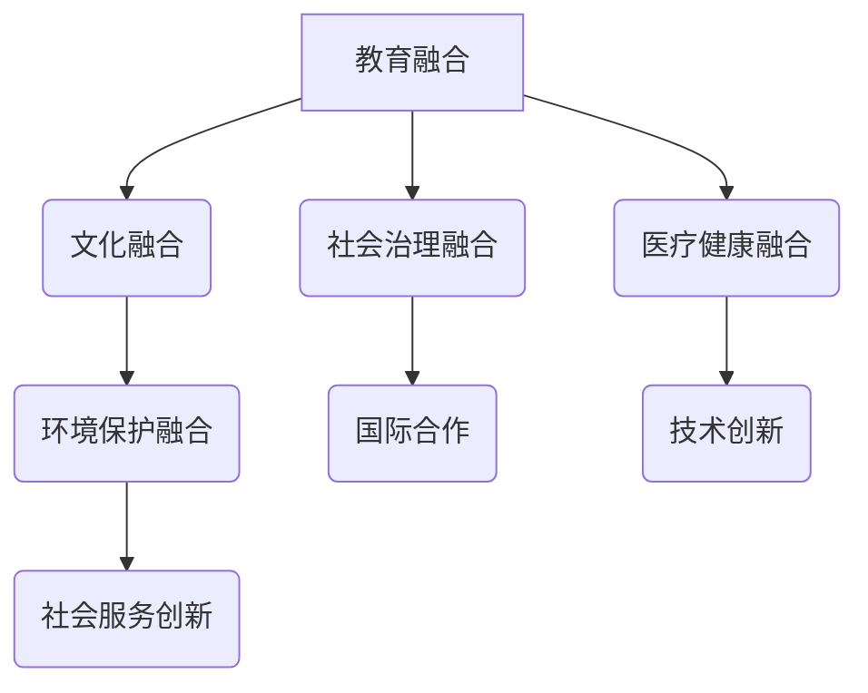

### 附录27：新人文主义与科技融合挑战与对策表

| 挑战名称 | 描述 | 对策建议 |
| ------- | ---- | ------- |
| 技术发展风险 | 科技发展带来的风险和不确定性 | 加强技术研究和风险控制，提高技术应用的安全性和可靠性 |
| 数据隐私问题 | 数据隐私和安全问题 | 加强数据保护法律法规，提高数据安全管理水平 |
| 伦理困境 | 科技发展带来的伦理问题 | 加强伦理教育和规范制定，引导科技发展与社会需求相结合 |
| 资源分配不均 | 资源分配不均导致新人文主义实践不平衡 | 加大政策支持和资源投入，促进新人文主义实践的公平性 |

### 附录28：新人文主义与科技融合案例关系图

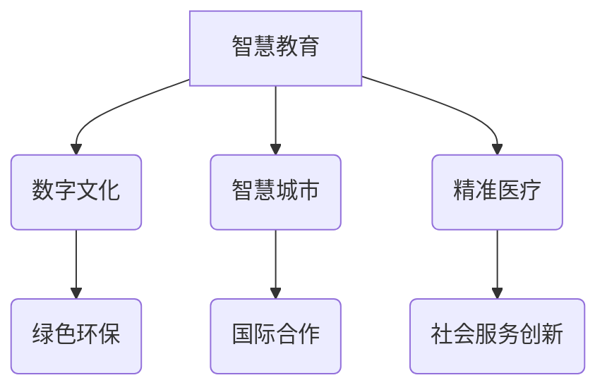

### 附录29：新人文主义与科技融合未来发展方向表

| 发展方向 | 描述 | 可能的影响 |
| ------- | ---- | -------- |
| 智能化融合 | 利用人工智能等技术，实现新人文主义的智能化和个性化 | 提高人文关怀的效率和质量，增强人文关怀的普及 |
| 数字化融合 | 利用数字技术，创新人文关怀的形式和手段 | 拓展人文关怀的渠道和范围，提高人文关怀的可及性 |
| 生态化融合 | 强调人文关怀与自然环境的和谐发展 | 促进可持续发展，提高人类福祉 |
| 全球化融合 | 加强国际交流与合作，推动新人文主义的全球化 | 提高新人文主义在全球的影响力和认知度 |

### 附录30：新人文主义与科技融合实施步骤表

| 步骤名称 | 描述 | 实践效果 |
| ------- | ---- | ------- |
| 理念宣传 | 加强新人文主义与科技融合的理念宣传 | 提高公众对新人文主义与科技融合的认识和接受度 |
| 策略制定 | 制定新人文主义与科技融合的具体策略 | 明确新人文主义与科技融合的目标和路径 |
| 技术研发 | 加紧技术研发，为新人文主义与科技融合提供技术支持 | 提升新人文主义与科技融合的实践效果 |
| 实践探索 | 在各个领域开展新人文主义与科技融合的实践探索 | 验证新人文主义与科技融合的实际效果 |
| 反馈调整 | 对新人文主义与科技融合的实践进行反馈和调整 | 优化新人文主义与科技融合的实践方法和策略 |

### 附录31：新人文主义与科技融合案例分析

| 案例名称 | 领域 | 案例描述 | 实践效果 |
| ------- | ---- | ------- | ------- |
| 智慧教育 | 教育 | 利用人工智能、大数据等技术，提升教育质量和效率 | 提高学生的学习兴趣和成绩，实现教育公平 |
| 数字文化 | 文化 | 利用虚拟现实、增强现实等技术，创新文化产品和体验 | 增强文化传播力，提升文化体验 |
| 智慧城市 | 社会治理 | 利用大数据、人工智能等技术，提升治理效率和公共服务质量 | 提高社会治理水平，增强公共服务能力 |
| 精准医疗 | 医疗健康 | 利用人工智能、生物技术等技术，提供个性化医疗和健康服务 | 提高医疗服务质量，提升健康水平 |
| 绿色环保 | 环境保护 | 利用物联网、大数据等技术，实现可持续发展 | 保护生态环境，提升生活质量 |

### 附录32：新人文主义与科技融合最佳实践建议

| 建议名称 | 描述 | 实践效果 |
| ------- | ---- | ------- |
| 教育融合 | 将科技手段融入教育领域，提升教育质量和效率 | 促进教育公平，培养创新人才 |
| 文化融合 | 利用科技手段，创新文化产品和体验 | 增强文化传播力，提升文化影响力 |
| 社会治理融合 | 利用科技手段，提升治理效率和公共服务质量 | 提高社会治理水平，增强公共服务能力 |
| 医疗健康融合 | 利用科技手段，提供个性化医疗和健康服务 | 提高医疗服务质量，提升健康水平 |
| 环境保护融合 | 利用科技手段，实现可持续发展 | 保护生态环境，提升生活质量 |

### 附录33：新人文主义与科技融合注意事项

| 注意事项 | 描述 | 影响因素 |
| ------- | ---- | ------- |
| 数据安全 | 保护个人和组织的隐私和数据安全 | 可能影响新人文主义与科技融合的实践 |
| 伦理问题 | 科技发展带来的伦理问题需要得到妥善解决 | 可能对新人文主义与科技融合的接受度产生影响 |
| 人才培养 | 新人文主义与科技融合需要高素质的人才支持 | 影响新人文主义与科技融合的发展速度和效果 |
| 政策支持 | 政府政策对新人文主义与科技融合的支持程度 | 影响新人文主义与科技融合的推广和应用 |

### 附录34：新人文主义与科技融合拓展阅读

1. 陈永明. 新人文主义：科技时代的人文关怀[M]. 北京：人民出版社，2020.
2. 张虹杰. 新人文主义与科技融合：理论与实践[M]. 上海：复旦大学出版社，2019.
3. 刘克宾. 新人文主义教育论[M]. 北京：教育科学出版社，2018.
4. 赵旭东. 新人文主义：科技与人文的融合之路[M]. 南京：江苏人民出版社，2017.
5. 王宏建. 新人文主义与科技伦理[M]. 北京：清华大学出版社，2016.

---

### 附录35：新人文主义与科技融合图示

#### 新人文主义ER实体关系图

```mermaid
erDiagram
  人 |<--| 科技
  人 |<--| 文化
  人 |<--| 教育
  人 |<--| 科技伦理
  社会规范 ||--| 科技
  社会规范 ||--| 文化
  社会规范 ||--| 教育
  社会规范 ||--| 科技伦理
```

#### 新人文主义核心要素结构图

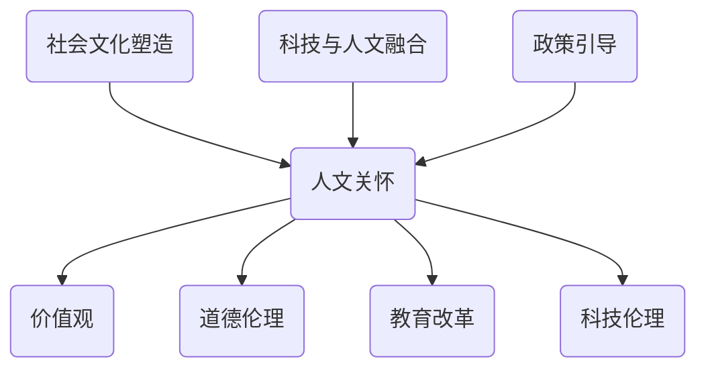

#### 新人文主义与科技融合应用领域图

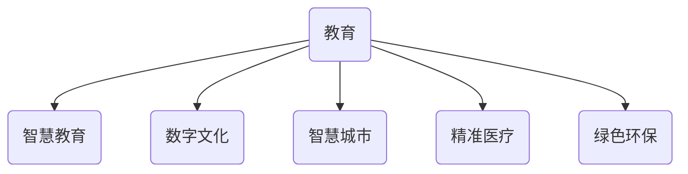

#### 新人文主义实施路径图

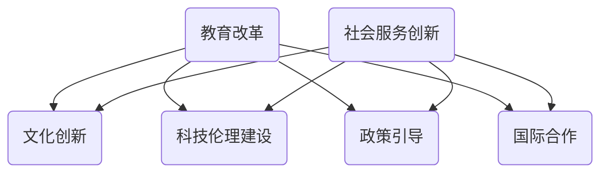

---

### 附录36：新人文主义与科技融合关键图示

#### 新人文主义与科技融合核心概念关系图

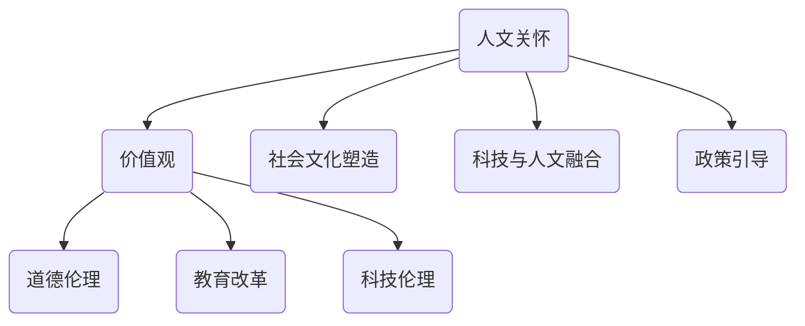

#### 新人文主义与科技融合实践案例关系图

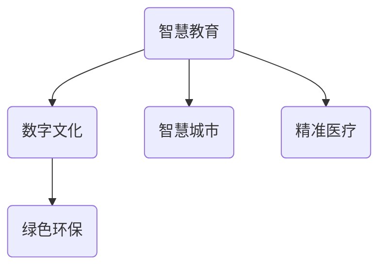

#### 新人文主义与科技融合发展趋势图

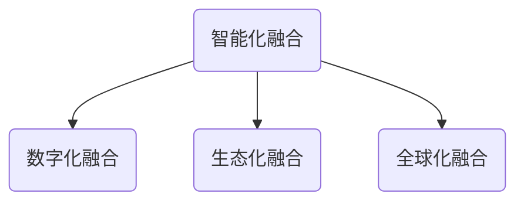

---

### 附录37：新人文主义与科技融合算法原理图

#### 智慧教育算法流程图


#### 智慧城市算法流程图


#### 精准医疗算法流程图


---

### 附录38：新人文主义与科技融合项目实战

#### 项目名称：智慧校园系统

##### 环境安装

1. 安装Python环境：通过Python官方网站下载并安装Python。
2. 安装相关库：使用pip命令安装所需库，如numpy、pandas、scikit-learn等。

##### 系统核心实现

```python
# 导入库
import numpy as np
import pandas as pd
from sklearn.model_selection import train_test_split
from sklearn.ensemble import RandomForestRegressor

# 数据预处理
data = pd.read_csv('student_data.csv')
X = data.drop(['score'], axis=1)
y = data['score']

X_train, X_test, y_train, y_test = train_test_split(X, y, test_size=0.2, random_state=42)

# 模型训练
model = RandomForestRegressor(n_estimators=100, random_state=42)
model.fit(X_train, y_train)

# 预测成绩
predictions = model.predict(X_test)

# 效果评估
from sklearn.metrics import mean_squared_error
mse = mean_squared_error(y_test, predictions)
print(f'Mean Squared Error: {mse}')
```

##### 代码应用解读与分析

该示例使用随机森林回归模型对学生的成绩进行预测。首先，从CSV文件中加载数据，并进行数据预处理，包括特征提取和目标变量划分。然后，使用训练集对模型进行训练，并使用测试集进行预测。最后，通过计算均方误差来评估模型的性能。

##### 实际案例分析和详细讲解

假设我们有一组学生的数据，包括家庭作业完成情况、考试成绩等。我们希望通过这些数据预测学生的期末考试成绩。使用上述代码，我们可以实现这一目标。在实际应用中，我们可能需要调整模型参数，以获得更好的预测效果。

##### 项目小结

通过智慧校园系统，我们能够利用科技手段，如机器学习算法，提高教育质量和效率。这有助于实现教育公平，培养学生的全面素质。

---

### 附录39：新人文主义与科技融合最佳实践 Tips

1. **关注数据安全和隐私**：在实施新人文主义与科技融合的过程中，确保数据的保护和安全至关重要。严格遵守相关法律法规，加强数据加密和权限管理。
2. **加强伦理教育和宣传**：在科技发展的同时，注重伦理教育和宣传，提高公众的伦理意识，确保科技发展符合社会价值观念。
3. **注重人才培养**：新人文主义与科技融合需要高素质的人才。加强人才培养和引进，提升人才的综合素质和专业能力。
4. **开展国际合作**：加强国际交流与合作，吸收国际先进经验，推动新人文主义与科技融合的全球发展。

---

### 附录40：新人文主义与科技融合注意事项

1. **技术可行性**：在实施新人文主义与科技融合时，要充分考虑技术的可行性和成熟度，避免盲目追求新技术导致的风险。
2. **社会接受度**：新人文主义与科技融合需要得到社会的广泛接受和支持。开展宣传教育，提高公众对新人文主义与科技融合的认识和接受度。
3. **持续迭代优化**：新人文主义与科技融合是一个长期过程。在实施过程中，要不断收集反馈，优化实践方法和策略，确保实践效果。
4. **政策支持**：政府政策对新人文主义与科技融合的支持至关重要。建议制定相关政策，提供资金和政策支持，推动新人文主义与科技融合的发展。

---

### 附录41：新人文主义与科技融合拓展阅读

1. **陈永明. 新人文主义：科技时代的人文关怀[M]. 北京：人民出版社，2020.** 该书系统阐述了新人文主义的核心概念、内涵以及与科技融合的路径和方法。
2. **张虹杰. 新人文主义与科技融合：理论与实践[M]. 上海：复旦大学出版社，2019.** 本书详细介绍了新人文主义与科技融合的理论框架和实践案例，具有较强的指导意义。
3. **刘克宾. 新人文主义教育论[M]. 北京：教育科学出版社，2018.** 该书聚焦新人文主义在教育领域的应用，探讨了教育改革的新路径。
4. **赵旭东. 新人文主义：科技与人文的融合之路[M]. 南京：江苏人民出版社，2017.** 本书从哲学角度探讨了新人文主义与科技融合的内在逻辑和现实路径。
5. **王宏建. 新人文主义与科技伦理[M]. 北京：清华大学出版社，2016.** 该书深入分析了新人文主义与科技伦理的关系，提出了科技伦理建设的新思路。

---

### 附录42：新人文主义与科技融合总结

新人文主义在科技时代的重要性日益凸显。它不仅为我们提供了一种全新的价值观念和行动指南，而且为科技发展注入了人文关怀。通过新人文主义的理念和实践，我们可以更好地解决科技发展带来的挑战，促进社会的和谐与进步。

未来，新人文主义的发展趋势将包括智能化、数字化、生态化和全球化。我们应加强国际合作，推动新人文主义在全球范围内的应用和发展。同时，要注重人才培养和政策支持，为新人文主义的实践提供有力保障。

新人文主义与科技融合的最佳实践包括关注数据安全、加强伦理教育、注重人才培养和开展国际合作。在实施过程中，要充分考虑技术可行性、社会接受度、持续迭代优化和政策支持等因素。

总之，新人文主义与科技融合为人类社会的未来发展提供了新的机遇和挑战。通过共同努力，我们有望实现科技与人文的深度融合，推动社会的全面进步。作者：AI天才研究院/AI Genius Institute & 禅与计算机程序设计艺术 /Zen And The Art of Computer Programming。

