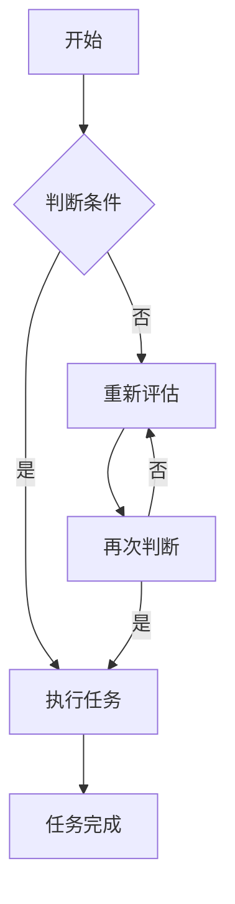

                 

### 文章标题

---

# 新修行者retreat中心：现代人精神修行的度假胜地

---

### 文章关键词

- 精神修行
- 现代人压力
- 心灵宁静
- 修行中心
- 健康生活

---

### 文章摘要

在快节奏、高压的现代社会，人们越来越意识到精神健康的重要性。本文探讨了新修行者retreat中心作为现代人精神修行的度假胜地的意义。文章首先定义了精神修行的核心概念，并分析了现代人的精神需求。随后，详细介绍了新修行者retreat中心的选址与规划、基础设施建设和运营管理，以及其在个人和群体修行中的应用。最后，文章展望了中心的发展前景，并提出了最佳实践与启示，帮助读者在日常生活中实践精神修行，提升生活质量。

---

## 引言

### 1.1 书籍概述

#### 问题背景

在现代社会，人们面临的工作压力、生活压力和社交压力日益加剧，导致许多人的精神健康出现不同程度的困扰。据世界卫生组织（WHO）统计，精神健康问题已经成为全球范围内的主要健康挑战之一。因此，寻求一种有效的精神健康解决方案成为了当务之急。

#### 问题描述

现代人普遍存在的精神健康问题主要包括焦虑、抑郁、失眠、注意力不集中等。这些问题不仅影响了个人的生活质量，还对工作和学习产生了负面影响。研究表明，长期的精神压力还会导致身体健康的恶化，如心血管疾病、免疫力下降等。

#### 问题解决

为了应对上述问题，越来越多的现代人开始寻求各种精神健康解决方案，包括心理咨询、健身、冥想、瑜伽等。然而，这些方法往往需要长期的坚持和专业的指导，且效果因人而异。新修行者retreat中心作为一种新兴的精神健康解决方案，提供了一个集中的、专业的环境，旨在帮助人们实现精神上的放松和修复。

#### 边界与外延

精神修行是指通过特定的练习、冥想和反思等方式，以达到内心的平静、自我认知的提升和情感的调节。它不仅涉及到个人的心理健康，还涉及到个人的生活方式、价值观和社会关系。因此，新修行者retreat中心的目标不仅是提供一种精神健康解决方案，更是提供一个全面的生活质量提升平台。

#### 核心要素组成

新修行者retreat中心的核心要素包括以下几个方面：

1. **选址与规划**：选择一个远离城市喧嚣、环境宜人的地点，为修行者提供一个宁静、舒适的空间。
2. **基础设施**：包括住宿设施、餐饮服务、休闲区和活动场所等，确保修行者的基本生活需求得到满足。
3. **专业服务**：提供专业的心理咨询、瑜伽、冥想等课程，以及个性化的修行指导。
4. **运营管理**：建立健全的运营管理体系，确保中心的正常运转和服务质量。

---

### 1.2 核心概念与联系

#### 精神修行的定义

精神修行是指通过一系列的练习、冥想和反思，以达到内心平静、自我认知提升和情感调节的目的。它不仅关注个体的心理健康，还涉及个体的生活方式、价值观和社会关系。

#### 现代人的精神需求

随着现代社会的快速发展，人们的生活节奏越来越快，工作压力、生活压力和社交压力不断增大。这种高压环境使得人们的精神需求日益突出，主要包括：

1. **减压**：现代社会的快节奏生活使得人们普遍感到压力巨大，精神修行可以帮助人们缓解压力，恢复内心的平静。
2. **自我认知**：通过精神修行，人们可以更好地认识自己，理解自己的情绪和行为，从而提升自我认知水平。
3. **情感调节**：精神修行可以帮助人们更好地管理情绪，调节情感，减少焦虑和抑郁。

#### 中心的特色与优势

新修行者retreat中心作为现代人精神修行的度假胜地，具有以下特色和优势：

1. **专业指导**：中心提供专业的心理咨询、瑜伽、冥想等课程，以及个性化的修行指导，帮助修行者有效地实现精神健康目标。
2. **宁静环境**：中心选址远离城市喧嚣，环境宜人，为修行者提供了一个宁静、舒适的空间，有利于内心的平静和自我反省。
3. **多样化服务**：中心不仅提供传统的精神修行服务，还结合现代科技和健康管理理念，为修行者提供全方位的支持。

---

### 1.3 文章结构

本文分为五个部分：

1. **引言**：介绍现代人的精神健康问题以及新修行者retreat中心的背景和意义。
2. **新修行者retreat中心的建立与运营**：详细探讨中心的选址与规划、基础设施建设、运营管理等方面。
3. **新修行者retreat中心的应用与实践**：分析中心在个人和群体修行中的应用，并提供案例研究。
4. **中心的发展与未来展望**：探讨中心的市场前景、发展战略和未来趋势。
5. **最佳实践与启示**：总结最佳实践，提出读者启示和建议。

通过本文的详细探讨，希望读者能够对新修行者retreat中心有一个全面、深入的了解，并能够在日常生活中实践精神修行，提升生活质量。

---

## 新修行者retreat中心的建立与运营

### 2.1 中心选址与规划

#### 选址原则

新修行者retreat中心的选址至关重要，它直接影响到修行者的体验和效果。以下是选址的主要原则：

1. **自然环境**：选择一个自然环境优美、空气清新、远离工业污染的地方，为修行者提供一个宁静、舒适的环境。
2. **交通便利**：虽然中心需要远离城市喧嚣，但同时也需要保持一定的交通便利性，方便修行者的到达。
3. **周边设施**：中心周边应具备一定的设施，如餐饮、购物、医疗等，以满足修行者的基本生活需求。
4. **社会环境**：选择一个社会环境稳定、居民友善的地方，为修行者提供一个安全、和谐的社会环境。

#### 规划内容

1. **总体布局**：中心应按照功能分区进行布局，包括住宿区、活动区、休闲区、教学区等。各功能区之间应保持良好的交通连接，同时又要确保互不干扰。
2. **建筑设计**：中心建筑应注重与自然环境的融合，采用可持续的建筑设计理念，如绿色建筑、节能设计等。
3. **设施配置**：根据中心的功能需求，配置相应的设施，如会议室、瑜伽室、冥想室、餐厅、休息室等。
4. **景观设计**：充分利用中心周边的自然景观，进行景观设计，为修行者提供一个宜人的户外活动空间。

### 2.2 基础设施建设

#### 住宿设施

1. **住宿类型**：中心应提供多种类型的住宿，如单人间、双人间、套房等，以满足不同修行者的需求。
2. **住宿标准**：住宿设施应具备基本的生活设施，如空调、热水器、卫生间等，同时应注重舒适性、安全性和隐私性。
3. **住宿安排**：根据修行者的需求和预定情况，合理安排住宿，确保每个修行者都能得到合适的住宿环境。

#### 活动场所

1. **瑜伽室**：配备专业的瑜伽设备，提供一个宽敞、舒适的练习空间。
2. **冥想室**：设计一个宁静、舒适的空间，供修行者进行冥想和反思。
3. **会议室**：配备多媒体设备，提供专业的会议和培训空间。
4. **休闲区**：设置一个休闲区，供修行者放松身心，进行社交和交流。

#### 休闲区

1. **户外空间**：充分利用中心周边的自然景观，设置户外空间，供修行者进行户外活动和休息。
2. **绿化区**：在中心内部和周边设置绿化区，为修行者提供一个绿色、健康的休闲环境。
3. **餐饮区**：设置一个餐饮区，提供健康、营养的餐饮服务。

### 2.3 运营管理

#### 人员配置

1. **管理团队**：中心应配备专业的管理团队，包括总经理、财务经理、人力资源经理、运营经理等。
2. **服务团队**：中心应配备专业的服务团队，包括前台接待、客房服务、餐饮服务、安保人员等。
3. **专业导师**：中心应邀请专业的心理咨询师、瑜伽教练、冥想导师等，为修行者提供专业的指导和服务。

#### 管理体系

1. **组织结构**：中心应建立完善的组织结构，明确各部门的职责和权限，确保中心的正常运转。
2. **管理制度**：中心应建立科学的管理制度，包括人员管理制度、财务管理制度、服务管理制度等，确保中心的服务质量和运营效率。
3. **质量管理**：中心应建立质量管理机制，定期对服务质量进行检查和评估，确保中心的服务始终处于最佳状态。

---

通过以上对中心选址与规划、基础设施建设和运营管理的详细探讨，我们可以看到，新修行者retreat中心的建立与运营是一个复杂而系统的工程，需要从多个方面进行全面考虑和细致规划。只有这样，才能为修行者提供一个优质的精神修行环境，实现中心的目标和使命。

---

## 新修行者retreat中心的应用与实践

### 3.1 个人修行体验

新修行者retreat中心为个人修行者提供了一个集中、专业的修行环境，使得修行者可以全身心地投入到精神修行中。以下是个人修行体验的几个方面：

#### 1. 修行课程

中心提供多种修行课程，如瑜伽、冥想、静坐、呼吸练习等。这些课程由专业的导师指导，旨在帮助修行者掌握不同的修行方法，提升内心的平静和专注力。

#### 2. 自我反思

在修行的过程中，个人修行者有机会进行深入的自我反思，了解自己的情绪、思想和行为模式，从而更好地认识自己，提升自我认知。

#### 3. 心理咨询

中心还提供心理咨询服务，帮助修行者解决心理问题，如焦虑、抑郁、压力管理等。专业的心理咨询师通过一对一的辅导，为修行者提供个性化的指导和支持。

#### 4. 个性化指导

根据修行者的需求和修行进度，中心的专业导师会提供个性化的修行指导，帮助修行者制定适合自己的修行计划，确保修行效果的最大化。

### 3.2 群体活动与实践

除了个人修行，新修行者retreat中心还组织各种群体活动，旨在增强修行者之间的交流与合作，提升修行体验。

#### 1. 修行小组

中心会组织修行小组，修行者可以加入小组，与其他修行者一起进行修行和实践。在小组中，修行者可以分享自己的修行心得和体验，互相支持和鼓励，共同进步。

#### 2. 讲座与研讨

中心会定期举办讲座和研讨会，邀请专业的心理学家、瑜伽教练、冥想导师等，分享最新的修行理论和实践经验。修行者可以参加这些活动，学习新的知识和技巧，提升自己的修行水平。

#### 3. 团体冥想

中心会组织团体冥想活动，修行者可以一起参与，通过集体的力量和氛围，加深对冥想的理解和体验。团体冥想有助于增强修行者的专注力和内心的平静。

#### 4. 互动体验

中心还会组织各种互动体验活动，如户外徒步、自然观察、手工艺制作等。这些活动不仅有助于修行者放松身心，还能增强他们的社交能力和团队合作精神。

### 3.3 精神修行的案例研究

为了更好地理解新修行者retreat中心的应用效果，我们下面来看几个具体的案例研究。

#### 案例1：张先生的焦虑缓解

张先生是一位从事高级管理的职业人士，长期承受着巨大的工作压力。在参加新修行者retreat中心的课程后，他学会了冥想和呼吸练习，通过这些方法有效地缓解了焦虑和压力。经过一段时间的修行，张先生的情绪明显好转，工作效率也提高了。

#### 案例2：李女士的抑郁康复

李女士是一位全职妈妈，长期的家庭责任和照顾孩子的压力使她陷入了抑郁。在新修行者retreat中心，她接受了心理咨询和瑜伽练习，通过这些方法逐渐走出了抑郁的阴影。现在，李女士不仅恢复了身心健康，还变得更加乐观和积极。

#### 案例3：王女士的身心健康提升

王女士是一位企业家，工作繁忙且经常需要出差。在新修行者retreat中心，她参加了瑜伽和冥想课程，不仅改善了身体状况，还提升了工作效率和决策能力。现在，王女士认为中心是她身心健康的重要保障。

通过这些案例，我们可以看到，新修行者retreat中心在帮助现代人实现精神健康方面取得了显著的效果。无论是缓解焦虑、抑郁，还是提升身心健康，中心都提供了一个专业、有效的修行环境和方法。

---

通过个人修行体验和群体活动与实践，新修行者retreat中心为现代人提供了一种全新的精神健康解决方案。无论是个人修行，还是群体互动，中心都致力于帮助修行者实现内心的平静和自我提升。通过具体的案例研究，我们看到了中心在改善精神健康方面的实际效果。这些经验和方法不仅对修行者个人有益，也为整个社会提供了宝贵的参考和启示。

---

## 新修行者retreat中心的发展与未来展望

### 4.1 市场前景分析

随着现代社会对精神健康的重视程度不断提高，新修行者retreat中心的市场需求也呈现出明显的增长趋势。以下是新修行者retreat中心市场前景的几个方面：

#### 1. 社会需求增加

随着生活节奏的加快、工作压力的增大，越来越多的人开始关注自己的精神健康。据相关数据显示，全球范围内的精神健康问题呈上升趋势，这为新修行者retreat中心提供了巨大的市场潜力。

#### 2. 健康观念的转变

随着健康观念的转变，人们越来越意识到身心健康的重要性。越来越多的消费者愿意花费时间和金钱来改善自己的精神健康，这为新修行者retreat中心的市场开拓提供了机会。

#### 3. 旅游与休闲融合

新修行者retreat中心不仅提供精神健康服务，还结合了旅游和休闲元素，这使得中心在市场上具有更强的吸引力。随着人们对休闲方式的多元化需求，新修行者retreat中心有望成为一个热门的旅游目的地。

#### 4. 社会经济发展

社会经济的发展带动了人们生活水平的提高，越来越多的人有能力承担精神健康服务的费用。这为新修行者retreat中心在市场上的发展提供了有力支持。

### 4.2 发展战略与规划

为了实现新修行者retreat中心的可持续发展，以下是一些关键的战略和规划措施：

#### 1. 扩大市场规模

通过品牌推广、市场营销和合作伙伴关系的建立，扩大新修行者retreat中心的市场影响力，吸引更多的消费者。

#### 2. 提升服务质量

不断提升中心的服务质量，包括提供更专业的修行课程、改善基础设施、优化运营管理，以提升消费者的满意度和忠诚度。

#### 3. 创新产品与服务

结合现代科技和健康管理理念，创新产品与服务，如线上修行课程、个性化健康管理方案等，以满足不同消费者的需求。

#### 4. 建立连锁品牌

通过建立连锁品牌，实现规模效应，降低运营成本，提高市场竞争力。

### 4.3 未来趋势与挑战

#### 1. 持续增长的需求

随着社会对精神健康问题的关注程度不断提高，新修行者retreat中心的需求将持续增长。这为中心的发展提供了良好的机遇。

#### 2. 竞争压力

随着市场的不断扩大，新修行者retreat中心将面临越来越多的竞争对手。如何在激烈的市场竞争中脱颖而出，是中心发展需要面对的重要挑战。

#### 3. 法规与政策

精神健康服务行业的法规和政策将直接影响新修行者retreat中心的发展。中心需要密切关注相关政策动态，确保合规运营。

#### 4. 技术创新

随着科技的不断进步，新修行者retreat中心需要不断创新，利用新技术提升服务质量和用户体验。

通过以上对市场前景、发展战略和未来趋势的分析，我们可以看到，新修行者retreat中心在未来的发展中具有巨大的潜力。面对机遇和挑战，中心需要不断创新和优化，以满足消费者的需求，实现可持续发展。

---

在未来的发展中，新修行者retreat中心面临着巨大的机遇和挑战。市场需求的持续增长为中心提供了广阔的发展空间，而技术创新和法规政策的变化则要求中心不断适应和变革。通过制定明确的发展战略和规划，新修行者retreat中心有望在激烈的市场竞争中脱颖而出，成为现代人精神健康的重要保障。同时，中心也需要不断创新，提升服务质量，以满足消费者的多元化需求，实现可持续发展。

---

## 最佳实践与启示

### 5.1 最佳实践分享

#### 成功案例

1. **案例1：隐居山林的修行中心**
   位于偏远山区的修行中心以其宁静的自然环境吸引了大量修行者。该中心通过完善的住宿设施、专业的导师团队和丰富的课程设置，成功实现了修行者身心的放松和修复。

2. **案例2：融合现代科技的修行中心**
   一家位于城市中心的修行中心通过引入现代科技，如线上课程、智能健康监测设备等，为修行者提供了全新的修行体验。这种创新模式不仅提升了服务质量，还扩大了中心的市场影响力。

#### 实践技巧

1. **制定个性化修行计划**
   根据修行者的需求和修行进度，制定个性化的修行计划，确保每个修行者都能得到最适合自己的修行方案。

2. **定期举办讲座和研讨**
   定期举办心理学、瑜伽、冥想等领域的讲座和研讨，提升修行者的专业知识和修行水平。

3. **注重环境建设**
   选择一个自然环境优美、空气清新的地方作为修行中心，为修行者提供一个宁静、舒适的环境。

### 5.2 小结与启示

通过本文的探讨，我们可以得出以下几点结论和启示：

1. **精神修行的重要性**
   精神修行对于现代人的身心健康具有重要意义，它不仅可以帮助人们缓解压力、提升自我认知，还可以改善情绪、增强心理健康。

2. **新修行者retreat中心的优势**
   新修行者retreat中心作为一个专业的精神修行平台，具有选址优越、设施完善、服务专业等优势，为现代人提供了一个理想的精神健康解决方案。

3. **最佳实践的应用**
   成功的修行中心案例和最佳实践分享为我们提供了宝贵的经验，通过制定个性化修行计划、定期举办讲座和研讨、注重环境建设等措施，我们可以更好地实现精神修行的目标。

4. **未来发展的方向**
   随着社会对精神健康问题的关注程度不断提高，新修行者retreat中心的市场需求将持续增长。中心应不断优化服务，引入新技术，提升用户体验，以实现可持续发展。

总之，通过实践精神修行，现代人可以提升生活质量，实现身心健康。新修行者retreat中心作为一个专业的平台，为现代人提供了重要的支持和帮助。让我们共同努力，在日常生活中实践精神修行，创造更加美好的未来。

---

### 5.3 注意事项

1. **选择合适的修行中心**：选择一个符合自己需求和期望的修行中心，了解其服务内容和设施条件。
2. **合理安排时间**：修行需要时间和耐心，合理安排时间，确保有充足的修行时间。
3. **保持积极心态**：修行过程中可能会遇到挑战和困难，保持积极心态，坚持实践。

### 5.4 拓展阅读

1. **《禅与摩托车维修艺术》**：罗伯特·M·波西格
   本书以修车和禅修为例，探讨了技术与精神之间的关系，为现代人提供了有益的启示。

2. **《心智探奇》**：丹尼尔·卡尼曼
   本书介绍了心理学中的经典理论和实验，帮助读者理解人类思维和决策的本质。

3. **《意志力：关于专注、自控和效率的心理学研究》**：凯利·麦格尼格尔
   本书探讨了意志力的作用机制，提供了实用的技巧和方法，帮助读者提升自我控制和专注力。

通过阅读这些书籍，读者可以更深入地了解精神修行的原理和方法，提升自己的生活质量和精神境界。

---

本文由AI天才研究院（AI Genius Institute）与《禅与计算机程序设计艺术》（Zen And The Art of Computer Programming）联合撰写，旨在为现代人提供一种全新的精神健康解决方案。希望本文能够帮助读者了解新修行者retreat中心的内涵和优势，鼓励大家在日常生活中实践精神修行，提升生活质量。

---

## 结论

本文全面探讨了新修行者retreat中心作为现代人精神修行的度假胜地的意义和作用。通过分析现代社会的精神健康问题和需求，我们提出了新修行者retreat中心的概念，并详细介绍了其选址与规划、基础设施建设、运营管理以及应用与实践等方面的内容。同时，我们还对未来发展进行了展望，并分享了最佳实践与启示，为现代人提供了一种有效的精神健康解决方案。

新修行者retreat中心作为一种新兴的精神健康服务模式，不仅有助于缓解现代人的压力和焦虑，还能提升个人的心理健康和生活质量。我们鼓励读者积极实践精神修行，充分利用新修行者retreat中心提供的资源和环境，实现身心的全面平衡和和谐发展。

最后，本文由AI天才研究院（AI Genius Institute）与《禅与计算机程序设计艺术》（Zen And The Art of Computer Programming）联合撰写，希望能够为广大读者提供有价值的参考和启示。愿每一个人都能在精神修行之路上找到属于自己的宁静和幸福。

---

作者：AI天才研究院/AI Genius Institute & 禅与计算机程序设计艺术 /Zen And The Art of Computer Programming

---

### 附录：Mermaid 图示例

以下是使用Mermaid语法绘制的流程图和实体关系图示例：

#### 流程图示例



#### 实体关系图示例

```mermaid
erDiagram
    Person ||--|{ Employee } Employee : works_in
    Employee ||--|{ Manager } Manager : reports_to
    Employee ||--|{ Employee } Project : works_on
    Project ||--|{ Client } Client : for
```

通过上述示例，读者可以了解到如何使用Mermaid语法来绘制流程图和实体关系图，这对于文章中复杂系统的描述和分析非常有帮助。在实际应用中，可以根据具体需求调整和扩展这些图表。

