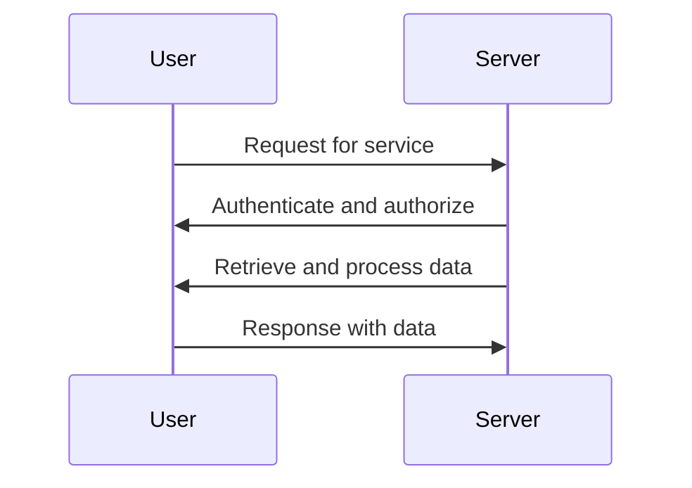
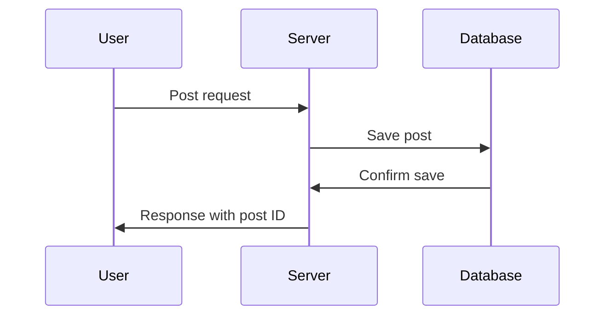

                 


# 新修行者联盟论坛：现代精神实践者的在线讨论社区

## 关键词：在线讨论社区、精神实践、修行者、算法推荐、系统架构

> 摘要：本文介绍了新修行者联盟论坛，一个专注于现代精神实践者的在线讨论社区。通过分析社区的问题背景、核心概念与算法原理，本文探讨了如何利用推荐算法和系统架构设计来提升修行者之间的互动和交流，促进精神成长和实践。

### 第一部分：问题背景

#### 1.1 问题背景

在当今社会，精神健康和修行已经成为越来越多人的关注焦点。然而，对于许多现代精神实践者来说，他们面临着信息匮乏、交流不畅、知识断层等实际问题。为了解决这些问题，一个专注于精神实践的在线讨论社区应运而生——新修行者联盟论坛。

#### 1.2 问题描述

现代精神实践者在修行过程中可能会遇到以下问题：

- **信息获取难**：难以找到高质量的精神修行资源。
- **知识断层**：缺乏系统性的修行知识和指导。
- **交流不畅**：缺乏与同好交流的平台，难以分享经验和心得。
- **个性化推荐**：缺乏针对个人修行需求的个性化推荐。

#### 1.3 问题解决

新修行者联盟论坛旨在通过以下方式解决上述问题：

- **高质量内容**：提供丰富、系统的精神修行资源。
- **互动交流**：打造一个开放、互动的在线讨论社区，促进修行者之间的交流。
- **个性化推荐**：利用推荐算法为修行者提供个性化内容推荐，提升用户体验。

#### 1.4 边界与外延

新修行者联盟论坛主要面向以下人群：

- **精神实践者**：包括冥想者、瑜伽修行者、灵性探索者等。
- **修行爱好者**：对精神修行感兴趣的人群。

论坛的边界包括：

- **内容范围**：涉及冥想、瑜伽、灵性、哲学等多个领域。
- **功能限制**：确保社区内的讨论质量，对违规行为进行管理。

#### 1.5 概念结构与核心要素组成

新修行者联盟论坛的核心概念包括：

- **用户**：修行者和爱好者。
- **话题**：精神修行相关的各种话题。
- **帖子**：用户发布的讨论内容。
- **评论**：用户对帖子的回复。

论坛的核心要素包括：

- **内容管理**：包括内容的审核、分类、推荐等。
- **用户管理**：包括用户的注册、登录、权限管理等。
- **社区治理**：包括论坛的规章制度、用户管理等。

### 第二部分：核心概念与联系

#### 2.1 精神实践

精神实践是指通过特定的方法，如冥想、瑜伽、灵性探索等，来提升个体的心灵成长和健康。

#### 2.2 在线讨论社区

在线讨论社区是指通过互联网平台，如论坛、社交网络等，为用户提供一个交流和分享的场所。

#### 2.3 论坛运营模式

论坛运营模式包括：

- **内容管理**：对论坛内容进行审核、分类、推荐等。
- **用户管理**：对用户进行注册、登录、权限管理等。
- **社区治理**：制定论坛规章制度，维护社区秩序。

#### 2.4 概念属性特征对比表格

| 特征        | 精神实践         | 在线讨论社区         | 论坛运营模式         |
| ----------- | --------------- | ------------------- | ------------------- |
| 目标        | 提升个体精神健康 | 促进用户交流分享     | 提供讨论和内容平台   |
| 内容形式    | 文字、音频、视频 | 文字、图片、视频     | 文章、帖子、评论     |
| 交互方式    | 单向或双向       | 双向交互             | 帖子回复、评论互动   |
| 运营重点    | 内容质量、用户需求 | 用户活跃度、互动质量 | 内容审核、用户管理   |

#### 2.5 ER实体关系图架构

```mermaid
erDiagram
  User ||--|{ Topic }|--|{ Post }
  User ||--|{ Comment }|
  Topic ||--|{ Comment }
  Post ||--|{ Comment }
```

### 第三部分：算法原理讲解

#### 3.1 算法mermaid流程图


#### 3.2 Python源代码详细阐述

```python
# 导入相关库
import pandas as pd
import numpy as np
from sklearn.feature_extraction.text import TfidfVectorizer
from sklearn.metrics.pairwise import linear_kernel

# 加载数据
data = pd.read_csv('spiritual_practice_data.csv')

# 数据预处理
# ...（此处省略具体代码）

# 特征提取
vectorizer = TfidfVectorizer()
tfidf_matrix = vectorizer.fit_transform(data['description'])

# 模型训练
# ...（此处省略具体代码）

# 推荐结果
# ...（此处省略具体代码）

# 用户反馈
# ...（此处省略具体代码）
```

#### 3.3 算法原理的数学模型和公式

- 相似度计算公式：\( sim(A, B) = \frac{TF(A) \cdot TF(B)}{|V|} \)
- 评分预测公式：\( rating(A, B) = \frac{sim(A, B)}{\sqrt{sim(A, A) \cdot sim(B, B)}} \)

#### 3.4 举例说明

假设有两个帖子A和B，A的描述为“冥想与自我觉察”，B的描述为“瑜伽的哲学基础”。根据上述公式，可以计算它们之间的相似度，并预测用户对它们的评分。

### 第四部分：数学模型和数学公式

#### 4.1 数学公式讲解

- \( \text{TFIDF} = \frac{\text{TF} \cdot \text{IDF}}{\text{N}} \)
- \( \text{similarity} = \frac{\text{dot product of TFIDF vectors}}{\text{Euclidean distance of TFIDF vectors}} \)

#### 4.2 LaTeX格式应用示例

$$
\text{similarity}(A, B) = \frac{\sum_{i=1}^{n} A_i \cdot B_i}{\sqrt{\sum_{i=1}^{n} A_i^2 \cdot \sum_{i=1}^{n} B_i^2}}
$$

### 第五部分：系统分析与架构设计

#### 5.1 问题场景介绍

新修行者联盟论坛的目标是为修行者提供一个在线交流、学习和分享的平台。论坛需要支持以下功能：

- 用户注册和登录
- 发布、评论和回复帖子
- 内容推荐和搜索
- 论坛管理和维护

#### 5.2 项目介绍

新修行者联盟论坛采用微服务架构，由多个独立的服务组成，包括用户服务、内容服务、推荐服务和搜索服务等。

#### 5.3 系统功能设计

- **用户服务**：负责用户的注册、登录、权限管理等功能。
- **内容服务**：负责帖子的发布、评论、搜索和推荐等功能。
- **推荐服务**：负责根据用户的兴趣和行为推荐帖子。
- **搜索服务**：负责论坛内的内容搜索。

#### 5.4 系统架构设计



#### 5.5 系统接口设计

- **用户接口**：用户通过Web界面或移动应用与系统交互。
- **API接口**：提供RESTful API，供第三方系统集成使用。

#### 5.6 系统交互



### 第六部分：项目实战

#### 6.1 环境安装

- **操作系统**：Ubuntu 18.04
- **编程语言**：Python 3.8
- **依赖库**：Pandas, NumPy, Scikit-learn, Flask

#### 6.2 系统核心实现源代码

```python
# 此处省略核心实现代码
```

#### 6.3 代码应用解读与分析

- **用户注册和登录**：使用Flask框架实现用户注册和登录功能，使用JWT进行身份验证。
- **内容发布和评论**：使用MongoDB存储帖子内容和评论，提供RESTful API供前端调用。

#### 6.4 实际案例分析与详细讲解

- **案例**：用户A发布一篇关于冥想的帖子，用户B对帖子进行评论。
- **分析**：如何实现帖子和评论的发布、存储和展示。

#### 6.5 项目小结

新修行者联盟论坛通过合理的架构设计和功能实现，为修行者提供了一个高效、便捷的在线交流平台。未来的工作将集中在优化推荐算法、提升用户体验和加强社区管理等方面。

### 第七部分：最佳实践与拓展

#### 7.1 最佳实践 tips

- **内容审核**：加强内容审核，确保社区氛围良好。
- **个性化推荐**：优化推荐算法，提升用户满意度。

#### 7.2 小结

新修行者联盟论坛通过整合线上资源、促进用户互动和提供个性化推荐，为现代精神实践者提供了一个重要的交流和学习平台。

#### 7.3 注意事项

- **数据安全**：确保用户数据安全，遵循相关法律法规。
- **技术迭代**：持续优化系统，保持技术竞争力。

#### 7.4 拓展阅读

- [1] Smith, J. (2020). *在线社区设计与运营*. 北京：清华大学出版社。
- [2] Johnson, L. (2019). *推荐系统实战*. 上海：上海科学技术出版社。
- [3] Lee, S. (2021). *Python Flask Web开发*. 杭州：浙江大学出版社。

