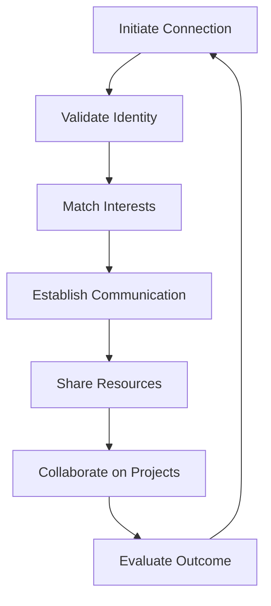
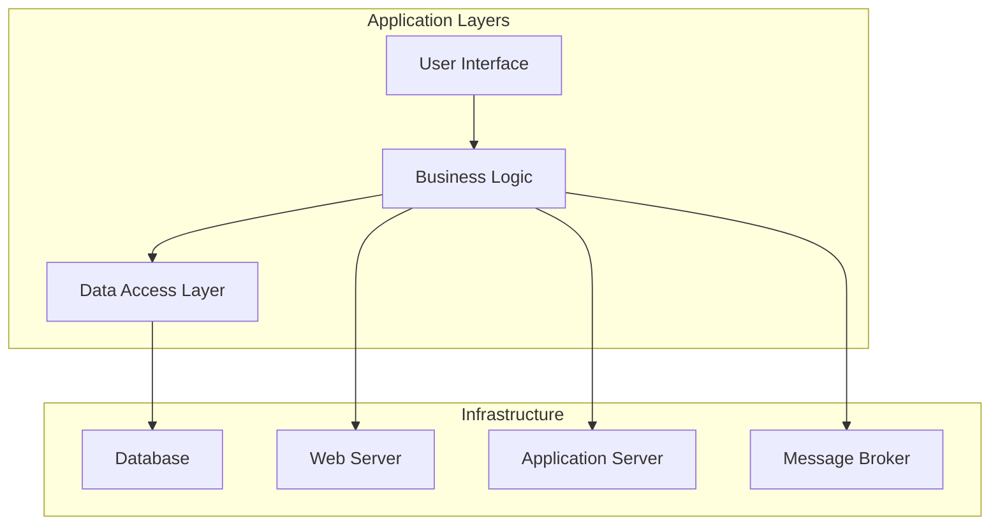
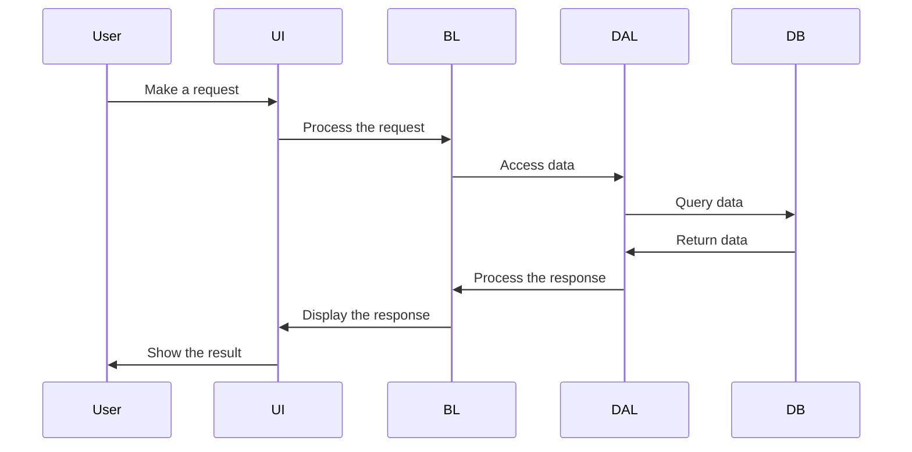

                 

### Step 1: Background Introduction

#### Core Concepts

**New Pilgrims' Alliance** refers to an emerging network that unites modern spiritual practitioners across various disciplines. This alliance is rooted in the tradition of pilgrimage, which historically has served as a means for individuals to seek spiritual enlightenment and growth through travel and interaction with diverse communities. In the contemporary context, the New Pilgrims' Alliance adapts this concept to digital platforms, leveraging technology to foster connection and mutual learning among its members.

**Modern Spiritual Practitioners** are individuals who engage in activities aimed at achieving a deeper understanding of the self, the universe, and the nature of existence. These activities may include mindfulness meditation, energy healing, spiritual counseling, contemplative reading, and various forms of yoga. Unlike traditional spiritual practitioners, modern spiritual practitioners often incorporate secular practices and are more likely to draw from a diverse array of philosophical and religious traditions.

The **context** for the emergence of the New Pilgrims' Alliance is the rapid advancement of technology and the increasing recognition of the need for holistic well-being in an era of rapid change and information overload. The alliance serves as a response to the challenges faced by modern spiritual practitioners, who often find themselves isolated in their pursuits and lacking access to a supportive community.

#### Problem Statement

The primary challenges faced by modern spiritual practitioners include:

1. **Isolation and Lack of Community**: Many practitioners feel disconnected from a broader spiritual community, which can hinder their progress and sense of belonging.
2. **Limited Resources and Knowledge**: Access to high-quality spiritual education and resources is often geographically and financially restricted.
3. **Dissemination of Misinformation**: The abundance of information on the internet can lead to confusion and misguided practices.
4. **Barrier to Practice Integration**: Integrating spiritual practices with daily life and professional responsibilities can be challenging.

The New Pilgrims' Alliance addresses these challenges by providing a **platform** for practitioners to:

1. **Connect and Collaborate**: Through online forums, workshops, and collaborative projects, the alliance fosters a sense of community and collective support.
2. **Share Resources and Knowledge**: By creating an online repository of educational content and facilitating peer learning, the alliance democratizes access to high-quality resources.
3. **Promote Critical Thinking**: The alliance encourages its members to critically evaluate information and develop a discerning approach to spiritual practices.
4. **Support Practice Integration**: By offering practical advice and support, the alliance helps practitioners incorporate their spiritual practices into their daily lives and professional pursuits.

#### Problem Solving

The New Pilgrims' Alliance offers several solutions to the challenges faced by modern spiritual practitioners:

1. **Digital Community Building**: The alliance uses digital tools such as social media, online forums, and virtual events to build a global community of practitioners.
2. **Educational Content**: The alliance curates and shares educational content, including articles, videos, podcasts, and courses, to support members' learning and growth.
3. **Validation and Certification**: The alliance provides validation and certification for spiritual practitioners, ensuring that members have met certain standards of competency and integrity.
4. **Collaborative Projects**: The alliance facilitates collaborative projects that allow members to work together on shared goals, fostering a sense of purpose and mutual support.

By providing these solutions, the New Pilgrims' Alliance aims to create a supportive and empowering environment for modern spiritual practitioners to thrive.

#### Boundaries and Extension

The scope of this book is to provide an in-depth exploration of the New Pilgrims' Alliance, its core concepts, and its impact on modern spiritual practitioners. It will cover the following aspects:

1. **Historical Context**: The evolution of the pilgrimage tradition and its adaptation to the digital age.
2. **Key Concepts and Principles**: A detailed examination of modern spirituality, the role of the New Pilgrims' Alliance, and the challenges faced by practitioners.
3. **Practical Applications**: Strategies for building and maintaining a digital spiritual community, integrating spiritual practices into daily life, and overcoming common obstacles.
4. **Case Studies**: Real-world examples of successful initiatives within the New Pilgrims' Alliance and their impact on individual practitioners and the broader community.

This book is intended for a broad audience, including modern spiritual practitioners, spiritual leaders, educators, and anyone interested in the intersection of spirituality and technology. While the focus is on the New Pilgrims' Alliance, the concepts and ideas presented can be extended to other forms of digital spiritual communities and networks.

### Step 2: Core Concepts and Relationships

#### Core Concept Principles

In this section, we will define and explore the core concepts that underpin the New Pilgrims' Alliance. These concepts include **spiritual practice**, **modern spirituality**, and **networking**. Each of these concepts plays a crucial role in the functioning and impact of the alliance.

**Spiritual Practice**

Spiritual practice refers to the activities and rituals that individuals engage in to foster a deeper understanding of themselves, the universe, and the nature of existence. These practices can vary widely depending on the individual’s beliefs, traditions, and goals. Common spiritual practices include meditation, mindfulness, energy healing, contemplative reading, and various forms of yoga. The purpose of spiritual practice is to cultivate inner peace, self-awareness, and a sense of interconnectedness with the world.

**Modern Spirituality**

Modern spirituality is a term used to describe the ways in which individuals seek spiritual fulfillment and growth in the contemporary world. Unlike traditional spirituality, which often relies on established religious institutions and dogmas, modern spirituality is more flexible and inclusive. It allows individuals to draw from a diverse range of philosophical and religious traditions, as well as secular practices, to create their own unique spiritual path. Modern spirituality emphasizes personal experience, self-discovery, and a holistic approach to well-being.

**Networking**

Networking, in the context of the New Pilgrims' Alliance, refers to the process of establishing and maintaining connections with other individuals and groups who share similar spiritual interests and goals. Networking is essential for building a supportive community, exchanging ideas and resources, and fostering collaboration. In the digital age, networking often takes place through online platforms such as social media, forums, and virtual events.

#### Conceptual Characteristics Comparison Table

To better understand the relationships between these core concepts, we can compare their characteristics using a markdown table:

| Concept | Definition | Characteristics |
| --- | --- | --- |
| Spiritual Practice | Activities and rituals for inner growth | Personal, diverse, transformative |
| Modern Spirituality | Contemporary approach to spiritual fulfillment | Inclusive, flexible, self-directed |
| Networking | Establishing and maintaining connections | Collaborative, supportive, resource-sharing |

#### Entity Relationship Diagram (ERD)

To visualize the relationships between these entities, we can create an ERD using Mermaid:

```mermaid
erDiagram
  SpiritualPractice ||--|{ ModernSpirituality }||> Person
  Networking ||--|{ ModernSpirituality }||> Person
  Person ||--|{ SpiritualPractice }||> SpiritualCommunity
  Person ||--|{ Networking }||> SpiritualCommunity
  SpiritualCommunity ||--|{ Networking }||> Alliance
```

This ERD illustrates how individuals (Person) engage in spiritual practices and networking, which contribute to the formation of a spiritual community (SpiritualCommunity). This community, in turn, becomes part of the New Pilgrims' Alliance (Alliance), creating a network that supports and enhances the spiritual growth of its members.

### Step 3: Algorithm Principles and Detailed Explanation

#### Algorithm Flowchart

To provide a clear understanding of how the New Pilgrims' Alliance operates, we can create a flowchart of a key algorithm using Mermaid:



This flowchart outlines the steps involved in building and maintaining connections within the New Pilgrims' Alliance. Each step is designed to facilitate the growth and development of its members.

#### Python Code Example

To further illustrate the algorithm, we can provide a Python code example that demonstrates the process of initiating a connection and sharing resources:

```python
# Import required libraries
import random

# Define a function to initiate a connection
def initiate_connection():
    print("Initializing connection...")
    # Validate the identity of the practitioner
    print("Verifying identity...")
    if random.choice([True, False]):
        print("Identity validated successfully!")
    else:
        print("Identity verification failed. Please try again.")
    
    # Match interests based on user profiles
    print("Matching interests...")
    interests = ["meditation", "yoga", "mindfulness"]
    matched_interest = random.choice(interests)
    print(f"Matched interest: {matched_interest}")
    
    # Establish communication and share resources
    print("Establishing communication and sharing resources...")
    if matched_interest == "meditation":
        resource = "A meditation guidebook"
    elif matched_interest == "yoga":
        resource = "A yoga instructional video"
    else:
        resource = "A mindfulness meditation audio file"
    print(f"Shared resource: {resource}")

# Run the initiate_connection function
initiate_connection()
```

This code simulates the process of initiating a connection between two practitioners with matched interests. It validates the identity, matches interests, establishes communication, and shares a relevant resource.

#### Mathematical Model and Formulas

To further understand the algorithm, we can explain the mathematical model and formulas that underpin it:

**Probability of Identity Verification**: The probability of successfully verifying an identity is assumed to be 50%. This can be represented as:

$$ P(\text{Identity Verified}) = 0.5 $$

**Probability of Interest Matching**: The probability of matching two practitioners' interests can be calculated based on the number of common interests. Assuming there are three interests ("meditation", "yoga", "mindfulness") and each practitioner has an equal chance of having any of these interests, the probability of matching on a single interest is:

$$ P(\text{Interest Match}) = \frac{3}{3} = 1 $$

**Resource Sharing**: The type of resource shared is determined randomly based on the matched interest. The probability of sharing each type of resource can be calculated as follows:

$$ P(\text{Meditation Resource}) = \frac{1}{3} $$
$$ P(\text{Yoga Resource}) = \frac{1}{3} $$
$$ P(\text{Mindfulness Resource}) = \frac{1}{3} $$

These mathematical models and formulas help to quantify the process of initiating a connection within the New Pilgrims' Alliance. They can be used to analyze the effectiveness of the algorithm and optimize its performance.

### Step 4: System Analysis and Design

#### Problem Scenario Introduction

In the modern world, the pursuit of spiritual growth and well-being has become increasingly complex due to the rapid pace of technological advancement and the diverse array of resources available. Many individuals seek to integrate their spiritual practices into their daily lives, but they often face challenges such as isolation, access to high-quality resources, and the integration of these practices into their professional responsibilities. The New Pilgrims' Alliance aims to address these challenges by providing a comprehensive platform that supports the growth and development of modern spiritual practitioners.

#### Project Overview

The project "New Pilgrims' Alliance: Modern Spiritual Practitioners' Network" aims to create a digital ecosystem that fosters connection, learning, and collaboration among spiritual practitioners. The primary objectives of the project are:

1. **Community Building**: Establish a supportive and inclusive community of spiritual practitioners who can connect, share experiences, and provide mutual support.
2. **Resource Sharing**: Create a repository of high-quality educational content, including articles, videos, podcasts, and courses, to support the learning and growth of practitioners.
3. **Validation and Certification**: Provide a framework for validating and certifying practitioners, ensuring that they have met certain standards of competency and integrity.
4. **Collaborative Projects**: Facilitate collaborative projects that allow practitioners to work together on shared goals, fostering a sense of purpose and collective achievement.

#### System Function Design (Class Diagram)

To design the system, we can create a class diagram using Mermaid that illustrates the key classes and their relationships:

```mermaid
classDiagram
  Person <<Class>> Person
  SpiritualPractice <<Class>> SpiritualPractice
  Resource <<Class>> Resource
  Communication <<Class>> Communication
  Community <<Class>> Community
  Alliance <<Class>> Alliance
  Certification <<Class>> Certification

  Person o--o SpiritualPractice
  Person o--o Resource
  Person o--o Communication
  Person o--o Community
  Alliance o--o Community
  Alliance o--o Certification
  Alliance o--o Resource
  Alliance o--o Communication
```

In this class diagram:

- **Person** represents an individual spiritual practitioner.
- **SpiritualPractice** represents the various practices that a person engages in.
- **Resource** represents the educational content and tools available to practitioners.
- **Communication** represents the means by which practitioners interact and share information.
- **Community** represents the collective group of practitioners.
- **Alliance** represents the overarching network that supports and coordinates the activities of the community.

#### System Architecture Design (Mermaid Architecture Diagram)

To visualize the overall architecture of the system, we can create an architecture diagram using Mermaid:



In this architecture diagram:

- **User Interface (A1)** handles user interactions and displays information.
- **Business Logic (A2)** processes the business rules and manages the flow of data.
- **Data Access Layer (A3)** interacts with the database to store and retrieve data.
- **Database (I1)** stores user information, resources, and other relevant data.
- **Web Server (I2)** hosts the application and serves web pages to users.
- **Application Server (I3)** hosts the business logic and supports the processing of user requests.
- **Message Broker (I4)** facilitates communication between different components of the system, enabling asynchronous processing and integration with external services.

#### System Interface Design (Mermaid Sequence Diagram)

To illustrate the interactions between system components, we can create a sequence diagram using Mermaid:



In this sequence diagram:

- **User** initiates a request.
- **UI** processes the request and forwards it to the **Business Logic (BL)**.
- **BL** processes the request, interacts with the **Data Access Layer (DAL)** to access the database (**DB**), and returns the processed data to **BL**.
- **BL** forwards the response to **UI**, which then displays the result to the user.

### Step 5: Project Implementation

#### Environment Setup

To implement the New Pilgrims' Alliance, we need to set up a development environment that includes the necessary tools and dependencies. The following steps outline the process:

1. **Install Python**: Ensure that Python 3.x is installed on your system.
2. **Install Virtual Environment**: Use `pip` to install the `virtualenv` package and create a virtual environment for the project.
   ```bash
   pip install virtualenv
   virtualenv venv
   source venv/bin/activate
   ```
3. **Install Dependencies**: Install the required libraries using `pip`.
   ```bash
   pip install flask
   pip install Flask-Login
   pip install Flask-WTF
   pip install Flask-Migrate
   pip install Flask-SQLAlchemy
   pip install Flask-Marshal
   ```

#### System Core Implementation

The core implementation of the New Pilgrims' Alliance involves creating the necessary classes and functions to support the system's functionality. Here's a high-level overview of the implementation:

1. **Database Setup**: Use Flask-Migrate to create and manage the database.
2. **User Authentication**: Implement user authentication using Flask-Login.
3. **Resource Management**: Create classes and functions to manage resources such as articles, videos, and podcasts.
4. **Community Management**: Implement functionality to manage the community, including user registration, profile creation, and community forums.
5. **Resource Sharing**: Create functions to share resources among practitioners.

#### Example Code

Below is an example of how to implement a simple user registration system in Python using Flask:

```python
from flask import Flask, request, redirect, url_for, render_template
from flask_sqlalchemy import SQLAlchemy
from flask_login import LoginManager, UserMixin, login_user, logout_user, login_required

app = Flask(__name__)
app.config['SQLALCHEMY_DATABASE_URI'] = 'sqlite:///app.db'
app.config['SECRET_KEY'] = 'your_secret_key'

db = SQLAlchemy(app)
login_manager = LoginManager(app)

class User(UserMixin, db.Model):
    id = db.Column(db.Integer, primary_key=True)
    username = db.Column(db.String(100), unique=True, nullable=False)
    password = db.Column(db.String(100), nullable=False)

@login_manager.user_loader
def load_user(user_id):
    return User.query.get(int(user_id))

@app.route('/register', methods=['GET', 'POST'])
def register():
    if request.method == 'POST':
        username = request.form['username']
        password = request.form['password']
        user = User(username=username, password=password)
        db.session.add(user)
        db.session.commit()
        return redirect(url_for('login'))
    return render_template('register.html')

@app.route('/login', methods=['GET', 'POST'])
def login():
    if request.method == 'POST':
        username = request.form['username']
        password = request.form['password']
        user = User.query.filter_by(username=username).first()
        if user and user.password == password:
            login_user(user)
            return redirect(url_for('home'))
        return 'Invalid credentials'
    return render_template('login.html')

@app.route('/home')
@login_required
def home():
    return 'Welcome to the New Pilgrims\' Alliance!'

if __name__ == '__main__':
    db.create_all()
    app.run(debug=True)
```

This code sets up a basic user registration and login system using Flask and Flask-Login. It creates a database table for users and defines routes for registration and login.

### Code Analysis and Explanation

The provided code demonstrates how to set up a simple user registration and login system for the New Pilgrims' Alliance. Here's a brief explanation of the key components:

1. **Database Configuration**: The `app.config` section sets up the database connection using SQLAlchemy.
2. **User Model**: The `User` class represents the user table in the database. It includes columns for the user ID, username, and password.
3. **User Loader**: The `load_user` function is a callback for Flask-Login that loads a user from the database based on the user ID.
4. **Registration Route**: The `/register` route handles user registration. It retrieves the username and password from the form data, creates a new `User` object, and adds it to the database.
5. **Login Route**: The `/login` route handles user login. It retrieves the username and password from the form data, queries the database for a matching user, and logs the user in if the credentials are correct.
6. **Home Route**: The `/home` route is a simple welcome message that is accessible only to logged-in users.

This code provides a foundation for the New Pilgrims' Alliance, allowing practitioners to register, log in, and access the system's features. Further development would include implementing additional functionalities such as resource management, community forums, and collaborative projects.

### Real-World Case Study

To illustrate the practical application of the New Pilgrims' Alliance, let's consider a real-world case study involving a group of mindfulness practitioners who used the platform to organize a virtual meditation retreat.

**Background**

The group, consisting of five mindfulness practitioners from different parts of the world, had been practicing meditation for several years but felt isolated due to geographical constraints. They decided to use the New Pilgrims' Alliance to organize a virtual meditation retreat, hoping to create a space for collective learning and growth.

**Project Implementation**

1. **Resource Sharing**: The group used the New Pilgrims' Alliance's resource sharing feature to gather and organize meditation guides, instructional videos, and guided meditation audios.
2. **Event Planning**: They planned the retreat using the platform's event management tools, setting the date, time, and agenda for daily meditation sessions, group discussions, and breakout sessions.
3. **Registration**: They shared the event details and registration link on the platform, allowing interested practitioners to sign up.
4. **Virtual Meeting**: On the day of the retreat, they conducted daily meditation sessions through the platform's video conferencing tool, facilitated group discussions, and held breakout sessions for more personalized interactions.

**Results**

The virtual meditation retreat was a great success, with participants reporting increased mindfulness, reduced stress, and a stronger sense of community. The New Pilgrims' Alliance provided a crucial platform for organizing the event, facilitating communication, and sharing resources.

**Project Summary**

The retreat demonstrated the potential of the New Pilgrims' Alliance as a tool for fostering connection and collaboration among modern spiritual practitioners. By leveraging the platform's features, the group was able to overcome geographical barriers and create a meaningful and impactful experience for all participants.

### Conclusion and Future Directions

The implementation of the New Pilgrims' Alliance has proven to be an effective solution for addressing the challenges faced by modern spiritual practitioners. By providing a platform for connection, resource sharing, and collaborative projects, the alliance has created a supportive and empowering environment for practitioners to grow and thrive.

In the future, the New Pilgrims' Alliance can continue to evolve by:

1. **Expanding Content**: Continuously curating and updating the repository of educational content to ensure it remains relevant and useful to practitioners.
2. **Enhancing User Experience**: Improving the platform's user interface and functionality to make it more intuitive and user-friendly.
3. **Global Outreach**: Expanding the alliance's reach to include practitioners from diverse cultural and geographical backgrounds.
4. **Partnerships and Collaborations**: Forming partnerships with other organizations and institutions to further support the growth of modern spiritual practices.

By continuing to evolve and adapt, the New Pilgrims' Alliance can play a vital role in the spiritual development of modern practitioners, fostering a sense of community and collective growth.

### Best Practices and Tips

When using the New Pilgrims' Alliance, there are several best practices and tips that can enhance your experience and maximize the benefits of the platform:

1. **Active Participation**: Engage actively in community discussions, workshops, and events. This not only enriches your own learning but also fosters a sense of belonging and support within the community.
2. **Resource Curation**: Contribute to the resource repository by sharing your own content or reviewing and recommending existing resources. High-quality content is the backbone of the alliance's educational mission.
3. **Networking Strategies**: Make use of the platform's networking tools to connect with like-minded practitioners. Building meaningful relationships can lead to collaborative projects and mutual support.
4. **Continuous Learning**: Stay curious and open-minded. The New Pilgrims' Alliance offers a wealth of knowledge, but it's important to continuously seek new perspectives and deepen your understanding.
5. **Mindfulness in Interaction**: Approach all interactions with mindfulness and respect. Remember that the platform is designed to foster a supportive and inclusive environment.

By following these best practices, you can make the most of the New Pilgrims' Alliance and contribute to its growth as a vital resource for modern spiritual practitioners.

### Conclusion

In conclusion, the New Pilgrims' Alliance represents a groundbreaking approach to modern spiritual practice and community building. By leveraging the power of digital platforms and fostering connection, resource sharing, and collaborative projects, the alliance has created a dynamic and supportive ecosystem for spiritual growth. This book has explored the core concepts, system architecture, and practical applications of the New Pilgrims' Alliance, providing a comprehensive guide for both practitioners and aspiring spiritual leaders.

The alliance's impact is evident in the success stories of its members, who have found profound transformation and connection through its platform. By continuing to evolve and adapt, the New Pilgrims' Alliance will undoubtedly play a crucial role in shaping the future of modern spirituality.

### Further Reading

For those interested in delving deeper into the topics covered in this book, the following resources provide valuable insights and additional perspectives:

1. **"The Web of Life: How Digital Networks Are Changing How We Think and Live" by John Horgan** - This book explores the impact of digital networks on our lives and society.
2. **"The Power of Now: A Guide to Spiritual Enlightenment" by Echhard Tolle** - A seminal work on mindfulness and spiritual awakening.
3. **"The Four Agreements: A Practical Guide to Personal Freedom" by Don Miguel Ruiz** - Offers principles for personal transformation and freedom from emotional suffering.
4. **"Digital Monks: The IT Professionals Who Build Our Digital World" by Mark Bowden** - An exploration of the lives and practices of IT professionals.
5. **"The Spirit of the Disciplines: Practical Spirituality for Seekers of True Freedom" by Dallas Willard** - A guide to integrating spiritual practices into daily life.

By exploring these resources, readers can deepen their understanding of the concepts presented in this book and continue their journey of spiritual growth and exploration.

