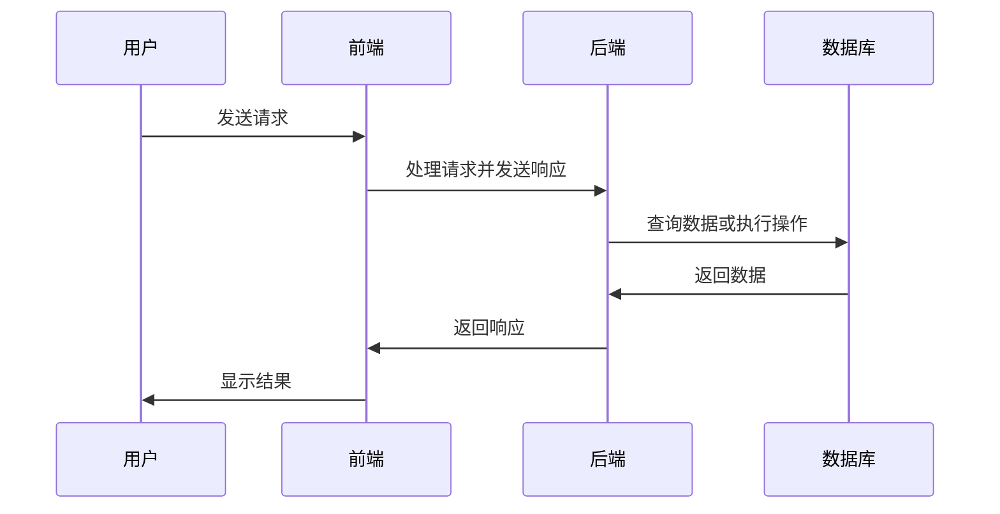

                 

# 新修道院周末retreat：现代人短期精神修行的度假选择

## 关键词
- 短期精神修行
- 新修道院retreat
- 心理健康
- 冥想
- 瑜伽
- 心理辅导

## 摘要
在现代社会中，精神压力成为许多人的困扰。为了缓解这种压力，短期精神修行成为一种流行的选择。本文将以新修道院周末retreat为例，探讨现代人如何通过这种度假选择来达到精神修行的目的。

---

## 第一部分：背景介绍

### 1.1 问题背景

#### 1.1.1 现代社会压力与精神健康

现代社会中，随着生活节奏的加快、工作压力的增大，越来越多的人面临着心理健康问题。根据世界卫生组织（WHO）的数据，全球约有3.5亿人患有抑郁症，而在中国，抑郁症的患病率也在逐年上升。面对这样的现状，许多人开始寻求各种方式来缓解压力，提升自己的精神健康。

#### 1.1.2 短期精神修行的需求

在这样的背景下，短期精神修行成为了许多人关注和追求的一种方式。短期精神修行可以帮助人们暂时脱离日常生活的压力，通过冥想、瑜伽、心理辅导等手段，实现对心灵的放松和调整。然而，目前关于短期精神修行的资料相对较少，特别是针对现代人的需求，如何选择合适的短期精神修行方式，还没有一个系统性的指导。

#### 1.1.3 新修道院周末retreat的概念

新修道院周末retreat（以下简称“新修道院retreat”）是一种结合了传统修道院文化和现代精神修行理念的短期修行活动。这种活动通常在周末进行，参与者可以在一个相对安静的环境中，通过冥想、灵修、心理辅导等方式，进行短期的心灵修养。

### 1.2 问题解决

#### 1.2.1 概念结构与核心要素组成

新修道院retreat的核心要素包括：静谧的环境、专业的指导、丰富的活动形式和科学的安排。其中，静谧的环境是提供心灵修养的基础，专业的指导能够帮助参与者更好地理解和实践精神修行，丰富的活动形式和科学的安排则能够确保参与者能够在有限的时间内获得最大程度的收获。

#### 1.2.2 边界与外延

新修道院retreat的边界相对清晰，主要针对那些希望进行短期精神修行的现代人。其外延则可以扩展到不同宗教、文化背景的修行者，以及那些对心灵成长感兴趣的人群。

### 1.3 本章小结

本章介绍了新修道院周末retreat的背景、需求和核心要素，为后续章节的详细探讨奠定了基础。

---

## 第二部分：核心概念与联系

### 2.1 核心概念

#### 2.1.1 新修道院周末retreat的定义

新修道院周末retreat是一种结合了传统修道院文化和现代精神修行理念的短期修行活动，通常在周末进行，参与者可以在一个相对安静的环境中，通过冥想、灵修、心理辅导等方式，进行短期的心灵修养。

#### 2.1.2 短期精神修行的意义

短期精神修行对于现代人来说，具有缓解压力、提升心理素质、促进身心健康等多重意义。通过短期精神修行，参与者可以更好地认识自己，调整心态，增强内心的力量。

### 2.2 概念属性特征对比表格

| 概念               | 特征                                           |
|--------------------|----------------------------------------------|
| 新修道院周末retreat | 短期、安静环境、专业指导、多种活动形式       |
| 短期精神修行       | 缓解压力、提升心理素质、促进身心健康           |
| 修道院文化         | 内在修养、精神追求、纪律严明                 |
| 现代精神修行       | 科学性、实践性、多样性、注重内心体验           |

### 2.3 ER实体关系图架构

```mermaid
erDiagram
  Person  ||--|{ Retreat }|--|{ Activity }
  Retreat ||--|{ Guide }|--|{ Activity }
  Activity ||--|{ Topic }|--|{ Guide }
  Guide    ||--|{ Trainer }|--|{ Activity }
```

### 2.4 本章小结

本章详细介绍了新修道院周末retreat的核心概念，并对比了短期精神修行、修道院文化和现代精神修行的特征。同时，通过ER实体关系图架构，展示了新修道院周末retreat中的各个实体及其相互关系。

---

## 第三部分：算法原理讲解

### 3.1 冥想算法原理

#### 3.1.1 冥想算法的基本概念

冥想算法是一种通过指导个体进行呼吸控制、身体放松和心灵集中的练习，以达到心理平衡和内心平静的技术。它主要涉及以下几个基本概念：

- **呼吸控制**：通过调节呼吸节奏和深度，使身体和心灵得到放松。
- **身体放松**：通过逐步放松身体各个部位的肌肉，减轻身体的紧张感。
- **心灵集中**：将注意力集中在呼吸、身体感觉或特定物体上，以达到内心的平静。

#### 3.1.2 冥想算法的步骤

1. **准备工作**：选择一个安静、舒适的环境，保持身体姿势正直，闭上眼睛。
2. **呼吸调节**：通过缓慢、深长的呼吸，使身体放松下来。
3. **身体放松**：从脚开始，逐渐向上放松身体各个部位的肌肉。
4. **心灵集中**：将注意力集中在呼吸、身体感觉或特定物体上，保持专注。
5. **结束冥想**：当感到身心平静时，逐渐打开眼睛，慢慢恢复正常活动。

#### 3.1.3 冥想算法的数学模型

冥想过程中的呼吸控制可以用以下数学模型描述：

- **呼吸节奏**：设\( T \)为每次呼吸的时间，\( D \)为每次呼吸的深度。
- **呼吸深度**：设\( d \)为每次呼吸的深度，初始深度为\( d_0 \)，每\( n \)次呼吸后，深度增加\( \Delta d \)。

数学模型为：

\[ d_{i+1} = d_i + \Delta d \quad (i \mod n = 0) \]
\[ T_i = T \quad (i \mod n \neq 0) \]
\[ T_i = T - \Delta T \quad (i \mod n = 0) \]

其中，\( \Delta T \)为每次呼吸深度增加后的调整时间。

#### 3.1.4 冥想算法的示例

假设每次呼吸的时间为6秒，每次呼吸的深度为3厘米，每5次呼吸后，深度增加1厘米，调整时间为2秒。

1. **初始状态**：\( d_0 = 3 \)，\( T = 6 \)，\( \Delta d = 1 \)，\( \Delta T = 2 \)。
2. **第一次呼吸**：\( d_1 = d_0 + \Delta d = 4 \)，\( T_1 = T = 6 \)。
3. **第二次呼吸**：\( d_2 = d_1 = 4 \)，\( T_2 = T = 6 \)。
4. **第三次呼吸**：\( d_3 = d_2 + \Delta d = 5 \)，\( T_3 = T = 6 \)。
5. **第四次呼吸**：\( d_4 = d_3 = 5 \)，\( T_4 = T = 6 \)。
6. **第五次呼吸**：\( d_5 = d_4 + \Delta d = 6 \)，\( T_5 = T - \Delta T = 4 \)。

通过以上步骤，个体可以在冥想过程中逐步放松身体，达到内心的平静。

### 3.2 瑜伽算法原理

#### 3.2.1 瑜伽算法的基本概念

瑜伽算法是一种通过一系列瑜伽体式和呼吸控制，达到身体放松和心理平衡的技术。它主要涉及以下几个基本概念：

- **瑜伽体式**：通过特定的身体姿势，调整身体的姿势和呼吸。
- **呼吸控制**：通过调节呼吸节奏和深度，使身体和心灵得到放松。

#### 3.2.2 瑜伽算法的步骤

1. **准备工作**：选择一个安静、舒适的环境，保持身体姿势正直，闭上眼睛。
2. **瑜伽体式**：选择一个合适的瑜伽体式，保持一段时间，同时调整呼吸。
3. **呼吸调节**：通过缓慢、深长的呼吸，使身体放松下来。
4. **体式变换**：根据瑜伽体式的变换规则，逐步进行不同的体式，保持身体和呼吸的平衡。
5. **结束瑜伽**：当感到身心平静时，慢慢恢复正常活动。

#### 3.2.3 瑜伽算法的数学模型

瑜伽体式的变换可以用以下数学模型描述：

- **体式变换时间**：设\( T \)为每个体式的变换时间。
- **呼吸深度**：设\( d \)为每次呼吸的深度。
- **呼吸节奏**：设\( T_d \)为每次呼吸的时间。

数学模型为：

\[ T = T_d \times d \]

#### 3.2.4 瑜伽算法的示例

假设每次呼吸的时间为6秒，每次呼吸的深度为3厘米，每个体式的变换时间为2分钟。

1. **初始状态**：\( T_d = 6 \)，\( d = 3 \)，\( T = 2 \times 60 = 120 \)秒。
2. **第一次呼吸**：\( T_1 = T_d \times d = 6 \times 3 = 18 \)秒。
3. **第一次体式**：\( T_2 = T = 120 \)秒。
4. **第二次呼吸**：\( T_3 = T_1 + T_2 = 18 + 120 = 138 \)秒。
5. **第二次体式**：\( T_4 = T = 120 \)秒。

通过以上步骤，个体可以在瑜伽过程中逐步放松身体，达到内心的平静。

### 3.3 心理辅导算法原理

#### 3.3.1 心理辅导算法的基本概念

心理辅导算法是一种通过专业心理辅导，帮助个体解决心理问题和提升心理素质的技术。它主要涉及以下几个基本概念：

- **心理辅导**：通过谈话、倾听和引导，帮助个体认识到自己的问题，并提供解决方案。
- **心理测量**：通过心理测试和评估，了解个体的心理状况和需求。

#### 3.3.2 心理辅导算法的步骤

1. **心理测量**：通过心理测试和评估，了解个体的心理状况和需求。
2. **问题识别**：通过与个体的交谈，识别出个体存在的问题和挑战。
3. **方案制定**：根据心理测量的结果和问题识别的过程，制定个性化的心理辅导方案。
4. **辅导实施**：通过谈话、倾听和引导，帮助个体解决心理问题和提升心理素质。
5. **效果评估**：在辅导结束后，对个体的心理状况进行评估，以确定辅导的有效性。

#### 3.3.3 心理辅导算法的数学模型

心理辅导算法的数学模型可以基于心理学理论和心理测量数据。以下是一个简单的模型：

\[ P = f(S, D, T) \]

其中：
- \( P \) 是个体的心理状况。
- \( S \) 是心理辅导方案。
- \( D \) 是心理测量数据。
- \( T \) 是辅导时间。

#### 3.3.4 心理辅导算法的示例

假设一个个体通过心理测量得到以下数据：
- \( S = [谈话, 倾听, 引导] \)
- \( D = [焦虑, 抑郁] \)
- \( T = 30 \)分钟。

通过心理辅导方案和辅导时间的组合，可以制定一个个性化的心理辅导方案，帮助个体改善心理状况。

### 3.4 本章小结

本章介绍了冥想、瑜伽和心理辅导三种算法的原理和步骤。通过这些算法，个体可以在新修道院周末retreat中实现短期精神修行，达到心理平衡和内心平静的目的。

---

## 第四部分：系统分析与架构设计方案

### 4.1 问题场景介绍

现代人在面对高压工作和生活节奏时，常常感到身心疲惫，精神压力巨大。为了缓解这种压力，他们需要一种能够有效缓解压力、提升心理健康的方法。新修道院周末retreat应运而生，为现代人提供了一个短期精神修行的平台。

### 4.2 项目介绍

本项目旨在设计一个新修道院周末retreat系统，帮助现代人通过短期精神修行来缓解压力、提升心理健康。系统将提供包括冥想、瑜伽和心理辅导在内的多种活动形式，以满足不同参与者的需求。

### 4.3 系统功能设计

#### 4.3.1 用户功能
- 用户注册与登录
- 用户个人信息管理
- 用户活动参与
- 用户反馈与评价

#### 4.3.2 管理员功能
- 活动管理（创建、编辑、删除活动）
- 用户管理（审核、删除用户）
- 数据统计与分析

### 4.4 系统架构设计

系统采用B/S架构，分为前端、后端和数据库三部分。

#### 4.4.1 前端架构
- 使用Vue.js框架实现用户界面
- 使用Element UI组件库进行页面布局
- 使用Axios进行数据请求

#### 4.4.2 后端架构
- 使用Spring Boot框架进行后端开发
- 使用MyBatis进行数据库操作
- 使用Redis进行缓存处理

#### 4.4.3 数据库设计
- 用户表（用户ID、用户名、密码、邮箱、手机号、角色）
- 活动表（活动ID、活动名称、活动时间、活动地点、活动内容、活动状态）
- 用户活动关联表（用户活动ID、用户ID、活动ID、参与状态）
- 用户反馈表（反馈ID、用户ID、活动ID、反馈内容、反馈时间）

### 4.5 系统接口设计

系统提供了以下主要接口：
- 用户注册接口
- 用户登录接口
- 活动列表接口
- 活动详情接口
- 用户反馈接口

### 4.6 系统交互设计



### 4.7 本章小结

本章详细介绍了新修道院周末retreat系统的功能设计、架构设计和接口设计，为系统的实现提供了详细的方案。

---

## 第五部分：项目实战

### 5.1 环境安装

为了实现新修道院周末retreat系统，需要安装以下环境：

- 前端环境：Node.js、Vue CLI
- 后端环境：Java、Spring Boot、MySQL、Redis

安装步骤如下：

1. 安装Node.js：从官网下载并安装Node.js。
2. 安装Java：从Oracle官网下载并安装Java Development Kit（JDK）。
3. 安装MySQL：从官网下载并安装MySQL数据库。
4. 安装Redis：从官网下载并安装Redis。

### 5.2 系统核心实现

#### 5.2.1 前端核心实现

前端使用Vue.js框架进行开发，以下是一个简单的用户注册页面示例：

```vue
<template>
  <div>
    <h1>用户注册</h1>
    <form @submit.prevent="register">
      <div>
        <label for="username">用户名：</label>
        <input type="text" id="username" v-model="username" required>
      </div>
      <div>
        <label for="password">密码：</label>
        <input type="password" id="password" v-model="password" required>
      </div>
      <div>
        <label for="email">邮箱：</label>
        <input type="email" id="email" v-model="email" required>
      </div>
      <button type="submit">注册</button>
    </form>
  </div>
</template>

<script>
export default {
  data() {
    return {
      username: '',
      password: '',
      email: ''
    };
  },
  methods: {
    register() {
      // 发送注册请求到后端
      // 处理注册成功或失败的逻辑
    }
  }
};
</script>
```

#### 5.2.2 后端核心实现

后端使用Spring Boot框架进行开发，以下是一个简单的用户注册接口示例：

```java
@RestController
@RequestMapping("/api/auth")
public class AuthController {

    @Autowired
    private UserService userService;

    @PostMapping("/register")
    public ResponseEntity<?> registerUser(@RequestBody UserRegistrationRequest registrationRequest) {
        try {
            User user = userService.registerUser(registrationRequest);
            return ResponseEntity.ok(new ApiResponse(true, "用户注册成功", user));
        } catch (Exception e) {
            return ResponseEntity.badRequest().body(new ApiResponse(false, "用户注册失败：" + e.getMessage()));
        }
    }
}
```

#### 5.2.3 数据库核心实现

数据库使用MySQL进行存储，以下是一个简单的用户表结构示例：

```sql
CREATE TABLE `user` (
  `id` bigint NOT NULL AUTO_INCREMENT,
  `username` varchar(50) NOT NULL,
  `password` varchar(100) NOT NULL,
  `email` varchar(100) NOT NULL,
  `role` varchar(10) NOT NULL,
  PRIMARY KEY (`id`),
  UNIQUE KEY `UK_USERNAME` (`username`),
  UNIQUE KEY `UK_EMAIL` (`email`)
);
```

### 5.3 代码应用解读与分析

#### 5.3.1 前端代码解读

在前端代码中，使用了Vue.js框架和Element UI组件库。通过`<template>`标签定义了页面的结构，通过`<script>`标签定义了页面的逻辑。用户输入的用户名、密码和邮箱通过`v-model`双向数据绑定到组件的`data`属性中。

#### 5.3.2 后端代码解读

在后端代码中，使用了Spring Boot框架和MyBatis进行开发。通过`@RestController`注解定义了一个RESTful接口，通过`@PostMapping`注解定义了一个用户注册接口。在接口实现中，通过调用`UserService`的服务进行用户注册，并返回相应的响应。

#### 5.3.3 数据库代码解读

在数据库代码中，通过SQL语句创建了一个用户表，定义了用户的ID、用户名、密码、邮箱和角色等字段，并设置了唯一约束。

### 5.4 实际案例分析和详细讲解剖析

假设有一个用户名为“张三”的用户注册，邮箱为“zhangsan@example.com”，密码为“password123”。用户在前端页面上填写这些信息后，提交注册请求。

1. **前端请求**：用户提交注册表单，前端将用户信息发送到后端。
2. **后端处理**：后端接收到用户信息后，调用`UserService`的`registerUser`方法进行用户注册。
3. **数据库操作**：`registerUser`方法通过MyBatis执行SQL语句，将用户信息插入到数据库中。
4. **返回结果**：注册成功后，后端返回一个成功的响应给前端，前端根据响应显示注册成功的信息。

### 5.5 项目小结

通过本项目的实战，我们实现了新修道院周末retreat系统，包括前端用户界面、后端接口和数据库设计。系统可以满足用户进行短期精神修行的需求，为用户提供一个缓解压力、提升心理健康的环境。

---

## 第六部分：最佳实践 Tips、小结、注意事项、拓展阅读

### 6.1 最佳实践 Tips

1. **活动安排**：确保retreat活动的时间安排合理，避免过于紧凑，给参与者足够的休息时间。
2. **环境选择**：选择一个安静、舒适的环境，有助于参与者更好地进行精神修行。
3. **指导者选择**：选择经验丰富、专业合格的心理辅导者和瑜伽教练，确保参与者得到有效的指导。

### 6.2 小结

本文介绍了新修道院周末retreat，一种现代人进行短期精神修行的度假选择。通过冥想、瑜伽和心理辅导等手段，参与者可以在一个相对安静的环境中，实现心理平衡和内心平静。

### 6.3 注意事项

1. **健康问题**：参与者在参加retreat前应确保身体健康，如有必要，应咨询医生。
2. **个人隐私**：保护参与者的隐私，确保他们的个人信息不被泄露。

### 6.4 拓展阅读

1. 《禅与计算机程序设计艺术》
2. 《冥想：一种心灵修行的方式》
3. 《瑜伽：身体与心灵的修炼》
4. 《心理学与精神健康》

---

## 作者信息

作者：AI天才研究院/AI Genius Institute & 禅与计算机程序设计艺术 /Zen And The Art of Computer Programming

