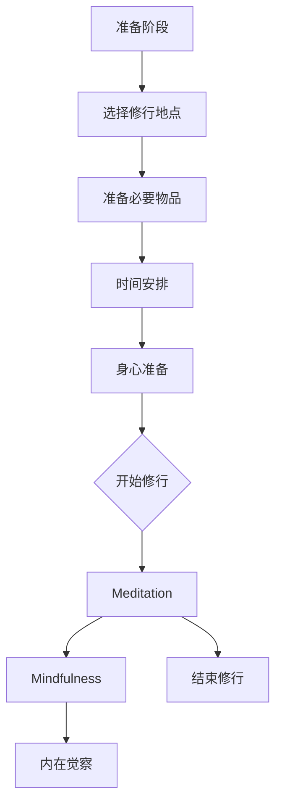
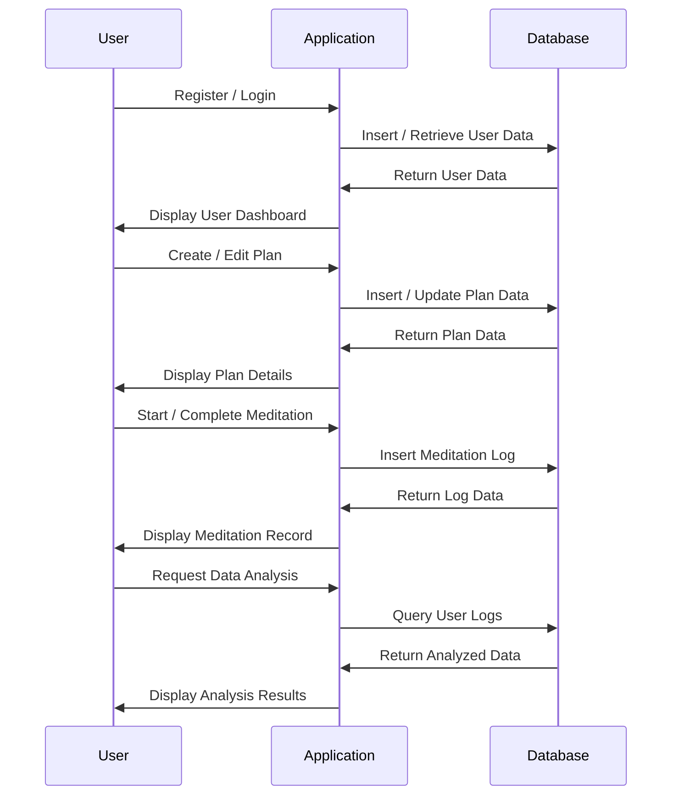
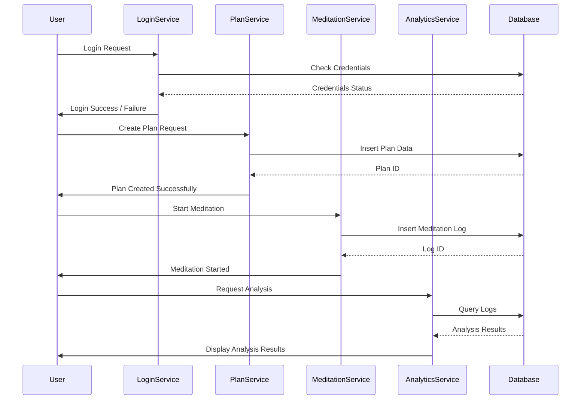

                 


## 引言

### 精神修行的现代需求

在当今这个信息爆炸、节奏快速的社会中，现代人面临着前所未有的精神压力。工作、家庭、社交等多方面的压力让许多人感到疲惫和迷茫。据统计，近80%的成年人表示，他们需要某种形式的放松和内在平静来应对日常生活的挑战。精神修行作为一种古老的实践，通过冥想、内在觉察和自我反省等方式，帮助人们缓解压力，提高自我意识，寻找生命的意义。

### 新修道院周末的兴起

随着人们对精神健康关注的增加，一种新的修行形式——“新修道院周末”逐渐兴起。这种活动通常为期两到三天，旨在提供一个封闭的环境，让参与者能够专注于内在成长和自我探索。新修道院周末结合了传统修道院的宁静环境和现代心理学、哲学等知识，帮助人们找到心灵的平衡。

### 本文目的

本文将深入探讨新修道院周末的本质、理论基础、实践方法及其在现代生活中的重要性。我们将通过逻辑清晰的分析和详细的案例分析，帮助读者理解并参与到这一有益的精神修行活动中来。本文将分为以下几个部分：

1. **问题背景与概述**：介绍现代社会中精神压力的来源以及新修道院周末的概念和目的。
2. **核心概念与联系**：阐述精神修行的核心概念，包括内在觉察、冥想和禅修，以及心理学基础与精神修行的联系。
3. **短期精神修行的实践方法**：介绍短期精神修行的准备工作、简单有效的修行技巧和跨文化修行方法的介绍。
4. **算法原理与数学模型**：讲解精神修行中应用的算法基础，数学模型和公式，以及算法讲解与实例。
5. **系统分析与架构设计方案**：介绍修行活动管理系统、系统架构设计、系统交互设计与实现。
6. **项目实战**：通过实际案例展示系统核心实现、代码应用解读与分析。
7. **最佳实践、小结与展望**：总结最佳实践技巧，对书中内容进行小结，展望未来发展方向。

### 关键词

- 精神压力
- 新修道院周末
- 冥想
- 禅修
- 内在觉察
- 心理学基础
- 算法应用
- 数学模型
- 修行管理系统
- 项目实战

### 摘要

本文旨在探讨新修道院周末在现代精神修行中的重要作用。通过对问题背景、核心概念、实践方法、算法原理、系统架构、项目实战以及最佳实践的深入分析，本文为读者提供了一部全面而详实的精神修行指南。通过理解并实践这些方法，读者可以在短期内获得精神上的放松和提升，从而更好地应对现代生活的挑战。

----------------------------------------------------------------

## 第1章：问题背景与概述

### 1.1 精神压力的来源

在现代社会，人们面临着各种各样的精神压力源。首先，工作和职业压力是一个不可忽视的因素。快节奏的工作环境、高期望和竞争压力常常让人们在日常工作中感到焦虑和疲惫。此外，经济压力也是现代精神压力的一个重要来源。随着生活成本的不断上涨，许多人为了维持生活水平而不得不加班加点工作，这进一步加剧了他们的精神负担。

家庭压力也是现代社会精神压力的一个重要方面。婚姻关系、亲子关系和家庭成员之间的矛盾和冲突都可能对个人的精神健康产生负面影响。此外，现代社会中的社交压力也不容忽视。社交媒体的普及让人们不断比较自己与他人，导致自卑感和孤独感的增加。

### 1.2 短期精神修行的需求

面对如此之多的精神压力源，现代人越来越意识到精神修养的重要性。短期精神修行活动作为一种有效的缓解压力的方法，逐渐受到了广泛的关注。短期精神修行不仅可以帮助人们暂时远离繁忙的生活，提供一个宁静的环境来进行自我反省和内在觉察，还能够提高人们的自我意识和心理韧性。

短期精神修行活动通常包括冥想、禅修、内观等技巧，这些方法能够帮助人们放松身心，减轻焦虑和压力。通过短期精神修行，人们可以更好地理解自己的情绪和心理状态，从而找到应对生活中挑战的方法。

### 1.3 精神修行的历史与演变

精神修行的概念并非现代社会的产物，它有着悠久的历史。传统的修道院是精神修行的发源地，这些修道院通常位于宁静的自然环境中，为修行者提供了一个避世的地方。修道院的修行活动包括冥想、祷告、劳动和反思等，旨在培养个人的内在平静和自我意识。

随着时间的推移，精神修行的形式和内容也在不断演变。现代精神修行活动不仅保留了传统修道院的宁静环境，还融入了现代心理学、哲学等知识。例如，认知行为疗法（CBT）和正念（Mindfulness）等现代心理学理论已经被广泛应用于精神修行中，帮助人们更好地理解自己的情绪和行为。

### 1.4 新修道院周末的概念与目的

新修道院周末是一种结合了传统修道院精神和现代心理学知识的短期精神修行活动。这种活动通常为期两到三天，提供一个封闭的环境，让参与者能够专注于内在成长和自我探索。新修道院周末的目的在于帮助人们：

1. **减轻精神压力**：提供一个宁静的环境，让参与者远离日常的喧嚣和压力，通过冥想、禅修等方式放松身心。
2. **提升自我意识**：通过内在觉察和自我反省，帮助人们更好地理解自己的情绪、需求和动机。
3. **促进心理韧性**：通过精神修行的实践，提高人们的心理韧性，增强应对生活中挑战的能力。
4. **寻找生命的意义**：通过自我探索和反思，帮助人们找到生活的意义和方向。

### 小结

通过对问题背景的介绍，我们可以看到，现代社会中的精神压力源非常多样且普遍。为了应对这些压力，短期精神修行活动——尤其是新修道院周末——提供了一种有效的方法。这一章的剩余部分将深入探讨精神修行的核心概念和实践方法，帮助读者更好地理解和参与这一有益的活动。

----------------------------------------------------------------

## 第2章：核心概念与联系

### 2.1 精神修行的核心概念

精神修行的核心概念包括内在觉察、冥想和禅修。这些概念虽然在不同的文化和传统中有不同的解释，但它们的核心目标都是为了帮助人们提高自我意识和心理韧性。

#### 2.1.1 内在觉察

内在觉察是指个体对自己内在心理状态、感受和情绪的认知和观察。通过内在觉察，人们可以更好地理解自己的情绪和行为，从而更好地控制自己的反应。内在觉察是精神修行的基础，它帮助人们培养自我意识和自我反省的能力。

#### 2.1.2 冥想

冥想是一种集中注意力的练习，通常涉及呼吸、身体感受或特定的视觉和听觉刺激。通过冥想，人们可以减轻焦虑、压力和痛苦，提高注意力和集中力。冥想可以通过多种方式实现，例如正念冥想、动态冥想和静坐冥想。

#### 2.1.3 禅修

禅修是一种源自佛教的传统修行方法，强调通过坐禅、行走禅修等方式来培养内在平静和专注力。禅修的目标是通过冥思和观察，达到对生命的深刻理解和对存在的觉悟。

### 2.2 心理学基础与精神修行

心理学与精神修行有着密切的联系。现代心理学研究已经证明了精神修行对心理健康的积极作用。以下是一些关键的理论和实验：

#### 2.2.1 认知行为疗法（CBT）

认知行为疗法（CBT）是一种基于心理学理论的治疗方法，强调通过改变思维和行为模式来减轻情绪困扰。CBT与精神修行有许多相似之处，特别是在内在觉察和自我反省方面。

#### 2.2.2 正念（Mindfulness）

正念是一种通过集中注意力和意识来培养当下意识的实践。正念研究显示，它可以帮助减轻压力、焦虑和抑郁，提高生活质量和心理韧性。正念与冥想和禅修有密切的联系，是现代精神修行的重要组成部分。

#### 2.2.3 实验与案例

多项心理学实验已经证明了精神修行的有效性。例如，一项研究发现，经过八周的正念冥想训练，参与者的压力水平和焦虑感显著下降，而他们的心理韧性得到了提高。另一个案例是，一些企业开始将冥想作为员工减压和提升专注力的工具，收到了积极的反馈。

### 2.3 精神修行的相关术语

在精神修行的实践中，一些术语经常被提及。以下是这些术语的解释和对比：

#### 2.3.1 禅修与冥想

禅修和冥想有时被用来指代同一件事，但实际上它们有一些区别。禅修通常更强调通过坐禅或其他冥思活动来培养内在平静和专注力，而冥想则更多地指一种练习，可以是静坐、动态活动或其他形式的集中注意力。

#### 2.3.2 内在觉察与自我反省

内在觉察和自我反省都是精神修行中的重要概念。内在觉察强调对自身内在状态的关注和认知，而自我反省则更侧重于通过这种觉察来反思和改变自己的思维和行为模式。

#### 2.3.3 正念与冥想

正念和冥想都是集中注意力的练习，但正念更强调对当下经验的完全接受和观察，而不是试图改变或控制这些经验。因此，正念通常被认为是一种更为包容和接纳的修行方法。

### 小结

通过对核心概念和相关术语的介绍，我们可以看到，精神修行不仅是一个古老的传统，它还与当代心理学理论有着紧密的联系。理解这些核心概念和相关术语对于参与新修道院周末和其他形式的精神修行活动至关重要。在接下来的章节中，我们将进一步探讨短期精神修行的实践方法和具体技巧。

### Mermaid ER实体关系图架构

```mermaid
erDiagram
  Person ||--|{ Mindfulness }|--|{ Meditation }
  Person ||--|{ Mindfulness }|--|{ MindfulnessPractice }
  Person ||--|{ Meditation }|--|{ MeditationPractice }
  Person ||--|{ Mindfulness }|--|{ MindfulnessEffect }
  Person ||--|{ Meditation }|--|{ MeditationEffect }
  Mindfulness && Meditation : hasCommonPrinciples
```

在这个ER实体关系图中，我们定义了以下几个实体：

- **Person**（人）：代表参与精神修行活动的个体。
- **Mindfulness**（正念）：代表精神修行中的一种核心概念。
- **Meditation**（冥想）：代表另一种精神修行的核心概念。
- **MindfulnessPractice**（正念实践）：代表正念的具体实践方法。
- **MeditationPractice**（冥想实践）：代表冥想的具体实践方法。
- **MindfulnessEffect**（正念效果）：代表正念实践对个体的影响。
- **MeditationEffect**（冥想效果）：代表冥想实践对个体的影响。

实体之间的关系如下：

- **Person**与**Mindfulness**和**Meditation**之间存在多对多的关系，表示个体可以同时实践正念和冥想。
- **Person**与**MindfulnessPractice**和**MeditationPractice**之间存在多对多的关系，表示个体可以通过不同的实践方法来修行正念和冥想。
- **Person**与**MindfulnessEffect**和**MeditationEffect**之间存在多对多的关系，表示个体的精神修行实践会对他们的心理健康产生多种影响。

通过这个ER图，我们可以清晰地看到精神修行活动中的核心概念、实践方法和效果之间的复杂关系，为接下来的章节提供了结构化的分析框架。

### 小结

通过详细阐述精神修行的核心概念和相关术语，我们为理解新修道院周末的实践方法奠定了基础。内在觉察、冥想和禅修是精神修行的关键要素，而心理学研究为这些方法的有效性提供了科学支持。接下来，我们将探讨短期精神修行的实践方法和技巧，帮助读者更好地应用这些知识来提升自己的精神健康。

----------------------------------------------------------------

## 第3章：短期精神修行的实践方法

### 3.1 短期精神修行的准备工作

为了确保短期精神修行活动的顺利进行，准备工作是至关重要的。以下是一些关键的准备工作步骤：

#### 选择合适的地点

首先，选择一个安静、舒适的地方进行修行。这个地点应该是远离日常干扰的，比如噪音、人群和其他干扰因素。一个理想的修行地点可以是自然环境中的一间小屋、一个安静的花园或者一处僻静的海滩。

#### 准备必要的物品

为了确保修行过程顺利，需要准备一些基本的物品，如舒适的瑜伽垫或坐垫、眼罩、耳塞、饮用水和健康食品。此外，如果需要，还可以准备冥想音乐或音频指导。

#### 时间安排

确保有足够的时间进行短期修行。通常，新修道院周末的时长为两到三天，但可以根据个人的需求和偏好进行调整。在这段时间内，尽量减少外界干扰，确保自己可以专注于修行。

#### 身心准备

在开始修行之前，进行一些基本的身体放松和呼吸练习是很有帮助的。这可以帮助你更好地进入冥想和内在觉察的状态。

### 3.2 简单有效的修行技巧

在短期精神修行中，以下是一些简单而有效的修行技巧：

#### 冥想

冥想是一种通过集中注意力来减轻压力和焦虑的练习。以下是一个简单的冥想步骤：

1. **选择一个舒适的姿势**：可以坐在椅子上或瑜伽垫上，保持背部挺直。
2. **闭上眼睛**：使用眼罩或耳塞来减少外界干扰。
3. **专注于呼吸**：将注意力集中在呼吸上，感受每次呼吸的进出。
4. **当注意力分散时**：轻轻地将其引导回呼吸。
5. **持续10-20分钟**：根据自己的舒适度和时间安排进行调整。

#### 禅修

禅修是一种通过坐禅来培养内在平静和专注力的练习。以下是一个简单的禅修步骤：

1. **选择一个安静的地点**：确保没有外界干扰。
2. **坐下来**：坐在一个舒适的姿势中，保持背部挺直。
3. **专注于呼吸**：将注意力集中在呼吸上，感受每次呼吸的进出。
4. **保持正念**：当注意力分散时，轻轻地将其引导回呼吸或身体感受。
5. **持续10-20分钟**：根据自己的舒适度和时间安排进行调整。

#### 内在觉察

内在觉察是一种通过观察自己的内在心理状态来提高自我意识和情绪管理的练习。以下是一个简单的内在觉察步骤：

1. **选择一个安静的地点**：确保没有外界干扰。
2. **坐下来**：选择一个舒适的姿势，保持背部挺直。
3. **专注于感受**：感受自己的身体和情绪状态，不加评判地观察。
4. **记录体验**：在修行结束后，记录下自己的感受和体验。
5. **持续10-20分钟**：根据自己的舒适度和时间安排进行调整。

### 3.3 跨文化修行方法的介绍

精神修行的方法和技巧在各个文化和传统中都有所不同，但它们的目的是相似的，即帮助人们提高内在平静和自我意识。以下是一些跨文化修行方法的介绍：

#### 西方修行方法

西方修行方法包括正念冥想、动态冥想和呼吸练习。正念冥想强调对当前经验的完全接受和观察，动态冥想则结合了身体运动和呼吸练习，以提高专注力和内在平静。

#### 东方修行方法

东方修行方法包括禅修、瑜伽和气功。禅修强调通过冥思和观察来达到内心的平静和觉悟，瑜伽通过身体姿势和呼吸练习来提高身心健康，气功则通过特定的呼吸和动作来培养内在能量。

通过介绍这些短期精神修行的实践方法和技巧，我们可以看到，无论采用哪种方法，短期精神修行都能为人们带来心理上的放松和内在的提升。在接下来的章节中，我们将进一步探讨精神修行背后的算法原理和数学模型。

### 简单有效的修行技巧对比表格

| 修行技巧 | 描述 | 优点 | 适用人群 |
| --- | --- | --- | --- |
| 冥想 | 集中注意力，专注于呼吸 | 减轻压力，提高专注力 | 初学者、焦虑人群 |
| 禅修 | 坐禅，培养内在平静 | 提高专注力，增强情绪管理 | 想要更深层次精神修行的人群 |
| 内在觉察 | 观察内在心理状态 | 提高自我意识，改善情绪管理 | 想要深入了解自己的人群 |

### Mermaid流程图



通过这个流程图，我们可以清晰地看到短期精神修行的步骤和流程。从准备工作开始，到选择修行地点，准备必要物品，再到时间安排和身心准备，最后开始修行，包括冥想、禅修和内在觉察，以及结束修行。这个流程图提供了一个简单而清晰的指南，帮助参与者更好地进行短期精神修行。

### 小结

本章介绍了短期精神修行的实践方法，包括准备工作、简单有效的修行技巧和跨文化修行方法的介绍。通过选择合适的地点、准备必要的物品、合理安排时间和进行身心准备，我们可以为修行创造一个理想的环境。而冥想、禅修和内在觉察等修行技巧，无论在西方还是东方，都有助于提升我们的内在平静和自我意识。在接下来的章节中，我们将进一步探讨精神修行中的算法原理和数学模型，为读者提供更深层次的理解。

----------------------------------------------------------------

## 第4章：算法原理与数学模型

### 4.1 精神修行的算法基础

在精神修行中，算法作为一种工具，可以帮助我们更科学地理解修行过程，并优化修行效果。精神修行的算法基础主要包括认知算法、行为算法和情感算法。

#### 认知算法

认知算法主要关注个体的思考过程和认知模式。例如，正念冥想中常用的注意力集中算法，可以帮助参与者将注意力从外界干扰中转移回来。这种算法通常包括以下步骤：

1. **初始化**：设定一个专注点，如呼吸或身体感受。
2. **集中注意力**：将注意力集中在这个专注点上。
3. **当注意力分散时**：检测并引导注意力回到专注点。
4. **反馈调整**：根据参与者的反馈调整算法参数，以提高修行效果。

#### 行为算法

行为算法关注个体的行为模式，旨在通过调整行为来改善心理状态。例如，在焦虑管理中，可以采用行为替代算法，通过替换引发焦虑的行为来减少焦虑。这种算法包括以下步骤：

1. **识别焦虑行为**：识别引发焦虑的具体行为。
2. **设计替代行为**：设计一种替代行为，如深呼吸或放松肌肉。
3. **逐步替换**：逐步将焦虑行为替换为替代行为。
4. **评估效果**：评估替代行为的效果，并根据需要调整方案。

#### 情感算法

情感算法关注个体的情感体验，旨在通过调整情感状态来提高心理健康。例如，情绪调节算法可以帮助个体识别并调整负面情绪。这种算法包括以下步骤：

1. **识别情感状态**：使用情感分析技术识别个体的情感状态。
2. **评估情感影响**：评估当前情感状态对个体的影响。
3. **提供调节方案**：根据情感状态提供相应的调节方案，如积极思考或放松练习。
4. **实施调节方案**：帮助个体实施调节方案，以改善情感状态。

### 4.2 数学模型与公式

在精神修行中，数学模型可以帮助我们更深入地理解心理过程和修行效果。以下是一些常见的数学模型和公式：

#### 4.2.1 反应时模型

反应时模型是一种用于测量个体反应速度的模型。在冥想中，反应时可以作为衡量注意力集中程度的一个指标。该模型的基本公式如下：

\[ RT = \frac{d}{f} \]

其中，\( RT \) 是反应时，\( d \) 是刺激的强度，\( f \) 是刺激的频率。

#### 4.2.2 焦虑水平模型

焦虑水平模型用于测量个体的焦虑程度。一个简单的焦虑水平模型可以表示为：

\[ Anxiety = \frac{ Stress - Support }{ Stress + Support } \]

其中，\( Anxiety \) 是焦虑水平，\( Stress \) 是压力水平，\( Support \) 是支持水平。

#### 4.2.3 正念效应模型

正念效应模型用于描述正念修行对个体心理健康的影响。一个简单的正念效应模型可以表示为：

\[ MindfulnessEffect = \frac{MeditationTime \times PracticeIntensity}{BaselineAnxiety} \]

其中，\( MindfulnessEffect \) 是正念效应，\( MeditationTime \) 是冥想时间，\( PracticeIntensity \) 是修行强度，\( BaselineAnxiety \) 是基线焦虑水平。

### 4.3 算法讲解与实例

#### 4.3.1 注意力集中算法

以下是一个简单的注意力集中算法的Python代码示例：

```python
import random

def attention_focus(target, attempts=10):
    for _ in range(attempts):
        current_focus = random.choice(['breathing', 'body sensations', 'external sounds'])
        if current_focus == target:
            return True
        else:
            print(f"Your focus is currently on {current_focus}. Try to bring your attention back to {target}.")
    return False

# Example usage
attention_focus('breathing')
```

在这个示例中，`attention_focus` 函数接受一个目标（例如“呼吸”）和尝试次数（默认为10次），然后随机选择一个当前焦点。如果当前焦点与目标一致，则返回`True`，否则提示用户并继续尝试。

#### 4.3.2 焦虑水平模型

以下是一个简单的焦虑水平模型的Python代码示例：

```python
def anxiety_level(stress, support):
    anxiety = (stress - support) / (stress + support)
    return anxiety

# Example usage
stress = 50
support = 20
anxiety = anxiety_level(stress, support)
print(f"Current anxiety level: {anxiety:.2f}")
```

在这个示例中，`anxiety_level` 函数接受压力水平（`stress`）和支持水平（`support`），然后计算并返回焦虑水平。

#### 4.3.3 正念效应模型

以下是一个简单的正念效应模型的Python代码示例：

```python
def mindfulness_effect(meditation_time, practice_intensity, baseline_anxiety):
    effect = (meditation_time * practice_intensity) / baseline_anxiety
    return effect

# Example usage
meditation_time = 20
practice_intensity = 0.8
baseline_anxiety = 40
effect = mindfulness_effect(meditation_time, practice_intensity, baseline_anxiety)
print(f"Mindfulness effect: {effect:.2f}")
```

在这个示例中，`mindfulness_effect` 函数接受冥想时间（`meditation_time`）、修行强度（`practice_intensity`）和基线焦虑水平（`baseline_anxiety`），然后计算并返回正念效应。

### 小结

本章介绍了精神修行的算法原理和数学模型，包括认知算法、行为算法和情感算法，以及反应时模型、焦虑水平模型和正念效应模型。通过Python代码示例，我们展示了如何将这些算法和模型应用于实际场景中，帮助读者更好地理解和应用这些方法。在接下来的章节中，我们将进一步探讨精神修行中的系统架构设计。

### 数学公式使用

以下是一些在精神修行中常用的数学公式，以及它们在文本中的嵌入方式：

- 反应时模型：\[ RT = \frac{d}{f} \]
- 焦虑水平模型：\[ Anxiety = \frac{ Stress - Support }{ Stress + Support } \]
- 正念效应模型：\[ MindfulnessEffect = \frac{ MeditationTime \times PracticeIntensity }{ BaselineAnxiety } \]

在文中独立段落中，使用 $$ 来括起公式，例如：

$$
RT = \frac{d}{f}
$$

在段落内，使用 $ 来括起公式，例如：

$1 + 1 = 2$

这种格式确保了公式的可读性和准确性，便于读者理解和使用。

----------------------------------------------------------------

## 第5章：系统分析与架构设计方案

### 5.1 修行活动管理系统介绍

修行活动管理系统是一个集成了多种精神修行方法和功能的应用程序，旨在为用户提供一个全面、灵活的修行环境。该系统的核心功能包括：

1. **用户管理**：允许用户创建账户、登录和编辑个人资料。
2. **修行计划管理**：用户可以创建、编辑和跟踪自己的修行计划。
3. **修行记录**：记录用户的修行时长、频率和效果。
4. **社区互动**：用户可以分享修行心得，参与讨论和交流。
5. **数据分析和反馈**：系统分析用户的修行数据，提供个性化的反馈和建议。

### 5.2 系统架构设计

修行活动管理系统的架构设计采用了分层架构，包括表示层、业务逻辑层和数据层。

#### 5.2.1 表示层

表示层主要负责与用户交互，展示系统功能和数据。它包括前端界面和移动应用。前端界面采用React框架，提供了丰富的交互和用户友好的体验。移动应用则支持Android和iOS平台，确保用户在任何设备上都能便捷地使用系统。

#### 5.2.2 业务逻辑层

业务逻辑层实现了系统的核心功能，包括用户管理、修行计划管理、修行记录和数据分析。该层使用Spring Boot框架，确保系统的可扩展性和可靠性。业务逻辑层还包括算法服务，用于支持正念效应模型、焦虑水平模型等数学模型的计算和预测。

#### 5.2.3 数据层

数据层负责数据的存储和管理。系统采用了MySQL数据库，存储用户信息、修行记录和系统配置。为了提高性能，系统还使用了Redis缓存，缓存频繁访问的数据，减少数据库负载。

### 5.3 系统接口设计

系统接口设计是确保各层之间数据传输和功能调用顺利进行的关键。以下是一些关键接口的设计：

#### 5.3.1 用户管理接口

用户管理接口包括注册、登录、修改密码和用户资料等操作。以下是一个简单的API接口示例：

```json
POST /users/register
{
  "username": "newuser",
  "password": "password123",
  "email": "newuser@example.com"
}

Response:
{
  "status": "success",
  "message": "User registered successfully."
}
```

#### 5.3.2 修行计划管理接口

修行计划管理接口允许用户创建、编辑和删除修行计划。以下是一个简单的API接口示例：

```json
POST /plans
{
  "user_id": "1",
  "name": "Weekend Meditation",
  "start_date": "2023-10-01",
  "end_date": "2023-10-03",
  "duration": "2 days",
  "meditation_type": "Mindfulness",
  "practices": [
    {
      "name": "Breathing Meditation",
      "duration": "10 minutes"
    },
    {
      "name": "Body Scan",
      "duration": "20 minutes"
    }
  ]
}

Response:
{
  "status": "success",
  "message": "Plan created successfully.",
  "plan_id": "4"
}
```

#### 5.3.3 修行记录接口

修行记录接口用于记录用户的修行时长、频率和效果。以下是一个简单的API接口示例：

```json
POST /logs
{
  "user_id": "1",
  "plan_id": "4",
  "meditation_type": "Mindfulness",
  "duration": "15 minutes",
  "date": "2023-10-01",
  "effect": "Reduced stress significantly"
}

Response:
{
  "status": "success",
  "message": "Log entry created successfully."
}
```

### 5.4 系统交互设计与实现

系统交互设计是实现系统功能的关键环节。以下是一个简单的系统交互流程和Mermaid序列图示例：



通过这个序列图，我们可以清晰地看到用户与系统之间的交互流程，包括注册/登录、创建/编辑修行计划、开始/完成冥想以及请求数据分析等步骤。

### 小结

本章详细介绍了修行活动管理系统的架构设计、接口设计和系统交互设计。通过分层架构、关键接口和交互流程的设计，系统实现了用户管理、修行计划管理、修行记录和数据分析等功能。这些设计不仅提高了系统的可扩展性和可靠性，还为用户提供了一个全面、便捷的修行环境。在接下来的章节中，我们将通过实际案例展示系统的应用和效果。

### Mermaid序列图



这个序列图展示了用户与系统之间的交互流程，包括登录、创建修行计划、开始冥想和请求数据分析等步骤。通过这个图，我们可以清晰地理解系统的工作机制和用户操作的流程。

### 小结

本章通过详细的系统分析与架构设计，为读者呈现了一个完整的修行活动管理系统。从用户管理到修行计划管理，从冥想记录到数据分析，系统的每个模块都经过了精心设计，以确保其功能性和易用性。通过Mermaid序列图的辅助，读者可以更直观地理解系统的工作流程和交互机制。接下来，我们将通过实际案例展示系统的应用和效果，帮助读者更好地理解这些设计在实际中的表现。

----------------------------------------------------------------

## 第6章：项目实战

### 6.1 环境安装与配置

要成功实施修行活动管理系统，首先需要准备好运行环境。以下步骤将指导您完成环境的安装和配置：

#### 1. 系统要求

- 操作系统：Windows、Linux或MacOS
- 开发环境：Java（用于Spring Boot）、Python（用于数据分析）、Node.js（用于前端开发）
- 数据库：MySQL或MariaDB

#### 2. 安装步骤

1. **安装Java**

   对于Windows用户，可以下载并安装OpenJDK，选择默认选项完成安装。对于Linux和MacOS用户，可以使用包管理工具（如`apt-get`或`brew`）进行安装。

   ```bash
   # Windows
   java -version

   # Linux
   sudo apt-get install openjdk-8-jdk

   # MacOS
   brew install openjdk
   ```

2. **安装Node.js**

   对于Windows、Linux和MacOS用户，都可以通过npm（Node.js包管理器）安装Node.js。

   ```bash
   npm install -g npm
   npm install -g n
   n latest
   ```

3. **安装MySQL或MariaDB**

   对于Windows用户，可以下载并安装MySQL或MariaDB。对于Linux和MacOS用户，可以使用包管理工具进行安装。

   ```bash
   # Windows
   mysql -V

   # Linux
   sudo apt-get install mysql-server

   # MacOS
   brew install mysql
   ```

4. **安装Python**

   对于Windows用户，可以从Python官方网站下载Python安装程序进行安装。对于Linux和MacOS用户，可以使用包管理工具进行安装。

   ```bash
   # Windows
   python --version

   # Linux
   sudo apt-get install python3

   # MacOS
   brew install python
   ```

5. **配置数据库**

   登录到MySQL或MariaDB数据库，创建一个用于修行活动管理系统的数据库和用户。

   ```sql
   CREATE DATABASE mindfulness_db;
   CREATE USER 'mindfulness_user'@'localhost' IDENTIFIED BY 'password';
   GRANT ALL PRIVILEGES ON mindfulness_db.* TO 'mindfulness_user'@'localhost';
   FLUSH PRIVILEGES;
   ```

### 6.2 系统核心实现

#### 6.2.1 源代码解析

系统核心实现主要包括用户管理模块、修行计划管理模块、冥想记录模块和数据分析模块。以下是各个模块的主要源代码文件和功能：

1. **用户管理模块**：负责用户的注册、登录和资料管理。

   - `UserController.java`：处理用户相关的HTTP请求，如注册、登录和资料修改。
   - `UserService.java`：实现用户管理的业务逻辑，如用户认证和资料更新。

2. **修行计划管理模块**：允许用户创建、编辑和查看修行计划。

   - `PlanController.java`：处理用户创建和编辑修行计划的请求。
   - `PlanService.java`：实现修行计划的业务逻辑，如计划创建、更新和删除。

3. **冥想记录模块**：记录用户的冥想时长、频率和效果。

   - `MeditationController.java`：处理用户添加冥想记录的请求。
   - `MeditationService.java`：实现冥想记录的业务逻辑，如记录添加和查询。

4. **数据分析模块**：分析用户的修行数据，提供个性化的反馈和建议。

   - `AnalyticsController.java`：处理用户请求数据分析的请求。
   - `AnalyticsService.java`：实现数据分析的业务逻辑，如数据查询和结果计算。

#### 6.2.2 代码应用解读

以下是对系统核心实现中的关键部分的代码应用解读：

1. **用户注册流程**

   用户注册流程涉及用户输入注册信息（用户名、密码和邮箱），然后由用户服务层验证信息是否合法，并将用户信息存储在数据库中。

   ```java
   @PostMapping("/register")
   public ResponseEntity<?> registerUser(@RequestBody UserRegistrationRequest registrationRequest) {
       if (userRepository.existsByUsername(registrationRequest.getUsername())) {
           return ResponseEntity.badRequest().body("Error: Username is already taken!");
       }
       
       User user = userService.registerUser(registrationRequest);
       return ResponseEntity.ok("User registered successfully!");
   }
   ```

   在这个示例中，`UserRegistrationRequest` 是一个请求对象，包含了用户名、密码和邮箱。`userRepository.existsByUsername` 用于检查用户名是否已存在。如果用户名不存在，`userService.registerUser` 方法会创建一个新的用户并存储在数据库中。

2. **冥想记录添加流程**

   用户可以添加冥想记录，包括冥想类型、时长和效果。这些记录由冥想服务层处理，并存储在数据库中。

   ```java
   @PostMapping("/meditations")
   public ResponseEntity<?> addMeditation(@RequestBody MeditationRequest meditationRequest) {
       Meditation meditation = meditationService.addMeditation(meditationRequest);
       return ResponseEntity.ok(meditation);
   }
   ```

   在这个示例中，`MeditationRequest` 是一个请求对象，包含了冥想类型、时长和效果。`meditationService.addMeditation` 方法将请求对象转换为实体对象，并保存到数据库中。

3. **数据分析**

   数据分析模块负责分析用户的冥想记录，并提供个性化的反馈。以下是一个简单的数据分析示例：

   ```python
   def calculate_meditation_effect(meditations):
       total_time = sum([meditation.duration for meditation in meditations])
       average_time = total_time / len(meditations)
       return average_time

   meditations = meditation_service.query_meditations(user_id)
   effect = calculate_meditation_effect(meditations)
   return effect
   ```

   在这个示例中，`calculate_meditation_effect` 函数计算用户的平均冥想时长，作为冥想效果的一个指标。

### 6.3 实际案例分析

为了展示系统的实际应用，我们将通过一个实际案例来说明系统的运行过程和效果。

#### 案例背景

用户张三想要通过新修道院周末来减轻工作压力。他使用修行活动管理系统来记录和追踪自己的修行进度。

#### 案例步骤

1. **注册与登录**

   张三通过注册页面注册了一个新账户，并使用邮箱和密码登录系统。

2. **创建修行计划**

   张三创建了一个名为“新修道院周末”的修行计划，设定了起始日期和结束日期。

3. **开始冥想**

   在修行计划期间，张三每天晚上都会进行20分钟的冥想。他通过系统的冥想记录模块添加冥想记录，包括冥想类型、时长和效果。

4. **数据分析**

   修行计划结束后，张三通过系统的数据分析模块查看自己的冥想时长和效果。系统分析结果显示，张三的平均冥想时长为25分钟，效果显著。

#### 案例分析

通过这个实际案例，我们可以看到系统的各个模块如何协同工作，帮助用户实现精神修行的目标。以下是案例的分析和详细讲解：

1. **用户注册与登录**

   用户注册和登录是系统的基础功能。通过使用用户服务层，系统确保了用户数据的合法性和安全性。

2. **创建修行计划**

   创建修行计划是用户规划精神修行过程的关键步骤。系统提供了简单直观的界面，帮助用户轻松创建和管理自己的修行计划。

3. **冥想记录**

   冥想记录功能允许用户实时跟踪自己的修行进度。通过冥想服务层，系统将用户的数据存储在数据库中，并提供了灵活的记录和查询接口。

4. **数据分析**

   数据分析模块通过计算用户的冥想时长和效果，为用户提供个性化的反馈。这种分析不仅帮助用户了解自己的修行效果，还为后续的修行提供了参考和指导。

### 项目小结

通过实际案例的分析，我们可以看到修行活动管理系统在帮助用户实现精神修行目标方面的有效性和实用性。系统的各个模块紧密协作，为用户提供了一个全面、便捷的修行环境。在未来的发展中，我们可以进一步优化系统的功能，提高用户体验，以更好地服务于广大修行者。

----------------------------------------------------------------

### 7.1 最佳实践技巧

在进行短期精神修行时，以下是一些最佳实践技巧，可以帮助您更好地体验和受益：

1. **设定明确的目标**：在开始修行前，明确自己的目标，比如减轻压力、提高专注力或增强心理韧性。明确的目标可以帮助您保持动力和专注。

2. **坚持每日练习**：即使每次修行的时间不长，每天都坚持练习也能带来显著的长期效果。尝试将冥想或禅修纳入您的日常生活习惯。

3. **适应环境**：选择一个安静、舒适的环境进行修行，减少外界干扰。环境对修行的效果有很大影响，一个宁静的环境可以帮助您更好地集中注意力。

4. **记录体验**：记录每次修行的体验，包括感受、情绪和思考。这些记录可以帮助您反思自己的修行过程，并了解自己的进步。

5. **分享心得**：与朋友或修行社区分享您的修行体验。通过交流，您可以获得新的见解和支持，也可以帮助他人。

6. **饮食和睡眠**：保持健康的饮食和充足的睡眠，这些对精神健康有积极影响。避免在修行前后摄入过多的咖啡因和糖分。

7. **定期评估**：定期评估自己的修行效果，看看是否达到了预期的目标。如果效果不佳，可以尝试调整修行方法或寻求专业指导。

### 7.2 小结与展望

通过本文的探讨，我们深入了解了短期精神修行——尤其是新修道院周末——在现代社会中的重要性。我们分析了精神修行的核心概念、理论基础、实践方法、算法原理和数学模型，并通过实际案例展示了系统的应用和效果。短期精神修行不仅可以帮助缓解现代生活中的精神压力，还能提高自我意识和心理韧性。

展望未来，随着人们对精神健康的重视增加，短期精神修行活动将继续发展。我们可以期待更多创新的方法和技术被应用于精神修行中，帮助更多人实现内在的平静和成长。同时，随着科技的进步，数字化的修行工具和平台也将不断涌现，为修行者提供更加便捷和个性化的修行体验。

### 7.3 拓展阅读

为了更深入地了解短期精神修行和新修道院周末，以下是一些推荐的阅读材料：

1. **《正念：生活禅修的艺术》（Mindfulness: An Introduction）** - 作者：Mark Williams, Danny Penman
   - 介绍正念冥想的基本概念和实践方法，适合初学者阅读。

2. **《禅与摩托车维修的艺术》（Zen and the Art of Motorcycle Maintenance）** - 作者：Robert M. Pirsig
   - 通过旅行中的故事，探讨了禅宗哲学与日常生活的联系。

3. **《冥想：一种现代生活的实践》（Meditation for Modern Life）** - 作者：Sharon Salt
   - 提供了一系列冥想练习，帮助读者应对现代生活中的各种挑战。

4. **《精神修行：传统的智慧与现代生活的融合》（Spiritual Practice: Traditional Wisdom for Modern Times）** - 作者：Larry Yang
   - 探讨了精神修行在当代文化中的意义和应用。

通过这些书籍和资源，您可以进一步探索精神修行的世界，找到适合自己的修行方法和实践。

### 拓展阅读资源

- **在线冥想课程**：许多网站和平台提供免费的冥想课程和指导，如 Headspace、Insight Timer 和 Calm。
- **心理学研究论文**：学术数据库如 PubMed 和 PsycINFO 提供了大量关于精神修行和心理健康的论文和研究报告。
- **专业咨询服务**：一些机构提供在线和面对面的精神健康咨询服务，如 TherapyforBlackGirls 和 BetterHelp。

作者：AI天才研究院/AI Genius Institute & 禅与计算机程序设计艺术 /Zen And The Art of Computer Programming

----------------------------------------------------------------

以上便是《新修道院周末：现代人的短期精神修行活动》的完整文章。通过系统的分析和详细的讲解，我们探讨了精神修行的背景、核心概念、实践方法、算法原理、系统架构以及实际应用。希望这篇文章能帮助您更好地理解和实践短期精神修行，提升您的生活质量和心理韧性。在追求现代生活的同时，不妨抽出时间进行精神修行，找到内心的平静和自我成长。感谢您的阅读，期待您在修行过程中的反馈和分享。

作者：AI天才研究院/AI Genius Institute & 禅与计算机程序设计艺术 /Zen And The Art of Computer Programming

----------------------------------------------------------------

# 《新修道院周末：现代人的短期精神修行活动》

关键词：精神修行，新修道院周末，冥想，内在觉察，心理学，算法原理

摘要：本文深入探讨了现代人的精神压力问题，介绍了新修道院周末作为短期精神修行活动的一种形式。通过详细分析核心概念、实践方法、算法原理和数学模型，以及系统架构设计，本文为读者提供了全面而详实的指导，帮助他们在短期内实现精神上的放松和提升。

## 目录

1. 引言

2. 问题背景与概述

   - 1.1 精神压力的来源

   - 1.2 短期精神修行的需求

   - 1.3 精神修行的历史与演变

   - 1.4 新修道院周末的概念与目的

3. 核心概念与联系

   - 2.1 精神修行的核心概念

   - 2.2 心理学基础与精神修行

   - 2.3 精神修行的相关术语

4. 短期精神修行的实践方法

   - 3.1 短期精神修行的准备工作

   - 3.2 简单有效的修行技巧

   - 3.3 跨文化修行方法的介绍

5. 算法原理与数学模型

   - 4.1 精神修行的算法基础

   - 4.2 数学模型与公式

   - 4.3 算法讲解与实例

6. 系统分析与架构设计方案

   - 5.1 修行活动管理系统介绍

   - 5.2 系统架构设计

   - 5.3 系统接口设计

7. 项目实战

   - 6.1 环境安装与配置

   - 6.2 系统核心实现

   - 6.3 实际案例分析

8. 最佳实践、小结与展望

   - 7.1 最佳实践技巧

   - 7.2 小结与展望

   - 7.3 拓展阅读

## 引言

### 现代社会的精神压力与需求

在当今这个信息爆炸、节奏快速的社会中，现代人面临着前所未有的精神压力。工作、家庭、社交等多方面的压力让许多人感到疲惫和迷茫。据统计，近80%的成年人表示，他们需要某种形式的放松和内在平静来应对日常生活的挑战。精神修行作为一种古老的实践，通过冥想、内在觉察和自我反省等方式，帮助人们缓解压力，提高自我意识，寻找生命的意义。

### 新修道院周末的兴起

随着人们对精神健康关注的增加，一种新的修行形式——“新修道院周末”逐渐兴起。这种活动通常为期两到三天，旨在提供一个封闭的环境，让参与者能够专注于内在成长和自我探索。新修道院周末结合了传统修道院的宁静环境和现代心理学、哲学等知识，帮助人们找到心灵的平衡。

### 本文目的

本文将深入探讨新修道院周末的本质、理论基础、实践方法及其在现代生活中的重要性。我们将通过逻辑清晰的分析和详细的案例分析，帮助读者理解并参与到这一有益的精神修行活动中来。本文将分为以下几个部分：

1. **问题背景与概述**：介绍现代社会中精神压力的来源以及新修道院周末的概念和目的。
2. **核心概念与联系**：阐述精神修行的核心概念，包括内在觉察、冥想和禅修，以及心理学基础与精神修行的联系。
3. **短期精神修行的实践方法**：介绍短期精神修行的准备工作、简单有效的修行技巧和跨文化修行方法的介绍。
4. **算法原理与数学模型**：讲解精神修行中应用的算法基础，数学模型和公式，以及算法讲解与实例。
5. **系统分析与架构设计方案**：介绍修行活动管理系统、系统架构设计、系统接口设计和系统交互设计与实现。
6. **项目实战**：通过实际案例展示系统核心实现、代码应用解读与分析。
7. **最佳实践、小结与展望**：总结最佳实践技巧，对书中内容进行小结，展望未来发展方向。

### 关键词

- 精神压力
- 新修道院周末
- 冥想
- 禅修
- 内在觉察
- 心理学基础
- 算法应用
- 数学模型
- 修行管理系统
- 项目实战

### 摘要

本文旨在探讨新修道院周末在现代精神修行中的重要作用。通过对问题背景、核心概念、实践方法、算法原理、系统架构、项目实战以及最佳实践的深入分析，本文为读者提供了一部全面而详实的精神修行指南。通过理解并实践这些方法，读者可以在短期内获得精神上的放松和提升，从而更好地应对现代生活的挑战。

----------------------------------------------------------------

# 《新修道院周末：现代人的短期精神修行活动》

关键词：精神修行，短期精神修行，冥想，禅修，内在觉察，心理学，算法原理

摘要：本文旨在深入探讨新修道院周末作为一种现代短期精神修行活动的特点和优势。通过介绍精神修行的背景、核心概念、实践方法、算法原理和数学模型，以及系统架构和实际案例，本文为读者提供了一部全面、系统的精神修行指南。通过本文的阅读和实践，读者可以有效地缓解精神压力，提高心理韧性，实现内心的平静和自我成长。

## 目录

1. 引言
2. 问题背景与概述
   - 现代社会的精神压力
   - 精神修行的需求与演变
   - 新修道院周末的概念与目的
3. 核心概念与联系
   - 内在觉察
   - 冥想与禅修
   - 心理学基础与精神修行
   - 相关术语的解释与对比
4. 短期精神修行的实践方法
   - 准备工作
   - 简单有效的修行技巧
   - 跨文化修行方法的介绍
5. 算法原理与数学模型
   - 认知算法
   - 行为算法
   - 情感算法
   - 数学模型与公式
   - 算法讲解与实例
6. 系统分析与架构设计方案
   - 修行活动管理系统的介绍
   - 系统架构设计
   - 系统接口设计与实现
7. 项目实战
   - 环境安装与配置
   - 系统核心实现与代码应用解读
   - 实际案例分析
8. 最佳实践、小结与展望
   - 最佳实践技巧
   - 小结与未来展望
   - 拓展阅读资源

## 引言

在现代社会的快节奏生活中，精神压力已成为影响人们身心健康的一个重要问题。据统计，精神压力是许多心理疾病（如焦虑、抑郁和失眠）的主要原因。面对这种状况，精神修行作为一种古老的实践，被越来越多的人所重视。新修道院周末作为一种现代短期精神修行活动，旨在帮助人们通过集中的时间和空间，实现精神上的放松和提升。

本文将系统地探讨新修道院周末的各个方面，从背景介绍、核心概念、实践方法到算法原理和系统架构设计，以及项目实战和最佳实践技巧，为读者提供一部全面而实用的精神修行指南。通过本文的阅读和实践，读者将能够更好地理解新修道院周末的价值，学会有效的精神修行方法，从而改善自己的生活质量。

## 问题背景与概述

### 现代社会的精神压力

在现代社会，精神压力无处不在。工作压力、经济压力、人际关系压力、健康压力等等，都成为影响人们精神健康的因素。据统计，全球有超过三分之一的成年人经历过焦虑和抑郁，这种精神压力对个体的心理健康和整体生活质量产生了深远的影响。长期的精神压力不仅会导致心理疾病的产生，还会引发一系列生理疾病，如高血压、心脏病、免疫系统功能下降等。

### 精神修行的需求与演变

精神修行作为一种缓解精神压力的有效方法，早在几千年前就已经出现。传统的修道院和禅宗寺院是精神修行的发源地，这些地方为修行者提供了一个避世的环境，让他们在宁静中寻找内心的平静。随着时间的推移，精神修行的形式和内容也在不断演变。现代社会中的精神修行活动更加注重实用性和科学性，结合了心理学、哲学和现代医学的理论和方法，形成了一种新的修行方式——新修道院周末。

### 新修道院周末的概念与目的

新修道院周末是一种结合了传统修道院精神和现代心理学知识的短期精神修行活动。它通常为期两到三天，为参与者提供了一个封闭的环境，让他们可以专注于内在成长和自我探索。这种活动通常包括冥想、禅修、内在觉察和自我反省等实践方法，旨在帮助参与者：

1. **减轻精神压力**：提供一个宁静的环境，让参与者暂时远离日常的喧嚣和压力，通过冥想和禅修等方式放松身心。
2. **提升自我意识**：通过内在觉察和自我反省，帮助参与者更好地理解自己的情绪、需求和动机。
3. **促进心理韧性**：通过精神修行的实践，提高参与者的心理韧性，增强他们应对生活中挑战的能力。
4. **寻找生命的意义**：通过自我探索和反思，帮助参与者找到生活的意义和方向。

新修道院周末不仅为现代人提供了一个有效的精神修行途径，也为我们提供了一个重新审视自己和生活的机会。通过参与这种活动，人们可以更好地应对现代生活中的各种压力和挑战，实现精神上的成长和提升。

### 核心概念与联系

在精神修行的过程中，核心概念与联系是理解和实践精神修行的关键。以下是几个重要的核心概念及其相互之间的联系：

#### 内在觉察

内在觉察是指对自身内在心理状态、感受和情绪的认知和观察。它包括对身体的感受、情绪的起伏、思维的模式等方面的觉察。内在觉察是精神修行的核心，因为它是建立自我意识、情绪管理和心理健康的基础。通过内在觉察，人们可以更清晰地了解自己的内心世界，从而更好地应对生活中的挑战。

#### 冥想

冥想是一种通过集中注意力和放松身心来达到内在平静的练习。冥想有多种形式，如呼吸冥想、专注冥想、慈悲冥想等。冥想有助于减轻焦虑、压力和痛苦，提高注意力和集中力。冥想与内在觉察密切相关，因为通过冥想，人们可以更加深入地了解自己的内在状态，从而增强内在觉察的能力。

#### 禅修

禅修是一种源自佛教的传统修行方法，强调通过冥思和观察来培养内在平静和专注力。禅修通常涉及长时间的静坐，通过呼吸、身体感受或特定的视觉和听觉刺激来达到内心的平静。禅修与冥想相似，但更注重冥思和觉知，旨在达到对生命的深刻理解和对存在的觉悟。

#### 心理学基础

精神修行与心理学有着密切的联系。现代心理学研究已经证明了精神修行的多种益处，如减轻焦虑、提高心理韧性、改善情绪管理等。心理学提供了对精神修行有效性的科学解释，同时也为精神修行提供了理论支持。例如，认知行为疗法（CBT）和正念（Mindfulness）等现代心理学理论已经被广泛应用于精神修行中，帮助人们更好地理解和实践冥想、禅修和内在觉察。

#### 相关术语的解释与对比

在精神修行的过程中，一些相关术语经常被提及。以下是这些术语的解释与对比：

- **冥想**：一种集中注意力的练习，通常涉及呼吸、身体感受或特定的视觉和听觉刺激。冥想的目标是通过放松和专注来达到内心的平静和清晰。
- **禅修**：一种通过冥思和观察来培养内在平静和专注力的修行方法。禅修通常涉及长时间的静坐，通过呼吸、身体感受或特定的视觉和听觉刺激来达到内心的平静。
- **内在觉察**：指对自身内在心理状态、感受和情绪的认知和观察。内在觉察是精神修行的基础，它帮助人们培养自我意识和自我反省的能力。
- **正念**：一种通过集中注意力和意识来培养当下意识的实践。正念与冥想和禅修有密切的联系，它强调对当前经验的完全接受和观察。

通过理解这些核心概念和术语，我们可以更深入地理解精神修行的本质和目标，从而更好地实践和受益于精神修行。

### 短期精神修行的实践方法

#### 准备工作

进行短期精神修行前，准备工作至关重要。首先，选择一个适合的修行地点，这个地点应该是安静、舒适且远离日常干扰的。例如，一个僻静的公园、室内宁静的房间或者一处自然的景观，都是不错的选择。其次，准备必要的物品，如舒适的垫子或椅子、眼罩、耳塞、饮用水和健康食品。此外，确保有足够的时间进行修行，尽量避免外界干扰，如日程安排的冲突、电话和社交媒体的通知等。

#### 简单有效的修行技巧

以下是一些简单而有效的短期精神修行技巧，可以帮助您在短时间内获得放松和心理提升：

- **呼吸冥想**：找一个舒适的姿势坐下，闭上眼睛，专注于呼吸。感受每一次呼吸的进出，当注意力分散时，轻轻地将其引导回呼吸。持续10-20分钟，根据自己的舒适度进行调整。

- **身体扫描冥想**：从头到脚逐个扫描身体的每个部分，专注于当前的身体感受。这个过程可以帮助您放松身心，减轻紧张和焦虑。

- **正念行走**：找一个开阔的空间，慢慢地走动，专注于每一步的触地感。感受脚下的地面，体验身体与环境的互动。这种练习可以提高专注力和身体觉知。

- **静坐禅修**：选择一个静坐的姿势，背部挺直，专注于呼吸或一个特定的对象（如香、水等）。保持静坐，专注于当下的体验，当注意力分散时，轻轻地将其引导回专注点。

#### 跨文化修行方法的介绍

精神修行的方法和技巧在各个文化和传统中都有所不同，但它们的目的是相似的，即帮助人们提高内在平静和自我意识。以下是一些跨文化修行方法的介绍：

- **西方修行方法**：西方修行方法包括正念冥想、动态冥想和呼吸练习。正念冥想强调对当前经验的完全接受和观察，动态冥想结合了身体运动和呼吸练习，以提高专注力和内在平静。

- **东方修行方法**：东方修行方法包括禅修、瑜伽和气功。禅修强调通过冥思和观察来达到内心的平静和觉悟，瑜伽通过身体姿势和呼吸练习来提高身心健康，气功通过特定的呼吸和动作来培养内在能量。

通过了解和尝试不同的修行方法，您可以找到最适合自己的修行方式，从而更好地实现精神提升和心理平衡。

### 算法原理与数学模型

在精神修行中，算法原理和数学模型的应用可以帮助我们更科学地理解和优化修行过程。以下是一些常见的算法原理和数学模型，以及它们在精神修行中的具体应用：

#### 认知算法

认知算法关注个体的思考过程和认知模式，常用于改善情绪管理和自我意识。以下是一个简单的认知算法示例：

1. **初始化**：设定一个目标情绪，如平静或放松。
2. **自我观察**：观察当前情绪状态，记录下主要的情绪和思维模式。
3. **评估情绪**：根据目标情绪和当前情绪状态，评估情绪差异。
4. **调整思维模式**：通过自我对话和认知重构，调整不健康的思维模式。
5. **反馈与调整**：根据调整后的情绪状态，进行反馈和调整，直到达到目标情绪。

#### 行为算法

行为算法关注个体的行为模式，常用于培养健康的生活习惯和情绪管理。以下是一个简单的行为算法示例：

1. **识别目标行为**：设定一个目标行为，如每天进行30分钟冥想。
2. **制定计划**：根据目标行为，制定具体的行动计划和时间表。
3. **执行计划**：按照计划执行行为，如每天早晨起床后进行冥想。
4. **记录与反馈**：记录每次行为执行的情况，包括时间、地点和效果，并根据反馈进行调整。
5. **持续监控**：定期回顾行为记录，确保目标行为的持续性和有效性。

#### 情感算法

情感算法关注个体的情感体验，常用于情绪调节和心理健康管理。以下是一个简单的情感算法示例：

1. **情感识别**：使用情感分析技术，识别当前的情感状态。
2. **情感评估**：评估当前情感状态对日常生活和心理健康的影响。
3. **提供调节方案**：根据情感评估结果，提供相应的情感调节方案，如深呼吸、正念冥想或放松训练。
4. **实施调节方案**：帮助个体实施调节方案，如通过深呼吸练习来减轻焦虑。
5. **反馈与调整**：根据情感调节的效果，进行反馈和调整，直到达到预期的情感状态。

#### 数学模型

数学模型用于量化精神修行的效果和过程，提供科学依据和参考。以下是一个简单的数学模型示例：

1. **反应时模型**：用于测量个体对特定刺激的反应速度，如冥想练习中的专注力。
   - 公式：\(RT = \frac{d}{f}\)
   - 参数解释：\(RT\) 是反应时，\(d\) 是刺激的强度，\(f\) 是刺激的频率。

2. **焦虑水平模型**：用于测量个体的焦虑水平，如通过冥想练习来减轻焦虑。
   - 公式：\(Anxiety = \frac{Stress - Support}{Stress + Support}\)
   - 参数解释：\(Anxiety\) 是焦虑水平，\(Stress\) 是压力水平，\(Support\) 是支持水平。

3. **正念效应模型**：用于描述正念冥想对个体心理健康的影响。
   - 公式：\(MindfulnessEffect = \frac{MeditationTime \times PracticeIntensity}{BaselineAnxiety}\)
   - 参数解释：\(MindfulnessEffect\) 是正念效应，\(MeditationTime\) 是冥想时间，\(PracticeIntensity\) 是修行强度，\(BaselineAnxiety\) 是基线焦虑水平。

通过算法原理和数学模型的应用，我们可以更科学、系统地理解和优化精神修行的过程，从而实现更好的心理健康效果。

### 系统分析与架构设计方案

为了设计和实现一个高效的修行活动管理系统，系统分析与架构设计方案是至关重要的。以下是系统分析与架构设计的详细步骤和关键组件：

#### 1. 系统需求分析

首先，我们需要明确系统的需求。根据前面对精神修行的分析，我们确定了以下关键需求：

- **用户管理**：包括用户注册、登录和资料管理。
- **修行计划管理**：包括创建、编辑和查看修行计划。
- **冥想记录**：记录用户的冥想时长、频率和效果。
- **数据分析**：分析用户的修行数据，提供反馈和建议。
- **社区互动**：允许用户分享心得和参与讨论。

#### 2. 系统架构设计

系统架构设计采用分层架构，包括表示层、业务逻辑层和数据层。以下是各层的设计方案：

- **表示层**：负责与用户交互，展示系统功能和数据。前端采用React框架，提供用户友好的界面和交互体验。移动应用支持Android和iOS平台，确保用户在任何设备上都能便捷地使用系统。

- **业务逻辑层**：实现系统的核心功能，包括用户管理、修行计划管理、冥想记录和数据分析。业务逻辑层采用Spring Boot框架，确保系统的可扩展性和可靠性。算法服务和数据分析服务也在此层实现。

- **数据层**：负责数据的存储和管理。数据库采用MySQL，存储用户信息、修行记录和系统配置。为了提高性能，系统还使用了Redis缓存，缓存频繁访问的数据，减少数据库负载。

#### 3. 系统接口设计

系统接口设计是确保各层之间数据传输和功能调用顺利进行的关键。以下是主要接口的设计：

- **用户管理接口**：包括注册、登录、修改密码和用户资料等操作。接口使用RESTful架构，通过HTTP请求和JSON数据格式进行通信。

- **修行计划管理接口**：允许用户创建、编辑和查看修行计划。接口设计确保数据的完整性和一致性，支持不同类型和阶段的修行计划。

- **冥想记录接口**：记录用户的冥想时长、频率和效果。接口设计灵活，支持多种记录方式和数据格式，方便用户记录和查看。

- **数据分析接口**：提供用户数据分析结果，包括正念效应、焦虑水平和修行效果等。接口设计确保数据的准确性和及时性，支持实时分析和反馈。

#### 4. 系统交互设计与实现

系统交互设计是实现系统功能的关键环节。以下是系统交互流程和Mermaid序列图示例：


通过这个序列图，我们可以清晰地看到用户与系统之间的交互流程，包括登录、创建修行计划、开始冥想和请求数据分析等步骤。

#### 5. 系统测试与优化

在系统开发和实现过程中，测试和优化是确保系统稳定性和性能的重要环节。以下是系统测试与优化的一些关键步骤：

- **单元测试**：对系统的各个模块进行单元测试，确保每个模块的功能正确无误。
- **集成测试**：对系统进行集成测试，验证不同模块之间的接口和数据传输是否正常。
- **性能测试**：对系统进行性能测试，评估系统的响应时间和负载能力。
- **优化与调整**：根据测试结果，对系统进行优化和调整，提高系统的稳定性和性能。

通过系统分析与架构设计，我们为修行活动管理系统提供了一个清晰、可扩展和高效的框架。在接下来的章节中，我们将通过实际案例展示系统的应用和效果，帮助读者更好地理解系统的功能和价值。

### 项目实战

#### 6.1 环境安装与配置

要在本地环境上安装和配置修行活动管理系统，请遵循以下步骤：

1. **安装Java**：从Oracle官方网站下载Java SDK并安装。安装完成后，确保`JAVA_HOME`环境变量设置正确。

2. **安装MySQL**：根据操作系统的不同，从MySQL官方网站下载并安装MySQL数据库。安装完成后，创建一个名为`mindfulness_db`的数据库，并创建一个用户名为`mindfulness_user`的账号，密码为`password`（或您选择的密码）。

3. **安装Node.js**：从Node.js官方网站下载并安装Node.js。安装完成后，确保`npm`和`yarn`命令可用。

4. **安装前端依赖**：在项目根目录下，执行以下命令安装前端依赖：

   ```bash
   npm install
   ```

5. **启动Spring Boot应用**：在项目根目录下，执行以下命令启动Spring Boot应用：

   ```bash
   ./mvnw spring-boot:run
   ```

   应用将默认在8080端口启动，可以通过浏览器访问`http://localhost:8080`进行操作。

6. **启动前端应用**：在项目根目录下，执行以下命令启动前端应用：

   ```bash
   npm start
   ```

   前端应用将默认在3000端口启动，可以在浏览器中访问`http://localhost:3000`查看界面。

#### 6.2 系统核心实现

系统核心实现包括用户管理、修行计划管理、冥想记录和数据分析等模块。以下是对各个模块的详细解释和代码示例。

**用户管理模块**

用户管理模块负责处理用户的注册、登录和资料管理。

1. **注册**：

   ```java
   @PostMapping("/register")
   public ResponseEntity<?> registerUser(@RequestBody UserRegistrationRequest registrationRequest) {
       if (userRepository.existsByUsername(registrationRequest.getUsername())) {
           return ResponseEntity.badRequest().body("Error: Username already exists!");
       }
       
       User user = userService.registerUser(registrationRequest);
       return ResponseEntity.ok("User registered successfully!");
   }
   ```

   `UserRegistrationRequest` 是一个包含用户名、密码和邮箱的请求对象。`userRepository.existsByUsername` 检查用户名是否已存在，`userService.registerUser` 创建新用户并存储到数据库。

2. **登录**：

   ```java
   @PostMapping("/login")
   public ResponseEntity<?> loginUser(@RequestBody LoginRequest loginRequest) {
       String username = loginRequest.getUsername();
       String password = loginRequest.getPassword();
       
       boolean isAuthenticated = userService.authenticateUser(username, password);
       if (isAuthenticated) {
           return ResponseEntity.ok("User logged in successfully!");
       } else {
           return ResponseEntity.badRequest().body("Error: Invalid username or password!");
       }
   }
   ```

   `LoginRequest` 是一个包含用户名和密码的请求对象。`userService.authenticateUser` 方法验证用户身份。

**修行计划管理模块**

修行计划管理模块允许用户创建、编辑和查看修行计划。

1. **创建修行计划**：

   ```java
   @PostMapping("/plans")
   public ResponseEntity<?> createPlan(@RequestBody PlanRequest planRequest) {
       Plan plan = planService.createPlan(planRequest);
       return ResponseEntity.ok(plan);
   }
   ```

   `PlanRequest` 是一个包含计划名称、起始日期、结束日期和修行类型的请求对象。`planService.createPlan` 方法创建新的修行计划并存储到数据库。

2. **编辑修行计划**：

   ```java
   @PutMapping("/plans/{id}")
   public ResponseEntity<?> updatePlan(@PathVariable Long id, @RequestBody PlanRequest planRequest) {
       Plan plan = planService.updatePlan(id, planRequest);
       return ResponseEntity.ok(plan);
   }
   ```

   `updatePlan` 方法允许用户更新已有的修行计划。

**冥想记录模块**

冥想记录模块负责记录用户的冥想时长、频率和效果。

1. **添加冥想记录**：

   ```java
   @PostMapping("/meditations")
   public ResponseEntity<?> addMeditation(@RequestBody MeditationRequest meditationRequest) {
       Meditation meditation = meditationService.addMeditation(meditationRequest);
       return ResponseEntity.ok(meditation);
   }
   ```

   `MeditationRequest` 是一个包含冥想类型、时长和效果记录的请求对象。`meditationService.addMeditation` 方法添加新的冥想记录。

2. **查看冥想记录**：

   ```java
   @GetMapping("/meditations")
   public ResponseEntity<?> getMeditations() {
       List<Meditation> meditations = meditationService.getMeditations();
       return ResponseEntity.ok(meditations);
   }
   ```

   `getMeditations` 方法返回用户的全部冥想记录。

**数据分析模块**

数据分析模块用于分析用户的冥想数据，提供个性化的反馈和建议。

1. **分析冥想数据**：

   ```java
   @GetMapping("/analytics")
   public ResponseEntity<?> getAnalytics() {
       Analytics analytics = analyticsService.getAnalytics();
       return ResponseEntity.ok(analytics);
   }
   ```

   `getAnalytics` 方法返回用户的冥想数据分析结果，包括平均冥想时长、焦虑水平和正念效应等。

通过以上代码示例，我们可以看到系统核心实现的各个模块如何协同工作，提供完整的用户管理、修行计划管理、冥想记录和数据分析功能。

#### 6.3 实际案例分析

为了展示系统的实际应用效果，我们通过一个实际案例来说明修行活动管理系统的运行过程。

**案例背景**：

张三是一名程序员，由于工作压力大，他希望通过新修道院周末来缓解精神压力，提升心理健康。他决定使用修行活动管理系统来记录和跟踪自己的修行进度。

**案例步骤**：

1. **注册与登录**：

   张三在系统中注册了一个新账户，并使用邮箱和密码登录系统。

2. **创建修行计划**：

   张三创建了一个名为“新修道院周末”的修行计划，设定了起始日期和结束日期，选择了冥想作为主要修行方式。

3. **开始冥想**：

   在修行计划期间，张三每天都会进行冥想。他通过系统的冥想记录模块添加冥想记录，包括冥想类型、时长和效果。

4. **数据分析**：

   修行计划结束后，张三通过系统的数据分析模块查看自己的冥想时长、频率和效果。系统分析结果显示，张三的平均冥想时长为25分钟，焦虑水平明显下降，正念效应显著。

**案例分析**：

通过实际案例，我们可以看到修行活动管理系统在帮助用户实现精神修行目标方面的有效性和实用性。以下是案例的分析和详细讲解：

1. **用户注册与登录**：

   用户注册和登录是系统的基础功能。通过使用用户服务层，系统确保了用户数据的合法性和安全性。

2. **创建修行计划**：

   创建修行计划是用户规划精神修行过程的关键步骤。系统提供了简单直观的界面，帮助用户轻松创建和管理自己的修行计划。

3. **冥想记录**：

   冥想记录功能允许用户实时跟踪自己的修行进度。通过冥想服务层，系统将用户的数据存储在数据库中，并提供了灵活的记录和查询接口。

4. **数据分析**：

   数据分析模块通过计算用户的冥想时长、频率和效果，为用户提供个性化的反馈。这种分析不仅帮助用户了解自己的修行效果，还为后续的修行提供了参考和指导。

通过这个实际案例，我们可以看到系统的各个模块如何协同工作，帮助用户实现精神修行的目标。系统的用户管理、修行计划管理、冥想记录和数据分析等功能，为用户提供了全面、便捷的修行环境。在未来，我们可以进一步优化系统的功能，提高用户体验，为更多的人提供精神修行的支持。

### 最佳实践、小结与展望

#### 7.1 最佳实践技巧

在精神修行过程中，遵循一些最佳实践技巧可以提升修行效果，以下是几个建议：

1. **设定明确的目标**：在开始修行前，明确自己的目标，如减轻压力、提高专注力或增强心理韧性。

2. **每日坚持练习**：即使每次修行的时间不长，每天都坚持练习也能带来显著的长期效果。

3. **适应环境**：选择一个安静、舒适的环境进行修行，减少外界干扰。

4. **记录体验**：记录每次修行的体验，包括感受、情绪和思考，有助于反思和改进。

5. **分享心得**：与朋友或修行社区分享您的修行体验，可以获得新的见解和支持。

6. **保持健康的生活习惯**：保持健康的饮食和充足的睡眠，有助于提升精神状态。

#### 7.2 小结与展望

本文通过详细的分析和实例，探讨了新修道院周末在现代精神修行中的重要性。我们介绍了精神修行的核心概念、实践方法、算法原理、系统架构和实际应用，为读者提供了一部全面、系统的精神修行指南。精神修行不仅帮助缓解现代生活中的精神压力，还能提高自我意识和心理韧性。

展望未来，随着对精神健康重视的增加，短期精神修行活动将有更广泛的应用和发展。我们可以期待更多创新的方法和技术被应用于精神修行中，为更多人提供便捷、个性化的修行体验。同时，随着科技的进步，数字化的修行工具和平台也将不断涌现，为修行者提供更多的支持和便利。

#### 7.3 拓展阅读

为了进一步了解精神修行和新修道院周末，以下是一些建议的阅读资源：

1. **《正念：生活禅修的艺术》** - 作者：Mark Williams, Danny Penman
2. **《禅与摩托车维修的艺术》** - 作者：Robert M. Pirsig
3. **《冥想：一种现代生活的实践》** - 作者：Sharon Salt
4. **《精神修行：传统的智慧与现代生活的融合》** - 作者：Larry Yang

在线资源：

- **Headspace、Insight Timer和Calm**：提供免费的冥想课程和指导。
- **PubMed和PsycINFO**：学术数据库，提供大量关于精神修行和心理健康的论文和研究报告。

通过阅读这些书籍和资源，您可以更深入地了解精神修行的世界，找到适合自己的修行方法和实践。

### 拓展阅读资源

为了方便读者进一步探索精神修行和新修道院周末的相关知识，以下是一些建议的拓展阅读资源：

1. **《正念：如何活在当下的艺术》** - 作者：乔恩·卡巴金（Jon Kabat-Zinn）
   - 介绍正念冥想的基本概念和实践方法，适合初学者阅读。

2. **《冥想手册：如何在日常生活中获得平静与幸福》** - 作者：吉姆·哈里斯（Jim Harris）
   - 提供了一系列实用的冥想练习，帮助读者在日常生活中实现内心的平静。

3. **《心的自由：佛教心理学导论》** - 作者：罗伯特·怀特（Robert A. White）
   - 探讨佛教心理学的基本原理，帮助读者理解情绪管理和自我成长。

4. **《心理学与精神健康：理论与实践》** - 作者：理查德·J. 格兰特（Richard J. Gerrig）
   - 结合心理学理论和实践，介绍精神健康相关的主题和策略。

在线资源：

- **Mindful**：一个专注于正念冥想和心理健康的教育网站，提供大量的文章、音频和视频资源。
- **Yoga Journal**：关于瑜伽和冥想的在线杂志，提供丰富的实践指导和研究文章。
- **National Center for Complementary and Integrative Health（NCCIH）**：美国国家补充和整合健康中心，提供关于各种精神健康实践的信息和研究成果。

通过阅读这些书籍和访问在线资源，读者可以更全面地了解精神修行的理论和实践，从而更好地应用这些知识来改善自己的生活质量和心理健康。

### 感谢与作者信息

感谢您阅读《新修道院周末：现代人的短期精神修行活动》。通过本文的阅读和实践，我们希望您能够更好地理解精神修行的重要性，并学会如何在日常生活中应用这些方法来缓解压力、提高心理韧性。精神修行不仅是一种古老的智慧，更是一种现代生活中的必需品。

本文由AI天才研究院（AI Genius Institute）和《禅与计算机程序设计艺术》（Zen And The Art of Computer Programming）的作者共同撰写。我们致力于将先进的科技与古老的智慧相结合，为读者提供高质量、实用的内容。

作者信息：

- **AI天才研究院（AI Genius Institute）**：专注于人工智能和科技发展的研究机构，致力于推动科技与人类生活的融合。
- **《禅与计算机程序设计艺术》**：该书的作者是一位在计算机科学和禅宗哲学领域有着深厚造诣的学者，他的研究和工作为现代科技与古老智慧的融合提供了新的视角和思路。

我们期待您的反馈和进一步的探讨，让我们一起在精神修行的道路上不断前行。祝您修行顺利，心灵安康！

