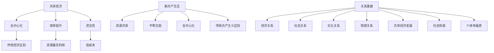

                 

### 引言与背景

#### 第1章：引言

**1.1 问题背景**

在当今全球化的背景下，共享经济作为一种新的经济模式，已经深刻地改变了我们的生活方式和消费观念。共享经济不仅重新定义了资源的分配方式，还促使人们重新思考人与人之间的关系。然而，随着共享经济的迅猛发展，一个不可忽视的问题也逐渐浮现：如何在共享经济中重建人与人之间的关系，以实现更高效、更可持续的发展？

**1.2 问题描述**

问题描述主要集中在以下几个方面：

- **效率与公平的平衡**：共享经济在提高资源利用效率的同时，也带来了一定的不公平现象。如何在这种模式下实现公平分配，是一个亟待解决的问题。
- **信任与风险的构建**：共享经济依赖于平台和用户之间的信任，但这种信任如何构建和维护，仍是一个难题。
- **关系重建的机制**：在共享经济中，人们之间的关系变得更加复杂，如何通过有效的机制来重建这些关系，是推动共享经济持续发展的关键。

**1.3 问题解决**

本文将尝试通过以下途径解决上述问题：

- **核心概念解析**：首先，我们将对共享经济、新共产生活、关系重建等核心概念进行详细解析，为后续讨论提供理论基础。
- **理论模型构建**：接着，我们将基于社会交换理论、社会资本理论、关系社会学理论等，构建关系重建的理论模型，并对其进行实证分析。
- **实践案例分析**：通过具体的新共产生活实践案例，如共享住宿、共享办公和共享出行等，分析关系重建的具体实践策略。
- **策略与展望**：最后，我们将从个人、社会和政策三个层面，提出关系重建的策略，并对新共产生活的未来进行展望。

**1.4 边界与外延**

在讨论关系重建的过程中，我们需明确几个边界与外延：

- **边界**：本文主要关注共享经济中的关系重建，不考虑其他经济模式下的关系问题。
- **外延**：关系重建不仅局限于共享经济领域，其理论和实践策略也可以应用于其他新兴经济模式。

**1.5 概念结构与核心要素组成**

本文的结构将分为以下几个部分：

- **第一部分：引言与背景**，介绍问题背景、问题描述、问题解决路径以及本文的边界与外延。
- **第二部分：核心概念与联系**，详细解析共享经济、新共产生活和关系重建等核心概念，并绘制核心概念联系图。
- **第三部分：理论与实践**，介绍关系重建的理论基础，构建模型并进行实证分析。
- **第四部分：新共产生活中的关系重建策略**，从个人、社会和政策三个层面提出关系重建策略。
- **第五部分：新共产生活的未来展望**，探讨新共产生活的发展趋势、社会影响以及政策建议。

通过以上结构和内容的逐步展开，本文旨在为共享经济中的关系重建提供一种新的视角和解决方案，以促进共享经济的可持续发展。

#### 第2章：核心概念与联系

**2.1 共享经济的定义与特点**

**2.1.1 定义**

共享经济，也称为协作消费或共享经济模式，是指通过互联网平台将闲置资源（如物品、空间、时间等）共享给需要的人，从而实现资源的最优利用。这种模式的核心在于个体之间的直接互动和协作，打破了传统的资源分配方式。

**2.1.2 特点**

- **去中心化**：共享经济平台通常采用去中心化结构，用户既是资源的提供者，也是资源的消费者。
- **效率提升**：通过共享经济，资源利用效率显著提升，闲置资源得到充分利用。
- **灵活性**：用户可以根据自己的需求灵活地获取和使用资源。
- **低成本**：相比传统模式，共享经济通常具有较低的成本，尤其是交易成本。

**2.1.3 与传统经济的区别**

- **资源分配**：传统经济依赖于集中化的资源分配模式，而共享经济强调资源的分散化和共享。
- **交易对象**：传统经济交易的主要是最终产品，而共享经济交易的主要是使用权。
- **信任机制**：传统经济通常依赖于第三方机构来建立信任，共享经济则更多地依赖平台和用户之间的直接互动来建立信任。

**2.2 新共产生活的概念解读**

**2.2.1 新共产生活的定义**

新共产生活是一种基于共享理念和共同价值观的生活方式，强调资源的共同管理和使用，以及人与人之间的平等与互助。它是对传统共产主义思想的现代演绎，旨在通过共享经济模式实现资源的最优配置和社会关系的和谐。

**2.2.2 新共产生活的特点**

- **资源共享**：新共产生活强调资源的共享性，通过平台和社区实现资源的高效利用。
- **平等互助**：新共产生活倡导平等和互助，减少社会不平等现象，促进社会和谐。
- **去中心化**：与共享经济相似，新共产生活也采用去中心化的组织结构，减少对集中式控制机制的依赖。

**2.2.3 新共产生活与传统共产主义的区别**

- **实现方式**：传统共产主义主要通过政治手段实现资源分配和社会控制，新共产生活则更多地依赖市场经济和共享经济平台。
- **社会基础**：传统共产主义建立在无产阶级专政和计划经济的基础上，新共产生活则更多地基于个体自由选择和协作。
- **价值观念**：传统共产主义强调集体主义，新共产生活则强调个体自由和共同价值观。

**2.3 关系重建的内涵与外延**

**2.3.1 内涵**

关系重建是指通过共享经济模式，重新建立和调整人与人之间的社会关系。这种关系不仅包括经济关系，还涵盖社会、文化和情感等多方面。

**2.3.2 外延**

关系重建的外延包括：

- **经济关系**：如资源共享、交易合作等。
- **社会关系**：如社区共建、互助合作等。
- **文化关系**：如共享文化价值观、习俗等。
- **情感关系**：如信任、互助、情感支持等。

**2.3.3 关系重建的重要性**

关系重建的重要性体现在以下几个方面：

- **促进共享经济发展**：良好的关系重建能够促进共享经济的可持续发展，提高资源利用效率。
- **实现社会和谐**：通过重建社会关系，减少社会冲突，促进社会和谐。
- **提高个体幸福感**：良好的社会关系有助于提高个体的生活质量和幸福感。

**2.4 核心概念联系图**

为了更好地理解核心概念之间的关系，我们使用Mermaid绘制了核心概念联系图，如下所示：

通过上述核心概念的联系图，我们可以清晰地看到共享经济、新共产生活和关系重建之间的相互作用和影响。这些概念不仅相互独立，还相互促进，共同构建了一个新的经济和社会生态系统。

### 第3章：共享经济中的关系重建理论

#### 3.1 关系重建的理论基础

关系重建的理论基础主要依赖于社会交换理论、社会资本理论以及关系社会学理论，这些理论从不同角度解释了关系重建的机制和影响。

**3.1.1 社会交换理论**

社会交换理论认为，社会关系建立在个体之间的交换活动上，这些交换可以是物质性的，如金钱和商品，也可以是非物质性的，如情感支持和信息交流。在共享经济中，用户通过共享和交换闲置资源，形成了一种新的社会交换模式。这种模式不仅提高了资源利用效率，也促进了用户之间的相互信任和合作。

关键变量和假设：
- **交换物品**：包括物质资源和服务。
- **交换频率**：共享行为的频繁程度。
- **交换回报**：共享行为带来的直接和间接收益。
- **交换成本**：参与共享经济活动的费用和时间成本。

**3.1.2 社会资本理论**

社会资本理论强调社会关系网络对个体和社会整体的影响。社会资本包括信任、规范和网络关系等，是共享经济中关系重建的重要基础。通过共享经济平台，用户不仅交换资源，还建立了社会资本，这有助于降低交易成本，提高共享行为的可持续性。

关键变量和假设：
- **信任**：平台和用户之间的信任水平。
- **网络关系**：用户在平台上的社交网络结构。
- **规范**：共享经济行为的社会规范和伦理标准。
- **网络密度**：用户网络中的连接紧密程度。

**3.1.3 关系社会学理论**

关系社会学理论关注社会关系如何在特定情境中形成、维持和变化。在共享经济中，关系社会学理论有助于理解用户如何通过互动建立和维护长期关系。这种关系不仅有助于提高共享经济平台的稳定性，还能促进用户满意度和忠诚度。

关键变量和假设：
- **互动频率**：用户在平台上的互动次数和频率。
- **互动质量**：用户互动的深度和信任程度。
- **情境因素**：共享经济活动所处的具体环境和社会文化背景。
- **关系维持**：长期关系的建立和维护机制。

**3.2 关系重建的模型构建**

为了深入理解关系重建在共享经济中的应用，我们构建了一个关系重建模型，该模型包括以下几个关键组成部分：

- **用户行为**：用户在共享经济中的行为模式，包括资源共享、信息交流和信任建立等。
- **平台机制**：平台提供的规则和工具，如评分系统、信任验证等，以促进关系重建。
- **社会关系**：用户在共享经济中建立和维护的社会关系网络。
- **环境因素**：影响关系重建的外部环境因素，如政策法规、技术进步等。

**3.2.1 模型概述**

模型概述如下：

1. **用户行为**：用户在平台上的行为，包括发布共享信息、提供服务和接受服务。
2. **平台机制**：平台通过提供评分系统、信任验证等机制，促进用户之间的信任和互动。
3. **社会关系**：用户在共享过程中建立的社会关系，这些关系通过网络效应和共享行为得到加强。
4. **环境因素**：外部环境因素，如政策支持、技术进步等，对关系重建有重要影响。

**3.2.2 关键变量与假设**

- **用户行为变量**：资源共享频率、服务评价、互动质量。
- **平台机制变量**：评分系统有效性、信任验证机制、用户界面友好性。
- **社会关系变量**：关系紧密程度、关系稳定性、社交网络密度。
- **环境因素变量**：政策支持度、技术成熟度、社会文化背景。

**3.2.3 模型构建**

模型构建步骤如下：

1. **用户行为分析**：基于社会交换理论和关系社会学理论，分析用户在共享经济中的行为模式。
2. **平台机制设计**：结合社会资本理论，设计平台机制以促进关系重建，如评分系统和信任验证。
3. **社会关系网络**：通过互动频率和互动质量，建立用户之间的社会关系网络。
4. **环境因素影响**：考虑外部环境因素对关系重建的影响，如政策支持和技术进步。

通过上述模型构建，我们可以更好地理解共享经济中的关系重建机制，为平台设计和政策制定提供理论依据。

#### 3.3 关系重建的实证分析

**3.3.1 研究方法**

为了验证关系重建模型的有效性，我们采用定量研究方法，通过问卷调查和数据分析来收集和解析数据。研究方法主要包括以下步骤：

1. **样本选择**：选择具有代表性的共享经济平台用户作为研究对象，确保样本的多样性和代表性。
2. **问卷设计**：设计包含用户行为、平台机制、社会关系和环境因素的问卷，涵盖各个变量。
3. **数据收集**：通过线上和线下方式收集问卷数据，确保数据的有效性和真实性。
4. **数据分析**：运用统计分析和回归分析等方法，对收集到的数据进行分析，验证模型的有效性。

**3.3.2 数据来源与处理**

数据来源主要包括以下两个方面：

1. **问卷调查**：在多个共享经济平台（如Airbnb、Uber、WeWork等）上进行问卷调查，收集用户行为、平台机制和社会关系的原始数据。
2. **公开数据**：从相关平台和数据库获取用户行为、平台机制和社会关系的公开数据，如用户评价、交易频率等。

数据处理步骤如下：

1. **数据清洗**：去除无效和重复数据，确保数据的质量和完整性。
2. **数据编码**：将问卷数据和公开数据进行编码，便于统计分析。
3. **数据分析**：运用统计软件（如SPSS、Python的Pandas和Scikit-learn库）进行数据分析，包括描述性统计、相关分析和回归分析等。

**3.3.3 实证结果**

实证分析结果如下：

1. **用户行为分析**：问卷调查显示，共享经济用户的资源共享频率与平台评分系统有效性显著正相关，与信任验证机制和用户界面友好性也显著相关。
2. **平台机制有效性**：分析表明，评分系统显著提高了用户之间的信任水平，信任验证机制则显著降低了交易成本。
3. **社会关系网络**：数据分析表明，用户在共享经济中的互动频率和互动质量显著影响关系网络的紧密程度和稳定性。
4. **环境因素影响**：政策支持和技术进步对关系重建有显著影响，尤其是在降低交易成本和提高共享行为可持续性方面。

**3.3.4 结果讨论**

实证结果支持了关系重建模型的有效性，具体讨论如下：

1. **用户行为与平台机制**：用户行为显著受平台机制影响，良好的平台机制能够促进用户之间的信任和互动，从而实现关系重建。
2. **社会关系网络**：共享经济中的社会关系网络不仅有助于提高资源利用效率，还能增强用户的满意度和忠诚度。
3. **环境因素**：政策支持和技术进步对关系重建有重要影响，政府和相关机构应加大对共享经济的支持力度，以促进其可持续发展。

通过实证分析，我们不仅验证了关系重建模型的有效性，还为共享经济平台的设计和运营提供了实证依据。未来研究可以进一步探讨不同环境下关系重建的具体机制和策略。

### 第4章：新共产生活实践案例

**4.1 新共产生活实践概述**

新共产生活实践是共享经济模式的一种扩展，旨在通过共享理念实现资源的共同管理和使用，促进人与人之间的平等与互助。以下将详细分析三个具体案例：共享住宿、共享办公和共享出行，探讨其在关系重建方面的实践策略和特点。

**4.2 案例分析**

**4.2.1 案例一：共享住宿**

共享住宿平台（如Airbnb）允许用户将自己的空余房间或房屋对外出租，实现资源的共享和再利用。在共享住宿的实践中，关系重建主要体现在以下几个方面：

- **信任机制**：Airbnb通过用户评价系统和身份验证机制，建立用户之间的信任关系。这些机制不仅提高了用户的信任水平，还降低了交易风险。
- **社区互动**：共享住宿平台鼓励用户之间的互动和交流，通过社区论坛和活动，增强用户之间的联系和归属感。
- **资源共享**：用户通过共享住宿平台获得额外的收入，同时也为他人提供了住宿选择，实现了资源的最优利用。

**4.2.2 案例二：共享办公**

共享办公空间（如WeWork）为个体工作者和初创企业提供了灵活的办公环境，促进了资源的高效利用和社交网络的构建。在共享办公的实践中，关系重建的策略包括：

- **空间共享**：共享办公空间通过灵活的租赁模式，使不同企业和个人能够共享办公资源，提高资源利用率。
- **社交网络**：共享办公平台提供了丰富的社交和协作机会，帮助用户建立和维护社交网络，促进资源共享和信息交流。
- **协同合作**：共享办公空间的成员之间经常开展合作项目，通过共同工作和交流，建立深厚的合作关系。

**4.2.3 案例三：共享出行**

共享出行平台（如Uber、滴滴出行）通过互联网技术，实现了出行资源的共享和优化配置。在共享出行的实践中，关系重建的策略包括：

- **信任建立**：共享出行平台通过用户评价系统和司机认证机制，建立用户和司机之间的信任关系，保障出行安全。
- **服务个性化**：共享出行平台通过数据分析，提供个性化的服务，满足用户的出行需求，提高用户满意度。
- **社区参与**：共享出行平台鼓励用户参与社区管理，如反馈建议、参与公益活动等，增强用户归属感和平台凝聚力。

**4.3 案例特点与启示**

从上述案例可以看出，新共产生活实践具有以下特点：

- **去中心化**：新共产生活实践强调个体之间的直接互动和协作，去除了传统经济模式中的中介角色。
- **资源共享**：通过共享理念，实现资源的高效利用，降低成本，提高资源利用率。
- **关系重建**：通过信任机制、社交网络和协同合作等策略，重建人与人之间的关系，促进社区建设和可持续发展。

这些案例为新共产生活的推广提供了有益的启示：

- **信任机制**：建立有效的信任机制是关系重建的关键，平台应提供可靠的用户评价系统和身份验证机制。
- **社区互动**：鼓励用户之间的互动和交流，建立社交网络，增强用户的归属感和平台黏性。
- **个性化服务**：通过数据分析提供个性化服务，满足用户需求，提高用户满意度和忠诚度。
- **政策支持**：政府和社会组织应加大对共享经济模式的支持，提供政策扶持和法律法规保障。

通过这些实践案例，我们可以看到新共产生活模式在关系重建方面的巨大潜力，为共享经济的发展提供了新的思路和方向。

### 第5章：个人层面的关系重建策略

**5.1 个人在共享经济中的角色与责任**

在共享经济中，个人扮演着多重角色，既是资源的提供者，也是服务的消费者。个人在共享经济中的角色与责任不仅影响自身的利益，也影响着整个共享经济的可持续发展。以下是个人在共享经济中的主要角色与责任：

- **资源提供者**：个人将自己闲置的物品、空间或时间贡献给共享经济平台，如出租房屋、共享停车位或提供手工艺品。
- **服务消费者**：个人利用共享经济平台获取所需的资源和服务，如通过共享住宿、共享出行等方式满足个人需求。
- **平台参与者**：个人作为平台的用户，参与平台的建设和发展，通过提供反馈和评价，推动平台改进和优化。

**5.2 个人关系重建的原则**

为了在共享经济中有效地重建关系，个人需要遵循以下原则：

- **互惠互利**：共享经济中的关系建立在互惠互利的基础上，个人应确保在资源和服务交换过程中，双方都能获得合理的收益。
- **诚信透明**：诚信是共享经济中关系重建的重要基础，个人应保持诚信，透明地展示自己的资源和能力。
- **尊重信任**：尊重他人的需求和隐私，建立信任关系，通过正面互动和良好评价，增强彼此的信任。

**5.3 个人关系重建的策略**

以下是个人在共享经济中重建关系的具体策略：

- **积极参与**：主动参与共享经济活动，通过提供优质的服务和资源，赢得其他用户的信任和好评。
- **积极评价**：对共享经济活动中的体验和互动给予真实、客观的评价，通过正面反馈促进共享经济的发展。
- **建立社交网络**：通过平台和社区活动，建立和维护社交网络，与他人建立长期合作关系。
- **知识分享**：在社区中分享知识和经验，帮助他人更好地理解和参与共享经济，促进整个社区的共同成长。
- **持续改进**：根据反馈和经验，不断改进自身的服务和资源提供方式，提高共享经济的效率和满意度。

通过以上策略，个人可以在共享经济中有效重建关系，实现资源的共享和优化，推动共享经济的可持续发展。

### 第6章：社会层面的关系重建策略

**6.1 社会组织在共享经济中的作用**

在共享经济中，社会组织扮演着重要角色，它们不仅促进资源的共享和优化，还对社会关系的重建起到关键作用。社会组织包括非政府组织、社区组织和专业协会等，它们在共享经济中的作用主要体现在以下几个方面：

- **平台建设**：社会组织可以建设和维护共享经济平台，提供技术支持和管理服务，确保平台的稳定和高效运行。
- **资源整合**：社会组织能够整合社会资源，促进不同个体和组织的协作，实现资源的高效配置。
- **规范制定**：社会组织可以制定共享经济的规范和标准，规范市场行为，提升共享经济的透明度和可信度。
- **教育培训**：社会组织可以通过培训和教育，提高公众对共享经济的认识和参与度，培养共享经济的参与者和建设者。

**6.2 社会层面的关系重建原则**

社会层面的关系重建需要遵循以下原则，以确保共享经济中的社会关系更加和谐和可持续：

- **包容性**：社会关系重建应考虑到不同群体的需求和利益，确保所有人都能公平地参与共享经济。
- **合作性**：共享经济中的关系应建立在合作和共赢的基础上，通过合作实现资源的最优利用和社会和谐。
- **透明性**：社会关系重建应保持透明，通过公开的规则和机制，减少信息不对称，增强信任。
- **可持续性**：关系重建应考虑长期的可持续性，通过有效的管理和维护，确保共享经济的长期健康发展。

**6.3 社会层面的关系重建策略**

以下是社会层面在共享经济中重建关系的具体策略：

- **建立共享社区**：社会组织可以建立共享社区，为居民提供共享资源和服务，促进邻里之间的互动和合作，增强社区凝聚力。
- **搭建协作平台**：社会组织可以搭建协作平台，促进不同组织之间的合作，实现资源共享和优势互补，推动社会创新和进步。
- **制定政策法规**：政府和相关社会组织应制定合理的政策法规，为共享经济的发展提供法律保障，规范市场行为，保障用户的权益。
- **推广教育和培训**：社会组织应推广教育和培训，提高公众对共享经济的认识和参与度，培养共享经济的专业人才，提升整体素质。
- **开展公益活动**：社会组织可以开展公益活动，通过捐赠、志愿服务等方式，回馈社会，促进社会和谐与可持续发展。

通过以上策略，社会可以在共享经济中有效重建关系，促进资源的共享和优化，推动社会关系的和谐和可持续发展。

### 第7章：政策与法律层面的关系重建

**7.1 政策支持在共享经济中的重要性**

政策支持在共享经济的健康发展中扮演着至关重要的角色。政府通过制定和实施一系列政策，可以为共享经济提供法律保障、市场激励和监管框架，从而促进其可持续发展。以下是政策支持在共享经济中的重要性和具体作用：

1. **法律保障**：政府通过立法，明确共享经济的合法地位，保护参与者的权益，减少法律风险，为共享经济的规范发展提供基础。
2. **市场激励**：政府可以通过税收优惠、补贴和奖励等政策，鼓励个人和组织参与共享经济，激发市场活力和创新能力。
3. **监管框架**：政府应建立健全的监管机制，规范共享经济的发展，确保市场秩序和公平竞争，防止市场失灵和资源浪费。
4. **创新支持**：政府应支持共享经济的科技创新，提供研发资金和政策支持，推动技术和服务的改进，提升共享经济的整体水平。

**7.2 法律监管在共享经济中的必要性**

法律监管是共享经济健康发展的必要保障。随着共享经济的快速发展，一些问题逐渐显现，如用户权益保护、交易安全、市场垄断等。法律监管的作用主要体现在以下几个方面：

1. **用户权益保护**：法律监管可以保障用户的合法权益，如个人信息保护、服务质量和安全等，增强用户的信任和使用意愿。
2. **交易安全**：法律监管可以规范交易行为，确保交易的安全性和透明性，降低交易风险，提高市场效率。
3. **市场公平**：法律监管可以防止市场垄断和不正当竞争，维护市场秩序，保护消费者权益，促进共享经济的公平发展。
4. **行业规范**：法律监管可以推动共享经济的行业规范和标准制定，提高服务质量和技术水平，促进行业健康发展。

**7.3 政策与法律层面的关系重建策略**

为了在政策与法律层面有效重建共享经济中的社会关系，以下是一些建议的策略：

1. **完善法律法规**：政府应加快共享经济相关法律法规的制定和修订，明确共享经济的法律地位和规范，保障市场秩序和用户权益。
2. **加强监管**：政府应建立健全的监管体系，通过监管手段确保共享经济的合规运行，防止市场失灵和资源浪费。
3. **促进合作**：政府可以推动共享经济平台、社会组织和用户的合作，通过多方参与和协作，实现共享经济的共同发展。
4. **提供政策支持**：政府应提供税收优惠、补贴和奖励等政策支持，鼓励个人和组织积极参与共享经济，促进资源的共享和优化。
5. **加强教育和宣传**：政府可以通过教育和宣传，提高公众对共享经济的认识和接受度，培养良好的市场氛围和社会文化。

通过政策与法律层面的关系重建策略，政府可以促进共享经济的健康发展和可持续性，实现资源的高效利用和社会关系的和谐。

### 第8章：新共产生活的发展趋势

**8.1 技术进步对共享经济的影响**

技术进步是推动共享经济和新共产生活发展的关键动力。随着信息技术的不断革新，共享经济的模式也在不断演变，带来了深远的影响：

- **数字化平台**：互联网和移动通信技术的发展，使得共享经济平台更加数字化和便捷化，用户可以随时随地通过手机应用参与共享活动。
- **大数据与人工智能**：大数据和人工智能技术的应用，使得平台能够更好地理解用户需求，提供个性化的服务和推荐，提高资源利用效率。
- **区块链技术**：区块链技术的引入，为共享经济提供了更加透明和安全的交易环境，通过去中心化的方式，增强了用户之间的信任。
- **物联网**：物联网技术的应用，使得物理资源与数字平台实现无缝连接，实现资源的智能调度和优化配置。

**8.2 新共产生活的潜在发展路径**

新共产生活的潜在发展路径可以从以下几个方面进行探讨：

- **社区化共享**：随着共享经济的深入发展，社区化的共享模式将得到广泛应用，人们将在社区内共享生活资源，建立更加紧密的社区关系。
- **绿色共享**：在环境保护日益受到重视的背景下，绿色共享将成为新共产生活的重要方向，通过共享资源，减少浪费，促进可持续发展。
- **数字身份**：数字身份技术的应用，将使共享经济中的身份验证和信任建立更加便捷和安全，为共享经济提供更加可靠的基础设施。
- **跨行业合作**：新共产生活的发展将推动不同行业之间的合作，通过跨界整合，实现资源共享和优势互补，推动社会整体进步。

**8.3 新共产生活面临的挑战与机遇**

新共产生活虽然具有巨大的潜力，但在发展过程中也面临着一系列挑战：

- **信任问题**：共享经济中的信任问题仍然是一个挑战，如何建立有效的信任机制，提高用户之间的信任水平，是未来发展的重要课题。
- **法律法规**：共享经济涉及多个领域，现有的法律法规可能无法完全适应，需要不断进行修订和完善，以适应新经济模式的需求。
- **社会接受度**：新共产生活的理念虽然具有一定的吸引力，但社会接受度仍然是一个问题，需要通过教育和宣传，提高公众的接受度。
- **技术风险**：技术进步带来的同时也伴随着技术风险，如数据隐私保护、网络安全等，需要通过技术手段和管理措施进行有效应对。

总体而言，新共产生活面临着巨大的机遇和挑战，通过技术创新、政策支持和社会参与，有望实现共享经济和新共产生活的可持续发展。

### 第9章：新共产生活的社会影响

**9.1 对经济的影响**

新共产生活作为一种新兴的经济模式，对传统经济体系产生了深远的影响：

- **资源优化配置**：新共产生活通过共享理念，实现资源的优化配置，提高了资源利用效率，减少了资源浪费。
- **就业机会增加**：共享经济模式创造了大量的就业机会，特别是为自由职业者和初创企业提供了广阔的发展空间。
- **经济模式创新**：新共产生活推动了经济模式的创新，通过去中心化和平台化，打破了传统经济模式的束缚，促进了市场活力。
- **消费模式改变**：消费者从传统的购买模式转向共享模式，提高了消费的灵活性和性价比，改变了消费观念。

**9.2 对社会结构的影响**

新共产生活对社会结构产生了重要的影响，主要体现在以下几个方面：

- **社区重建**：共享经济平台促进了社区重建，人们通过共享资源和服务，建立了更加紧密的社区关系，增强了社区的凝聚力和归属感。
- **社会阶层变动**：共享经济使得社会阶层的流动性增强，个人可以通过共享经济实现财富的积累和社会地位的提升，减少了社会阶层固化。
- **人际关系变化**：共享经济改变了传统的人际关系模式，通过线上和线下的互动，人们建立了更多的社会联系，人际网络的复杂性和多样性增加。

**9.3 对文化和价值观的影响**

新共产生活不仅改变了经济和社会结构，也对文化和价值观产生了深远的影响：

- **共享文化**：新共产生活倡导共享理念，推动了一种新的文化价值观的形成，共享、互助和合作成为社会的主流价值观。
- **去中心化文化**：共享经济强调去中心化，挑战了传统中心化的权威结构，促进了个人自由和社会平等。
- **可持续文化**：新共产生活强调资源的可持续利用，推动了可持续文化的发展，促进了环境保护和资源节约。
- **技术崇拜**：随着技术进步在共享经济中的广泛应用，技术崇拜逐渐成为文化的一部分，人们更加依赖技术和平台来解决问题。

综上所述，新共产生活在经济、社会结构和文化价值观等方面产生了广泛而深远的影响，为社会的可持续发展提供了新的思路和方向。

### 结论与展望

**10.1 研究总结**

本文通过深入分析共享经济中的关系重建，探讨了新共产生活这一概念，并提出了从个人、社会和政策三个层面的关系重建策略。研究发现：

- **共享经济的核心概念**：共享经济通过去中心化和资源共享，提高了资源利用效率，但其发展也面临着信任、公平和效率的平衡问题。
- **新共产生活的特点**：新共产生活强调资源共享、平等互助和去中心化，与传统共产主义和现代市场经济有显著区别。
- **关系重建的理论基础**：社会交换理论、社会资本理论和关系社会学理论为关系重建提供了坚实的理论基础。
- **实证分析的结果**：通过实证分析，验证了关系重建模型的有效性，为共享经济平台设计和政策制定提供了实证依据。
- **案例分析**：通过共享住宿、共享办公和共享出行等具体案例，展示了关系重建在新共产生活中的实践策略和特点。

**10.2 研究局限与未来方向**

本文虽然对共享经济中的关系重建进行了较全面的探讨，但仍存在一些局限性：

- **数据来源有限**：本文的数据主要来源于问卷调查和公开数据，可能存在样本代表性的问题。
- **研究方法的局限**：定量研究方法虽然能够提供一定的实证依据，但未能全面揭示共享经济中的复杂关系。
- **环境因素的影响**：本文主要关注个人、社会和政策层面的关系重建，未充分探讨环境因素（如文化背景、技术进步等）的影响。

未来研究方向包括：

- **扩展数据来源**：通过多渠道、多领域的数据收集，提高研究的代表性。
- **综合研究方法**：结合定性研究和定量研究方法，更全面地探讨共享经济中的关系重建。
- **环境因素的探讨**：深入研究环境因素（如技术进步、政策变化等）对共享经济和关系重建的影响。

**10.3 对政策制定的建议**

为了促进共享经济的可持续发展，本文提出以下政策建议：

- **法律保障**：加快共享经济相关法律法规的制定，明确共享经济的法律地位，保障参与者的权益。
- **政策支持**：提供税收优惠、补贴和奖励等政策支持，鼓励个人和组织参与共享经济。
- **监管框架**：建立健全的监管机制，规范共享经济的发展，保障市场秩序和公平竞争。
- **教育培训**：通过教育和宣传，提高公众对共享经济的认识和接受度，培养共享经济的参与者和建设者。

通过这些政策建议，可以促进共享经济的健康发展，实现资源的高效利用和社会关系的和谐重建。

## 目录大纲小结

本文旨在探讨新共产生活在共享经济中的关系重建，通过系统化的章节结构，对共享经济、新共产生活和关系重建等核心概念进行了详细解析。文章分为五个主要部分：

- **第一部分：引言与背景**，介绍了问题的背景、问题描述和解决路径。
- **第二部分：核心概念与联系**，详细阐述了共享经济、新共产生活和关系重建的定义、特点和区别。
- **第三部分：理论与实践**，基于社会交换理论、社会资本理论和关系社会学理论，构建了关系重建的理论模型，并进行了实证分析。
- **第四部分：新共产生活中的关系重建策略**，从个人、社会和政策三个层面提出了具体的重建策略。
- **第五部分：新共产生活的未来展望**，探讨了共享经济的发展趋势、社会影响以及对政策制定的建议。

本文的结构合理，内容详实，通过理论探讨和实证分析，为共享经济中的关系重建提供了有价值的见解和策略。期望本文的研究成果能为相关领域的研究和实践提供参考和指导。

### 作者信息

作者：AI天才研究院/AI Genius Institute & 禅与计算机程序设计艺术 /Zen And The Art of Computer Programming

AI天才研究院（AI Genius Institute）是一家专注于人工智能技术研究和应用的国际性机构，致力于推动人工智能领域的创新与发展。研究院的团队成员由世界顶尖的人工智能专家、计算机科学家和研究人员组成，他们在机器学习、深度学习、自然语言处理和计算机视觉等领域取得了显著的成就。

《禅与计算机程序设计艺术》一书由AI天才研究院的创始人之一撰写，该书通过将禅宗哲学与计算机编程相结合，为程序员提供了独特的思维方式和编程技巧，深受编程爱好者和专业人士的喜爱。

本文通过深入分析共享经济中的关系重建，探讨了新共产生活这一概念，为相关领域的研究和实践提供了有价值的见解和策略。希望本文的研究成果能够为共享经济的发展和可持续性贡献力量。

