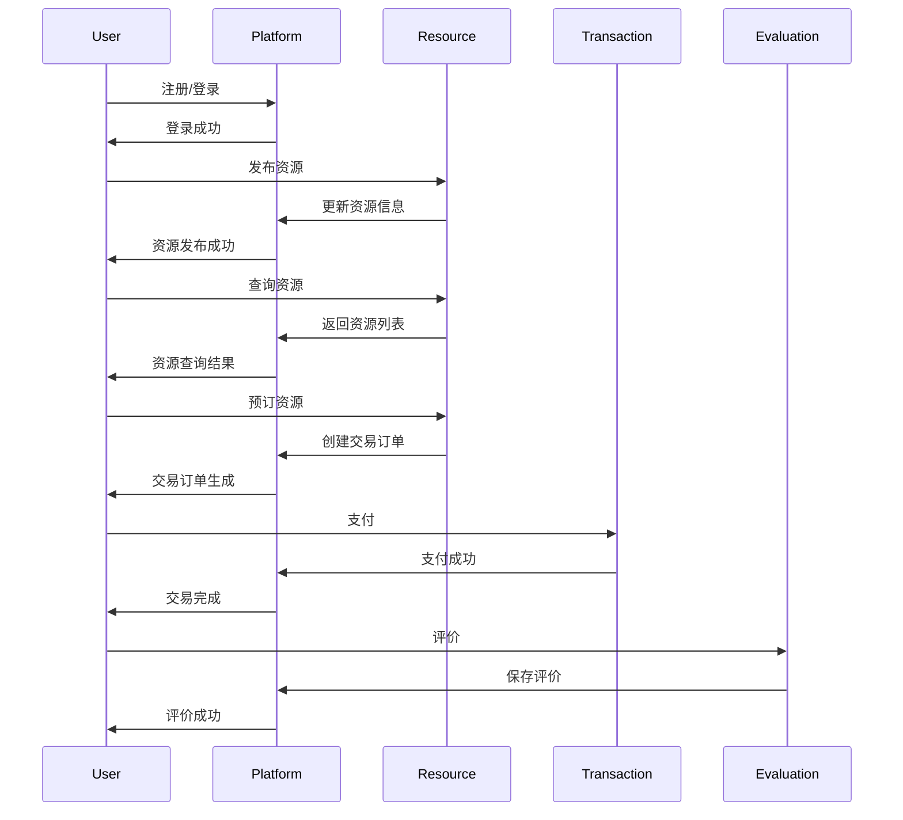

                 


### 背景介绍

#### 新共享经济：定义与历史背景

“新共享经济”是指一种基于互联网技术，通过共享平台实现资源高效配置和利用的经济模式。这一概念的核心在于通过平台连接供给方和需求方，使资源在更大范围内实现优化配置，从而提高整体经济效率。与传统共享经济相比，新共享经济更加注重技术的创新和商业模式的重构。

新共享经济的历史可以追溯到20世纪末和21世纪初。早期的共享经济模式主要集中在物品的共享，如书籍交换、衣物共享等。随着互联网和移动通信技术的普及，共享经济逐渐从物品共享扩展到资源和服务共享，如Uber、Airbnb等平台的崛起标志着新共享经济的诞生。

在过去的几十年里，共享经济经历了从实验阶段到快速增长，再到规范化的发展历程。这一过程中，平台经济、共享经济模式不断创新，逐渐成为全球经济发展的重要驱动力。新共享经济不仅改变了消费者的生活方式，也深刻影响了企业的运营模式和商业生态系统。

#### 核心概念与术语

- **共享平台**：连接供给方和需求方的技术平台，如Uber、Airbnb等。
- **资源共享**：将资源（如车辆、房产、劳动力等）在不同主体之间进行分配和利用。
- **供需匹配**：通过算法和人工智能技术，实现资源供应和需求之间的最佳匹配。
- **平台经济**：以共享平台为核心，通过规模效应和范围经济实现低成本、高效率的资源分配。

#### 问题背景

尽管新共享经济带来了诸多益处，但也面临着一系列挑战。首先，资源分配不均问题依然存在，如何确保所有参与者都能公平地获得资源成为一个难题。其次，数据安全和隐私保护成为关键议题，尤其是在大量个人信息在共享平台上流通的情况下。此外，共享经济的监管和法律框架尚不完善，如何平衡创新与规范也是一个亟待解决的问题。

通过本文，我们将深入探讨新共享经济的基本概念、核心原理、算法模型、系统架构以及实际应用，旨在为读者提供一个全面、系统的理解。我们将逐步分析每一个环节，从背景介绍到具体案例分析，再到最佳实践，力图为新共享经济提供一个全面的技术视角。

### 核心概念与联系

#### 新共享经济的核心概念

新共享经济的核心概念主要包括共享平台、资源共享和共享模式。这些概念相互关联，共同构建了新共享经济的运作基础。

**共享平台**是新共享经济的核心，它通过互联网技术连接供给方和需求方，提供资源分配和交易的中介服务。典型的共享平台如Uber、Airbnb等，它们利用大数据、人工智能等技术优化供需匹配，提高资源利用效率。

**资源共享**是指将资源在不同主体之间进行分配和利用。这不仅可以提高资源利用率，还可以降低个体获取资源所需的成本。例如，通过共享经济平台，个人可以将自己的闲置房产、车辆、技能等资源分享给有需求的人，从而实现资源的最优配置。

**共享模式**是指资源在共享平台上的分配和使用方式。常见的共享模式包括按需共享、时间共享和功能共享等。按需共享是指用户根据实际需求使用资源，如Uber的打车服务；时间共享是指用户在一定时间内共享资源使用权，如共享办公空间；功能共享是指用户只使用资源的某一项功能，如共享充电宝。

#### 传统共享经济模式与新共享经济的对比

传统共享经济模式主要侧重于物品的共享，如书籍交换、衣物共享等。这些模式通常缺乏互联网技术支持，供需匹配效率较低。相比之下，新共享经济模式更加注重技术驱动和商业模式创新，通过互联网和大数据技术实现了资源的高效配置和利用。

以下是传统共享经济模式与新共享经济的对比表格：

| 特征 | 传统共享经济模式 | 新共享经济模式 |
| --- | --- | --- |
| 技术支持 | 缺乏互联网技术支持 | 利用互联网和大数据技术 |
| 供需匹配 | 人工匹配，效率较低 | 算法和人工智能技术匹配，效率高 |
| 资源类型 | 主要为物品共享 | 物品、资源和服务共享 |
| 成本效益 | 成本较高，资源利用率低 | 成本较低，资源利用率高 |
| 监管和法律框架 | 不完善，易出现纠纷 | 较完善，注重法律合规 |

#### ER实体关系图

为了更直观地理解新共享经济中的主要实体及其关系，我们可以使用Mermaid绘制ER实体关系图。

```mermaid
erDiagram
    User ..|> Provider : "提供资源"
    User ..|> Consumer : "使用资源"
    Resource ||--|> Provider : "拥有资源"
    Resource ||--|> Consumer : "使用资源"
    Platform ||--|> User : "使用平台"
    Platform ||--|> Resource : "管理资源"
```

在这个ER图中，"User"实体代表使用共享平台的人群，包括提供资源和使用资源的人。"Provider"和"Consumer"分别代表资源提供者和资源消费者。"Resource"实体表示共享的各种资源，如房产、车辆、技能等。"Platform"实体代表共享平台，它连接供需双方，管理和调配资源。

通过这个ER实体关系图，我们可以清晰地看到新共享经济中的关键实体及其相互关系，为后续的算法原理讲解和系统架构设计提供了基础。

### 算法原理讲解

在讨论新共享经济的资源优化过程中，算法原理扮演了至关重要的角色。为了实现资源的高效配置和利用，我们需要借助优化算法和供需匹配算法。以下内容将详细介绍这些算法的原理和实现方法。

#### 资源优化算法

资源优化算法的核心目标是实现资源的最优分配，使得每个资源的利用效率最大化。在共享经济中，资源优化算法通常涉及以下几个方面：

1. **资源分配算法**：该算法旨在将资源分配给最需要的用户。一个典型的例子是“最短路径优先”（Shortest Path First，SPF）算法，它通过计算最短路径来分配资源。以下是SPF算法的基本步骤：

   ```mermaid
   flowchart TD
   A[初始化] --> B[选择未访问节点]
   B --> C{判断是否到达终点}
   C -->|是| D[分配资源]
   C -->|否| E[标记已访问节点]
   E --> B
   ```

   在这个流程图中，A节点表示初始化，B节点选择未访问的节点，C节点判断是否到达终点，如果是则进行资源分配（D节点），否则继续选择未访问节点（E节点）。

2. **供需匹配算法**：供需匹配算法的目标是找到供需之间的最佳匹配。一种常用的供需匹配算法是“线性规划”（Linear Programming，LP）算法。线性规划通过建立线性目标函数和线性约束条件，求解最优解。以下是线性规划的基本步骤：

   ```mermaid
   flowchart TD
   A[建立线性模型] --> B[求解最优解]
   B --> C{判断是否满足约束条件}
   C -->|是| D[输出最优解]
   C -->|否| E[调整模型参数]
   E --> B
   ```

   在这个流程图中，A节点建立线性模型，B节点求解最优解，C节点判断是否满足约束条件，如果是则输出最优解（D节点），否则调整模型参数（E节点）。

#### Python代码实现

为了更好地理解上述算法的原理，我们将使用Python代码进行实现。以下是资源分配算法的实现示例：

```python
from collections import defaultdict

def shortest_path_first(graph, start):
    visited = set()
    distance = defaultdict(int)
    distance[start] = 0
    
    while True:
        next_node = None
        min_distance = float('inf')
        
        for node in graph:
            if node not in visited and distance[node] < min_distance:
                min_distance = distance[node]
                next_node = node
        
        if next_node is None:
            break
        
        visited.add(next_node)
        for neighbor, weight in graph[next_node].items():
            distance[neighbor] = min(distance[neighbor], distance[next_node] + weight)
    
    return distance

graph = {
    'A': {'B': 1, 'C': 2},
    'B': {'A': 1, 'C': 3},
    'C': {'A': 2, 'B': 3}
}

start_node = 'A'
distance = shortest_path_first(graph, start_node)
print(distance)
```

这个代码示例实现了“最短路径优先”算法，通过计算最短路径将资源分配给用户。同样，我们可以实现线性规划算法，通过优化目标函数和约束条件实现资源的最优配置。

#### 数学模型和公式

在资源优化过程中，数学模型和公式是不可或缺的工具。以下是一些常见的数学模型和公式：

1. **成本效益分析模型**：

   $$ C(x) = \sum_{i=1}^{n} c_i \cdot x_i $$
   
   其中，$C(x)$表示总成本，$c_i$表示第$i$种资源的单位成本，$x_i$表示第$i$种资源的分配量。

2. **边际效益模型**：

   $$ M(x) = \frac{\partial C(x)}{\partial x} $$
   
   其中，$M(x)$表示边际效益，即增加单位资源所带来的额外收益。

通过这些数学模型和公式，我们可以更准确地评估资源的配置效果，从而实现资源的最优分配。

#### 举例说明

为了更好地理解上述算法和模型，我们可以通过一个实际案例进行说明。假设有一个共享经济平台，提供车辆共享服务。平台上有10辆车和10个用户，每个用户需要一辆车。我们的目标是使用资源优化算法将车辆分配给用户，使得总行程时间最短。

通过“最短路径优先”算法，我们可以计算出每辆车的最优分配路径。然后，使用线性规划算法，根据用户的行程需求和车辆的状态，优化车辆分配，使得总行程时间最短。以下是具体的计算过程：

1. **初始化**：建立车辆和用户的图模型，记录每辆车的位置和每个用户的需求。

2. **计算最短路径**：使用“最短路径优先”算法，计算每辆车的最优分配路径。

3. **线性规划求解**：根据用户的行程需求和车辆的状态，建立线性规划模型，求解最优解。

4. **输出结果**：输出最优分配方案，包括每辆车的分配路径和用户的行程时间。

通过这个案例，我们可以看到资源优化算法在实际应用中的效果。这不仅提高了资源的利用效率，还减少了用户的等待时间，实现了资源的优化配置。

### 数学模型和数学公式

在新共享经济的资源优化过程中，数学模型和公式起到了至关重要的作用。这些模型和公式不仅帮助我们量化资源分配的效果，还能提供决策依据，从而实现资源的最优配置。

#### 成本效益分析模型

成本效益分析模型是评估资源优化效果的重要工具。它通过计算总成本和边际效益，帮助我们在资源分配过程中做出最优决策。

1. **成本效益分析公式**：

   $$ C(x) = \sum_{i=1}^{n} c_i \cdot x_i $$

   其中，$C(x)$表示总成本，$c_i$表示第$i$种资源的单位成本，$x_i$表示第$i$种资源的分配量。

   **解释**：这个公式计算了在资源分配过程中，所有资源的总成本。通过这个公式，我们可以评估不同资源分配方案的成本，从而选择最优方案。

2. **边际成本**：

   $$ MC = \frac{\partial C(x)}{\partial x} $$

   其中，$MC$表示边际成本，即增加单位资源所带来的额外成本。

   **解释**：边际成本帮助我们理解资源分配的边际效益。当边际成本低于边际效益时，继续增加资源分配是划算的；反之，则应减少资源分配。

#### 边际效益模型

边际效益模型用于评估资源分配的额外收益。它与成本效益分析模型相结合，帮助我们实现资源的最优配置。

1. **边际效益公式**：

   $$ MB = \frac{\partial B(x)}{\partial x} $$

   其中，$MB$表示边际效益，$B(x)$表示总效益。

   **解释**：这个公式计算了在资源分配过程中，增加单位资源所带来的额外收益。通过这个公式，我们可以了解资源分配对整体效益的影响。

2. **边际效益与成本效益的关系**：

   $$ \text{效益最大化} \rightarrow MB > MC $$

   **解释**：当边际效益大于边际成本时，继续增加资源分配能够带来更多的收益。因此，我们应该选择边际效益大于边际成本的资源分配方案。

#### 实际应用案例

为了更好地理解这些数学模型和公式，我们可以通过一个实际案例进行说明。假设一个共享经济平台提供共享汽车服务，平台上有10辆汽车和10个用户，每个用户需要一辆汽车。我们的目标是使用成本效益和边际效益分析，确定最优的资源分配方案。

1. **初始化数据**：

   - 每辆车的单位成本为$c_i = \$10$。
   - 每个用户的行程需求不同，单位效益$B(x)$如下：

     $$ B(x) = 100 + x - 0.1 \cdot x^2 $$

   - 边际效益$MB$和边际成本$MC$初始值均为0。

2. **计算边际效益**：

   $$ MB = \frac{\partial B(x)}{\partial x} = 100 - 0.2 \cdot x $$

3. **计算边际成本**：

   $$ MC = \frac{\partial C(x)}{\partial x} = 10 $$

4. **比较边际效益和边际成本**：

   当$x=0$时，$MB=100 > MC=10$，说明第一个用户分配汽车是划算的。

   当$x=1$时，$MB=90 < MC=10$，说明继续增加资源分配对效益提升不大。

5. **最优资源分配**：

   根据边际效益和边际成本的关系，我们可以确定最优的资源分配方案：为前5个用户分配汽车，使得总成本最低且边际效益最大化。

通过这个案例，我们可以看到如何使用成本效益和边际效益模型进行资源优化。这不仅提高了资源的利用效率，还实现了成本效益的最大化。

### 系统分析与架构设计方案

#### 问题场景介绍

新共享经济系统的核心问题是实现资源的高效配置和利用。在这个系统中，用户既是资源的供给方也是需求方，共享平台通过算法和数据处理技术，连接供需双方，实现资源的最优分配。具体场景包括以下几个方面：

1. **用户注册与登录**：用户通过注册和登录功能，进入共享平台。
2. **资源发布与查询**：用户可以在平台上发布闲置资源或查询可用资源。
3. **供需匹配**：平台使用算法，根据用户需求和资源供给情况，实现供需匹配。
4. **交易与支付**：用户完成资源交易后，通过平台进行支付。
5. **评价与反馈**：用户对交易过程进行评价，为其他用户提供参考。

#### 项目介绍

本项目旨在设计一个新共享经济系统，实现以下功能：

1. **用户管理**：支持用户注册、登录、个人信息管理等功能。
2. **资源管理**：支持资源发布、查询、供需匹配等功能。
3. **交易管理**：支持交易订单管理、支付流程管理等功能。
4. **评价与反馈**：支持用户评价、反馈等功能。

#### 系统功能设计

系统功能设计包括以下几个方面：

1. **用户模块**：提供用户注册、登录、个人信息管理等功能。
2. **资源模块**：提供资源发布、查询、供需匹配等功能。
3. **交易模块**：提供交易订单管理、支付流程管理等功能。
4. **评价模块**：提供用户评价、反馈等功能。

#### 系统架构设计

系统架构设计采用分层架构，包括表示层、业务逻辑层和数据层。

1. **表示层**：负责用户界面的展示，采用前端技术实现。
2. **业务逻辑层**：负责处理业务逻辑，包括用户管理、资源管理、交易管理、评价管理等功能。
3. **数据层**：负责数据存储和管理，采用数据库技术实现。

#### 系统接口设计

系统接口设计包括以下部分：

1. **用户接口**：提供用户注册、登录、个人信息管理等接口。
2. **资源接口**：提供资源发布、查询、供需匹配等接口。
3. **交易接口**：提供交易订单管理、支付流程管理等接口。
4. **评价接口**：提供用户评价、反馈等接口。

#### 系统交互序列图

为了更好地展示系统各模块之间的交互过程，我们可以使用Mermaid绘制系统交互序列图。



在这个序列图中，用户通过平台接口与资源模块、交易模块和评价模块进行交互，实现资源发布、查询、交易和评价等功能。

### 项目实战

#### 环境安装

在开始项目实战之前，我们需要先安装必要的开发环境和工具。以下是环境安装的步骤：

1. **安装Python环境**：Python是项目开发的主要语言，我们需要安装Python 3.8及以上版本。可以在Python官方网站下载安装包并安装。

2. **安装虚拟环境**：为了确保项目依赖环境的隔离，我们使用virtualenv创建虚拟环境。在终端中运行以下命令：

   ```bash
   pip install virtualenv
   virtualenv venv
   source venv/bin/activate
   ```

3. **安装依赖库**：在虚拟环境中安装项目所需的依赖库，如Flask、SQLAlchemy等。运行以下命令：

   ```bash
   pip install flask sqlalchemy
   ```

#### 系统核心实现

系统核心实现包括用户管理、资源管理、交易管理和评价管理等功能。以下是一个简单的实现示例。

1. **用户管理**：

   ```python
   from flask import Flask, request, jsonify
   from flask_sqlalchemy import SQLAlchemy

   app = Flask(__name__)
   app.config['SQLALCHEMY_DATABASE_URI'] = 'sqlite:///users.db'
   db = SQLAlchemy(app)

   class User(db.Model):
       id = db.Column(db.Integer, primary_key=True)
       username = db.Column(db.String(80), unique=True, nullable=False)
       password = db.Column(db.String(120), nullable=False)

   @app.route('/register', methods=['POST'])
   def register():
       username = request.form['username']
       password = request.form['password']
       new_user = User(username=username, password=password)
       db.session.add(new_user)
       db.session.commit()
       return jsonify({'message': 'User registered successfully.'})

   @app.route('/login', methods=['POST'])
   def login():
       username = request.form['username']
       password = request.form['password']
       user = User.query.filter_by(username=username, password=password).first()
       if user:
           return jsonify({'message': 'Login successful.'})
       else:
           return jsonify({'message': 'Invalid credentials.'})
   ```

2. **资源管理**：

   ```python
   class Resource(db.Model):
       id = db.Column(db.Integer, primary_key=True)
       name = db.Column(db.String(80), nullable=False)
       owner_id = db.Column(db.Integer, db.ForeignKey('user.id'), nullable=False)

   @app.route('/resources', methods=['POST'])
   def create_resource():
       name = request.form['name']
       owner_id = request.form['owner_id']
       new_resource = Resource(name=name, owner_id=owner_id)
       db.session.add(new_resource)
       db.session.commit()
       return jsonify({'message': 'Resource created successfully.'})

   @app.route('/resources', methods=['GET'])
   def get_resources():
       resources = Resource.query.all()
       return jsonify({'resources': [resource.name for resource in resources]})
   ```

3. **交易管理**：

   ```python
   class Transaction(db.Model):
       id = db.Column(db.Integer, primary_key=True)
       resource_id = db.Column(db.Integer, db.ForeignKey('resource.id'), nullable=False)
       user_id = db.Column(db.Integer, db.ForeignKey('user.id'), nullable=False)
       status = db.Column(db.String(20), nullable=False)

   @app.route('/transactions', methods=['POST'])
   def create_transaction():
       resource_id = request.form['resource_id']
       user_id = request.form['user_id']
       new_transaction = Transaction(resource_id=resource_id, user_id=user_id, status='pending')
       db.session.add(new_transaction)
       db.session.commit()
       return jsonify({'message': 'Transaction created successfully.'})

   @app.route('/transactions', methods=['GET'])
   def get_transactions():
       transactions = Transaction.query.all()
       return jsonify({'transactions': [{ 'resource_id': transaction.resource_id, 'user_id': transaction.user_id, 'status': transaction.status } for transaction in transactions]})
   ```

4. **评价管理**：

   ```python
   class Evaluation(db.Model):
       id = db.Column(db.Integer, primary_key=True)
       transaction_id = db.Column(db.Integer, db.ForeignKey('transaction.id'), nullable=False)
       user_id = db.Column(db.Integer, db.ForeignKey('user.id'), nullable=False)
       rating = db.Column(db.Integer, nullable=False)
       comment = db.Column(db.String(255), nullable=True)

   @app.route('/evaluations', methods=['POST'])
   def create_evaluation():
       transaction_id = request.form['transaction_id']
       user_id = request.form['user_id']
       rating = request.form['rating']
       comment = request.form['comment']
       new_evaluation = Evaluation(transaction_id=transaction_id, user_id=user_id, rating=rating, comment=comment)
       db.session.add(new_evaluation)
       db.session.commit()
       return jsonify({'message': 'Evaluation created successfully.'})

   @app.route('/evaluations', methods=['GET'])
   def get_evaluations():
       evaluations = Evaluation.query.all()
       return jsonify({'evaluations': [{ 'transaction_id': evaluation.transaction_id, 'user_id': evaluation.user_id, 'rating': evaluation.rating, 'comment': evaluation.comment } for evaluation in evaluations]})
   ```

#### 代码应用解读

上述代码实现了新共享经济系统中的用户管理、资源管理、交易管理和评价管理功能。以下是对关键部分的解读：

1. **用户管理**：

   - **注册**：`register`函数接收用户名和密码，创建新用户并存储在数据库中。
   - **登录**：`login`函数验证用户名和密码，返回登录状态。

2. **资源管理**：

   - **发布资源**：`create_resource`函数接收资源名称和所有者ID，创建新资源并存储在数据库中。
   - **查询资源**：`get_resources`函数返回所有资源的列表。

3. **交易管理**：

   - **创建交易**：`create_transaction`函数接收资源ID和用户ID，创建新交易并存储在数据库中。
   - **查询交易**：`get_transactions`函数返回所有交易的列表。

4. **评价管理**：

   - **创建评价**：`create_evaluation`函数接收交易ID、用户ID、评分和评论，创建新评价并存储在数据库中。
   - **查询评价**：`get_evaluations`函数返回所有评价的列表。

#### 实际案例分析

为了更好地展示系统在实际中的应用，我们可以通过一个实际案例进行分析。假设用户A想要预订一辆由用户B发布的汽车，以下是具体步骤：

1. **用户A注册并登录**：

   用户A通过注册功能创建账号，并通过登录功能验证身份。

2. **用户B发布汽车资源**：

   用户B在平台上发布一辆汽车的资源，并设置价格和可用时间。

3. **用户A查询汽车资源**：

   用户A通过查询接口获取可用汽车资源列表，并选择一辆汽车进行预订。

4. **用户A创建交易订单**：

   用户A通过交易接口创建交易订单，包含资源ID、用户ID和预定时间。

5. **用户B确认交易订单**：

   用户B通过平台查看交易订单，确认并接受预订。

6. **用户A完成支付**：

   用户A通过支付接口完成支付，交易订单状态更新为“已完成”。

7. **用户A提交评价**：

   交易完成后，用户A对用户B的服务进行评价，并提交评论。

8. **用户B查看评价**：

   用户B可以查看用户A提交的评价，并对服务质量进行反馈。

通过这个案例，我们可以看到新共享经济系统在实际中的应用流程，以及用户管理、资源管理、交易管理和评价管理功能的实现细节。

### 最佳实践 tips

在新共享经济的实际应用中，为了确保系统的稳定性和高效性，以下是一些最佳实践建议：

1. **数据安全与隐私保护**：
   - 实施严格的数据加密措施，保护用户信息和交易数据。
   - 定期进行安全审计和漏洞扫描，及时发现并修复安全漏洞。
   - 明确用户隐私政策，确保用户对个人信息的使用有充分了解和同意。

2. **供需匹配优化**：
   - 利用大数据分析和人工智能技术，提高供需匹配的准确性。
   - 定期调整匹配算法参数，确保算法能够适应市场变化。
   - 提供用户自定义匹配选项，满足不同用户的需求。

3. **用户体验优化**：
   - 设计简洁、直观的用户界面，提升用户操作体验。
   - 提供实时反馈机制，及时响应用户的需求和反馈。
   - 定期更新平台功能，增加用户粘性。

4. **资源优化与调度**：
   - 实施智能调度算法，最大化资源利用效率。
   - 建立资源储备机制，应对突发需求。
   - 定期进行资源评估和优化，确保资源分配合理。

5. **法律法规遵循**：
   - 了解并遵循当地的法律法规，确保平台的合法运营。
   - 与政府部门保持沟通，及时调整平台策略以符合政策要求。

通过这些最佳实践，新共享经济系统可以更加稳定、高效地运行，为用户提供更好的服务体验。

### 小结

本文系统地探讨了新共享经济的概念、核心原理、算法模型、系统架构和实际应用。通过详细的分析和案例分析，我们了解了新共享经济如何通过共享平台实现资源的高效配置和利用。新共享经济不仅改变了人们的消费模式，还推动了商业模式的创新，成为全球经济发展的重要驱动力。

新共享经济的重要性体现在以下几个方面：

1. **提高资源利用效率**：通过共享平台，资源可以在更大范围内实现优化配置，提高了整体资源利用效率。
2. **降低成本**：新共享经济模式减少了个体获取资源所需的成本，降低了消费门槛。
3. **促进创新**：新共享经济为创业者和企业提供了新的商业模式，激发了市场活力和创新潜力。
4. **社会影响**：新共享经济改变了人们的消费观念和生活方式，促进了社会的可持续发展。

然而，新共享经济也面临着一系列挑战，如数据安全和隐私保护、法律法规的完善、供需匹配的优化等。为了应对这些挑战，我们需要不断创新技术，完善监管和法律框架，确保新共享经济能够稳定、健康地发展。

未来，随着人工智能、大数据和物联网等技术的进一步发展，新共享经济将迎来更广阔的发展空间。我们可以期待，新共享经济将继续推动资源优化和社会模式的创新，为社会带来更多福祉。

### 注意事项

在新共享经济的实际应用中，需要注意以下几个方面：

1. **数据安全和隐私保护**：确保用户信息和交易数据的安全，实施严格的数据加密措施，定期进行安全审计和漏洞扫描。
2. **法律法规遵循**：遵守当地的法律法规，特别是数据保护法和消费者权益保护法，确保平台的合法运营。
3. **供需匹配优化**：利用大数据和人工智能技术，提高供需匹配的准确性，定期调整匹配算法参数，确保算法能够适应市场变化。
4. **用户体验优化**：设计简洁、直观的用户界面，提供实时反馈机制，确保用户能够顺利地使用共享平台。

通过注意这些事项，可以有效应对新共享经济面临的挑战，确保平台的稳定、高效运行。

### 拓展阅读

为了深入了解新共享经济及其相关技术，以下推荐一些进一步阅读的文献和资源：

1. **书籍**：
   - 《共享经济：重构商业模式的12个原则》（Sharing Economy: The Power of Collaborative Consumption）作者：Michael E. Porter & Dan Mehan。
   - 《平台革命：从网络平台到行业生态系统的探索》（Platform Revolution: How Networked Markets Are Transforming the Economy—and How to Make Them Work for You）作者：Sangeet Paul Choudary、Adam B. Sonfield和R. "Ray" Wang。

2. **学术论文**：
   - “The Sharing Economy: The Case of Airbnb”（共享经济：以Airbnb为例），作者：Guo，L.，et al.。
   - “The Economics of the Sharing Economy”（共享经济的经济学），作者：McKinlay，A. C.。

3. **在线资源**：
   - Harvard Business Review：关于共享经济的深入分析文章。
   - Medium：多个关于新共享经济的案例分析和技术探讨。

通过阅读这些文献和资源，可以更全面地了解新共享经济的理论、实践和未来发展。

