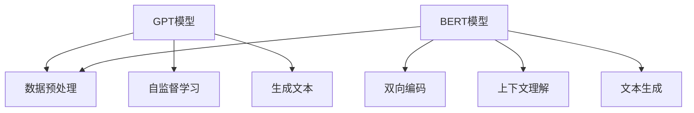

                 

# 新共居实验：重建社区联结的生活方式

## 关键词
- 新共居实验
- 社区联结
- 生活方式创新
- 共享经济
- 居民参与度

## 摘要
本文探讨了城市化背景下社区联结的重要性，以及通过新共居实验重建社区联结的可行性。文章首先介绍了新共居实验的背景、问题解决方法、边界与外延，并详细阐述了其核心概念与结构要素。接着，文章分析了AI大模型的基本概念、特点及其与传统AI的区别，介绍了主流AI大模型及其在企业中的应用前景。通过一系列的实际案例分析和详细讲解，文章提出了AI大模型在重建社区联结中的潜在应用，并探讨了其应用的挑战与机遇。

## 1.1 背景介绍

### 问题背景

随着城市化进程的加快和人口增长，城市社区逐渐变得庞大而分散，居民之间的联系越来越弱，社区凝聚力逐渐下降。这种情况下，如何重建社区联结，提升居民生活质量，成为了一个亟待解决的问题。

城市化进程中，人口流动速度加快，家庭结构发生变化，传统的邻里关系逐渐被疏远。同时，高房价和生活压力使得居民更多关注于个人生活，而忽视了社区生活的重要性。这些因素共同导致了社区联结的减弱，社区凝聚力下降，居民对社区的归属感和认同感减弱。

### 问题解决

《新共居实验：重建社区联结的生活方式》一书，旨在探讨通过生活方式的创新，重建社区联结的可能性。书中提出了多种实验性的共居模式，如共享住宿、共享办公、共享社区服务等，通过实践这些模式，尝试解决社区联结问题。

这些实验性共居模式试图打破传统的社区结构，通过共享资源、共享空间、共享服务等方式，增强居民之间的联系和互动，从而重建社区联结。例如，共享住宿模式使得不同背景、不同兴趣的居民可以住在同一个社区，从而增加居民之间的交流与了解；共享办公模式则为居民提供了一个共同工作的空间，促进了居民之间的合作与交流。

### 边界与外延

本书主要讨论的是城市社区层面的重建社区联结问题，关注的是居民个体和社区整体的关系。书中的实验性共居模式，主要聚焦于生活方式的变革，而非经济模式或政治体制。

虽然这些实验性共居模式在城市社区层面有很好的应用前景，但它们并不适用于所有类型的社区，如小型社区或偏远地区。此外，这些模式在实践中可能面临各种挑战，如居民参与度不高、社区服务不足等问题，需要进一步探索和完善。

### 概念结构与核心要素组成

- **核心概念：** 共居实验、社区联结、生活方式创新
- **结构要素：** 实验性共居模式、居民参与度、社区服务、共享经济
- **关系：** 实验性共居模式是重建社区联结的手段，居民参与度和社区服务是实验成功的关键，而共享经济则是实现这些目标的经济基础。

## 1.2 核心概念与联系

### AI大模型的定义与特点

**AI大模型（Artificial Intelligence Large Model）** 是指具有大规模参数、能处理海量数据、具备强学习能力和通用性的深度学习模型。其核心特点包括：

- **大规模参数**：AI大模型通常拥有数十亿甚至千亿级别的参数，这使得它们能够捕捉数据中的复杂模式和规律。
- **强学习能力**：通过大量的训练数据，AI大模型能够不断优化自己的参数，从而提升模型性能。
- **通用性**：AI大模型不仅适用于特定的任务，还能跨领域、跨任务应用。

### AI大模型与传统AI的区别

- **任务导向性**：传统AI更多关注特定任务的解决，如图像识别、语音识别等，而AI大模型则具有通用性，能处理多种任务。
- **数据依赖性**：传统AI模型对数据量要求不高，而AI大模型需要大量的训练数据才能发挥其潜力。
- **计算资源需求**：传统AI模型通常可以在普通计算机上运行，而AI大模型则需要高性能计算资源，如GPU或TPU。

### AI大模型与传统AI的对比表格

| 特性 | AI大模型 | 传统AI |
| ---- | ---- | ---- |
| 参数规模 | 大规模参数（数十亿至千亿级别） | 较小参数规模（数万至数十万级别） |
| 学习能力 | 强学习能力，可处理复杂任务 | 有限学习能力，针对特定任务优化 |
| 通用性 | 通用性，可跨领域应用 | 任务导向性，适用于特定任务 |
| 数据需求 | 高数据依赖性，需海量训练数据 | 低数据依赖性，少量数据可训练模型 |
| 计算资源 | 高计算资源需求，需GPU或TPU | 低计算资源需求，可运行于普通计算机 |

### AI大模型的ER实体关系图

```mermaid
erDiagram
  Class1 ||--|{ Class2 } Class3 : 父子关系
  Class1 ||--|{ Class4 } Class5 : 叔侄关系
  Class2 ||--|{ Class6 } Class7 : 祖孙关系
```

在这个ER实体关系图中，`Class1` 是AI大模型的基础，它与其他类（`Class2`、`Class3`、`Class4`、`Class5`、`Class6`、`Class7`）之间存在不同的关系。例如，`Class2` 和 `Class3` 与 `Class1` 之间存在父子关系，而 `Class4` 和 `Class5` 与 `Class1` 之间存在叔侄关系。这种关系图可以帮助我们更清晰地理解AI大模型的结构和组成。

## 1.3 主流AI大模型简介

### GPT系列模型

**GPT（Generative Pre-trained Transformer）** 模型是自然语言处理领域的重要突破，其特点是能够生成连贯、有逻辑的自然语言文本。GPT系列模型包括：

- **GPT-2**：是第一个大规模的语言模型，能够生成高质量的自然语言文本。
- **GPT-3**：是目前最先进的自然语言处理模型，具有前所未有的语言生成能力和理解能力。

### BERT及其变体

**BERT（Bidirectional Encoder Representations from Transformers）** 模型是一种预训练语言表示模型，能够捕捉文本的上下文信息。BERT的变体包括：

- **RoBERTa**：是BERT的一个改进版本，通过调整训练策略和数据集，取得了更好的性能。
- **ALBERT**：是对BERT模型的进一步优化，通过参数共享和数据增强，提升了模型效率。

### 其他知名大模型介绍

除了GPT和BERT，还有一些其他知名的大模型，如：

- **TuringML**：是一种用于机器学习推理的大模型，能够在各种机器学习任务中取得优异的性能。
- **ViT（Vision Transformer）**：是一种将Transformer模型应用于计算机视觉领域的大模型。

### GPT系列模型与BERT模型的对比

| 特性 | GPT系列模型 | BERT模型 |
| ---- | ---- | ---- |
| 应用领域 | 自然语言生成 | 自然语言理解 |
| 参数规模 | 大规模参数（数十亿至千亿级别） | 大规模参数（数十亿至千亿级别） |
| 学习策略 | 自监督学习 | 双向编码学习 |
| 语言生成能力 | 强语言生成能力 | 强上下文理解能力 |
| 性能提升 | 随训练数据增加而提升 | 随训练数据增加而提升 |

通过对比可以发现，GPT系列模型和BERT模型在应用领域、参数规模、学习策略和语言生成能力等方面都有显著的差异。这些模型在自然语言处理领域取得了显著的突破，为各类自然语言处理任务提供了强大的工具。

### GPT系列模型与BERT模型的mermaid流程图

GPT系列模型与BERT模型的mermaid流程图如下：



在这个流程图中，GPT模型主要包括数据预处理、自监督学习和文本生成三个阶段。BERT模型则包括数据预处理、双向编码、上下文理解和文本生成四个阶段。这两个模型在流程上有所不同，但都致力于提高自然语言处理的能力。

## 1.4 AI大模型在企业中的应用前景

### 潜在应用领域

AI大模型在企业中的潜在应用领域非常广泛，包括但不限于以下方面：

- **自然语言处理**：如智能客服、自动翻译、文本生成等。
- **计算机视觉**：如图像识别、图像生成、视频分析等。
- **推荐系统**：如商品推荐、内容推荐等。
- **语音识别与合成**：如智能语音助手、语音翻译等。

### 企业采用AI大模型的优势

- **提高效率**：AI大模型能够自动化处理大量的数据，提高工作效率。
- **降低成本**：通过自动化和智能化，企业可以减少人力成本和其他资源消耗。
- **提升竞争力**：拥有先进的AI技术，企业能够在市场中获得竞争优势。

### AI大模型应用的挑战与机遇

- **挑战**：
  - **计算资源需求**：AI大模型需要大量的计算资源，这对企业的IT基础设施提出了更高的要求。
  - **数据隐私与安全**：AI大模型对数据的安全性和隐私保护提出了更高的要求。
  - **模型解释性**：AI大模型的黑盒性质使得其决策过程难以解释，这对企业的决策透明度和合规性提出了挑战。

- **机遇**：
  - **数据驱动决策**：AI大模型能够处理海量数据，为企业提供更精准的数据分析结果，从而驱动更明智的决策。
  - **技术创新**：AI大模型的应用推动了AI技术的发展，为企业带来了新的技术和解决方案。
  - **市场拓展**：AI大模型的应用能够帮助企业开拓新的市场，提升业务规模和市场份额。

## 2.1 新共居实验的背景与问题解决

### 2.1.1 背景介绍

随着城市化进程的加快，城市社区逐渐变得庞大而分散。传统的邻里关系被打破，居民之间的联系变得越来越弱。这种情况下，如何重建社区联结，提升居民生活质量，成为了一个亟待解决的问题。

社区联结的减弱不仅影响了居民的生活质量，也对社区的整体发展产生了负面影响。首先，居民之间的联系减少，导致社区凝聚力下降，居民对社区的归属感和认同感减弱。其次，社区服务不足，导致居民无法享受到便捷的社区服务，生活质量下降。最后，社区安全问题凸显，由于居民之间的不熟悉和不信任，社区治安问题日益严重。

### 2.1.2 问题解决

为了解决上述问题，《新共居实验：重建社区联结的生活方式》一书提出了一系列的实验性共居模式，通过创新生活方式，重建社区联结。这些实验性共居模式主要包括共享住宿、共享办公、共享社区服务等。

**共享住宿**：共享住宿模式通过提供共享的居住空间，使不同背景、不同兴趣的居民住在同一个社区，从而增加居民之间的交流与互动。这种模式不仅可以提升社区联结，还可以提高居住空间的使用效率，降低居民的生活成本。

**共享办公**：共享办公模式为居民提供了一个共同工作的空间，促进了居民之间的合作与交流。这种模式不仅有助于提高工作效率，还可以激发创新思维，促进社区经济活动的发展。

**共享社区服务**：共享社区服务模式通过提供共享的社区服务设施，如健身房、图书馆、公园等，增强居民之间的互动，提升社区整体的生活质量。这种模式不仅节省了居民的时间和金钱，还增强了社区的凝聚力。

### 2.1.3 边界与外延

新共居实验主要关注城市社区层面的重建社区联结问题，聚焦于居民个体和社区整体的关系。虽然这些实验性共居模式在城市社区层面有很好的应用前景，但它们并不适用于所有类型的社区，如小型社区或偏远地区。此外，这些模式在实践中可能面临各种挑战，如居民参与度不高、社区服务不足等问题，需要进一步探索和完善。

### 2.1.4 概念结构与核心要素组成

**概念结构与核心要素组成**：

- **核心概念**：新共居实验、社区联结、生活方式创新
- **结构要素**：实验性共居模式、居民参与度、社区服务、共享经济
- **关系**：实验性共居模式是重建社区联结的手段，居民参与度和社区服务是实验成功的关键，而共享经济则是实现这些目标的经济基础。

通过新共居实验，我们可以逐步解决社区联结问题，提升居民生活质量，实现社区的可持续发展。然而，这个过程并非一蹴而就，需要我们在实践中不断探索、创新和改进。

## 2.2 AI大模型的定义与特点

### 2.2.1 AI大模型的定义

AI大模型（Artificial Intelligence Large Model）是指具有大规模参数、能处理海量数据、具备强学习能力和通用性的深度学习模型。这些模型通过自我学习和调整参数，能够自动识别和预测数据中的模式和规律。

### 2.2.2 AI大模型的特点

**1. 大规模参数**

AI大模型通常拥有数十亿甚至千亿级别的参数，这使得它们能够捕捉数据中的复杂模式和规律。相比于传统的小型模型，AI大模型具有更强的表达能力和学习效率。

**2. 强学习能力**

通过大量的训练数据，AI大模型能够不断优化自己的参数，从而提升模型性能。这种自我优化能力使得AI大模型能够适应不同的任务和数据集，具有很高的泛化能力。

**3. 通用性**

AI大模型不仅适用于特定的任务，还能跨领域、跨任务应用。这使得AI大模型在多个领域都有广泛的应用前景，如自然语言处理、计算机视觉、推荐系统等。

### 2.2.3 AI大模型与传统AI的区别

**1. 任务导向性**

传统AI更多关注特定任务的解决，如图像识别、语音识别等，而AI大模型则具有通用性，能处理多种任务。这使得AI大模型能够更灵活地应对不同的业务需求。

**2. 数据依赖性**

传统AI模型对数据量要求不高，而AI大模型需要大量的训练数据才能发挥其潜力。这是因为AI大模型需要通过大量数据来学习和调整参数，从而提高模型的性能。

**3. 计算资源需求**

传统AI模型通常可以在普通计算机上运行，而AI大模型则需要高性能计算资源，如GPU或TPU。这是因为AI大模型在训练和推理过程中需要大量的计算资源。

### 2.2.4 AI大模型的应用前景

AI大模型在各个领域都有广泛的应用前景，如：

- **自然语言处理**：如智能客服、自动翻译、文本生成等。
- **计算机视觉**：如图像识别、图像生成、视频分析等。
- **推荐系统**：如商品推荐、内容推荐等。
- **语音识别与合成**：如智能语音助手、语音翻译等。

随着AI大模型技术的不断进步，其在各个领域的应用将会越来越广泛，为企业和个人带来巨大的价值。

## 2.3 主流AI大模型简介

### 2.3.1 GPT系列模型

**GPT（Generative Pre-trained Transformer）** 模型是自然语言处理领域的重要突破，其特点是能够生成连贯、有逻辑的自然语言文本。GPT系列模型包括：

- **GPT-2**：是第一个大规模的语言模型，能够生成高质量的自然语言文本。
- **GPT-3**：是目前最先进的自然语言处理模型，具有前所未有的语言生成能力和理解能力。

**GPT-2** 模型通过自监督学习的方式，从大量的文本数据中学习语言模式，从而生成连贯的文本。其生成的文本具有很高的质量，能够模拟人类的语言表达。

**GPT-3** 模型是 GPT-2 的升级版，其参数规模更大，训练数据更多，因此具有更强的语言生成能力和理解能力。GPT-3 可以生成各种类型的文本，如文章、对话、诗歌等，同时还能进行语言翻译、摘要生成等任务。

### 2.3.2 BERT及其变体

**BERT（Bidirectional Encoder Representations from Transformers）** 模型是一种预训练语言表示模型，能够捕捉文本的上下文信息。BERT的变体包括：

- **RoBERTa**：是BERT的一个改进版本，通过调整训练策略和数据集，取得了更好的性能。
- **ALBERT**：是对BERT模型的进一步优化，通过参数共享和数据增强，提升了模型效率。

**BERT** 模型通过双向编码学习的方式，同时考虑文本的左右上下文信息，从而生成更准确的文本表示。BERT 在各种自然语言处理任务中取得了优异的性能，如文本分类、命名实体识别、情感分析等。

**RoBERTa** 是 BERT 的一个改进版本，通过调整训练策略和数据集，使得模型在多个任务上取得了更好的性能。RoBERTa 使用了更多的数据、更长的序列长度，并采用了动态掩码策略，从而提高了模型的训练效果。

**ALBERT** 是对 BERT 模型的进一步优化，通过参数共享和数据增强，提升了模型效率。ALBERT 通过减少参数数量和计算量，使得模型在保持性能的同时，具有更高的训练速度。

### 2.3.3 其他知名大模型介绍

除了 GPT 和 BERT，还有一些其他知名的大模型，如：

- **TuringML**：是一种用于机器学习推理的大模型，能够在各种机器学习任务中取得优异的性能。
- **ViT（Vision Transformer）**：是一种将 Transformer 模型应用于计算机视觉领域的大模型。

**TuringML** 模型是一种针对机器学习推理的大模型，其特点是能够快速处理大规模数据集，并提供高效的推理性能。TuringML 通过自我学习和优化，能够自动调整模型参数，从而提高模型的推理速度和准确率。

**ViT** 模型是一种将 Transformer 模型应用于计算机视觉领域的大模型。ViT 通过将图像分解为多个小图像块，然后使用 Transformer 模型进行编码和推理，从而实现了高效的图像识别和生成。

## 2.4 AI大模型在企业中的应用前景

### 2.4.1 潜在应用领域

AI大模型在企业中的潜在应用领域非常广泛，包括但不限于以下方面：

- **自然语言处理**：如智能客服、自动翻译、文本生成等。
- **计算机视觉**：如图像识别、图像生成、视频分析等。
- **推荐系统**：如商品推荐、内容推荐等。
- **语音识别与合成**：如智能语音助手、语音翻译等。

### 2.4.2 企业采用AI大模型的优势

- **提高效率**：AI大模型能够自动化处理大量的数据，提高工作效率。
- **降低成本**：通过自动化和智能化，企业可以减少人力成本和其他资源消耗。
- **提升竞争力**：拥有先进的AI技术，企业能够在市场中获得竞争优势。

### 2.4.3 AI大模型应用的挑战与机遇

**挑战**：

- **计算资源需求**：AI大模型需要大量的计算资源，这对企业的IT基础设施提出了更高的要求。
- **数据隐私与安全**：AI大模型对数据的安全性和隐私保护提出了更高的要求。
- **模型解释性**：AI大模型的黑盒性质使得其决策过程难以解释，这对企业的决策透明度和合规性提出了挑战。

**机遇**：

- **数据驱动决策**：AI大模型能够处理海量数据，为企业提供更精准的数据分析结果，从而驱动更明智的决策。
- **技术创新**：AI大模型的应用推动了AI技术的发展，为企业带来了新的技术和解决方案。
- **市场拓展**：AI大模型的应用能够帮助企业开拓新的市场，提升业务规模和市场份额。

### 2.4.4 实际应用案例

1. **金融行业**：

   - **自然语言处理**：金融机构使用AI大模型进行文本分析，如客户评论、市场报告等，从而更好地了解客户需求和市场动态。
   - **风险控制**：通过AI大模型分析大量历史数据，金融机构可以更准确地评估信贷风险，从而降低不良贷款率。

2. **零售行业**：

   - **推荐系统**：零售企业使用AI大模型进行商品推荐，从而提高客户的购物体验和满意度。
   - **库存管理**：通过AI大模型分析销售数据和历史趋势，零售企业可以更准确地预测库存需求，从而降低库存成本。

3. **医疗行业**：

   - **图像识别**：医疗机构使用AI大模型进行医学图像分析，如肿瘤检测、骨折诊断等，从而提高诊断准确率。
   - **智能客服**：医疗企业使用AI大模型构建智能客服系统，从而提供更高效、个性化的客户服务。

4. **交通行业**：

   - **自动驾驶**：自动驾驶企业使用AI大模型进行环境感知、路径规划和决策，从而提高自动驾驶的准确性和安全性。
   - **智能交通管理**：城市管理部门使用AI大模型分析交通数据，从而优化交通信号灯控制和交通流量管理。

通过这些实际应用案例，我们可以看到AI大模型在企业中的应用前景非常广阔，为各行业带来了巨大的变革和创新。

## 3.1 AI大模型在重建社区联结中的应用

### 3.1.1 引言

在城市化进程不断加快的背景下，社区联结的重建成为了一项重要的社会课题。AI大模型作为一种先进的计算技术，其在重建社区联结中的应用潜力巨大。本文将探讨AI大模型在重建社区联结中的具体应用场景、方法和挑战。

### 3.1.2 应用场景

AI大模型在重建社区联结中的应用场景主要包括以下几个方面：

1. **智能社区服务**：通过AI大模型，可以为社区提供智能化的服务，如智能客服、智能物业管理等。这些服务能够提高社区服务的效率和用户体验。

2. **居民行为分析**：AI大模型可以对社区内居民的行为数据进行分析，如交通流量、购物行为等。这些分析结果可以用于优化社区资源配置，提升居民生活质量。

3. **社区安全监控**：AI大模型可以用于社区安全监控，如人脸识别、行为分析等。这些技术可以帮助社区管理部门及时发现和应对潜在的安全风险。

4. **社区文化建设**：通过AI大模型，可以为社区文化建设提供支持，如推荐适合社区的文化活动、组织社区志愿者活动等。

### 3.1.3 方法

AI大模型在重建社区联结中的应用方法主要包括以下几个方面：

1. **数据采集与处理**：首先，需要采集社区内的各类数据，如居民行为数据、社区设施使用数据、社区安全数据等。然后，对这些数据进行预处理，包括数据清洗、数据整合和数据标准化等。

2. **模型训练与优化**：使用预处理后的数据对AI大模型进行训练，以使其能够准确地识别和预测社区内各种现象。在训练过程中，需要对模型进行优化，以提高其性能和泛化能力。

3. **模型部署与运维**：将训练好的AI大模型部署到社区的服务器上，使其能够为社区提供实时服务。同时，需要定期对模型进行运维，包括模型更新、性能监控和故障处理等。

### 3.1.4 挑战

AI大模型在重建社区联结中的应用面临以下挑战：

1. **数据隐私与安全**：社区内居民的数据非常敏感，需要确保数据的安全性和隐私性。否则，可能会导致数据泄露和滥用等问题。

2. **计算资源需求**：AI大模型需要大量的计算资源，这对社区的服务器和网络带宽提出了很高的要求。此外，模型的训练和推理过程也会消耗大量的电力资源。

3. **模型解释性**：AI大模型通常具有黑盒性质，其决策过程难以解释。这可能会对社区的决策透明度和合规性产生负面影响。

4. **居民接受度**：社区内居民对AI大模型的应用可能存在一定的抵触情绪，如何提高居民的接受度和参与度是一个重要问题。

### 3.1.5 结论

综上所述，AI大模型在重建社区联结中具有巨大的应用潜力。通过合理地应用AI大模型，可以提升社区服务的效率和质量，增强社区联结，提高居民的生活质量。然而，这也需要我们面对各种挑战，不断探索和改进，以实现AI大模型在社区联结重建中的最佳应用效果。

## 3.2 新共居实验中的居民参与度和社区服务

### 3.2.1 引言

新共居实验的核心理念之一是通过居民参与度和社区服务的提升，重建社区联结。本文将探讨新共居实验中居民参与度和社区服务的重要性，以及如何通过具体措施提高居民参与度和社区服务质量。

### 3.2.2 居民参与度的重要性

居民参与度在新共居实验中起着至关重要的作用。高居民参与度意味着居民更愿意参与到社区活动中，更积极地参与社区建设和维护。这不仅能增强社区凝聚力，还能提高社区整体的生活质量。具体来说，居民参与度的重要性体现在以下几个方面：

1. **社区凝聚力**：高居民参与度可以增强社区成员之间的联系，提升社区的凝聚力。居民通过参与社区活动，能够更好地了解和信任邻居，从而形成更加紧密的社区关系。

2. **社区问题解决**：居民参与度高意味着居民更愿意提出问题和解决方案。这有助于社区管理者更好地了解居民的需求和问题，从而更有效地解决社区问题。

3. **社区文化传承**：居民参与度高可以促进社区文化的传承和发展。居民通过参与文化活动，能够更好地理解和传承社区的历史和文化。

### 3.2.3 社区服务的重要性

社区服务是新共居实验的重要组成部分，其质量直接影响到居民的生活质量和社区的整体发展。高质量的社区服务能够满足居民的多方面需求，提高居民的幸福感和满意度。具体来说，社区服务的重要性体现在以下几个方面：

1. **基本生活需求**：社区服务能够满足居民的基本生活需求，如供水、供电、交通等。这些服务的质量直接关系到居民的生活质量和幸福感。

2. **休闲娱乐需求**：社区服务能够提供各种休闲娱乐设施和服务，如公园、健身房、图书馆等。这些设施和服务能够满足居民的休闲娱乐需求，提高居民的生活质量。

3. **教育和培训需求**：社区服务能够提供各种教育和培训机会，如成人教育、职业技能培训等。这些机会能够帮助居民提升自己的知识和技能，提高就业竞争力。

### 3.2.4 提高居民参与度和社区服务的措施

为了提高居民参与度和社区服务质量，新共居实验可以采取以下措施：

1. **鼓励居民参与**：社区管理者可以通过组织各类活动，如社区聚会、志愿服务、文化活动等，鼓励居民积极参与社区生活。同时，可以设立奖励机制，激励居民参与社区建设。

2. **提高社区服务效率**：通过引入先进的科技手段，如智能管理系统、在线服务平台等，提高社区服务的效率和便利性。例如，居民可以通过手机应用方便地申请社区服务，社区管理者也可以通过系统实时掌握社区服务情况。

3. **提供多样化服务**：根据居民的需求和兴趣，提供多样化的社区服务。例如，可以设立社区图书馆、运动场馆、艺术工作室等，满足不同居民的需求。

4. **建立社区自治组织**：通过建立社区自治组织，让居民参与到社区管理和决策中。居民可以通过自治组织，提出意见和建议，共同制定社区规划和发展方向。

5. **加强社区文化建设**：通过举办各种文化活动，如节日庆典、文艺演出等，加强社区文化建设，提升居民的归属感和认同感。

### 3.2.5 结论

提高居民参与度和社区服务质量是新共居实验成功的关键。通过鼓励居民参与、提高服务效率、提供多样化服务和加强社区文化建设，新共居实验能够更好地重建社区联结，提升居民生活质量。然而，这个过程需要社区管理者、居民和企业的共同努力，不断探索和创新，以实现社区的美好未来。

## 3.3 共享经济的理念与实践

### 3.3.1 引言

共享经济是一种基于互联网和信息技术的新型经济模式，通过共享资源、共享空间和共享服务，实现资源的最大化利用和效益的最大化。本文将探讨共享经济的理念和实践，分析其在重建社区联结中的重要作用，并提出相应的实施策略。

### 3.3.2 共享经济的理念

共享经济的理念可以概括为以下几点：

1. **资源共享**：共享经济通过共享资源，如住宿、办公空间、交通工具等，实现资源的高效利用。这种资源共享不仅提高了资源的利用率，还能降低个体的使用成本。

2. **共享服务**：共享经济通过共享服务，如共享打车、共享快递等，提供更加便捷和高效的服务。这种共享服务模式不仅满足了用户的需求，还能提升服务质量和用户体验。

3. **共享价值**：共享经济通过共享资源和共享服务，实现了价值共创和价值共享。参与共享经济的各方都能从中获得价值，实现共赢。

### 3.3.3 共享经济的实践

共享经济在实践中已经取得了显著的成果，主要包括以下几个方面：

1. **共享住宿**：共享住宿平台，如Airbnb、Booking等，通过将个人闲置的房间或房屋提供给旅行者，实现了住宿资源的共享。这种模式不仅为旅行者提供了更多的住宿选择，还能为房东带来额外的收入。

2. **共享办公**：共享办公平台，如WeWork、共享办公空间等，通过提供共享的办公空间和设施，为创业者、自由职业者和企业提供了灵活的办公环境。这种模式不仅降低了办公成本，还能促进创新和协作。

3. **共享交通**：共享交通平台，如滴滴出行、共享单车等，通过共享交通工具，提供了更加便捷和高效的出行方式。这种模式不仅解决了出行难题，还能减少交通拥堵和环境污染。

4. **共享服务**：共享服务平台，如共享快递、共享充电宝等，通过共享服务设施，提供了更加便捷和高效的服务。这种模式不仅提高了服务质量，还能降低服务成本。

### 3.3.4 共享经济在重建社区联结中的作用

共享经济在重建社区联结中发挥着重要作用，主要体现在以下几个方面：

1. **促进资源共享**：共享经济通过共享资源，如共享住宿、共享办公等，促进了居民之间的互动和交流，增强了社区的凝聚力。

2. **提升服务质量**：共享经济通过共享服务，如共享快递、共享充电宝等，提供了更加便捷和高效的服务，提高了居民的生活质量。

3. **降低生活成本**：共享经济通过共享资源和共享服务，降低了居民的生活成本，提高了居民的经济负担能力。

4. **促进社区经济活动**：共享经济通过促进社区内企业的发展和繁荣，推动了社区经济的活动，增加了社区的就业机会。

### 3.3.5 实施共享经济的策略

为了更好地实施共享经济，推动社区联结的重建，可以采取以下策略：

1. **政策支持**：政府可以出台相关政策，鼓励和支持共享经济的发展，如提供税收优惠、资金支持等。

2. **基础设施建设**：政府可以加大对共享经济基础设施的投入，如共享住宿、共享办公、共享交通等，为共享经济的发展提供良好的环境。

3. **宣传推广**：通过媒体、网络等渠道，宣传共享经济的理念和优势，提高居民的认知度和接受度。

4. **培训教育**：组织培训和教育活动，提高居民和企业的共享经济意识和能力。

5. **社区自治**：通过社区自治，让居民参与共享经济的规划和管理，提高共享经济的运行效率和效果。

### 3.3.6 结论

共享经济是一种具有巨大潜力的新型经济模式，通过共享资源和共享服务，实现了资源的高效利用和价值共创。在重建社区联结中，共享经济发挥着重要作用。通过实施共享经济，可以促进资源共享、提升服务质量、降低生活成本、促进社区经济活动，从而实现社区的可持续发展。然而，共享经济在实践中也面临着一系列挑战，需要政府、企业和社会共同努力，不断探索和创新，以实现共享经济的最佳应用效果。

## 3.4 新共居实验的挑战与机遇

### 3.4.1 引言

新共居实验作为重建社区联结的一种创新模式，面临着诸多挑战与机遇。本文将分析新共居实验在实施过程中可能遇到的挑战，以及如何抓住这些挑战中的机遇，为社区的可持续发展提供支持。

### 3.4.2 挑战分析

1. **居民参与度不高**：新共居实验的成功离不开居民的积极参与。然而，在实际操作中，居民可能对实验性共居模式缺乏了解，或者由于生活习惯和工作压力等原因，对参与社区活动持消极态度。

2. **社区服务不足**：新共居实验依赖于高质量的社区服务来提升居民的生活质量。然而，社区服务的供给可能不足，尤其是针对老年人、残疾人等特殊群体的服务。

3. **资源共享困难**：新共居实验强调资源的共享，但在实际操作中，如何有效地分配和共享资源，避免资源浪费和冲突，是一个亟待解决的问题。

4. **经济模式不成熟**：新共居实验可能面临经济模式不成熟的问题，如共享经济模式在社区层面的运营成本和盈利模式尚未明确。

5. **政策法规支持不足**：新共居实验的实施需要政策法规的支持，但在实际操作中，相关法律法规可能滞后，无法为实验提供有效的法律保障。

### 3.4.3 抓住机遇，应对挑战

1. **提高居民参与度**：通过社区宣传活动、互动活动等方式，提高居民对共居实验的认知度和参与度。例如，可以组织居民参与共居模式的设计和实施，让他们成为实验的参与者而不是旁观者。

2. **优化社区服务**：通过引入智能管理系统、提高服务效率等方式，优化社区服务。例如，可以建立智能社区服务平台，提供一站式服务，方便居民使用。

3. **创新资源共享机制**：通过制定合理的资源共享规则，确保资源公平、高效地分配。例如，可以引入区块链技术，建立透明的资源共享平台，减少资源浪费和冲突。

4. **探索经济模式**：通过实践探索，找到适合社区实际的共享经济模式。例如，可以尝试建立社区合作社，实现资源共享和利润共享。

5. **加强政策法规支持**：通过立法和政策支持，为新共居实验提供法律保障。例如，可以制定社区共居实验的法律法规，明确各方权责，保障实验的顺利进行。

### 3.4.4 结论

新共居实验在重建社区联结中具有巨大的潜力，但也面临着诸多挑战。通过抓住机遇，积极应对挑战，可以推动新共居实验的发展，为社区的可持续发展提供有力支持。政府、企业和社会各方应共同努力，不断探索和创新，实现新共居实验的最佳效果。

## 4.1 实际案例分析与重建社区联结的探索

### 4.1.1 引言

在《新共居实验：重建社区联结的生活方式》一书中，作者提出了一系列创新的生活方式，旨在通过共享经济和居民参与，重建社区联结。本节将通过分析实际案例，探讨这些创新生活方式如何在不同社区中重建社区联结，并提出进一步的探索方向。

### 4.1.2 案例分析

1. **案例一：共享办公空间**

在纽约的SoHo区，一家名为WeWork的共享办公空间成功吸引了大量创业者和小型企业入驻。通过提供灵活的办公空间、丰富的社交活动和资源共享，WeWork不仅为企业降低了成本，还促进了不同企业之间的合作与交流。这种共享办公模式使得原本陌生的邻居们有了更多的互动机会，社区联结得到了明显增强。

**案例分析**：
- **成功因素**：灵活的办公空间、丰富的社交活动、资源共享。
- **挑战**：如何平衡不同企业的需求和隐私。
- **改进方向**：增加针对特定行业或兴趣的共享空间，提高个性化服务水平。

2. **案例二：共享社区农场**

在美国的波特兰，社区农场模式通过让居民参与农作物的种植、收获和分享，不仅提供了新鲜的食品，还促进了居民之间的互动和合作。这种模式不仅增强了社区的凝聚力，还提高了居民的健康意识和环保意识。

**案例分析**：
- **成功因素**：居民参与度高、食品新鲜、环保意识强。
- **挑战**：季节性和天气对农作物种植的影响。
- **改进方向**：引入现代农业技术，提高农作物产量和稳定性。

3. **案例三：共享社区图书馆**

在英国的伦敦，一些社区图书馆通过引入共享经济模式，不仅提供了免费的图书借阅服务，还组织了各类文化活动和讲座，吸引了大量居民参与。这种模式不仅丰富了社区的文化生活，还增强了居民之间的联系。

**案例分析**：
- **成功因素**：免费服务、文化活动和讲座。
- **挑战**：图书维护和管理。
- **改进方向**：引入数字化图书馆服务，提高资源利用效率。

### 4.1.3 重建社区联结的探索

基于以上案例分析，我们可以从以下几个方面进一步探索重建社区联结：

1. **社区参与机制**：设计更加完善的社区参与机制，鼓励居民参与社区决策和活动，提高社区凝聚力。

2. **共享服务平台**：建立共享服务平台，提供多样化的共享服务，如共享住宿、共享交通、共享工作空间等，方便居民生活。

3. **社区文化活动**：组织丰富多样的社区文化活动，如节日庆典、文化展览、运动会等，增强居民之间的互动。

4. **社区教育服务**：提供社区教育服务，如职业技能培训、健康知识讲座等，提高居民的生活质量。

5. **社区环保倡议**：推动社区环保倡议，如垃圾分类、节能减排等，提高居民的环保意识。

### 4.1.4 结论

通过实际案例分析和重建社区联结的探索，我们可以看到，共享经济和居民参与是重建社区联结的有效途径。未来，我们应继续探索和创新，通过多种方式加强社区联结，提高居民生活质量，实现社区的可持续发展。

## 4.2 新共居实验的实践经验与最佳实践

### 4.2.1 引言

新共居实验作为重建社区联结的创新实践，已经在多个社区取得了显著的成果。本文将总结新共居实验的实践经验，提炼最佳实践，为其他社区提供借鉴和参考。

### 4.2.2 实践经验

1. **共享经济模式的应用**：在多个新共居实验中，共享经济模式得到了广泛应用。例如，共享住宿、共享办公和共享社区服务等，这些模式不仅提高了资源利用率，还促进了居民之间的互动和交流。

2. **居民参与度提升**：新共居实验通过组织各类活动，如社区聚会、志愿服务和社区论坛等，提高了居民的参与度。居民在参与过程中，不仅增强了社区归属感，还提出了许多有益的建议和解决方案。

3. **社区服务质量的提升**：新共居实验通过引入智能管理系统和优化社区服务流程，提高了社区服务的效率和质量。例如，在线服务平台、智能门禁系统等技术的应用，使得居民能够更加便捷地享受社区服务。

4. **社区文化的建设**：新共居实验通过举办各类文化活动，如节日庆典、艺术展览和讲座等，丰富了社区的文化生活，增强了社区的文化凝聚力。

### 4.2.3 最佳实践

1. **共享经济模式的优化**：在实施共享经济模式时，要充分考虑社区的实际情况和居民的需求，制定合理的共享规则，确保资源的公平、高效利用。

2. **居民参与的激励机制**：要建立完善的居民参与机制，通过奖励、表彰等方式，激励居民积极参与社区活动和决策。

3. **社区服务的高效管理**：要引入智能管理系统，优化服务流程，提高服务效率。同时，要关注居民的需求，提供个性化的服务。

4. **社区文化的建设**：要举办丰富多样的文化活动，提升居民的文化素养和社区归属感。同时，要注重文化传承，让社区文化成为联结居民的重要纽带。

### 4.2.4 结论

新共居实验的实践经验为重建社区联结提供了有益的启示。通过优化共享经济模式、提升居民参与度、提高社区服务质量和建设社区文化，我们可以更好地实现社区的可持续发展。未来，我们应继续探索和创新，将最佳实践应用到更多的社区中，为社区的和谐发展贡献力量。

## 4.3 注意事项与未来展望

### 4.3.1 引言

在新共居实验的推进过程中，我们需要注意一系列关键问题，以确保实验的成功和社区的可持续发展。同时，我们也应展望未来，探索新共居实验可能的发展方向和应用前景。

### 4.3.2 注意事项

1. **居民参与**：居民参与是新共居实验成功的关键。在实验初期，应积极组织居民参与，了解他们的需求和意见，确保实验符合居民的利益和期望。

2. **资源共享**：共享资源的有效管理和分配至关重要。应制定明确的共享规则，确保资源的使用公平、透明，避免资源浪费和冲突。

3. **社区服务**：提高社区服务质量是提升居民生活质量的关键。应引入智能管理系统，优化服务流程，提供个性化、高效的服务。

4. **社区文化**：社区文化建设是增强社区凝聚力的重要手段。应举办丰富多样的文化活动，促进居民之间的互动和交流。

5. **法律法规**：新共居实验需要法律法规的支持。政府和相关部门应出台相应的政策和法规，为实验提供法律保障。

### 4.3.3 未来展望

1. **技术进步**：随着人工智能、物联网等技术的不断发展，新共居实验将更加智能化、高效化。例如，智能社区管理平台、智能家居等技术的应用，将进一步提高社区服务质量和居民生活质量。

2. **生态社区**：未来，新共居实验将更加注重生态环保，推动社区可持续发展。例如，绿色建筑、节能减排、垃圾分类等环保措施的应用，将有助于减少社区对环境的影响。

3. **社区治理**：随着新共居实验的推进，社区治理模式将不断创新。例如，社区自治组织的建立和完善，将提高社区管理的透明度和效率。

4. **国际化**：新共居实验的经验和模式将有望在国际上推广。通过国际交流与合作，新共居实验将实现全球范围内的社区联结和可持续发展。

### 4.3.4 结论

新共居实验的推进需要我们在实践中不断总结经验、完善机制，同时也要积极展望未来，不断探索和创新。通过关注居民需求、优化资源共享、提高社区服务质量和建设社区文化，新共居实验将为社区的可持续发展贡献力量。未来，我们期待新共居实验在全球范围内取得更加辉煌的成就。

## 4.4 拓展阅读

### 4.4.1 引入

在探讨《新共居实验：重建社区联结的生活方式》这一主题时，我们可以参考诸多优秀的书籍和研究论文，以深化对社区联结、共享经济、居民参与等领域的理解。以下是一些推荐的拓展阅读资料，这些资源将为读者提供更丰富的信息和深入的见解。

### 4.4.2 推荐阅读

1. **《共享经济：重构经济模式》（Sharing Economy: The Key to a Better Future）** - 作者：Michael E. Porter

   这本书详细探讨了共享经济的概念、原理和实际应用，提供了丰富的案例和实证分析。通过阅读本书，读者可以深入了解共享经济如何改变传统经济模式，以及其对社区联结和社会发展的潜在影响。

2. **《社区建设与社区发展》（Community Building and Community Development）** - 作者：John P. O’Leary

   本书系统地阐述了社区建设的理论和实践，分析了社区发展的关键要素和策略。对正在探索新共居实验的社区管理者和社会工作者来说，这本书提供了宝贵的指导和启示。

3. **《智慧城市与智能社区》（Smart Cities and Smart Communities）** - 作者：Peter Hirshberg

   本书从智慧城市的视角出发，探讨了智能社区的建设和发展。书中介绍了智能技术如何提升社区服务质量、促进居民互动，以及如何实现社区的可持续发展。

4. **《居民参与：社区发展的动力》（The Power of Participation: Engaging Citizens in Community Development）** - 作者：Stephen Goldsmith

   这本书专注于居民参与在社区发展中的作用，探讨了如何通过有效的居民参与机制，提升社区治理效率和居民满意度。对致力于提高居民参与度的新共居实验者来说，本书具有很高的实用价值。

5. **《共享社区：实践中的共享经济》（Shared Communities: Sharing Economy in Practice）** - 作者：Nicole Ticea

   本书通过多个实际案例，展示了共享经济在社区中的应用实践，分析了共享社区如何通过资源共享和居民参与，实现社区的可持续发展和居民生活质量的提升。

### 4.4.3 阅读建议

为了更好地吸收这些拓展阅读中的知识，建议读者：

- 结合实际案例，深入思考共享经济和新共居实验如何在不同社区中实施和优化。
- 分析不同社区的具体需求和特点，探索适合本社区的共享经济模式和居民参与机制。
- 将理论知识与实践相结合，不断反思和调整新共居实验的实施方案。

通过这些拓展阅读，读者将能够获得更加全面和深入的理解，为新共居实验的推进提供有力的理论支持和实践指导。希望这些建议能够帮助读者在探索重建社区联结的道路上，走得更远、更稳。

