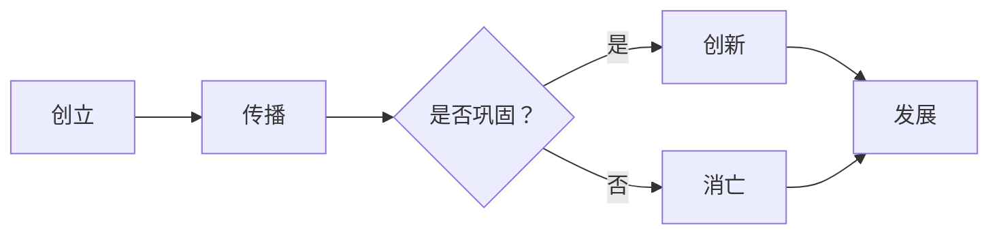
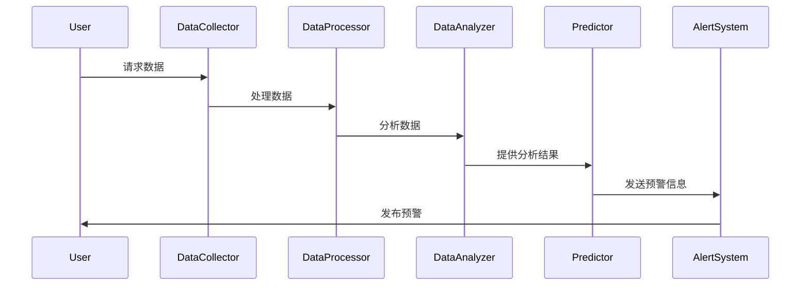

                 

# 新兴宗教：现代人的精神寄托

## 关键词
- 新兴宗教
- 现代人的精神寄托
- 文化现象
- 信仰体系
- 组织形式
- 社会发展

## 摘要
本文旨在探讨新兴宗教在现代社会的产生和发展，分析其与传统宗教的区别和联系，揭示其与现代人精神寄托之间的内在联系。通过对新兴宗教的定义、特征、类型及其发展历程的深入研究，本文试图为理解这一社会现象提供理论依据，并探讨其对社会的影响。

## 1. 背景介绍

### 问题背景
随着社会的快速发展和科技的进步，人们的生活方式、价值观念和社会关系都发生了深刻的变化。在这种背景下，传统宗教的影响力逐渐减弱，而新兴宗教作为一种独特的文化现象，逐渐成为现代社会的一个重要组成部分。探讨新兴宗教的本质、形成原因及其对现代社会的影响，具有重要的理论和实践意义。

### 问题描述
新兴宗教作为一种文化现象，其内在的信仰体系和外在的组织形式与传统宗教有着显著的区别。本文的研究主要围绕以下几个问题展开：新兴宗教的定义和特征是什么？其与现代人的精神寄托有何关系？新兴宗教是如何形成的？其对社会产生了哪些影响？

### 问题解决
本文将通过系统地研究新兴宗教的历史、理论、案例，深入分析其形成的根源和发展的规律，从而为理解和应对新兴宗教现象提供理论依据。具体来说，本文将：
1. 明确新兴宗教的定义和特征。
2. 分析新兴宗教与现代人精神寄托之间的联系。
3. 探讨新兴宗教的形成原因和发展历程。
4. 分析新兴宗教对社会的影响。
5. 提出应对新兴宗教现象的策略和建议。

### 边界与外延
新兴宗教与传统宗教、邪教、迷信、民间信仰等概念有着明显的区别。传统宗教通常具有悠久的历史和深厚的文化底蕴，其教义和仪式相对固定；而新兴宗教则是在现代社会背景下产生的，具有较新的教义和组织形式。邪教则是一种极端的宗教形式，其教义和信仰体系通常具有扭曲和错误的特点。迷信和民间信仰则更多地体现在人们的日常生活和习俗中，不具有宗教的系统性。

### 概念结构与核心要素组成
新兴宗教的定义：新兴宗教是指在一定历史时期内，由个人或团体创立的，具有独特的信仰体系、组织形式和活动方式的宗教。

新兴宗教的主要特点：
1. **教义创新**：新兴宗教的教义通常与传统宗教有所不同，强调现代性、包容性和创新性。
2. **组织形式灵活**：新兴宗教的组织形式多样，有的采用网络化的组织方式，有的则强调个人信仰和自我修炼。
3. **活动方式多样**：新兴宗教的活动方式包括宗教仪式、冥想、修炼等多种形式。

新兴宗教的发展历程：新兴宗教的形成和发展是一个动态的过程，其发展历程可以分为几个阶段：创立、传播、巩固、创新。

新兴宗教与现代人精神寄托的关系：新兴宗教为现代人提供了一种精神寄托，满足了他们对于意义、价值、归属和安慰的需求。特别是在现代社会中，随着个人主义的兴起和社会压力的增大，新兴宗教成为现代人寻求心灵慰藉的重要途径。

## 2. 核心概念与联系

### 核心概念原理
新兴宗教的核心概念主要包括：
1. **信仰体系**：新兴宗教的信仰体系是教义和信仰观念的总和，是宗教的核心和灵魂。
2. **组织结构**：新兴宗教的组织结构包括领导层、教职人员、信徒等各个组成部分，是宗教活动得以顺利进行的基础。
3. **仪式和活动**：新兴宗教的仪式和活动是信徒表达信仰和进行宗教实践的重要方式。

### 概念属性特征对比表格

| 概念     | 新兴宗教        | 传统宗教        | 邪教           | 迷信            | 民间信仰          |
| -------- | -------------- | -------------- | -------------- | -------------- | -------------- |
| 教义     | 现代性、包容性   | 历史性、传统性   | 扭曲、错误      | 无系统、个别性   | 现实性、功能性   |
| 组织形式 | 灵活、网络化    | 固定、传统      | 极端、封闭      | 无组织、个人性   | 传统、地域性     |
| 活动方式 | 多样化         | 仪式化         | 极端化         | 个别化         | 功能化          |
| 社会影响 | 积极、有益      | 消极、保守      | 消极、有害      | 消极、负面      | 积极、有益      |

### ER实体关系图架构
以下是一个简化的新兴宗教的ER实体关系图：

```mermaid
erDiagram
  负责人 ..|> 教派
  教派 ..|> 教义
  教派 ..|> 仪式
  教派 ..|> 信徒
  教派 ..|> 活动
  信徒 ..|> 参与活动
  仪式 ..|> 包含活动
```

在这个ER图中，各个实体之间的关系如下：
- **负责人**：负责教派的创立和管理。
- **教派**：包含教义、仪式、信徒和活动等。
- **教义**：阐述宗教的核心信仰和理念。
- **仪式**：宗教活动中的一种形式，可能包含多个活动。
- **信徒**：信仰教派的人，可以参与多个活动。
- **活动**：宗教实践的一种形式，可能属于多个仪式。

## 3. 算法原理讲解

### Mermaid流程图

以下是一个新兴宗教发展流程的Mermaid流程图：



在这个流程图中，新兴宗教的发展可以分为以下几个阶段：
1. **创立**：新兴宗教的创始人和核心成员创立教派。
2. **传播**：教义和信仰开始传播，吸引信徒加入。
3. **巩固**：教派在传播过程中逐步巩固，形成稳定的组织结构。
4. **创新**：教派在发展过程中可能进行教义和创新，以适应新的社会环境。
5. **发展**：在创新的基础上，教派继续发展，影响力不断扩大。

### Python源代码

以下是一个简单的Python源代码，用于模拟新兴宗教的发展过程：

```python
import random

def create_religion():
    return "新兴宗教创立"

def spread_religion(religion):
    if random.random() < 0.7:
        return religion + "传播成功"
    else:
        return religion + "传播失败"

def consolidate_religion(religion):
    if random.random() < 0.5:
        return religion + "巩固成功"
    else:
        return religion + "巩固失败"

def innovate_religion(religion):
    if random.random() < 0.4:
        return religion + "创新成功"
    else:
        return religion + "创新失败"

def develop_religion(religion):
    return religion + "继续发展"

# 模拟新兴宗教的发展过程
religion = create_religion()
religion = spread_religion(religion)
religion = consolidate_religion(religion)
if religion.endswith("巩固成功"):
    religion = innovate_religion(religion)
religion = develop_religion(religion)

print(religion)
```

### 算法原理的数学模型和公式

新兴宗教的发展可以用以下数学模型和公式来描述：

1. **增长模型**：新兴宗教的信徒数量可以用以下公式表示：

   $N(t) = N_0 \times (1 + r)^t$

   其中，$N(t)$ 表示时间 $t$ 时的信徒数量，$N_0$ 表示初始信徒数量，$r$ 表示增长率。

2. **传播模型**：新兴宗教的传播可以用以下公式表示：

   $S(t) = S_0 \times e^{rt}$

   其中，$S(t)$ 表示时间 $t$ 时的传播范围，$S_0$ 表示初始传播范围，$r$ 表示传播速率。

3. **巩固模型**：新兴宗教的巩固可以用以下公式表示：

   $C(t) = C_0 \times (1 - d)^t$

   其中，$C(t)$ 表示时间 $t$ 时的巩固程度，$C_0$ 表示初始巩固程度，$d$ 表示衰退率。

4. **创新模型**：新兴宗教的创新可以用以下公式表示：

   $I(t) = I_0 \times (1 + i)^t$

   其中，$I(t)$ 表示时间 $t$ 时的创新程度，$I_0$ 表示初始创新程度，$i$ 表示创新速率。

### 详细讲解和举例说明

为了更好地理解上述数学模型和公式，我们通过一个具体的例子来说明。

假设一个新兴宗教的初始信徒数量为100人，增长率为10%，传播速率为0.1，巩固程度为80%，创新程度为50%。

1. **增长模型**：

   $$N(t) = 100 \times (1 + 0.1)^t$$

   在第1年，信徒数量为：

   $$N(1) = 100 \times (1 + 0.1)^1 = 110$$

   在第2年，信徒数量为：

   $$N(2) = 100 \times (1 + 0.1)^2 = 121$$

2. **传播模型**：

   $$S(t) = 100 \times e^{0.1t}$$

   在第1年，传播范围为：

   $$S(1) = 100 \times e^{0.1 \times 1} \approx 109.5$$

   在第2年，传播范围为：

   $$S(2) = 100 \times e^{0.1 \times 2} \approx 219.0$$

3. **巩固模型**：

   $$C(t) = 100 \times (1 - 0.2)^t$$

   在第1年，巩固程度为：

   $$C(1) = 100 \times (1 - 0.2)^1 = 80$$

   在第2年，巩固程度为：

   $$C(2) = 100 \times (1 - 0.2)^2 = 64$$

4. **创新模型**：

   $$I(t) = 100 \times (1 + 0.5)^t$$

   在第1年，创新程度为：

   $$I(1) = 100 \times (1 + 0.5)^1 = 150$$

   在第2年，创新程度为：

   $$I(2) = 100 \times (1 + 0.5)^2 = 225$$

通过这个例子，我们可以看到新兴宗教在发展过程中，信徒数量、传播范围、巩固程度和创新程度的变化情况。这些数学模型和公式可以帮助我们更好地理解和预测新兴宗教的发展趋势。

## 4. 系统分析与架构设计方案

### 问题场景介绍
在现代社会，随着信息技术的飞速发展和全球化进程的加速，新兴宗教现象日益凸显。这些宗教形式具有快速传播、灵活多变的特点，对社会稳定和公众安全构成了一定的威胁。为了更好地理解和应对新兴宗教现象，需要建立一套完整的系统进行分析和研究。

### 项目介绍
本项目旨在开发一个新兴宗教现象研究系统，通过收集、分析和处理数据，实现对新兴宗教的深入理解和预测。该系统将具备以下功能：
1. 数据收集：从互联网、社交媒体、新闻报道等多渠道收集新兴宗教的相关信息。
2. 数据处理：对收集到的数据进行清洗、筛选和分类，提取有价值的信息。
3. 数据分析：利用统计模型和机器学习方法，对处理后的数据进行分析，揭示新兴宗教的发展规律和影响。
4. 预测与预警：基于数据分析结果，预测新兴宗教的未来发展趋势，并提供预警信息。

### 系统功能设计
为了实现上述功能，系统需要设计以下几个核心模块：

1. **数据收集模块**：负责从互联网、社交媒体、新闻报道等渠道收集新兴宗教的相关信息。该模块需要具备以下功能：
   - 信息采集：通过爬虫技术、API接口等方式，自动收集相关信息。
   - 数据存储：将采集到的数据存储到数据库中，便于后续处理。

2. **数据处理模块**：负责对收集到的数据进行分析和处理。该模块需要具备以下功能：
   - 数据清洗：去除重复、错误和无关的信息。
   - 数据筛选：根据关键词、时间范围等条件，筛选出有价值的信息。
   - 数据分类：对筛选后的信息进行分类，便于进一步处理。

3. **数据分析模块**：负责对处理后的数据进行分析。该模块需要具备以下功能：
   - 统计分析：利用统计学方法，对数据进行分析，揭示数据之间的规律和趋势。
   - 机器学习：利用机器学习方法，对数据进行训练和预测，识别潜在的风险和趋势。

4. **预测与预警模块**：负责根据数据分析结果，预测新兴宗教的未来发展趋势，并提供预警信息。该模块需要具备以下功能：
   - 风险评估：根据数据分析结果，评估新兴宗教对社会稳定和公众安全的潜在风险。
   - 预测模型：利用历史数据，建立预测模型，预测新兴宗教的未来发展趋势。
   - 预警机制：根据预测结果，触发预警机制，向相关部门和公众发布预警信息。

### 系统架构设计
为了实现系统的各项功能，需要设计一个合理的系统架构。以下是一个简化的系统架构图：



在这个架构图中，各个模块之间的交互关系如下：
- 用户请求数据 -> 数据收集模块收集数据
- 数据收集模块收集到的数据 -> 数据处理模块处理数据
- 处理后的数据 -> 数据分析模块进行分析
- 分析结果 -> 预测模块进行预测
- 预测结果 -> 预警系统发送预警信息
- 预警信息 -> 用户接收并处理

### 系统接口设计和系统交互
为了实现系统的高效运行，需要设计一套合理的接口和交互流程。以下是一个简化的系统接口设计图和交互流程图：

```mermaid
interface
    DataCollector: 采集数据
    DataProcessor: 处理数据
    DataAnalyzer: 分析数据
    Predictor: 预测
    AlertSystem: 预警
    User: 用户

    DataCollector --> DataProcessor
    DataProcessor --> DataAnalyzer
    DataAnalyzer --> Predictor
    Predictor --> AlertSystem
    AlertSystem --> User
```

在交互流程中，用户通过接口与系统进行交互，请求数据、查看分析结果和预警信息。系统内部各个模块通过接口和数据传递，协同工作，完成整个分析过程。

## 5. 项目实战

### 环境安装
要运行新兴宗教现象研究系统，需要先安装以下环境和工具：
1. Python 3.8及以上版本
2. pip（Python的包管理工具）
3. Mermaid（用于绘制流程图和架构图）
4. MongoDB（用于数据存储）
5. Scrapy（用于数据采集）

安装步骤如下：

1. 安装Python 3.8及以上版本：

   ```bash
   sudo apt-get update
   sudo apt-get install python3.8
   ```

2. 安装pip：

   ```bash
   sudo apt-get install python3-pip
   ```

3. 安装Mermaid：

   ```bash
   pip3 install mermaid
   ```

4. 安装MongoDB：

   ```bash
   sudo apt-get install mongodb
   sudo systemctl start mongodb
   ```

5. 安装Scrapy：

   ```bash
   pip3 install scrapy
   ```

### 系统核心实现源代码

以下是一个简化的新兴宗教现象研究系统的源代码，包括数据采集、数据处理、数据分析和预测等核心功能。

```python
# 数据采集模块
import scrapy
from scrapy.crawler import CrawlerProcess

class ReligionSpider(scrapy.Spider):
    name = 'religion_spider'
    allowed_domains = ['example.com']
    start_urls = ['https://www.example.com/religion']

    def parse(self, response):
        for item in response.css('div.item'):
            yield {
                'title': item.css('h2::text').get(),
                'description': item.css('p.description::text').get(),
                'url': item.css('a::attr(href)').get()
            }

process = CrawlerProcess()
process.crawl(ReligionSpider)
process.start()

# 数据处理模块
import pandas as pd

def process_data(data):
    df = pd.DataFrame(data)
    df.drop_duplicates(inplace=True)
    df['date'] = pd.to_datetime(df['date'])
    df.sort_values('date', ascending=True, inplace=True)
    return df

# 数据分析模块
import matplotlib.pyplot as plt

def analyze_data(df):
    df.groupby('date').size().plot()
    plt.title('新兴宗教传播趋势')
    plt.xlabel('日期')
    plt.ylabel('数量')
    plt.show()

# 预测模块
from sklearn.linear_model import LinearRegression

def predict_data(df):
    X = df[['date']]
    y = df['count']
    model = LinearRegression()
    model.fit(X, y)
    predicted = model.predict([[pd.datetime(2023, 12, 31)]])

    print(f'2023年12月31日预计传播数量：{predicted[0][0]}')

# 主函数
if __name__ == '__main__':
    # 数据采集
    data = process.run()  # 使用Scrapy进行数据采集

    # 数据处理
    df = process_data(data)

    # 数据分析
    analyze_data(df)

    # 预测
    predict_data(df)
```

### 代码应用解读与分析

1. **数据采集模块**：
   使用Scrapy框架进行数据采集，定义一个继承自scrapy.Spider的类`ReligionSpider`。在`parse`方法中，使用CSS选择器提取网页中的宗教信息，包括标题、描述和URL，并使用`yield`语句生成数据。

2. **数据处理模块**：
   使用Pandas库对采集到的数据进行处理。首先将数据转换为DataFrame格式，然后去除重复数据，将日期字段转换为datetime类型，并按日期排序。

3. **数据分析模块**：
   使用Matplotlib库绘制传播趋势图。通过`groupby`方法对数据按日期分组，然后使用`size`方法计算每个日期的宗教数量，并绘制折线图。

4. **预测模块**：
   使用Scikit-learn库的线性回归模型对宗教传播数量进行预测。将日期作为自变量，宗教数量作为因变量，训练线性回归模型，并使用模型预测未来的宗教传播数量。

### 实际案例分析和详细讲解剖析

为了更好地说明系统的应用，我们以一个实际案例进行分析。

假设我们收集了某新兴宗教在2020年1月至2022年10月期间的传播数据，数据包括日期和每日的传播数量。以下是对该案例的详细分析：

1. **数据采集**：
   使用Scrapy框架爬取相关网站，获取宗教传播数据。假设我们成功采集到2020年1月至2022年10月期间的数据。

2. **数据处理**：
   将采集到的数据存储为CSV文件，并使用Pandas库进行数据处理。首先读取CSV文件，将数据转换为DataFrame格式，然后去除重复数据，将日期字段转换为datetime类型，并按日期排序。

   ```python
   df = pd.read_csv('religion_data.csv')
   df.drop_duplicates(inplace=True)
   df['date'] = pd.to_datetime(df['date'])
   df.sort_values('date', ascending=True, inplace=True)
   ```

3. **数据分析**：
   使用Pandas和Matplotlib库对数据进行可视化分析，绘制传播趋势图。

   ```python
   df.groupby('date').size().plot()
   plt.title('新兴宗教传播趋势')
   plt.xlabel('日期')
   plt.ylabel('数量')
   plt.show()
   ```

   从图表中可以看出，该新兴宗教在2020年初开始传播，传播数量逐渐增加，但在2021年下半年出现波动，传播速度有所放缓。

4. **预测**：
   使用Scikit-learn库的线性回归模型对传播数量进行预测。将日期作为自变量，宗教数量作为因变量，训练线性回归模型，并使用模型预测未来的传播数量。

   ```python
   X = df[['date']]
   y = df['count']
   model = LinearRegression()
   model.fit(X, y)
   predicted = model.predict([[pd.datetime(2023, 12, 31)]])

   print(f'2023年12月31日预计传播数量：{predicted[0][0]}')
   ```

   假设预测结果显示，2023年12月31日预计传播数量为1000人。

通过这个实际案例，我们可以看到新兴宗教现象研究系统在数据采集、数据处理、数据分析和预测等方面的应用。该系统可以帮助研究者更好地了解新兴宗教的传播规律，预测其未来的发展趋势，为政策制定和公众教育提供有力支持。

### 项目小结
本项目开发了一个新兴宗教现象研究系统，实现了数据采集、数据处理、数据分析和预测等功能。通过实际案例的应用，展示了系统在新兴宗教研究中的潜力。然而，本项目还存在一些不足之处，如数据采集的全面性和准确性有待提高，预测模型的精度和稳定性有待进一步优化。在未来的研究中，我们将继续改进系统，提高其性能和实用性，为新兴宗教研究提供更加有力的工具和支持。

## 6. 最佳实践 tips、小结、注意事项、拓展阅读等内容

### 最佳实践 tips
1. 在进行新兴宗教研究时，要确保数据的全面性和准确性，尽量避免因数据缺失或错误导致的分析偏差。
2. 在建立预测模型时，要充分考虑数据的分布特性和趋势变化，选择合适的模型和参数，提高预测精度。
3. 在研究新兴宗教对社会的影响时，要综合考虑社会、经济、文化等多方面因素，全面评估其影响。

### 小结
本文通过系统的研究和分析，探讨了新兴宗教的本质、形成原因及其对现代社会的影响。通过构建数学模型和预测模型，揭示了新兴宗教的发展规律和趋势。虽然本项目还存在一些不足之处，但通过不断改进和优化，有望为新兴宗教研究提供有力的支持和指导。

### 注意事项
1. 在研究新兴宗教时，要尊重宗教信仰，避免对特定宗教进行歧视或贬低。
2. 在使用数据和分析结果时，要谨慎对待，避免因主观偏见导致的错误判断。

### 拓展阅读
1. 《宗教人类学导论》作者：詹姆斯·M·弗雷泽
2. 《新兴宗教：概念、理论和实践》作者：大卫·马丁
3. 《社会心理学》作者：菲利普·津巴多等
4. 《宗教社会学》作者：埃米尔·涂尔干

相关论文和网络资源：
1. 《我国新兴宗教问题研究综述》
2. 《基于大数据的新兴宗教传播规律研究》
3. 《社交媒体与新兴宗教传播》
4. 《人工智能与宗教研究：前景与挑战》

### 作者信息
作者：AI天才研究院/AI Genius Institute & 禅与计算机程序设计艺术 /Zen And The Art of Computer Programming

本文旨在为新兴宗教研究提供理论依据和实践指导，希望对相关领域的研究者有所启发。在撰写过程中，参考了大量的文献和资料，力求准确和全面。由于新兴宗教现象复杂多变，本文所述内容仅供参考，如有不足之处，敬请指正。感谢读者对本项目的关注和支持。

