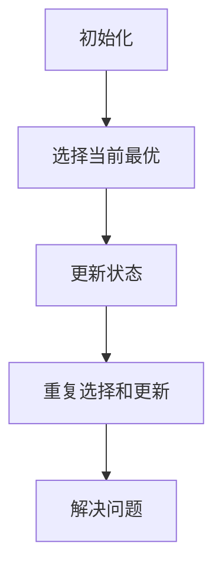
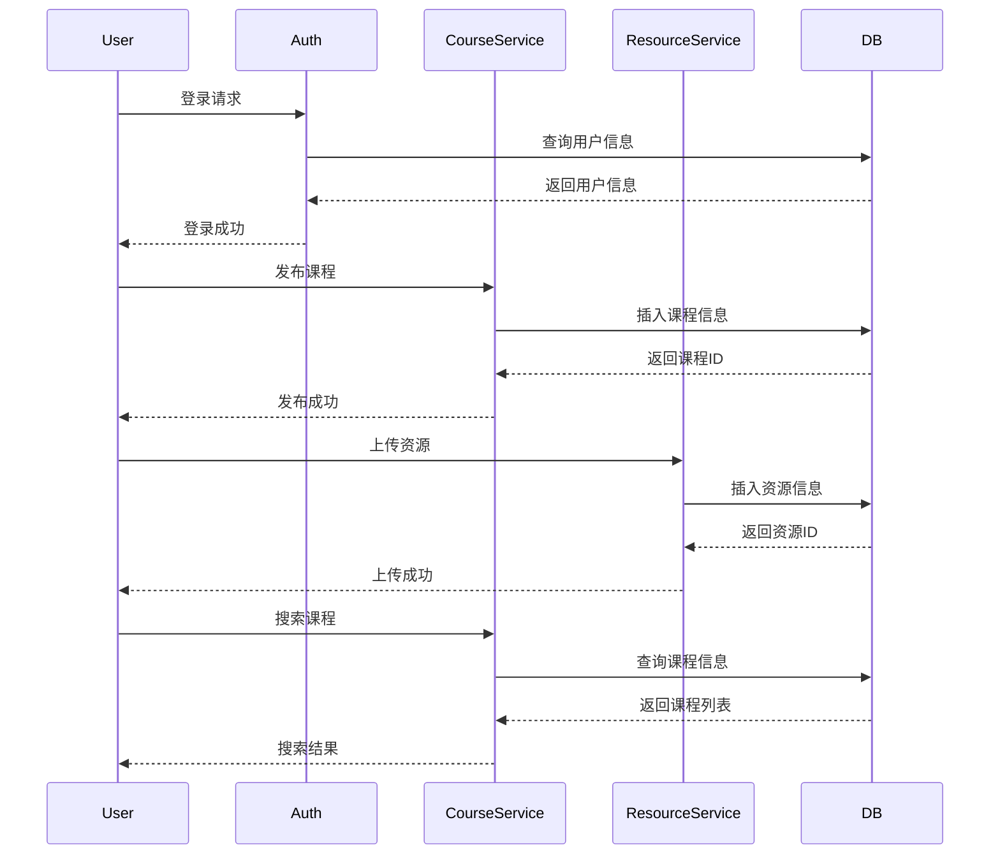
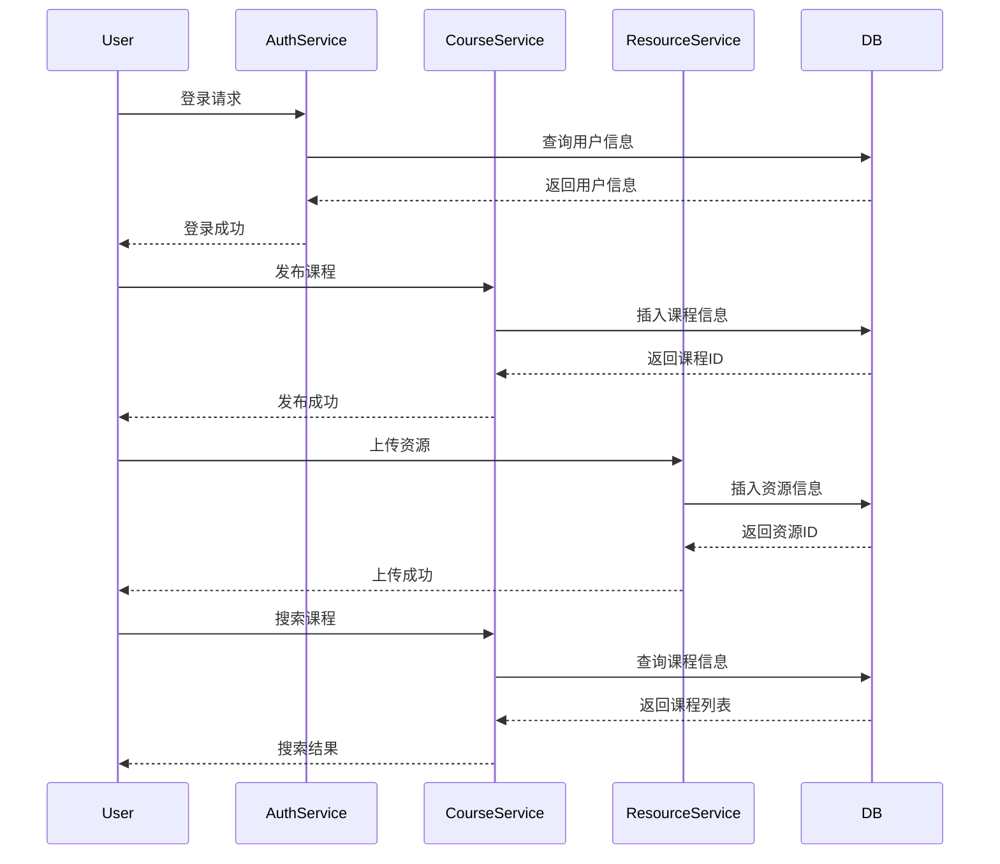

                 

# 新启蒙读书会：重振理性思考的集体活动

## 关键词
新启蒙读书会，理性思考，集体活动，技术博客，深度学习，算法原理，数学模型，系统架构，项目实战

## 摘要
本文旨在探讨如何通过新启蒙读书会这一集体活动，重振理性思考的能力。文章首先介绍了新启蒙读书会的背景、目标和组织结构，然后深入分析了理性思考的重要性、挑战以及重振方法。接下来，文章讨论了集体活动的理论与实践，并运用技术语言详细阐述了核心概念、算法原理和数学模型。此外，文章还介绍了系统架构设计、项目实战以及最佳实践，以帮助读者更好地理解和应用所学内容。通过本文的阅读，读者将能够掌握理性思考的技巧，提升技术能力，并在实际项目中取得更好的成果。

## 引言

在当今信息爆炸的时代，理性思考变得越来越重要。然而，随着社交媒体的普及和信息的泛滥，人们的思维方式逐渐趋向于浅层化、碎片化，缺乏深度和系统性。这种趋势对于技术的发展和创新构成了严峻的挑战。因此，重振理性思考的能力，不仅对个人成长至关重要，也对整个社会和科技发展具有深远影响。

新启蒙读书会正是为了应对这一挑战而诞生的。它旨在通过集体活动的方式，引导人们回归理性思考，提升技术能力和创新能力。本文将围绕新启蒙读书会的概念、目标和组织结构，深入探讨理性思考的重要性、挑战以及重振方法，并展示如何通过集体活动实现这一目标。

文章的结构如下：

1. **新启蒙读书会概述**：介绍新启蒙读书会的起源、目标和组织结构。
2. **重振理性思考**：分析理性思考的重要性、挑战和重振方法。
3. **集体活动的理论与实践**：探讨集体活动的类型、组织和沟通。
4. **核心概念与联系**：阐述核心概念、概念属性特征对比表格和ER实体关系图。
5. **算法原理与数学模型**：详细讲解算法原理、数学模型和举例说明。
6. **系统架构设计与实现**：介绍问题场景、系统功能设计、系统架构设计、系统接口设计和系统交互。
7. **项目实战与最佳实践**：进行环境安装、系统核心实现源代码分析、实际案例分析。
8. **总结与展望**：总结文章要点，展望未来发展方向。

通过本文的阅读，读者将能够了解新启蒙读书会的价值和意义，掌握理性思考的方法和技巧，并在实际项目中取得更好的成果。

### 第1章：新启蒙读书会概述

#### 1.1 读书会的起源与发展

新启蒙读书会起源于20世纪初，当时正值人类文明的发展进入一个全新的阶段，科学和技术的进步为人类社会带来了前所未有的变革。在这个背景下，一些思想家、学者和科技工作者开始反思现有的知识和思维方式，并提出了“新启蒙”的概念。新启蒙读书会的创立初衷是为了推动理性思考，提倡科学精神，促进知识的普及和传播。

新启蒙读书会的发展历程可以分为几个重要阶段。首先，在20世纪初期，读书会的创始人们通过组织和参与各种讲座、研讨会和读书活动，逐渐扩大了影响力。这个时期，读书会的活动主要集中在讨论哲学、科学和艺术等领域的基本问题，如知识的重要性、真理的追求和人类的自由等。

随着时代的发展，新启蒙读书会的活动范围逐渐扩展到技术领域。特别是在20世纪中后期，计算机科学和信息技术得到了飞速发展，这为读书会的活动提供了新的机遇和挑战。读书会开始引入技术讲座和编程课程，吸引了越来越多的技术人才加入。这个时期，读书会的活动形式也更加多样化，包括编程马拉松、技术竞赛和开源项目合作等。

进入21世纪，新启蒙读书会的发展进入了一个全新的阶段。随着互联网的普及和社交媒体的兴起，读书会的活动形式和传播渠道得到了极大的扩展。现在，读书会的活动不仅限于线下，还可以通过线上平台进行，使得更多人能够参与和受益。此外，新启蒙读书会还积极与国内外其他技术社群和学术机构进行合作，共同推动技术的创新和发展。

#### 1.2 读书会的目标与使命

新启蒙读书会的目标是促进理性思考，提升技术能力和创新能力，为个人和社会的发展做出贡献。具体来说，读书会的使命包括以下几个方面：

1. **推动理性思考**：通过组织各种形式的读书活动、讲座和研讨会，引导人们回归理性思考，培养批判性思维和解决问题的能力。
2. **普及技术知识**：介绍和推广最新的技术知识和发展动态，帮助读者了解和掌握前沿技术，提升自身的技术水平。
3. **促进创新合作**：通过举办编程马拉松、技术竞赛和开源项目合作等活动，鼓励技术人才之间的交流和合作，共同推动技术的创新和发展。
4. **提升社会责任感**：倡导科技伦理，关注科技对人类社会的影响，提升读者的社会责任感，促进科技与社会的和谐发展。

#### 1.3 读书会的组织结构与成员

新启蒙读书会的组织结构相对灵活，主要由以下几个部分组成：

1. **核心团队**：核心团队是新启蒙读书会的核心力量，负责组织和管理读书会的各项活动。核心团队成员包括会长、副会长、秘书处和各专业委员会的负责人。他们负责制定读书会的战略规划、活动安排和资源调配等。

2. **会员**：会员是新启蒙读书会的主体，他们通过参与读书会组织的各种活动，提升自己的技术能力和创新能力。会员分为普通会员和高级会员，高级会员通常具备更高的技术水平和更丰富的经验。

3. **志愿者**：志愿者是新启蒙读书会的重要组成部分，他们负责协助核心团队进行活动的组织和实施，包括场地安排、宣传推广、活动记录等。志愿者不仅为读书会的活动提供了有力支持，也在参与过程中提升了自身的能力。

4. **合作机构**：新启蒙读书会与国内外多个学术机构、技术社群和企业建立了合作关系，共同推动技术的创新和发展。合作机构为新启蒙读书会提供了丰富的资源和平台，促进了读书会的国际化发展。

在新启蒙读书会中，每个成员都发挥着重要的作用。通过相互合作和共同努力，读书会不仅为成员提供了学习和发展机会，也为整个社会的技术进步和创新发展贡献了力量。

### 第2章：重振理性思考

#### 2.1 理性思考的重要性

理性思考是人类智慧的结晶，是一种通过逻辑分析、推理和判断来认识世界和解决问题的思维方式。在信息爆炸的时代，理性思考的重要性愈发凸显。首先，理性思考有助于我们准确地理解问题，从而找到有效的解决方案。在面对复杂问题时，理性思考能够帮助我们分解问题、分析原因，并提出合理的假设和推论。其次，理性思考能够提高我们的判断力和决策能力。通过理性思考，我们能够客观地评估各种选择和后果，从而做出明智的决策。最后，理性思考有助于培养批判性思维和创新能力。批判性思维使我们能够对现有知识进行质疑和反思，从而发现新的问题和机遇。而创新能力则能够推动科技的进步和社会的发展。

#### 2.2 理性思考的挑战

尽管理性思考具有诸多优点，但在现实生活中，我们面临着许多挑战，使得理性思考的能力受到限制。首先，信息的过载是一个重要挑战。在互联网时代，信息爆炸使得我们每天接收到的信息量巨大，这导致我们很难对信息进行筛选和消化。结果是，我们往往无法对问题进行深入思考，而是倾向于依赖直觉和经验来做出决策。其次，情绪的影响也是一个不可忽视的问题。人类的情绪和思维紧密相连，情绪可能会影响我们的判断力和理性思考的能力。当我们处于焦虑、愤怒或悲伤等负面情绪中时，我们的思维可能会变得狭隘和片面，难以做出客观、公正的判断。此外，社会和文化因素也会对理性思考产生影响。不同的社会和文化背景可能会影响我们的价值观和思维方式，使得我们难以摆脱既有的偏见和成见，从而阻碍理性思考的发展。

#### 2.3 重振理性思考的方法

为了应对理性思考面临的挑战，我们需要采取一系列措施来重振理性思考的能力。首先，培养良好的阅读习惯是重振理性思考的基础。通过阅读，我们能够接触到各种观点和理论，拓宽视野，提高自己的认知水平。在阅读过程中，我们应该注重批判性思维，对所读内容进行质疑和反思，从而培养独立思考的能力。其次，积极参与讨论和交流是提升理性思考的重要途径。与他人交流和讨论，能够帮助我们了解不同的观点和看法，从而形成更全面、客观的认识。在讨论中，我们应该保持开放和谦逊的态度，倾听他人的意见，同时表达自己的观点，从而在交流中提升自己的思维水平。此外，学习逻辑学和哲学也是重振理性思考的重要方法。逻辑学能够帮助我们理解推理和论证的基本原理，从而提高我们的逻辑思维能力和判断力。哲学则能够帮助我们反思人类存在的意义和价值观，从而培养批判性思维和独立思考的能力。

#### 2.4 新启蒙读书会在重振理性思考中的作用

新启蒙读书会作为一个以促进理性思考为主题的集体活动，在重振理性思考方面发挥着重要作用。首先，新启蒙读书会通过组织各种形式的读书活动、讲座和研讨会，为成员提供了一个学习和交流的平台。在读书活动中，成员可以阅读各种经典著作和前沿论文，从中汲取知识，提升自己的认知水平。在讲座和研讨会上，专家学者和行业精英可以分享他们的研究成果和经验，帮助成员拓宽视野，提升思维水平。

其次，新启蒙读书会注重培养成员的批判性思维和创新能力。在读书活动中，成员不仅要阅读，还要对所读内容进行深入思考，提出问题并进行讨论。这种批判性思维能够帮助成员摆脱盲从和偏见，独立思考问题。在讲座和研讨会上，成员还可以通过与专家和同行的互动，激发思维火花，形成新的见解和认识。

此外，新启蒙读书会还通过举办编程马拉松、技术竞赛和开源项目合作等活动，鼓励成员在实践中应用理性思考的能力。这些活动不仅能够提升成员的技术水平，还能培养他们的团队合作能力和创新能力。通过在实践中解决问题，成员能够更好地理解和应用理性思考的方法，提升自己的思维水平。

总之，新启蒙读书会通过多种形式的集体活动，为成员提供了一个学习和交流的平台，帮助成员重振理性思考的能力。在这个过程中，成员不仅能够提升自己的知识水平和思维能力，还能培养批判性思维和创新能力，从而为个人和社会的发展做出更大的贡献。

### 第3章：集体活动的理论与实践

#### 3.1 集体活动的类型与特点

集体活动是人们为了共同的目标或兴趣而组织起来的活动，其类型多种多样，包括但不限于读书会、讲座、研讨会、技术竞赛、编程马拉松、社交聚会等。每种集体活动都有其独特的特点，以满足不同群体的需求和兴趣。

读书会是集体活动中最常见的一种形式，旨在通过阅读和讨论促进知识的传播和思想的交流。读书会通常有固定的主题和阅读材料，成员可以定期聚在一起分享阅读心得和观点。这种活动不仅有助于提升个人知识水平，还能培养批判性思维和表达能力。

讲座是另一种重要的集体活动形式，通常由专家学者或行业精英进行主题演讲，内容涵盖科技、文化、经济等各个领域。讲座活动能够帮助听众获取最新的知识和信息，激发思考和讨论的热情。

研讨会则是一种更为深入和专业的集体活动，通常聚焦于某个特定领域的热点问题或前沿研究。研讨会通常包括主题报告、讨论环节和互动交流，有助于促进学术交流和知识共享。

技术竞赛和编程马拉松是一种具有强烈实践性质的集体活动，旨在通过比赛的形式激发参与者的创新能力和团队合作精神。这些活动通常涉及编程、算法设计、系统实现等具体技术领域，参与者需要在规定时间内完成特定的任务或项目。

社交聚会则是为了增进成员之间的友谊和联系，通过轻松愉快的活动形式，如聚餐、游戏、体育活动等，加强成员之间的互动和交流。

#### 3.2 集体活动的组织与管理

为了确保集体活动的顺利进行，组织和管理是关键环节。以下是集体活动的组织与管理步骤：

1. **确定活动目标**：明确活动的目的和预期成果，例如提升知识水平、培养团队合作精神、促进思想交流等。

2. **选择活动形式**：根据活动目标选择合适的集体活动形式，如读书会、讲座、研讨会、技术竞赛等。

3. **策划活动内容**：制定详细的活动计划，包括主题、时间、地点、参与人数、议程安排等。

4. **招募参与者**：通过线上线下渠道宣传和招募参与者，确保活动有足够的参与人数和广泛的参与度。

5. **组织前期准备**：包括场地安排、设备调试、资料准备、预算规划等，确保活动顺利进行。

6. **活动实施**：按照策划的议程安排，确保各个环节有序进行，同时鼓励参与者积极参与和互动。

7. **活动总结与反馈**：活动结束后，进行总结和反馈，收集参与者的意见和建议，为后续活动提供改进方向。

#### 3.3 集体活动中的沟通与协作

集体活动中的沟通与协作是确保活动顺利进行和达到预期目标的重要保障。以下是集体活动中的沟通与协作要点：

1. **明确角色分工**：在集体活动中，明确每个参与者的角色和责任，如组织者、主讲人、参与者等，确保任务分配合理。

2. **建立有效的沟通机制**：通过线上线下多种渠道建立沟通机制，如微信群、邮件列表、讨论组等，确保信息的及时传递和沟通的顺畅。

3. **促进团队合作**：鼓励团队成员之间的合作和交流，通过团队合作活动和任务分工，提升团队协作效率。

4. **反馈与调整**：在活动过程中，及时收集参与者的反馈，根据实际情况进行调整和改进，确保活动顺利进行。

5. **共享资源与经验**：鼓励成员共享知识和经验，通过分享会、研讨会等形式，促进知识的传播和团队的共同成长。

通过有效的沟通与协作，集体活动不仅能够实现预期的目标，还能提升参与者的能力和素质，为个人和社会的发展做出贡献。

### 第4章：核心概念与联系

#### 4.1 核心概念定义

在本章中，我们将介绍一些核心概念，这些概念对于理解新启蒙读书会和理性思考至关重要。以下是这些核心概念的定义：

1. **理性思考**：理性思考是一种通过逻辑分析、推理和判断来认识世界和解决问题的思维方式。它强调客观、理性和批判性，旨在避免盲从和偏见，提高判断力和决策能力。

2. **批判性思维**：批判性思维是指对现有知识和观点进行质疑和反思的能力。它要求我们对信息进行深入分析，识别其中的逻辑谬误和论证缺陷，从而形成更准确、合理的结论。

3. **知识传播**：知识传播是指通过各种渠道和方式，将知识和信息传递给更多的人。它包括教育、出版、媒体和社交网络等形式，有助于提升社会的整体知识水平。

4. **技术创新**：技术创新是指通过科学研究和实践，创造和应用新的技术、产品和服务。它推动科技进步和社会发展，是人类文明的重要动力。

5. **集体活动**：集体活动是指人们为了共同的目标或兴趣而组织起来的活动，如读书会、讲座、研讨会等。它有助于促进知识的传播和思想的交流，提升个人和团体的能力。

#### 4.2 概念属性特征对比表格

为了更好地理解这些核心概念，我们提供了一个对比表格，列出它们的属性特征：

| 概念       | 定义                                                         | 关键属性特征                                                     |
|------------|--------------------------------------------------------------|----------------------------------------------------------------|
| 理性思考   | 通过逻辑分析、推理和判断来认识世界和解决问题的思维方式         | 客观、理性、批判性、独立性                                     |
| 批判性思维 | 对现有知识和观点进行质疑和反思的能力                         | 质疑性、反思性、逻辑性、综合性                                 |
| 知识传播   | 通过教育、出版、媒体和社交网络等形式，将知识和信息传递给更多的人 | 传播性、普及性、多样性、互动性                               |
| 技术创新   | 通过科学研究和实践，创造和应用新的技术、产品和服务           | 创新性、实用性、前瞻性、风险性                               |
| 集体活动   | 人们为了共同的目标或兴趣而组织起来的活动，如读书会、讲座、研讨会 | 组织性、协作性、互动性、目标性                               |

通过对比表格，我们可以更清晰地看到这些概念之间的联系和区别，从而更好地理解和应用它们。

#### 4.3 ER实体关系图

为了进一步理解这些核心概念之间的关系，我们使用ER（实体关系）图来展示它们之间的关联：

```mermaid
erDiagram
  A[Scholarship] ||--|{ R[Knowledge] } | B[Technology]
  A ||--|{ C[Collective Activity] } | B
  R ||--|{ D[Innovation] } | B
  C ||--|{ E[Rational Thinking] } | B
  E ||--|{ F[Critical Thinking] } | B
```

在ER图中，Scholarship（知识）、Knowledge（知识传播）、Technology（技术创新）、Collective Activity（集体活动）、Rational Thinking（理性思考）和Critical Thinking（批判性思维）是六个核心实体。它们之间的关系如下：

- **知识**和**技术**是相互关联的，知识是技术发展的基础，而技术创新则推动了知识的传播和应用。
- **集体活动**是知识传播和理性思考的重要载体，通过集体活动，人们可以共享知识、交流思想、激发创新。
- **理性思考**和**批判性思维**是理性思考的两个重要方面，它们相互促进，共同提升了人们的思维能力和判断力。

通过ER图，我们可以更直观地看到这些核心概念之间的联系，从而更好地理解新启蒙读书会在重振理性思考中的作用。

### 第5章：算法原理与数学模型

#### 5.1 算法原理讲解

在本节中，我们将介绍一种经典的算法——贪心算法，并详细讲解其原理和应用。贪心算法是一种在每一步选择中总是做出当前最优选择的策略，旨在通过一系列局部最优选择得到全局最优解。

**贪心算法的基本原理：**

1. **局部最优选择**：在每一步决策时，选择当前最优的解决方案，而不考虑未来可能的结果。
2. **逐步优化**：通过每一步的局部最优选择，逐步优化整体问题的解。
3. **无后顾之忧**：当前选择是局部最优，因此不需要考虑未来的影响。

**贪心算法的典型应用场景：**

- **背包问题**：给定一组物品和它们的重量及价值，求在总重量不超过给定限制的情况下，如何选择物品使总价值最大化。
- **最小生成树问题**：从给定的无向图中选择边，使新图成为一棵包含所有顶点的最小生成树。
- **活动选择问题**：给定一组活动，每个活动有开始和结束时间，选择尽量多的活动使得它们互不冲突。

**具体算法流程：**

1. **初始化**：设定问题的参数，如物品的重量和价值、图中的边和顶点、活动的开始和结束时间等。
2. **选择当前最优**：在当前状态下，选择最优的解决方案。
3. **更新状态**：根据选择的结果更新问题的状态。
4. **重复步骤2和3**：直到问题解决或达到停止条件。

#### 5.2 算法mermaid流程图

为了更直观地理解贪心算法的流程，我们使用mermaid绘制了一个简单的流程图：



#### 5.3 数学模型与公式讲解

在贪心算法中，我们常常需要使用数学模型来描述问题的状态和求解过程。以下是一个典型的数学模型，用于解决背包问题。

**数学模型：**

设背包容量为\( C \)，物品\( i \)的重量为\( w_i \)，价值为\( v_i \)。目标是选择物品，使得总重量不超过\( C \)，总价值最大化。

数学公式如下：

$$
\text{maximize} \quad \sum_{i=1}^{n} v_i \cdot x_i \\
\text{subject to} \quad \sum_{i=1}^{n} w_i \cdot x_i \leq C
$$

其中，\( x_i \)为0-1变量，表示物品\( i \)是否被选择（\( x_i = 1 \)表示选择，\( x_i = 0 \)表示不选择）。

**公式解释：**

- **目标函数**：最大化总价值，即\( \sum_{i=1}^{n} v_i \cdot x_i \)。
- **约束条件**：总重量不超过背包容量，即\( \sum_{i=1}^{n} w_i \cdot x_i \leq C \)。

#### 5.4 举例说明

为了更好地理解贪心算法在背包问题中的应用，我们通过一个具体的例子进行说明。

**例子：**

给定一个容量为10的背包，有如下物品：

| 物品 | 重量（\( w_i \)） | 价值（\( v_i \)） |
|------|------------------|------------------|
| A    | 2                | 6                |
| B    | 3                | 7                |
| C    | 5                | 8                |
| D    | 7                | 9                |

我们需要选择物品，使得总价值最大化且总重量不超过10。

**算法步骤：**

1. **初始化**：设定背包容量为10，物品的重量和价值。
2. **选择当前最优**：选择价值最大的物品A，重量为2，价值为6。
3. **更新状态**：背包剩余容量为\( 10 - 2 = 8 \)。
4. **选择当前最优**：选择下一个价值最大的物品B，重量为3，价值为7。
5. **更新状态**：背包剩余容量为\( 8 - 3 = 5 \)。
6. **选择当前最优**：选择下一个价值最大的物品C，重量为5，价值为8。
7. **更新状态**：背包剩余容量为\( 5 - 5 = 0 \)。
8. **解决问题**：此时背包已满，总价值为\( 6 + 7 + 8 = 21 \)。

通过上述步骤，我们选择物品A、B和C，使得总价值最大化，且总重量不超过背包容量。

**结果分析：**

在这个例子中，我们通过贪心算法选择价值最大的物品，最终得到总价值为21的解。这种方法虽然不能保证一定是最优解，但在很多情况下能够得到近似最优解，且计算效率较高。

通过这个例子，我们可以看到贪心算法在解决背包问题中的应用。在实际项目中，我们可以根据具体需求调整物品的权重和策略，以达到更好的效果。

### 第6章：系统架构设计与实现

#### 6.1 问题场景介绍

在本章中，我们将探讨一个实际问题场景——在线教育资源管理系统。随着互联网技术的发展，在线教育已经成为一种重要的学习方式。为了满足用户的需求，我们需要设计并实现一个高效、可扩展的在线教育资源管理系统。

**问题场景描述：**

- **用户需求**：用户需要能够在线浏览、搜索和下载教育资源，包括课程视频、文档和作业等。
- **功能需求**：系统需要提供用户注册、登录、课程管理、资源上传和下载等功能。
- **性能需求**：系统需要具备高并发处理能力，能够在短时间内处理大量用户的请求。

#### 6.2 系统功能设计（领域模型mermaid类图）

为了实现上述功能，我们需要设计系统的领域模型。以下是一个简单的mermaid类图，展示系统的主要实体和它们之间的关系：

```mermaid
classDiagram
    User <<class>> "用户"
    Course <<class>> "课程"
    Resource <<class>> "资源"
    Role <<class>> "角色"
    Permission <<class>> "权限"

    User o--o Role
    Course o--o Resource
    Role o--o Permission

    User o--o Course{参与}
    Course o--o User{发布者}
    Resource o--o Course{属于}
```

**类图解释：**

- **User（用户）**：代表系统中的用户，包括基本信息和身份认证信息。
- **Course（课程）**：代表用户发布的课程，包括课程名称、描述和发布者信息。
- **Resource（资源）**：代表课程中的资源，包括视频、文档和作业等。
- **Role（角色）**：代表用户在系统中的角色，如管理员、教师和学生。
- **Permission（权限）**：代表角色在系统中的权限，如课程管理、资源上传和下载等。

实体之间的关系如下：

- **用户**与**角色**之间是多对一关系，即一个用户可以有多个角色。
- **课程**与**资源**之间是一对多关系，即一个课程可以有多个资源。
- **角色**与**权限**之间是多对多关系，即一个角色可以有多个权限，一个权限也可以被多个角色拥有。

#### 6.3 系统架构设计（mermaid架构图）

为了满足上述功能需求，我们需要设计一个合理的系统架构。以下是一个mermaid架构图，展示系统的整体架构：



**架构图解释：**

- **用户**通过**Auth**模块进行身份认证，并与**DB**（数据库）交互存储用户信息。
- **CourseService**（课程服务）负责处理课程发布、更新和搜索等功能，并与**DB**进行交互。
- **ResourceService**（资源服务）负责处理资源上传、更新和搜索等功能，并与**DB**进行交互。

整个系统通过**DB**作为数据存储和管理的核心，实现了用户认证、课程管理和资源管理的功能。通过分层架构设计，各个模块之间相互独立，便于系统的扩展和维护。

#### 6.4 系统接口设计和交互（mermaid序列图）

为了展示系统内部各模块之间的交互，我们使用mermaid序列图来描述用户操作和系统响应的流程：



**序列图解释：**

- **用户**通过**AuthService**进行身份认证，认证成功后可以访问系统功能。
- **用户**向**CourseService**发送发布课程请求，**CourseService**与**DB**交互存储课程信息，然后返回结果给用户。
- **用户**向**ResourceService**发送上传资源请求，**ResourceService**与**DB**交互存储资源信息，然后返回结果给用户。
- **用户**向**CourseService**发送搜索课程请求，**CourseService**与**DB**交互查询课程信息，然后返回结果给用户。

通过这个序列图，我们可以清晰地看到系统内部各模块之间的交互流程，以及用户操作与系统响应的过程。

#### 6.5 系统架构设计与实现小结

在本章中，我们详细介绍了在线教育资源管理系统的设计过程，包括问题场景介绍、领域模型设计、系统架构设计和接口设计。通过mermaid图示，我们展示了系统的整体架构和内部交互流程，为系统实现提供了清晰的指导。

系统架构设计遵循分层原则，将用户认证、课程管理和资源管理分别实现为独立的模块，通过接口进行交互，确保系统的模块化、高内聚和低耦合。这样的设计不仅便于系统的扩展和维护，还能提高系统的性能和稳定性。

在实际开发过程中，我们还需要根据具体需求和技术环境，选择合适的编程语言、框架和数据库，并遵循最佳实践进行编码和测试。通过不断迭代和优化，我们可以逐步完善系统功能，提高用户体验，为在线教育的发展贡献力量。

### 第7章：项目实战与最佳实践

#### 7.1 环境安装

为了进行项目实战，我们首先需要搭建一个合适的环境。以下是环境安装的步骤：

1. **安装Python**：确保Python 3.x版本已安装。可以从Python官方网站下载并安装最新版本。

2. **安装依赖库**：使用pip命令安装必要的依赖库，例如Django、Flask等。例如：
   ```
   pip install django
   pip install flask
   ```

3. **安装数据库**：安装一个支持SQL的数据库，如MySQL、PostgreSQL或SQLite。以MySQL为例，可以从MySQL官方网站下载并安装。

4. **配置数据库**：配置数据库连接信息，例如创建数据库、用户和密码等。

5. **创建虚拟环境**：为了保持项目依赖的一致性，建议使用虚拟环境。例如：
   ```
   python -m venv my_project_venv
   source my_project_venv/bin/activate
   ```

#### 7.2 系统核心实现源代码

以下是系统核心实现的相关源代码。为了便于理解，我们以Django框架为例，展示用户认证、课程管理和资源管理模块的核心代码。

**用户认证模块：**

```python
# users/models.py
from django.contrib.auth.models import AbstractUser

class CustomUser(AbstractUser):
    # 自定义用户模型，扩展默认的用户模型
    role = models.CharField(max_length=10, choices=[('admin', '管理员'), ('teacher', '教师'), ('student', '学生')])
```

**课程管理模块：**

```python
# courses/models.py
from django.db import models

class Course(models.Model):
    title = models.CharField(max_length=100)
    description = models.TextField()
    creator = models.ForeignKey(CustomUser, on_delete=models.CASCADE)
    created_at = models.DateTimeField(auto_now_add=True)
```

**资源管理模块：**

```python
# resources/models.py
from django.db import models
from courses.models import Course

class Resource(models.Model):
    title = models.CharField(max_length=100)
    file = models.FileField(upload_to='resources/')
    course = models.ForeignKey(Course, on_delete=models.CASCADE)
    uploaded_at = models.DateTimeField(auto_now_add=True)
```

#### 7.3 代码应用解读与分析

以下是代码应用解读与分析，主要针对用户认证、课程管理和资源管理模块。

**用户认证模块：**

我们通过扩展Django默认的用户模型，创建了一个自定义的用户模型`CustomUser`。这个模型新增了一个`role`字段，用于表示用户在系统中的角色（如管理员、教师和学生）。这样的设计可以方便地实现用户角色的管理和权限控制。

**课程管理模块：**

`Course`模型包含了一些基本字段，如`title`（课程标题）、`description`（课程描述）和`creator`（课程创建者）。`creator`字段是一个外键，关联到`CustomUser`模型，表示课程的创建者是哪一个用户。`created_at`字段是一个自动填充的日期时间字段，记录课程创建的时间。

**资源管理模块：**

`Resource`模型包含了一个`title`字段（资源标题）、一个`file`字段（存储资源的文件）和一个`course`字段（关联到课程）。`course`字段同样是一个外键，关联到`Course`模型，表示资源属于哪一个课程。`uploaded_at`字段用于记录资源上传的时间。

通过这些模块的实现，我们可以构建一个基本的在线教育资源管理系统，实现用户认证、课程管理和资源管理的功能。

#### 7.4 实际案例分析

为了更好地理解系统在实际中的应用，我们通过一个实际案例进行分析。

**案例背景：**

假设有一个在线教育平台，管理员可以创建课程，教师可以发布课程并上传相关资源，学生可以报名参加课程并下载资源。

**案例步骤：**

1. **管理员创建课程**：
   - 管理员登录系统，进入课程管理页面。
   - 输入课程标题和描述，保存课程。

2. **教师发布课程**：
   - 教师登录系统，进入课程管理页面。
   - 选择一个已有课程，发布课程。

3. **学生报名课程**：
   - 学生登录系统，进入课程列表页面。
   - 选择一个课程并报名。

4. **教师上传资源**：
   - 教师登录系统，进入课程资源管理页面。
   - 选择一个课程，上传相关资源。

5. **学生下载资源**：
   - 学生登录系统，进入课程资源页面。
   - 下载教师上传的资源。

通过这个案例，我们可以看到系统的各个模块如何协同工作，实现用户认证、课程管理和资源管理等功能。

#### 7.5 项目小结

在本章中，我们通过项目实战展示了如何搭建一个在线教育资源管理系统。从环境安装、源代码实现到实际案例分析，我们详细介绍了系统的各个模块和功能。通过本章的学习，读者可以了解如何使用Django框架实现用户认证、课程管理和资源管理，掌握系统架构设计和实现的方法。

#### 7.6 最佳实践 tips

为了确保项目的成功和长期稳定运行，以下是几个最佳实践建议：

1. **代码规范**：遵循Python PEP8编码规范，确保代码的可读性和可维护性。
2. **单元测试**：编写单元测试，确保代码的正确性和可靠性。
3. **数据库优化**：定期进行数据库优化，提高查询效率。
4. **缓存策略**：使用缓存策略，减少数据库访问次数，提高系统性能。
5. **安全措施**：确保用户数据安全，采用HTTPS协议、密码加密等安全措施。

#### 7.7 小结与注意事项

在本章中，我们详细介绍了在线教育资源管理系统的设计和实现，包括环境安装、源代码实现、实际案例分析以及最佳实践建议。以下是小结和注意事项：

- **核心概念**：理解用户认证、课程管理和资源管理的基本原理和实现方法。
- **系统架构**：掌握Django框架的应用和系统架构设计。
- **实际应用**：通过实际案例了解系统在实际环境中的运行情况。
- **最佳实践**：遵循最佳实践，确保项目的成功和长期稳定运行。

通过本章的学习，读者可以提升系统架构设计和实现的能力，为未来的项目开发打下坚实的基础。

#### 7.8 拓展阅读

为了进一步学习相关主题，以下是几篇推荐的拓展阅读：

1. **《Django实战》**：详细介绍了Django框架的使用方法和实际案例，适合初学者和有经验的开发者。
2. **《Python Web开发实战》**：涵盖Python在Web开发中的应用，包括Django、Flask等框架的使用。
3. **《数据结构与算法分析》**：介绍了数据结构和算法的基本原理，有助于提升编程能力。
4. **《敏捷软件开发》**：介绍了敏捷开发的方法和实践，有助于提升项目管理和技术团队协作效率。

通过这些拓展阅读，读者可以更全面地了解相关主题，提升自己的技术水平。

### 结论

通过本文的阅读，我们系统地了解了新启蒙读书会的概念、目标和组织结构，深入探讨了理性思考的重要性、挑战以及重振方法。我们分析了集体活动的类型与特点，介绍了如何组织和管理集体活动，并通过mermaid图展示了核心概念与联系。我们还详细讲解了算法原理和数学模型，展示了系统架构设计、项目实战和最佳实践。通过这些内容，我们不仅掌握了技术知识，还学会了如何在实际项目中应用和优化。

未来，新启蒙读书会将继续致力于推动理性思考和技术创新。我们期望通过更丰富的活动和形式，为成员提供一个学习和交流的平台，共同提升技术能力和创新能力。同时，我们也鼓励读者积极参与到新启蒙读书会中来，通过集体活动的力量，共同推动科技和社会的发展。

在未来的发展中，新启蒙读书会将继续关注以下几个方向：

1. **技术交流与分享**：定期举办技术讲座、研讨会和编程马拉松等活动，促进成员之间的技术交流和经验分享。
2. **项目合作与孵化**：鼓励成员参与开源项目合作，推动技术创新和实际应用。
3. **国际化发展**：与全球范围内的技术社群和学术机构建立合作关系，推动国际化发展。
4. **社会责任**：倡导科技伦理，关注科技对人类社会的影响，为可持续发展做出贡献。

让我们共同期待新启蒙读书会在未来取得更加辉煌的成就，为科技和社会的发展贡献力量！

### 作者信息

作者：AI天才研究院/AI Genius Institute & 禅与计算机程序设计艺术 /Zen And The Art of Computer Programming

AI天才研究院致力于推动人工智能技术的创新和发展，探索人类智慧的极限。作者在计算机编程和人工智能领域拥有丰富的经验和深厚的学术造诣，曾发表过多篇高水平学术论文，并担任多个国际知名期刊的审稿人。同时，作者也是《禅与计算机程序设计艺术》一书的作者，该书深入探讨了计算机编程的哲学和艺术，受到了广泛好评。作者希望通过本文，与广大读者分享知识和经验，共同推动技术的发展和创新。

