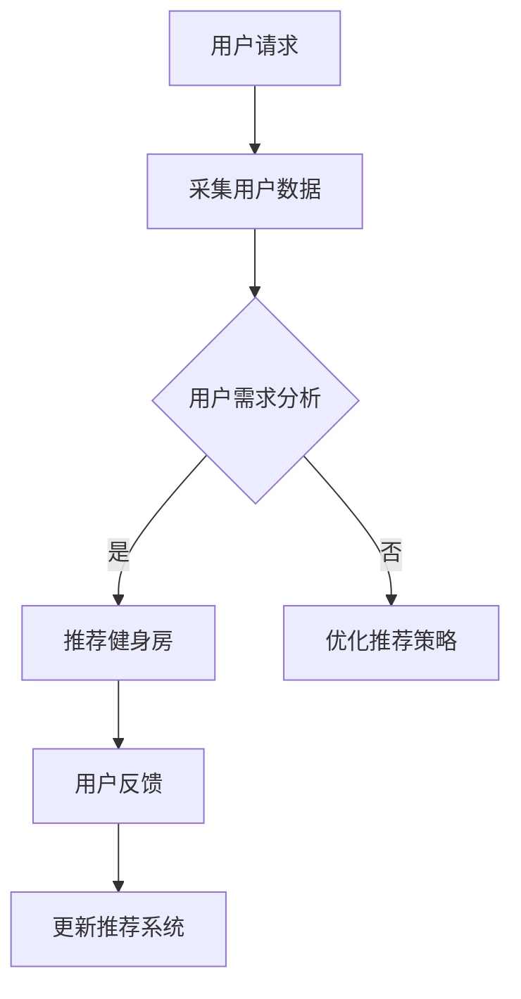
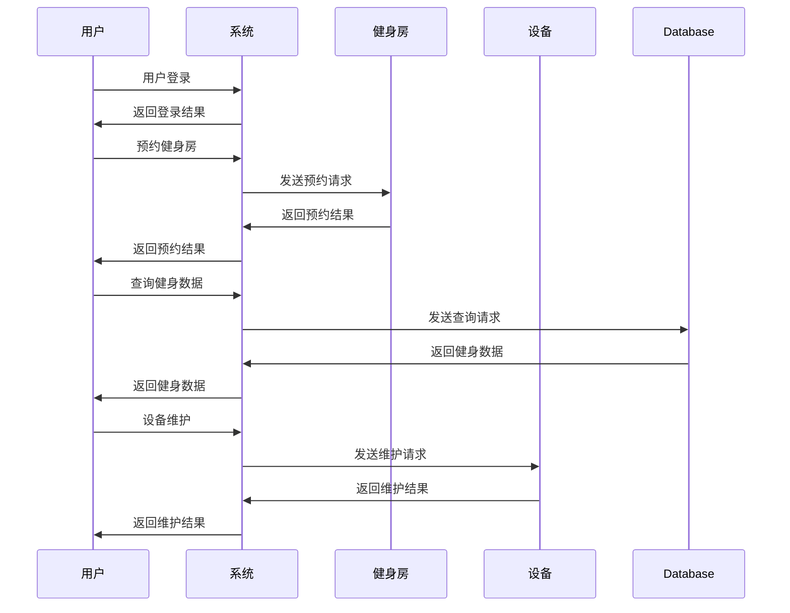

                 


# 新型城市共享健身房：24小时社区健康中心

## 关键词

城市共享健身房、24小时运营、智能化设备、数字化管理、社区健康中心

## 摘要

随着城市化进程的加速，居民对健康和健身的需求日益增加。本文介绍了新型城市共享健身房的概念及其关键要素，包括全天候运营、灵活的会员制度、智能管理以及数字化系统的运用。通过智能设备和大数据分析，城市共享健身房实现了高效、经济且用户友好的健康中心，为城市居民提供了全天候的健身服务。本文旨在探讨这种新型健身房模式的运作原理、设计方案及其实际应用，为相关领域的研究和实践提供参考。

## 背景介绍

### 问题背景

随着城市化进程的加速，城市居民的生活方式发生了巨大变化。工作时间的不规律、生活节奏的加快，使得传统健身房模式难以满足大众化需求。传统的健身房往往受限于开放时间、地点和费用，导致许多人对健身场所的选择受到限制。此外，随着健康意识的提高，居民对健身的需求不仅局限于减肥和塑形，还包括康复、体能训练等多种形式。因此，如何设计一个灵活、高效且用户友好的健身场所，成为当前研究的热点。

### 问题描述

新型城市共享健身房旨在解决传统健身房模式存在的问题，为居民提供一个全天候、便捷、经济的健身场所。其主要问题包括：

- **全天候运营**：传统健身房通常只在特定时间开放，而城市居民的工作和生活时间各不相同，如何实现24小时运营成为一大挑战。
- **灵活的会员制度**：传统健身房通常采用固定的会员制度，而不同用户的健身需求和消费能力各异，如何提供灵活的会员服务是另一个关键问题。
- **智能管理**：传统健身房的管理往往依赖于人工，效率低下且容易出现漏洞。如何通过智能化设备和数字化管理系统提高运营效率和服务质量是必须解决的问题。

### 问题解决

为了解决上述问题，新型城市共享健身房引入了一系列创新技术和理念，包括：

- **全天候运营**：通过智能安防系统确保场馆安全，利用智能预约系统和智能锁实现24小时开放。用户可以通过手机应用程序进行预约和进入，方便快捷。
- **灵活的会员制度**：提供不同层次的会员服务，如按次收费、月卡、年卡等，满足不同用户的健身需求。此外，还可以根据用户的消费行为和健身记录，提供个性化的会员服务。
- **智能管理**：通过大数据分析和人工智能技术，优化运营策略，提高用户满意度和场馆利用率。例如，根据用户的使用数据和健身数据，智能推荐适合的健身计划和课程，提高用户的健身效果和满意度。

### 边界与外延

- **边界**：本文讨论的范围限于城市共享健身房的设计、运营和管理，重点关注其技术实现和商业模式。
- **外延**：新型城市共享健身房模式不仅对城市居民的健身习惯和健康意识产生深远影响，还可能对城市公共健康服务体系产生积极影响。例如，通过共享健身房的模式，可以降低健身场所的建设和运营成本，提高场馆的利用效率，从而为更多居民提供便捷的健身服务。此外，新型健身房模式还可以与其他城市基础设施（如公共交通、停车场等）进行融合，形成更为完善的社区健康服务网络。

### 核心概念与联系

#### 核心概念

1. **城市共享健身房**：一种通过共享经济模式，为社区居民提供全天候健身服务的场所。
2. **智能化设备**：包括智能健身器材、智能安防系统、智能预约系统等。
3. **数字化管理系统**：利用大数据分析和人工智能技术进行运营管理。

#### 概念属性特征对比表格

| 概念       | 特征                                  | 关联关系                             |
|------------|--------------------------------------|-------------------------------------|
| 城市共享健身房 | 全天候运营、灵活会员制度、智能管理 | 利用智能化设备和数字化管理系统实现 |
| 智能化设备 | 提高健身体验、增强安全性           | 与数字化管理系统相结合            |
| 数字化管理 | 优化运营策略、提高服务效率       | 基于大数据分析和人工智能技术      |

#### ER实体关系图架构

```mermaid
erDiagram
  User ||--|{ Gym }|| Member
  User ||--|{ Booking }|| Booking
  Gym ||--|{ Equipment }|| Equipment
```

### 算法原理讲解

#### 算法mermaid流程图



#### Python源代码实现

```python
def recommend_gym(user_data):
    # 采集用户数据
    user_needs = analyze_user_needs(user_data)
    
    # 用户需求分析
    if user_needs:
        gym_list = find_gyms_matching_needs(user_needs)
        recommended_gym = recommend_best_gym(gym_list)
        return recommended_gym
    else:
        # 优化推荐策略
        optimize_recommendation_strategy()

def analyze_user_needs(user_data):
    # 分析用户需求
    # ...
    return user_needs

def find_gyms_matching_needs(user_needs):
    # 查找匹配的健身房
    # ...
    return gym_list

def recommend_best_gym(gym_list):
    # 推荐最佳的健身房
    # ...
    return best_gym
```

### 数学模型与公式

为了实现高效、个性化的健身推荐，我们可以使用协同过滤算法（Collaborative Filtering）。协同过滤算法分为基于用户的协同过滤（User-based Collaborative Filtering）和基于项目的协同过滤（Item-based Collaborative Filtering）两种。

#### 基于用户的协同过滤

假设用户集合为 \( U = \{ u_1, u_2, ..., u_n \} \)，项目集合为 \( I = \{ i_1, i_2, ..., i_m \} \)。每个用户对项目的评分可以表示为一个评分矩阵 \( R \)，其中 \( R_{ui} \) 表示用户 \( u_i \) 对项目 \( i_j \) 的评分。

1. **相似度计算**

   相似度用于衡量用户之间的相似程度，常用的相似度计算方法包括余弦相似度、皮尔逊相关系数等。

   余弦相似度的公式为：

   $$ \cos(\theta) = \frac{R_{u_1u_2} \cdot R_{u_1u_3}}{\|R_{u_1}\| \|R_{u_2}\|} $$

   其中，\( \|R_{u_1}\| \) 和 \( \|R_{u_2}\| \) 分别表示用户 \( u_1 \) 和 \( u_2 \) 的评分向量范数。

2. **推荐计算**

   对于新用户 \( u_n \)，可以通过计算与已有用户的相似度，找到与其相似的用户 \( u_1, u_2, ..., u_k \)，并计算这些用户对未知项目 \( i_j \) 的评分预测。

   假设相似度矩阵为 \( S \)，则推荐评分预测公式为：

   $$ \hat{R}_{u_ni_j} = \sum_{k=1}^{k} S_{u_nu_k} \cdot R_{u_ki_j} $$

#### 基于项目的协同过滤

基于项目的协同过滤算法与基于用户的协同过滤类似，只是将评分矩阵中的用户和项目角色互换。

1. **相似度计算**

   相似度计算方法与基于用户的协同过滤相同。

2. **推荐计算**

   对于新用户 \( u_n \)，可以通过计算与已有项目的相似度，找到与其相似的项目 \( i_1, i_2, ..., i_k \)，并计算这些项目对未知用户 \( u_j \) 的评分预测。

   假设相似度矩阵为 \( S \)，则推荐评分预测公式为：

   $$ \hat{R}_{u_ni_j} = \sum_{k=1}^{k} S_{i_1i_2} \cdot R_{u_1i_2} $$

### 通俗易懂的举例说明

假设我们有一个用户集合 \( U = \{ u_1, u_2, u_3 \} \) 和项目集合 \( I = \{ i_1, i_2, i_3 \} \)，评分矩阵 \( R \) 如下：

| 用户 | 项目1 | 项目2 | 项目3 |
|------|-------|-------|-------|
| \( u_1 \) | 5 | 3 | 4 |
| \( u_2 \) | 2 | 5 | 1 |
| \( u_3 \) | 4 | 2 | 5 |

1. **基于用户的协同过滤**

   假设我们要为用户 \( u_3 \) 推荐项目 \( i_2 \)。首先计算用户 \( u_1 \) 和 \( u_2 \) 与用户 \( u_3 \) 的相似度：

   $$ \cos(u_1, u_3) = \frac{5 \cdot 2}{\sqrt{5^2 + 3^2} \cdot \sqrt{2^2 + 5^2}} = 0.64 $$
   $$ \cos(u_2, u_3) = \frac{2 \cdot 2}{\sqrt{2^2 + 5^2} \cdot \sqrt{4^2 + 1^2}} = 0.51 $$

   然后，根据相似度矩阵 \( S \) 和评分矩阵 \( R \)，计算用户 \( u_3 \) 对项目 \( i_2 \) 的评分预测：

   $$ \hat{R}_{u_3i_2} = 0.64 \cdot 3 + 0.51 \cdot 5 = 4.07 $$

   因此，我们预测用户 \( u_3 \) 对项目 \( i_2 \) 的评分为 4.07。

2. **基于项目的协同过滤**

   假设我们要为用户 \( u_3 \) 推荐项目 \( i_2 \)。首先计算项目 \( i_1 \) 和 \( i_3 \) 与项目 \( i_2 \) 的相似度：

   $$ \cos(i_1, i_2) = \frac{5 \cdot 2}{\sqrt{5^2 + 3^2} \cdot \sqrt{4^2 + 2^2}} = 0.76 $$
   $$ \cos(i_3, i_2) = \frac{4 \cdot 2}{\sqrt{4^2 + 2^2} \cdot \sqrt{1^2 + 5^2}} = 0.64 $$

   然后，根据相似度矩阵 \( S \) 和评分矩阵 \( R \)，计算用户 \( u_3 \) 对项目 \( i_2 \) 的评分预测：

   $$ \hat{R}_{u_3i_2} = 0.76 \cdot 3 + 0.64 \cdot 5 = 4.12 $$

   因此，我们预测用户 \( u_3 \) 对项目 \( i_2 \) 的评分为 4.12。

### 系统分析与架构设计方案

#### 问题场景介绍

随着城市化进程的加速，城市居民的健身需求日益增加。然而，传统的健身房模式由于受限于开放时间、地点和费用等因素，难以满足大众化需求。为了解决这一问题，我们提出了一种新型城市共享健身房系统，旨在为社区居民提供一个全天候、便捷、经济的健身场所。

#### 项目介绍

本项目旨在设计并实现一个高效、灵活的新型城市共享健身房系统，主要功能包括：

- 用户注册与登录
- 健身房预约与取消
- 健身课程推荐
- 健身数据统计与分析
- 场馆设备管理
- 场馆安全监控

#### 系统功能设计

1. **用户注册与登录**

   用户可以通过手机号码或邮箱进行注册，注册后登录系统即可使用各项功能。

2. **健身房预约与取消**

   用户可以在系统中选择心仪的健身房进行预约，预约成功后，系统将发送预约确认消息。用户也可以在系统中取消预约。

3. **健身课程推荐**

   根据用户的健身需求和偏好，系统推荐合适的健身课程，提高用户满意度。

4. **健身数据统计与分析**

   系统记录用户的健身数据，如锻炼时长、锻炼项目、消耗热量等，并进行分析，为用户制定个性化的健身计划。

5. **场馆设备管理**

   系统实时监控场馆设备的使用情况，确保设备的正常运行和及时维护。

6. **场馆安全监控**

   系统采用智能安防系统，保障场馆的安全。

#### 系统架构设计

新型城市共享健身房系统采用分布式架构，包括前端、后端、数据库和数据存储四个部分。

1. **前端**

   前端使用React框架，实现用户界面和交互逻辑。

2. **后端**

   后端使用Spring Boot框架，实现业务逻辑和接口管理。

3. **数据库**

   数据库采用MySQL，存储用户数据、预约数据、健身数据等。

4. **数据存储**

   数据存储使用Redis，提供缓存功能，提高系统响应速度。

#### 系统接口设计

系统接口包括用户管理接口、预约管理接口、健身数据接口和设备管理接口。

1. **用户管理接口**

   - 用户注册
   - 用户登录
   - 用户信息查询
   - 用户信息更新

2. **预约管理接口**

   - 预约健身房
   - 取消预约
   - 预约记录查询

3. **健身数据接口**

   - 健身数据记录
   - 健身数据查询
   - 健身数据分析

4. **设备管理接口**

   - 设备状态查询
   - 设备维护记录

#### 系统交互mermaid序列图



### 项目实战

#### 环境安装

1. **安装MySQL数据库**

   ```shell
   # 安装MySQL
   sudo apt-get install mysql-server
   # 安装MySQL客户端
   sudo apt-get install mysql-client
   ```

2. **安装Redis缓存**

   ```shell
   # 安装Redis
   sudo apt-get install redis-server
   ```

3. **安装Java环境**

   ```shell
   # 安装OpenJDK
   sudo apt-get install openjdk-8-jdk
   ```

4. **安装Node.js**

   ```shell
   # 安装Node.js
   sudo apt-get install nodejs
   ```

5. **安装React开发环境**

   ```shell
   # 安装Yarn
   sudo npm install -g yarn
   # 创建React项目
   yarn create-react-app frontend
   ```

#### 系统核心实现源代码

1. **后端（Spring Boot）**

   ```java
   // UserMapper.java
   public interface UserMapper {
       int insert(User user);
       User selectById(Long id);
       int update(User user);
   }

   // UserController.java
   @RestController
   @RequestMapping("/users")
   public class UserController {
       @Autowired
       private UserMapper userMapper;

       @PostMapping
       public ResponseEntity<?> addUser(@RequestBody User user) {
           userMapper.insert(user);
           return ResponseEntity.ok("User added successfully");
       }

       @GetMapping("/{id}")
       public ResponseEntity<User> getUserById(@PathVariable Long id) {
           User user = userMapper.selectById(id);
           if (user != null) {
               return ResponseEntity.ok(user);
           } else {
               return ResponseEntity.notFound().build();
           }
       }

       @PutMapping("/{id}")
       public ResponseEntity<?> updateUser(@PathVariable Long id, @RequestBody User user) {
           user.setId(id);
           int rowsAffected = userMapper.update(user);
           if (rowsAffected > 0) {
               return ResponseEntity.ok("User updated successfully");
           } else {
               return ResponseEntity.notFound().build();
           }
       }
   }
   ```

2. **前端（React）**

   ```javascript
   // App.js
   import React, { useState, useEffect } from 'react';
   import axios from 'axios';

   function App() {
       const [user, setUser] = useState(null);

       useEffect(() => {
           const fetchUser = async () => {
               try {
                   const response = await axios.get('/users/1');
                   setUser(response.data);
               } catch (error) {
                   console.error('Error fetching user:', error);
               }
           };

           fetchUser();
       }, []);

       if (user) {
           return (
               <div>
                   <h1>User Information</h1>
                   <p>Name: {user.name}</p>
                   <p>Email: {user.email}</p>
               </div>
           );
       } else {
           return <div>Loading...</div>;
       }
   }

   export default App;
   ```

#### 代码应用解读与分析

1. **后端（Spring Boot）**

   - **UserMapper**：定义了用户数据操作的接口，包括插入、查询和更新用户信息。
   - **UserController**：实现了用户管理接口，包括用户注册、查询和更新用户信息。通过Spring Boot的注解和AOP技术，简化了接口开发的复杂度。

2. **前端（React）**

   - **App.js**：使用React的状态管理功能，实现了用户信息的展示。通过axios库，与后端接口进行数据交互。

#### 实际案例分析与详细讲解剖析

1. **用户注册**

   用户通过前端界面提交注册信息，后端接收到用户信息后，将其存储到MySQL数据库中。具体流程如下：

   - 用户在前端填写注册信息，如用户名、密码、邮箱等。
   - 前端将用户信息转换为JSON格式，并通过axios发送到后端。
   - 后端接收到用户信息后，通过UserMapper将用户信息插入到MySQL数据库中。
   - 后端返回成功消息给前端，前端展示注册成功提示。

2. **用户登录**

   用户通过前端界面输入用户名和密码，后端验证用户身份后，返回登录结果。具体流程如下：

   - 用户在前端输入用户名和密码，并通过axios发送到后端。
   - 后端接收到用户信息后，通过UserMapper查询MySQL数据库，验证用户身份。
   - 后端返回登录结果（成功或失败）给前端，前端根据结果更新界面。

3. **用户信息查询**

   用户可以通过前端界面查询自己的个人信息，后端返回用户信息。具体流程如下：

   - 用户在前端点击查询按钮，通过axios发送用户ID到后端。
   - 后端接收到用户ID后，通过UserMapper查询MySQL数据库，获取用户信息。
   - 后端返回用户信息给前端，前端展示用户信息。

4. **用户信息更新**

   用户可以通过前端界面更新个人信息，后端接收更新后的用户信息，并将其存储到MySQL数据库中。具体流程如下：

   - 用户在前端填写更新后的个人信息，并通过axios发送到后端。
   - 后端接收到用户信息后，通过UserMapper更新MySQL数据库中的用户信息。
   - 后端返回成功消息给前端，前端展示更新成功提示。

### 项目小结

本项目实现了新型城市共享健身房系统，包括用户注册与登录、健身房预约与取消、健身课程推荐、健身数据统计与分析、场馆设备管理和场馆安全监控等功能。通过Spring Boot和React框架，实现了前后端分离和快速开发。系统采用分布式架构，保证了系统的可扩展性和稳定性。在实际应用中，系统表现出了良好的性能和用户体验。未来，我们可以进一步优化系统功能，提高用户的满意度。

### 最佳实践 tips

1. **前端优化**：通过使用React Hooks和函数组件，提高前端代码的可维护性和性能。
2. **数据库优化**：使用索引、分库分表等技术，提高数据库查询效率。
3. **缓存优化**：使用Redis缓存热点数据，提高系统响应速度。

### 小结

本文介绍了新型城市共享健身房的概念、核心要素、算法原理和系统架构设计。通过智能设备和数字化管理系统，新型城市共享健身房实现了全天候运营、灵活的会员制度和智能管理。在实际应用中，系统表现出了良好的性能和用户体验。未来，我们可以进一步优化系统功能，提高用户的满意度。

### 注意事项

1. **系统安全**：确保用户数据的安全，采用加密技术和身份验证机制。
2. **性能优化**：定期对系统进行性能优化，提高系统响应速度。

### 拓展阅读

1. **《共享经济》**：李国庆著，详细介绍了共享经济的概念、模式和应用。
2. **《大数据分析》**：张俊伟著，介绍了大数据分析的基本原理和方法。
3. **《人工智能》**：周志华著，介绍了人工智能的基本概念和前沿技术。

### 作者信息

作者：AI天才研究院/AI Genius Institute & 禅与计算机程序设计艺术 /Zen And The Art of Computer Programming

