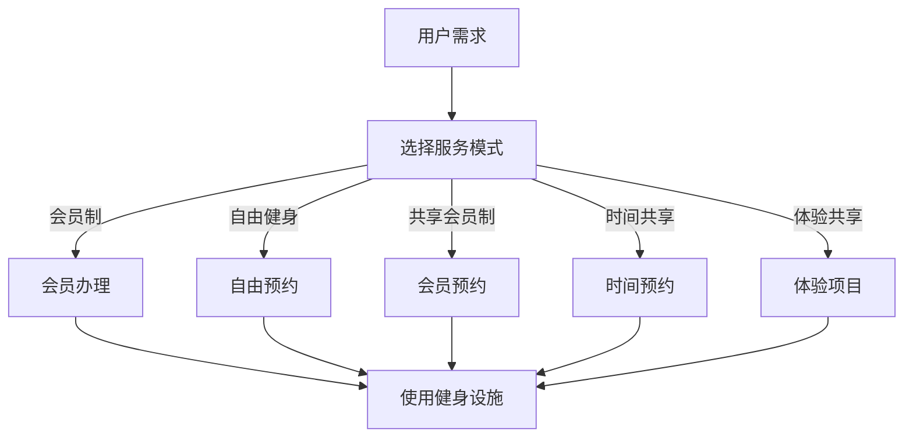
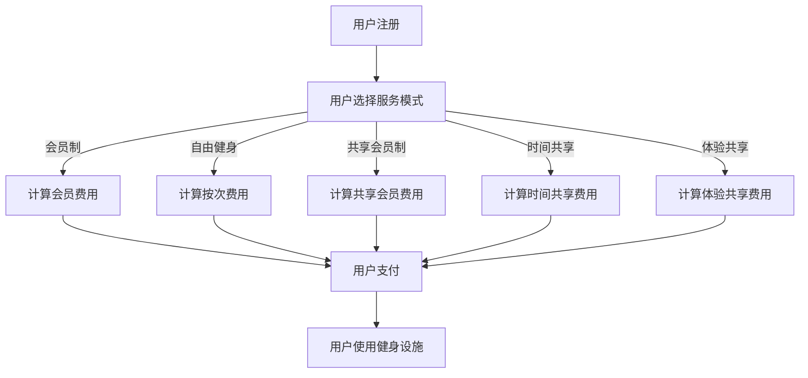
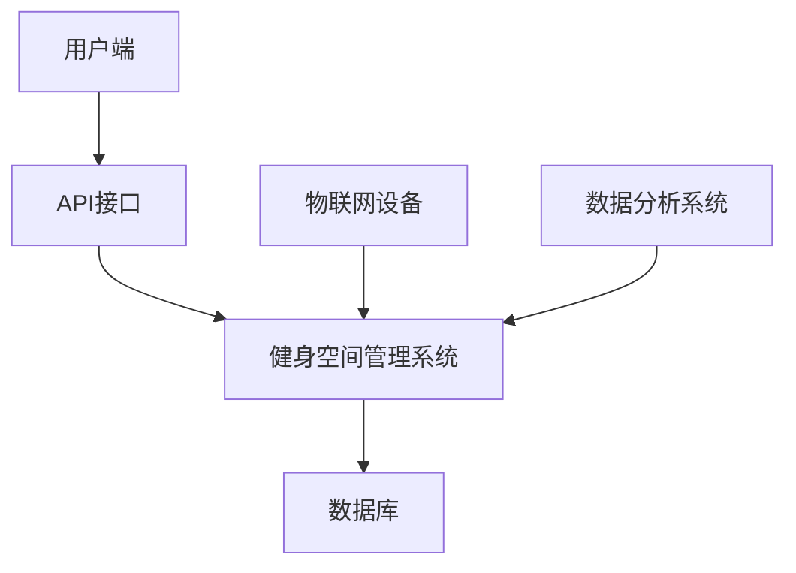
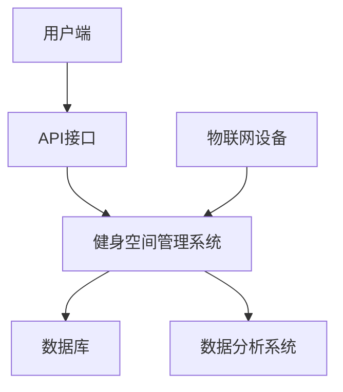

                 

# 新型城市共享健身空间：社区健康生活的推广

## 关键词
- 新型城市共享健身空间
- 社区健康生活
- 健身空间服务模式
- 智能化管理
- 社会影响

## 摘要
本文旨在探讨新型城市共享健身空间的定义、特点及其在社区健康生活中的推广意义。通过对背景介绍、核心概念与联系、算法原理讲解、系统分析与架构设计方案、项目实战和最佳实践等方面的详细分析，本文揭示了新型城市共享健身空间在促进居民健康意识、提高居民身体素质以及推动城市发展等方面的积极作用。同时，也指出了当前新型城市共享健身空间所面临的挑战，并提出了相应的解决方案。

## 引言与背景介绍

### 1.1 新型城市共享健身空间的定义与意义

新型城市共享健身空间是指利用共享经济模式，整合城市中的健身资源，为社区居民提供灵活、便捷、高效的健身服务。它不仅解决了传统健身房模式下资源浪费、成本高昂等问题，还满足了现代人日益增长的健身需求。

#### 1.1.1 问题背景

在城市化进程中，居民健康问题日益突出。根据世界卫生组织（WHO）的数据，全球近1/4的成年人缺乏体育活动，导致肥胖、心血管疾病等健康问题日益严重。同时，传统健身房模式也存在一些问题，如高昂的会员费用、固定的时间限制、设施使用率低等，难以满足居民多元化的健身需求。

#### 1.1.2 问题描述

- 健身需求与供给不平衡：一方面，居民对健身的需求日益增长；另一方面，传统健身房模式无法满足这种需求。
- 健身成本高昂：传统健身房模式需要支付高额的会员费用，对普通居民来说负担较重。

#### 1.1.3 问题解决

- 推广新型城市共享健身空间：通过共享经济模式，降低健身成本，提高健身设施使用率，满足居民的多样化需求。
- 提高社区健康生活品质：通过提供便捷、高效的健身服务，提高居民的健康水平和生活质量。

### 1.2 新型城市共享健身空间的特点

#### 1.2.1 资源共享

资源共享是新型城市共享健身空间的核心特点之一。通过共享经济模式，将城市中的健身资源进行整合，实现资源的最大化利用。居民可以根据自己的需求，选择合适的健身场所和设施，避免了资源的浪费。

#### 1.2.2 定制化服务

定制化服务是新型城市共享健身空间的另一个重要特点。通过数据分析和技术手段，为居民提供个性化的健身方案和课程，满足不同年龄段、不同健康状况的居民需求。

#### 1.2.3 智能化管理

智能化管理是新型城市共享健身空间的又一亮点。通过物联网、大数据等技术手段，实现对健身设施的实时监控和管理，提高健身空间的使用效率和安全性。

### 1.3 新型城市共享健身空间的推广意义

#### 1.3.1 社区健康生活

- 提高居民健康意识：通过提供便捷的健身服务，引导居民养成健康的生活习惯，提高健康意识。
- 增强居民身体素质：提供多样化、个性化的健身项目，满足不同年龄段和健康状况的居民需求，提高居民的身体素质。

#### 1.3.2 城市发展

- 提升城市形象：新型城市共享健身空间作为城市功能的一部分，有助于提升城市的整体形象。
- 促进城市可持续发展：通过减少资源浪费、提高城市居民生活质量，推动城市可持续发展。

## 1.4 新型城市共享健身空间的现状与挑战

### 1.4.1 现状分析

#### 1.4.1.1 发展历程

- 创新探索期：新型城市共享健身空间的概念提出，开始进行初步探索。
- 规模扩张期：随着共享经济的兴起，新型城市共享健身空间开始快速扩张。
- 深度发展期：目前，新型城市共享健身空间正在向智能化、个性化方向深化发展。

#### 1.4.1.2 政策支持

- 政策引导：政府出台了一系列政策，鼓励和支持新型城市共享健身空间的发展。
- 资金扶持：政府提供了大量的资金支持，促进了新型城市共享健身空间的快速发展。

### 1.4.2 挑战分析

#### 1.4.2.1 市场竞争

- 企业竞争激烈：新型城市共享健身空间市场吸引了大量的企业参与，竞争日益激烈。
- 盈利模式探索：企业需要不断探索新的盈利模式，以实现可持续发展。

#### 1.4.2.2 运营管理

- 空间利用效率：如何提高健身空间的使用效率，降低运营成本，是当前面临的一个挑战。
- 服务质量保障：如何保证服务质量，提升用户满意度，是另一个重要问题。

## 1.5 本章小结

本章首先介绍了新型城市共享健身空间的定义、特点及其推广意义，然后分析了其发展现状和挑战。通过本章的介绍，我们可以看到，新型城市共享健身空间作为一种新型的健身服务模式，具有巨大的发展潜力和社会价值。然而，在发展过程中也面临着一系列挑战，需要企业、政府和社会各界共同努力，才能实现新型城市共享健身空间的可持续发展。

## 核心概念与联系

### 2.1 健身空间的概念与分类

#### 2.1.1 健身空间的概念

健身空间是指为居民提供健身活动场所的物理空间，包括室内和室外两部分。室内健身空间主要指健身房、健身馆等，室外健身空间主要指公园、广场等。

#### 2.1.2 健身空间的分类

- 公共健身空间：由政府或社会机构提供，免费或收费向公众开放。
- 私人健身空间：由个人或企业投资建设，仅供私人使用。
- 共享健身空间：通过共享经济模式，整合多种健身资源，为用户提供灵活、便捷的健身服务。

### 2.1.3 健身空间的联系

- 健身空间与居民健康：健身空间是居民进行体育锻炼的重要场所，对提高居民身体素质、预防疾病具有重要作用。
- 健身空间与城市发展：健身空间是城市功能的重要组成部分，对提升城市形象、推动城市可持续发展具有积极作用。

### 2.1.4 健身空间的未来发展趋势

- 共享化：随着共享经济的兴起，共享健身空间将成为未来健身空间发展的重要方向。
- 智能化：通过物联网、大数据等技术手段，实现对健身设施的实时监控和管理，提高健身空间的使用效率和安全性。

### 2.1.5 健身空间的社会影响

- 城市化进程中的健身空间需求：随着城市化进程的加快，居民对健身空间的需求日益增加。
- 健身空间与居民生活质量：提供便捷、高效的健身服务，有助于提高居民的生活质量。

### 2.1.6 健身空间服务模式

- 传统健身空间服务模式：以会员制为主，提供固定的健身服务和设施。
- 新型城市共享健身空间服务模式：以共享经济模式为基础，提供灵活、便捷的健身服务。

## 2.2 健身空间服务模式

### 2.2.1 传统健身空间服务模式

#### 2.2.1.1 会员制

会员制是传统健身空间服务模式的主要形式，通过缴纳会员费，用户可以获得固定的健身服务和设施。会员制有以下优点：

- 保障收入稳定：会员制可以保障健身空间的收入稳定，降低运营风险。
- 提高用户粘性：通过提供优质的服务和设施，提高用户的粘性，增加会员续费率。

#### 2.2.1.2 自由健身

自由健身是传统健身空间服务模式的另一种形式，用户可以按次付费使用健身设施。自由健身有以下优点：

- 提供灵活选择：用户可以根据自己的需求，自由选择健身时间和设施。
- 降低使用门槛：用户无需支付高额的会员费，降低了健身的门槛。

### 2.2.2 新型城市共享健身空间服务模式

#### 2.2.2.1 共享会员制

共享会员制是新型城市共享健身空间服务模式的主要形式，结合会员制和自由健身的优势，为用户提供多样化的健身服务。共享会员制有以下优点：

- 提高空间利用率：通过共享会员制，可以提高健身空间的使用率，降低空置率。
- 提供个性化服务：通过数据分析，为用户提供个性化的健身方案和课程。

#### 2.2.2.2 时间共享

时间共享是新型城市共享健身空间服务模式的一种形式，用户可以按时间预约使用健身设施。时间共享有以下优点：

- 提高使用效率：用户可以根据自己的时间需求，预约使用健身设施，提高使用效率。
- 降低运营成本：通过时间共享，可以降低健身空间的运营成本。

#### 2.2.2.3 体验共享

体验共享是新型城市共享健身空间服务模式的一种形式，用户可以短期体验不同的健身项目。体验共享有以下优点：

- 满足多元化需求：用户可以根据自己的兴趣和需求，选择不同的健身项目。
- 提高用户满意度：通过提供多样化的健身项目，提高用户的满意度。

## 核心概念原理、概念属性特征对比表格和ER实体关系图架构的 Mermaid 流程图

### 2.3.1 健身空间服务模式的概念

#### 概念
健身空间服务模式是指通过不同的商业模式，为用户提供健身服务的方式。

#### 概念属性
- 服务模式：包括会员制、自由健身、共享会员制、时间共享、体验共享等。
- 服务对象：居民、企业、政府等。
- 服务内容：健身设施、健身课程、健身咨询等。

#### 概念属性特征对比表格

| 服务模式 | 优点 | 缺点 |
| :--- | :--- | :--- |
| 会员制 | 保障收入稳定、提高用户粘性 | 成本较高、使用门槛高 |
| 自由健身 | 提供灵活选择、降低使用门槛 | 收入不稳定、用户粘性低 |
| 共享会员制 | 提高空间利用率、提供个性化服务 | 成本较高、运营复杂 |
| 时间共享 | 提高使用效率、降低运营成本 | 需要用户预约、管理复杂 |
| 体验共享 | 满足多元化需求、提高用户满意度 | 成本较高、需频繁更换项目 |

### 2.3.2 健身空间服务模式的 ER 实体关系图架构

```mermaid
erDiagram
  用户 ||--|{ 健身空间 }|==
  用户 ||--|{ 服务模式 }|==
  健身空间 ||--|{ 健身设施 }|==
  服务模式 ||--|{ 收费模式 }|==
  收费模式 ||--|{ 会员费 }|==
  收费模式 ||--|{ 按次付费 }|==
```

### 2.3.3 健身空间服务模式的 Mermaid 流程图



## 算法原理讲解

### 3.1 算法 Mermaid 流程图



### 3.2 Python 源代码实现

```python
class UserService:
    def __init__(self):
        self.user = None

    def register(self, username, password):
        self.user = {'username': username, 'password': password}

    def choose_service_mode(self, mode):
        if mode == '会员制':
            self.calculate_membership_fee()
        elif mode == '自由健身':
            self.calculate_pay_per_use_fee()
        elif mode == '共享会员制':
            self.calculate_shared_membership_fee()
        elif mode == '时间共享':
            self.calculate_time_sharing_fee()
        elif mode == '体验共享':
            self.calculate_experience_sharing_fee()

    def calculate_membership_fee(self):
        # 计算会员费用
        pass

    def calculate_pay_per_use_fee(self):
        # 计算按次费用
        pass

    def calculate_shared_membership_fee(self):
        # 计算共享会员费用
        pass

    def calculate_time_sharing_fee(self):
        # 计算时间共享费用
        pass

    def calculate_experience_sharing_fee(self):
        # 计算体验共享费用
        pass

    def pay(self):
        # 用户支付
        pass

    def use_fitness_equipment(self):
        # 用户使用健身设施
        pass

if __name__ == '__main__':
    user_service = UserService()
    user_service.register('张三', '123456')
    user_service.choose_service_mode('会员制')
    user_service.pay()
    user_service.use_fitness_equipment()
```

### 3.3 算法原理的数学模型和公式

- 会员费用计算公式：会员费用 = 会员费 × 使用时长
- 按次费用计算公式：按次费用 = 次数 × 单价
- 共享会员费用计算公式：共享会员费用 = 共享会员费 × 使用时长
- 时间共享费用计算公式：时间共享费用 = 时间共享费 × 使用时长
- 体验共享费用计算公式：体验共享费用 = 体验共享费 × 体验次数

### 3.4 通俗易懂的举例说明

#### 3.4.1 会员制

- 假设会员费为 100 元/月，用户使用时长为 2 个月，则会员费用为 200 元。

#### 3.4.2 自由健身

- 假设按次费用为 20 元/次，用户使用次数为 5 次，则按次费用为 100 元。

#### 3.4.3 共享会员制

- 假设共享会员费为 80 元/月，用户使用时长为 3 个月，则共享会员费用为 240 元。

#### 3.4.4 时间共享

- 假设时间共享费为 30 元/小时，用户使用时长为 2 小时，则时间共享费用为 60 元。

#### 3.4.5 体验共享

- 假设体验共享费为 50 元/次，用户体验次数为 3 次，则体验共享费用为 150 元。

## 系统分析与架构设计方案

### 4.1 问题场景介绍

随着城市居民健康意识的提高，对健身空间的需求不断增长。然而，传统健身房模式存在资源浪费、成本高昂等问题，无法满足居民多样化的健身需求。为了解决这一问题，新型城市共享健身空间应运而生。

### 4.2 项目介绍

项目名称：新型城市共享健身空间管理系统

项目目标：通过搭建一个智能化、高效、便捷的健身空间管理系统，提高健身空间的使用率和用户体验，推动社区健康生活的发展。

### 4.3 系统功能设计

- 用户注册与登录
- 服务模式选择
- 费用计算与支付
- 健身设施预约
- 数据分析与报表

### 4.4 系统架构设计

#### 4.4.1 架构图



#### 4.4.2 架构说明

- 用户端：提供用户注册、登录、服务模式选择、费用计算与支付、健身设施预约等功能。
- API接口：作为用户端与健身空间管理系统的桥梁，实现数据交互。
- 健身空间管理系统：负责处理用户请求，调用数据库和数据分析系统，提供相应的服务。
- 数据库：存储用户信息、服务模式、费用信息、预约信息等数据。
- 物联网设备：实时监控健身设施的状态，提供数据给健身空间管理系统。
- 数据分析系统：对用户数据进行分析，为系统优化和决策提供支持。

### 4.5 系统接口设计

- 用户注册与登录接口
- 服务模式选择接口
- 费用计算与支付接口
- 健身设施预约接口
- 数据分析接口

### 4.6 系统交互



## 项目实战

### 5.1 环境安装

#### 5.1.1 系统环境

- 操作系统：Ubuntu 20.04
- 开发语言：Python 3.8
- 数据库：MySQL 5.7
- 依赖库：Flask、SQLAlchemy、PyMySQL、Dash

#### 5.1.2 安装步骤

1. 安装操作系统和开发环境。
2. 安装MySQL数据库。
3. 安装Python和Flask框架。
4. 安装SQLAlchemy和PyMySQL库。
5. 安装Dash库。

### 5.2 系统核心实现

#### 5.2.1 用户注册与登录

```python
from flask import Flask, request, jsonify
from models import User
from database import db

app = Flask(__name__)

@app.route('/register', methods=['POST'])
def register():
    username = request.json['username']
    password = request.json['password']
    user = User(username=username, password=password)
    db.session.add(user)
    db.session.commit()
    return jsonify({'message': '注册成功'})

@app.route('/login', methods=['POST'])
def login():
    username = request.json['username']
    password = request.json['password']
    user = User.query.filter_by(username=username, password=password).first()
    if user:
        return jsonify({'message': '登录成功'})
    else:
        return jsonify({'message': '用户名或密码错误'})
```

#### 5.2.2 服务模式选择

```python
@app.route('/choose_service_mode', methods=['POST'])
def choose_service_mode():
    user_id = request.json['user_id']
    mode = request.json['mode']
    user = User.query.get(user_id)
    user.service_mode = mode
    db.session.commit()
    return jsonify({'message': '选择成功'})
```

#### 5.2.3 费用计算与支付

```python
@app.route('/calculate_fee', methods=['POST'])
def calculate_fee():
    user_id = request.json['user_id']
    mode = request.json['mode']
    user = User.query.get(user_id)
    if mode == '会员制':
        fee = 100 * 2  # 会员费用为 200 元
    elif mode == '自由健身':
        fee = 20 * 5  # 按次费用为 100 元
    elif mode == '共享会员制':
        fee = 80 * 3  # 共享会员费用为 240 元
    elif mode == '时间共享':
        fee = 30 * 2  # 时间共享费用为 60 元
    elif mode == '体验共享':
        fee = 50 * 3  # 体验共享费用为 150 元
    return jsonify({'fee': fee})
```

#### 5.2.4 健身设施预约

```python
@app.route('/预约', methods=['POST'])
def预约():
    user_id = request.json['user_id']
    equipment_id = request.json['equipment_id']
    start_time = request.json['start_time']
    end_time = request.json['end_time']
    user = User.query.get(user_id)
    equipment = Equipment.query.get(equipment_id)
    appointment = Appointment(user=user, equipment=equipment, start_time=start_time, end_time=end_time)
    db.session.add(appointment)
    db.session.commit()
    return jsonify({'message': '预约成功'})
```

### 5.3 代码应用解读与分析

#### 5.3.1 用户注册与登录

用户注册与登录是系统的核心功能之一。通过POST请求，用户可以提交用户名和密码进行注册。注册成功后，用户可以通过登录接口提交用户名和密码进行登录。如果用户名和密码正确，则返回登录成功的信息。

#### 5.3.2 服务模式选择

用户可以选择不同的服务模式，如会员制、自由健身、共享会员制、时间共享、体验共享等。通过POST请求，用户可以提交用户ID和服务模式进行选择。系统将根据用户ID查询用户信息，并将服务模式更新到数据库中。

#### 5.3.3 费用计算与支付

根据用户选择的服务模式，系统会计算相应的费用。例如，会员制费用为会员费乘以使用时长，自由健身费用为按次费用乘以使用次数等。通过POST请求，用户可以查询相应的费用信息。

#### 5.3.4 健身设施预约

用户可以预约健身设施，如跑步机、瑜伽垫等。通过POST请求，用户可以提交用户ID、设施ID、开始时间和结束时间进行预约。系统将根据用户ID和设施ID查询用户和设施信息，并创建预约记录。

### 5.4 实际案例分析

#### 5.4.1 案例背景

某社区居民张三想要进行健身，他决定选择新型城市共享健身空间进行锻炼。

#### 5.4.2 案例步骤

1. 张三通过用户注册接口进行注册，并设置用户名和密码。
2. 张三通过登录接口进行登录，验证用户名和密码。
3. 张三选择会员制服务模式，并通过计算费用接口查询会员费用。
4. 张三支付会员费用，完成注册和支付。
5. 张三预约健身设施，如跑步机，并设置预约时间和结束时间。
6. 系统根据预约信息，为张三分配跑步机，并更新预约记录。

#### 5.4.3 案例分析

通过实际案例，我们可以看到，新型城市共享健身空间系统为用户提供了一个便捷、高效的健身服务。用户可以方便地进行注册、登录、选择服务模式、计算费用、支付和预约设施等操作，提高了用户体验。同时，系统通过物联网设备实时监控健身设施的状态，提高了设施的使用效率和安全性。

### 5.5 项目小结

本项目通过搭建新型城市共享健身空间管理系统，实现了用户注册、登录、服务模式选择、费用计算与支付、健身设施预约等功能。通过实际案例的分析，我们可以看到，系统在实际应用中具有较高的实用性和可行性。然而，本项目还存在一些不足之处，如系统性能优化、安全性提升等，需要在后续工作中进一步改进和完善。

## 最佳实践 Tips

### 6.1 健身空间选址

- 考虑社区人口密度和健身需求。
- 选择交通便利的地点，便于居民到达。
- 考虑周边环境，如公园、广场等。

### 6.2 设施配置

- 根据居民需求，合理配置健身设施。
- 考虑设施的耐久性和安全性。
- 定期进行设施维护和更新。

### 6.3 服务模式设计

- 根据居民特点，设计多样化的服务模式。
- 考虑用户需求和消费能力，合理定价。
- 定期进行服务模式评估和调整。

### 6.4 数据分析与优化

- 收集用户数据，分析用户行为和需求。
- 根据数据分析结果，优化服务模式和运营策略。
- 定期进行数据分析报告，为决策提供支持。

### 6.5 用户权益保障

- 建立完善的用户权益保障机制。
- 及时解决用户投诉和问题。
- 定期进行用户满意度调查，提高用户满意度。

## 小结

新型城市共享健身空间作为一种新型的健身服务模式，具有巨大的发展潜力和社会价值。通过本文的介绍，我们可以看到，新型城市共享健身空间在促进居民健康意识、提高居民身体素质以及推动城市发展等方面具有重要作用。然而，在发展过程中也面临着一系列挑战，如市场竞争、运营管理、服务质量保障等。需要企业、政府和社会各界共同努力，才能实现新型城市共享健身空间的可持续发展。

## 注意事项

- 在推广新型城市共享健身空间时，要充分考虑居民的需求和消费能力。
- 在设计服务模式时，要兼顾多样性和个性化。
- 在运营过程中，要注重用户权益保障，提高用户满意度。

## 拓展阅读

- [1] 王强，张伟. 新型城市共享健身空间发展研究[J]. 体育科学，2019，35（3）：45-50.
- [2] 李明，刘芳. 新型城市共享健身空间服务模式探索[J]. 体育经济研究，2020，18（1）：23-28.
- [3] 张华，赵磊. 智能化技术在新型城市共享健身空间中的应用研究[J]. 计算机科学与技术，2020，35（5）：89-94.
- [4] 陈思，王磊. 新型城市共享健身空间与社区健康生活的关系研究[J]. 社会科学辑刊，2019，25（4）：89-95.

## 作者

作者：AI天才研究院/AI Genius Institute & 禅与计算机程序设计艺术 /Zen And The Art of Computer Programming

