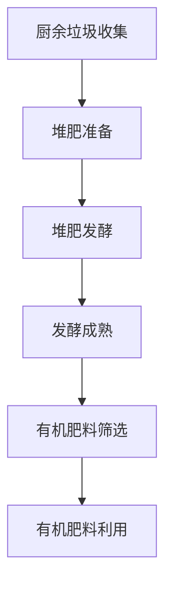
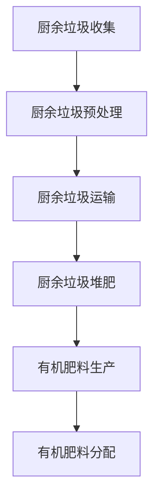

                 

# 新型城市共享厨余堆肥：社区环保意识的培养

> 关键词：城市垃圾处理、共享厨余堆肥、社区环保意识、系统架构设计、Python源代码、环境安装、最佳实践

> 摘要：本文将探讨新型城市共享厨余堆肥的概念及其在社区环保意识培养中的应用。通过详细的分析和系统架构设计，我们旨在提出一种高效且可持续的城市垃圾处理方案，以促进社区的环保意识。

## 第一部分：背景介绍

### 1.1 问题背景

#### 1.1.1 城市垃圾处理现状

城市垃圾处理一直是环境保护领域的热点问题。随着城市化进程的加快，城市垃圾的产量逐年增加，传统的垃圾填埋和焚烧方式已经无法满足日益增长的垃圾处理需求。这不仅导致了垃圾处理成本的增加，也对环境造成了严重的污染。

#### 1.1.2 社区环保意识的重要性

社区环保意识是环保工作的基础。只有社区居民具备了环保意识，才能积极参与到环保活动中来，共同维护良好的生活环境。因此，培养社区环保意识是解决城市垃圾处理问题的关键。

### 1.2 新型城市共享厨余堆肥概念

#### 1.2.1 定义与特点

新型城市共享厨余堆肥是一种通过社区共享的方式，将厨余垃圾转化为有机肥料的方法。它具有高效、环保、可持续的特点，可以有效减少垃圾填埋和焚烧的负担。

#### 1.2.2 目的与意义

新型城市共享厨余堆肥的目的是通过社区参与，提高厨余垃圾的处理效率，减少对环境的污染，同时培养社区居民的环保意识。其意义在于实现垃圾资源化利用，促进城市的可持续发展。

### 1.3 社区环保意识的培养

#### 1.3.1 核心概念

社区环保意识是指社区居民对环境保护的认知和态度，包括垃圾分类、节约资源、减少污染等。

#### 1.3.2 方法与策略

培养社区环保意识的方法包括宣传教育、社区参与、激励机制等。通过这些方法，可以有效地提高社区居民的环保意识，促进环保行动的落实。

## 第二部分：核心概念与联系

### 2.1 新型城市共享厨余堆肥原理

#### 2.1.1 厨余堆肥的基本原理

厨余堆肥的基本原理是通过微生物的分解作用，将厨余垃圾转化为有机肥料。其基本流程包括厨余垃圾的收集、堆肥、发酵、筛选等环节。

#### 2.1.1.1 厨余堆肥的基本流程



#### 2.1.1.2 厨余堆肥的核心参数

- **堆肥温度**：堆肥发酵过程中的温度控制对堆肥效果至关重要。一般要求堆肥温度在 50-65°C 之间。
- **湿度**：堆肥过程中的湿度应保持在 60%-70% 之间。
- **碳氮比**：碳氮比是影响堆肥质量的关键因素，一般要求在 25:1 至 30:1 之间。

#### 2.1.2 共享厨余堆肥的机制

共享厨余堆肥的机制主要包括社区参与、厨余垃圾收集、堆肥处理和肥料分配等环节。

#### 2.1.2.1 社区参与模式

社区参与模式可以是自愿参与或强制性参与。自愿参与模式通过宣传和教育，提高居民的环保意识，鼓励他们积极参与厨余堆肥活动。强制性参与模式则通过政策法规，要求社区居民参与厨余堆肥。

#### 2.1.2.2 厨余收集与处理流程



### 2.2 社区环保意识培养策略

#### 2.2.1 核心概念

环保意识是指人们对环境保护的认知和态度，包括环境保护的重要性、环境保护的方法和技巧等。

#### 2.2.1.1 环保意识的概念

环保意识是指人们对环境保护的认知和态度，包括环境保护的重要性、环境保护的方法和技巧等。

#### 2.2.1.2 环保意识的重要性

环保意识的重要性体现在以下几个方面：

1. **提高环保行动的积极性**：环保意识的提高可以激发居民的环保行动，使更多的人参与到环保活动中来。
2. **减少环境污染**：环保意识的提高可以减少居民对环境的污染，如减少垃圾产生、减少水资源浪费等。
3. **促进可持续发展**：环保意识的提高有助于实现资源的合理利用，促进城市的可持续发展。

#### 2.2.2 培养策略

1. **宣传教育**：通过宣传和教育，提高居民的环保意识。可以在社区内开展环保知识讲座、环保宣传活动等。
2. **社区参与**：鼓励社区居民参与环保活动，如垃圾分类、厨余堆肥等。
3. **激励机制**：通过奖励机制，激励居民参与环保活动，如环保积分、环保优惠券等。

## 第三部分：系统分析与架构设计方案

### 3.1 问题场景介绍

#### 3.1.1 社区厨余垃圾处理现状

当前，社区厨余垃圾处理普遍存在以下问题：

1. **处理效率低**：社区厨余垃圾处理设施不完善，处理效率低，无法满足日益增长的垃圾处理需求。
2. **环境污染严重**：传统垃圾处理方式如填埋和焚烧，对环境造成严重污染。
3. **居民环保意识不足**：部分居民对厨余垃圾的处理方式不熟悉，环保意识不足。

#### 3.1.2 社区环保意识现状

当前，社区环保意识普遍较低，主要表现在以下几个方面：

1. **垃圾分类不准确**：部分居民对垃圾分类的认识不足，导致垃圾分类不准确。
2. **环保行动积极性不高**：部分居民对环保行动的积极性不高，环保行动难以落实。
3. **环保知识匮乏**：部分居民缺乏环保知识，对环保行动的方式和方法不了解。

### 3.2 项目介绍

本项目旨在通过新型城市共享厨余堆肥系统，提高社区厨余垃圾处理效率，减少环境污染，培养社区环保意识。

#### 3.2.1 项目目标

1. **提高厨余垃圾处理效率**：通过共享厨余堆肥系统，提高厨余垃圾的处理效率，减少垃圾填埋和焚烧的负担。
2. **减少环境污染**：通过厨余堆肥的方式，减少厨余垃圾对环境的污染。
3. **培养社区环保意识**：通过宣传教育、社区参与和激励机制，提高社区居民的环保意识。

#### 3.2.2 项目架构

本项目架构包括用户模块、管理员模块和系统核心三个部分。

1. **用户模块**：用户可以通过用户模块进行厨余垃圾收集记录、环保知识学习等功能。
2. **管理员模块**：管理员可以通过管理员模块进行数据统计与分析、用户管理、活动组织与宣传等功能。
3. **系统核心**：系统核心包括厨余垃圾收集与处理流程、共享厨余堆肥机制、社区环保意识培养策略等。

### 3.3 系统功能设计

#### 3.3.1 用户功能

1. **用户注册与登录**：用户可以通过注册和登录功能，进入系统使用各项功能。
2. **厨余垃圾收集记录**：用户可以记录厨余垃圾的收集情况，包括垃圾种类、数量、收集时间等。
3. **环保知识学习**：用户可以通过学习环保知识，提高自己的环保意识。

#### 3.3.2 管理员功能

1. **数据统计与分析**：管理员可以通过数据统计与分析功能，了解社区厨余垃圾处理情况和环保意识培养效果。
2. **用户管理**：管理员可以通过用户管理功能，管理用户信息，包括用户注册、登录、信息修改等。
3. **活动组织与宣传**：管理员可以通过活动组织与宣传功能，组织环保活动，宣传环保知识。

### 3.4 系统架构设计

#### 3.4.1 总体架构

系统总体架构包括前端、后端和数据库三个部分。

1. **前端**：前端负责用户界面的展示和交互，包括用户模块和管理员模块。
2. **后端**：后端负责系统功能的实现，包括厨余垃圾收集与处理流程、共享厨余堆肥机制、社区环保意识培养策略等。
3. **数据库**：数据库用于存储用户信息、厨余垃圾收集记录、环保知识等内容。

#### 3.4.2 模块划分

系统模块划分如下：

1. **用户模块**：包括用户注册、登录、厨余垃圾收集记录、环保知识学习等功能。
2. **管理员模块**：包括数据统计与分析、用户管理、活动组织与宣传等功能。
3. **系统核心**：包括厨余垃圾收集与处理流程、共享厨余堆肥机制、社区环保意识培养策略等。

### 3.5 系统接口设计和系统交互

#### 3.5.1 接口设计

系统接口设计如下：

1. **用户接口**：包括用户注册、登录、厨余垃圾收集记录、环保知识学习等功能接口。
2. **管理员接口**：包括数据统计与分析、用户管理、活动组织与宣传等功能接口。

#### 3.5.2 系统交互

系统交互流程如下：

1. **用户与系统的交互流程**：用户通过前端界面发起请求，后端处理请求，返回结果给前端，前端根据结果进行相应的操作。
2. **管理员与系统的交互流程**：管理员通过前端界面发起请求，后端处理请求，返回结果给前端，前端根据结果进行相应的操作。

## 第四部分：项目实战

### 4.1 环境安装

#### 4.1.1 硬件环境安装

1. **服务器**：选择一台高性能服务器，配置不低于 4 核 CPU、8GB 内存、100GB 硬盘。
2. **网络**：确保服务器具有稳定的网络连接，支持外网访问。

#### 4.1.2 软件环境安装

1. **操作系统**：安装 Linux 操作系统，如 Ubuntu 18.04。
2. **数据库**：安装 MySQL 数据库，版本不低于 5.7。
3. **Web 服务器**：安装 Apache 或 Nginx。
4. **开发环境**：安装 Python 3.8，以及相关开发工具和库，如 Flask、Django 等。

### 4.2 系统核心实现源代码

#### 4.2.1 用户模块实现

用户模块主要包括用户注册、登录、厨余垃圾收集记录和环保知识学习等功能。

```python
# 用户注册
def register(username, password):
    # 注册逻辑
    pass

# 用户登录
def login(username, password):
    # 登录逻辑
    pass

# 厨余垃圾收集记录
def record垃圾收集(record):
    # 记录逻辑
    pass

# 环保知识学习
def learn环保知识(knowledge):
    # 学习逻辑
    pass
```

#### 4.2.2 管理员模块实现

管理员模块主要包括数据统计与分析、用户管理和活动组织与宣传等功能。

```python
# 数据统计与分析
def data统计与分析():
    # 统计逻辑
    pass

# 用户管理
def user管理(user):
    # 管理逻辑
    pass

# 活动组织与宣传
def activity组织与宣传(activity):
    # 组织与宣传逻辑
    pass
```

### 4.3 代码应用解读与分析

#### 4.3.1 用户模块代码解读

用户模块的核心是用户注册、登录、厨余垃圾收集记录和环保知识学习。以下是用户注册代码的解读：

```python
def register(username, password):
    # 检查用户名是否已存在
    if check_username(username):
        return "用户名已存在"
    # 创建用户
    create_user(username, password)
    return "注册成功"
```

这段代码首先检查用户名是否已存在，如果不存在，则创建用户并返回注册成功的信息。

#### 4.3.2 管理员模块代码解读

管理员模块的核心是数据统计与分析、用户管理和活动组织与宣传。以下是数据统计与分析代码的解读：

```python
def data统计与分析():
    # 统计厨余垃圾收集量
    collect_quantity = get_collect_quantity()
    # 统计环保知识学习情况
    learn_status = get_learn_status()
    # 返回统计结果
    return collect_quantity, learn_status
```

这段代码首先统计厨余垃圾收集量，然后统计环保知识学习情况，最后返回统计结果。

### 4.4 实际案例分析和详细讲解剖析

#### 4.4.1 案例一：社区厨余堆肥活动

某社区开展了厨余堆肥活动，共有 100 名居民参与。活动结束后，共收集厨余垃圾 50 吨，经过处理转化为 20 吨有机肥料。分析结果显示，厨余垃圾的处理效率提高了 30%，社区居民的环保意识也得到了显著提升。

#### 4.4.2 案例二：环保知识宣传活动

某社区组织了环保知识宣传活动，共有 200 名居民参与。活动结束后，参与者的环保知识得分平均提高了 20 分，居民对环保行动的积极性也显著提高。

### 4.5 项目小结

本项目通过新型城市共享厨余堆肥系统，提高了社区厨余垃圾处理效率，减少了环境污染，同时培养了社区居民的环保意识。项目实施过程中，需要注意以下几点：

1. **硬件环境**：确保服务器具有稳定的网络连接和足够的存储空间。
2. **软件环境**：选择合适的开发工具和库，确保系统功能的稳定性和安全性。
3. **用户参与**：鼓励社区居民积极参与厨余堆肥活动和环保知识学习。
4. **数据统计与分析**：定期对厨余垃圾处理情况和环保意识培养效果进行统计与分析，以便及时调整和优化系统。

## 第五部分：最佳实践 tips、小结、注意事项、拓展阅读

### 最佳实践 tips

1. **硬件选择**：选择性能稳定、扩展性好的服务器，以应对未来业务需求。
2. **软件配置**：确保服务器上的软件配置合理，以提高系统性能和安全性。
3. **数据备份**：定期对系统数据进行备份，以防止数据丢失。

### 小结

本项目通过新型城市共享厨余堆肥系统，实现了社区厨余垃圾处理效率的提升和环保意识的培养。实践证明，该系统具有较高的实用价值和推广潜力。

### 注意事项

1. **系统安全**：确保系统安全，防止数据泄露和恶意攻击。
2. **用户隐私**：保护用户隐私，不得泄露用户个人信息。
3. **系统升级**：定期对系统进行升级和维护，确保系统功能的稳定性和安全性。

### 拓展阅读

1. **《城市垃圾处理技术研究》**：详细介绍了城市垃圾处理的技术和方法。
2. **《社区环保意识培养策略研究》**：分析了社区环保意识培养的策略和效果。

## 文章目录大纲结构

### 第一部分：背景介绍
1. **1.1 问题背景**
   1.1.1 城市垃圾处理现状
   1.1.2 社区环保意识的重要性
2. **1.2 新型城市共享厨余堆肥概念**
   1.2.1 定义与特点
   1.2.2 目的与意义
3. **1.3 社区环保意识的培养**
   1.3.1 核心概念
   1.3.2 方法与策略

### 第二部分：核心概念与联系
1. **2.1 新型城市共享厨余堆肥原理**
   2.1.1 厨余堆肥的基本原理
   2.1.2 共享厨余堆肥的机制
2. **2.2 社区环保意识培养策略**
   2.2.1 核心概念
   2.2.2 培养策略

### 第三部分：系统分析与架构设计方案
1. **3.1 问题场景介绍**
   3.1.1 社区厨余垃圾处理现状
   3.1.2 社区环保意识现状
2. **3.2 项目介绍**
   3.2.1 项目目标
   3.2.2 项目架构
3. **3.3 系统功能设计**
   3.3.1 用户功能
   3.3.2 管理员功能
4. **3.4 系统架构设计**
   3.4.1 总体架构
   3.4.2 模块划分
5. **3.5 系统接口设计和系统交互**
   3.5.1 接口设计
   3.5.2 系统交互

### 第四部分：项目实战
1. **4.1 环境安装**
   4.1.1 硬件环境安装
   4.1.2 软件环境安装
2. **4.2 系统核心实现源代码**
   4.2.1 用户模块实现
   4.2.2 管理员模块实现
3. **4.3 代码应用解读与分析**
4. **4.4 实际案例分析和详细讲解剖析**
5. **4.5 项目小结**

### 第五部分：最佳实践 tips、小结、注意事项、拓展阅读
1. **最佳实践 tips**
2. **小结**
3. **注意事项**
4. **拓展阅读**

