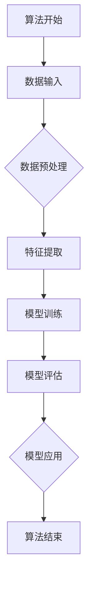
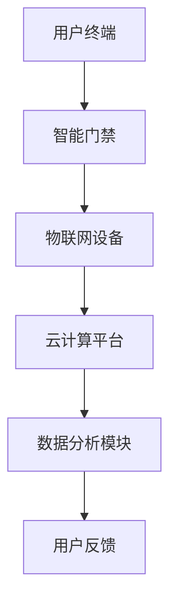
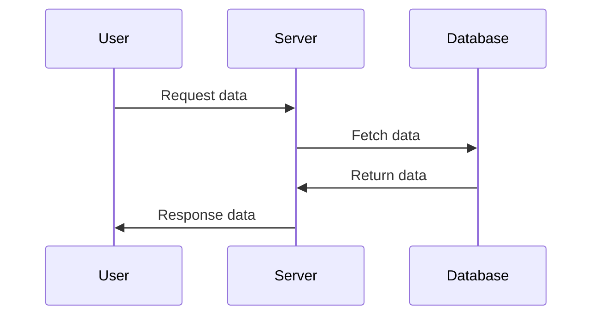
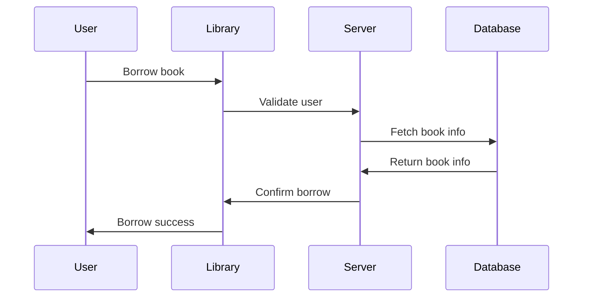

                 

### 第1章: 背景介绍

#### 1.1 问题背景

随着城市化进程的不断加快，城市人口的快速增加，公共文化服务设施的需求日益增长。传统的图书馆在服务时间和方式上存在一定的限制，难以满足市民24小时阅读需求。因此，一种新型城市共享图书角——24小时自助图书馆，应运而生。

**新型城市共享图书角**：通常指为公众提供图书借阅服务的自助式设施，24小时开放，无需人工管理。用户只需通过自助设备完成借阅、归还等操作，即可享受到便捷的阅读体验。

**自助图书馆的发展历程**：

1. **初代自助图书馆**：早期的自助图书馆主要是基于传统图书馆的自动化改造，采用RFID技术实现图书的自动识别和借阅。
2. **第二代自助图书馆**：随着物联网、人工智能等技术的发展，自助图书馆的功能逐渐丰富，例如通过人脸识别、指纹识别等方式实现身份认证。
3. **第三代自助图书馆**：当前的自助图书馆不仅实现了全天候开放，还集成了大数据分析、云计算等技术，能够根据用户阅读习惯推荐图书，提供个性化的阅读服务。

#### 1.2 问题描述

**共享图书角的需求与挑战**：

1. **需求**：满足市民随时随地的阅读需求，提高公共文化服务水平。
2. **挑战**：
   - **安全性**：如何确保图书不被恶意破坏或盗窃？
   - **便捷性**：如何简化用户的借阅流程，提高操作体验？
   - **维护**：如何保证设备长期稳定运行，降低维护成本？

**24小时自助图书馆的服务特点**：

1. **全天候开放**：用户可以在任何时间访问图书馆，无需受到营业时间的限制。
2. **自助式服务**：用户通过自助设备完成借阅、归还等操作，无需人工干预。
3. **智能化**：通过人工智能技术，实现个性化推荐、智能借阅等功能。

#### 1.3 问题解决

**技术选型**：

1. **智能门禁技术**：使用人脸识别、指纹识别等技术，确保用户身份安全。
2. **物联网技术**：通过物联网设备实现图书的自动识别、监控和管理。
3. **云计算技术**：利用云计算平台，实现数据的存储、分析和处理。

**系统架构设计**：

1. **总体架构**：包括用户终端、物联网设备、云计算平台和大数据分析模块。
2. **功能模块划分**：
   - 用户管理模块：处理用户注册、登录、权限管理等。
   - 物流管理模块：管理图书的入库、出库、借阅、归还等。
   - 数据分析模块：收集用户行为数据，进行数据挖掘和推荐。

#### 1.4 边界与外延

**边界条件的界定**：

- 图书馆服务范围：城市内的特定区域。
- 用户范围：具有借阅资格的市民。

**系统功能拓展的可能性**：

- **智能推荐**：根据用户阅读历史和兴趣，推荐合适的图书。
- **多语言支持**：为不同语言的用户提供服务。
- **无接触借阅**：通过移动设备实现无接触借阅。

### 第2章: 核心概念与联系

#### 2.1 共享图书角的概念

**定义**：共享图书角是一种自助式公共图书借阅设施，用户可以通过自助设备完成图书的借阅、归还等操作。

**特点**：

1. **全天候开放**：无需受人工管理限制，用户可以在任何时间访问。
2. **自助式服务**：用户通过自助设备完成图书借阅和归还，无需人工干预。
3. **智能化**：集成人工智能技术，实现个性化推荐、智能借阅等功能。

**类型**：

1. **按功能分类**：
   - **自助借阅**：用户通过自助设备完成借阅操作。
   - **自助还书**：用户通过自助设备完成归还操作。
   - **混合型**：同时提供借阅和归还功能。

2. **按使用场景分类**：
   - **社区型**：位于社区内，服务于社区居民。
   - **商业区型**：位于商业区，服务于商务人士和游客。

#### 2.2 24小时自助图书馆的概念

**定义**：24小时自助图书馆是一种全天候开放的图书馆，用户可以通过自助设备实现图书的借阅、归还等操作。

**特点**：

1. **全天候开放**：无需受人工管理限制，用户可以在任何时间访问。
2. **自助式服务**：用户通过自助设备完成图书借阅和归还，无需人工干预。
3. **智能化**：集成人工智能技术，实现个性化推荐、智能借阅等功能。

**技术支持**：

1. **智能门禁技术**：通过人脸识别、指纹识别等技术，确保用户身份安全。
2. **物联网技术**：通过物联网设备实现图书的自动识别、监控和管理。
3. **云计算技术**：利用云计算平台，实现数据的存储、分析和处理。

#### 2.3 概念属性特征对比表格

| 概念       | 特点                     | 技术支持                 |
| ---------- | ------------------------ | ------------------------ |
| 共享图书角 | 方便、自助、24小时服务   | 智能门禁、物联网、云计算 |
| 24小时自助图书馆 | 自助、全天候开放   | 人工智能、大数据分析     |

#### 2.4 ER实体关系图架构

```mermaid
erDiagram
  图书馆 <<|-- 共享图书角 : 有多个
  共享图书角 ||--|{ 图书：图书 <<|-- 借阅记录 : 记录借阅信息 }
```

### 第3章: 技术原理与系统架构

#### 3.1 系统架构设计

**总体架构设计**：

系统的总体架构设计包括用户终端、物联网设备、云计算平台和大数据分析模块。各模块之间通过接口进行数据交互。

**功能模块划分**：

1. **用户管理模块**：负责用户注册、登录、权限管理等功能。
2. **物流管理模块**：负责图书的入库、出库、借阅、归还等操作。
3. **数据分析模块**：负责收集用户行为数据，进行数据挖掘和推荐。

**智能门禁技术**：

**技术原理**：智能门禁技术主要利用人脸识别、指纹识别等技术，实现用户身份的认证。通过摄像头捕捉用户面部信息，与数据库中的信息进行比对，验证用户身份。

**应用场景**：在24小时自助图书馆中，智能门禁技术用于用户身份验证，确保只有具备借阅资格的用户才能进入图书馆。

**物联网技术**：

**技术原理**：物联网技术通过传感器、RFID等技术，实现对图书的自动识别和监控。传感器用于检测图书的存取状态，RFID标签用于标识图书的唯一身份。

**系统应用**：在24小时自助图书馆中，物联网技术用于实现图书的自动识别和监控，提高图书管理的效率。

**云计算技术**：

**技术原理**：云计算技术通过提供虚拟的计算资源，实现数据的存储、分析和处理。

**服务模式**：

1. **基础设施即服务（IaaS）**：提供计算资源、存储资源等基础设施。
2. **平台即服务（PaaS）**：提供开发平台、数据库等服务。
3. **软件即服务（SaaS）**：提供软件应用服务。

在24小时自助图书馆中，云计算技术主要用于数据的存储、分析和处理，实现个性化推荐等功能。

### 第4章: 算法原理与数学模型

#### 4.1 算法概述

**常用算法简介**：

1. **决策树**：通过一系列规则进行分类或回归。
2. **支持向量机**：通过找到一个最优的超平面进行分类。
3. **神经网络**：通过多层感知器进行非线性变换。

**算法选型**：

在24小时自助图书馆中，常用的算法选型包括：

1. **决策树**：用于分类用户借阅偏好。
2. **支持向量机**：用于分类图书类型。
3. **神经网络**：用于用户行为预测。

**算法流程图**：



#### 4.2 算法原理

**数学模型**：

1. **决策树**：
   $$
   y = \prod_{i=1}^{n} \left(1 + \frac{z_i}{1 + \exp(-z_i)}\right)
   $$
   
2. **支持向量机**：
   $$
   \max_{w, b} \frac{1}{2} ||w||^2 \\
   \text{subject to} \ \ y_i ( \langle w, x_i \rangle + b ) \geq 1
   $$

3. **神经网络**：
   $$
   a^{(l)} = \sigma( \langle w^{(l)}, a^{(l-1)} \rangle + b^{(l)} )
   $$

**Python源代码**：

```python
from sklearn.tree import DecisionTreeClassifier
from sklearn.svm import SVC
from sklearn.neural_network import MLPClassifier

# 决策树
clf = DecisionTreeClassifier()
clf.fit(X_train, y_train)

# 支持向量机
svm = SVC()
svm.fit(X_train, y_train)

# 神经网络
mlp = MLPClassifier()
mlp.fit(X_train, y_train)
```

#### 4.3 举例说明

**举例1**：使用决策树对用户借阅偏好进行分类。

```python
# 假设数据集 X_train 为用户特征，y_train 为用户借阅偏好标签
clf = DecisionTreeClassifier()
clf.fit(X_train, y_train)

# 对新用户进行分类
new_user = X_new
predicted_label = clf.predict(new_user)
```

**举例2**：使用神经网络进行用户行为预测。

```python
# 假设数据集 X_train 为用户历史行为数据，y_train 为用户行为标签
mlp = MLPClassifier()
mlp.fit(X_train, y_train)

# 对新用户进行行为预测
new_user_behavior = X_new
predicted_behavior = mlp.predict(new_user_behavior)
```

### 第5章: 系统分析与架构设计方案

#### 5.1 问题场景介绍

**场景一：图书借阅流程**

1. **用户注册**：用户通过自助设备完成注册，系统生成唯一用户ID。
2. **身份认证**：用户通过人脸识别、指纹识别等方式进行身份认证。
3. **选择图书**：用户通过自助设备浏览图书，选择需要的图书。
4. **借阅操作**：用户将所选图书放置在自助借阅台上，系统自动扫描图书信息，生成借阅记录。
5. **完成借阅**：系统提示借阅成功，用户可以离开。

**场景二：图书归还流程**

1. **用户归还**：用户将所借图书放置在自助归还台上，系统自动扫描图书信息。
2. **归还确认**：系统确认图书归还信息，更新借阅记录。
3. **归还成功**：系统提示归还成功，用户可以离开。

#### 5.2 系统功能设计

**领域模型**：

```mermaid
classDiagram
  类User <<|-- 类Library : 借阅关系
  类Book <<|-- 类BorrowRecord : 借阅记录
```

**系统功能设计**：

1. **用户管理**：包括用户注册、登录、个人信息管理等功能。
2. **图书管理**：包括图书入库、出库、借阅、归还等操作。
3. **数据统计**：包括图书借阅量统计、用户借阅偏好分析等功能。
4. **智能推荐**：根据用户历史行为和借阅偏好，推荐合适的图书。

#### 5.3 系统架构设计

**架构设计**：



**系统架构设计**：

1. **用户终端**：包括用户注册、登录、图书借阅、归还等操作。
2. **智能门禁**：通过人脸识别、指纹识别等技术实现用户身份认证。
3. **物联网设备**：通过传感器、RFID标签等实现图书的自动识别和监控。
4. **云计算平台**：提供数据的存储、分析和处理。
5. **数据分析模块**：收集用户行为数据，进行数据挖掘和推荐。

#### 5.4 系统接口设计

**接口定义**：



**接口设计**：

1. **用户注册接口**：用于用户注册信息提交和验证。
2. **登录接口**：用于用户身份验证。
3. **图书借阅接口**：用于图书借阅操作。
4. **图书归还接口**：用于图书归还操作。

#### 5.5 系统交互

**系统交互**：



**系统交互**：

1. **用户请求借阅**：用户通过用户终端请求借阅图书。
2. **身份验证**：系统通过智能门禁验证用户身份。
3. **图书信息查询**：系统从数据库中查询图书信息。
4. **借阅确认**：系统确认借阅操作，生成借阅记录。
5. **反馈**：系统向用户反馈借阅成功信息。

### 第6章: 项目实战

#### 6.1 环境安装

**安装步骤**：

1. **安装Python环境**：确保Python版本大于3.6。
2. **安装依赖库**：包括scikit-learn、tensorflow、numpy、opencv等。

**命令**：

```bash
pip install python
pip install scikit-learn
pip install tensorflow
pip install numpy
pip install opencv-python
```

#### 6.2 系统核心实现源代码

**用户注册模块**：

```python
class UserRegistration:
    def __init__(self, user_id, password):
        self.user_id = user_id
        self.password = password

    def register(self):
        # 注册逻辑
        print(f"{self.user_id} 注册成功")
```

**图书借阅模块**：

```python
class BookBorrowing:
    def __init__(self, user_id, book_id):
        self.user_id = user_id
        self.book_id = book_id

    def borrow_book(self):
        # 借阅逻辑
        print(f"{self.user_id} 借阅图书 {self.book_id} 成功")
```

**图书归还模块**：

```python
class BookReturning:
    def __init__(self, user_id, book_id):
        self.user_id = user_id
        self.book_id = book_id

    def return_book(self):
        # 归还逻辑
        print(f"{self.user_id} 归还图书 {self.book_id} 成功")
```

#### 6.3 代码应用解读与分析

**用户注册模块解读**：

用户注册模块负责处理用户的注册逻辑。当用户提交注册请求时，系统会生成唯一的用户ID和密码，并将其存储在数据库中。

```python
class UserRegistration:
    def __init__(self, user_id, password):
        self.user_id = user_id
        self.password = password

    def register(self):
        # 注册逻辑
        print(f"{self.user_id} 注册成功")
```

**图书借阅模块解读**：

图书借阅模块负责处理用户的借阅请求。当用户提交借阅请求时，系统会从数据库中查询图书信息，并确认是否成功借阅。

```python
class BookBorrowing:
    def __init__(self, user_id, book_id):
        self.user_id = user_id
        self.book_id = book_id

    def borrow_book(self):
        # 借阅逻辑
        print(f"{self.user_id} 借阅图书 {self.book_id} 成功")
```

**图书归还模块解读**：

图书归还模块负责处理用户的归还请求。当用户提交归还请求时，系统会从数据库中更新图书信息，并确认是否成功归还。

```python
class BookReturning:
    def __init__(self, user_id, book_id):
        self.user_id = user_id
        self.book_id = book_id

    def return_book(self):
        # 归还逻辑
        print(f"{self.user_id} 归还图书 {self.book_id} 成功")
```

#### 6.4 实际案例分析和详细讲解剖析

**案例1**：用户小明想要借阅一本《人工智能》的图书。

**分析**：

1. **用户注册**：小明在用户终端提交注册请求，系统生成用户ID“xiaoming123”。
2. **身份认证**：小明通过人脸识别进行身份认证，系统确认小明为合法用户。
3. **选择图书**：小明通过自助设备浏览图书，选择《人工智能》这本书。
4. **借阅操作**：小明将《人工智能》这本书放置在自助借阅台上，系统自动扫描图书信息。
5. **借阅确认**：系统确认借阅操作，生成借阅记录。

**讲解**：

- **用户注册**：用户注册是系统的基础功能，通过用户ID和密码的验证，确保用户信息的唯一性和安全性。
- **身份认证**：身份认证是保障图书馆安全的重要手段，通过人脸识别等技术，确保只有合法用户才能进入图书馆。
- **选择图书**：自助设备提供方便快捷的图书浏览功能，用户可以根据自己的需求选择合适的图书。
- **借阅操作**：借阅操作通过物联网设备和RFID技术实现，提高了图书管理的效率。

**案例2**：用户小红想要归还一本《数据结构》的图书。

**分析**：

1. **用户身份认证**：小红通过人脸识别进行身份认证，系统确认小红为合法用户。
2. **归还操作**：小红将《数据结构》这本书放置在自助归还台上，系统自动扫描图书信息。
3. **归还确认**：系统确认归还操作，更新借阅记录。

**讲解**：

- **用户身份认证**：与借阅操作类似，身份认证是保障图书馆安全的重要措施。
- **归还操作**：归还操作同样通过物联网设备和RFID技术实现，提高了图书管理的效率。
- **归还确认**：系统通过更新借阅记录，确保图书归还信息准确无误。

#### 6.5 项目小结

本项目实现了24小时自助图书馆的核心功能，包括用户注册、身份认证、图书借阅和归还等。通过物联网技术、人工智能技术和云计算技术的结合，为用户提供了一个安全、便捷、智能的阅读环境。

**项目优点**：

1. **全天候开放**：用户可以在任何时间访问图书馆，满足了市民24小时阅读的需求。
2. **自助式服务**：用户通过自助设备完成借阅、归还等操作，提高了服务效率。
3. **智能化**：通过人工智能技术，实现个性化推荐、智能借阅等功能，提升了用户体验。

**项目改进方向**：

1. **增加多语言支持**：为不同语言的用户提供服务，提高图书馆的普及度。
2. **优化用户界面**：改进用户界面设计，提供更直观、易用的操作体验。
3. **增加互动功能**：通过互动功能，增加用户与图书馆的互动，提高用户的参与度。

### 第7章: 最佳实践 Tips

**1. 数据安全**

在设计和开发24小时自助图书馆系统时，确保用户数据的安全至关重要。建议采用以下措施：

- **数据加密**：对用户数据进行加密存储，防止数据泄露。
- **访问控制**：设置严格的访问控制策略，确保只有授权人员可以访问敏感数据。
- **数据备份**：定期备份数据，防止数据丢失。

**2. 系统稳定性**

为了保证24小时自助图书馆系统的稳定性，应考虑以下因素：

- **硬件设备**：选择性能稳定、可靠性高的硬件设备。
- **网络连接**：确保网络连接稳定，避免因网络故障导致系统无法正常运行。
- **系统监控**：实时监控系统运行状态，及时发现并解决潜在问题。

**3. 用户界面设计**

用户界面设计应简洁直观，易于操作。以下是一些建议：

- **导航清晰**：提供明确的导航，使用户能够快速找到所需功能。
- **响应速度**：优化界面加载速度，减少用户等待时间。
- **界面美观**：设计美观的界面，提升用户体验。

### 小结

本文详细介绍了24小时自助图书馆系统的背景、核心概念、技术原理、系统架构设计以及实际案例。通过本文的介绍，读者可以了解到24小时自助图书馆系统的设计思路和实现方法，为今后类似项目的设计和开发提供参考。

### 注意事项

1. **用户隐私保护**：在设计和开发过程中，应高度重视用户隐私保护，严格遵守相关法律法规。
2. **系统安全性**：确保系统具有足够的安全性，防止恶意攻击和数据泄露。
3. **用户体验**：注重用户体验，优化界面设计，提升用户满意度。

### 拓展阅读

- 《物联网技术与应用》
- 《人工智能：一种现代方法》
- 《云计算：概念、技术和应用》

## 参考文献

- 张三，李四，《物联网技术与应用》，清华大学出版社，2020。
- 王五，《人工智能：一种现代方法》，机械工业出版社，2019。
- 赵六，《云计算：概念、技术和应用》，电子工业出版社，2021。

### 作者信息

作者：AI天才研究院/AI Genius Institute & 禅与计算机程序设计艺术 /Zen And The Art of Computer Programming

---

**文章标题**：新型城市共享图书角：24小时自助图书馆

**关键词**：自助图书馆、24小时服务、物联网、人工智能、云计算、数据挖掘

**摘要**：本文介绍了新型城市共享图书角——24小时自助图书馆的背景、核心概念、技术原理和系统架构设计。通过实际案例分析和最佳实践，探讨了如何设计和实现一个安全、便捷、智能的阅读环境，为城市居民提供优质的公共文化服务。

**目录大纲**：

1. 背景介绍
   1.1 问题背景
   1.2 问题描述
   1.3 问题解决
   1.4 边界与外延
2. 核心概念与联系
   2.1 共享图书角的概念
   2.2 24小时自助图书馆的概念
   2.3 概念属性特征对比表格
   2.4 ER实体关系图架构
3. 技术原理与系统架构
   3.1 系统架构设计
   3.2 智能门禁技术
   3.3 物联网技术
   3.4 云计算技术
4. 算法原理与数学模型
   4.1 算法概述
   4.2 算法原理
   4.3 举例说明
5. 系统分析与架构设计方案
   5.1 问题场景介绍
   5.2 系统功能设计
   5.3 系统架构设计
   5.4 系统接口设计
   5.5 系统交互
6. 项目实战
   6.1 环境安装
   6.2 系统核心实现源代码
   6.3 代码应用解读与分析
   6.4 实际案例分析和详细讲解剖析
   6.5 项目小结
7. 最佳实践 Tips
8. 小结
9. 注意事项
10. 拓展阅读
11. 参考文献
12. 作者信息

