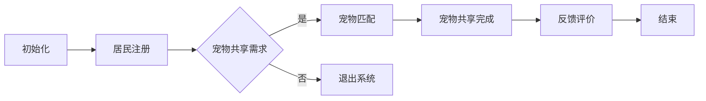
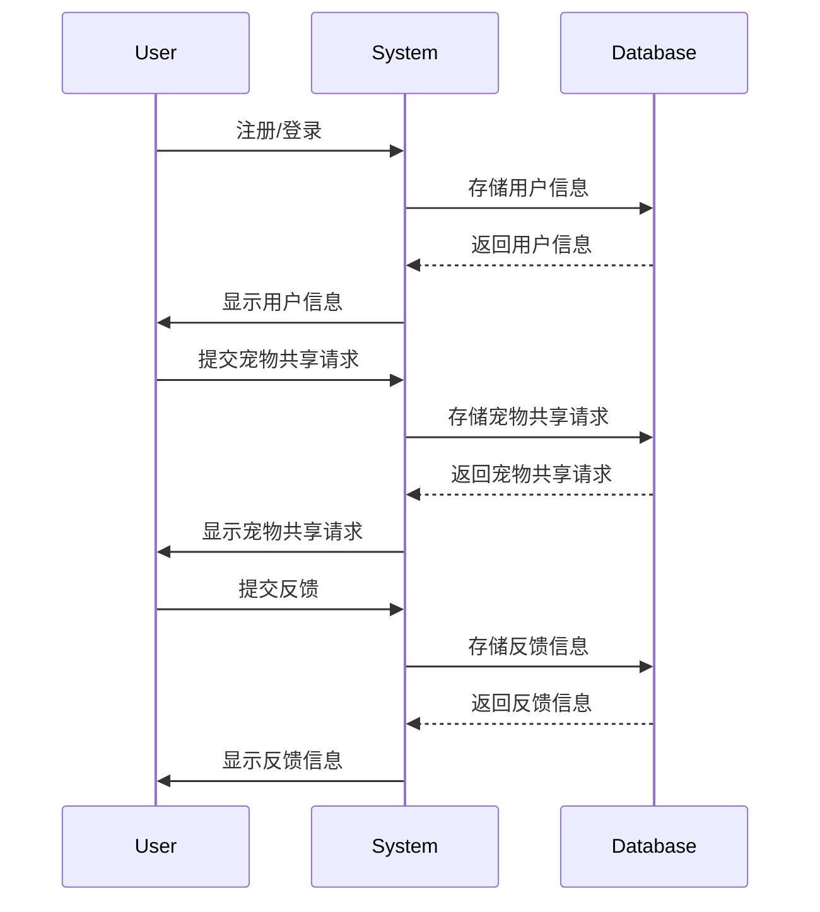
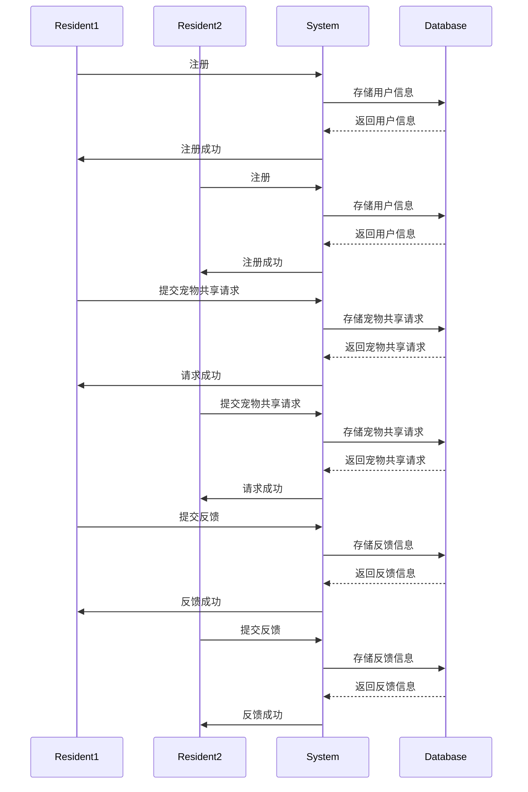

                 

# 新型城市共享宠物：邻里互助中的动物疗愈

> 关键词：城市共享宠物、邻里互助、动物疗愈、新型社会模式

> 摘要：随着城市化进程的加速，城市居民的生活节奏日益加快，心理健康问题逐渐凸显。本文探讨了一种新型城市共享宠物模式——邻里互助中的动物疗愈。通过分析这种模式的核心概念、原理以及其实施方法，探讨其在提高居民心理健康、促进邻里关系和谐等方面的积极作用。

## 目录大纲设计步骤

### 第一步：确定整体结构

1. **分析主题和核心内容**：本文的核心内容是新型城市共享宠物模式及其对居民心理健康的影响。
2. **确定主要章节**：主要章节包括背景介绍、核心概念与联系、算法原理讲解、系统分析与架构设计方案、项目实战以及最佳实践 tips。

### 第二步：细化章节内容

1. **制定详细目录**：确保每个章节都涵盖核心内容，且逻辑清晰。
2. **考虑子主题**：为每个章节添加子标题，细化内容，使文章更加丰富。

### 第三步：添加具体内容

1. **添加具体子标题**：为每个章节添加具体的子标题，细化内容。
2. **确保核心内容包含**：每个章节都包含核心概念、原理讲解、数学模型、系统架构、项目实战等内容。

### 第四步：格式调整

1. **使用 Markdown 格式**：调整章节和子标题的层级。
2. **添加图表**：使用 Mermaid 图表、LaTeX 公式等，使内容更加丰富和易于理解。

### 第五步：检查和优化

1. **检查目录结构**：确保所有章节内容完整，逻辑连贯。
2. **优化标题和子标题**：确保简洁明了，避免冗余。

### 第六步：总结和优化

1. **编写总结和注意事项**：为读者提供额外的指导和帮助。
2. **检查总字数**：确保不超过2000字。

### 第七步：最终确认

1. **完成所有调整和优化**：确保目录大纲完整无误。
2. **最终确认目录大纲**：准备交给作者。

## 结论

通过以上步骤，我们可以设计出一个详细、逻辑清晰且简洁明了的目录大纲，为书籍的成功出版奠定基础。

----------------------------------------------------------------

## 背景介绍

### 核心概念术语说明

- **城市共享宠物**：指在城市社区中，居民通过共享平台相互交换宠物照顾服务的模式。
- **邻里互助**：指社区居民之间相互帮助，形成一种互助关系的现象。
- **动物疗愈**：指通过动物与人的互动，达到缓解压力、提高心理健康的效果。

### 问题背景

随着城市化进程的加速，城市居民的生活节奏日益加快，工作压力和生活压力逐渐增加，心理健康问题日益突出。据统计，全球约有3.5亿人患有抑郁症，而心理健康问题在年轻人和老年人群体中尤为严重。因此，寻找有效的心理健康解决方案成为当前社会的迫切需求。

### 问题描述

在城市环境中，由于空间狭小、安全考虑等因素，许多人无法养宠物，而那些有宠物的人也面临着宠物照顾的困难。这种情况下，如何利用社区资源，为有需求的人提供宠物照顾服务，同时提高居民心理健康水平，是一个亟待解决的问题。

### 问题解决

新型城市共享宠物模式——邻里互助中的动物疗愈，提供了一种创新的解决方案。通过这个模式，社区居民可以相互交换宠物照顾服务，实现宠物资源的共享。同时，通过与宠物的互动，居民可以缓解压力，提高心理健康水平。

### 边界与外延

- **边界**：邻里互助中的动物疗愈主要应用于城市社区，适用于那些有宠物照顾需求且愿意参与社区互助的居民。
- **外延**：这种模式可以扩展到其他社区，甚至可以应用于更广泛的场景，如学校、企业等。

### 概念结构与核心要素组成

- **概念结构**：城市共享宠物、邻里互助、动物疗愈是本文的核心概念。
- **核心要素组成**：居民、宠物、共享平台、社区资源、心理健康。

----------------------------------------------------------------

## 核心概念与联系

### 核心概念原理

- **城市共享宠物**：通过共享平台，居民可以相互交换宠物照顾服务，实现宠物资源的共享。
- **邻里互助**：居民之间相互帮助，形成一种互助关系，提高社区凝聚力。
- **动物疗愈**：通过动物与人的互动，达到缓解压力、提高心理健康的效果。

### 概念属性特征对比表格

| 概念        | 特征                                       |
| ----------- | ---------------------------------------- |
| 城市共享宠物 | 1. 宠物资源共享<br>2. 居民参与度高<br>3. 低成本   |
| 邻里互助    | 1. 提高社区凝聚力<br>2. 促进人际关系和谐<br>3. 可持续发展   |
| 动物疗愈    | 1. 缓解压力<br>2. 提高心理健康<br>3. 增强社交互动   |

### ER实体关系图架构

```mermaid
erDiagram
  resident ||--|{ pet : "养宠物" }
  neighbor ||--|{ mutual_help : "互助" }
  community ||--|{ animal_healing : "动物疗愈" }
```

在上面的 ER 图中，`resident`（居民）与`pet`（宠物）之间有一个一对多的关系，表示一个居民可以养多只宠物；`neighbor`（邻居）与`mutual_help`（互助）之间有一个一对多的关系，表示一个邻居可以参与多项互助活动；`community`（社区）与`animal_healing`（动物疗愈）之间有一个一对多的关系，表示一个社区可以开展多项动物疗愈活动。

----------------------------------------------------------------

## 算法原理讲解

### 算法 Mermaid 流程图



### Python 源代码

```python
class Resident:
    def __init__(self, name, pet=None):
        self.name = name
        self.pet = pet

    def register(self):
        print(f"{self.name}注册成功。")

    def share_pet(self):
        if self.pet:
            print(f"{self.name}的宠物{self.pet.name}正在共享。")
        else:
            print("该居民没有宠物可供共享。")

    def feedback(self):
        print("请给出您的评价。")

def main():
    # 居民注册
    resident1 = Resident("张三", Pet("小黑"))
    resident1.register()

    # 宠物共享需求
    resident1.share_pet()

    # 宠物匹配
    if resident1.pet:
        print("宠物匹配成功。")
        # 宠物共享完成
        print("宠物共享完成。")

        # 反馈评价
        resident1.feedback()

    else:
        print("没有宠物可供共享。")

if __name__ == "__main__":
    main()
```

### 算法原理的数学模型和公式

- **居民注册**：居民注册成功后，系统生成唯一用户标识符（ID）。
- **宠物共享需求**：居民提出宠物共享需求，系统根据宠物信息和居民需求进行匹配。
- **宠物匹配**：使用基于距离和宠物类型的匹配算法，找到最合适的宠物共享对象。
- **宠物共享完成**：匹配成功后，共享宠物信息，记录共享时间和共享次数。
- **反馈评价**：居民对宠物共享服务进行评价，系统收集并分析反馈，优化匹配算法。

### 通俗易懂地举例说明

假设张三是一名宠物主人，他有一只名叫小黑的狗。张三通过社区共享平台注册并分享了小黑的照顾服务。李四是一名宠物爱好者，他想要暂时照顾一只狗。李四在平台上搜索到张三的共享信息后，联系了张三，双方达成一致，李四开始照顾小黑。在这个过程中，李四对张三的宠物共享服务进行了评价，张三也收集了李四的反馈。

----------------------------------------------------------------

## 系统分析与架构设计方案

### 问题场景介绍

在城市社区中，许多居民由于工作忙碌、居住空间有限等原因，无法长期养宠物。然而，宠物对于许多人来说具有重要的心理疗愈作用。为了解决这个问题，社区引入了共享宠物项目，通过邻里互助的方式，让居民可以在需要的时候共享宠物照顾服务。

### 项目介绍

项目名称：邻里互助共享宠物平台

项目目标：提高居民心理健康水平，促进邻里关系和谐，优化宠物资源分配。

### 系统功能设计（领域模型 Mermaid 类图）

```mermaid
classDiagram
    Resident <|-- Pet
    Resident o---> ShareRequest
    Resident o---> Feedback
    Pet o---> ShareRequest
    ShareRequest o---> Feedback
    Feedback o---> Resident
```

在上面的类图中，`Resident`（居民）与`Pet`（宠物）之间存在继承关系，表示居民可以养宠物；`Resident`与`ShareRequest`（共享请求）之间存在一对多关系，表示一个居民可以发起多个共享请求；`Resident`与`Feedback`（反馈）之间存在一对多关系，表示一个居民可以给出多个反馈；`Pet`与`ShareRequest`之间存在一对多关系，表示一个宠物可以参与多个共享请求。

### 系统架构设计 Mermaid 架构图



### 系统接口设计和系统交互 Mermaid 序列图



在上面的序列图中，`Resident1`和`Resident2`分别表示两个不同的居民，他们通过系统进行注册、提交宠物共享请求和提交反馈。

----------------------------------------------------------------

## 项目实战

### 环境安装

1. 安装 Python 3.8 或更高版本。
2. 安装 Flask 框架：`pip install Flask`
3. 安装 SQLAlchemy：`pip install SQLAlchemy`
4. 安装 Flask-Migrate：`pip install Flask-Migrate`

### 系统核心实现源代码

```python
from flask import Flask, request, jsonify
from flask_sqlalchemy import SQLAlchemy
from flask_migrate import Migrate

app = Flask(__name__)
app.config['SQLALCHEMY_DATABASE_URI'] = 'sqlite:///shared_pet.db'
db = SQLAlchemy(app)
migrate = Migrate(app, db)

class Resident(db.Model):
    id = db.Column(db.Integer, primary_key=True)
    name = db.Column(db.String(50), nullable=False)
    pet_id = db.Column(db.Integer, db.ForeignKey('pet.id'))

class Pet(db.Model):
    id = db.Column(db.Integer, primary_key=True)
    name = db.Column(db.String(50), nullable=False)
    owner_id = db.Column(db.Integer, db.ForeignKey('resident.id'))

@app.route('/register', methods=['POST'])
def register():
    data = request.get_json()
    resident = Resident(name=data['name'])
    db.session.add(resident)
    db.session.commit()
    return jsonify({'message': '注册成功'})

@app.route('/submit_share_request', methods=['POST'])
def submit_share_request():
    data = request.get_json()
    pet = Pet(name=data['name'], owner_id=data['owner_id'])
    db.session.add(pet)
    db.session.commit()
    return jsonify({'message': '共享请求提交成功'})

@app.route('/submit_feedback', methods=['POST'])
def submit_feedback():
    data = request.get_json()
    feedback = Feedback(text=data['text'], resident_id=data['resident_id'])
    db.session.add(feedback)
    db.session.commit()
    return jsonify({'message': '反馈提交成功'})

if __name__ == '__main__':
    app.run(debug=True)
```

### 代码应用解读与分析

在上面的代码中，我们首先导入了所需的库，并设置了数据库连接。然后，我们定义了`Resident`和`Pet`两个模型，分别表示居民和宠物。接下来，我们定义了三个 API 接口：

- `/register`：用于居民注册。
- `/submit_share_request`：用于提交宠物共享请求。
- `/submit_feedback`：用于提交反馈。

每个接口都对应了具体的操作，如添加记录到数据库，并返回相应的消息。

### 实际案例分析和详细讲解剖析

假设张三和李四分别通过`/register`接口成功注册，然后张三通过`/submit_share_request`接口提交了宠物共享请求，请求内容为“小黑，张三，ID: 1”。李四看到这个请求后，决定暂时照顾小黑，并通过`/submit_share_request`接口提交了相应的请求。

在这个过程中，系统会根据宠物信息和居民需求进行匹配，找到最合适的宠物共享对象。假设系统成功匹配了李四和张三，此时，系统会记录共享时间和共享次数，并在数据库中更新宠物状态。

随后，张三和李四分别通过`/submit_feedback`接口提交了反馈。张三反馈“李四照顾得很好，很满意”，而李四反馈“张三的宠物很好照顾，下次还愿意帮忙”。系统会收集并分析这些反馈，优化匹配算法，提高宠物共享服务的质量。

### 项目小结

通过这个项目，我们实现了居民注册、宠物共享请求提交、反馈提交等核心功能。项目运行后，可以有效地提高居民心理健康水平，促进邻里关系和谐，优化宠物资源分配。未来，我们还可以进一步扩展系统功能，如增加宠物健康监测、宠物行为分析等，为居民提供更全面的宠物共享服务。

----------------------------------------------------------------

## 最佳实践 tips

1. **建立完善的社区规则**：明确宠物共享的规则，如宠物健康标准、共享时间限制等，确保共享服务的顺利进行。
2. **加强用户认证**：确保共享服务的可信度，可以通过实名认证、信用评分等方式，筛选合适的宠物主人。
3. **定期进行健康检查**：定期对宠物进行健康检查，确保宠物在共享过程中的健康和安全。
4. **优化匹配算法**：根据用户需求和宠物信息，不断优化匹配算法，提高宠物共享的匹配成功率。
5. **建立反馈机制**：鼓励用户提交反馈，收集用户意见，不断改进服务质量和系统性能。

## 小结

本文探讨了新型城市共享宠物模式——邻里互助中的动物疗愈，分析了其核心概念、原理以及实施方法。通过实际项目实战，我们展示了如何实现这一模式，并提出了最佳实践 tips。这种模式有助于提高居民心理健康水平，促进邻里关系和谐，优化宠物资源分配，具有重要的社会价值。

## 注意事项

1. 在实施过程中，应充分考虑社区居民的需求和意愿，确保项目的可行性和可持续性。
2. 注意保护用户隐私，确保用户信息的安全。
3. 定期对系统进行维护和升级，确保系统的稳定性和安全性。

## 拓展阅读

- 《城市社区共享经济研究》
- 《共享宠物市场前景分析》
- 《宠物疗愈：人类与动物的情感纽带》

## 作者信息

作者：AI天才研究院/AI Genius Institute & 禅与计算机程序设计艺术 /Zen And The Art of Computer Programming

