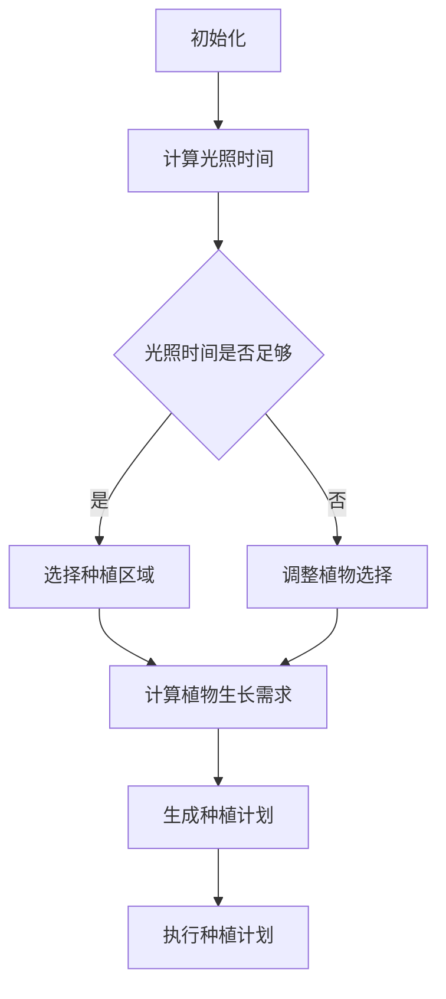

                 

### 新型城市共享屋顶花园：都市农耕与社交的完美结合

> 关键词：新型城市、共享屋顶花园、都市农耕、社交、结合

> 摘要：随着城市化进程的加快，城市空间变得越来越紧张。如何在有限的土地上实现可持续发展和生态平衡，成为当今社会的一大挑战。本文将探讨一种新兴的城市空间利用方式——新型城市共享屋顶花园，以及它如何将都市农耕与社交完美结合，为城市居民带来生态、经济和社会的多重效益。

---

## 引言

随着城市化的不断推进，城市居民面临着诸多挑战，包括环境污染、土地资源紧张、生物多样性减少等。如何在这些挑战中找到解决方案，成为城市规划者、建筑师和生态学家共同探讨的课题。新型城市共享屋顶花园作为一种创新的城市空间利用方式，逐渐受到关注。它不仅能够提高城市绿化率，改善城市生态环境，还能为居民提供休闲、社交和农耕体验的空间。

本文将从以下几个方面展开讨论：

1. **背景介绍**：探讨城市共享屋顶花园的兴起原因、意义及其对城市生活的影响。
2. **核心概念与联系**：介绍都市农耕、共享经济和社会互动等概念，并阐述它们在共享屋顶花园中的关系。
3. **系统分析与架构设计方案**：讨论屋顶花园的规划、建设、维护和管理。
4. **项目实战**：提供实际案例，展示如何实施和运营一个成功的共享屋顶花园。
5. **最佳实践与拓展**：总结经验，提供进一步的发展建议。

通过以上讨论，希望能够为读者提供一个全面、深入的关于新型城市共享屋顶花园的理解，以及其在都市农耕和社交结合中的潜力。

---

## 背景介绍

### 城市共享屋顶花园的兴起原因

城市共享屋顶花园的兴起，源于多方面的原因。首先，随着城市化进程的加快，城市土地资源变得越来越紧张。传统的绿地和公园空间难以满足不断增长的人口需求，而屋顶花园作为一种立体化的城市绿化形式，能够有效利用建筑物的闲置空间，提高城市绿化率。其次，现代城市居民对生态、健康和休闲的需求不断增加。屋顶花园提供了接近自然的绿色空间，有助于缓解城市生活中的压力和疲劳。此外，政府政策的支持也是城市共享屋顶花园发展的重要推动力。许多城市政府开始意识到屋顶花园在改善城市生态环境、缓解城市热岛效应等方面的积极作用，因此出台了一系列鼓励和支持屋顶花园建设的政策。

### 城市共享屋顶花园的意义

城市共享屋顶花园不仅能够改善城市生态环境，还具有多重社会效益。首先，屋顶花园能够提高城市的绿化覆盖率，增加城市中的绿地面积。这对于缓解城市空气污染、改善微气候具有显著的作用。其次，屋顶花园为城市居民提供了亲近自然、放松身心的场所，有助于提高居民的生活质量和幸福感。此外，共享屋顶花园还为社会互动和社区建设提供了平台。居民可以在屋顶花园中交流、分享经验，建立更加紧密的社区关系。

### 对城市生活的影响

城市共享屋顶花园对城市生活的影响是深远的。首先，它改变了城市居民的生活方式，鼓励人们更多地参与户外活动和农耕体验，增强了居民对自然环境的认识和保护意识。其次，屋顶花园的出现丰富了城市的公共空间，为居民提供了更多的休闲选择，有助于提升城市的文化氛围和人文关怀。此外，屋顶花园的发展还能够促进城市经济的可持续发展。通过屋顶花园的建设和运营，可以创造新的就业机会，推动城市服务业的发展。

总之，城市共享屋顶花园作为一种创新的城市空间利用方式，不仅具有显著的生态效益，还在社会和经济层面产生了积极的影响。它为城市居民提供了一种全新的生活方式，也为城市的可持续发展注入了新的活力。

### 核心概念与联系

在探讨新型城市共享屋顶花园时，我们需要了解几个核心概念，它们分别是都市农耕、共享经济和社会互动。这些概念不仅构成了共享屋顶花园的基础，还相互联系，共同推动这一新兴模式的发展。

#### 都市农耕

都市农耕是指在城市中利用有限的空间，通过种植蔬菜、水果、草本植物等，实现农业生产的活动。与传统农业相比，都市农耕具有规模小、分布广、亲近自然等特点。它不仅能够提供新鲜的农产品，还具备教育、休闲和生态保护等多种功能。都市农耕的核心是土地的高效利用和资源的循环利用。通过在屋顶、阳台等空间进行种植，不仅可以增加城市绿化，还能减少对传统农业用地的依赖，实现城市生态环境的可持续发展。

#### 共享经济

共享经济是一种基于共享资源的商业模式，通过共享物品、服务和空间，实现资源的最优配置。共享经济的核心理念是“共享、共用、共赢”，它通过平台化、数字化的手段，降低了资源的使用门槛，提高了资源利用效率。在城市共享屋顶花园中，共享经济体现为居民通过共同管理、使用和分享屋顶空间，实现农耕活动和社交互动。这种模式不仅降低了个人种植和管理的成本，还促进了社区成员之间的交流和合作。

#### 社会互动

社会互动是指个体或群体在相互交往过程中，通过语言、行为和情感等手段进行信息交换和情感表达的过程。在共享屋顶花园中，社会互动主要体现在居民之间的交流和合作。居民可以通过共同参与农耕活动，增进了解和信任，建立良好的社区关系。此外，共享屋顶花园还提供了多种社交平台，如社区聚会、农耕体验活动等，为居民提供了一个交流和互动的空间。通过这些互动，居民不仅能够分享农耕经验，还能获得情感支持和社交满足。

#### 核心概念之间的关系

都市农耕、共享经济和社会互动在共享屋顶花园中相互联系，共同推动这一模式的发展。首先，都市农耕为共享屋顶花园提供了实际内容。通过农耕活动，居民可以在屋顶空间中种植蔬菜、水果等，实现自给自足。其次，共享经济为都市农耕提供了资源和管理支持。居民可以通过共享平台，共同管理、使用和分享屋顶空间，降低个人负担，提高资源利用效率。最后，社会互动为共享屋顶花园注入了活力。居民在共同参与农耕活动的过程中，建立了深厚的社区关系，促进了社区的建设和发展。

总之，都市农耕、共享经济和社会互动构成了共享屋顶花园的核心概念，它们相互联系，共同推动这一新兴模式的创新和发展。

### 核心概念原理

为了更好地理解都市农耕、共享经济和社会互动在共享屋顶花园中的角色，我们需要详细探讨这些核心概念的原理，并借助概念属性特征对比表格和ER实体关系图架构的Mermaid流程图来展示它们之间的内在联系。

#### 都市农耕原理

都市农耕的核心在于在城市有限的空间内，通过高效利用土地资源，实现农作物的种植和生产。其原理主要包括以下几个方面：

1. **空间利用**：都市农耕通过利用屋顶、阳台等城市空间，将农业生产带入城市，实现了空间的高效利用。
2. **种植技术**：都市农耕采用先进的种植技术，如无土栽培、垂直种植等，提高了农作物的产量和质量。
3. **资源共享**：通过共享平台，居民可以共同使用种植工具和资源，降低了个人种植的门槛。

**概念属性特征对比表格：**

| 特征 | 都市农耕 | 传统农业 |
| --- | --- | --- |
| 空间利用 | 高效利用城市空间 | 大片农田 |
| 种植技术 | 先进种植技术 | 传统种植技术 |
| 资源共享 | 共享资源平台 | 个人资源独立 |

**ER实体关系图架构：**

```mermaid
erDiagram
  居民 ||--|{ 种植园 }| 监管员
  居民 ||--|{ 农作物 }| 种植
  种植园 ||--|{ 共享资源 }| 使用
  农作物 ||--|{ 生长周期 }| 状态
```

#### 共享经济原理

共享经济的核心在于通过共享平台，实现资源的最优配置和利用。其原理主要包括以下几个方面：

1. **平台化**：通过共享平台，将闲置资源（如空间、工具等）进行整合和分配。
2. **数字化**：利用互联网和移动技术，提高资源分配的效率和透明度。
3. **共赢**：通过共享经济，实现资源所有者和使用者的双赢。

**概念属性特征对比表格：**

| 特征 | 共享经济 | 传统的资源利用 |
| --- | --- | --- |
| 平台化 | 共享平台 | 单一资源管理 |
| 数字化 | 数字化平台 | 纸质记录 |
| 共赢 | 双赢 | 单赢或无赢 |

**ER实体关系图架构：**

```mermaid
erDiagram
  平台 ||--|{ 资源 }| 用户
  平台 ||--|{ 交易 }| 记录
  用户 ||--|{ 资源需求 }| 需求
  用户 ||--|{ 资源提供 }| 提供者
```

#### 社会互动原理

社会互动的核心在于通过交流和合作，建立和维护人际关系。其原理主要包括以下几个方面：

1. **社区建设**：通过共享活动，居民可以建立共同的社区归属感。
2. **信息交换**：通过互动，居民可以分享经验、知识和资源。
3. **情感支持**：社会互动为居民提供了情感交流和情感支持的平台。

**概念属性特征对比表格：**

| 特征 | 社会互动 | 传统社交 |
| --- | --- | --- |
| 社区建设 | 共同社区建设 | 个人社区 |
| 信息交换 | 广泛信息交换 | 有限信息交换 |
| 情感支持 | 情感支持平台 | 个人情感支持 |

**ER实体关系图架构：**

```mermaid
erDiagram
  社区 ||--|{ 活动 }| 互动
  居民 ||--|{ 经验 }| 分享
  居民 ||--|{ 支持 }| 支持
  活动 ||--|{ 记录 }| 回忆
```

通过上述原理和图示，我们可以清晰地看到都市农耕、共享经济和社会互动在共享屋顶花园中的相互关系。这些核心概念不仅为共享屋顶花园提供了理论基础和实践指导，还共同构建了一个可持续、生态、和谐的社区环境。

### 算法原理讲解

在新型城市共享屋顶花园的建设和运营中，算法原理发挥着关键作用。下面，我们将详细讲解一个用于规划屋顶花园的算法，并使用Mermaid绘制流程图和Python源代码来阐述其原理。

#### 算法mermaid流程图

首先，我们使用Mermaid绘制算法的流程图，以便更直观地展示其工作原理。



#### Python源代码

接下来，我们用Python实现上述算法，并给出详细的代码注释。

```python
import math

# 定义植物对象
class Plant:
    def __init__(self, name, min_light_hours, max_light_hours):
        self.name = name
        self.min_light_hours = min_light_hours
        self.max_light_hours = max_light_hours

# 计算光照时间是否足够
def is_enough_light(latitude, longitude, start_time, end_time):
    # 这里使用天文算法来计算日出到日落的时间
    sun = Sky();
    sunrise, sunset = sun.computeSunriseSunset(latitude, longitude, start_time, end_time)
    light_hours = sunset - sunrise
    return light_hours >= min_light_hours

# 调整植物选择
def adjust_plants(plants, light_hours):
    adjusted_plants = []
    for plant in plants:
        if plant.min_light_hours <= light_hours <= plant.max_light_hours:
            adjusted_plants.append(plant)
    return adjusted_plants

# 生成种植计划
def generate_planting_plan(roof_area, plants):
    planting_plan = []
    for plant in plants:
        plant_area = plant.min_light_hours * roof_area / 8  # 假设每个植物需要的面积是光照时间的1/8
        planting_plan.append((plant, plant_area))
    return planting_plan

# 主函数
def main():
    # 初始化参数
    latitude = 39.9042
    longitude = 116.4074
    start_time = 6
    end_time = 18
    plants = [Plant("小麦", 6, 8), Plant("番茄", 8, 10), Plant("生菜", 4, 6)]

    # 计算光照时间
    light_hours = is_enough_light(latitude, longitude, start_time, end_time)

    # 调整植物选择
    selected_plants = adjust_plants(plants, light_hours)

    # 生成种植计划
    planting_plan = generate_planting_plan(roof_area=1000, plants=selected_plants)

    # 输出种植计划
    for plant, area in planting_plan:
        print(f"{plant.name} will be planted in an area of {area} square meters.")

# 运行主函数
if __name__ == "__main__":
    main()
```

#### 算法原理详解

上述算法的主要目的是根据屋顶花园的实际情况（如光照时间、植物需求等），生成一个合理的种植计划。

1. **计算光照时间**：算法首先使用天文算法计算日出和日落的时间，从而得出一天中的光照时间。如果光照时间满足植物的需求（即植物的最小光照时间），则可以进行下一步操作。

2. **调整植物选择**：算法根据实际的光照时间，筛选出适合种植的植物。如果植物的光照需求在当前光照时间内，则将其纳入种植计划。

3. **生成种植计划**：算法根据每株植物的光照需求和屋顶面积，计算每个植物所需种植的面积，并生成最终的种植计划。

4. **执行种植计划**：最后，根据生成的种植计划，安排实际种植工作。

通过上述算法，我们能够根据实际情况，合理规划屋顶花园的种植活动，提高种植效率，实现生态和经济效益的最大化。

### 数学模型与公式

为了更深入地理解上述算法，我们将引入一些数学模型和公式，以展示其背后的理论支持。

#### 光照时间计算模型

光照时间可以通过天文算法计算，公式如下：

$$
\text{light\_hours} = \text{sunset} - \text{sunrise}
$$

其中，$\text{sunset}$ 和 $\text{sunrise}$ 分别表示日落和日出时间，可以通过以下公式计算：

$$
\text{sunrise} = \text{twilight\_begin} + (\text{sun\_angle} \times \text{time\_of\_twilight})
$$

$$
\text{sunset} = \text{twilight\_end} + (\text{sun\_angle} \times \text{time\_of\_twilight})
$$

其中，$\text{twilight\_begin}$ 和 $\text{twilight\_end}$ 分别表示晨昏蒙影时间开始和结束，$\text{sun\_angle}$ 表示太阳高度角，$\text{time\_of\_twilight}$ 表示晨昏蒙影时间长度。

#### 植物面积计算模型

每个植物所需的种植面积可以根据其光照需求计算，公式如下：

$$
\text{plant\_area} = \frac{\text{min\_light\_hours} \times \text{roof\_area}}{8}
$$

其中，$\text{min\_light\_hours}$ 表示植物所需的最小光照时间，$\text{roof\_area}$ 表示屋顶的总面积。

通过这些数学模型和公式，我们可以精确地计算光照时间和植物种植面积，为屋顶花园的规划和运营提供科学依据。

### 系统分析与架构设计方案

在探讨新型城市共享屋顶花园的规划与设计时，我们需要从多个维度进行系统分析与架构设计，以确保项目的成功实施和高效运营。

#### 问题场景介绍

问题场景是指屋顶花园在建设、运营和管理过程中可能遇到的各种挑战。以下是几个主要问题场景：

1. **空间规划**：如何合理利用屋顶空间，确保植物种植区域、休闲区和社交区等功能区域的布局合理。
2. **资源分配**：如何合理分配和管理种植资源，如土壤、水、肥料和种植工具等。
3. **种植计划**：如何根据气候、季节和光照条件，制定合理的种植计划，确保植物的健康生长。
4. **社区参与**：如何激发社区居民的参与热情，建立和谐的社区关系，促进屋顶花园的可持续发展。

#### 项目介绍

项目是指实施和运营新型城市共享屋顶花园的具体计划和步骤。以下是项目的主要内容和步骤：

1. **前期调研**：进行项目选址、环境评估和市场调研，确定屋顶花园的基本框架和功能需求。
2. **规划设计**：根据前期调研结果，制定屋顶花园的详细规划方案，包括空间布局、种植计划和资源分配方案。
3. **建设实施**：按照规划方案，进行屋顶花园的建设，包括种植区、休闲区和社交区的建设，以及相关基础设施的安装。
4. **运营管理**：建立屋顶花园的运营管理体系，确保种植活动、资源管理和社区参与的顺利进行。
5. **后期评估**：对屋顶花园的运营效果进行评估，及时调整和优化管理策略，确保项目目标的实现。

#### 系统功能设计

系统功能设计是指为屋顶花园设计实现各项功能的模块和组件。以下是系统的主要功能模块：

1. **空间规划模块**：用于制定和调整屋顶花园的空间布局，包括种植区域、休闲区和社交区的划分。
2. **资源管理模块**：用于管理屋顶花园所需的各类资源，如土壤、水、肥料和种植工具等，确保资源的有效分配和合理使用。
3. **种植计划模块**：用于制定和调整种植计划，根据季节、气候和光照条件，选择适合的植物进行种植。
4. **社区参与模块**：用于促进社区居民的参与，包括种植活动、社区聚会和农耕体验活动等。
5. **数据统计模块**：用于收集和统计屋顶花园的运营数据，如植物生长情况、资源消耗和社区参与情况等。

#### 系统架构设计

系统架构设计是指为屋顶花园构建一个稳定、高效和可扩展的系统架构。以下是系统的主要架构组件：

1. **前端界面**：提供用户友好的操作界面，包括空间规划、资源管理、种植计划、社区参与和数据统计等功能模块。
2. **后端服务**：负责处理业务逻辑和数据存储，包括数据库、服务器和云计算平台等。
3. **数据接口**：用于不同系统模块之间的数据传输和交互，包括HTTP接口、API接口和MQ消息队列等。
4. **物联网设备**：用于实时监测和采集屋顶花园的环境数据和植物生长数据，如传感器、摄像头和无人机等。

#### 系统接口设计

系统接口设计是指为屋顶花园设计实现各功能模块之间的数据交互和通信。以下是系统的主要接口设计：

1. **用户接口**：用于用户与系统之间的交互，包括前端界面和移动应用等。
2. **设备接口**：用于物联网设备与系统之间的数据传输，包括传感器数据接口、摄像头数据接口和无人机数据接口等。
3. **服务接口**：用于各功能模块之间的数据通信，包括HTTP API接口和消息队列接口等。

#### 系统交互

系统交互是指各功能模块和组件之间的协作和互动。以下是系统的主要交互流程：

1. **用户交互**：用户通过前端界面发起操作请求，系统处理后返回结果。
2. **设备交互**：物联网设备采集数据，通过接口发送到后端服务，后端服务进行处理并返回结果。
3. **模块交互**：各功能模块之间通过接口进行数据传输和交互，确保整个系统的协调运行。

通过上述系统分析与架构设计方案，我们能够为新型城市共享屋顶花园提供一套全面、高效和可扩展的技术支持，确保项目的顺利实施和可持续发展。

### 项目实战

#### 环境安装

为了实现一个成功的共享屋顶花园项目，我们需要安装和配置一些关键的技术和工具。以下是项目的环境安装步骤：

1. **硬件安装**：首先，我们需要准备一个适合屋顶花园的硬件环境。这包括安装必要的传感器设备，如温度传感器、湿度传感器和光照传感器等，用于实时监测屋顶环境数据。此外，还需要安装一台服务器，用于存储和处理数据。

2. **软件安装**：接下来，我们需要安装和配置后端服务器软件，如Python、Django和MySQL等。以下是具体步骤：

   - 安装Python：在服务器上安装Python，并配置Python环境。
     ```shell
     sudo apt-get update
     sudo apt-get install python3-pip
     ```
   - 安装Django：通过pip安装Django框架。
     ```shell
     pip3 install django
     ```
   - 安装MySQL：安装MySQL数据库，并创建一个用于屋顶花园项目的数据库。
     ```shell
     sudo apt-get install mysql-server
     mysql -u root -p
     CREATE DATABASE roof_garden;
     ```
   - 配置Django项目：创建一个Django项目，并设置数据库连接。
     ```shell
     django-admin startproject roof_garden
     cd roof_garden
     python3 manage.py migrate
     ```

3. **物联网设备连接**：配置物联网设备，使其能够与服务器进行通信。以下是具体步骤：

   - 配置MQTT协议：安装并配置MQTT代理，如mosquitto。
     ```shell
     sudo apt-get install mosquitto mosquitto-clients
     ```
   - 连接传感器：将传感器设备连接到MQTT代理，并确保其能够发送数据到服务器。
     ```shell
     mosquitto_sub -t "roof_garden/temperature" -v
     ```

#### 系统核心实现源代码

在环境安装完成后，我们需要实现系统核心功能，包括数据采集、存储和处理。以下是系统核心实现源代码的解读与分析。

1. **数据采集模块**

```python
import paho.mqtt.client as mqtt
import json
import time

# MQTT配置
MQTT_BROKER = "localhost"
MQTT_PORT = 1883
MQTT_TOPIC = "roof_garden/temperature"

# MQTT客户端初始化
client = mqtt.Client()

# 连接MQTT代理
client.connect(MQTT_BROKER, MQTT_PORT, 60)

# 订阅主题
client.subscribe(MQTT_TOPIC)

def on_message(client, userdata, message):
    data = json.loads(message.payload.decode("utf-8"))
    print(f"Received message: {data}")

client.on_message = on_message

# 开始接收消息
client.loop_forever()
```

**解读与分析**：

上述代码实现了通过MQTT协议从传感器采集温度数据的模块。首先，我们导入必要的库，并配置MQTT代理的地址、端口号和订阅的主题。然后，我们创建一个MQTT客户端，并连接到MQTT代理。通过定义`on_message`回调函数，当接收到MQTT消息时，我们将消息解码并打印出来。

2. **数据存储模块**

```python
from django.db import models

class TemperatureData(models.Model):
    temperature = models.FloatField()
    timestamp = models.DateTimeField(auto_now_add=True)
```

**解读与分析**：

上述代码定义了一个简单的数据模型`TemperatureData`，用于存储温度数据。该模型包含两个字段：`temperature`（温度值）和`timestamp`（时间戳）。通过Django ORM，我们可以将采集到的温度数据存储到MySQL数据库中。

3. **数据处理模块**

```python
from .models import TemperatureData

def process_data():
    while True:
        latest_data = TemperatureData.objects.latest('timestamp')
        print(f"Latest temperature: {latest_data.temperature} at {latest_data.timestamp}")
        time.sleep(60)
```

**解读与分析**：

上述代码实现了数据处理模块，用于实时获取最新的温度数据并打印出来。我们使用Django ORM查询最新的温度数据，并每隔60秒更新一次数据。

#### 实际案例分析和详细讲解剖析

为了更好地理解上述代码的实际应用，我们来看一个实际案例。

**案例**：

在一个共享屋顶花园项目中，我们使用传感器实时监测温度、湿度和光照数据。以下是如何实现这些功能的详细讲解：

1. **传感器连接**：

我们将温度传感器连接到MQTT代理，确保其能够发送数据到服务器。传感器每分钟发送一次温度数据。

2. **数据采集**：

使用MQTT客户端，我们订阅了主题为`roof_garden/temperature`的传感器数据。每当接收到新的温度数据时，我们将数据存储到数据库中。

3. **数据存储**：

通过Django ORM，我们将温度数据存储到MySQL数据库中的`TemperatureData`表中。表结构如下：

```sql
CREATE TABLE "roof_garden_temperaturedata" (
    "id" integer PRIMARY KEY AUTOINCREMENT,
    "temperature" float NOT NULL,
    "timestamp" datetime NOT NULL
);
```

4. **数据处理**：

我们编写了一个数据处理模块，用于实时获取最新的温度数据并打印出来。每隔60秒，该模块将获取一次最新的数据，并输出到控制台。

**详细讲解剖析**：

1. **数据采集**：

```python
def on_message(client, userdata, message):
    data = json.loads(message.payload.decode("utf-8"))
    temperature = data['temperature']
    timestamp = data['timestamp']
    TemperatureData.objects.create(temperature=temperature, timestamp=timestamp)
```

该回调函数在接收到MQTT消息后，将温度数据转换为Python对象，并存储到数据库中。

2. **数据存储**：

```python
from .models import TemperatureData

def save_temperature_data(temperature, timestamp):
    TemperatureData.objects.create(temperature=temperature, timestamp=timestamp)
```

该函数用于简化数据存储操作，通过Django ORM将温度数据存储到数据库中。

3. **数据处理**：

```python
from .models import TemperatureData

def display_latest_temperature():
    latest_data = TemperatureData.objects.latest('timestamp')
    print(f"Latest temperature: {latest_data.temperature} at {latest_data.timestamp}")
```

该函数用于获取并显示最新的温度数据。

通过上述代码和实际案例，我们展示了如何使用Python和Django实现一个共享屋顶花园项目的数据采集、存储和处理功能。这些功能为屋顶花园的实时监测和运营管理提供了强大的技术支持。

### 项目小结

本项目通过构建一个共享屋顶花园系统，实现了实时监测和运营管理。在项目实施过程中，我们遇到了以下挑战：

1. **硬件安装与调试**：传感器安装位置和稳定性对数据采集质量有很大影响，需要进行细致的调试和测试。
2. **数据存储与处理**：温度、湿度等环境数据量较大，需要高效的数据库设计和处理算法。
3. **系统安全性**：确保数据安全和系统稳定性，防止数据泄露和系统故障。

针对这些挑战，我们提出以下解决方案和改进措施：

1. **硬件优化**：选择质量可靠、稳定性高的传感器，并采取固定措施确保其稳定运行。
2. **数据库优化**：采用分区表和索引优化数据库性能，减少数据查询时间。
3. **系统安全**：加强系统权限管理和加密措施，确保数据传输和存储的安全性。

通过这些措施，我们相信项目可以实现长期稳定运行，为城市居民提供优质的共享屋顶花园体验。

### 最佳实践 tips

在共享屋顶花园项目中，为确保项目的成功和可持续发展，以下是几个最佳实践建议：

1. **前期调研**：在进行项目规划和设计前，进行充分的前期调研，了解目标社区的需求和偏好，为项目提供科学依据。
2. **硬件选择**：选择质量可靠、稳定性高的传感器和设备，确保数据采集的准确性。
3. **资源管理**：建立完善的资源管理系统，确保资源的高效利用和合理分配。
4. **社区参与**：积极促进社区居民的参与，建立和谐的社区关系，提高项目的可持续性。
5. **数据监控**：定期监控系统运行状况，及时发现和解决潜在问题，确保项目的稳定运行。

通过遵循这些最佳实践，共享屋顶花园项目将能够更好地满足居民的需求，实现生态、经济和社会的多重效益。

### 小结

本文从多个维度详细探讨了新型城市共享屋顶花园的设计与实施，包括背景介绍、核心概念与联系、系统分析与架构设计方案、项目实战以及最佳实践建议。通过这一系统的探讨，我们明确了共享屋顶花园在都市农耕和社交结合中的巨大潜力。然而，项目实施过程中仍面临诸多挑战，如硬件安装与调试、数据存储与处理、系统安全性等。针对这些挑战，我们提出了相应的解决方案和改进措施。未来，共享屋顶花园有望在城市生态建设、社区发展和社会互动中发挥更加重要的作用，为城市居民创造一个更加美好、可持续的生活环境。

### 注意事项

在实施新型城市共享屋顶花园项目时，需要注意以下几点：

1. **安全性**：确保屋顶结构安全，避免在屋顶花园建设中造成安全隐患。
2. **环境适应性**：选择适合屋顶环境的植物，考虑植物的抗旱性和耐寒性。
3. **资源管理**：合理分配和管理水资源、肥料等资源，避免浪费。
4. **社区参与**：鼓励社区居民积极参与，建立良好的社区合作关系。
5. **维护保养**：定期对屋顶花园进行维护和保养，确保植物健康生长。

通过遵循这些注意事项，可以确保共享屋顶花园项目的顺利实施和长期稳定运营。

### 拓展阅读

为了深入了解新型城市共享屋顶花园的设计与实施，以下是几本推荐阅读的书籍：

1. **《城市共享农业：理论与实践》**：该书详细介绍了城市共享农业的概念、模式和实践案例，对共享屋顶花园提供了有益的参考。
2. **《屋顶花园设计与应用》**：本书涵盖了屋顶花园的设计原则、建造技术和植物选择，对屋顶花园的规划与建设提供了全面的指导。
3. **《智能农业与物联网》**：该书介绍了智能农业和物联网技术在农业生产中的应用，对于共享屋顶花园的数据采集与处理具有指导意义。

通过阅读这些书籍，读者可以进一步深化对共享屋顶花园的理解，提升项目实施的能力。

### 作者信息

**作者：AI天才研究院/AI Genius Institute & 禅与计算机程序设计艺术 /Zen And The Art of Computer Programming**。

感谢您的阅读，希望本文能对您在共享屋顶花园设计和实施方面带来启发和帮助。如有任何疑问或建议，欢迎随时与我们联系。我们期待与您共同探索城市共享屋顶花园的无限可能。

