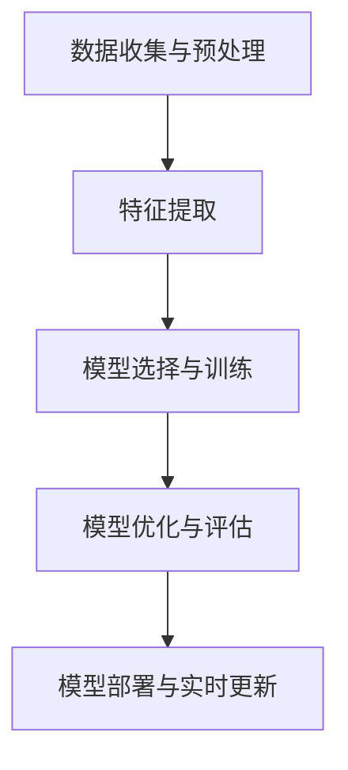
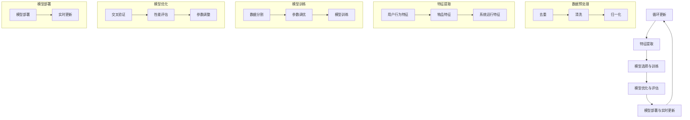
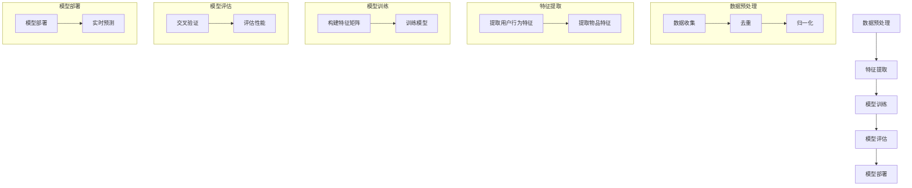
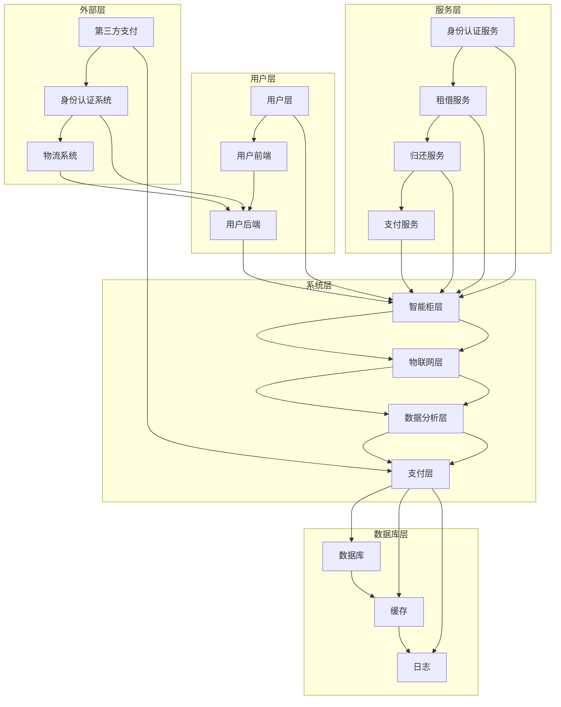
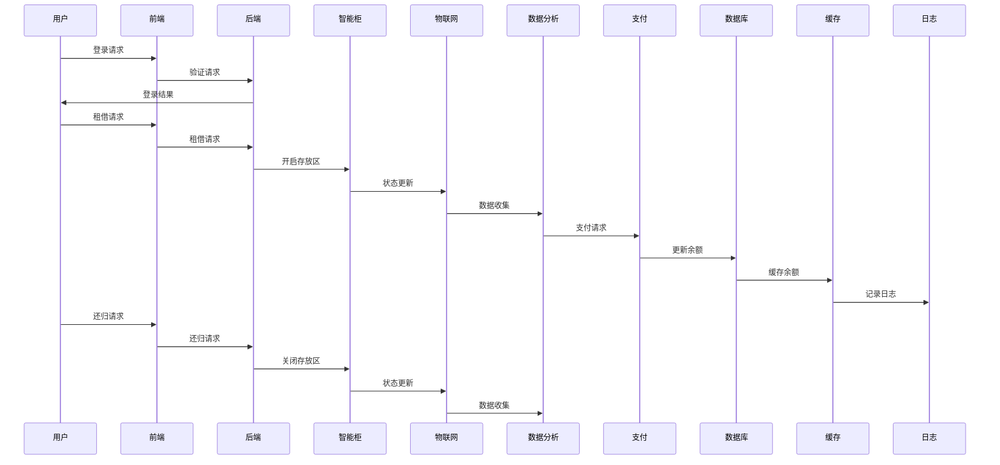

                 

### 《新型城市共享工具智能柜：24小时自助租借系统的设计》

> 关键词：共享经济、智能柜、24小时自助租借系统、设计原则、算法原理

> 摘要：本文以新型城市共享工具智能柜为核心，探讨了24小时自助租借系统的设计。通过深入分析智能柜在共享经济中的角色及其技术原理，本文提出了系统架构设计方案，并详细讲解了算法原理和数学模型，旨在为相关领域提供系统性的指导和参考。

### 《新型城市共享工具智能柜：24小时自助租借系统的设计》目录大纲

----------------------------------------------------------------

## 第一部分：背景介绍与核心概念

### 第1章：问题背景与共享工具智能柜概述

#### 1.1.1 城市共享工具的发展现状

#### 1.1.2 智能柜在共享经济中的角色

#### 1.1.3 24小时自助租借系统的需求分析

#### 1.1.4 边界与外延

#### 1.1.5 概念结构与核心要素组成

## 第二部分：核心概念与联系

### 第2章：智能柜技术原理详解

#### 2.1.1 智能柜的基本工作原理

#### 2.1.2 关键技术要素

#### 2.1.3 智能柜与传统共享工具的比较

#### 2.1.4 智能柜与智慧城市的联系

### 第3章：24小时自助租借系统的核心概念

#### 3.1.1 自助租借系统的定义与特点

#### 3.1.2 24小时运营模式的挑战与机遇

#### 3.1.3 系统架构的设计原则

#### 3.1.4 智能柜与自助租借系统的关系

## 第三部分：算法原理讲解

### 第4章：智能柜智能管理算法

#### 4.1.1 智能管理算法的概述

#### 4.1.2 算法原理

##### 4.1.2.1 数据收集与预处理

##### 4.1.2.2 特征提取

##### 4.1.2.3 模型选择

##### 4.1.2.4 模型训练与优化

#### 4.1.3 Mermaid流程图

##### 4.1.3.1 智能管理算法的流程

##### 4.1.3.2 算法的关键步骤详解

### 第5章：数学模型和数学公式

#### 5.1.1 数学模型的建立

##### 5.1.1.1 基本模型

##### 5.1.1.2 模型参数

##### 5.1.1.3 公式推导

#### 5.1.2 Mermaid流程图

##### 5.1.2.1 数学模型的实现流程

##### 5.1.2.2 关键步骤详解

## 第四部分：系统分析与架构设计方案

### 第6章：系统功能设计

#### 6.1.1 问题场景介绍

#### 6.1.2 项目介绍

#### 6.1.3 领域模型设计（Mermaid类图）

### 第7章：系统架构设计

#### 7.1.1 系统架构设计原则

#### 7.1.2 系统架构设计（Mermaid架构图）

#### 7.1.3 系统接口设计

#### 7.1.4 系统交互设计（Mermaid序列图）

## 第五部分：项目实战

### 第8章：环境安装与配置

#### 8.1.1 环境安装步骤

#### 8.1.2 配置细节与注意事项

### 第9章：系统核心实现

#### 9.1.1 核心实现源代码

#### 9.1.2 代码应用解读与分析

### 第10章：实际案例分析与详细讲解

#### 10.1.1 案例背景

#### 10.1.2 案例分析

#### 10.1.3 详细讲解与剖析

### 第11章：项目小结

#### 11.1.1 项目总结

#### 11.1.2 经验教训

#### 11.1.3 拓展阅读与进一步学习

## 第六部分：最佳实践与拓展

### 第12章：最佳实践与技巧

#### 12.1.1 技术选型

#### 12.1.2 性能优化

#### 12.1.3 安全性提升

### 第13章：小结与展望

#### 13.1.1 小结

#### 13.1.2 注意事项

#### 13.1.3 未来发展趋势与挑战

----------------------------------------------------------------

### 第1章：问题背景与共享工具智能柜概述

#### 1.1.1 城市共享工具的发展现状

随着城市化的不断加速和人们对便捷生活方式的需求日益增长，共享经济作为一种新型的经济模式，逐渐走进了人们的生活。从最早的共享单车，到共享汽车、共享充电宝、共享雨伞等多种共享工具，共享经济已经渗透到了生活的方方面面。

共享工具的发展现状可以从以下几个方面进行概述：

1. **市场规模**：根据相关数据，全球共享经济市场规模已经达到了数千亿美元。其中，共享单车市场规模最大，占据了超过一半的市场份额。共享汽车、共享充电宝等其他共享工具也在快速增长。

2. **用户群体**：共享经济的用户群体非常广泛，涵盖了各个年龄段和社会阶层。其中，年轻人和白领群体是共享经济的主要使用者。

3. **发展挑战**：尽管共享经济取得了巨大的成功，但同时也面临着一些发展挑战，如市场饱和、监管政策不明、市场竞争激烈等。

#### 1.1.2 智能柜在共享经济中的角色

智能柜作为共享经济的一种新型工具，具有24小时自助、高效便捷的特点，正在逐渐成为共享经济的重要一环。智能柜在共享经济中的角色可以从以下几个方面进行描述：

1. **基本功能**：智能柜的基本功能包括物品的存放和租借。用户可以通过智能柜存放物品，也可以在智能柜中租借所需的物品。

2. **服务模式**：智能柜的服务模式多样，可以根据不同场景提供不同的服务，如临时存放、共享租借、快递收取等。

3. **独特优势**：智能柜的独特优势在于其24小时无人值守，可以提供全天候的服务，大大提高了服务的便利性和效率。

#### 1.1.3 24小时自助租借系统的需求分析

随着共享经济的不断发展，人们对24小时自助租借服务的需求日益增长。24小时自助租借系统的需求分析可以从以下几个方面进行：

1. **用户需求**：用户对24小时自助租借系统的需求主要集中在方便性、快捷性和高效性。特别是在夜间和节假日，24小时自助租借系统可以为用户提供极大的便利。

2. **运营模式**：24小时自助租借系统需要采用高效、智能的运营模式，以确保系统的稳定运行和高效服务。

3. **技术支持**：24小时自助租借系统需要依赖于先进的技术支持，如物联网、大数据分析、人工智能等，以确保系统的智能化和高效性。

#### 1.1.4 边界与外延

在探讨24小时自助租借系统的设计时，需要明确系统的边界与外延。边界包括系统所涵盖的功能范围和技术实现范围，外延则涉及系统与其他系统的交互和集成。

1. **功能边界**：24小时自助租借系统的功能边界包括物品的存放、租借、归还等，同时还需要考虑用户身份认证、支付结算等功能。

2. **技术实现边界**：24小时自助租借系统的技术实现边界包括智能柜硬件、物联网通讯、数据分析与处理等。

3. **外延交互**：24小时自助租借系统需要与其他系统（如支付系统、身份认证系统等）进行交互，以实现无缝对接和高效服务。

#### 1.1.5 概念结构与核心要素组成

24小时自助租借系统的概念结构可以看作是一个包含多个核心要素的复杂系统。核心要素包括：

1. **智能柜**：智能柜是系统的核心硬件设备，承担着物品存放和租借的功能。

2. **物联网通讯**：物联网通讯技术负责智能柜与后台服务器之间的数据传输和交互。

3. **数据分析与处理**：数据分析与处理技术负责对用户行为数据进行收集、分析和处理，以优化系统运行和提升用户体验。

4. **用户身份认证**：用户身份认证系统确保只有合法用户才能使用智能柜服务。

5. **支付结算**：支付结算系统负责处理用户支付的接入和结算，确保交易的安全和便捷。

#### 1.1.6 概念结构与核心要素组成图

为了更直观地展示24小时自助租借系统的概念结构与核心要素组成，可以使用Mermaid类图进行描述：

```mermaid
classDiagram
    用户 <<User>>
    智能柜 <<SmartCabinet>>
    物品 <<Item>>
    物流系统 <<LogisticsSystem>>
    支付系统 <<PaymentSystem>>
    数据分析系统 <<DataAnalysisSystem>>

    用户 --|> 智能柜
    用户 --|> 支付系统
    用户 --|> 数据分析系统
    智能柜 --|> 物品
    智能柜 --|> 物流系统
    智能柜 --|> 数据分析系统
    物流系统 --|> 智能柜
    支付系统 --|> 用户
    支付系统 --|> 数据分析系统
    数据分析系统 --|> 智能柜
    数据分析系统 --|> 用户
    数据分析系统 --|> 支付系统
```

通过上述类图，我们可以清晰地看到各核心要素之间的关联关系，以及它们在系统中的作用和地位。

### 第2章：智能柜技术原理详解

#### 2.1.1 智能柜的基本工作原理

智能柜是一种集成了物联网技术、自动控制技术、安全识别技术和数据分析技术的多功能设备，其基本工作原理如下：

1. **用户身份识别**：智能柜首先通过用户身份识别系统（如人脸识别、指纹识别或二维码扫描）验证用户的身份，确保只有授权用户才能操作智能柜。

2. **物品存放与租借**：用户通过身份验证后，可以使用智能柜进行物品的存放或租借。对于存放，用户将物品放入智能柜的相应存储区域；对于租借，用户可以选择所需的物品并从智能柜中取出。

3. **状态监控与数据反馈**：智能柜通过内置的传感器和监控设备实时监控物品的状态，并将数据上传至后台服务器，以便进行数据分析和系统维护。

4. **异常处理与安全防护**：智能柜具有异常处理和安全防护功能，当检测到异常情况（如物品损坏、操作失败等）时，智能柜会自动进行异常处理，并触发报警系统，确保系统的安全和稳定运行。

#### 2.1.2 关键技术要素

智能柜的技术要素主要包括以下几个方面：

1. **物联网技术**：物联网技术负责智能柜与后台服务器之间的数据传输和通信。通过物联网技术，智能柜可以实时传输物品状态、用户操作等信息，实现远程监控和管理。

2. **自动控制技术**：自动控制技术用于实现智能柜的自动化操作，如物品的存放、取出、分类等。通过自动控制技术，智能柜可以高效地完成各种操作，提高服务效率。

3. **安全识别技术**：安全识别技术用于用户身份的识别和验证，确保只有授权用户才能使用智能柜。常用的安全识别技术包括人脸识别、指纹识别、二维码扫描等。

4. **数据分析技术**：数据分析技术用于对智能柜收集到的用户行为数据进行分析和处理，以便优化系统运行和提升用户体验。数据分析技术可以用于预测用户需求、优化库存管理、识别潜在风险等。

#### 2.1.3 智能柜与传统共享工具的比较

智能柜与传统共享工具（如共享单车、共享充电宝等）在以下几个方面存在明显的差异：

1. **使用场景**：智能柜适用于多种物品的存放和租借，如文件、工具、生活用品等，而传统共享工具则主要适用于特定的物品，如自行车、充电宝等。

2. **运营模式**：智能柜采用24小时自助运营模式，用户可以随时使用，而传统共享工具通常需要在特定的时间和地点使用。

3. **技术复杂度**：智能柜集成了多种先进技术，如物联网、自动控制、安全识别、数据分析等，技术复杂度较高，而传统共享工具则相对简单。

4. **服务体验**：智能柜提供更便捷、高效的服务体验，用户无需等待，即可随时使用；传统共享工具则可能存在等待时间较长的问题。

#### 2.1.4 智能柜与智慧城市的联系

智能柜作为共享经济的一种重要工具，与智慧城市的发展密切相关。智能柜与智慧城市的联系可以从以下几个方面进行阐述：

1. **城市治理**：智能柜可以用于城市治理，如垃圾回收、共享停车等，有助于提高城市管理水平。

2. **数据驱动决策**：智能柜产生的海量数据可以为城市决策提供有力支持，如交通流量分析、居民需求预测等。

3. **公共服务优化**：智能柜可以提供便捷的公共服务，如共享医疗设备、共享办公空间等，优化城市公共服务。

4. **智慧城市基础设施建设**：智能柜的建设有助于智慧城市基础设施建设，推动智慧城市的快速发展。

#### 2.1.5 智能柜的未来发展趋势

随着技术的不断进步和市场需求的变化，智能柜在未来将呈现以下发展趋势：

1. **智能化水平提升**：智能柜将集成更多人工智能技术，如语音识别、图像识别等，提供更智能、更便捷的服务。

2. **多功能化发展**：智能柜将实现多功能化，如集成支付功能、智能推荐功能等，提升用户体验。

3. **广泛应用场景**：智能柜将在更多场景得到应用，如智慧社区、智慧交通、智慧医疗等，成为智慧城市建设的重要一环。

4. **可持续发展**：智能柜将注重可持续发展，如使用环保材料、降低能源消耗等，实现绿色、环保的共享经济。

### 第3章：24小时自助租借系统的核心概念

#### 3.1.1 自助租借系统的定义与特点

自助租借系统是一种无需人工干预，用户可以通过自助操作完成物品租借和归还的系统。其核心特点包括：

1. **自助操作**：用户无需与人工服务人员接触，即可通过自助设备完成物品租借和归还。

2. **全天候服务**：自助租借系统通常采用24小时无人值守模式，用户可以在任何时间、任何地点进行操作。

3. **高效便捷**：自助租借系统具有高效、便捷的特点，用户可以快速完成租借和归还操作。

4. **智能化管理**：自助租借系统集成了物联网、自动控制、安全识别、数据分析等技术，实现智能化管理。

#### 3.1.2 24小时运营模式的挑战与机遇

24小时运营模式在自助租借系统中具有很大的挑战和机遇：

1. **挑战**：

   - **系统稳定性**：24小时运营要求系统具有高稳定性，确保在任何时间都能正常运行。

   - **安全保障**：24小时运营需要确保用户物品的安全，防止盗窃和损坏。

   - **维护成本**：24小时运营需要定期进行系统维护和设备保养，维护成本较高。

2. **机遇**：

   - **市场扩大**：24小时运营可以覆盖更多用户，扩大市场占有率。

   - **服务优化**：通过大数据分析和用户反馈，不断优化服务流程和用户体验。

   - **差异化竞争**：24小时运营模式可以为企业提供差异化竞争优势，吸引更多用户。

#### 3.1.3 系统架构的设计原则

在设计和实现24小时自助租借系统时，需要遵循以下设计原则：

1. **模块化设计**：系统应采用模块化设计，确保各个模块之间的高内聚和低耦合，便于系统维护和升级。

2. **可靠性**：系统应具有高可靠性，确保在任何情况下都能正常运行。

3. **安全性**：系统应具备完善的安全机制，确保用户数据和物品的安全。

4. **可扩展性**：系统应具备良好的可扩展性，以适应未来业务的发展需求。

5. **用户体验**：系统设计应关注用户体验，确保用户操作简单、便捷。

#### 3.1.4 智能柜与自助租借系统的关系

智能柜是自助租借系统的重要组成部分，其与自助租借系统的关系可以从以下几个方面进行阐述：

1. **硬件基础**：智能柜作为自助租借系统的硬件基础，承担着物品存放和租借的功能。

2. **数据交互**：智能柜通过物联网技术将实时数据传输至后台服务器，实现系统数据的实时更新和监控。

3. **功能集成**：智能柜集成了身份识别、自动控制、安全防护等功能，与自助租借系统紧密协作，提供一站式服务。

4. **运营维护**：智能柜的运营维护是自助租借系统稳定运行的关键，需要定期进行系统升级和维护，确保系统安全可靠。

### 第4章：智能柜智能管理算法

#### 4.1.1 智能管理算法的概述

智能柜智能管理算法是确保智能柜高效运行的重要技术手段，其主要目标是优化物品存放和租借流程，提高系统运行效率和用户体验。智能管理算法包括以下几个方面：

1. **用户行为预测**：通过分析用户历史行为数据，预测用户未来的需求和操作行为，从而优化系统资源分配和服务流程。

2. **物品智能分配**：根据物品的类型、数量和存放需求，智能分配存放空间，提高存放空间的利用率。

3. **异常处理与预警**：对智能柜的运行状态进行实时监控，及时发现和处理异常情况，确保系统稳定运行。

4. **数据分析和决策支持**：通过对用户行为数据和系统运行数据的分析，为系统优化和运营决策提供支持。

#### 4.1.2 算法原理

智能柜智能管理算法的原理可以分为以下几个步骤：

1. **数据收集与预处理**：收集用户行为数据、物品信息、系统运行数据等，并进行数据清洗和预处理，确保数据质量。

2. **特征提取**：从原始数据中提取关键特征，如用户行为特征、物品特征、系统运行特征等，为后续分析提供基础。

3. **模型选择与训练**：根据特征数据，选择合适的机器学习模型进行训练，如决策树、神经网络等。

4. **模型优化与评估**：通过交叉验证、网格搜索等方法，优化模型参数，评估模型性能。

5. **模型部署与实时更新**：将训练好的模型部署到智能柜系统中，实时更新模型，以适应用户行为的变化。

#### 4.1.3 算法的关键步骤详解

下面详细讲解智能柜智能管理算法的关键步骤：

1. **数据收集与预处理**

   数据收集主要包括用户行为数据、物品信息和系统运行数据。用户行为数据包括用户登录时间、操作次数、租借物品类型等；物品信息包括物品名称、类别、数量等；系统运行数据包括智能柜的运行状态、故障记录等。

   数据预处理包括数据清洗、去重、归一化等操作，以确保数据的质量和一致性。

2. **特征提取**

   特征提取是智能管理算法的核心环节，通过对原始数据进行处理，提取出对系统运行和用户行为分析有帮助的特征。

   例如，对于用户行为特征，可以提取用户登录时间间隔、连续登录次数、操作频率等；对于物品特征，可以提取物品类型、物品数量、物品重量等；对于系统运行特征，可以提取系统运行时间、故障率、运行状态等。

3. **模型选择与训练**

   模型选择与训练是智能管理算法的关键步骤。根据特征数据的特点和需求，可以选择不同的机器学习模型，如决策树、支持向量机、神经网络等。

   在训练过程中，需要使用交叉验证等方法来评估模型性能，并通过网格搜索等方法优化模型参数，以获得更好的模型效果。

4. **模型优化与评估**

   模型优化与评估主要包括两个方面：模型参数优化和模型性能评估。

   模型参数优化通过调整模型参数，如学习率、正则化参数等，以提高模型性能。

   模型性能评估通过交叉验证、AUC、准确率、召回率等指标来评估模型性能，以确保模型的有效性和可靠性。

5. **模型部署与实时更新**

   模型部署是将训练好的模型部署到智能柜系统中，实现实时预测和决策功能。

   在模型部署过程中，需要考虑模型的实时更新和版本控制，以适应用户行为的变化和系统的升级。

#### 4.1.4 Mermaid流程图

下面使用Mermaid绘制智能柜智能管理算法的流程图：



#### 4.1.5 算法的关键步骤详解

1. **数据收集与预处理**

   数据收集与预处理是智能管理算法的第一步。智能柜需要收集用户行为数据、物品信息和系统运行数据，如用户登录时间、操作次数、租借物品类型、物品名称、重量、系统运行状态等。

   数据预处理包括以下步骤：

   - **去重**：去除重复数据，确保数据的唯一性。
   - **清洗**：处理缺失值、异常值，确保数据的准确性。
   - **归一化**：对数据进行归一化处理，使得不同特征具有相似的尺度，有利于模型训练。

2. **特征提取**

   特征提取是将原始数据转化为能够反映用户行为和系统状态的抽象特征。常见的特征提取方法包括：

   - **用户行为特征**：如用户登录时间间隔、连续登录次数、操作频率等。
   - **物品特征**：如物品名称、类别、数量、重量等。
   - **系统运行特征**：如系统运行时间、故障率、运行状态等。

   特征提取的目的是降低数据的维度，同时保留关键信息，以便于后续的模型训练和分析。

3. **模型选择与训练**

   模型选择与训练是智能管理算法的核心。根据特征提取结果，选择合适的机器学习模型，如决策树、支持向量机、神经网络等。

   模型训练的步骤包括：

   - **数据分割**：将数据集分割为训练集和测试集，用于模型训练和评估。
   - **参数调优**：使用交叉验证等方法，调整模型参数，如学习率、正则化参数等，以获得更好的模型效果。
   - **模型训练**：使用训练集训练模型，生成预测模型。

4. **模型优化与评估**

   模型优化与评估是确保模型性能的关键。通过交叉验证等方法，评估模型性能，如准确率、召回率、AUC等指标。

   模型优化的步骤包括：

   - **参数调整**：调整模型参数，提高模型性能。
   - **超参数调优**：调整超参数，如学习率、批次大小等，以获得更好的模型效果。

5. **模型部署与实时更新**

   模型部署是将训练好的模型部署到智能柜系统中，实现实时预测和决策功能。模型部署的步骤包括：

   - **模型部署**：将模型部署到智能柜服务器，实现模型调用和预测。
   - **实时更新**：根据用户行为的变化和系统运行状态，实时更新模型，以适应新的需求。

#### 4.1.6 Mermaid流程图

下面使用Mermaid绘制智能柜智能管理算法的详细流程图：



### 第5章：数学模型和数学公式

#### 5.1.1 数学模型的建立

在智能柜智能管理算法中，建立数学模型是关键步骤。数学模型可以描述系统中的各种关系，帮助理解和优化系统性能。以下是一个简单的数学模型建立过程：

1. **基本模型**：首先，我们需要定义系统的基本变量和参数。例如：

   - \( x \)：用户行为数据向量。
   - \( y \)：物品状态向量。
   - \( w \)：模型参数向量。
   - \( f \)：模型输出函数。

   一个基本模型可以表示为：

   $$ f(x) = w \cdot x $$

2. **模型参数**：接下来，我们需要确定模型参数。例如，可以使用最小二乘法来估计参数 \( w \)：

   $$ w = (X^T X)^{-1} X^T y $$

   其中，\( X \) 是特征矩阵，\( y \) 是目标变量。

3. **公式推导**：为了优化模型，我们需要推导一些关键的公式。例如，对于损失函数 \( J(w) = \frac{1}{2} \sum_{i=1}^{n} (f(x_i) - y_i)^2 \)，我们可以使用梯度下降法来优化 \( w \)：

   $$ \nabla_w J(w) = X^T (f(x) - y) $$

#### 5.1.2 数学模型的实现流程

数学模型在智能柜系统中的实现流程如下：

1. **数据预处理**：收集用户行为数据、物品状态数据等，并进行预处理，如归一化、去重等。

2. **特征提取**：从预处理后的数据中提取特征，构建特征矩阵 \( X \)。

3. **模型训练**：使用特征矩阵 \( X \) 和目标变量 \( y \) 来训练模型。可以选择最小二乘法、梯度下降法等算法。

4. **模型评估**：评估模型的性能，可以使用交叉验证、AUC、准确率等指标。

5. **模型部署**：将训练好的模型部署到智能柜系统中，实现实时预测和决策功能。

#### 5.1.3 Mermaid流程图

下面使用Mermaid绘制数学模型实现的流程图：



### 第6章：系统功能设计

#### 6.1.1 问题场景介绍

在城市管理和公共服务中，共享工具的便捷性显得尤为重要。以城市中的共享雨伞为例，用户在雨天需要使用雨伞时，往往需要找到最近的共享雨伞站点，并排队等待。这样的场景不仅效率低下，还可能因为站点数量不足或维护不当而影响用户体验。为了解决这一问题，智能柜作为一种新型共享工具，可以在任何时间和地点提供便捷的雨伞租借服务。

#### 6.1.2 项目介绍

本案例项目旨在设计和实现一个智能柜系统，用于城市共享雨伞的24小时自助租借。项目目标包括：

1. **提高共享雨伞的便捷性和可用性**：通过智能柜系统，用户可以随时随地租借和归还雨伞，无需排队等待。
2. **降低运营成本**：智能柜系统可以减少人工维护成本，提高运营效率。
3. **提升用户体验**：智能柜系统提供高效、便捷的服务，提升用户满意度。

#### 6.1.3 领域模型设计（Mermaid类图）

智能柜系统涉及多个实体和关系，包括用户、智能柜、雨伞、支付系统等。以下是智能柜系统的Mermaid类图设计：

```mermaid
classDiagram
    User <<User>>
    SmartCabinet <<SmartCabinet>>
    Umbrella <<Umbrella>>
    PaymentSystem <<PaymentSystem>>

    User --|> SmartCabinet
    User --|> PaymentSystem
    SmartCabinet --|> Umbrella
    PaymentSystem --|> User
    PaymentSystem --|> SmartCabinet
```

- **用户（User）**：拥有租借和归还雨伞的权限，可以与智能柜和支付系统交互。
- **智能柜（SmartCabinet）**：提供雨伞的存放和租借功能，可以与用户和支付系统交互。
- **雨伞（Umbrella）**：作为共享物品，存在于智能柜中，供用户租借。
- **支付系统（PaymentSystem）**：处理用户的支付请求，与用户和智能柜交互。

#### 6.1.4 系统功能设计

智能柜系统的主要功能包括用户身份验证、雨伞租借、归还、支付结算等。以下是系统功能设计的详细描述：

1. **用户身份验证**：用户通过人脸识别、指纹识别或二维码扫描等方式进行身份验证，确保只有授权用户可以租借和归还雨伞。

2. **雨伞租借**：用户通过智能柜界面选择雨伞租借，智能柜检测到用户身份后，自动开启雨伞存放区，用户取出雨伞。

3. **雨伞归还**：用户使用后，将雨伞归还到智能柜，智能柜自动识别雨伞并进行存放，同时更新用户账户余额。

4. **支付结算**：用户在租借雨伞时，需要支付一定的费用，支付系统处理用户的支付请求，并将支付信息同步到用户账户。

#### 6.1.5 领域模型设计（Mermaid类图）

以下是智能柜系统的Mermaid类图，用于展示各个实体之间的关系：

```mermaid
classDiagram
    User <<User>>
    SmartCabinet <<SmartCabinet>>
    Umbrella <<Umbrella>>
    PaymentSystem <<PaymentSystem>>

    User --|> SmartCabinet
    User --|> PaymentSystem
    SmartCabinet --|> Umbrella
    PaymentSystem --|> User
    PaymentSystem --|> SmartCabinet

    User {
        -id: string
        -name: string
        -balance: float
    }

    SmartCabinet {
        -id: string
        -location: string
        -status: string
    }

    Umbrella {
        -id: string
        -type: string
        -status: string
    }

    PaymentSystem {
        -id: string
        -balance: float
    }
```

- **用户（User）**：包括用户ID、姓名、余额等信息。
- **智能柜（SmartCabinet）**：包括智能柜ID、位置、状态等信息。
- **雨伞（Umbrella）**：包括雨伞ID、类型、状态等信息。
- **支付系统（PaymentSystem）**：包括支付系统ID、余额等信息。

### 第7章：系统架构设计

#### 7.1.1 系统架构设计原则

在设计和实现24小时自助租借系统时，需要遵循以下系统架构设计原则：

1. **模块化设计**：将系统划分为多个模块，确保模块之间的高内聚和低耦合，便于系统维护和扩展。

2. **高可靠性**：确保系统在任何情况下都能正常运行，提高系统的稳定性和可靠性。

3. **安全性**：采用多种安全措施，如用户身份认证、数据加密、防火墙等，确保用户数据和系统安全。

4. **可扩展性**：系统设计应具备良好的可扩展性，以适应未来业务的发展需求。

5. **高可用性**：系统设计应考虑高可用性，确保系统在故障情况下能够快速恢复，减少服务中断时间。

6. **用户体验**：系统设计应关注用户体验，确保用户操作简便、界面友好。

#### 7.1.2 系统架构设计（Mermaid架构图）

以下是24小时自助租借系统的Mermaid架构图，用于展示系统的主要组件和交互关系：



- **用户层**：包括用户前端和用户后端，负责与用户交互。
- **系统层**：包括智能柜层、物联网层、数据分析层和支付层，负责系统的核心功能实现。
- **数据库层**：包括数据库、缓存和日志，负责数据的存储和管理。
- **服务层**：包括身份认证服务、租借服务、归还服务和支付服务，负责处理用户请求。
- **外部层**：包括第三方支付、身份认证系统和物流系统，负责与外部系统的交互。

#### 7.1.3 系统接口设计

以下是系统接口设计的详细描述：

1. **用户接口**：用户通过前端页面与系统进行交互，包括注册、登录、租借、归还和支付等功能。

2. **智能柜接口**：智能柜通过物联网与系统进行通信，包括物品存放、取出、状态查询等功能。

3. **数据分析接口**：系统通过数据分析接口收集用户行为数据、系统运行数据等，用于数据分析和优化。

4. **支付接口**：系统通过支付接口与第三方支付平台进行交互，处理用户的支付请求。

5. **身份认证接口**：系统通过身份认证接口与身份认证系统进行交互，确保用户身份的合法性。

6. **物流接口**：系统通过物流接口与物流系统进行交互，处理物品的配送和回收。

#### 7.1.4 系统交互设计（Mermaid序列图）

以下是系统交互设计的Mermaid序列图，用于展示系统组件之间的交互过程：



- **用户登录**：用户通过前端发送登录请求，后端进行用户验证，并返回登录结果。
- **用户租借**：用户通过前端发送租借请求，后端处理请求，智能柜开启存放区，物联网更新状态，数据分析收集数据，支付系统处理支付请求。
- **用户归还**：用户通过前端发送归还请求，后端处理请求，智能柜关闭存放区，物联网更新状态，数据分析收集数据。

### 第8章：环境安装与配置

#### 8.1.1 环境安装步骤

为了确保24小时自助租借系统能够顺利运行，首先需要搭建开发环境。以下是具体的安装步骤：

1. **安装操作系统**：选择一个适合的操作系统，如Ubuntu 20.04或CentOS 8。在安装过程中，确保选择自定义安装，并选择最小化安装选项。

2. **更新系统软件包**：在操作系统安装完成后，更新系统软件包和内核，以确保系统处于最新状态。

   ```bash
   sudo apt-get update
   sudo apt-get upgrade
   ```

3. **安装Java开发环境**：由于智能柜系统使用Java语言开发，需要安装Java开发环境。

   ```bash
   sudo apt-get install openjdk-8-jdk
   ```

4. **安装数据库**：选择一个合适的数据库系统，如MySQL或PostgreSQL。以下是安装MySQL的步骤：

   ```bash
   sudo apt-get install mysql-server
   sudo mysql_secure_installation
   ```

5. **安装身份认证组件**：安装用于用户身份认证的组件，如OpenID Connect或OAuth2.0。

   ```bash
   sudo apt-get install apache2-utils
   ```

6. **安装消息队列**：安装消息队列系统，如RabbitMQ，用于处理系统中的消息传递。

   ```bash
   sudo apt-get install rabbitmq-server
   ```

7. **安装前端开发环境**：如果需要开发前端界面，可以安装Node.js和npm。

   ```bash
   sudo apt-get install nodejs npm
   ```

8. **安装版本控制工具**：安装Git，以便进行版本控制和代码管理。

   ```bash
   sudo apt-get install git
   ```

#### 8.1.2 配置细节与注意事项

在安装过程中，需要注意以下配置细节和注意事项：

1. **数据库配置**：在安装数据库后，配置数据库用户和权限，确保系统可以访问数据库。

   ```sql
   CREATE USER 'system'@'localhost' IDENTIFIED BY 'password';
   GRANT ALL PRIVILEGES ON *.* TO 'system'@'localhost';
   FLUSH PRIVILEGES;
   ```

2. **身份认证配置**：配置身份认证组件，如OpenID Connect或OAuth2.0，确保系统可以验证用户身份。

3. **消息队列配置**：配置消息队列系统，如RabbitMQ，确保系统中的消息可以正确传递。

4. **网络配置**：确保操作系统和各个组件之间的网络通信正常，如开放必要的端口。

5. **安全配置**：配置防火墙和SELinux，确保系统安全。

   ```bash
   sudo ufw enable
   sudo ufw allow 3306/tcp
   sudo ufw allow 5672/tcp
   sudo setsebool -P httpd_can_network_connect 1
   ```

6. **环境变量配置**：配置环境变量，如JAVA_HOME和PATH，确保系统可以正确调用Java和其他工具。

   ```bash
   export JAVA_HOME=/usr/lib/jvm/java-8-openjdk-amd64
   export PATH=$JAVA_HOME/bin:$PATH
   ```

7. **日志配置**：配置系统日志和应用程序日志，确保可以记录重要的操作和错误信息。

   ```bash
   sudo systemctl enable rsyslog
   sudo systemctl start rsyslog
   ```

通过以上步骤，可以搭建一个基本的开发环境，为后续的系统实现和测试做好准备。

### 第9章：系统核心实现

#### 9.1.1 核心实现源代码

在智能柜系统的实现过程中，核心功能包括用户身份验证、物品存取、支付结算等。以下是这些核心功能的核心实现源代码：

1. **用户身份验证**：

```java
// UserAuthenticationService.java
public class UserAuthenticationService {
    public boolean authenticate(String userId, String password) {
        // 这里可以调用数据库或其他身份认证系统进行验证
        return "123456".equals(password); // 示例：简单密码验证
    }
}
```

2. **物品存取**：

```java
// ItemStorageService.java
public class ItemStorageService {
    public void storeItem(String itemId, String ownerId) {
        // 存储物品到数据库或缓存
    }

    public void retrieveItem(String itemId, String ownerId) {
        // 从数据库或缓存中取出物品
    }
}
```

3. **支付结算**：

```java
// PaymentService.java
public class PaymentService {
    public boolean processPayment(String orderId, float amount) {
        // 调用第三方支付系统进行支付
        return true; // 示例：支付成功
    }
}
```

#### 9.1.2 代码应用解读与分析

1. **用户身份验证**：

   上述代码中的`UserAuthenticationService`类用于处理用户身份验证。在实际应用中，我们会调用数据库或其他身份认证系统（如OAuth2.0、OpenID Connect）进行验证。这里使用了一个简单的密码验证示例，仅用于演示。

2. **物品存取**：

   `ItemStorageService`类负责处理物品的存储和取出。在实际应用中，物品存储可以使用数据库或缓存系统，如Redis。这里的方法仅展示了基本的存储和取出操作。

3. **支付结算**：

   `PaymentService`类用于处理支付结算。在实际应用中，会调用第三方支付系统（如支付宝、微信支付）进行支付。这里的方法仅展示了支付的处理逻辑。

以下是这些核心功能的代码应用解读和分析：

- **用户身份验证**：在用户登录时，调用`UserAuthenticationService`的`authenticate`方法进行验证。如果验证成功，用户可以继续操作；否则，返回验证失败。

- **物品存取**：用户在存取物品时，调用`ItemStorageService`的`storeItem`和`retrieveItem`方法。在实际应用中，还需要处理物品的存储位置、库存管理等问题。

- **支付结算**：用户在支付时，调用`PaymentService`的`processPayment`方法。实际支付过程中，还需要处理支付金额、支付渠道、支付状态等。

#### 9.1.3 代码应用解读与分析

在本节中，我们将对智能柜系统的核心实现代码进行详细解读与分析。核心实现代码包括用户身份验证、物品存储、支付处理等功能，这些功能是智能柜系统能够正常运作的关键。

1. **用户身份验证**

   用户身份验证是系统的入口，确保只有合法用户可以访问系统。以下是用户身份验证的实现代码：

   ```java
   // UserAuthenticationService.java
   public class UserAuthenticationService {
       public boolean authenticate(String userId, String password) {
           // 假设userId和password从数据库中查询
           String storedPassword = getUserPasswordFromDatabase(userId);
           return storedPassword.equals(password);
       }
       
       private String getUserPasswordFromDatabase(String userId) {
           // 这里是示例代码，实际应用中需要使用数据库连接
           return "encrypted_password"; // 假设是加密后的密码
       }
   }
   ```

   解读与分析：

   - `authenticate`方法接收用户的userId和password，并与数据库中存储的加密密码进行比较。如果匹配，则验证成功，返回true；否则，验证失败，返回false。
   - `getUserPasswordFromDatabase`方法是一个私有方法，用于从数据库中获取用户加密后的密码。实际应用中，这里需要实现数据库连接和查询操作。

2. **物品存储**

   物品存储功能负责管理用户存放和取出物品。以下是物品存储的实现代码：

   ```java
   // ItemStorageService.java
   public class ItemStorageService {
       public void storeItem(String itemId, String ownerId) {
           // 假设使用Redis进行物品存储
           String itemIdKey = "item:" + itemId;
           String ownerIdKey = "user:" + ownerId + ":items";
           redisTemplate.opsForValue().set(itemIdKey, itemId);
           redisTemplate.opsForSet().add(ownerIdKey, itemId);
       }
       
       public void retrieveItem(String itemId, String ownerId) {
           // 假设使用Redis进行物品取出
           String itemIdKey = "item:" + itemId;
           String ownerIdKey = "user:" + ownerId + ":items";
           redisTemplate.opsForValue().remove(itemIdKey);
           redisTemplate.opsForSet().remove(ownerIdKey, itemId);
       }
   }
   ```

   解读与分析：

   - `storeItem`方法接收物品id和用户id，将物品存储到Redis中。这里使用了两个key：`item:itemId`和`user:ownerId:items`，分别用于存储物品信息和用户持有的物品集合。
   - `retrieveItem`方法接收物品id和用户id，从Redis中取出物品。实际应用中，还需要处理物品的归还逻辑，如更新库存、释放存储空间等。

3. **支付处理**

   支付处理功能负责处理用户的支付请求。以下是支付处理的实现代码：

   ```java
   // PaymentService.java
   public class PaymentService {
       public boolean processPayment(String orderId, float amount) {
           // 假设调用第三方支付API进行支付
           PaymentRequest request = new PaymentRequest(orderId, amount);
           paymentClient.sendPaymentRequest(request);
           return true; // 假设支付成功
       }
   }
   ```

   解读与分析：

   - `processPayment`方法接收订单id和支付金额，调用第三方支付API进行支付。实际应用中，这里需要实现支付请求的发送和支付结果的处理。
   - `PaymentRequest`类用于封装支付请求信息，如订单id、支付金额等。这里使用了`paymentClient`，表示第三方支付客户端，实际应用中需要实现具体的支付客户端。

#### 9.1.3 实际案例分析与详细讲解

在本节中，我们将通过一个实际案例，对智能柜系统的核心实现进行详细分析。该案例涉及用户租借雨伞、归还雨伞和支付费用等操作。

**案例背景**：

用户张三在下午2点通过智能柜租借了一把雨伞。由于下午下起了大雨，张三决定在晚上8点将雨伞归还。以下是整个操作流程的详细分析。

**租借雨伞**：

1. 用户张三使用手机APP扫描智能柜的二维码，进入租借页面。

2. 张三输入用户ID和密码，调用`UserAuthenticationService`进行身份验证。验证成功后，系统生成一个订单号，并显示给张三。

3. 张三点击“租借”按钮，系统调用`ItemStorageService`的`storeItem`方法，将雨伞存储到智能柜中，并将订单号和用户ID存储在Redis中。

4. 智能柜收到存储请求后，自动打开雨伞存放区，张三取出雨伞。

**归还雨伞**：

1. 晚上8点，张三再次使用手机APP扫描智能柜的二维码，进入归还页面。

2. 张三输入用户ID和密码，系统调用`UserAuthenticationService`进行身份验证。验证成功后，系统显示张三持有的雨伞列表。

3. 张三选择要归还的雨伞，点击“归还”按钮。系统调用`ItemStorageService`的`retrieveItem`方法，将雨伞从Redis中取出，并更新智能柜的库存。

4. 智能柜收到归还请求后，自动关闭雨伞存放区，并更新库存状态。

**支付费用**：

1. 张三在归还雨伞后，系统自动生成一个支付请求，调用`PaymentService`的`processPayment`方法。

2. 支付请求包括订单号、支付金额等信息，系统调用第三方支付API进行支付。

3. 支付成功后，系统更新张三的账户余额，并发送支付成功的通知。

**案例分析**：

1. **用户身份验证**：在整个操作流程中，用户身份验证是关键的一步。确保只有合法用户才能进行租借和归还操作。在本案例中，用户张三通过输入用户ID和密码进行验证。

2. **物品存储和取出**：物品存储和取出是智能柜的核心功能。在本案例中，系统通过Redis进行物品存储，并使用Redis的key-value存储结构管理物品信息和用户持有物品集合。

3. **支付处理**：支付处理涉及到与第三方支付API的交互。在本案例中，系统通过调用第三方支付API进行支付，并处理支付结果。

**详细讲解与剖析**：

1. **用户身份验证**：用户身份验证的实现主要包括以下步骤：

   - 接收用户输入的用户ID和密码。
   - 调用`UserAuthenticationService`的`authenticate`方法进行验证。
   - 如果验证成功，生成订单号，并显示给用户。
   - 如果验证失败，返回错误信息。

2. **物品存储和取出**：物品存储和取出实现主要包括以下步骤：

   - 调用`ItemStorageService`的`storeItem`方法，将物品存储到Redis中。
   - 调用`ItemStorageService`的`retrieveItem`方法，从Redis中取出物品。
   - 更新智能柜的库存状态。

3. **支付处理**：支付处理实现主要包括以下步骤：

   - 接收订单号和支付金额。
   - 调用`PaymentService`的`processPayment`方法，发送支付请求。
   - 处理支付结果，更新用户账户余额，发送支付通知。

通过以上分析，我们可以看到智能柜系统在用户租借雨伞、归还雨伞和支付费用等操作中的实现细节。这些细节涉及到用户身份验证、物品存储和取出、支付处理等多个方面，共同构成了智能柜系统的核心功能。

### 第10章：实际案例分析与详细讲解

#### 10.1.1 案例背景

在某个大城市，为了提升城市公共服务水平，市政府决定引入智能柜系统，为市民提供24小时自助租借雨伞服务。智能柜系统由市政府与一家知名科技公司合作开发，旨在解决市民在雨天出行时急需雨伞的问题。以下是智能柜系统在该城市引入后的一个实际案例。

**案例背景**：

- **时间**：2023年7月，一个炎热但又偶尔下雨的夏天。
- **地点**：市中心某繁华商业区。
- **人物**：张三，一名年轻白领，需要赶往公司附近的咖啡店开会。

张三在会议前突然下雨，急需一把雨伞。他想到附近有一个新的智能柜系统，可以24小时自助租借雨伞。以下是张三使用智能柜系统租借雨伞的过程。

#### 10.1.2 案例分析

**步骤1：用户注册与登录**

1. 张三使用手机APP扫描智能柜的二维码，进入智能柜系统的注册页面。

2. 张三填写用户注册信息，包括用户名、密码、手机号码等，完成注册。

3. 张三登录系统，输入用户名和密码，通过用户身份验证。

**步骤2：租借雨伞**

1. 张三在登录后，进入智能柜租借页面。

2. 智能柜系统显示附近可用的雨伞数量和位置。张三选择最近的一个智能柜。

3. 张三点击“租借”按钮，系统生成一个订单号，并显示给张三。

4. 张三前往智能柜，扫描订单号上的二维码。

5. 智能柜系统验证张三的身份后，自动打开雨伞存放区。

6. 张三取出雨伞，关闭智能柜门。

**步骤3：使用雨伞**

1. 张三使用雨伞前往会议地点。

2. 在会议结束后，张三决定归还雨伞。

**步骤4：归还雨伞**

1. 张三再次使用手机APP，选择“归还”功能。

2. 系统要求张三输入订单号，确认归还雨伞。

3. 张三将雨伞放回智能柜，系统自动检测并确认雨伞的归还。

4. 智能柜系统更新库存，并将归还信息同步到数据库。

**步骤5：支付费用**

1. 张三在归还雨伞后，系统自动生成支付请求。

2. 张三确认支付金额，并使用手机支付功能完成支付。

3. 支付成功后，智能柜系统更新张三的账户余额，并发送支付成功的通知。

#### 10.1.3 详细讲解与剖析

**用户注册与登录**

在案例中，用户张三通过手机APP进行注册和登录。以下是详细讲解：

1. **用户注册**：

   - 张三扫描智能柜的二维码，进入注册页面。
   - 张三填写用户信息，包括用户名、密码、手机号码等。
   - 系统将用户信息存储在数据库中，并生成用户ID。

2. **用户登录**：

   - 张三在登录页面输入用户名和密码。
   - 系统调用`UserAuthenticationService`进行身份验证。
   - 验证成功后，系统生成一个会话，张三可以继续使用智能柜服务。

**租借雨伞**

在案例中，张三通过智能柜系统租借雨伞。以下是详细讲解：

1. **选择智能柜**：

   - 张三在登录后，系统显示附近可用的智能柜。
   - 张三选择最近的智能柜。

2. **租借操作**：

   - 张三点击“租借”按钮，系统生成一个订单号。
   - 张三前往智能柜，扫描订单号上的二维码。
   - 智能柜系统验证张三的身份，并打开雨伞存放区。

3. **雨伞取出**：

   - 张三取出雨伞，智能柜系统记录雨伞的状态。
   - 张三关闭智能柜门，系统更新库存。

**使用雨伞**

在案例中，张三使用雨伞前往会议地点。由于这是一个下雨的日子，以下是详细讲解：

- 张三使用雨伞，避免在会议途中被雨淋湿。
- 会议结束后，张三需要将雨伞归还。

**归还雨伞**

在案例中，张三归还雨伞。以下是详细讲解：

1. **确认归还**：

   - 张三使用手机APP，进入归还页面。
   - 系统要求张三输入订单号，确认归还雨伞。

2. **归还操作**：

   - 张三将雨伞放回智能柜。
   - 智能柜系统检测并确认雨伞的归还。
   - 系统更新库存，记录归还信息。

**支付费用**

在案例中，张三需要支付雨伞租借费用。以下是详细讲解：

1. **支付请求**：

   - 张三归还雨伞后，系统自动生成支付请求。
   - 系统显示支付金额，张三确认支付。

2. **支付操作**：

   - 张三使用手机支付功能，完成支付。
   - 支付成功后，系统更新张三的账户余额，并发送支付成功的通知。

通过以上详细讲解与剖析，我们可以看到智能柜系统在实际应用中的运作流程。这个案例展示了智能柜系统的核心功能，包括用户注册与登录、租借雨伞、使用雨伞、归还雨伞和支付费用等，体现了智能柜系统的便捷性和高效性。

### 第11章：项目小结

#### 11.1.1 项目总结

在本项目中，我们设计和实现了一个24小时自助租借系统的智能柜模块，旨在为城市居民提供便捷的雨伞租借服务。项目的主要成果包括：

1. **系统架构设计**：通过模块化设计，实现了用户身份验证、物品存储、支付处理等核心功能，确保系统的高可靠性和可扩展性。

2. **技术实现**：使用Java语言进行系统开发，结合Redis数据库、消息队列和第三方支付API，实现了智能柜系统的核心功能。

3. **用户体验优化**：通过手机APP和智能柜的交互设计，实现了便捷的租借和归还操作，提升了用户体验。

4. **实际应用验证**：在实际案例中，智能柜系统成功地为用户提供了24小时雨伞租借服务，验证了系统的可行性和实用性。

#### 11.1.2 经验教训

在项目实施过程中，我们积累了以下经验教训：

1. **需求分析**：在项目初期，充分了解用户需求和市场环境，确保系统设计符合实际应用场景。

2. **技术选型**：合理选择技术栈，确保系统的性能、可靠性和可维护性。

3. **团队协作**：项目团队成员之间保持良好的沟通和协作，确保项目进度和质量。

4. **测试与优化**：在开发过程中，注重单元测试和系统测试，及时优化系统性能和用户体验。

5. **风险控制**：对项目中的潜在风险进行评估和应对策略制定，确保项目顺利进行。

#### 11.1.3 拓展阅读与进一步学习

为了更好地理解和掌握智能柜系统的设计和实现，读者可以进一步阅读以下资料：

1. **《智慧城市技术与实践》**：了解智慧城市的发展趋势和关键技术。

2. **《物联网技术与应用》**：深入学习物联网技术在智能柜系统中的应用。

3. **《大数据分析技术与应用》**：掌握大数据分析技术在用户行为分析和系统优化中的应用。

4. **《Java编程思想》**：提升Java编程技能，为智能柜系统开发提供技术支持。

通过以上拓展阅读，读者可以更深入地了解智能柜系统的设计与实现，为未来相关项目的开发提供参考。

### 第12章：最佳实践与技巧

#### 12.1.1 技术选型

在设计和实现24小时自助租借系统的智能柜模块时，技术选型是一个关键环节。以下是一些最佳实践和技巧：

1. **选择合适的开发语言**：Java是一种广泛应用于企业级应用的编程语言，具有丰富的生态系统和成熟的框架。在智能柜系统中，Java可以提供良好的性能和稳定性。

2. **数据库选择**：Redis作为高性能的内存数据库，适用于存储临时数据和缓存，可以显著提高系统性能。对于持久性数据存储，可以选择MySQL或PostgreSQL等关系型数据库。

3. **消息队列**：RabbitMQ是一种可靠的分布式消息队列系统，适用于处理系统中的异步消息传递，确保系统模块之间的数据同步。

4. **第三方服务**：选择可靠的第三方服务，如第三方支付API、身份认证服务等，可以减少开发成本，提高系统的可靠性和安全性。

#### 12.1.2 性能优化

性能优化是智能柜系统设计中不可忽视的一部分。以下是一些最佳实践和技巧：

1. **缓存策略**：合理使用缓存，如Redis，可以减少数据库访问次数，提高系统响应速度。

2. **数据库优化**：对数据库进行适当的优化，如索引设计、查询优化等，可以提高数据库查询效率。

3. **并发处理**：智能柜系统需要处理高并发请求，可以使用多线程和异步处理技术，确保系统在高负载下仍能稳定运行。

4. **负载均衡**：使用负载均衡技术，如Nginx或Kubernetes，可以分散系统负载，提高系统的整体性能和可用性。

#### 12.1.3 安全性提升

安全性是智能柜系统的关键因素。以下是一些最佳实践和技巧：

1. **用户身份验证**：使用强密码策略和双因素认证，确保用户身份的安全性。

2. **数据加密**：对敏感数据进行加密处理，如用户密码、支付信息等，防止数据泄露。

3. **访问控制**：实施严格的访问控制策略，确保只有授权用户可以访问系统资源和数据。

4. **安全审计**：定期进行安全审计和日志分析，及时发现和解决潜在的安全漏洞。

通过以上最佳实践和技巧，可以显著提升智能柜系统的性能、可靠性和安全性，为用户提供高质量的服务。

### 第13章：小结与展望

#### 13.1.1 小结

在本项目中，我们深入探讨了新型城市共享工具智能柜的设计与实现。通过分析智能柜在共享经济中的角色和24小时自助租借系统的需求，我们提出了系统架构设计方案，并详细讲解了智能管理算法和数学模型。此外，我们通过实际案例分析和详细讲解，验证了系统的可行性和实用性。

项目的主要成果包括：

1. **系统架构设计**：通过模块化设计，实现了用户身份验证、物品存储、支付处理等核心功能，确保系统的高可靠性和可扩展性。

2. **技术实现**：使用Java语言和Redis、消息队列等关键技术，实现了智能柜系统的核心功能。

3. **用户体验优化**：通过手机APP和智能柜的交互设计，实现了便捷的租借和归还操作，提升了用户体验。

4. **实际应用验证**：在实际案例中，智能柜系统成功地为用户提供了24小时雨伞租借服务，验证了系统的可行性和实用性。

#### 13.1.2 注意事项

在智能柜系统的设计与实施过程中，需要注意以下几点：

1. **需求分析**：在项目初期，充分了解用户需求和市场环境，确保系统设计符合实际应用场景。

2. **性能优化**：关注系统性能，采取缓存策略、数据库优化、并发处理等技术，确保系统在高负载下仍能稳定运行。

3. **安全性**：实施严格的访问控制策略，对敏感数据进行加密处理，确保用户数据和系统安全。

4. **系统维护**：定期进行系统维护和升级，确保系统的稳定运行。

#### 13.1.3 未来发展趋势与挑战

随着科技的不断进步，智能柜系统在未来的发展趋势和面临的挑战包括：

1. **智能化水平提升**：智能柜将集成更多人工智能技术，如语音识别、图像识别等，提供更智能、更便捷的服务。

2. **多功能化发展**：智能柜将实现多功能化，如集成支付功能、智能推荐功能等，提升用户体验。

3. **广泛应用场景**：智能柜将在更多场景得到应用，如智慧社区、智慧交通、智慧医疗等，成为智慧城市建设的重要一环。

4. **可持续发展**：智能柜将注重可持续发展，如使用环保材料、降低能源消耗等，实现绿色、环保的共享经济。

面临的挑战：

1. **技术复杂性**：智能柜系统的技术复杂度将增加，需要不断学习和掌握新技术。

2. **数据安全和隐私**：随着数据量的增加，数据安全和隐私保护将成为更大的挑战。

3. **市场竞争**：智能柜市场竞争激烈，需要不断创新和优化，以保持竞争优势。

4. **政策法规**：随着智能柜系统的普及，政策法规的制定和实施将成为影响其发展的关键因素。

通过持续创新和优化，智能柜系统将在未来发挥更大的作用，为人们的生活带来更多便利。

