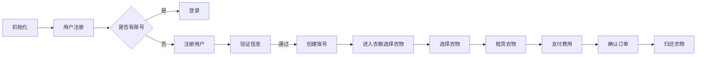
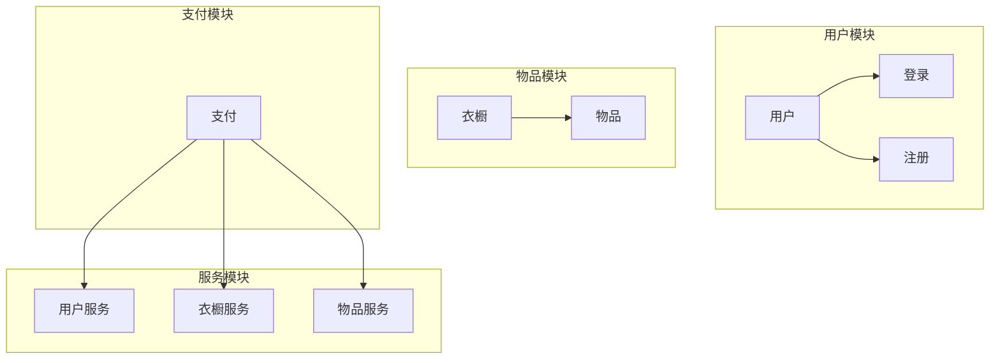

                 


# 新型城市共享衣橱：可持续时尚的创新模式

关键词：可持续时尚、共享衣橱、创新模式、环境保护、用户体验

摘要：本文探讨了新型城市共享衣橱作为可持续时尚的创新模式，分析了其背景、概念、业务模式、技术集成、用户体验以及未来发展方向。通过详细的案例分析，揭示了共享衣橱在实际应用中的成功经验和挑战，为行业发展提供了有益的启示。

## 引言与背景

### 1.1 核心概念术语说明

- **共享衣橱**：一种以租借代替购买的时尚消费模式，用户可以在线选择并租借衣物，满足临时性的穿着需求。
- **可持续时尚**：在服装设计和生产过程中，注重环境、社会和经济三方面的可持续性发展。
- **环境保护**：在时尚产业中，通过减少资源消耗、降低废弃物产生等方式，保护自然环境。

### 1.2 问题背景

- **过度消费与浪费**：传统时尚产业过度依赖消费驱动，导致大量资源浪费和环境污染。
- **可持续性挑战**：随着全球气候变化和资源枯竭，时尚产业面临巨大的可持续性挑战。

### 1.3 问题描述

- **共享衣橱**作为一种可持续时尚创新模式，旨在解决上述问题，为消费者提供更加环保、经济的时尚选择。

### 1.4 问题解决

- **共享衣橱**通过减少衣物消费、延长衣物使用寿命、降低废弃物产生等方式，促进环境保护和可持续发展。

### 1.5 边界与外延

- **边界**：本文主要探讨城市共享衣橱在可持续发展方面的应用，不涉及农村地区或特殊群体的应用。
- **外延**：共享衣橱作为一种新兴的商业模式，可以拓展到其他消费领域，如家居、美妆等。

### 1.6 概念结构与核心要素组成

#### 1.6.1 共享衣橱概念结构

- **用户**：共享衣橱服务的最终消费者。
- **衣橱**：提供衣物租赁的实体或在线平台。
- **租赁**：用户与衣橱之间的交易行为。
- **技术**：支持共享衣橱运营的信息技术和工具。

#### 1.6.2 可持续时尚核心要素

- **环境**：减少碳排放、资源消耗和废弃物产生。
- **社会**：提高就业机会、促进公平贸易、改善生活品质。
- **经济**：降低生产成本、提高资源利用效率。

## 核心概念与联系

### 2.1 核心概念原理

- **共享衣橱**：一种基于互联网的时尚消费模式，通过租赁代替购买，实现资源的有效利用。
- **可持续时尚**：以环保、公平、经济为原则，推动时尚产业的可持续发展。

### 2.2 概念属性特征对比表格

| 概念      | 属性特征                            |
| --------- | --------------------------------- |
| 共享衣橱  | 减少消费、延长使用寿命、降低废弃物  |
| 可持续时尚 | 环境友好、社会公正、经济高效        |

### 2.3 ER实体关系图架构

```mermaid
erDiagram
    User ||--|{ Closet }|--|| Item
    User ||--|{ Rent }|--|| Item
```

- **用户**：租赁衣物的主体。
- **衣橱**：提供衣物的实体或平台。
- **物品**：租借的衣物。

## 算法原理讲解

### 3.1 算法mermaid流程图



### 3.2 算法python源代码实现

```python
class User:
    def __init__(self, username, password):
        self.username = username
        self.password = password

    def register(self):
        # 注册用户
        pass

    def login(self):
        # 登录用户
        pass

class Closet:
    def __init__(self):
        self.items = []

    def add_item(self, item):
        # 添加衣物
        pass

    def rent_item(self, user, item):
        # 租赁衣物
        pass

    def return_item(self, user, item):
        # 归还衣物
        pass

class Item:
    def __init__(self, name, price):
        self.name = name
        self.price = price

# 示例
user = User('username', 'password')
closet = Closet()
item = Item('T-shirt', 10)
user.register()
user.login()
closet.add_item(item)
user.rent_item(item)
```

### 3.3 算法原理详细讲解

- **用户注册**：用户需要先注册一个账号，输入用户名和密码。
- **用户登录**：注册后的用户可以使用用户名和密码登录系统。
- **添加衣物**：衣橱管理员可以将衣物添加到系统中。
- **租赁衣物**：用户可以选择租赁衣物，并支付相应的费用。
- **归还衣物**：用户在租赁期满后需要将衣物归还到衣橱。

### 3.4 数学模型与公式

- **租赁费用计算公式**：租赁费用 = 单价 × 租赁天数

### 3.5 举例说明

- **示例1**：用户租赁一件T恤，单价为10元，租赁3天，则租赁费用为30元。
- **示例2**：用户租赁一条裙子，单价为50元，租赁7天，则租赁费用为350元。

## 系统分析与架构设计方案

### 4.1 问题场景介绍

- **背景**：随着人们对时尚和环境保护的关注日益增加，共享衣橱作为一种新兴的时尚消费模式，正逐渐受到消费者的青睐。
- **目标**：设计一个功能完善、用户体验良好的共享衣橱系统，实现用户在线租赁衣物、支付费用、归还衣物等操作。

### 4.2 项目介绍

- **项目名称**：城市共享衣橱系统
- **项目目标**：为用户提供便捷、经济的衣物租赁服务，推动可持续时尚的发展。

### 4.3 系统功能设计

#### 4.3.1 领域模型mermaid类图

```mermaid
classDiagram
    User <<class>> {username, password}
    Closet <<class>> {items, admin}
    Item <<class>> {name, price, status}
    User "1" --|{租赁}| "1..*" Rent
    User "1" --|{注册}| "1" User
    Closet "1" --|{管理}| "1" Item
    Rent "1" --|{支付}| "1" Payment
```

### 4.4 系统架构设计

#### 4.4.1 系统架构mermaid架构图



### 4.5 系统接口设计

#### 4.5.1 系统接口mermaid序列图

```mermaid
sequenceDiagram
    participant User
    participant UserService
    participant ClosetService
    participant ItemService
    participant Payment

    User->>UserService: 注册/登录请求
    UserService->>User: 返回注册/登录结果
    User->>C

