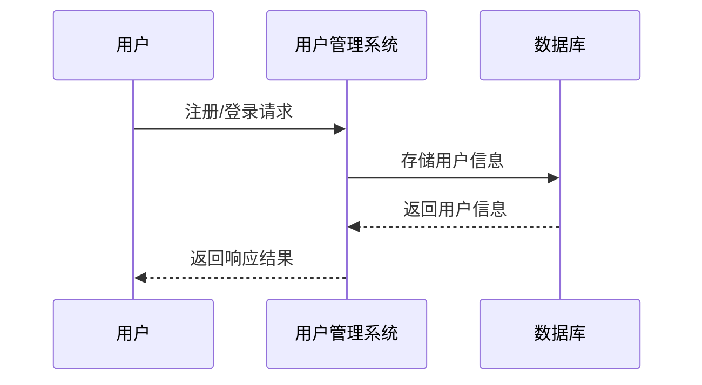
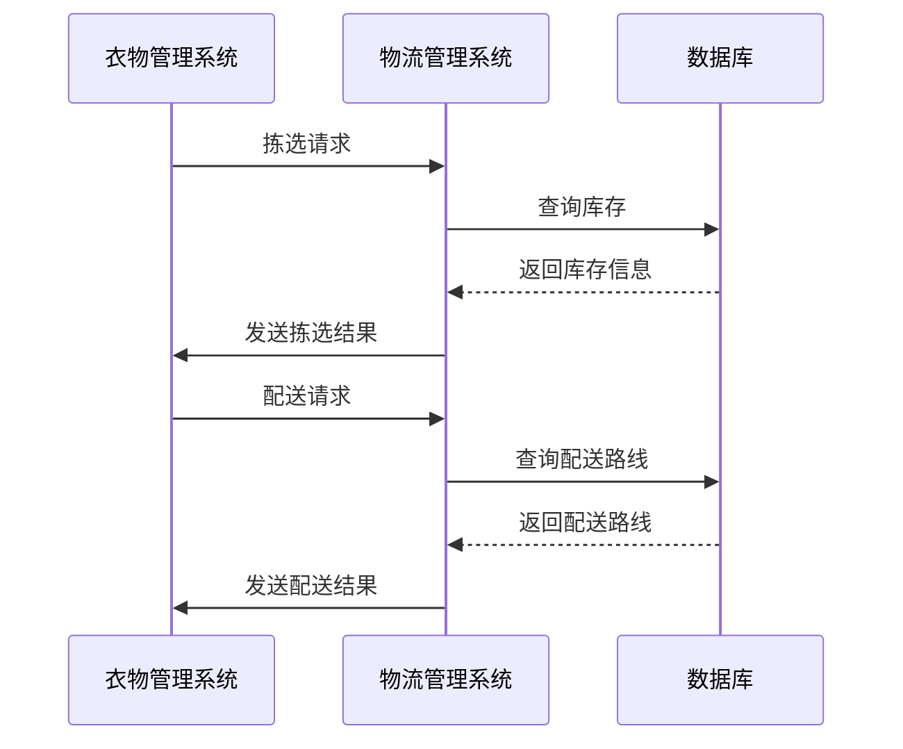
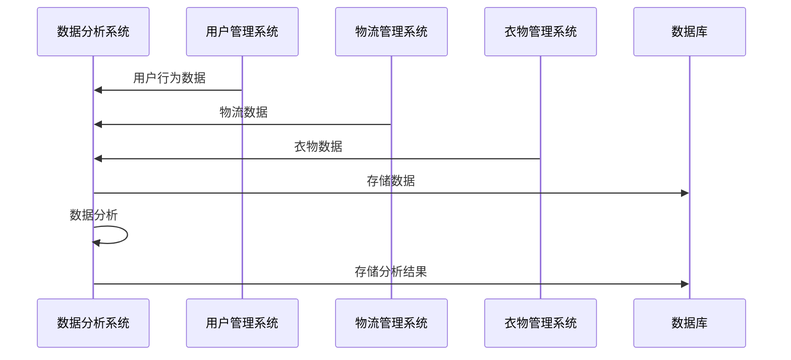

                 

### 文章标题

# 新型城市共享衣橱：可持续时尚的创新模式

> 关键词：共享经济、可持续时尚、城市共享衣橱、运营模式、技术支撑、市场前景、未来挑战

> 摘要：随着全球对环境保护和可持续发展的关注度日益增加，时尚产业也面临着重大变革。新型城市共享衣橱作为一种创新的可持续时尚模式，正逐渐受到消费者的青睐。本文将详细介绍共享经济的兴起与共享衣橱的发展背景，探讨共享衣橱与可持续时尚的联系，分析新型城市共享衣橱的运营模式、技术支撑、市场前景及未来挑战，并展望其发展趋势。通过深入研究和案例分析，本文旨在为行业提供有益的参考和指导。

## 目录大纲

----------------------------------------------------------------

### 第一部分：背景介绍

- **第1章：共享经济的兴起与共享衣橱的发展**
  - 1.1.1 共享经济的概念与特点
    - 1.1.1.1 共享经济的定义
    - 1.1.1.2 共享经济的三大特点
  - 1.1.2 共享衣橱的背景与发展
    - 1.1.2.1 时尚产业的可持续性问题
    - 1.1.2.2 共享衣橱的发展历程
    - 1.1.2.3 城市共享衣橱的优势与挑战
  - 1.1.3 本书结构安排
    - 1.1.3.1 各章节内容概述
    - 1.1.3.2 阅读建议与指南

- **第2章：核心概念与联系**
  - 2.1.1 共享衣橱的基本概念
    - 2.1.1.1 共享衣橱的定义
    - 2.1.1.2 共享衣橱的分类
  - 2.1.2 可持续时尚的概念
    - 2.1.2.1 可持续发展的定义
    - 2.1.2.2 可持续时尚的内涵
  - 2.1.3 共享衣橱与可持续时尚的联系
    - 2.1.3.1 共享衣橱如何促进可持续时尚
    - 2.1.3.2 可持续时尚对共享衣橱的影响
    - 2.1.3.3 ER实体关系图架构

### 第二部分：新型城市共享衣橱的运营模式

- **第3章：新型城市共享衣橱的运营模式**
  - 3.1.1 共享衣橱的运营模式概述
    - 3.1.1.1 共享衣橱的运营模式类型
    - 3.1.1.2 各类运营模式的优势与挑战
  - 3.1.2 城市共享衣橱的运营策略
    - 3.1.2.1 会员制运营策略
    - 3.1.2.2 租赁服务策略
    - 3.1.2.3 物流配送策略
  - 3.1.3 市场推广与用户反馈
    - 3.1.3.1 市场推广策略
    - 3.1.3.2 用户反馈机制

### 第三部分：技术支撑与实现

- **第4章：技术支撑与实现**
  - 4.1.1 技术支撑概述
    - 4.1.1.1 共享衣橱技术支撑的重要性
    - 4.1.1.2 技术支撑的主要内容
  - 4.1.2 用户管理系统
    - 4.1.2.1 用户管理系统架构
    - 4.1.2.2 用户注册与登录
    - 4.1.2.3 用户信息管理
  - 4.1.3 物流管理系统
    - 4.1.3.1 物流管理系统架构
    - 4.1.3.2 衣物的拣选与配送
    - 4.1.3.3 运输路线优化
  - 4.1.4 数据分析系统
    - 4.1.4.1 数据分析系统架构
    - 4.1.4.2 用户行为分析
    - 4.1.4.3 供应链优化分析

### 第四部分：案例研究

- **第5章：案例研究**
  - 5.1.1 案例一：城市共享衣橱项目A
    - 5.1.1.1 项目背景
    - 5.1.1.2 运营模式
    - 5.1.1.3 成功经验与挑战
  - 5.1.2 案例二：城市共享衣橱项目B
    - 5.1.2.1 项目背景
    - 5.1.2.2 运营模式
    - 5.1.2.3 成功经验与挑战

### 第五部分：政策环境与市场前景

- **第6章：政策环境与市场前景**
  - 6.1.1 政策环境分析
    - 6.1.1.1 国家政策对共享衣橱行业的影响
    - 6.1.1.2 地方政府政策支持措施
    - 6.1.1.3 行业规范与标准制定
  - 6.1.2 市场前景展望
    - 6.1.2.1 市场规模预测
    - 6.1.2.2 消费者需求变化
    - 6.1.2.3 竞争格局分析

### 第六部分：未来发展与挑战

- **第7章：未来发展与挑战**
  - 7.1.1 技术创新趋势
    - 7.1.1.1 人工智能在共享衣橱中的应用
    - 7.1.1.2 物联网技术的应用前景
    - 7.1.1.3 区块链技术的潜在价值
  - 7.1.2 未来发展挑战
    - 7.1.2.1 法律法规完善
    - 7.1.2.2 用户隐私保护
    - 7.1.2.3 行业竞争加剧
  - 7.1.3 发展策略与建议
    - 7.1.3.1 企业发展战略
    - 7.1.3.2 行业协会作用
    - 7.1.3.4 可持续发展的路径

### 第七部分：小结与展望

- **第8章：小结与展望**
  - 8.1.1 本书小结
    - 8.1.1.1 各章节核心内容回顾
    - 8.1.1.2 共享衣橱发展现状与趋势
  - 8.1.2 展望未来
    - 8.1.2.1 新型城市共享衣橱的创新模式
    - 8.1.2.2 可持续时尚的发展方向
    - 8.1.2.3 共享衣橱的未来前景

----------------------------------------------------------------

### 第1章：共享经济的兴起与共享衣橱的发展

#### 1.1.1 共享经济的概念与特点

##### 1.1.1.1 共享经济的定义

共享经济，也被称为协同消费或共享协作，是一种基于互联网和信息技术的新型经济模式。它通过连接供需双方，实现资源共享和高效利用，从而降低资源浪费，提高经济效益。具体来说，共享经济指的是个人或组织将自己闲置的资产、服务或知识等以租借、交换、分享等方式与他人共享，从而实现互利共赢。

##### 1.1.1.2 共享经济的三大特点

- **去中心化**：共享经济打破了传统的中心化商业模式，将权力和资源分配给了每一个参与者。这种去中心化的特性使得共享经济系统能够更加灵活、高效地运作。

- **共享与共用**：共享经济的核心在于资源共享和共用。它鼓励人们分享自己的资源，使得资源的利用效率最大化。这种共享和共用的理念不仅体现在物质资源上，还扩展到了服务和知识领域。

- **技术驱动**：共享经济的兴起离不开互联网和移动通信技术的支持。这些技术使得信息获取更加便捷，交易成本降低，资源匹配更加精准，从而推动了共享经济的快速发展。

#### 1.1.2 共享衣橱的背景与发展

##### 1.1.2.1 时尚产业的可持续性问题

时尚产业是全球化程度最高的产业之一，但也面临着严重的环境问题。据估计，全球时尚产业每年产生的碳排放量约占全球总排放量的10%，其中大部分来自生产、运输和消费环节。此外，时尚产业还面临着资源浪费、水资源短缺、土地退化等问题。这些问题对环境和人类健康都构成了巨大威胁。

##### 1.1.2.2 共享衣橱的发展历程

共享衣橱作为一种新兴的商业模式，最早可以追溯到20世纪90年代的欧洲。当时，一些消费者开始尝试通过租赁衣物来减少浪费和降低消费成本。随着互联网和移动技术的发展，共享衣橱逐渐走向成熟，并在2010年后迎来了爆发式增长。目前，全球已有多个国家和地区推出了共享衣橱服务。

##### 1.1.2.3 城市共享衣橱的优势与挑战

- **优势**：

  - **降低消费成本**：共享衣橱使得消费者可以以较低的成本获得高质量的衣物，减少了浪费和过度消费。

  - **提高资源利用效率**：通过共享，闲置的衣物得到了充分利用，减少了资源浪费。

  - **环保**：共享衣橱减少了时尚产业的碳排放和资源消耗，有助于保护环境。

- **挑战**：

  - **用户信任问题**：共享衣橱要求用户之间建立信任关系，但衣物共享存在卫生和安全风险，需要建立有效的保障机制。

  - **物流成本**：城市共享衣橱需要高效、低成本的物流配送系统，这对企业的运营提出了挑战。

  - **市场竞争**：随着共享衣橱的兴起，市场上涌现出了大量竞争者，企业需要不断创新和优化运营模式，以保持竞争优势。

#### 1.1.3 本书结构安排

##### 1.1.3.1 各章节内容概述

- **第1章**：介绍共享经济的概念与特点，以及共享衣橱的发展背景和挑战。

- **第2章**：探讨共享衣橱的基本概念和分类，以及与可持续时尚的联系。

- **第3章**：分析新型城市共享衣橱的运营模式，包括会员制、租赁服务和物流配送策略。

- **第4章**：介绍共享衣橱的技术支撑，包括用户管理系统、物流管理系统和数据分析系统。

- **第5章**：通过两个实际案例研究，分析共享衣橱的运营模式和成功经验。

- **第6章**：分析政策环境与市场前景，包括国家政策、地方政府支持措施和市场需求。

- **第7章**：探讨共享衣橱的未来发展挑战和策略。

- **第8章**：总结本书的核心内容，展望共享衣橱的未来前景。

##### 1.1.3.2 阅读建议与指南

- 本书旨在深入探讨新型城市共享衣橱的发展现状和未来趋势，适合对共享经济和时尚产业感兴趣的读者。

- 在阅读过程中，可以重点关注以下几个方面：

  - 共享衣橱的基本概念和分类。

  - 新型城市共享衣橱的运营模式和技术支撑。

  - 实际案例研究的成功经验和挑战。

  - 政策环境对共享衣橱行业的影响。

  - 共享衣橱的未来发展前景和策略。

- 建议结合实际案例和数据分析，深入思考共享衣橱在可持续发展中的作用和挑战。

----------------------------------------------------------------

#### 2.1.1 共享衣橱的基本概念

##### 2.1.1.1 共享衣橱的定义

共享衣橱，顾名思义，是一种基于共享经济理念的衣物租赁服务。它通过互联网平台将衣物所有者与消费者连接起来，消费者可以按需租赁衣物，从而实现衣物的共享和高效利用。共享衣橱不仅减少了消费者对衣物的购买需求，还减少了时尚产业的环境负担，是一种可持续的时尚消费模式。

##### 2.1.1.2 共享衣橱的分类

共享衣橱根据服务模式、消费场景和用户群体等不同维度，可以划分为多种类型。以下是几种常见的分类方式：

- **按服务模式分类**：

  - **租赁型共享衣橱**：消费者支付一定的租金，即可在约定的时间内租赁到衣物。

  - **会员型共享衣橱**：消费者通过支付会员费，成为会员，享受不限次数的衣物租赁服务。

- **按消费场景分类**：

  - **线上共享衣橱**：通过互联网平台提供衣物租赁服务，消费者可以在平台上浏览、下单和租赁衣物。

  - **线下共享衣橱**：通过实体店或智能衣橱提供衣物租赁服务，消费者可以直接到店或使用自助设备租赁衣物。

- **按用户群体分类**：

  - **个人用户共享衣橱**：主要针对个人消费者的需求，提供个性化的衣物租赁服务。

  - **企业用户共享衣橱**：主要为企业员工提供工作服、正装等定制化衣物租赁服务。

#### 2.1.2 可持续时尚的概念

##### 2.1.2.1 可持续发展的定义

可持续发展，是指满足当前需求而不损害后代满足其需求的能力。它强调经济发展、社会进步和环境保护三者之间的平衡和协调。可持续发展不仅关注经济增长，更关注资源的合理利用和保护，以及人类福祉的全面提升。

##### 2.1.2.2 可持续时尚的内涵

可持续时尚，是指在时尚产业中推行可持续发展理念，通过减少资源消耗、降低环境污染、提高生产效率和提升消费者福祉，实现时尚产业的绿色、低碳和可持续发展。具体来说，可持续时尚包括以下几个方面：

- **环保材料**：采用环保、可再生、可降解的材料，减少对环境的负面影响。

- **循环利用**：推广二手衣物、租赁衣物等循环利用模式，减少新衣物的生产需求。

- **节能生产**：采用节能、高效的生产技术和设备，减少能源消耗和碳排放。

- **环保包装**：使用环保材料进行包装，减少包装废弃物。

- **社会责任**：关注劳动者的权益，提高生产过程中的社会责任意识。

#### 2.1.3 共享衣橱与可持续时尚的联系

##### 2.1.3.1 共享衣橱如何促进可持续时尚

- **减少浪费**：共享衣橱使得消费者可以按需租赁衣物，减少了不必要的购买，从而降低了资源的消耗和浪费。

- **降低碳排放**：共享衣橱减少了新衣物的生产需求，降低了能源消耗和碳排放。

- **促进循环利用**：共享衣橱鼓励二手衣物的再利用，推动了循环经济的发展。

- **提高资源利用效率**：通过共享，闲置的衣物得到了充分利用，提高了资源的利用效率。

##### 2.1.3.2 可持续时尚对共享衣橱的影响

- **环保要求**：可持续时尚的推广要求共享衣橱在衣物选择、生产过程、包装等方面更加环保，从而满足消费者的绿色消费需求。

- **技术创新**：为了实现可持续时尚，共享衣橱需要不断创新技术，提高衣物的耐用性和可维修性。

- **社会责任**：可持续时尚强调企业的社会责任，共享衣橱需要关注员工的权益，提高生产过程的透明度。

##### 2.1.3.3 ER实体关系图架构

为了更清晰地展示共享衣橱与可持续时尚之间的联系，我们可以使用ER（实体关系）图来描述它们之间的关系。

```mermaid
erDiagram
    Goods ||--|{ Customer } : orders
    Goods ||--|{ Logistics } : delivered
    Customer ||--|{ Payment } : pays
    Logistics ||--|{ Supplier } : supplies
    Supplier ||--|{ Manufacturer } : produces
    Manufacturer ||--|{ Material } : uses
    Material ||--|{ Environment } : affects
```

在这个ER图中，我们可以看到以下几个关键实体及其关系：

- **Goods**：代表共享衣橱中的衣物，与**Customer**（消费者）有订单关系，与**Logistics**（物流）有配送关系。

- **Customer**：代表消费者，与**Payment**（支付）有支付关系。

- **Logistics**：代表物流服务，与**Supplier**（供应商）有供应关系。

- **Supplier**：代表供应商，与**Manufacturer**（制造商）有供应关系。

- **Manufacturer**：代表制造商，与**Material**（材料）有生产关系。

- **Material**：代表生产用的材料，与**Environment**（环境）有影响关系。

通过这个ER图，我们可以更好地理解共享衣橱与可持续时尚之间的复杂关系，以及如何通过技术创新和运营模式优化，实现可持续发展目标。

----------------------------------------------------------------

### 第3章：新型城市共享衣橱的运营模式

#### 3.1.1 共享衣橱的运营模式概述

##### 3.1.1.1 共享衣橱的运营模式类型

共享衣橱的运营模式可以根据服务模式、用户参与程度和收益模式等维度进行分类。以下是几种常见的共享衣橱运营模式：

- **会员制运营模式**：消费者支付会员费用，即可享受不限次数的衣物租赁服务。这种模式强调会员的忠诚度和粘性，通过提供多样化的服务和优惠，提高会员的满意度和留存率。

- **租赁服务运营模式**：消费者按次支付租金，租赁衣物一定时间。这种模式适用于对衣物有短期需求的人群，如临时出差、特殊场合等。

- **平台运营模式**：共享衣橱平台连接衣物所有者和消费者，提供衣物租赁、交易、评价等一站式服务。这种模式强调平台的服务质量和用户体验，通过良好的服务吸引更多用户。

- **B2B运营模式**：企业或组织通过共享衣橱平台租赁衣物，用于员工制服、企业活动等。这种模式侧重于为企业客户提供定制化服务，满足其特定需求。

##### 3.1.1.2 各类运营模式的优势与挑战

- **会员制运营模式**：

  - **优势**：

    - **提高用户粘性**：会员制度可以激励用户长期使用服务，提高用户留存率。

    - **增加收入来源**：通过会员费用，平台可以增加收入来源，降低对单次租赁收入的依赖。

    - **服务多样化**：会员制度可以提供更多的服务，如专属优惠、优先预订等，提高用户满意度。

  - **挑战**：

    - **运营成本高**：会员制度需要提供高品质的服务，增加运营成本。

    - **用户流失风险**：会员制度可能会面临用户流失风险，特别是当竞争对手提供更具吸引力的服务时。

- **租赁服务运营模式**：

  - **优势**：

    - **灵活性强**：消费者可以根据自己的需求租赁衣物，提高消费灵活性。

    - **市场需求大**：对短期衣物需求的消费者较多，租赁服务具有较大的市场需求。

    - **运营成本低**：相对于会员制度，租赁服务运营成本较低。

  - **挑战**：

    - **用户粘性低**：租赁服务用户可能更关注价格，而非长期服务。

    - **库存管理复杂**：需要有效管理库存，以满足不同用户的需求。

- **平台运营模式**：

  - **优势**：

    - **一站式服务**：平台可以提供从租赁到售后的一站式服务，提高用户体验。

    - **用户范围广**：平台可以吸引更多用户，扩大用户基础。

    - **多元化收入**：平台可以通过广告、交易费等多种方式获取收入。

  - **挑战**：

    - **竞争激烈**：市场上已有多个共享衣橱平台，竞争激烈。

    - **质量控制难**：需要确保衣物质量，提高用户满意度。

- **B2B运营模式**：

  - **优势**：

    - **市场稳定**：企业客户需求稳定，有利于建立长期合作关系。

    - **利润率高**：B2B业务通常利润率较高。

    - **定制化服务**：可以提供定制化服务，满足企业特定需求。

  - **挑战**：

    - **客户依赖性高**：B2B业务对企业客户依赖性较高，客户流失可能对业务造成较大影响。

    - **服务复杂度**：需要提供多样化、个性化的服务，对运营能力要求较高。

#### 3.1.2 城市共享衣橱的运营策略

##### 3.1.2.1 会员制运营策略

- **提高会员质量**：通过提供优质服务和优惠，吸引高价值会员。

- **会员等级制度**：设立不同等级的会员，提供差异化服务，提高会员忠诚度。

- **会员活动与互动**：定期举办会员活动，增强会员互动和粘性。

- **数据分析与个性化推荐**：通过数据分析，为会员提供个性化服务，提高用户满意度。

##### 3.1.2.2 租赁服务策略

- **灵活的租赁模式**：提供多种租赁模式，满足不同用户的需求。

- **价格策略**：根据市场需求和用户消费习惯，制定合理的价格策略。

- **促销活动**：定期举办促销活动，提高用户参与度和购买意愿。

- **服务质量保障**：确保衣物质量和服务质量，提高用户满意度。

##### 3.1.2.3 物流配送策略

- **高效配送网络**：建立覆盖城市的配送网络，提高配送效率。

- **智能仓储系统**：采用智能仓储系统，提高库存管理效率。

- **灵活配送方式**：提供多种配送方式，如快递、自提等，满足不同用户需求。

- **配送成本控制**：通过优化配送路线和物流流程，降低配送成本。

#### 3.1.3 市场推广与用户反馈

##### 3.1.3.1 市场推广策略

- **线上线下结合**：通过线上线下多种渠道进行市场推广，扩大品牌知名度。

- **社交媒体营销**：利用社交媒体平台，提高用户参与度和品牌影响力。

- **KOL合作**：与知名意见领袖合作，利用其影响力推广产品。

- **线下活动**：举办线下活动，吸引潜在用户，提高用户参与度。

##### 3.1.3.2 用户反馈机制

- **用户评价系统**：建立用户评价系统，收集用户反馈，不断优化服务质量。

- **客服团队**：建立专业的客服团队，及时解决用户问题，提高用户满意度。

- **用户调研**：定期进行用户调研，了解用户需求和偏好，为产品和服务优化提供依据。

- **用户激励**：通过积分、优惠券等方式，激励用户积极参与反馈和评价。

通过以上运营策略和市场推广，新型城市共享衣橱可以在激烈的市场竞争中脱颖而出，实现可持续发展目标。

----------------------------------------------------------------

### 4.1.1 技术支撑概述

#### 4.1.1.1 共享衣橱技术支撑的重要性

在共享衣橱的运营过程中，技术支撑起到了至关重要的作用。共享衣橱不仅涉及大量的衣物管理、物流配送、用户管理等业务，还需要确保数据的安全性和系统的稳定性。技术支撑为共享衣橱的运营提供了强有力的保障，是提升用户体验、降低运营成本、提高效率的关键因素。

#### 4.1.1.2 技术支撑的主要内容

共享衣橱的技术支撑主要包括以下几个方面：

- **用户管理系统**：负责用户的注册、登录、信息管理等功能。

- **物流管理系统**：负责衣物的拣选、配送、运输路线优化等物流环节。

- **数据分析系统**：负责对用户行为、市场需求、供应链等数据的分析，为运营决策提供支持。

- **支付系统**：提供支付服务，确保交易的安全和便捷。

- **安全系统**：保护用户数据的安全，防止数据泄露和网络攻击。

#### 4.1.2 用户管理系统

##### 4.1.2.1 用户管理系统架构

用户管理系统是共享衣橱的核心组成部分，其架构设计需要考虑安全性、可扩展性和易用性。以下是用户管理系统的一个典型架构：



在这个架构中，用户通过用户管理系统（UMS）进行注册或登录，用户信息被存储在数据库（DB）中，用户管理系统根据数据库返回的用户信息生成响应结果，并返回给用户。

##### 4.1.2.2 用户注册与登录

- **用户注册**：用户通过填写注册表单，输入用户名、密码、邮箱等基本信息进行注册。注册过程包括表单验证、用户名唯一性验证等步骤，确保用户信息的合法性和准确性。

- **用户登录**：用户输入用户名和密码，通过身份验证后，系统会生成一个会话（Session），存储用户登录状态和相关信息。

##### 4.1.2.3 用户信息管理

- **用户信息展示**：用户可以在个人中心查看和管理个人信息，如用户名、密码、邮箱、地址等。

- **用户信息修改**：用户可以修改个人信息，如更换邮箱、修改地址等。

- **用户信息删除**：用户可以删除自己的账号，系统会确保删除用户数据的安全和完整性。

#### 4.1.3 物流管理系统

##### 4.1.3.1 物流管理系统架构

物流管理系统负责共享衣橱的衣物拣选、配送和运输路线优化。以下是物流管理系统的一个典型架构：



在这个架构中，衣物管理系统（CMS）向物流管理系统（LMS）发送拣选和配送请求，物流管理系统根据库存信息和配送路线，生成拣选和配送结果，并返回给衣物管理系统。

##### 4.1.3.2 衣物的拣选与配送

- **衣物拣选**：根据订单信息，物流管理系统从仓库中挑选出相应的衣物，并打包好准备配送。

- **配送**：物流管理系统选择最优的配送路线，将衣物发送到用户手中。

##### 4.1.3.3 运输路线优化

- **路线规划**：物流管理系统利用算法，根据交通状况、配送时间、配送成本等因素，规划最优的配送路线。

- **实时调整**：在配送过程中，物流管理系统可以实时监控交通状况，根据实际情况调整配送路线。

#### 4.1.4 数据分析系统

##### 4.1.4.1 数据分析系统架构

数据分析系统负责对用户行为、市场需求、供应链等数据进行收集、存储和分析，为运营决策提供支持。以下是数据分析系统的一个典型架构：



在这个架构中，用户管理系统、物流管理系统和衣物管理系统将相关数据发送给数据分析系统，数据分析系统对数据进行存储和分析，并将分析结果存储在数据库中。

##### 4.1.4.2 用户行为分析

- **用户行为数据收集**：通过用户注册、登录、租赁、评价等操作，收集用户行为数据。

- **用户行为分析**：利用数据分析技术，分析用户的行为偏好、租赁习惯等，为运营决策提供支持。

##### 4.1.4.3 供应链优化分析

- **供应链数据收集**：收集衣物生产、库存、物流等供应链数据。

- **供应链优化分析**：通过数据分析，优化供应链流程，降低成本，提高效率。

通过以上技术支撑，共享衣橱可以实现高效的运营和管理，提高用户体验，降低运营成本，实现可持续发展目标。

----------------------------------------------------------------

### 4.1.5 支付系统

支付系统在共享衣橱运营中起着关键作用，它负责处理用户的支付请求，确保交易的顺利进行和资金的安全。以下是支付系统的几个关键组成部分和设计要点：

#### 4.1.5.1 支付流程

- **支付请求**：用户在租赁衣物或购买相关服务时，系统会生成支付请求，包含订单信息、支付金额等。
- **支付验证**：支付请求发送到支付网关，支付网关会验证支付请求的有效性，包括订单金额、支付方式等。
- **支付处理**：支付网关将支付请求转发到支付服务提供商，如支付宝、微信支付、信用卡支付等，进行支付处理。
- **支付确认**：支付服务提供商处理支付请求后，将支付结果返回支付网关，支付网关再将结果返回到共享衣橱系统。
- **支付回调**：支付服务提供商在支付完成后，会通过回调机制通知共享衣橱系统，更新订单状态。

#### 4.1.5.2 安全性设计

- **加密传输**：支付请求和支付结果在传输过程中需要使用HTTPS加密协议，确保数据传输的安全。
- **身份验证**：支付服务提供商需要验证用户的身份，确保支付请求来自合法用户。
- **防欺诈机制**：系统应具备防欺诈机制，对异常支付请求进行监控和拦截，如频繁支付失败、高额支付等。
- **风险控制**：支付系统应具备风险控制机制，对可疑支付行为进行预警和处理，如支付金额异常、支付频率异常等。

#### 4.1.5.3 可扩展性设计

- **支付渠道集成**：支付系统应支持多种支付渠道的集成，如支付宝、微信支付、信用卡支付等，以适应不同用户的需求。
- **支付策略配置**：支付系统应支持灵活的支付策略配置，如根据订单金额、用户等级等因素设置不同的支付方式。
- **负载均衡**：支付系统应具备负载均衡能力，确保在高并发情况下，支付请求能够被高效处理。
- **扩展性架构**：支付系统应采用微服务架构，便于模块化扩展和升级，提高系统的可维护性和扩展性。

#### 4.1.5.4 用户友好设计

- **界面设计**：支付页面应简洁明了，用户可以快速完成支付操作，减少支付步骤。
- **支付提示**：在支付过程中，系统应提供明确的支付提示，帮助用户完成支付。
- **支付成功反馈**：支付完成后，系统应提供支付成功的反馈，包括订单号、支付时间等信息。
- **退款机制**：支付系统应支持退款功能，确保用户在遇到问题时能够及时得到解决方案。

通过以上设计要点，支付系统可以确保共享衣橱运营中的支付流程安全、高效、便捷，提高用户体验，为共享衣橱的可持续发展提供坚实保障。

----------------------------------------------------------------

### 4.1.6 安全系统

在共享衣橱的运营过程中，安全性系统是保障用户数据安全和系统稳定性的关键组成部分。以下是安全性系统的几个关键组成部分和设计要点：

#### 4.1.6.1 数据安全

- **数据加密**：用户数据在传输和存储过程中需要进行加密处理，确保数据不被未经授权的第三方窃取或篡改。常用的加密技术包括SSL/TLS加密协议、AES加密算法等。

- **数据备份**：定期对用户数据进行备份，确保在数据丢失或损坏时，可以快速恢复数据。备份策略应包括全量备份和增量备份，同时确保备份数据的安全性。

- **访问控制**：通过设置用户权限和访问控制列表，确保只有授权用户才能访问和操作敏感数据。访问控制策略应包括身份验证、权限分配、审计日志等。

- **数据脱敏**：在数据存储和传输过程中，对敏感数据进行脱敏处理，如将身份证号码、手机号码等敏感信息替换为不可识别的字符串。

#### 4.1.6.2 网络安全

- **防火墙**：部署防火墙，阻止未经授权的访问和攻击，确保网络边界的安全。

- **入侵检测与防御系统（IDS/IPS）**：部署入侵检测与防御系统，实时监控网络流量，检测和阻止恶意攻击。

- **DDoS攻击防护**：通过部署DDoS攻击防护系统，防止分布式拒绝服务攻击，保障系统的可用性。

- **安全补丁管理**：定期更新系统补丁，修复已知的安全漏洞，确保系统软件的安全性。

#### 4.1.6.3 应用安全

- **代码审查**：对系统代码进行定期审查，发现和修复潜在的安全漏洞。

- **安全编码规范**：制定和遵循安全编码规范，如避免使用易受攻击的函数、处理输入验证等。

- **API安全**：对API进行安全设计，如使用OAuth等认证机制、参数验证、防止CSRF攻击等。

- **安全测试**：对系统进行定期的安全测试，包括漏洞扫描、渗透测试等，确保系统的安全性。

#### 4.1.6.4 应急响应

- **应急响应计划**：制定应急响应计划，明确在发生安全事件时的处理流程和责任分工。

- **安全事件监控**：实时监控安全事件，如数据泄露、恶意攻击等，及时发现和处理安全问题。

- **安全培训与意识提升**：定期对员工进行安全培训，提高员工的安全意识和应对能力。

通过以上设计要点，安全性系统可以确保共享衣橱的用户数据安全和系统稳定性，为共享衣橱的可持续发展提供坚实保障。

----------------------------------------------------------------

### 第5章：案例研究

#### 5.1.1 案例一：城市共享衣橱项目A

##### 5.1.1.1 项目背景

城市共享衣橱项目A于2018年在我国某一线城市启动，由一家创业公司负责运营。该公司在共享衣橱领域具有丰富的经验，致力于通过创新模式和技术手段，为城市居民提供便捷、环保的衣物租赁服务。项目启动初期，主要面向年轻女性群体，提供时尚衣物的租赁服务。

##### 5.1.1.2 运营模式

项目A采用会员制运营模式，用户需支付一定的会员费，即可享受不限次数的衣物租赁服务。此外，项目A还提供租赁服务，用户按次支付租金。项目A通过线上平台和线下门店相结合的方式，满足不同用户的需求。

- **线上平台**：用户可以通过手机应用或网页端浏览衣物，下单租赁。平台提供多种支付方式，包括支付宝、微信支付等，确保支付便捷。

- **线下门店**：项目A在市中心区域开设了多家线下门店，用户可以亲自挑选衣物，享受即买即走的便利服务。线下门店还提供衣物保养、维修等服务。

##### 5.1.1.3 成功经验与挑战

- **成功经验**：

  - **市场定位准确**：项目A准确把握了城市年轻女性对时尚衣物的需求，为用户提供了丰富多样的衣物选择。

  - **技术创新**：项目A利用大数据和人工智能技术，对用户行为进行深入分析，提供个性化的衣物推荐，提高了用户满意度。

  - **线上线下结合**：项目A将线上平台和线下门店相结合，满足用户不同的消费习惯，提高了市场覆盖面。

  - **环保理念**：项目A积极推广环保理念，鼓励用户租赁衣物，减少资源浪费，符合可持续发展的要求。

- **挑战**：

  - **用户信任问题**：共享衣橱要求用户之间建立信任关系，但衣物共享存在卫生和安全风险，需要建立有效的保障机制。

  - **物流成本**：城市共享衣橱需要高效、低成本的物流配送系统，这对企业的运营提出了挑战。

  - **市场竞争**：随着共享衣橱的兴起，市场上涌现出了大量竞争者，企业需要不断创新和优化运营模式，以保持竞争优势。

#### 5.1.2 案例二：城市共享衣橱项目B

##### 5.1.2.1 项目背景

城市共享衣橱项目B于2019年在我国另一线城市启动，由一家互联网公司主导。项目B以B2B市场为主要目标，为企业提供员工制服、活动服装等定制化租赁服务。项目B在市场调研和用户需求分析方面投入了大量资源，以确保提供符合企业需求的产品和服务。

##### 5.1.2.2 运营模式

项目B采用B2B运营模式，与企业客户签订长期合作协议，提供定制化租赁服务。项目B通过线上平台和线下服务中心相结合的方式，满足企业客户的需求。

- **线上平台**：企业客户可以通过手机应用或网页端提交租赁需求，查看租赁方案和价格。

- **线下服务中心**：项目B在城市核心区域设立了多个线下服务中心，为企业客户提供咨询服务，同时提供衣物的保养、维修等服务。

##### 5.1.2.3 成功经验与挑战

- **成功经验**：

  - **市场定位准确**：项目B准确把握了企业客户对定制化租赁服务的需求，为用户提供个性化的解决方案。

  - **优质服务**：项目B注重服务质量，提供快速响应、及时交付等服务，赢得了客户的信任。

  - **灵活的租赁模式**：项目B提供多种租赁模式，如按需租赁、包月租赁等，满足不同企业的需求。

  - **技术支持**：项目B利用互联网技术，实现订单管理、物流跟踪等功能，提高了运营效率。

- **挑战**：

  - **企业客户需求多样**：企业客户的需求多样化，需要项目B提供定制化的服务，这对企业的运营能力提出了挑战。

  - **物流配送复杂**：企业客户的分布广泛，项目B需要建立高效的物流配送系统，确保衣物能够及时送达。

  - **市场竞争**：随着共享衣橱市场的扩大，项目B面临来自其他竞争对手的压力，需要不断创新和优化服务，以保持竞争优势。

通过以上两个案例研究，我们可以看到，城市共享衣橱项目在运营过程中取得了显著的成功，但同时也面临诸多挑战。未来，共享衣橱行业需要不断创新和优化，以满足用户需求，实现可持续发展。

----------------------------------------------------------------

### 第6章：政策环境与市场前景

#### 6.1.1 政策环境分析

##### 6.1.1.1 国家政策对共享衣橱行业的影响

国家政策的支持对共享衣橱行业的发展起到了重要的推动作用。近年来，我国政府陆续出台了一系列支持共享经济发展的政策，如《关于促进分享经济发展的指导意见》、《关于深化“互联网+先进制造业”发展工业互联网的指导意见》等。这些政策为共享衣橱行业提供了良好的发展环境，促进了行业的快速成长。

- **鼓励创新**：国家政策鼓励创新创业，为共享衣橱企业提供了资金、技术、人才等各方面的支持，推动了行业的创新和发展。

- **优化监管**：政府加强了对共享衣橱行业的监管，制定了相关法规和标准，确保行业的规范运作。例如，《共享住宿服务安全管理办法》对共享衣橱企业的运营提出了具体要求。

- **扶持发展**：政府通过财政补贴、税收优惠等政策，支持共享衣橱企业的发展，降低企业的运营成本。

##### 6.1.1.2 地方政府政策支持措施

地方政府在政策支持方面也发挥了重要作用，通过出台地方性政策，促进共享衣橱行业的发展。

- **资金支持**：地方政府设立专项资金，支持共享衣橱企业开展技术创新、市场推广等活动。

- **土地政策**：地方政府为共享衣橱企业提供土地优惠政策，降低企业的用地成本。

- **人才引进**：地方政府通过人才引进政策，吸引高层次人才加入共享衣橱企业，提升企业竞争力。

- **公共服务**：地方政府提供公共服务平台，如共享办公空间、共享实验室等，为共享衣橱企业提供服务。

##### 6.1.1.3 行业规范与标准制定

为了保障共享衣橱行业的健康发展，国家及地方政府积极推动行业规范和标准的制定。

- **服务质量标准**：制定服务质量标准，规范共享衣橱企业的服务流程，提高用户满意度。

- **数据安全标准**：制定数据安全标准，确保用户数据的安全和隐私保护。

- **环保标准**：制定环保标准，鼓励共享衣橱企业采用环保材料、绿色生产方式，推动可持续发展。

#### 6.1.2 市场前景展望

##### 6.1.2.1 市场规模预测

随着共享经济的快速发展，共享衣橱市场呈现出快速增长的趋势。根据相关预测，未来几年，共享衣橱市场规模将继续扩大，预计到2025年，市场规模将达到数百亿元人民币。

- **用户增长**：随着消费者对共享衣橱的接受度不断提高，用户数量将持续增长，为市场提供强大的支撑。

- **技术进步**：随着大数据、人工智能、物联网等技术的不断进步，共享衣橱的服务质量和运营效率将得到显著提升。

- **政策支持**：国家政策的支持和地方政府的扶持措施，将为共享衣橱行业的发展提供有力保障。

##### 6.1.2.2 消费者需求变化

消费者需求的不断变化也是影响共享衣橱市场前景的重要因素。

- **环保意识提高**：随着环保意识的提高，消费者对环保产品的需求不断增加，共享衣橱作为一种环保消费模式，符合消费者需求。

- **消费升级**：随着消费升级，消费者对时尚、个性化的需求日益增长，共享衣橱提供了丰富的衣物选择，满足了消费者的多样化需求。

- **便捷性需求**：随着生活节奏的加快，消费者对便捷性的需求不断提高，共享衣橱的便捷服务模式受到消费者青睐。

##### 6.1.2.3 竞争格局分析

共享衣橱行业的竞争格局逐渐清晰，市场主要分为以下几个竞争阵营：

- **平台型**：以共享衣橱平台为主，提供一站式衣物租赁服务，如某著名共享衣橱平台。

- **B2B型**：专注于为企业客户提供定制化租赁服务，如某互联网公司主导的共享衣橱项目。

- **O2O型**：结合线上线下服务，提供丰富的衣物选择和便捷的租赁体验，如某城市共享衣橱项目。

随着市场竞争的加剧，共享衣橱企业需要不断创新和优化，以提升用户满意度，保持竞争优势。

通过以上分析，可以看出，共享衣橱行业在政策环境、市场需求和技术进步的推动下，具有广阔的发展前景。未来，共享衣橱企业需要紧跟市场变化，优化运营模式，提升服务质量，以满足消费者需求，实现可持续发展。

----------------------------------------------------------------

### 第7章：未来发展与挑战

#### 7.1.1 技术创新趋势

##### 7.1.1.1 人工智能在共享衣橱中的应用

人工智能（AI）技术的发展为共享衣橱行业带来了新的机遇。以下是AI在共享衣橱中的一些应用趋势：

- **用户画像与个性化推荐**：通过大数据分析和机器学习算法，共享衣橱平台可以构建用户画像，实现个性化的衣物推荐，提高用户满意度。

- **智能客服**：利用自然语言处理（NLP）和语音识别技术，共享衣橱平台可以提供智能客服服务，提高用户咨询和反馈的响应速度。

- **智能仓储与配送**：通过机器人技术和自动化设备，共享衣橱可以实现智能化的仓储管理和高效配送，降低运营成本。

- **风险评估与欺诈检测**：利用AI算法，共享衣橱平台可以实时监控用户行为，识别潜在的风险和欺诈行为，确保交易安全。

##### 7.1.1.2 物联网技术的应用前景

物联网（IoT）技术的发展也为共享衣橱行业带来了新的应用场景和可能性。以下是物联网在共享衣橱中的一些应用前景：

- **智能衣橱与穿戴设备**：通过物联网技术，共享衣橱可以实现智能衣橱和穿戴设备的功能，提供更便捷、更智能的租赁体验。

- **实时监测与远程控制**：通过物联网传感器，共享衣橱平台可以实时监测衣物的状态和位置，实现远程控制和管理，提高运营效率。

- **智能物流与配送**：通过物联网设备，共享衣橱平台可以实时跟踪物流运输过程，优化配送路线，提高配送效率。

- **智能维护与保养**：通过物联网技术，共享衣橱平台可以远程监控衣物的保养状况，实现智能化的维护和保养，延长衣物使用寿命。

##### 7.1.1.3 区块链技术的潜在价值

区块链技术的发展为共享衣橱行业提供了新的解决方案。以下是区块链技术在共享衣橱中的一些潜在价值：

- **数据安全与隐私保护**：通过区块链技术，共享衣橱平台可以确保用户数据的安全性和隐私保护，防止数据泄露和篡改。

- **去中心化交易**：区块链技术可以实现去中心化的交易，降低交易成本，提高交易效率，为共享衣橱提供更便捷的交易环境。

- **供应链管理**：通过区块链技术，共享衣橱平台可以实现对供应链的全程管理，提高供应链的透明度和效率。

- **智能合约**：区块链技术可以实现智能合约，自动执行合同条款，确保交易的公平和透明，提高共享衣橱的运营效率。

#### 7.1.2 未来发展挑战

##### 7.1.2.1 法律法规完善

随着共享衣橱行业的快速发展，相关法律法规的完善显得尤为重要。以下是共享衣橱行业面临的法律法规挑战：

- **用户权益保护**：共享衣橱平台需要确保用户权益，如个人信息保护、租赁合同规范等，避免因法律法规不完善导致的法律风险。

- **市场监管**：政府需要加强对共享衣橱行业的监管，制定相关法规和标准，规范市场行为，维护市场秩序。

- **税收政策**：共享衣橱平台需要遵守税收政策，合理缴纳税收，避免因税收政策不明确导致的税收风险。

##### 7.1.2.2 用户隐私保护

用户隐私保护是共享衣橱行业面临的重要挑战。以下是共享衣橱行业在用户隐私保护方面的挑战：

- **数据收集与使用**：共享衣橱平台需要合理收集和使用用户数据，确保用户数据的隐私性和安全性。

- **数据泄露防范**：共享衣橱平台需要加强数据安全防护，防止数据泄露和网络攻击。

- **用户授权与透明度**：共享衣橱平台需要明确告知用户数据收集和使用的目的，提高用户的授权意识和数据使用透明度。

##### 7.1.2.3 行业竞争加剧

随着共享衣橱市场的不断扩大，行业竞争也日益激烈。以下是共享衣橱行业面临的竞争挑战：

- **市场饱和**：随着市场的饱和，共享衣橱企业需要争夺有限的用户资源，市场竞争将更加激烈。

- **产品同质化**：共享衣橱产品同质化严重，企业需要通过创新和差异化策略，提升产品竞争力。

- **用户流失**：在激烈的市场竞争中，共享衣橱企业需要提高用户满意度，降低用户流失率。

#### 7.1.3 发展策略与建议

为了应对未来发展的挑战，共享衣橱行业可以采取以下策略和建议：

##### 7.1.3.1 企业发展战略

- **创新驱动**：企业应加大对技术创新的投入，通过大数据、人工智能、物联网等技术的应用，提升服务质量和运营效率。

- **品牌建设**：企业应注重品牌建设，提升品牌知名度和美誉度，增强用户信任和忠诚度。

- **市场拓展**：企业应积极拓展市场，挖掘潜在用户，开拓新的业务领域。

##### 7.1.3.2 行业协会作用

- **行业规范**：行业协会应制定行业规范和标准，规范市场行为，提升行业整体水平。

- **政策建议**：行业协会应积极向政府提出政策建议，推动共享衣橱行业健康发展。

- **资源共享**：行业协会应促进企业间的资源共享和合作，提高行业的整体竞争力。

##### 7.1.3.4 可持续发展的路径

- **绿色运营**：企业应推行绿色运营模式，采用环保材料和生产方式，减少环境污染。

- **社会责任**：企业应承担社会责任，关注员工权益和消费者权益，提升企业的社会形象。

- **技术创新**：企业应不断推进技术创新，提高资源利用效率，实现可持续发展目标。

通过以上策略和建议，共享衣橱行业可以应对未来发展的挑战，实现可持续发展。

----------------------------------------------------------------

### 第8章：小结与展望

#### 8.1.1 本书小结

本书围绕新型城市共享衣橱：可持续时尚的创新模式进行了深入探讨。通过分析共享经济的兴起与共享衣橱的发展，我们了解了共享衣橱的基本概念和分类，以及与可持续时尚的联系。随后，我们详细介绍了新型城市共享衣橱的运营模式、技术支撑、市场前景和未来挑战。通过实际案例研究，我们看到了共享衣橱在实际运营中的成功经验和面临的问题。

#### 8.1.1.1 各章节核心内容回顾

- **第1章**：介绍了共享经济的概念与特点，以及共享衣橱的发展背景和挑战。
- **第2章**：探讨了共享衣橱的基本概念和分类，以及与可持续时尚的联系。
- **第3章**：分析了新型城市共享衣橱的运营模式，包括会员制、租赁服务和物流配送策略。
- **第4章**：介绍了共享衣橱的技术支撑，包括用户管理系统、物流管理系统和数据分析系统。
- **第5章**：通过两个实际案例研究，分析了共享衣橱的运营模式和成功经验。
- **第6章**：分析了政策环境与市场前景，包括国家政策、地方政府支持措施和市场需求。
- **第7章**：探讨了共享衣橱的未来发展挑战和策略。

#### 8.1.1.2 共享衣橱发展现状与趋势

共享衣橱作为一种创新的可持续时尚模式，在全球范围内得到了快速发展。从现状来看，共享衣橱在用户数量、市场份额和技术应用等方面都取得了显著成绩。未来，共享衣橱将继续保持快速增长，但同时也面临着诸多挑战，如用户隐私保护、行业竞争加剧等。

#### 8.1.2 展望未来

##### 8.1.2.1 新型城市共享衣橱的创新模式

未来，新型城市共享衣橱将朝着更加智能化、个性化和可持续化的方向发展。通过大数据、人工智能、物联网等技术的应用，共享衣橱将实现更精准的用户画像和个性化推荐，提高用户体验。同时，共享衣橱将更加注重环保，采用绿色运营模式，推动可持续时尚的发展。

##### 8.1.2.2 可持续时尚的发展方向

可持续时尚的发展方向将聚焦在环保材料的应用、循环利用和绿色生产等方面。通过采用可再生、可降解的材料，减少对环境的负面影响。同时，推广二手衣物、租赁衣物等循环利用模式，减少新衣物的生产需求。此外，企业应加强环保责任意识，推动绿色生产，实现可持续发展。

##### 8.1.2.3 共享衣橱的未来前景

共享衣橱在未来具有广阔的发展前景。随着消费者环保意识的提高和消费升级，共享衣橱将逐渐成为主流的时尚消费模式。同时，技术创新和政策支持将为共享衣橱的发展提供有力保障。未来，共享衣橱将实现规模化、智能化和可持续化发展，为时尚产业和环境保护作出积极贡献。

通过以上展望，我们可以看到，新型城市共享衣橱和可持续时尚具有巨大的发展潜力和广阔的市场前景。随着技术的不断进步和消费者需求的不断变化，共享衣橱将继续引领时尚产业的新潮流，推动可持续发展的实现。

---

### 作者信息

作者：AI天才研究院/AI Genius Institute & 禅与计算机程序设计艺术 /Zen And The Art of Computer Programming

AI天才研究院致力于推动人工智能领域的创新和发展，为全球企业和研究机构提供领先的AI解决方案。同时，我们专注于研究计算机编程和人工智能的哲学思维，通过禅与计算机程序设计艺术的探讨，将传统文化与现代科技相结合，为AI技术的进步贡献力量。

---

本文深入探讨了新型城市共享衣橱的发展现状、运营模式、技术支撑、市场前景及未来挑战。通过案例分析，展示了共享衣橱在实际运营中的成功经验与挑战。在展望未来部分，我们分析了新型城市共享衣橱和可持续时尚的发展趋势，提出了创新模式和可持续发展路径。本文旨在为行业提供有益的参考和指导，推动共享衣橱行业的健康发展。希望读者在阅读过程中能有所启发，共同推动新型城市共享衣橱和可持续时尚的进步。

