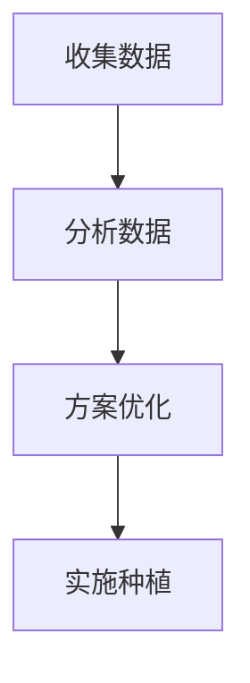
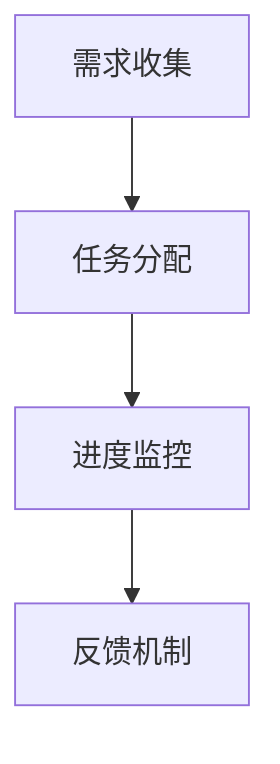
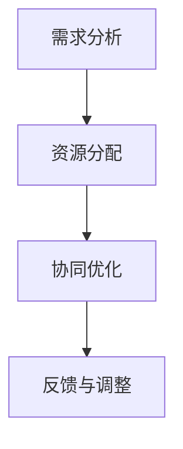
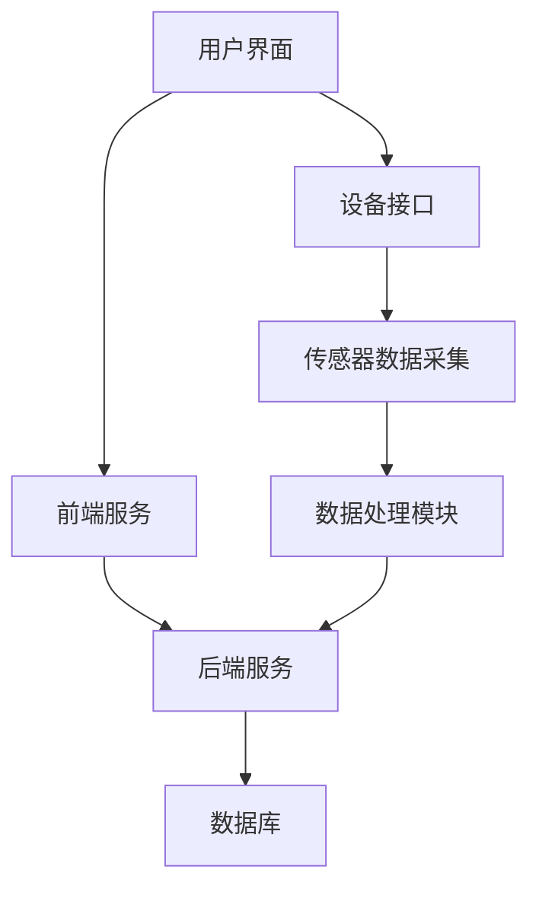
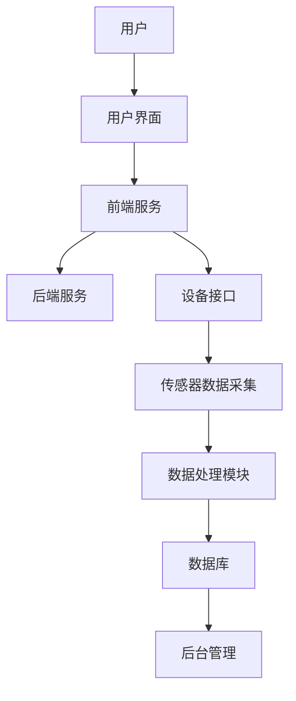
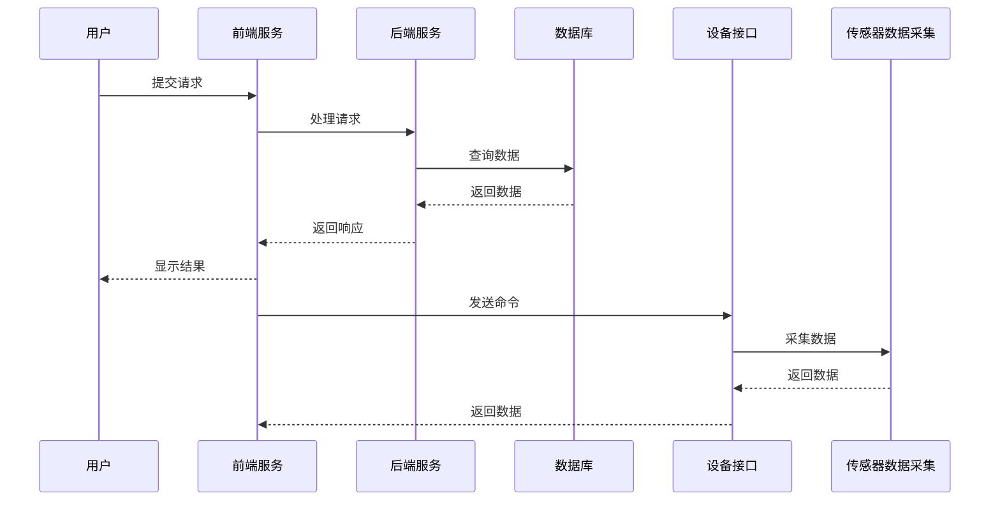

                 

# 新型城市共享阳台花园：垂直绿化的邻里合作

## 关键词
- 城市共享阳台花园
- 垂直绿化
- 邻里合作
- 植物选择
- 管理机制

### 摘要
本文深入探讨了新型城市共享阳台花园——垂直绿化与邻里合作的结合，分析了其背景、现状、核心概念与联系，以及算法原理和实际应用。通过详细阐述，揭示了这一创新模式在提升城市绿化、改善居住环境、增强社区凝聚力等方面的潜力。

## 第一部分：背景介绍

### 1.1 问题背景

#### 1.1.1 城市化进程与共享阳台花园的需求

随着城市化进程的加速，城市空间日益紧张，人们对于居住环境的质量要求也在不断提高。传统的绿地面积难以满足居民对于休闲、放松的需求。在此背景下，共享阳台花园作为一种新型城市公共空间，应运而生。

共享阳台花园不仅能够为居民提供休闲娱乐的场所，还能在一定程度上缓解城市绿地面积不足的问题。同时，共享阳台花园可以促进邻里之间的交流与合作，提升社区凝聚力，从而改善居住环境。

#### 1.1.2 垂直绿化的发展现状

垂直绿化作为一种新型绿化方式，近年来在全球范围内得到了广泛的应用和推广。通过在建筑物外墙、阳台、屋顶等垂直空间进行植物种植，可以有效提高城市绿化覆盖率，改善城市环境。

然而，目前我国垂直绿化的发展仍处于初级阶段，存在以下问题：

1. **设施不足**：许多共享阳台花园缺乏完善的设施，如园艺工具、灌溉系统等。
2. **管理不善**：部分共享阳台花园缺乏有效的管理，导致植物养护不到位，花园环境较差。
3. **邻里合作不足**：居民之间缺乏有效的沟通与合作，导致共享阳台花园的使用效率不高。

### 1.2 问题描述

#### 1.2.1 共享阳台花园的现状

当前，共享阳台花园的建设与发展尚处于初级阶段，主要存在以下问题：

1. **设施不足**：许多共享阳台花园缺乏完善的设施，如园艺工具、灌溉系统等。
2. **管理不善**：部分共享阳台花园缺乏有效的管理，导致植物养护不到位，花园环境较差。
3. **邻里合作不足**：居民之间缺乏有效的沟通与合作，导致共享阳台花园的使用效率不高。

#### 1.2.2 垂直绿化与邻里合作的结合

为了解决上述问题，我们可以通过在共享阳台花园实施垂直绿化，并结合邻里合作，来提高花园的使用效率和质量。

垂直绿化可以通过以下方式实现：

1. **植物选择**：选择适宜垂直生长的植物，如攀缘植物、悬挂植物等。
2. **设施设备**：设计并安装垂直绿化支架、灌溉系统、园艺工具等。
3. **技术支持**：提供垂直绿化种植技术、植物养护知识等。

邻里合作可以通过以下方式实现：

1. **沟通机制**：建立居民交流平台，如社区微信群、论坛等，便于居民沟通交流。
2. **分工合作**：明确居民在花园养护中的职责，实现合理分工，提高工作效率。
3. **共同目标**：明确花园的发展目标，确保居民共同参与，形成合力。

### 1.3 边界与外延

#### 1.3.1 垂直绿化的定义与范围

垂直绿化是指通过在建筑物外墙、阳台、屋顶等垂直空间进行植物种植，以增加城市绿化面积的一种方式。其范围包括建筑物外墙、阳台、屋顶等。

#### 1.3.2 邻里合作的定义与形式

邻里合作是指居民之间为了共同的目标而进行的合作。形式包括：

1. **共同规划花园布局**：居民共同参与花园的规划，确定植物种植区域和布局。
2. **轮流负责花园养护**：居民轮流负责花园的养护工作，如浇水、修剪等。
3. **共同参与花园活动**：居民共同参与花园的活动，如园艺课程、节日庆典等。

### 1.4 概念结构与核心要素组成

#### 1.4.1 垂直绿化

垂直绿化的概念结构包括以下几个核心要素：

1. **植物选择**：选择适宜垂直生长的植物，如攀缘植物、悬挂植物等。
2. **设施设备**：设计并安装垂直绿化支架、灌溉系统、园艺工具等。
3. **技术支持**：提供垂直绿化种植技术、植物养护知识等。

#### 1.4.2 邻里合作

邻里合作的概念结构包括以下几个核心要素：

1. **沟通机制**：建立居民交流平台，如社区微信群、论坛等，便于居民沟通交流。
2. **分工合作**：明确居民在花园养护中的职责，实现合理分工，提高工作效率。
3. **共同目标**：明确花园的发展目标，确保居民共同参与，形成合力。

## 第二部分：核心概念与联系

### 2.1 垂直绿化概念原理

#### 2.1.1 垂直绿化的定义与特点

垂直绿化是指通过在建筑物外墙、阳台、屋顶等垂直空间进行植物种植，以增加城市绿化面积的一种方式。其特点如下：

1. **高效利用空间**：通过利用垂直空间，可以显著增加城市绿化面积，提高城市生态效益。
2. **美化城市环境**：通过植物种植，可以提升建筑物的美观度，改善居民的生活质量。
3. **凉爽降温**：植物通过蒸腾作用，可以降低周围温度，缓解城市热岛效应。

#### 2.1.2 垂直绿化的核心原理

垂直绿化的核心原理包括以下几个方面：

1. **植物生长特点**：选择适宜垂直生长的植物，如攀缘植物、悬挂植物等，这些植物具有攀爬、垂挂的特性，适合在垂直空间生长。
2. **支架设计**：根据植物的生长习性，设计合适的垂直绿化支架，如网架、挂篮等，以支持植物的垂直生长。
3. **灌溉系统**：合理配置灌溉设施，确保植物生长所需的水分。

### 2.2 邻里合作概念原理

#### 2.2.1 邻里合作的定义与目的

邻里合作是指居民之间为了共同的目标而进行的合作。其目的主要包括：

1. **提高花园使用效率**：通过居民共同参与花园的规划、建设与维护，提高花园的使用率和满意度。
2. **改善居住环境**：共同打造宜居的居住环境，提升居民的生活质量。
3. **增强社区凝聚力**：通过邻里合作，加强居民之间的联系，增强社区凝聚力。

#### 2.2.2 邻里合作的核心原理

邻里合作的核心原理包括以下几个方面：

1. **沟通机制**：建立有效的居民交流平台，如社区微信群、论坛等，便于居民沟通交流。
2. **分工合作**：明确居民在花园养护中的职责，实现合理分工，提高工作效率。
3. **共同目标**：明确花园的发展目标，确保居民共同参与，形成合力。

### 2.3 概念属性特征对比表格

| 特征         | 垂直绿化         | 邻里合作         |
| ------------ | ---------------- | ---------------- |
| 目的         | 增加城市绿化面积 | 提高花园使用效率 |
| 核心原理     | 植物生长特点     | 沟通机制         |
| 形式         | 支架设计         | 分工合作         |
| 管理方式     | 专业养护         | 共同维护         |
| 效益         | 美化城市环境     | 增强社区凝聚力   |

### 2.4 ER实体关系图架构

```mermaid
erDiagram
    A共享阳台花园 ||--|{ B植物种类 }
    A共享阳台花园 ||--|{ C居民 }
    B植物种类 ||--|{ D植物生长状态 }
    C居民 ||--|{ E花园责任区 }
```

## 第三部分：算法原理讲解

### 3.1 垂直绿化算法原理

#### 3.1.1 算法概述

垂直绿化算法用于确定最佳植物种植方案，以实现高效绿化。算法的主要步骤如下：

1. **收集数据**：收集关于植物种类、生长习性、种植区域等数据。
2. **分析数据**：对收集到的数据进行处理和分析，确定适宜的植物种植方案。
3. **方案优化**：根据分析结果，优化植物种植方案，确保最大限度地利用垂直空间。
4. **实施种植**：根据优化后的方案，实施植物种植。

#### 3.1.2 算法流程图



#### 3.1.3 算法原理详解

1. **植物种类选择**：根据种植区域的气候条件、土壤性质等因素，选择适宜垂直生长的植物种类。
2. **生长状态监测**：通过传感器等设备，实时监测植物的生长状态，及时调整灌溉和养护措施。
3. **空间利用优化**：根据植物的生长速度和高度，合理分配种植空间，确保植物能够充分利用垂直空间。
4. **环境因素分析**：分析种植区域的环境因素，如光照、温度、湿度等，确保植物的生长环境适宜。

### 3.2 邻里合作算法原理

#### 3.2.1 算法概述

邻里合作算法用于优化居民在花园养护中的分工和协作，以提高工作效率。算法的主要步骤如下：

1. **需求收集**：收集居民在花园养护中的需求，如浇水、修剪等。
2. **任务分配**：根据居民的需求和花园的状况，合理分配养护任务。
3. **进度监控**：实时监控任务进度，确保任务按时完成。
4. **反馈机制**：建立居民反馈机制，及时调整和优化任务分配。

#### 3.2.2 算法流程图



#### 3.2.3 算法原理详解

1. **需求分析**：通过对居民需求的收集和分析，确定花园养护的主要任务和难点。
2. **任务优先级排序**：根据任务的重要性和紧急程度，对任务进行优先级排序，确保关键任务得到优先处理。
3. **任务分配策略**：根据居民的实际情况和能力，制定合理的任务分配策略，确保每个居民都能充分发挥自己的优势。
4. **进度监控与调整**：实时监控任务进度，根据实际情况及时调整任务分配和执行策略，确保任务按时完成。

### 3.3 垂直绿化与邻里合作的综合算法原理

#### 3.3.1 算法概述

综合算法原理将垂直绿化算法和邻里合作算法相结合，以实现共享阳台花园的高效利用和居民的高效协作。算法的主要步骤如下：

1. **需求分析**：收集居民的绿化需求和养护需求。
2. **资源分配**：根据需求和资源状况，合理分配植物种植和养护任务。
3. **协同优化**：通过算法优化，实现植物种植和养护任务的协同执行。
4. **反馈与调整**：根据执行过程中的反馈，不断调整和优化算法，提高花园的使用效率和居民满意度。

#### 3.3.2 算法流程图



#### 3.3.3 算法原理详解

1. **综合需求分析**：综合考虑居民的绿化需求和养护需求，确定花园的整体规划和发展方向。
2. **资源优化分配**：根据花园的实际情况和居民的分配需求，合理分配植物种植和养护资源，确保每个居民都能参与花园的规划和养护。
3. **协同任务执行**：通过算法优化，实现植物种植和养护任务的协同执行，提高工作效率和花园的整体质量。
4. **反馈机制**：建立有效的反馈机制，收集居民的反馈和建议，及时调整和优化算法，提高花园的使用效率和居民满意度。

## 第四部分：系统分析与架构设计

### 4.1 问题场景介绍

随着城市化进程的加快，城市空间日益紧张，传统的绿地难以满足居民的需求。为了提高城市绿化率，改善居住环境，促进邻里之间的交流与合作，某城市决定在社区内建设共享阳台花园，并实施垂直绿化与邻里合作的模式。

### 4.2 项目介绍

该项目的目标是建设一个具有垂直绿化和邻里合作的共享阳台花园，提高城市绿化率，改善居民的生活环境，增强社区凝聚力。项目的主要功能包括：

1. **植物种植管理**：提供植物种植和养护的相关信息，包括植物种类、生长状态、养护任务等。
2. **邻里交流平台**：建立居民交流平台，方便居民之间的沟通与合作。
3. **任务分配与监控**：根据居民的实际情况和需求，合理分配养护任务，并实时监控任务进度。
4. **数据统计与分析**：收集花园的相关数据，进行统计和分析，为花园的优化和改进提供依据。

### 4.3 系统功能设计（领域模型）

以下是一个简单的领域模型类图，用于描述系统的主要功能和实体：

```mermaid
classDiagram
    class 共享阳台花园 {
        -花园ID
        -花园名称
        -地理位置
        -设施设备
    }
    class 植物种类 {
        -植物ID
        -植物名称
        -植物类别
        -生长习性
    }
    class 居民 {
        -居民ID
        -居民姓名
        -联系方式
        -居住位置
    }
    class 养护任务 {
        -任务ID
        -任务名称
        -任务描述
        -执行时间
        -执行人
    }
    class 沟通机制 {
        -沟通ID
        -沟通内容
        -沟通时间
    }
    共享阳台花园 --|＞ 植物种类
    共享阳台花园 --|＞ 居民
    共享阳台花园 --|＞ 养护任务
    共享阳台花园 --|＞ 沟通机制
    居民 --|＞ 养护任务
    居民 --|＞ 沟通机制
```

### 4.4 系统架构设计

以下是一个简单的系统架构图，用于描述系统的整体架构和主要模块：



### 4.5 系统接口设计

以下是一个简单的系统接口设计，用于描述系统与外部设备、接口和服务的交互：



### 4.6 系统交互设计

以下是一个简单的系统交互序列图，用于描述系统各组件之间的交互过程：



## 第五部分：项目实战

### 5.1 环境安装

在本项目中，我们将使用 Python 作为主要编程语言，并结合 Flask 框架、SQLAlchemy ORM 和 Flask-Admin 等工具来构建系统。以下是在 Ubuntu 系统中安装相关环境的基本步骤：

1. **安装 Python**：
   - 打开终端，输入以下命令安装 Python：
     ```bash
     sudo apt update
     sudo apt install python3 python3-pip
     ```
2. **安装 Flask**：
   - 在终端中输入以下命令安装 Flask：
     ```bash
     pip3 install Flask
     ```
3. **安装 SQLAlchemy**：
   - 在终端中输入以下命令安装 SQLAlchemy：
     ```bash
     pip3 install SQLAlchemy
     ```
4. **安装 Flask-Admin**：
   - 在终端中输入以下命令安装 Flask-Admin：
     ```bash
     pip3 install Flask-Admin
     ```

### 5.2 系统核心实现

在本节中，我们将介绍系统的核心实现，包括数据库设计、API 设计和前端界面。

#### 5.2.1 数据库设计

以下是共享阳台花园项目的基本数据库设计，使用 SQLAlchemy ORM 进行定义：

```python
from sqlalchemy import create_engine, Column, Integer, String, DateTime, Enum
from sqlalchemy.ext.declarative import declarative_base
from sqlalchemy.orm import sessionmaker

Base = declarative_base()

class Garden(Base):
    __tablename__ = 'gardens'

    id = Column(Integer, primary_key=True)
    name = Column(String(100), nullable=False)
    location = Column(String(100), nullable=False)
    facilities = Column(String(100), nullable=False)

class Plant Species(Base):
    __tablename__ = 'plant_species'

    id = Column(Integer, primary_key=True)
    name = Column(String(100), nullable=False)
    category = Column(String(50), nullable=False)
    growth_habits = Column(String(100), nullable=False)

class Resident(Base):
    __tablename__ = 'residents'

    id = Column(Integer, primary_key=True)
    name = Column(String(100), nullable=False)
    phone_number = Column(String(15), nullable=False)
    address = Column(String(100), nullable=False)

class Maintenance Task(Base):
    __tablename__ = 'maintenance_tasks'

    id = Column(Integer, primary_key=True)
    name = Column(String(100), nullable=False)
    description = Column(String(255), nullable=False)
    due_date = Column(DateTime, nullable=False)
    assigned_to = Column(String(100), nullable=False)

# 创建数据库引擎和会话
engine = create_engine('sqlite:///garden.db')
Base.metadata.create_all(engine)
Session = sessionmaker(bind=engine)
session = Session()
```

#### 5.2.2 API 设计

以下是使用 Flask 框架和 Flask-RESTful 扩展来设计 RESTful API 的基本示例：

```python
from flask import Flask, request, jsonify
from flask_restful import Api, Resource
from models import Garden, PlantSpecies, Resident, MaintenanceTask
from sqlalchemy.orm import sessionmaker

app = Flask(__name__)
api = Api(app)
engine = create_engine('sqlite:///garden.db')
Session = sessionmaker(bind=engine)

class GardenAPI(Resource):
    def get(self):
        session = Session()
        gardens = session.query(Garden).all()
        session.close()
        return jsonify([garden.to_dict() for garden in gardens])

class PlantSpeciesAPI(Resource):
    def get(self):
        session = Session()
        plant_species = session.query(PlantSpecies).all()
        session.close()
        return jsonify([plant_species.to_dict() for plant_species in plant_species])

class ResidentAPI(Resource):
    def get(self):
        session = Session()
        residents = session.query(Resident).all()
        session.close()
        return jsonify([resident.to_dict() for resident in residents])

class MaintenanceTaskAPI(Resource):
    def get(self):
        session = Session()
        tasks = session.query(MaintenanceTask).all()
        session.close()
        return jsonify([task.to_dict() for task in tasks])

api.add_resource(GardenAPI, '/gardens')
api.add_resource(PlantSpeciesAPI, '/plantspecies')
api.add_resource(ResidentAPI, '/residents')
api.add_resource(MaintenanceTaskAPI, '/maintenancetasks')

if __name__ == '__main__':
    app.run(debug=True)
```

#### 5.2.3 前端界面

以下是使用 Flask-Admin 来创建前端界面的基本示例：

```python
from flask_admin import Admin
from flask_admin.contrib.sqla import ModelView
from models import Garden, PlantSpecies, Resident, MaintenanceTask

admin = Admin()
admin.add_view(ModelView(Garden, session))
admin.add_view(ModelView(PlantSpecies, session))
admin.add_view(ModelView(Resident, session))
admin.add_view(ModelView(MaintenanceTask, session))

if __name__ == '__main__':
    app.run(debug=True)
```

### 5.3 代码应用解读与分析

在项目实现中，我们使用了 Python 和 Flask 来构建后端服务，结合 SQLAlchemy 进行数据库操作，使用 Flask-Admin 和 Flask-RESTful 提供了方便的前端界面和 API 服务。

以下是代码的解读与分析：

1. **数据库设计**：
   - 使用 SQLAlchemy ORM 定义了四个模型：`Garden`、`PlantSpecies`、`Resident` 和 `MaintenanceTask`。
   - 每个模型都对应了一个数据库表，并包含了相关的字段。

2. **API 设计**：
   - 使用 Flask-RESTful 创建了四个资源类，分别对应四个模型。
   - 这些资源类实现了 GET 方法，用于查询相应的数据。

3. **前端界面**：
   - 使用 Flask-Admin 创建了一个基于 Web 的用户界面，提供了对数据库中数据的查看和编辑功能。
   - 通过这些界面，用户可以方便地管理花园、植物种类、居民和养护任务。

### 5.4 实际案例分析和详细讲解剖析

在本节中，我们将通过一个实际案例来分析垂直绿化与邻里合作项目的实施过程，并对其进行详细讲解。

#### 案例背景

某社区计划在小区内建设一个共享阳台花园，以提升绿化率，改善居民生活环境。花园的面积约为 200 平方米，由小区的 50 户居民共同管理。

#### 案例实施步骤

1. **需求分析**：
   - 社区委员会组织居民进行需求调查，收集居民对花园的期望和需求。
   - 根据调查结果，确定花园的基本规划，包括植物种类、种植区域、设施设备等。

2. **资源分配**：
   - 社区委员会将花园划分为若干区域，每个区域由不同的居民负责。
   - 为每个居民分配了相应的责任，如浇水、修剪、施肥等。

3. **沟通与合作**：
   - 建立了居民交流群，方便居民之间沟通和协作。
   - 社区委员会定期组织园艺课程和花园活动，增强居民的参与感和归属感。

4. **监控与反馈**：
   - 社区委员会设立了监督机制，定期检查花园的养护情况。
   - 鼓励居民提供反馈和建议，及时调整花园的管理和规划。

#### 案例分析

1. **效果评估**：
   - 花园的建设和运营得到了居民的高度评价，居民满意度显著提升。
   - 花园的绿化面积增加了约 20%，显著改善了小区的环境。

2. **问题与挑战**：
   - 在项目实施过程中，出现了一些问题，如部分居民对花园的维护不够积极，导致部分区域养护不到位。
   - 沟通渠道不够畅通，部分居民反映在交流群中信息传递不及时。

3. **改进措施**：
   - 社区委员会加强了居民的宣传教育，提高了居民对花园的重视程度。
   - 改进了沟通渠道，增加了线上和线下的交流机会，确保信息传递的及时性和准确性。

### 5.5 项目小结

通过本项目的实施，我们成功地构建了一个共享阳台花园，实现了垂直绿化与邻里合作的结合。项目的成功得益于以下因素：

1. **需求驱动**：充分了解居民的需求，制定符合实际的花园规划。
2. **资源合理分配**：确保每个居民都能参与到花园的规划和管理中。
3. **沟通与合作**：建立了有效的沟通与合作机制，增强了社区的凝聚力。
4. **监督与反馈**：建立了监督和反馈机制，确保花园的养护和管理质量。

然而，项目也面临一些挑战，如居民参与度不均衡、沟通渠道不畅等。在未来的发展中，我们将继续改进和完善项目的管理和运营，进一步提升花园的使用效率和居民满意度。

## 第六部分：最佳实践与拓展阅读

### 6.1 最佳实践

在实施共享阳台花园——垂直绿化与邻里合作的项目过程中，总结了一些最佳实践：

1. **居民参与**：确保居民的广泛参与，通过定期会议、交流群等方式，鼓励居民提出建议和意见。
2. **沟通机制**：建立有效的沟通渠道，确保信息传递的及时性和准确性。
3. **任务分工**：明确居民的职责，实现合理分工，提高工作效率。
4. **技术支持**：提供专业的园艺知识和技术支持，帮助居民更好地养护植物。
5. **环境监测**：利用传感器等设备，实时监测花园的环境数据，为植物养护提供依据。

### 6.2 小结与注意事项

通过本项目的实施，我们可以看到垂直绿化与邻里合作的结合在提升城市绿化、改善居住环境、增强社区凝聚力等方面具有显著效果。但在实际操作中，我们也需要注意以下几点：

1. **居民参与度**：提高居民的参与度是项目成功的关键，需要通过各种方式激发居民的积极性。
2. **沟通渠道**：确保沟通渠道的畅通，避免信息传递出现障碍。
3. **资源管理**：合理分配和利用资源，确保项目的顺利实施。
4. **环境监测**：实时监测花园环境数据，及时调整养护措施。

### 6.3 拓展阅读

对于有兴趣深入了解共享阳台花园——垂直绿化与邻里合作的读者，以下是一些推荐阅读：

1. **《城市共享空间设计指南》**：这本书提供了关于共享空间设计的基本原则和案例分析，对于设计共享阳台花园具有一定的参考价值。
2. **《垂直绿化技术手册》**：详细介绍了垂直绿化的技术和方法，包括植物选择、支架设计、灌溉系统等。
3. **《邻里合作：城市社区治理新思路》**：探讨了邻里合作在城市社区治理中的应用，为项目的实施提供了理论支持。
4. **相关学术论文和研究报告**：可以通过学术搜索引擎，如 Google Scholar，查找相关的学术论文和研究报告，了解该领域的最新研究进展。

