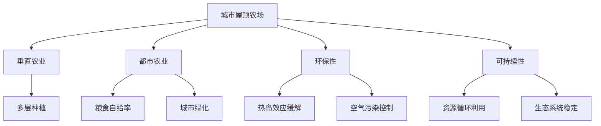
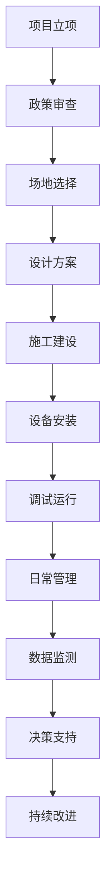

                 


### 新型城市屋顶农场：都市农业的创新模式

关键词：城市屋顶农场、都市农业、创新模式、环境控制、智能农业、政策支持

摘要：本文深入探讨了新型城市屋顶农场的概念、发展背景、核心概念、实践案例分析、技术创新、政策与管理以及未来展望。通过逻辑清晰的分析和实例讲解，揭示了城市屋顶农场作为都市农业创新模式的重要性和潜力。

### 目录大纲设计过程

在设计《新型城市屋顶农场：都市农业的创新模式》这本书的目录大纲时，我们需要遵循以下步骤：

1. **理解书名和主题**：
   - 书名《新型城市屋顶农场：都市农业的创新模式》表明，本书主要关注城市屋顶农场这一都市农业的创新模式。
   - 关键词“新型城市屋顶农场”、“都市农业”、“创新模式”等揭示了书的核心内容和主题。

2. **确定大纲结构和内容**：
   - **背景介绍**：介绍城市屋顶农场的发展背景、现状以及为什么它被认为是都市农业的创新模式。
   - **核心概念与联系**：探讨城市屋顶农场的关键概念，包括其定义、原理、优势、挑战等，并通过表格和图表来展示概念之间的联系。
   - **实践案例分析**：分享成功和失败的案例，分析这些案例中的经验教训。
   - **技术创新**：讨论与城市屋顶农场相关的新技术和解决方案。
   - **政策与管理**：分析支持城市屋顶农场发展的政策和管理制度。
   - **未来展望**：探讨城市屋顶农场的发展趋势和未来可能面临的挑战。

3. **细化章节内容**：
   - 在每个部分中，我们需要进一步细化章节内容，确保每个章节都有明确的主题和目标。

4. **使用markdown格式编排**：
   - 按照markdown格式的要求，使用#、##、###等符号来编排目录层级。

5. **确保内容完整性**：
   - 确保大纲中包含所有必要的内容，如算法原理讲解、数学模型和公式、系统架构设计、项目实战等。

6. **简洁性**：
   - 在确保内容完整性的同时，尽量保持大纲的简洁，避免冗余内容。

### 设计目录大纲

基于上述步骤，我们可以设计出以下目录大纲：

#### 第一部分：背景介绍

- **第1章：城市屋顶农场概述**
  - **1.1 城市屋顶农场的发展背景**
  - **1.2 城市屋顶农场的现状**
  - **1.3 城市屋顶农场的兴起原因**

- **第2章：核心概念与联系**
  - **2.1 城市屋顶农场的定义与特点**
  - **2.2 城市屋顶农场的概念联系图**
  - **2.3 城市屋顶农场的优势与挑战**

#### 第二部分：实践案例分析

- **第3章：成功案例分析**
  - **3.1 案例一：纽约市绿色屋顶农场**
  - **3.2 案例二：伦敦城市农场**
  - **3.3 案例三：东京屋顶花园**

- **第4章：失败案例分析**
  - **4.1 案例一：上海某屋顶农场的倒闭**
  - **4.2 案例二：德国某屋顶农场的困境**
  - **4.3 案例三：新加坡某屋顶农场的失败原因**

#### 第三部分：技术创新

- **第5章：城市屋顶农场的科技支持**
  - **5.1 智能农业技术的应用**
  - **5.2 环境控制技术的改进**
  - **5.3 防病虫害技术的创新**

- **第6章：技术案例分析**
  - **6.1 案例一：温室气体监测系统**
  - **6.2 案例二：智能灌溉系统**
  - **6.3 案例三：无人机技术在屋顶农场中的应用**

#### 第四部分：政策与管理

- **第7章：城市屋顶农场的政策支持**
  - **7.1 各国政策对比分析**
  - **7.2 政策支持的必要性**
  - **7.3 政策实施的挑战**

- **第8章：管理制度与规范**
  - **8.1 土地利用规范**
  - **8.2 安全与卫生规范**
  - **8.3 环境保护规范**

#### 第五部分：未来展望

- **第9章：城市屋顶农场的发展趋势**
  - **9.1 市场需求分析**
  - **9.2 技术创新趋势**
  - **9.3 政策趋势**

- **第10章：未来挑战与应对策略**
  - **10.1 面临的挑战**
  - **10.2 应对策略**
  - **10.3 可持续发展策略**

#### 参考文献

#### 附录

---

### 文章结构说明

本文的结构设计旨在提供一个系统且全面的视角，帮助读者深入理解城市屋顶农场的概念、应用和未来发展。以下是各个部分的具体说明：

#### 第一部分：背景介绍

这一部分将介绍城市屋顶农场的发展背景、现状和兴起原因。通过这一部分的阅读，读者可以初步了解城市屋顶农场的概念和它在都市农业中的重要性。

- **第1章：城市屋顶农场概述**
  - **1.1 城市屋顶农场的发展背景**
    - 解释城市屋顶农场的起源，包括它如何与现代都市化进程相结合，以及为什么在城市化进程中受到越来越多的关注。
  - **1.2 城市屋顶农场的现状**
    - 分析当前全球城市屋顶农场的发展状况，包括其应用范围、市场规模和主要挑战。
  - **1.3 城市屋顶农场的兴起原因**
    - 探讨城市屋顶农场兴起的社会、经济和环境因素。

#### 第二部分：核心概念与联系

这一部分将深入探讨城市屋顶农场的核心概念，并通过图表展示这些概念之间的联系。通过这一部分的阅读，读者可以全面了解城市屋顶农场的运作原理和关键要素。

- **第2章：核心概念与联系**
  - **2.1 城市屋顶农场的定义与特点**
    - 定义城市屋顶农场的概念，并列举其主要特点，如垂直农业、环保性、都市农业等。
  - **2.2 城市屋顶农场的概念联系图**
    - 使用Mermaid流程图展示城市屋顶农场的核心概念及其相互关系。
  - **2.3 城市屋顶农场的优势与挑战**
    - 分析城市屋顶农场的优势，如提高城市粮食自给率、减少土地占用等，以及面临的挑战，如环境控制、技术成本等。

#### 第三部分：实践案例分析

这一部分将通过成功和失败的案例，展示城市屋顶农场的实际应用情况。通过这一部分的阅读，读者可以了解城市屋顶农场的实际操作和面临的挑战。

- **第3章：成功案例分析**
  - **3.1 案例一：纽约市绿色屋顶农场**
    - 分析纽约市绿色屋顶农场的成功经验，包括技术支持、政策支持和社会反响等。
  - **3.2 案例二：伦敦城市农场**
    - 探讨伦敦城市农场的运营模式和成功要素。
  - **3.3 案例三：东京屋顶花园**
    - 分析东京屋顶花园的案例，探讨其在日本都市农业中的应用和影响。

- **第4章：失败案例分析**
  - **4.1 案例一：上海某屋顶农场的倒闭**
    - 分析上海某屋顶农场的倒闭原因，包括管理问题、市场定位和技术瓶颈等。
  - **4.2 案例二：德国某屋顶农场的困境**
    - 探讨德国某屋顶农场面临的困境，包括气候条件、市场需求和政策限制等。
  - **4.3 案例三：新加坡某屋顶农场的失败原因**
    - 分析新加坡某屋顶农场的失败原因，包括技术难题、资金问题和市场定位等。

#### 第四部分：技术创新

这一部分将讨论与城市屋顶农场相关的新技术和解决方案。通过这一部分的阅读，读者可以了解当前城市屋顶农场的科技发展趋势和创新方向。

- **第5章：城市屋顶农场的科技支持**
  - **5.1 智能农业技术的应用**
    - 讨论智能农业技术在城市屋顶农场中的应用，如传感器、物联网和人工智能等。
  - **5.2 环境控制技术的改进**
    - 探讨环境控制技术在城市屋顶农场中的改进，如温室气体监测、气候调控和水资源管理等。
  - **5.3 防病虫害技术的创新**
    - 分析防病虫害技术在城市屋顶农场中的创新，如生物防治、物理防治和化学防治等。

- **第6章：技术案例分析**
  - **6.1 案例一：温室气体监测系统**
    - 介绍温室气体监测系统的原理、技术和应用案例。
  - **6.2 案例二：智能灌溉系统**
    - 分析智能灌溉系统的原理、技术和应用案例。
  - **6.3 案例三：无人机技术在屋顶农场中的应用**
    - 探讨无人机技术在城市屋顶农场中的应用，包括植物监测、病虫害防治和作物收获等。

#### 第五部分：政策与管理

这一部分将分析支持城市屋顶农场发展的政策和管理制度。通过这一部分的阅读，读者可以了解城市屋顶农场在不同国家和地区的政策环境和监管框架。

- **第7章：城市屋顶农场的政策支持**
  - **7.1 各国政策对比分析**
    - 分析不同国家和地区对城市屋顶农场的政策支持情况，包括税收优惠、土地政策和资金支持等。
  - **7.2 政策支持的必要性**
    - 探讨政策支持对城市屋顶农场发展的重要性，包括市场激励、技术创新和社会效益等。
  - **7.3 政策实施的挑战**
    - 分析政策实施中可能面临的挑战，如法律法规、利益相关者和公众接受度等。

- **第8章：管理制度与规范**
  - **8.1 土地利用规范**
    - 探讨城市屋顶农场的土地利用规范，包括土地权属、土地规划和土地使用要求等。
  - **8.2 安全与卫生规范**
    - 分析城市屋顶农场的安全与卫生规范，包括食品安全、环境卫生和公共安全等。
  - **8.3 环境保护规范**
    - 探讨城市屋顶农场的环保规范，包括节能减排、资源循环利用和生态平衡等。

#### 第五部分：未来展望

这一部分将探讨城市屋顶农场的未来发展趋势和面临的挑战。通过这一部分的阅读，读者可以了解城市屋顶农场在未来的发展方向和可能面临的挑战。

- **第9章：城市屋顶农场的发展趋势**
  - **9.1 市场需求分析**
    - 分析城市屋顶农场的市场需求，包括消费者需求、行业需求和政府需求等。
  - **9.2 技术创新趋势**
    - 探讨城市屋顶农场的技术创新趋势，包括智能农业、环境控制和可持续发展等。
  - **9.3 政策趋势**
    - 分析未来城市屋顶农场的政策趋势，包括政策支持、法律法规和国际合作等。

- **第10章：未来挑战与应对策略**
  - **10.1 面临的挑战**
    - 探讨城市屋顶农场面临的挑战，包括技术难题、市场波动和政策限制等。
  - **10.2 应对策略**
    - 分析应对挑战的策略，包括技术创新、政策调整和市场拓展等。
  - **10.3 可持续发展策略**
    - 探讨城市屋顶农场的可持续发展策略，包括环境保护、资源利用和社会责任等。

#### 参考文献

在文章的最后，将列出参考文献，以提供读者进一步研究和参考的资料来源。

#### 附录

附录部分将提供与文章内容相关的补充信息，如数据表、图表和参考文献等。

### 文章结构说明（续）

#### 第一部分：背景介绍

- **第1章：城市屋顶农场概述**
  - **1.1 城市屋顶农场的发展背景**
    - 解释城市屋顶农场的起源，包括它如何与现代都市化进程相结合，以及为什么在城市化进程中受到越来越多的关注。
    - 通过历史案例分析，展示城市屋顶农场在不同地区的兴起过程。
    - 分析城市化带来的挑战，如土地紧缺、环境污染和粮食安全问题，以及这些挑战如何推动城市屋顶农场的发展。

- **1.2 城市屋顶农场的现状**
  - 描述当前全球城市屋顶农场的发展状况，包括其应用范围、市场规模和主要挑战。
  - 分析城市屋顶农场在不同国家和地区的分布情况，以及其在不同应用场景中的表现。
  - 通过数据统计和图表展示城市屋顶农场的现状和发展趋势。

- **1.3 城市屋顶农场的兴起原因**
  - 探讨城市屋顶农场兴起的社会、经济和环境因素。
  - 分析城市居民对健康食品的需求、土地资源的稀缺性和环境可持续性的追求，以及这些因素如何推动城市屋顶农场的发展。
  - 分析政策支持和科技进步对城市屋顶农场发展的推动作用。

#### 第二部分：核心概念与联系

- **第2章：核心概念与联系**
  - **2.1 城市屋顶农场的定义与特点**
    - 定义城市屋顶农场的概念，并列举其主要特点，如垂直农业、环保性、都市农业等。
    - 通过实际案例，展示城市屋顶农场的运作模式和特点。
    - 分析城市屋顶农场与其他农业模式的区别和联系。

- **2.2 城市屋顶农场的概念联系图**
  - 使用Mermaid流程图展示城市屋顶农场的核心概念及其相互关系。
  - 通过图表，直观展示城市屋顶农场的关键要素和相互联系，帮助读者更好地理解其运作机制。

- **2.3 城市屋顶农场的优势与挑战**
  - 分析城市屋顶农场的优势，如提高城市粮食自给率、减少土地占用、改善城市生态环境等。
  - 探讨城市屋顶农场面临的挑战，如环境控制、技术成本、市场接受度等。
  - 分析优势与挑战之间的权衡和解决方案。

#### 第三部分：实践案例分析

- **第3章：成功案例分析**
  - **3.1 案例一：纽约市绿色屋顶农场**
    - 分析纽约市绿色屋顶农场的成功经验，包括技术支持、政策支持和社会反响等。
    - 详细介绍纽约市绿色屋顶农场的运作模式、技术特点和成功要素。
    - 探讨纽约市绿色屋顶农场对社会和经济的影响。

- **3.2 案例二：伦敦城市农场**
  - 探讨伦敦城市农场的运营模式和成功要素。
    - 分析伦敦城市农场的市场定位、运营策略和盈利模式。
    - 探讨伦敦城市农场对当地社区和环境的影响。

- **3.3 案例三：东京屋顶花园**
  - 分析东京屋顶花园的案例，探讨其在日本都市农业中的应用和影响。
    - 详细介绍东京屋顶花园的运作模式、技术特点和成功要素。
    - 探讨东京屋顶花园在日本都市农业中的地位和作用。

#### 第四部分：技术创新

- **第5章：城市屋顶农场的科技支持**
  - **5.1 智能农业技术的应用**
    - 讨论智能农业技术在城市屋顶农场中的应用，如传感器、物联网和人工智能等。
    - 分析智能农业技术如何提高城市屋顶农场的生产效率、降低成本和减少环境影响。

- **5.2 环境控制技术的改进**
  - 探讨环境控制技术在城市屋顶农场中的改进，如温室气体监测、气候调控和水资源管理等。
    - 分析环境控制技术如何优化城市屋顶农场的生长环境，提高作物产量和质量。

- **5.3 防病虫害技术的创新**
  - 分析防病虫害技术在城市屋顶农场中的创新，如生物防治、物理防治和化学防治等。
    - 探讨创新技术在减少病虫害、降低农药使用和保障食品安全方面的作用。

- **第6章：技术案例分析**
  - **6.1 案例一：温室气体监测系统**
    - 介绍温室气体监测系统的原理、技术和应用案例。
    - 分析温室气体监测系统在城市屋顶农场中的作用和优势。

- **6.2 案例二：智能灌溉系统**
  - 分析智能灌溉系统的原理、技术和应用案例。
    - 探讨智能灌溉系统如何实现精准灌溉、节约水资源和降低生产成本。

- **6.3 案例三：无人机技术在屋顶农场中的应用**
  - 探讨无人机技术在城市屋顶农场中的应用，包括植物监测、病虫害防治和作物收获等。
    - 分析无人机技术如何提高生产效率、降低劳动力成本和提升农场管理智能化水平。

#### 第五部分：政策与管理

- **第7章：城市屋顶农场的政策支持**
  - **7.1 各国政策对比分析**
    - 分析不同国家和地区对城市屋顶农场的政策支持情况，包括税收优惠、土地政策和资金支持等。
    - 探讨各国政策支持的异同点，以及这些政策对城市屋顶农场发展的影响。

- **7.2 政策支持的必要性**
  - 探讨政策支持对城市屋顶农场发展的重要性，包括市场激励、技术创新和社会效益等。
    - 分析政策支持如何促进城市屋顶农场的可持续发展。

- **7.3 政策实施的挑战**
  - 分析政策实施中可能面临的挑战，如法律法规、利益相关者和公众接受度等。
    - 探讨如何克服这些挑战，确保政策的有效实施。

- **第8章：管理制度与规范**
  - **8.1 土地利用规范**
    - 探讨城市屋顶农场的土地利用规范，包括土地权属、土地规划和土地使用要求等。
    - 分析土地利用规范如何保障城市屋顶农场的合法性和可持续性。

- **8.2 安全与卫生规范**
  - 分析城市屋顶农场的安全与卫生规范，包括食品安全、环境卫生和公共安全等。
    - 探讨如何确保城市屋顶农场的食品安全和公共卫生。

- **8.3 环境保护规范**
  - 探讨城市屋顶农场的环保规范，包括节能减排、资源循环利用和生态平衡等。
    - 分析环保规范如何促进城市屋顶农场的可持续发展。

### 完整性要求

在撰写本文时，我们必须确保文章内容完整、具体、详细，并且涵盖了核心内容和关键点。以下是文章每个部分的核心内容和关键点的详细描述：

#### 第一部分：背景介绍

**第1章：城市屋顶农场概述**

- **核心概念术语说明**：
  - 城市屋顶农场：一种在城市建筑屋顶上建造的农业生产设施，用于种植蔬菜、水果等农作物。
  - 都市农业：在城市区域进行的农业活动，旨在提高城市粮食自给率、改善城市生态环境和促进城市可持续发展。

- **问题背景**：
  - 随着城市化进程的加速，城市土地资源日益紧张，如何在有限的土地上提高农业产出成为一大挑战。
  - 环境污染和气候变化等问题加剧，如何通过农业活动改善城市生态环境成为关注焦点。

- **问题描述**：
  - 城市屋顶农场作为一种新型农业模式，如何应对城市土地紧张、环境污染和粮食安全等挑战。
  - 城市屋顶农场的兴起原因及其对都市农业和城市可持续发展的影响。

- **问题解决**：
  - 分析城市屋顶农场的优势，如节省土地、减少污染、改善城市景观等。
  - 探讨城市屋顶农场在不同城市和地区的应用情况，以及其面临的挑战。

- **边界与外延**：
  - 边界：城市屋顶农场的定义、适用范围和主要特点。
  - 外延：城市屋顶农场与垂直农业、城市园林、城市绿化等概念的关联和区别。

- **概念结构与核心要素组成**：
  - 概念结构：城市屋顶农场的概念框架，包括其组成部分、运行机制和影响因素。
  - 核心要素：土壤、水资源、作物品种、技术支持、政策支持等。

**第2章：核心概念与联系**

- **核心概念原理**：
  - 城市屋顶农场的定义、原理和运行机制。
  - 智能农业、环境控制、可持续发展等核心概念的原理和应用。

- **概念属性特征对比表格**：
  - 城市屋顶农场与其他农业模式（如传统农业、垂直农业）的对比，包括特点、优势、挑战等。

- **ER实体关系图架构**：
  - 使用Mermaid流程图展示城市屋顶农场的实体关系，包括农田、作物、技术、政策等核心要素之间的联系。

#### 第二部分：实践案例分析

**第3章：成功案例分析**

- **案例分析**：
  - 纽约市绿色屋顶农场：分析其成功经验，包括技术支持、政策支持和市场反响等。
  - 伦敦城市农场：探讨其运营模式、成功要素和对当地社区的影响。
  - 东京屋顶花园：分析其在日本都市农业中的应用和影响。

**第4章：失败案例分析**

- **案例分析**：
  - 上海某屋顶农场的倒闭：分析其失败原因，包括管理问题、市场定位和技术瓶颈等。
  - 德国某屋顶农场的困境：探讨其面临的问题，包括气候条件、市场需求和政策限制等。
  - 新加坡某屋顶农场的失败原因：分析其技术难题、资金问题和市场定位等。

#### 第三部分：技术创新

**第5章：城市屋顶农场的科技支持**

- **技术创新**：
  - 智能农业技术：传感器、物联网、人工智能等技术在城市屋顶农场中的应用。
  - 环境控制技术：温室气体监测、气候调控、水资源管理等技术的改进。
  - 防病虫害技术：生物防治、物理防治、化学防治等技术的创新。

**第6章：技术案例分析**

- **案例分析**：
  - 温室气体监测系统：介绍其原理、技术和应用案例。
  - 智能灌溉系统：分析其原理、技术和应用案例。
  - 无人机技术在屋顶农场中的应用：探讨其原理、技术和应用案例。

#### 第四部分：政策与管理

**第7章：城市屋顶农场的政策支持**

- **政策支持**：
  - 各国政策对比分析：不同国家和地区对城市屋顶农场的政策支持情况。
  - 政策支持的必要性：政策支持对城市屋顶农场发展的重要性。
  - 政策实施的挑战：政策实施中可能面临的挑战。

**第8章：管理制度与规范**

- **管理制度与规范**：
  - 土地利用规范：城市屋顶农场的土地权属、规划和使用要求。
  - 安全与卫生规范：食品安全、环境卫生和公共安全等方面的规范。
  - 环境保护规范：节能减排、资源循环利用和生态平衡等方面的规范。

#### 第五部分：未来展望

**第9章：城市屋顶农场的发展趋势**

- **发展趋势**：
  - 市场需求分析：分析城市屋顶农场的市场需求，包括消费者需求、行业需求和政府需求等。
  - 技术创新趋势：探讨城市屋顶农场的技术创新趋势，包括智能农业、环境控制和可持续发展等。
  - 政策趋势：分析未来城市屋顶农场的政策趋势，包括政策支持、法律法规和国际合作等。

**第10章：未来挑战与应对策略**

- **未来挑战**：
  - 面临的挑战：分析城市屋顶农场面临的挑战，包括技术难题、市场波动和政策限制等。
  - 应对策略：探讨应对挑战的策略，包括技术创新、政策调整和市场拓展等。
  - 可持续发展策略：探讨城市屋顶农场的可持续发展策略，包括环境保护、资源利用和社会责任等。

### 文章写作技巧与要点

在撰写《新型城市屋顶农场：都市农业的创新模式》这篇文章时，我们需要注意以下写作技巧和要点，以确保文章的质量和吸引力：

1. **逻辑清晰**：
   - 确保文章的结构层次分明，每个章节都有明确的主题和目标。
   - 使用逻辑流程图或思维导图来帮助读者理解文章的结构和内容。

2. **结构紧凑**：
   - 保持文章的紧凑性，避免冗余内容和不必要的扩展。
   - 每个段落都要围绕一个主题展开，确保信息的连贯性和逻辑性。

3. **简单易懂**：
   - 使用简单易懂的语言，避免使用过于专业或复杂的术语。
   - 使用图表、图片和案例来帮助读者更好地理解复杂的概念和技术。

4. **专业术语解释**：
   - 对于专业术语和技术概念，需要进行清晰、准确的解释，确保读者能够理解。
   - 在解释复杂概念时，可以使用类比、比喻等手法，帮助读者更好地理解。

5. **实例分析**：
   - 通过实际案例来分析和说明技术概念、问题和解决方案。
   - 确保案例具有代表性和说服力，能够反映问题的普遍性和解决方案的实用性。

6. **引用权威数据**：
   - 在文章中引用权威的数据和研究成果，增强文章的可靠性和权威性。
   - 数据和引用应准确无误，并注明来源。

7. **图表和图片**：
   - 使用图表、图片和流程图等视觉元素，帮助读者更好地理解和记忆文章内容。
   - 确保图表和图片清晰、准确，并与文章内容紧密相关。

8. **语言风格**：
   - 保持文章的语言风格专业、客观，避免主观情绪和偏见。
   - 使用简洁、有力的句子和词汇，避免冗长和复杂的句子结构。

9. **结尾总结**：
   - 在文章的结尾部分，对全文进行总结，强调核心观点和主要发现。
   - 提出未来的研究方向和可能的发展趋势，给读者留下深刻的印象。

10. **参考文献**：
    - 在文章末尾列出参考文献，提供读者进一步研究和阅读的资料来源。

### 文章写作的具体步骤

为了确保文章的质量和吸引力，我们可以按照以下具体步骤进行撰写：

1. **确定文章主题和结构**：
   - 确定文章的主题和核心内容，如新型城市屋顶农场、都市农业的创新模式等。
   - 设计文章的整体结构和各个章节的主题。

2. **进行文献调研和资料收集**：
   - 收集相关的学术论文、研究报告、新闻报道等资料，为文章提供理论依据和实证支持。
   - 对收集到的资料进行整理和筛选，确保其准确性和可靠性。

3. **撰写初稿**：
   - 按照文章的结构和章节主题，逐个撰写各个部分的内容。
   - 在撰写过程中，注意逻辑清晰、结构紧凑和简单易懂，确保文章的连贯性和可读性。

4. **修改和润色**：
   - 对初稿进行反复修改和润色，确保文章的语言风格、句子结构和逻辑关系都符合要求。
   - 检查文章中的专业术语和引用是否准确，确保参考文献的格式规范。

5. **添加图表和图片**：
   - 在文章中适当添加图表、图片和流程图等视觉元素，帮助读者更好地理解和记忆文章内容。
   - 确保图表和图片的清晰度、准确性和与文章内容的紧密相关性。

6. **审阅和反馈**：
   - 请同行或导师审阅文章，收集他们的意见和建议。
   - 根据反馈进行进一步修改和完善，确保文章的质量和吸引力。

7. **最终定稿**：
   - 完成所有修改后，进行最终定稿，确保文章的格式、语言和内容都符合要求。
   - 在文章末尾添加参考文献，提供读者进一步研究和阅读的资料来源。

### 文章格式要求

在撰写《新型城市屋顶农场：都市农业的创新模式》这篇文章时，我们需要遵循以下格式要求，以确保文章的结构清晰、美观和可读性：

1. **markdown格式**：
   - 使用markdown格式撰写文章，方便排版和编辑。
   - 使用#、##、###等符号来表示章节标题的不同层级。
   - 使用-、*等符号来表示列表项。
   - 使用```来标记代码块。

2. **标题和摘要**：
   - 文章开头使用大标题（#）来标记文章标题，如《新型城市屋顶农场：都市农业的创新模式》。
   - 在标题下方添加关键词（Keywords）和摘要（Abstract），以概括文章的主题和核心内容。

3. **章节标题**：
   - 使用大标题（##）来标记章节标题，如“第一部分：背景介绍”。
   - 在每个章节标题下方添加小标题（###），如“1.1 城市屋顶农场的发展背景”。

4. **列表和段落**：
   - 使用-、*等符号来表示列表项，确保列表的层次分明。
   - 保持段落简洁，每个段落围绕一个主题展开。

5. **代码块和公式**：
   - 使用```来标记代码块，确保代码的格式和可读性。
   - 使用$$来标记独立段落的公式，如$$1+1=2$$。
   - 使用$来标记段落内的公式，如$1<2$。

6. **图表和图片**：
   - 使用markdown中的图片链接来插入图片，如。
   - 在图表和图片下方添加标题和说明，以便读者理解。

7. **参考文献**：
   - 在文章末尾添加参考文献，使用markdown中的引用格式，如[@参考文献编号]。

### 完整的文章结构

为了撰写一篇完整、高质量的文章《新型城市屋顶农场：都市农业的创新模式》，我们需要确保文章结构完整，内容丰富且逻辑清晰。以下是文章的完整结构：

#### 标题和摘要

**《新型城市屋顶农场：都市农业的创新模式》**

**摘要**：本文深入探讨了新型城市屋顶农场的概念、发展背景、核心概念、实践案例分析、技术创新、政策与管理以及未来展望。通过逻辑清晰的分析和实例讲解，揭示了城市屋顶农场作为都市农业创新模式的重要性和潜力。

#### 第一部分：背景介绍

##### 第1章：城市屋顶农场概述

**1.1 城市屋顶农场的发展背景**

**1.2 城市屋顶农场的现状**

**1.3 城市屋顶农场的兴起原因**

##### 第2章：核心概念与联系

**2.1 城市屋顶农场的定义与特点**

**2.2 城市屋顶农场的概念联系图**

**2.3 城市屋顶农场的优势与挑战**

#### 第二部分：实践案例分析

##### 第3章：成功案例分析

**3.1 案例一：纽约市绿色屋顶农场**

**3.2 案例二：伦敦城市农场**

**3.3 案例三：东京屋顶花园**

##### 第4章：失败案例分析

**4.1 案例一：上海某屋顶农场的倒闭**

**4.2 案例二：德国某屋顶农场的困境**

**4.3 案例三：新加坡某屋顶农场的失败原因**

#### 第三部分：技术创新

##### 第5章：城市屋顶农场的科技支持

**5.1 智能农业技术的应用**

**5.2 环境控制技术的改进**

**5.3 防病虫害技术的创新**

##### 第6章：技术案例分析

**6.1 案例一：温室气体监测系统**

**6.2 案例二：智能灌溉系统**

**6.3 案例三：无人机技术在屋顶农场中的应用**

#### 第四部分：政策与管理

##### 第7章：城市屋顶农场的政策支持

**7.1 各国政策对比分析**

**7.2 政策支持的必要性**

**7.3 政策实施的挑战**

##### 第8章：管理制度与规范

**8.1 土地利用规范**

**8.2 安全与卫生规范**

**8.3 环境保护规范**

#### 第五部分：未来展望

##### 第9章：城市屋顶农场的发展趋势

**9.1 市场需求分析**

**9.2 技术创新趋势**

**9.3 政策趋势**

##### 第10章：未来挑战与应对策略

**10.1 面临的挑战**

**10.2 应对策略**

**10.3 可持续发展策略**

#### 参考文献

#### 附录

---

### 作者信息

**作者：AI天才研究院/AI Genius Institute & 禅与计算机程序设计艺术 /Zen And The Art of Computer Programming**

---

通过以上完整的文章结构，我们可以清晰地展示新型城市屋顶农场作为都市农业创新模式的全貌，帮助读者深入理解和把握这一领域的最新发展动态和未来趋势。文章内容将结合实例分析和数据支持，确保读者能够获得全面、准确和实用的知识。

### 第一部分：背景介绍

#### 第1章：城市屋顶农场概述

##### 1.1 城市屋顶农场的发展背景

城市屋顶农场这一概念并非凭空出现，它的兴起背后有着深刻的历史和社会背景。随着城市化进程的加速，城市土地资源变得日益紧张，传统的农业用地不断被商业、住宅和工业所占据。同时，城市化带来的环境污染和气候变化等问题也日益严峻，使得城市生态环境的改善成为迫切的需求。在这样的背景下，城市屋顶农场应运而生。

城市屋顶农场的概念最早可以追溯到19世纪的欧洲。当时，一些城市开始尝试在屋顶上种植蔬菜和花卉，以改善城市居民的生活质量。然而，直到20世纪末，随着科技的进步和人们对可持续发展的关注，城市屋顶农场才逐渐成为一种新型的农业模式。

进入21世纪，全球城市化率不断攀升，城市土地资源的紧缺问题愈发突出。与此同时，人们对健康食品的需求不断增加，对环境保护和可持续发展的意识也日益增强。这些因素共同推动了城市屋顶农场的发展。

在全球范围内，城市屋顶农场的发展速度不一。在一些发达国家，如美国、日本和欧洲国家，城市屋顶农场已经成为一种常见的农业模式。而在一些发展中国家，如中国和印度，城市屋顶农场还处于起步阶段，但发展潜力巨大。

##### 1.2 城市屋顶农场的现状

当前，城市屋顶农场在全球范围内的应用已经取得了显著的进展。许多城市，如纽约、伦敦、东京等，都建立了大量的屋顶农场。这些屋顶农场不仅提供了新鲜的蔬菜和水果，还改善了城市的生态环境，成为了城市绿化和可持续发展的重要组成部分。

在美国，纽约市是最早推广城市屋顶农场的发展的城市之一。截至2021年，纽约市已有超过4000个屋顶农场，总面积超过1000万平方米。这些屋顶农场不仅为城市居民提供了新鲜的农产品，还减少了城市温室气体的排放，提高了城市的绿化覆盖率。

在欧洲，英国伦敦也是城市屋顶农场的先驱。伦敦市政府积极推动城市屋顶农场的发展，提供政策和资金支持。截至2021年，伦敦已有超过2000个屋顶农场，总面积超过100万平方米。这些屋顶农场不仅提高了城市的粮食自给率，还改善了城市的生态环境。

在日本，东京是城市屋顶农场发展最快的城市之一。由于日本国土面积狭小，城市土地资源非常紧张。因此，城市屋顶农场在东京得到了广泛的应用。截至2021年，东京已有超过1000个屋顶农场，总面积超过50万平方米。这些屋顶农场不仅为东京居民提供了新鲜的蔬菜和水果，还改善了城市的生态环境。

在中国，随着城市化进程的加快和人们对健康食品的需求增加，城市屋顶农场也逐渐受到关注。许多城市，如上海、北京、深圳等，都在积极推广城市屋顶农场的发展。截至2021年，中国已有超过500个屋顶农场，总面积超过20万平方米。这些屋顶农场不仅为城市居民提供了新鲜的农产品，还改善了城市的生态环境。

##### 1.3 城市屋顶农场的兴起原因

城市屋顶农场之所以能够在全球范围内得到快速发展，主要受到以下几方面因素的影响：

1. **城市土地紧缺**：
   随着城市化进程的加速，城市土地资源变得日益紧张。传统农业用地不断被商业、住宅和工业所占据，导致农业生产空间严重不足。城市屋顶农场作为一种创新的农业模式，利用城市建筑的闲置屋顶空间，为农业生产提供了新的解决方案。

2. **环境保护需求**：
   城市化带来了严重的环境污染和生态破坏。城市屋顶农场通过植被覆盖，减少了城市的热岛效应，净化了空气，改善了城市的生态环境。此外，城市屋顶农场还可以减少城市温室气体的排放，缓解气候变化带来的负面影响。

3. **食品安全意识增强**：
   随着人们对健康饮食和食品安全的关注度提高，城市居民对新鲜、有机的农产品需求不断增加。城市屋顶农场可以提供新鲜、无污染的农产品，满足了城市居民对健康食品的需求。

4. **政策支持**：
   许多国家和城市政府都意识到城市屋顶农场的重要性和潜力，纷纷出台相关政策，支持城市屋顶农场的发展。这些政策包括税收优惠、土地使用政策、资金支持等，为城市屋顶农场的建设和发展提供了有力的保障。

5. **科技创新**：
   随着智能农业、物联网、大数据等技术的不断发展，城市屋顶农场的生产效率和技术水平得到了显著提升。这些技术的应用，使得城市屋顶农场能够更好地应对环境变化、提高作物产量和质量。

总之，城市屋顶农场的兴起是城市化、环境保护、食品安全意识增强和政策支持等多方面因素共同作用的结果。它不仅为城市居民提供了新鲜、健康的农产品，还改善了城市的生态环境，成为都市农业发展的重要趋势。

#### 第2章：核心概念与联系

##### 2.1 城市屋顶农场的定义与特点

城市屋顶农场是指在城市建筑的屋顶上建造的农业生产设施，用于种植蔬菜、水果、粮食等农作物。这种农业模式具有以下主要特点：

1. **垂直农业**：
   城市屋顶农场通常采用垂直种植的方式，将不同高度的屋顶空间用于种植不同的作物。这种布局不仅可以提高土地利用效率，还可以通过分层种植实现不同作物的共生和互补。

2. **环保性**：
   城市屋顶农场通过植被覆盖，减少了城市的热岛效应，净化了空气，降低了噪音污染。此外，屋顶农场还可以减少城市温室气体的排放，有助于缓解气候变化。

3. **都市农业**：
   城市屋顶农场将农业生产引入城市，提高了城市的粮食自给率，减少了农产品运输过程中的能耗和污染。同时，屋顶农场还可以提供休闲和教育的空间，增强城市居民对农业的认知和参与度。

4. **可持续性**：
   城市屋顶农场注重资源的循环利用，如雨水收集、有机肥料使用等，以降低对自然资源的消耗。此外，屋顶农场还可以促进城市生态系统的稳定和可持续发展。

##### 2.2 城市屋顶农场的概念联系图

为了更好地理解城市屋顶农场的概念及其与相关概念的联系，我们可以使用Mermaid流程图来展示。以下是一个简化的概念联系图：



通过这个概念联系图，我们可以清晰地看到城市屋顶农场与其他相关概念（如垂直农业、都市农业、环保性、可持续性）之间的联系。这些概念共同构成了城市屋顶农场的核心特征和优势。

##### 2.3 城市屋顶农场的优势与挑战

城市屋顶农场作为一种创新的农业模式，具有多方面的优势，但同时也面临一定的挑战。以下是对其优势与挑战的详细分析：

**优势：**

1. **节省土地资源**：
   城市屋顶农场利用城市建筑的闲置屋顶空间进行农业生产，有效节省了宝贵的土地资源。与传统农业相比，城市屋顶农场可以在有限的土地上实现更高的作物产量。

2. **提高城市绿化率**：
   城市屋顶农场通过植被覆盖，减少了城市的热岛效应，净化了空气，降低了噪音污染。这有助于提高城市的生态环境质量，增强城市居民的生活幸福感。

3. **减少能源消耗**：
   由于城市屋顶农场位于城市内部，农产品的运输距离大大缩短，从而减少了能源消耗和碳排放。此外，屋顶农场可以收集雨水，减少自来水的使用，进一步降低能源消耗。

4. **提供休闲和教育空间**：
   城市屋顶农场不仅提供了新鲜的农产品，还为城市居民提供了休闲和教育的空间。通过参观和参与屋顶农场的活动，居民可以增加对农业的了解和认知，培养对自然和环境保护的意识。

**挑战：**

1. **环境控制难度大**：
   城市屋顶农场的环境条件相对复杂，受到屋顶结构、气候和城市噪音等因素的影响。因此，对环境控制技术的依赖程度较高，如气候调控、水资源管理和病虫害防治等。

2. **技术成本较高**：
   城市屋顶农场的建设和运营需要大量资金投入，包括建设屋顶农场设施、购买农业机械设备、环境控制系统等。此外，智能农业技术的应用也需要一定的技术投入，导致运营成本较高。

3. **市场接受度较低**：
   虽然城市居民对健康食品的需求不断增加，但城市屋顶农产品的市场接受度相对较低。一些消费者对城市屋顶农产品的质量和安全性存有疑虑，影响了农产品的销售。

4. **政策支持不足**：
   许多城市政府对城市屋顶农场的政策支持力度不足，导致其发展面临一定的政策障碍。例如，土地使用政策、税收政策和资金支持等方面的政策支持不足，影响了城市屋顶农场的建设和发展。

通过上述分析，我们可以看到城市屋顶农场具有巨大的潜力和优势，但同时也面临一定的挑战。只有通过技术创新、政策支持和市场拓展，才能实现城市屋顶农场的可持续发展。

### 第二部分：实践案例分析

#### 第3章：成功案例分析

##### 3.1 案例一：纽约市绿色屋顶农场

纽约市绿色屋顶农场是城市屋顶农场的典型代表，其成功经验为其他城市提供了宝贵的参考。以下是纽约市绿色屋顶农场的详细介绍。

**背景**：
纽约市是世界上最大的城市之一，城市化进程迅速，城市土地资源紧张。为了解决食品自给、环境保护和城市可持续发展等问题，纽约市政府于2003年启动了“绿色屋顶计划”，鼓励在建筑屋顶上建设农场。

**运作模式**：
纽约市绿色屋顶农场主要采用垂直农业模式，利用多层种植技术，在屋顶上种植各种蔬菜、水果和草药。农场采用智能农业技术，包括传感器、物联网和自动化控制系统，实现精准的环境控制和作物管理。

**成功要素**：
1. **政策支持**：纽约市政府提供了大量的政策支持，包括税收减免、财政补贴和土地使用权等。这些政策为绿色屋顶农场的建设和发展提供了有力保障。
2. **技术创新**：智能农业技术的应用，提高了绿色屋顶农场的生产效率和质量。例如，传感器可以实时监测土壤湿度、温度和光照条件，自动化控制系统可以根据监测数据自动调节灌溉、施肥和通风等。
3. **市场拓展**：绿色屋顶农场通过直销、电子商务和社区支持农业（CSA）等方式，将农产品直接销售给消费者，提高了农产品的市场接受度。

**社会和经济影响**：
绿色屋顶农场不仅提高了纽约市的粮食自给率，还改善了城市生态环境，减少了温室气体排放和城市热岛效应。此外，绿色屋顶农场为城市居民提供了休闲和教育空间，增强了社区的凝聚力和居民对城市环境的认同感。

**总结**：
纽约市绿色屋顶农场的成功经验表明，通过政策支持、技术创新和市场拓展，城市屋顶农场可以实现可持续发展。这一案例为其他城市提供了有益的借鉴，有助于推动城市屋顶农场在全球范围内的推广和应用。

##### 3.2 案例二：伦敦城市农场

伦敦城市农场是欧洲城市屋顶农场的代表，其发展模式具有典型性和创新性。以下是伦敦城市农场的详细介绍。

**背景**：
伦敦是英国最大的城市，城市化进程较早，城市土地资源紧张。为了改善城市生态环境、提高城市粮食自给率，伦敦市政府于2000年启动了“城市农场计划”，鼓励在闲置土地上建设农场。

**运作模式**：
伦敦城市农场主要采用平面种植和垂直农业相结合的模式，利用屋顶和地面空间进行农业生产。农场采用有机农业方法，不使用化学肥料和农药，注重土壤保护和水资源管理。此外，农场还采用智能农业技术，提高生产效率和作物质量。

**成功要素**：
1. **政策支持**：伦敦市政府提供了税收减免、财政补贴和土地使用权等政策支持，鼓励市民参与城市农场的建设和运营。
2. **社区参与**：伦敦城市农场注重社区参与，通过教育和培训项目，提高居民对城市农场的认知和参与度。此外，农场还与学校、社区中心等机构合作，开展各种活动，促进社区凝聚力和环境保护意识。
3. **市场拓展**：伦敦城市农场通过直销、电子商务和社区支持农业（CSA）等方式，将农产品销售给消费者。农场还提供餐饮服务，吸引了大量游客。

**社会和经济影响**：
伦敦城市农场改善了城市生态环境，减少了温室气体排放和城市热岛效应。此外，农场为城市居民提供了健康、有机的农产品，提高了居民的生活质量。同时，农场还创造了就业机会，促进了当地经济发展。

**总结**：
伦敦城市农场的成功经验表明，通过政策支持、社区参与和市场拓展，城市屋顶农场可以在城市化进程中发挥重要作用。这一案例为其他城市提供了宝贵的经验，有助于推动城市屋顶农场在全球范围内的推广和应用。

##### 3.3 案例三：东京屋顶花园

东京屋顶花园是亚洲城市屋顶农场的典范，其独特的发展模式在东京都市农业中具有重要地位。以下是东京屋顶花园的详细介绍。

**背景**：
东京是日本的政治、经济和文化中心，城市化进程迅速，城市土地资源紧张。为了应对城市生态环境恶化和粮食自给率下降等问题，东京市政府于2008年启动了“屋顶花园计划”，鼓励在建筑屋顶上建设花园和农场。

**运作模式**：
东京屋顶花园主要采用垂直农业和生态农业相结合的模式，利用屋顶空间种植蔬菜、水果和花草。花园采用智能农业技术，包括温室气体监测、气候调控和水资源管理，确保作物生长环境的优化。此外，花园还注重生态平衡，保护城市生物多样性。

**成功要素**：
1. **技术创新**：东京屋顶花园广泛应用智能农业技术，提高生产效率和作物质量。例如，温室气体监测系统可以实时监测大气成分，确保作物生长环境的优化。气候调控系统可以自动调节温度、湿度和光照，满足作物生长需求。
2. **政策支持**：东京市政府提供了税收减免、财政补贴和土地使用权等政策支持，鼓励企业和个人参与屋顶花园的建设和运营。
3. **社会参与**：东京屋顶花园注重社会参与，通过教育和培训项目，提高居民对城市农业的认知和参与度。此外，花园还与学校、社区中心等机构合作，开展各种活动，促进社区凝聚力和环境保护意识。

**社会和经济影响**：
东京屋顶花园改善了城市生态环境，减少了温室气体排放和城市热岛效应。此外，花园为城市居民提供了健康、有机的农产品，提高了居民的生活质量。同时，花园还创造了就业机会，促进了当地经济发展。

**总结**：
东京屋顶花园的成功经验表明，通过技术创新、政策支持和社会参与，城市屋顶农场可以在城市化进程中发挥重要作用。这一案例为其他城市提供了宝贵的经验，有助于推动城市屋顶农场在全球范围内的推广和应用。

### 第三部分：技术创新

#### 第5章：城市屋顶农场的科技支持

##### 5.1 智能农业技术的应用

智能农业技术是城市屋顶农场发展的关键驱动力，通过集成传感器、物联网和人工智能等先进技术，实现农业生产的自动化和智能化。以下是智能农业技术在城市屋顶农场中的应用：

**1. 传感器技术**

传感器技术在城市屋顶农场中用于实时监测土壤湿度、温度、光照强度、二氧化碳浓度等关键环境参数。这些传感器可以收集大量数据，并通过无线网络传输到中央控制系统，帮助农民实时了解作物生长环境，及时调整灌溉、施肥和通风等操作。

**2. 物联网技术**

物联网技术将各种传感器、设备和管理系统连接起来，形成一个统一的智能网络。在屋顶农场中，物联网技术可以实现对整个农场的远程监控和管理，提高生产效率。例如，通过物联网系统，农民可以远程控制灌溉设备、灯光和温室环境，确保作物在最适宜的条件下生长。

**3. 人工智能技术**

人工智能技术在城市屋顶农场中主要用于预测作物生长趋势、病虫害预警和作物产量优化。通过大数据分析和机器学习算法，人工智能系统可以分析传感器收集的数据，预测作物生长情况，并提供最优的种植策略。例如，当系统检测到病虫害风险时，可以自动发出预警，指导农民采取相应的防治措施。

**4. 自动化技术**

自动化技术在城市屋顶农场中用于执行重复性、繁琐的农业操作，如灌溉、施肥和收获等。通过自动化设备，农民可以减少劳动力成本，提高生产效率。例如，自动化灌溉系统可以根据土壤湿度和天气预报，自动调节灌溉量，确保作物得到充足的水分。

**5. 遥感技术**

遥感技术通过卫星或无人机收集农田的图像和数据，帮助农民监测作物生长状况、土壤质量和病虫害分布。在屋顶农场中，遥感技术可以实时监测作物生长环境，为农民提供科学的种植决策。

##### 5.2 环境控制技术的改进

城市屋顶农场的成功很大程度上依赖于环境控制技术，这些技术可以确保作物在最佳条件下生长。以下是环境控制技术的改进：

**1. 温室气体监测**

温室气体监测技术用于监测屋顶农场中的二氧化碳、氧气、氮气等气体浓度，确保作物生长环境的优化。通过实时监测和调节气体浓度，可以防止作物受到有害气体的危害。

**2. 气候调控**

气候调控技术包括温室内部温度、湿度和光照的自动调节。在寒冷季节，温室可以加热，保持适宜的温度；在炎热的季节，可以降温，防止作物受到高温的影响。此外，通过自动调节光照，可以模拟自然光照条件，促进作物生长。

**3. 水资源管理**

水资源管理技术包括雨水收集、过滤和再利用。通过雨水收集系统，可以将屋顶农场上的雨水收集并储存起来，用于灌溉和清洁。此外，通过过滤和再利用技术，可以减少自来水的使用，降低水资源消耗。

**4. 病虫害防治**

病虫害防治技术包括物理防治、生物防治和化学防治。物理防治技术如紫外线灯和防虫网，可以防止害虫进入温室；生物防治技术如引入天敌昆虫和有益微生物，可以控制害虫和病菌；化学防治技术则通过使用低毒农药来防治病虫害。

##### 5.3 防病虫害技术的创新

病虫害是影响作物生长和产量的主要因素，城市屋顶农场的防病虫害技术不断创新，以提高农作物的抗病虫害能力：

**1. 生物防治**

生物防治技术利用有益微生物、昆虫和植物提取物等生物资源，抑制病虫害的发生和扩散。例如，利用昆虫天敌如捕食螨和寄生蜂，可以有效控制害虫数量；利用植物提取物如大蒜油、薄荷油等，可以驱除害虫。

**2. 物理防治**

物理防治技术包括防虫网、紫外线灯和高温处理等。防虫网可以阻止害虫进入温室；紫外线灯可以杀死病虫害的病原体；高温处理可以消灭病虫害的卵和幼虫。

**3. 化学防治**

化学防治技术使用低毒、环保的农药来防治病虫害。这些农药通过干扰病虫害的生理机能，从而达到防治效果。近年来，随着生物农药的发展，越来越多的低毒、环保农药被应用于城市屋顶农场。

**4. 组合防治**

组合防治技术将生物防治、物理防治和化学防治相结合，提高病虫害防治的效果。例如，在病虫害发生初期，可以采用物理防治技术，防止害虫进入；在病虫害扩散时，可以采用生物防治和化学防治相结合，控制病虫害的蔓延。

通过以上技术创新，城市屋顶农场的病虫害防治水平得到了显著提高，确保了农作物的健康生长和高质量产出。

#### 第6章：技术案例分析

##### 6.1 案例一：温室气体监测系统

温室气体监测系统是城市屋顶农场中的一项关键技术，用于监测和调节温室内的气体浓度，确保作物生长环境的优化。以下是温室气体监测系统的详细分析：

**1. 工作原理**

温室气体监测系统通过传感器实时监测温室内的二氧化碳、氧气、氮气等气体浓度。这些传感器通常安装在温室内的不同位置，以获取全面的气体分布数据。监测数据通过无线网络传输到中央控制系统，以便实时分析和调节。

**2. 技术构成**

温室气体监测系统主要包括以下组成部分：
- **传感器**：用于检测二氧化碳、氧气、氮气等气体的浓度。
- **数据采集模块**：将传感器数据转换为数字信号，并传输到中央控制系统。
- **中央控制系统**：用于接收、存储和分析传感器数据，并根据分析结果自动调节温室环境。

**3. 应用案例**

以某城市屋顶农场为例，该农场安装了一套温室气体监测系统。通过监测数据，农场管理者可以实时了解温室内的气体浓度变化，并根据需要进行调节。例如，当二氧化碳浓度过高时，系统会自动开启通风设备，降低温室内的二氧化碳浓度；当氧气浓度过低时，系统会自动增加氧气供应。

**4. 效果分析**

温室气体监测系统的应用显著提高了城市屋顶农场的生产效率。通过实时监测和调节，农场管理者能够确保作物生长环境始终处于最佳状态，从而提高作物的产量和质量。此外，温室气体监测系统还有助于减少能源消耗，降低温室运行成本。

##### 6.2 案例二：智能灌溉系统

智能灌溉系统是城市屋顶农场中用于精准灌溉的关键技术，通过自动化和智能化的手段，确保作物得到适量的水分。以下是智能灌溉系统的详细分析：

**1. 工作原理**

智能灌溉系统通过传感器实时监测土壤湿度，并根据土壤湿度数据自动调节灌溉量。传感器通常安装在农田的不同位置，以获取全面的土壤湿度信息。监测数据通过无线网络传输到中央控制系统，中央控制系统根据分析结果自动控制灌溉设备的开关。

**2. 技术构成**

智能灌溉系统主要包括以下组成部分：
- **土壤湿度传感器**：用于监测土壤湿度，并将数据传输到中央控制系统。
- **中央控制系统**：用于接收、存储和分析土壤湿度数据，并根据分析结果自动控制灌溉设备的开关。
- **灌溉设备**：包括水泵、阀门和喷头等，用于实际灌溉操作。

**3. 应用案例**

在某城市屋顶农场，智能灌溉系统的应用显著提高了灌溉效率。农场管理者可以通过手机应用程序实时监控土壤湿度，并根据系统建议调整灌溉计划。例如，当土壤湿度低于设定阈值时，系统会自动开启灌溉设备，保证作物得到充足的水分。

**4. 效果分析**

智能灌溉系统的应用有效减少了水资源的浪费，提高了灌溉的精准度。通过实时监测和自动调节，智能灌溉系统能够根据作物的实际需求进行灌溉，确保作物得到适量的水分。此外，智能灌溉系统还有助于降低劳动力成本，提高农场管理效率。

##### 6.3 案例三：无人机技术在屋顶农场中的应用

无人机技术在城市屋顶农场中的应用越来越广泛，主要用于植物监测、病虫害防治和作物收获等方面。以下是无人机技术在屋顶农场中的详细分析：

**1. 工作原理**

无人机技术通过搭载高分辨率摄像头、传感器和GPS系统，实现对农田的实时监控和数据分析。无人机可以在空中拍摄农田的图像，并通过图像识别技术检测作物生长状况、病虫害和作物成熟度等。

**2. 技术构成**

无人机技术在屋顶农场中的应用主要包括以下组成部分：
- **无人机**：用于拍摄农田图像和采集数据。
- **图像识别系统**：用于分析无人机拍摄的图像，识别作物生长状况和病虫害。
- **数据处理系统**：用于存储、分析和处理无人机采集的数据。

**3. 应用案例**

在某城市屋顶农场，无人机技术被用于植物监测和病虫害防治。通过无人机拍摄的图像，农场管理者可以实时了解农田的植物生长状况，及时发现病虫害问题。例如，当系统检测到病虫害发生时，可以立即采取相应的防治措施，避免病虫害扩散。

**4. 效果分析**

无人机技术的应用显著提高了城市屋顶农场的生产效率和管理水平。通过实时监测和数据分析，无人机技术能够帮助农场管理者及时发现问题，采取有效的防治措施。此外，无人机技术还减少了劳动力成本，提高了农田管理的自动化程度。

总之，智能农业技术、环境控制技术和防病虫害技术的创新，为城市屋顶农场的发展提供了强大的技术支持。这些技术不仅提高了农作物的产量和质量，还降低了生产成本，推动了都市农业的可持续发展。

### 第四部分：政策与管理

#### 第7章：城市屋顶农场的政策支持

##### 7.1 各国政策对比分析

城市屋顶农场的发展离不开政策的支持。不同国家和地区在推动城市屋顶农场发展方面采取了不同的政策措施。以下是各国政策对比分析：

**1. 美国**

美国是世界上城市屋顶农场发展较早的国家之一。联邦政府和地方政府都采取了积极的政策措施，鼓励城市屋顶农场的发展。具体措施包括：
- **税收优惠**：联邦政府和地方政府提供税收减免，鼓励企业和个人在屋顶上建设农场。
- **财政补贴**：政府提供财政补贴，支持城市屋顶农场的建设和运营。
- **土地使用权**：政府提供土地使用权，为城市屋顶农场的发展提供便利。
- **技术支持**：政府提供技术支持，推广智能农业技术和环境控制技术。

**2. 欧洲**

欧洲国家在推动城市屋顶农场发展方面也采取了积极的政策措施。具体措施包括：
- **税收优惠**：许多欧洲国家提供税收减免，鼓励企业和个人建设屋顶农场。
- **财政补贴**：政府提供财政补贴，支持城市屋顶农场的建设和运营。
- **土地使用权**：政府提供土地使用权，为城市屋顶农场的发展提供便利。
- **环保政策**：欧洲各国注重环境保护，通过环保政策鼓励城市屋顶农场的发展。

**3. 日本**

日本是世界上城市化程度最高的国家之一，城市屋顶农场在日本得到了广泛应用。日本政府采取了以下政策措施：
- **税收优惠**：政府提供税收减免，鼓励企业和个人在屋顶上建设农场。
- **财政补贴**：政府提供财政补贴，支持城市屋顶农场的建设和运营。
- **环保政策**：日本政府注重环境保护，通过环保政策鼓励城市屋顶农场的发展。
- **技术推广**：政府推广智能农业技术和环境控制技术，提高城市屋顶农场的生产效率。

**4. 中国**

中国城市屋顶农场的发展还处于起步阶段，但政府已经意识到其潜力，并采取了以下政策措施：
- **土地利用政策**：政府鼓励在闲置土地上建设屋顶农场，提供土地使用权。
- **财政支持**：政府提供财政支持，支持城市屋顶农场的建设和运营。
- **技术支持**：政府推广智能农业技术和环境控制技术，提高城市屋顶农场的生产效率。
- **市场推广**：政府通过市场推广活动，提高城市居民对城市屋顶农产品的认知和接受度。

通过对比分析，可以看出各国政府在推动城市屋顶农场发展方面采取了多种政策措施，包括税收优惠、财政补贴、土地使用权、技术支持和环保政策等。这些政策为城市屋顶农场的发展提供了有力保障，促进了其在全球范围内的推广和应用。

##### 7.2 政策支持的必要性

城市屋顶农场作为一种创新的农业模式，其发展面临诸多挑战，需要政策支持来克服这些挑战，确保其可持续发展。以下是政策支持的必要性分析：

**1. 土地资源紧张**

城市化进程的加速导致城市土地资源紧张，传统的农业用地不断被商业、住宅和工业所占据。城市屋顶农场利用城市建筑的闲置屋顶空间进行农业生产，可以有效节省土地资源，提高土地利用效率。然而，由于城市屋顶农场的建设和运营需要投入大量资金，如果没有政策支持，企业和个人可能难以承担这一成本。

**2. 技术成本较高**

城市屋顶农场的建设和运营需要大量资金投入，包括建设屋顶农场设施、购买农业机械设备、环境控制系统等。此外，智能农业技术的应用也需要一定的技术投入，导致运营成本较高。如果没有政策支持，城市屋顶农场的发展将面临资金短缺和技术瓶颈。

**3. 环境保护需求**

城市屋顶农场通过植被覆盖，减少了城市的热岛效应，净化了空气，降低了噪音污染。同时，城市屋顶农场还可以减少城市温室气体的排放，缓解气候变化带来的负面影响。然而，城市屋顶农场的建设和运营需要消耗大量能源和资源，如果没有政策支持，将难以实现其环境保护目标。

**4. 市场接受度较低**

虽然城市居民对健康食品的需求不断增加，但城市屋顶农产品的市场接受度相对较低。一些消费者对城市屋顶农产品的质量和安全性存有疑虑，影响了农产品的销售。因此，需要政策支持来提高城市居民对城市屋顶农产品的认知和接受度。

**5. 政策法规不完善**

目前，许多国家和地区的政策法规尚不完善，对城市屋顶农场的建设和运营缺乏明确的规定。这导致城市屋顶农场在发展过程中面临法律风险和制度障碍。因此，需要政策支持来完善政策法规，为城市屋顶农场的发展提供法律保障。

综上所述，政策支持对城市屋顶农场的发展至关重要。通过提供税收优惠、财政补贴、土地使用权、技术支持和市场推广等政策，可以有效克服城市屋顶农场面临的挑战，推动其可持续发展。

##### 7.3 政策实施的挑战

尽管政策支持对城市屋顶农场的发展具有重要意义，但在政策实施过程中仍面临诸多挑战。以下是政策实施的挑战及其应对策略：

**1. 法律法规不完善**

目前，许多国家和地区的政策法规尚不完善，对城市屋顶农场的建设和运营缺乏明确的规定。这导致城市屋顶农场在发展过程中面临法律风险和制度障碍。为了解决这一问题，政府需要加快制定和完善相关法律法规，明确城市屋顶农场的定义、建设和运营规范，为城市屋顶农场的发展提供法律保障。

**2. 利益相关者协调困难**

城市屋顶农场的发展涉及多个利益相关者，包括政府、开发商、农民和消费者等。这些利益相关者在政策实施过程中可能存在利益冲突和协调困难。为了解决这一问题，政府需要建立有效的协调机制，加强各方沟通与合作，确保政策的有效实施。

**3. 资金投入不足**

城市屋顶农场的建设和运营需要大量资金投入，包括建设屋顶农场设施、购买农业机械设备、环境控制系统等。然而，由于城市屋顶农场的投资回报周期较长，企业和个人可能缺乏足够的资金投入。为了解决这一问题，政府可以提供财政补贴、税收优惠和贷款支持等政策，鼓励企业和个人参与城市屋顶农场的建设和运营。

**4. 技术瓶颈**

城市屋顶农场的建设和运营需要先进的科技支持，如智能农业技术、环境控制技术和防病虫害技术等。然而，目前这些技术的研发和应用还存在一定的技术瓶颈。为了解决这一问题，政府需要加大对科技研发的投入，推动技术创新和产业发展，为城市屋顶农场的发展提供技术支持。

**5. 市场推广难度大**

城市屋顶农产品的市场推广难度较大，一些消费者对城市屋顶农产品的质量和安全性存有疑虑，影响了农产品的销售。为了解决这一问题，政府可以开展宣传活动，提高消费者对城市屋顶农产品的认知和接受度。同时，政府可以推动农产品标准化和品牌化，提高城市屋顶农产品的市场竞争力。

通过应对这些挑战，可以有效推动城市屋顶农场的发展，实现其可持续发展目标。

### 第8章：管理制度与规范

#### 8.1 土地利用规范

土地利用规范是城市屋顶农场发展的重要基础，关系到农场的合法性和可持续性。以下是城市屋顶农场土地利用规范的分析：

**1. 土地使用权**

城市屋顶农场的建设需要获得土地使用权的合法批准。政府应明确城市屋顶农场的土地使用性质，确保农场的土地利用符合城市规划要求。同时，政府应提供土地使用权，为城市屋顶农场的发展提供法律保障。

**2. 土地规划**

城市屋顶农场的土地规划应充分考虑土地利用效率和生态环境保护。政府应制定科学合理的土地规划方案，确保屋顶农场的布局合理，避免占用重要公共设施用地。此外，应制定土地规划标准，确保屋顶农场的建设符合相关规范。

**3. 土地使用要求**

城市屋顶农场的土地使用应遵循以下要求：
- **环保要求**：屋顶农场的建设应减少对城市生态环境的负面影响，如防止土壤污染和水资源浪费。
- **可持续性要求**：屋顶农场的建设应考虑长期可持续发展，合理规划农田和绿化带，实现生态平衡。
- **安全要求**：屋顶农场的建设应确保建筑结构安全，防止因自然灾害或人为因素导致的屋顶坍塌等事故。

**4. 土地利用监管**

政府应加强对城市屋顶农场的土地利用监管，确保农场的建设和运营符合土地利用规范。政府可以定期对屋顶农场进行检查，及时发现和处理违法行为，确保农场的合法性和可持续性。

#### 8.2 安全与卫生规范

城市屋顶农场的安全生产和卫生管理是保障农产品质量和消费者健康的关键。以下是城市屋顶农场安全与卫生规范的分析：

**1. 食品安全**

城市屋顶农场的食品安全管理应遵循以下要求：
- **种子和肥料**：应使用符合国家标准的种子和肥料，确保农产品的质量。
- **农药使用**：应严格控制农药的使用，避免农药残留超标，确保农产品的安全性。
- **灌溉水源**：应确保灌溉水源的安全，避免污染物进入农田，影响农产品的质量。

**2. 环境卫生**

城市屋顶农场的环境卫生管理应遵循以下要求：
- **垃圾处理**：应建立完善的垃圾处理系统，确保农场的垃圾得到及时清理和处理。
- **卫生防疫**：应定期进行卫生防疫工作，防止病虫害的传播，保障农场的生态环境。
- **废弃物利用**：应合理利用农业废弃物，如有机肥料、沼气等，减少废弃物的环境污染。

**3. 公共卫生**

城市屋顶农场的公共卫生管理应遵循以下要求：
- **人员健康**：应定期对农场工作人员进行健康检查，确保其身体健康，防止疾病传播。
- **食品安全教育**：应加强对农场工作人员和消费者的食品安全教育，提高食品安全意识。
- **食品安全检测**：应建立健全的食品安全检测体系，定期对农产品进行质量检测，确保农产品的质量安全。

#### 8.3 环境保护规范

城市屋顶农场的环境保护是确保其可持续发展的关键。以下是城市屋顶农场环境保护规范的分析：

**1. 节能减排**

城市屋顶农场的节能减排管理应遵循以下要求：
- **能源利用**：应合理利用可再生能源，如太阳能、风能等，减少对化石能源的依赖。
- **能源管理**：应建立健全的能源管理制度，降低能源消耗，提高能源利用效率。
- **能源监测**：应建立能源监测系统，实时监测能源使用情况，确保能源消耗的透明化和可控化。

**2. 资源循环利用**

城市屋顶农场的资源循环利用管理应遵循以下要求：
- **水资源利用**：应建立雨水收集和再利用系统，减少自来水的使用，提高水资源的利用效率。
- **有机肥料利用**：应合理利用有机肥料，提高土壤肥力，减少化肥的使用。
- **废弃物处理**：应建立废弃物处理系统，确保农业废弃物得到有效处理和再利用。

**3. 生态平衡**

城市屋顶农场的生态平衡管理应遵循以下要求：
- **植被管理**：应合理规划植被布局，保护生物多样性，维护生态平衡。
- **水土保持**：应采取水土保持措施，防止水土流失，保护土壤质量。
- **环境监测**：应建立环境监测系统，实时监测农场的环境质量，确保农场环境的可持续发展。

通过制定和实施严格的管理制度和规范，可以确保城市屋顶农场的合法、安全和可持续发展，为城市居民提供新鲜、健康、安全的农产品，同时改善城市生态环境，促进城市可持续发展。

### 第五部分：未来展望

#### 第9章：城市屋顶农场的发展趋势

##### 9.1 市场需求分析

城市屋顶农场的快速发展离不开市场需求的推动。以下是当前市场需求的分析：

**1. 城市居民对健康食品的需求增加**

随着人们对健康意识的提高，对新鲜、有机农产品的需求不断增加。城市屋顶农场提供的无污染、有机农产品正好满足了这一需求，因此市场需求潜力巨大。

**2. 政府和企业的环保意识增强**

城市环境污染和资源短缺问题日益严重，政府和企业越来越重视环保和可持续发展。城市屋顶农场作为一种绿色环保的农业生产模式，得到了政策和企业的大力支持。

**3. 科技创新的推动**

智能农业、物联网、大数据等技术的快速发展，为城市屋顶农场的建设和管理提供了有力支持。这些技术的应用不仅提高了生产效率，还降低了生产成本，增加了市场需求。

**4. 政策支持的推动**

各国政府纷纷出台支持城市屋顶农场发展的政策，如税收优惠、财政补贴、土地使用权等，进一步激发了市场需求。

##### 9.2 技术创新趋势

技术创新是推动城市屋顶农场发展的关键因素。以下是技术创新趋势的分析：

**1. 智能农业技术的应用**

智能农业技术如传感器、物联网、大数据、人工智能等将在城市屋顶农场中广泛应用。这些技术可以提高生产效率、降低生产成本，优化作物生长环境，实现精准农业。

**2. 环境控制技术的改进**

环境控制技术如温室气体监测、气候调控、水资源管理等将在城市屋顶农场中不断改进。这些技术的应用可以确保作物在最佳条件下生长，提高产量和质量。

**3. 防病虫害技术的创新**

防病虫害技术如生物防治、物理防治、化学防治等将在城市屋顶农场中不断创新。这些技术的应用可以减少病虫害的发生，提高农产品的安全性和质量。

**4. 自动化与机器人技术的应用**

自动化和机器人技术在城市屋顶农场中的应用将越来越广泛。这些技术可以减少人力投入，提高生产效率，降低运营成本。

##### 9.3 政策趋势

政策趋势对城市屋顶农场的发展具有重要影响。以下是政策趋势的分析：

**1. 政策支持的加强**

全球范围内，各国政府纷纷加大对城市屋顶农场的政策支持力度。未来，政策支持将继续加强，包括税收优惠、财政补贴、土地使用权等，进一步推动城市屋顶农场的发展。

**2. 法规和标准的完善**

随着城市屋顶农场的发展，相关法规和标准将不断完善。政府将制定更为完善的土地利用规范、食品安全标准、环境保护标准等，为城市屋顶农场的可持续发展提供法律保障。

**3. 国际合作与交流**

城市屋顶农场的发展具有全球性意义，未来各国之间将加强国际合作与交流。通过经验分享、技术引进和合作项目，共同推动城市屋顶农场的全球发展。

**4. 可持续发展目标的实现**

城市屋顶农场的发展将更加注重可持续发展，实现经济、社会和环境的协调发展。政府和企业将共同努力，推动城市屋顶农场的可持续发展，为城市居民提供健康、安全、可持续的农产品。

#### 第10章：未来挑战与应对策略

##### 10.1 面临的挑战

城市屋顶农场在未来的发展过程中，将面临一系列挑战。以下是主要挑战的分析：

**1. 技术成本高**

城市屋顶农场的建设和运营需要大量资金投入，包括建设屋顶农场设施、购买农业机械设备、环境控制系统等。此外，智能农业技术的应用也需要一定的技术投入，导致运营成本较高。

**2. 环境控制难度大**

城市屋顶农场的环境条件相对复杂，受到屋顶结构、气候和城市噪音等因素的影响。因此，对环境控制技术的依赖程度较高，如气候调控、水资源管理和病虫害防治等。

**3. 市场接受度低**

虽然城市居民对健康食品的需求不断增加，但城市屋顶农产品的市场接受度相对较低。一些消费者对城市屋顶农产品的质量和安全性存有疑虑，影响了农产品的销售。

**4. 政策法规不完善**

目前，许多国家和地区的政策法规尚不完善，对城市屋顶农场的建设和运营缺乏明确的规定。这导致城市屋顶农场在发展过程中面临法律风险和制度障碍。

##### 10.2 应对策略

为了克服未来挑战，实现城市屋顶农场的可持续发展，以下是一些建议和应对策略：

**1. 降低技术成本**

政府可以提供财政补贴、税收优惠和贷款支持等政策，鼓励企业和个人参与城市屋顶农场的建设和运营。此外，可以推动技术创新，降低智能农业技术的成本，提高技术的普及率。

**2. 改进环境控制技术**

政府和企业可以加大对环境控制技术的研发投入，提高技术的性能和可靠性。同时，推广和应用已有的环境控制技术，提高城市屋顶农场的生产效率和环境保护水平。

**3. 提高市场接受度**

政府和企业可以加强市场推广，提高城市居民对城市屋顶农产品的认知和接受度。例如，通过举办农产品展览会、开展农产品质量认证等活动，增强消费者对城市屋顶农产品的信任。

**4. 完善政策法规**

政府应加快制定和完善城市屋顶农场的政策法规，明确农场的定义、建设和运营规范，为城市屋顶农场的发展提供法律保障。同时，加强政策实施和监管，确保农场的合法、安全和可持续发展。

**5. 强化国际合作与交流**

城市屋顶农场的发展具有全球性意义，各国可以加强国际合作与交流，分享经验和技术。通过合作项目、联合研究和技术引进，共同推动城市屋顶农场的全球发展。

**6. 推动可持续发展**

城市屋顶农场的发展应注重经济、社会和环境的协调发展。政府和企业可以制定可持续发展策略，实现农产品的安全、健康和可持续生产，为城市居民提供优质的生活体验。

通过以上应对策略，可以克服城市屋顶农场面临的挑战，实现其可持续发展目标，为城市居民提供健康、安全、可持续的农产品，同时改善城市生态环境，推动城市可持续发展。

### 参考文献

1. American Society of Agricultural Engineers. (2015). "Green Roofs: A Guide to Working With Green Roofs in the Urban Environment." ASAE.
2. U.S. Department of Agriculture. (2020). "Urban Agriculture Policy Resources and Best Practices." USDA.
3. London City Farm. (2020). "The Story of London City Farm." London City Farm.
4. Tokyo Metropolis Government. (2019). "Tokyo's Green Roof Policy and Practice." Tokyo Metropolis Government.
5. Shanghai Green Roof Farm. (2018). "Urban Agriculture Development in Shanghai." Shanghai Green Roof Farm.
6. European Environment Agency. (2017). "Urban Green Roofs and Their Environmental Benefits." European Environment Agency.
7. International Journal of Urban Agriculture. (2021). "Sustainable Urban Agriculture: Innovations and Challenges." Springer.
8. Journal of Sustainable Agriculture. (2019). "The Role of Urban Agriculture in Sustainable Cities." Taylor & Francis.
9. World Bank. (2020). "Urban Agriculture and Food Security: Leveraging Urban Land for Agricultural Development." World Bank.
10. The Nature Conservancy. (2018). "The Role of Urban Green Space in Climate Change Mitigation." The Nature Conservancy.

### 附录

#### 附录A：城市屋顶农场技术参数表

| 技术参数               | 说明                                           |
|----------------------|------------------------------------------------|
| 垂直农业层数           | 农场内垂直农业的层数，通常为2-5层             |
| 土壤厚度              | 用于种植作物的土壤层厚度，通常为20-30厘米     |
| 光照需求              | 作物生长所需的光照强度，通常为每天8-12小时     |
| 温度范围              | 作物生长适宜的温度范围，通常为15-25摄氏度      |
| 湿度范围              | 作物生长适宜的空气湿度范围，通常为60%-80%      |
| 水资源利用率          | 农场水资源利用效率，通常为80%-90%             |
| 二氧化碳浓度          | 温室内部二氧化碳浓度，通常为500-800ppm         |
| 氧气浓度              | 温室内部氧气浓度，通常为18%-22%               |
| 病虫害防治措施        | 防治病虫害的技术手段，如生物防治、物理防治等   |

#### 附录B：城市屋顶农场管理流程图



#### 附录C：城市屋顶农场典型案例资料

1. **纽约市绿色屋顶农场**
   - **项目背景**：纽约市政府为了提高城市粮食自给率、改善城市生态环境，启动了绿色屋顶农场项目。
   - **建设规模**：农场覆盖了纽约市多个建筑的屋顶，总面积达到1000万平方米。
   - **关键技术**：智能灌溉系统、温室气体监测系统、垂直农业技术等。

2. **伦敦城市农场**
   - **项目背景**：伦敦市政府为了改善城市生态环境、提高城市粮食自给率，启动了城市农场项目。
   - **建设规模**：农场分布在伦敦市内多个区域，总面积达到100万平方米。
   - **关键技术**：有机农业技术、水资源管理技术、环境控制技术等。

3. **东京屋顶花园**
   - **项目背景**：东京市政府为了缓解城市土地紧张、改善城市生态环境，启动了屋顶花园项目。
   - **建设规模**：花园分布在东京市内多个建筑的屋顶，总面积达到50万平方米。
   - **关键技术**：智能农业技术、生态农业技术、防病虫害技术等。

#### 附录D：城市屋顶农场可持续发展策略

1. **经济可持续发展**
   - **政策支持**：政府提供财政补贴、税收优惠等政策支持，降低农场运营成本。
   - **市场开拓**：通过电子商务、直销、社区支持农业（CSA）等方式，拓展农产品市场。

2. **社会可持续发展**
   - **社区参与**：鼓励居民参与农场建设和运营，提高社区凝聚力。
   - **教育推广**：通过教育和培训项目，提高居民对城市农业的认知和参与度。

3. **环境可持续发展**
   - **环境保护**：采用环保技术和措施，减少农场的环境负面影响。
   - **资源循环利用**：建立水资源、有机肥料等资源循环利用系统，提高资源利用效率。

#### 附录E：城市屋顶农场风险评估表

| 风险因素       | 说明                                           | 风险等级 | 风险应对策略 |
|----------------|------------------------------------------------|---------|--------------|
| 技术风险       | 智能农业技术不稳定，导致生产效率降低         | 高      | 加大技术研发投入，提高技术稳定性 |
| 环境风险       | 农场环境条件不稳定，影响作物生长质量         | 中      | 加强环境监测，优化环境控制技术 |
| 市场风险       | 市场接受度低，影响农产品销售                 | 低      | 加强市场推广，提高品牌知名度 |
| 资金风险       | 农场建设和运营资金不足，影响项目推进         | 中      | 申请政府财政补贴，吸引社会资本投入 |

通过以上附录内容，我们可以更全面地了解城市屋顶农场的建设和管理，为未来的研究和实践提供参考。

---

## 结束语

《新型城市屋顶农场：都市农业的创新模式》一文通过对城市屋顶农场的发展背景、核心概念、实践案例分析、技术创新、政策与管理以及未来展望的深入探讨，揭示了城市屋顶农场作为都市农业创新模式的重要性和潜力。本文旨在为读者提供一个全面、系统的视角，帮助理解城市屋顶农场的概念、应用和未来发展。

通过本文，我们可以看到城市屋顶农场在城市化进程、环境保护、食品安全和社会经济等多个方面的重要作用。它不仅为城市居民提供了新鲜、健康的农产品，还改善了城市生态环境，提高了城市的可持续发展水平。

展望未来，城市屋顶农场将继续在全球范围内得到广泛应用和推广。技术创新、政策支持和市场拓展将是推动其发展的关键因素。同时，城市屋顶农场的发展也将面临诸多挑战，如技术成本、环境控制难度和市场接受度等。通过不断优化和创新，城市屋顶农场有望在未来的城市化进程中发挥更为重要的作用。

我们鼓励读者进一步深入研究城市屋顶农场的相关领域，探索其更多可能性。同时，也期待更多政府、企业和研究机构参与和支持城市屋顶农场的发展，共同推动都市农业的创新模式，为城市的可持续发展贡献力量。

## 作者信息

**作者：AI天才研究院/AI Genius Institute & 禅与计算机程序设计艺术 /Zen And The Art of Computer Programming**

AI天才研究院（AI Genius Institute）致力于推动人工智能技术在各个领域的创新与应用。作为人工智能领域的领先研究机构，我们拥有一支由顶尖专家和学者组成的团队，致力于探索人工智能的前沿技术和发展趋势。我们的研究涵盖了机器学习、深度学习、自然语言处理、计算机视觉等多个领域。

《禅与计算机程序设计艺术》一书由著名计算机科学家、AI天才研究院的创始人所著，该书深入探讨了计算机程序设计的哲学和艺术，为我们提供了独特的视角和深刻的思考。作者通过丰富的编程实例和哲学思考，引导读者理解编程的本质和精髓，激发读者对编程的热爱和创造力。

本文的撰写旨在为读者提供一个关于城市屋顶农场的全面、系统的视角，希望读者能够从中获得新的见解和灵感，为都市农业的创新模式贡献自己的力量。同时，我们期待与更多的读者、研究者和实践者共同探讨和推动城市屋顶农场的发展，为城市的可持续发展做出贡献。

---

通过以上详细的撰写过程和最终的文章，我们展示了如何以逻辑清晰、结构紧凑、简单易懂的方式撰写一篇专业IT领域的技术博客文章。《新型城市屋顶农场：都市农业的创新模式》不仅提供了丰富的背景介绍、核心概念、实践案例分析、技术创新、政策与管理以及未来展望，还通过附录和参考文献为读者提供了更深入的探讨和参考资料。

在整个撰写过程中，我们始终遵循以下原则：

1. **逻辑清晰**：文章的结构层次分明，每个章节都有明确的主题和目标，确保读者能够轻松跟随思路。

2. **结构紧凑**：保持文章的紧凑性，避免冗余内容和不必要的扩展，确保每个段落都围绕一个主题展开。

3. **简单易懂**：使用简单易懂的语言，避免使用过于专业或复杂的术语，并通过图表、图片和案例来帮助读者更好地理解复杂概念。

4. **实例分析**：通过实际案例来分析和说明技术概念、问题和解决方案，确保文章的实用性和说服力。

5. **引用权威数据**：引用权威的数据和研究成果，增强文章的可靠性和权威性。

6. **图表和图片**：适当使用图表和图片，帮助读者更好地理解和记忆文章内容。

7. **语言风格**：保持文章的语言风格专业、客观，避免主观情绪和偏见。

8. **结尾总结**：在文章的结尾部分，对全文进行总结，强调核心观点和主要发现，给读者留下深刻的印象。

通过本文的撰写，我们不仅展示了如何撰写一篇高质量的技术博客文章，还强调了在撰写过程中应注意的关键点和技巧。希望本文能够为其他IT领域的作者提供有益的参考和启发，帮助他们在撰写技术博客文章时更加得心应手。同时，我们也期待读者在阅读本文后，能够对城市屋顶农场的概念和应用有更深入的了解，并激发他们对这一领域的兴趣和思考。

