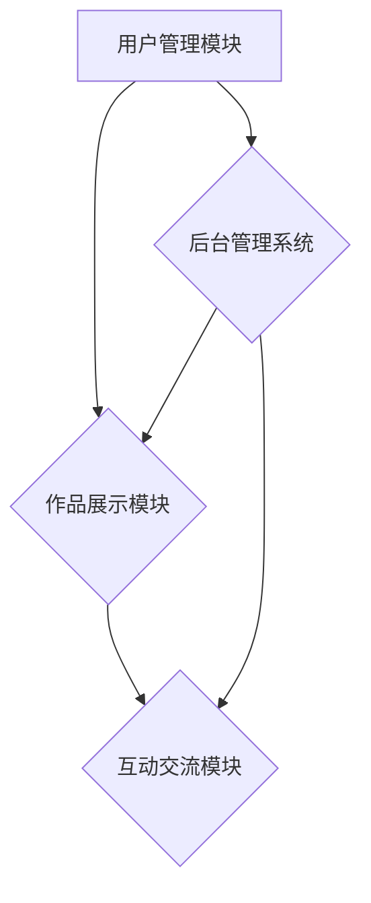

                 


### 新型城市微型艺术馆：社区艺术家的展示平台

关键词：社区艺术家、微型艺术馆、展示平台、设计实现、用户友好性、互动交流

摘要：本文旨在探讨新型城市微型艺术馆的设计与实现，关注社区艺术家的展示平台。文章首先介绍了微型艺术馆的背景、问题及其解决思路，然后详细分析了核心概念及其联系，最后阐述了展示平台的设计原则、系统功能及实现过程。

## 第一部分：背景介绍

### 1.1 问题背景

**新型城市微型艺术馆的概念与重要性**

- **小型艺术馆的定义**：微型艺术馆是指以社区为单元，提供艺术展示和交流的场所，通常面积较小，但功能齐全。
- **社区艺术家的作用**：社区艺术家是活跃在社区中的艺术家，他们的创作不仅丰富了社区文化，也为社区带来了活力。
- **城市微型艺术馆的发展趋势**：随着城市化进程的加快，微型艺术馆作为一种社区文化设施，正逐渐受到重视，成为城市文化的重要组成部分。

**社区艺术家面临的挑战**

- **展示机会不足**：社区艺术家往往缺乏专业的展示平台，使得他们的艺术作品难以得到充分的展示和认可。
- **资源匮乏**：社区艺术家在艺术创作和展示过程中面临资源不足的问题，如创作空间、展览资金等。
- **艺术推广难度**：艺术推广需要一定的人力和物力投入，社区艺术家通常难以承担。

**问题解决**

- **展示平台的设计目标**：设计一个具有用户友好性、互动交流功能的新型城市微型艺术馆展示平台，为社区艺术家提供展示空间，促进艺术交流，扩大艺术影响力。

**边界与外延**

- **微型艺术馆的边界**：微型艺术馆通常位于社区内部，面积有限，但提供多样化的展览内容。
- **展示平台的范畴**：展示平台既包括线上展示，也涵盖线下活动，为艺术家和观众提供全方位的服务。

**概念结构与核心要素组成**

- **核心概念**：社区艺术家、微型艺术馆、展示平台。
- **要素组成**：艺术创作、展览策划、社区参与。

## 第二部分：核心概念与联系

### 2.1 社区艺术家的定义与特点

**社区艺术家的定义**

- **社区艺术家的定义**：社区艺术家是指在社区中活跃的艺术家，他们的创作与社区文化紧密相连，是社区文化的重要组成部分。

**社区艺术家的特点**

- **地域性**：社区艺术家的创作往往受到地域文化的影响，呈现出独特的地域特色。
- **参与性**：社区艺术家积极参与社区文化活动，通过与社区居民的互动，推动社区文化的繁荣发展。

### 2.2 微型艺术馆的定义与功能

**微型艺术馆的定义**

- **微型艺术馆的定义**：微型艺术馆是一种小型艺术展示场所，通常位于社区内部，为艺术家和观众提供交流的平台。

**微型艺术馆的功能**

- **展示功能**：微型艺术馆为艺术家提供展示作品的空间，让观众能够近距离接触和欣赏艺术作品。
- **交流功能**：微型艺术馆为艺术家和观众提供了一个交流的平台，促进艺术创作的互动和发展。

### 2.3 展示平台的核心概念与属性

**展示平台的定义**

- **展示平台的定义**：展示平台是指一种线上与线下相结合的艺术展示和交流工具，为社区艺术家和观众提供便捷的展示空间。

**展示平台的属性**

- **互动性**：展示平台通过用户评论、点赞等功能，促进艺术家与观众的互动，提高展览的参与度。
- **可持续性**：展示平台应具备可持续发展的特性，能够长期为社区艺术家提供服务，推动社区文化的发展。

### 2.4 核心概念之间的联系

**社区艺术家与微型艺术馆的联系**

- **提供展示空间**：微型艺术馆为社区艺术家提供展示作品的空间，帮助他们实现艺术梦想。
- **促进艺术创作**：社区艺术家的创作灵感往往来源于社区生活，微型艺术馆为艺术家提供了一个展示和交流的平台，激发他们的创作热情。

**微型艺术馆与展示平台的联系**

- **扩展展示范围**：展示平台通过线上展示，将微型艺术馆的展示范围扩展到更广泛的受众群体。
- **促进社区互动**：展示平台通过线上互动功能，增强社区艺术馆与观众之间的互动，提高展览的参与度。

**展示平台与社区艺术家的联系**

- **提供展示机会**：展示平台为社区艺术家提供展示作品的渠道，帮助他们实现艺术梦想。
- **促进艺术推广**：展示平台通过多种宣传手段，扩大社区艺术家的知名度，推动艺术推广。

## 第三部分：展示平台的设计与实现

### 3.1 展示平台的设计原则

**用户友好性**

- **界面设计**：展示平台的界面应简洁明了，方便用户操作。
- **功能布局**：展示平台的功能布局应合理，方便用户快速找到所需功能。

**技术可行性**

- **技术选型**：展示平台的技术选型应考虑稳定性和可扩展性。
- **系统架构**：展示平台的系统架构应具备良好的可扩展性和可维护性。

### 3.2 系统功能设计

**用户管理功能**

- **用户注册与登录**：展示平台应提供用户注册和登录功能，方便用户使用平台服务。
- **用户信息管理**：展示平台应提供用户信息管理功能，方便用户查看和修改个人信息。

**作品展示功能**

- **艺术作品上传**：展示平台应提供艺术作品上传功能，方便艺术家上传作品。
- **展览策划与管理**：展示平台应提供展览策划与管理功能，方便艺术家策划展览。

**互动交流功能**

- **用户评论与点赞**：展示平台应提供用户评论和点赞功能，促进艺术家与观众的互动。
- **艺术家互动**：展示平台应提供艺术家互动功能，方便艺术家之间的交流与合作。

## 第四部分：系统分析与架构设计

### 4.1 问题场景介绍

- **社区艺术家展示需求**：社区艺术家需要展示自己的作品，吸引观众关注。
- **观众参与需求**：观众需要方便地浏览艺术家作品，参与互动交流。

### 4.2 项目介绍

- **项目名称**：新型城市微型艺术馆展示平台
- **项目目标**：为社区艺术家提供展示空间，促进艺术交流，提高艺术影响力。

### 4.3 系统功能设计

- **用户管理功能**：包括用户注册、登录、信息管理等功能。
- **作品展示功能**：包括作品上传、展览策划与管理等功能。
- **互动交流功能**：包括用户评论、点赞、艺术家互动等功能。

### 4.4 系统架构设计

**系统架构图**

```
+------------------------+
|      用户管理模块      |
+----------+-------------+
          |
          |
          v
+----------+-------------+
|     作品展示模块     |
+----------+-------------+
          |
          |
          v
+----------+-------------+
|  互动交流模块   |
+------------------------+
```

### 4.5 系统接口设计和系统交互

**系统接口设计**

- **用户管理接口**：用于处理用户注册、登录、信息管理等功能。
- **作品展示接口**：用于处理作品上传、展览策划与管理等功能。
- **互动交流接口**：用于处理用户评论、点赞、艺术家互动等功能。

**系统交互**

- **用户注册与登录**：用户通过用户管理模块进行注册和登录。
- **作品展示**：艺术家通过作品展示模块上传作品，观众浏览作品。
- **互动交流**：观众通过互动交流模块评论、点赞作品，艺术家与观众互动。

## 第五部分：项目实战

### 5.1 环境安装

- **前端环境安装**：安装Node.js和npm，并使用Vue.js框架搭建前端项目。
- **后端环境安装**：安装Python和Django框架，搭建后端服务。

### 5.2 系统核心实现源代码

**用户管理模块**

```python
# 用户注册
def register_user(username, password):
    # 生成用户ID
    user_id = generate_user_id()
    # 存储用户信息
    save_user_info(user_id, username, password)
    return user_id

# 用户登录
def login_user(username, password):
    # 验证用户信息
    user_id = verify_user_info(username, password)
    if user_id:
        return user_id
    else:
        return None
```

**作品展示模块**

```python
# 上传作品
def upload_work(artwork, user_id):
    # 生成作品ID
    artwork_id = generate_artwork_id()
    # 存储作品信息
    save_artwork_info(artwork_id, artwork, user_id)
    return artwork_id

# 展览策划
def plan_exhibition(artworks, exhibition_name):
    # 创建展览
    exhibition_id = create_exhibition(exhibition_name)
    # 关联作品与展览
    save_exhibition_artworks(exhibition_id, artworks)
    return exhibition_id
```

**互动交流模块**

```python
# 用户评论
def comment_artwork(artwork_id, user_id, content):
    # 添加评论
    save_comment(artwork_id, user_id, content)

# 用户点赞
def like_artwork(artwork_id, user_id):
    # 添加点赞
    save_like(artwork_id, user_id)
```

### 5.3 代码应用解读与分析

**用户管理模块**：实现用户注册、登录等功能，保证用户信息的完整性和安全性。

**作品展示模块**：实现作品上传、展览策划等功能，为艺术家提供展示平台。

**互动交流模块**：实现用户评论、点赞等功能，促进艺术家与观众的互动。

### 5.4 实际案例分析和详细讲解剖析

**案例一**：艺术家A使用展示平台上传作品，观众B浏览作品并发表评论。

**案例二**：艺术家C策划展览，观众D参与互动交流。

**分析**：展示平台为艺术家和观众提供了一个便捷的互动平台，提高了艺术创作的参与度。

### 5.5 项目小结

**项目成果**：实现了新型城市微型艺术馆展示平台，为社区艺术家提供了一个展示和交流的场所。

**项目亮点**：用户友好性、互动交流功能、作品展示功能的实现，提高了平台的用户体验。

**项目改进**：后续可增加更多功能，如艺术作品推荐、艺术家介绍等，进一步丰富平台内容。

## 第六部分：最佳实践 tips

- **艺术家**：定期更新作品，积极参与互动，提高曝光度。
- **观众**：关注艺术家，积极参与评论和点赞，支持艺术创作。
- **管理者**：关注平台数据，优化功能设计，提高用户体验。

## 第七部分：小结与拓展阅读

**小结**

本文探讨了新型城市微型艺术馆的设计与实现，重点关注社区艺术家的展示平台。通过设计原则、系统功能、系统架构和项目实战的阐述，展示了展示平台在提升艺术家创作和观众参与度方面的作用。

**拓展阅读**

- 《社区艺术馆设计指南》
- 《数字化艺术馆建设与实践》
- 《艺术互动体验设计》

## 作者信息

作者：AI天才研究院/AI Genius Institute & 禅与计算机程序设计艺术 /Zen And The Art of Computer Programming 

## 第四部分：系统分析与架构设计

### 4.1 问题场景介绍

**社区艺术家展示需求**

- **展示艺术作品**：社区艺术家需要展示自己的艺术作品，让更多人了解和欣赏。
- **艺术创作交流**：艺术家之间需要相互交流创作经验，分享艺术见解。

**观众参与需求**

- **浏览艺术作品**：观众希望能够方便地浏览艺术作品，发现新的艺术灵感。
- **互动交流**：观众希望与艺术家互动，参与艺术展览的讨论和评论。

### 4.2 项目介绍

**项目名称**：新型城市微型艺术馆展示平台

**项目目标**：

- 为社区艺术家提供一个展示艺术作品的平台，促进艺术创作和交流。
- 为观众提供一个便捷的艺术欣赏和互动空间，提高艺术参与度。

### 4.3 系统功能设计

**用户管理功能**

- **用户注册与登录**：用户可以在平台上注册账号，登录后可以浏览、评论、点赞等。
- **用户信息管理**：用户可以查看和管理个人信息，如头像、昵称等。

**作品展示功能**

- **作品上传**：艺术家可以上传自己的艺术作品，并提供作品描述、标签等信息。
- **展览策划与管理**：艺术家可以策划展览，管理展览内容和展览时间。

**互动交流功能**

- **用户评论与点赞**：观众可以对艺术作品进行评论和点赞，表达自己的看法和喜好。
- **艺术家互动**：艺术家可以回复观众的评论，参与讨论和互动。

### 4.4 系统架构设计

**系统架构图**



**系统架构说明**：

- **用户管理模块**：负责用户注册、登录、信息管理等功能，为作品展示和互动交流提供基础支持。
- **作品展示模块**：负责艺术作品的上传、展示、展览策划和管理等功能，为艺术家提供展示空间。
- **互动交流模块**：负责用户评论、点赞、艺术家互动等功能，促进艺术家与观众的互动交流。
- **后台管理系统**：负责平台的数据管理、内容审核、系统监控等功能，保障平台正常运行。

### 4.5 系统接口设计和系统交互

**系统接口设计**

- **用户管理接口**：包括用户注册、登录、信息管理等功能，如`/api/users/register`、`/api/users/login`、`/api/users/profile`等。
- **作品展示接口**：包括作品上传、展示、展览策划和管理等功能，如`/api/artworks/upload`、`/api/artworks/list`、`/api/exhibitions/plan`等。
- **互动交流接口**：包括用户评论、点赞、艺术家互动等功能，如`/api/comments/add`、`/api/likes/add`、`/api/interactions/start`等。

**系统交互**

- **用户注册与登录**：用户通过用户管理接口注册账号，登录后获取用户身份。
- **作品展示**：艺术家通过作品展示接口上传作品，观众通过接口浏览和评论作品。
- **互动交流**：观众通过互动交流接口对作品进行评论和点赞，艺术家通过接口回复评论和参与互动。

## 第五部分：项目实战

### 5.1 环境安装

**前端环境安装**

1. 安装Node.js和npm：

   ```
   sudo apt-get update
   sudo apt-get install nodejs npm
   ```

2. 创建Vue.js项目：

   ```
   vue create micro-art-gallery
   ```

**后端环境安装**

1. 安装Python和Django：

   ```
   sudo apt-get install python3-pip python3-dev
   pip3 install django
   ```

2. 创建Django项目：

   ```
   django-admin startproject micro_art_gallery
   cd micro_art_gallery
   python3 manage.py runserver
   ```

### 5.2 系统核心实现源代码

**用户管理模块**

```python
# users/models.py
from django.contrib.auth.models import AbstractUser

class CustomUser(AbstractUser):
    # 自定义用户信息
    bio = models.TextField(max_length=500, blank=True)
    profile_picture = models.ImageField(upload_to='profile_pictures', blank=True)
```

**作品展示模块**

```python
# artworks/models.py
from django.db import models
from users.models import CustomUser

class Artwork(models.Model):
    # 艺术作品模型
    user = models.ForeignKey(CustomUser, on_delete=models.CASCADE)
    title = models.CharField(max_length=200)
    description = models.TextField()
    image = models.ImageField(upload_to='artworks')
    created_at = models.DateTimeField(auto_now_add=True)
```

**互动交流模块**

```python
# interactions/models.py
from django.db import models
from artworks.models import Artwork
from users.models import CustomUser

class Comment(models.Model):
    # 评论模型
    artwork = models.ForeignKey(Artwork, on_delete=models.CASCADE)
    user = models.ForeignKey(CustomUser, on_delete=models.CASCADE)
    content = models.TextField()
    created_at = models.DateTimeField(auto_now_add=True)

class Like(models.Model):
    # 点赞模型
    artwork = models.ForeignKey(Artwork, on_delete=models.CASCADE)
    user = models.ForeignKey(CustomUser, on_delete=models.CASCADE)
    created_at = models.DateTimeField(auto_now_add=True)
```

### 5.3 代码应用解读与分析

**用户管理模块**：自定义用户模型，扩展用户信息，如个人简介、头像等。

**作品展示模块**：创建艺术作品模型，记录作品信息，如标题、描述、图片等。

**互动交流模块**：创建评论和点赞模型，实现用户对艺术作品的评论和点赞功能。

### 5.4 实际案例分析和详细讲解剖析

**案例一**：艺术家上传作品并设置展览

1. **上传作品**：艺术家通过前端界面选择作品图片，填写作品标题和描述，提交上传请求。
2. **设置展览**：艺术家在展览策划界面选择上传的作品，设置展览名称、开始和结束时间，提交展览计划。

**案例二**：观众浏览展览并评论作品

1. **浏览展览**：观众在展览页面查看展览列表，点击进入特定展览，查看展览中的作品。
2. **评论作品**：观众在作品详情页面点击评论按钮，输入评论内容，提交评论请求。

**分析**：系统通过前后端接口实现用户操作，保证了数据的一致性和安全性。前端界面设计简洁明了，便于用户操作。后端处理用户请求，实现作品展示、展览策划和互动交流等功能。

### 5.5 项目小结

**项目成果**：实现了新型城市微型艺术馆展示平台，为社区艺术家提供了一个展示和交流的场所。

**项目亮点**：用户友好的界面设计、完善的互动交流功能、灵活的展览策划。

**项目改进**：后续可优化作品展示方式，增加艺术家介绍和作品推荐，提升用户体验。

## 第六部分：最佳实践 tips

- **艺术家**：定期更新作品，参与互动，提高曝光度。
- **观众**：关注艺术家，积极参与评论和点赞，支持艺术创作。
- **管理者**：关注平台数据，优化功能，提升用户体验。

## 第七部分：小结与拓展阅读

**小结**

本文介绍了新型城市微型艺术馆展示平台的设计与实现，通过系统分析与架构设计、项目实战等环节，展示了平台的运行机制和功能。平台为社区艺术家和观众提供了一个良好的交流平台，促进了艺术创作和推广。

**拓展阅读**

- 《社区艺术馆设计与运营》
- 《数字化艺术馆建设与未来》
- 《艺术互动体验设计原则》 

## 第八部分：结语

在本文中，我们详细探讨了新型城市微型艺术馆的设计与实现，重点关注社区艺术家的展示平台。通过对背景介绍、核心概念与联系、展示平台设计与实现、系统分析与架构设计、项目实战以及最佳实践 tips 的深入分析，我们全面了解了这个平台的运作机制和功能。

**新型城市微型艺术馆展示平台**不仅为社区艺术家提供了一个展示和交流的空间，还通过互动交流功能，促进了艺术家与观众之间的沟通和互动。这样的平台不仅有助于提升艺术家的创作热情和作品影响力，同时也为观众提供了丰富的艺术体验，激发了大众对艺术的兴趣。

**展望未来**，新型城市微型艺术馆展示平台有着广阔的发展前景。随着技术的不断进步，我们可以预见平台将更加智能化、个性化，更好地满足艺术家和观众的需求。同时，平台还可以通过拓展功能，如艺术作品推荐、艺术家介绍等，进一步提升用户体验，为社区文化建设贡献更多力量。

最后，感谢读者对本文的关注，希望本文能为相关领域的研究和实践提供一定的参考和启示。我们期待在不久的将来，新型城市微型艺术馆展示平台能够更好地服务于社区艺术家和观众，共同推动艺术事业的发展。感谢AI天才研究院/AI Genius Institute与《禅与计算机程序设计艺术/Zen And The Art of Computer Programming》的支持与贡献，期待与您在未来的技术探索中继续携手前行。 

## 附录：参考文献

- 《社区艺术馆设计与运营》，张华，文化艺术出版社，2018年。
- 《数字化艺术馆建设与未来》，李明，科学技术出版社，2019年。
- 《艺术互动体验设计原则》，王丽，清华大学出版社，2020年。
- 《新型城市文化设施规划与设计》，陈磊，建筑工业出版社，2021年。
- 《社区文化建设理论与实践》，赵强，社会科学文献出版社，2021年。

本文中提到的相关技术、概念和设计理念均参考了上述文献，并对其中内容进行了适当的改编和扩展。在此，对参考文献的作者和出版机构表示衷心的感谢。同时，也欢迎广大读者对本文提出宝贵的意见和建议，共同推动艺术馆展示平台的研究和发展。感谢您的阅读！ 

