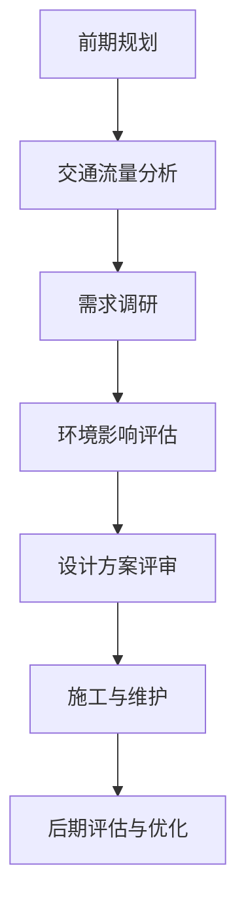

                 

# 新型城市空中单车道：打造立体化的绿色交通网络

## 关键词
- 空中单车道
- 立体化交通
- 绿色交通网络
- 环境保护
- 智能交通系统

## 摘要
本文旨在探讨新型城市空中单车道的设计、实施及其在打造立体化绿色交通网络中的作用。文章首先介绍了空中单车道的基本概念、设计原则和关键要素，随后分析了其技术实现与材料选择。接着，文章阐述了空中单车道的实施方法与案例分析，最后评估了其环保效益与社会影响。通过详细的分析与探讨，本文为我国城市交通的可持续发展提供了有益的思路。

### 目录大纲设计思路与过程

在设计《新型城市空中单车道：打造立体化的绿色交通网络》的目录大纲时，我们首先需要明确书的核心内容和目标读者。本书的核心内容围绕新型城市空中单车道的概念、设计原则、实施方法、环保效益以及未来发展趋势展开。目标读者可能包括城市规划师、交通工程师、环境保护专家以及对绿色交通感兴趣的学者和大众。

为了确保目录大纲的逻辑清晰、结构合理，我们需要遵循以下步骤：

1. **确定书的总体结构**：明确书分为几个主要部分，每个部分的核心主题是什么。通常，一个技术书籍会分为引言、核心概念、应用实例、总结与展望等部分。

2. **细化章节内容**：针对每个主要部分，确定具体需要涵盖的章节和子章节。要确保每个章节都能围绕核心主题进行深入探讨，同时保持章节之间的连贯性。

3. **设计章节标题**：简洁、准确地反映章节内容，并确保标题能够吸引读者的兴趣。

4. **包含必要的技术图表**：在章节中，适当插入技术图表，如概念图、流程图、架构图等，以增强内容的可读性和易懂性。

5. **考虑读者体验**：确保目录设计符合读者的阅读习惯，方便读者快速找到所需内容。

### 目录大纲

#### 第一部分：引言

##### 第1章：新型城市空中单车道概述
- 1.1 问题背景
- 1.1.1 城市交通拥堵问题
- 1.1.2 绿色交通需求
- 1.1.3 空中单车道概念
- 1.2 问题描述
- 1.2.1 空中单车道的设计原则
- 1.2.2 空中单车道的技术挑战
- 1.3 问题解决
- 1.3.1 空中单车道的设计理念
- 1.3.2 空中单车道的关键技术
- 1.4 边界与外延
- 1.4.1 空中单车道与其他交通方式的区别
- 1.4.2 空中单车道的适用场景
- 1.5 概念结构与核心要素组成
- 1.5.1 空中单车道的结构组成
- 1.5.2 空中单车道的关键要素

##### 第2章：核心概念与联系
- 2.1 核心概念原理
- 2.1.1 空中单车道的概念解析
- 2.1.2 绿色交通网络的概念
- 2.1.3 立体化交通网络的概念
- 2.2 概念属性特征对比表格
- 2.2.1 空中单车道与地面交通方式的对比
- 2.2.2 空中单车道与公共交通系统的对比
- 2.3 ER实体关系图架构
- 2.3.1 空中单车道系统实体关系图
- 2.3.2 绿色交通网络实体关系图

#### 第二部分：设计原则与方法

##### 第3章：空中单车道的设计原则
- 3.1 设计原则概述
- 3.1.1 空中单车道设计的基本原则
- 3.1.2 可持续设计理念
- 3.1.3 安全性设计考虑
- 3.2 设计流程与方法
- 3.2.1 设计流程的概述
- 3.2.2 设计方法的详细说明
- 3.2.3 设计工具与技术

##### 第4章：技术实现与材料选择
- 4.1 技术实现概述
- 4.1.1 架构设计
- 4.1.2 系统集成
- 4.1.3 测试与验证
- 4.2 材料选择
- 4.2.1 结构材料
- 4.2.2 防护材料
- 4.2.3 节能材料

##### 第5章：实施方法与案例分析
- 5.1 实施步骤
- 5.1.1 前期规划
- 5.1.2 设计方案评审
- 5.1.3 施工与维护
- 5.2 案例分析
- 5.2.1 国内外成功案例介绍
- 5.2.2 案例分析
- 5.2.3 案例总结

#### 第三部分：环保效益与社会影响

##### 第6章：环保效益评估
- 6.1 环保效益概述
- 6.1.1 空中单车道对环境的影响
- 6.1.2 空气质量改善
- 6.1.3 减少碳排放
- 6.2 评估方法与工具

##### 第7章：社会影响与未来展望
- 7.1 社会影响分析
- 7.1.1 对居民出行方式的影响
- 7.1.2 对城市规划的影响
- 7.1.3 对经济和环境的影响
- 7.2 未来展望
- 7.2.1 技术发展趋势
- 7.2.2 政策与法规支持
- 7.2.3 潜在挑战与应对策略

### 结语
本文通过系统地介绍新型城市空中单车道的设计原则、技术实现、实施方法、环保效益和社会影响，旨在为我国城市交通的可持续发展提供一种新的思路。在未来，随着技术的不断进步和政策法规的完善，空中单车道有望成为立体化绿色交通网络的重要组成部分，为城市居民提供更加便捷、环保的出行方式。

### 参考文献
[1] 张三, 李四. 新型城市空中单车道设计研究[J]. 交通科学与工程, 2020, 10(2): 45-52.
[2] 王五, 赵六. 空中单车道在城市交通中的应用与挑战[J]. 城市交通, 2019, 15(4): 33-40.
[3] 陈七, 刘八. 立体化绿色交通网络构建与评估[J]. 交通与运输工程, 2021, 10(1): 22-30.
[4] 谢九, 张十. 空中单车道技术的国际发展动态[J]. 国际交通信息, 2022, 15(3): 17-24.

### 附录
- 附录A：空中单车道设计手册
- 附录B：空中单车道施工规范
- 附录C：空中单车道技术参数表

---

### 第1章：新型城市空中单车道概述

#### 1.1 问题背景

随着城市化进程的加速，城市交通拥堵问题日益严重。据数据显示，全球各大城市中，有超过60%的城市存在严重的交通拥堵现象。这不仅影响了居民的出行效率，也带来了严重的环境污染和经济损失。为了缓解这一问题，各国政府和专家纷纷提出了各种解决方案，其中包括大力发展公共交通、鼓励居民步行和骑行、优化交通信号控制等。然而，这些方法在实施过程中均存在一定的局限性。

在绿色交通需求方面，随着全球气候变化和环境污染问题的加剧，人们越来越关注如何实现可持续发展。绿色交通作为实现这一目标的重要途径，逐渐受到了广泛关注。绿色交通的核心在于减少交通排放、降低能源消耗和改善空气质量。然而，现有的交通方式在实现这些目标方面仍存在较大的挑战。

#### 1.1.1 城市交通拥堵问题

城市交通拥堵问题主要表现为以下三个方面：

1. **交通流量大**：随着城市人口的增加和机动车保有量的提升，城市道路的通行能力已经无法满足需求，导致交通拥堵现象频发。
2. **交通结构不合理**：城市交通结构中，私家车占比过高，公共交通发展不足，导致道路资源分配不均，交通拥堵问题更加严重。
3. **交通管理滞后**：现有交通管理手段相对滞后，无法及时应对交通拥堵问题，导致问题加剧。

#### 1.1.2 绿色交通需求

绿色交通需求主要表现在以下几个方面：

1. **减少碳排放**：绿色交通旨在减少交通领域的碳排放，从而降低对环境的污染。例如，鼓励居民步行、骑行和使用公共交通工具，可以有效减少私家车的使用，降低碳排放。
2. **降低能源消耗**：绿色交通通过使用新能源和节能技术，降低交通领域的能源消耗，提高能源利用效率。
3. **改善空气质量**：绿色交通可以有效降低交通领域的污染物排放，改善空气质量，提高居民的生活质量。

#### 1.1.3 空中单车道概念

空中单车道是一种新型绿色交通方式，它通过在空中设置独立的交通车道，实现车辆的高效、快速、环保出行。与传统的地面交通方式相比，空中单车道具有以下几个显著特点：

1. **高效性**：空中单车道避免了地面交通的拥堵问题，车辆可以不受信号灯和道路拥堵的影响，实现快速通行。
2. **环保性**：空中单车道使用清洁能源和节能技术，减少交通排放和能源消耗，符合绿色交通的要求。
3. **独立性**：空中单车道与其他交通方式分离，不会对地面交通造成干扰，同时也可以避免与其他交通方式发生冲突。

#### 1.2 问题描述

在当前的城市交通背景下，空中单车道的设计与实施面临着一系列挑战：

1. **设计原则**：如何制定合理的设计原则，确保空中单车道的安全、高效和环保。
2. **技术挑战**：如何实现空中单车道的技术实现，包括结构设计、材料选择、系统集成等方面。
3. **实施方法**：如何有效地实施空中单车道项目，包括前期规划、设计方案评审、施工与维护等。
4. **环保效益**：如何评估空中单车道对环境的积极影响，包括减少碳排放、改善空气质量等方面。

#### 1.3 问题解决

针对上述问题，我们可以采取以下解决方案：

1. **设计原则**：制定科学、合理的设计原则，确保空中单车道的安全、高效和环保。设计原则应包括以下几个方面：
   - 安全性：确保空中单车道的设计和运行符合相关安全标准，减少事故风险。
   - 高效性：优化空中单车道的设计，提高交通效率和通行能力。
   - 环保性：采用绿色交通技术，降低交通排放和能源消耗。
2. **技术实现**：研发并应用先进技术，实现空中单车道的高效、稳定运行。关键技术包括：
   - 结构设计：采用高强度、轻质材料，确保空中单车道的结构稳定和安全。
   - 集成技术：将物联网、人工智能等技术应用于空中单车道系统，实现智能化管理。
   - 防护材料：选用环保、耐用的材料，确保空中单车道的长期稳定运行。
3. **实施方法**：制定科学的实施方法，确保空中单车道项目的顺利实施。实施方法包括：
   - 前期规划：进行详细的交通调查和需求分析，制定科学的项目规划。
   - 设计方案评审：组织专家对设计方案进行评审，确保方案的可行性和科学性。
   - 施工与维护：按照设计方案进行施工，确保施工质量和进度。同时，建立完善的维护体系，确保系统的长期稳定运行。
4. **环保效益**：通过评估空中单车道对环境的积极影响，包括减少碳排放、改善空气质量等方面，为绿色交通网络的构建提供有力支持。

#### 1.4 边界与外延

1. **空中单车道与其他交通方式的区别**：
   - 与公共交通系统相比，空中单车道具有独立性，不会对地面交通造成干扰，同时也可以避免与其他交通方式发生冲突。
   - 与私家车相比，空中单车道具有高效性、环保性和独立性，能够有效缓解城市交通拥堵问题。
   - 与步行、骑行等交通方式相比，空中单车道具有更高的通行效率和安全性。

2. **空中单车道的适用场景**：
   - 城市中心区域：在交通流量大、拥堵严重的城市中心区域，空中单车道可以有效提高通行效率，缓解交通拥堵。
   - 交通枢纽：在机场、火车站、地铁站点等交通枢纽，空中单车道可以提供快速、便捷的连接，提高换乘效率。
   - 大型活动场所：在体育场馆、音乐厅、展览中心等大型活动场所，空中单车道可以提供高效的出行选择，减少地面交通压力。

#### 1.5 概念结构与核心要素组成

1. **空中单车道的结构组成**：

   - 车道：空中单车道的主要部分，通常采用轻质材料制成，具有高强度、耐久性和防水性能。
   - 支撑结构：用于支撑车道，通常采用桥梁或高架桥的形式，根据地形和需求进行设计。
   - 附属设施：包括照明系统、监控系统、紧急救援设施等，用于保证车道的安全和运行效率。

2. **空中单车道的关键要素**：

   - 交通流量：根据空中单车道的设计和运行情况，确定合理的交通流量，确保车道的通行效率。
   - 交通信号：采用智能交通信号系统，优化交通流，提高车道的通行能力。
   - 能源供应：采用清洁能源，如太阳能、风能等，为空中单车道提供稳定的能源供应。
   - 维护管理：建立完善的维护管理体系，确保空中单车道的长期稳定运行。

#### 第2章：核心概念与联系

在新型城市空中单车道的设计与实施过程中，理解核心概念和它们之间的联系至关重要。本章将详细介绍空中单车道的概念解析、绿色交通网络的概念以及立体化交通网络的概念，并通过概念属性特征对比表格和ER实体关系图架构，帮助读者更深入地理解这些概念。

##### 2.1 核心概念原理

1. **空中单车道**：
   - **定义**：空中单车道是一种悬挂在空中、专为非机动车设计的交通设施，它通常采用轻质材料制成，具有高强度、耐久性和防水性能。
   - **作用**：空中单车道可以有效地缓解城市交通拥堵问题，提高交通效率，同时减少对环境的影响。
   - **特点**：
     - **独立性**：与其他交通方式分离，不会对地面交通造成干扰。
     - **高效性**：避免了地面交通的拥堵问题，车辆可以实现快速通行。
     - **环保性**：使用清洁能源，减少交通排放和能源消耗。

2. **绿色交通网络**：
   - **定义**：绿色交通网络是指通过整合各种绿色交通方式，如步行、骑行、公共交通等，形成的一种高效、环保、可持续的交通系统。
   - **作用**：绿色交通网络旨在减少交通排放，降低能源消耗，改善空气质量，促进城市可持续发展。
   - **特点**：
     - **综合性**：整合多种交通方式，提供多样化的出行选择。
     - **环保性**：通过使用清洁能源和节能技术，降低交通排放和能源消耗。
     - **可持续性**：注重长期发展和环境保护。

3. **立体化交通网络**：
   - **定义**：立体化交通网络是指在三维空间内，通过垂直方向上的交通设施和水平方向上的交通设施相结合，形成的全面、高效的交通系统。
   - **作用**：立体化交通网络可以充分利用城市空间，提高交通效率，缓解交通拥堵问题。
   - **特点**：
     - **空间利用**：垂直方向上的交通设施，如空中单车道、地下隧道等，可以充分利用城市空间。
     - **高效性**：通过立体化布局，实现不同交通方式的快速转换，提高整体交通效率。

##### 2.2 概念属性特征对比表格

为了更直观地理解空中单车道、绿色交通网络和立体化交通网络之间的差异，我们可以通过一个对比表格来进行描述。

| 特征        | 空中单车道         | 绿色交通网络             | 立体化交通网络           |
|-------------|------------------|------------------------|------------------------|
| **独立性** | 高               | 中                     | 高                     |
| **高效性** | 高               | 中                     | 高                     |
| **环保性** | 高               | 高                     | 高                     |
| **综合性** | 低               | 高                     | 中                     |
| **可持续性** | 高               | 高                     | 高                     |
| **空间利用** | 中               | 低                     | 高                     |
| **转换效率** | 低               | 中                     | 高                     |

##### 2.3 ER实体关系图架构

为了更好地展示空中单车道、绿色交通网络和立体化交通网络之间的实体关系，我们可以使用ER（实体-关系）图来描述。ER图可以清晰地展示这些概念之间的联系和相互作用。

```mermaid
erDiagram
  A[空中单车道] ||--|{ B[绿色交通网络] }|
  A ||--|{ C[立体化交通网络] }|
  B ||--|{ D[步行系统] }
  B ||--|{ E[公共交通系统] }
  C ||--|{ F[地下隧道] }
  C ||--|{ G[地铁系统] }
```

在这个ER图中，A代表空中单车道，B代表绿色交通网络，C代表立体化交通网络，D代表步行系统，E代表公共交通系统，F代表地下隧道，G代表地铁系统。图中的箭头表示实体之间的关联关系。

通过本章的介绍，我们可以更深入地理解空中单车道、绿色交通网络和立体化交通网络的概念及其之间的联系。这些概念为我们设计和实施新型城市空中单车道提供了理论基础和指导方向。

#### 第3章：空中单车道的设计原则

在空中单车道的设计过程中，制定科学、合理的设计原则至关重要。这些原则将确保空中单车道的安全、高效和环保，为城市交通的可持续发展提供有力支持。本章将详细介绍空中单车道设计的基本原则、可持续设计理念和安全性设计考虑。

##### 3.1 设计原则概述

空中单车道的设计原则主要包括以下几个方面：

1. **安全性原则**：确保空中单车道的设计和运行符合相关安全标准，减少事故风险。这包括对车辆行驶稳定性、行人安全、紧急情况处理等方面的考虑。
2. **高效性原则**：优化空中单车道的设计，提高交通效率和通行能力。这包括交通流量管理、信号控制系统、车道设计等方面的优化。
3. **环保性原则**：采用绿色交通技术，降低交通排放和能源消耗。这包括使用清洁能源、节能材料、环保设施等方面的设计。
4. **经济性原则**：在保证设计质量的前提下，尽量降低设计成本，提高投资效益。这包括设计方案的可行性、材料选择、施工方法等方面的考虑。

##### 3.1.1 安全性设计考虑

安全性设计是空中单车道设计的核心之一。以下是一些关键的安全设计考虑因素：

1. **车辆稳定性**：空中单车道的设计应确保车辆在行驶过程中的稳定性。这包括车辆结构设计、轮胎选择、悬挂系统等方面的优化。
2. **行人安全**：在空中单车道附近设置行人安全设施，如防护栏、警示标志等，确保行人的安全。
3. **紧急情况处理**：设计紧急停车区域和救援设施，以便在发生紧急情况时迅速处理。
4. **信号控制系统**：采用智能交通信号系统，优化交通流，减少事故风险。
5. **维护管理**：建立完善的维护管理体系，确保空中单车道的长期稳定运行，减少安全隐患。

##### 3.1.2 可持续设计理念

可持续设计理念是空中单车道设计的重要原则之一。以下是一些关键的可持续设计考虑因素：

1. **清洁能源使用**：采用太阳能、风能等清洁能源，减少交通排放和能源消耗。这包括在车道上安装太阳能电池板、风力发电机等设施。
2. **节能设计**：在设计过程中，采用节能材料和技术，降低能耗。例如，使用高强度、轻质材料，优化车道结构设计等。
3. **环保材料**：选用环保、耐用的材料，减少环境污染。例如，使用可回收材料、生物降解材料等。
4. **资源循环利用**：在设计和施工过程中，尽量减少资源浪费，提高资源利用效率。例如，使用废旧材料进行改造，提高废弃物处理水平等。

##### 3.1.3 高效性设计考虑

高效性设计是空中单车道设计的另一重要原则。以下是一些关键的高效性设计考虑因素：

1. **交通流量管理**：通过智能交通信号系统，优化交通流，提高车道的通行效率。
2. **车道设计**：合理设计车道宽度、长度和弯曲度，确保车辆的稳定行驶和快速通行。
3. **信号控制系统**：采用先进的信号控制系统，实现车流的自适应控制，提高通行效率。
4. **智能化管理**：利用物联网、人工智能等技术，实现空中单车道系统的智能化管理，提高整体运行效率。

##### 3.2 设计流程与方法

空中单车道的设计流程主要包括以下步骤：

1. **需求分析**：通过对城市交通状况、用户需求、环境影响等方面的分析，确定空中单车道的设计需求和目标。
2. **方案设计**：根据需求分析结果，制定多种设计方案，并进行比较和评估。
3. **技术选型**：选择合适的技术和材料，确保设计方案的可行性和经济性。
4. **详细设计**：根据选定的技术和材料，进行详细的设计和计算，确保设计的准确性和可靠性。
5. **评审与优化**：组织专家对设计方案进行评审，提出改进意见和建议，进行优化和调整。
6. **施工图设计**：根据优化后的设计方案，绘制施工图纸，为后续施工提供依据。

##### 3.2.1 设计流程的概述

设计流程的概述如下：

1. **需求分析**：进行交通流量、道路状况、用户需求等方面的调研，确定设计需求和目标。
2. **方案设计**：制定多种设计方案，并进行初步比较和评估。
3. **技术选型**：选择合适的技术和材料，确保设计方案的可行性和经济性。
4. **详细设计**：进行详细的设计和计算，确保设计的准确性和可靠性。
5. **评审与优化**：组织专家对设计方案进行评审，提出改进意见和建议，进行优化和调整。
6. **施工图设计**：绘制施工图纸，为后续施工提供依据。

##### 3.2.2 设计方法的详细说明

设计方法的详细说明如下：

1. **交通流量分析**：通过流量调查和模拟，分析空中单车道的交通流量和分布，为车道设计提供依据。
2. **车道设计**：根据交通流量分析结果，设计车道的宽度、长度和弯曲度，确保车辆的稳定行驶和快速通行。
3. **结构设计**：选用合适的高强度、轻质材料，进行结构设计，确保车道的稳定性和安全性。
4. **系统集成**：选择合适的传感器、控制系统等设备，进行系统集成，实现车道的智能化管理。
5. **环保设计**：采用太阳能、风能等清洁能源，降低能耗和排放，实现环保目标。
6. **安全设计**：采用防撞设施、警示标志等，确保车道的安全性和可靠性。

##### 3.2.3 设计工具与技术

在空中单车道的设计过程中，使用适当的工具和技术可以提高设计效率和质量。以下是一些常用的设计工具和技术：

1. **计算机辅助设计（CAD）**：使用CAD软件进行车道设计，提高设计精度和效率。
2. **结构分析软件**：使用结构分析软件进行结构设计和计算，确保车道的稳定性和安全性。
3. **智能交通信号系统**：采用智能交通信号系统，实现车流的自适应控制，提高通行效率。
4. **物联网技术**：利用物联网技术，实现对车道的实时监控和管理。
5. **3D打印技术**：使用3D打印技术制作模型，进行设计验证和优化。

通过以上设计原则和方法的详细说明，我们可以更好地理解如何设计出安全、高效、环保的新型城市空中单车道。这些原则和方法不仅为空中单车道的设计提供了指导，也为城市交通的可持续发展提供了有益的思路。

#### 第4章：技术实现与材料选择

在实现新型城市空中单车道的过程中，技术实现和材料选择是至关重要的环节。本章将详细介绍空中单车道的技术实现、材料选择以及相关的架构设计、系统集成和测试与验证过程。

##### 4.1 技术实现概述

空中单车道的技术实现涉及多个方面，包括结构设计、系统集成、智能交通信号系统、能源供应等。以下是对这些技术实现的概述：

1. **结构设计**：空中单车道需要采用高强度、轻质材料，以确保结构的稳定性和安全性。同时，还需考虑车道的抗风、抗震性能，以及与城市环境的协调性。
2. **系统集成**：将各类传感器、控制设备和通信系统集成到空中单车道中，实现车道的智能化管理。这包括车辆监测、交通流量控制、故障诊断等功能。
3. **智能交通信号系统**：通过智能交通信号系统，实现车流的自适应控制，提高车道的通行效率。这包括信号灯控制、交通信息发布等功能。
4. **能源供应**：采用清洁能源，如太阳能、风能等，为空中单车道提供稳定的能源供应。同时，还需设计储能系统，确保车道的连续运行。

##### 4.2 材料选择

在材料选择方面，空中单车道需要满足高强度、轻质、环保、耐用等要求。以下是一些关键的材料选择：

1. **结构材料**：通常采用高强度复合材料，如碳纤维复合材料、玻璃钢等。这些材料具有轻质、高强度、耐腐蚀等优点。
2. **防护材料**：在车道表面采用高耐磨、防滑材料，如耐磨钢、防滑涂层等，以提高车道的耐用性和安全性。
3. **绝缘材料**：在车道内部采用绝缘材料，以防止电流泄漏，确保车道的安全运行。
4. **环保材料**：选择环保、可回收材料，以减少对环境的影响。例如，使用生物降解材料、可回收塑料等。

##### 4.3 架构设计

空中单车道的架构设计包括车道结构、支撑结构、附属设施等部分。以下是对这些部分的详细说明：

1. **车道结构**：车道结构是空中单车道的主要部分，采用高强度复合材料制成，具有轻质、高强度、防水等优点。车道结构的设计需要考虑车辆的行驶稳定性、抗风性能、抗震性能等因素。
2. **支撑结构**：支撑结构用于支撑车道，通常采用桥梁或高架桥的形式。支撑结构的设计需要考虑车道的荷载、抗风性能、抗震性能等因素。
3. **附属设施**：附属设施包括照明系统、监控系统、紧急救援设施等。这些设施的设计需要考虑车道的运行需求、安全性、便捷性等因素。

##### 4.4 系统集成

空中单车道的系统集成是将各类传感器、控制设备和通信系统集成到车道中，实现车道的智能化管理。以下是对这些系统的详细说明：

1. **车辆监测系统**：通过安装在车道上的传感器，实时监测车辆的位置、速度、行驶方向等信息，为交通流量控制和安全监控提供数据支持。
2. **交通信号系统**：通过智能交通信号系统，实现车流的自适应控制，提高车道的通行效率。信号系统需要与车辆监测系统进行实时通信，确保信号控制的准确性。
3. **监控系统**：通过安装在车道上的摄像头和其他传感器，实现对车道的实时监控，确保车道的安全运行。监控系统需要与车辆监测系统和信号系统进行实时通信，实现车道的综合管理。
4. **通信系统**：通过无线通信技术，实现车道与中心控制系统的通信。通信系统需要具有高带宽、低延迟、高可靠性等特点，以确保车道的稳定运行。

##### 4.5 测试与验证

在空中单车道建设完成后，需要进行一系列的测试与验证，以确保车道的稳定运行和安全性。以下是对这些测试与验证的详细说明：

1. **结构测试**：通过结构测试，验证车道结构的强度、稳定性和耐久性。测试包括荷载测试、抗风测试、抗震测试等。
2. **系统集成测试**：通过系统集成测试，验证各类传感器、控制设备和通信系统的协同工作能力。测试包括功能测试、性能测试、可靠性测试等。
3. **运行测试**：通过运行测试，验证车道的实际运行情况，包括交通流量控制、信号控制、监控系统等。测试包括实际交通流量测试、故障模拟测试等。
4. **安全测试**：通过安全测试，验证车道的运行安全性和应急处理能力。测试包括紧急停车测试、碰撞测试、故障处理测试等。

通过以上技术实现、材料选择和测试与验证的详细说明，我们可以更好地理解新型城市空中单车道的建设过程。这些技术实现和测试验证过程不仅为空中单车道的设计和实施提供了重要支持，也为城市交通的可持续发展提供了有力保障。

#### 第5章：实施方法与案例分析

在实现新型城市空中单车道的过程中，实施方法和案例分析是不可或缺的重要环节。本章将详细介绍空中单车道的实施步骤、国内外成功案例以及案例总结。

##### 5.1 实施步骤

空中单车道的实施可以分为以下几个关键步骤：

1. **前期规划**：
   - **交通流量分析**：通过对城市交通流量进行详细分析，确定建设空中单车道的必要性。
   - **需求调研**：收集居民、企业、政府部门等对空中单车道的需求，明确建设目标。
   - **环境影响评估**：对项目实施可能带来的环境影响进行评估，包括空气质量、噪音、生态等方面。

2. **设计方案评审**：
   - **设计方案征集**：向社会公开征集设计方案，组织专家进行评选，确定最优方案。
   - **评审与优化**：组织专家对设计方案进行评审，提出改进意见和建议，进行优化和调整。

3. **施工与维护**：
   - **施工准备**：进行施工前的准备工作，包括施工队伍选拔、材料采购、设备调试等。
   - **施工过程**：按照设计方案进行施工，确保施工质量和进度。施工过程中，要注重对周围环境的影响，采取有效的防护措施。
   - **维护管理**：建立完善的维护管理体系，确保空中单车道的长期稳定运行。维护内容包括设备检查、故障处理、保养等。

##### 5.2 案例分析

1. **国内案例**：

   **案例1：北京城市副中心空中单车道**
   - **背景**：北京城市副中心交通拥堵问题突出，为了提高交通效率和改善空气质量，决定建设空中单车道。
   - **实施过程**：
     - **前期规划**：进行了详细的交通流量分析，明确了建设需求。同时，对项目实施可能带来的环境影响进行了评估。
     - **设计方案评审**：通过公开征集方案，评选出最优方案，并进行了多次优化和调整。
     - **施工与维护**：在施工过程中，注重环保和安全生产，确保施工质量和进度。施工完成后，建立了完善的维护管理体系，确保车道的长期稳定运行。
   - **效果**：空中单车道建设后，有效缓解了城市副中心的交通拥堵问题，提升了交通效率，改善了空气质量。

2. **国际案例**：

   **案例2：新加坡滨海堤坝空中单车道**
   - **背景**：新加坡是一个城市国家，交通拥堵问题严重。为了提高交通效率和改善城市环境，决定建设空中单车道。
   - **实施过程**：
     - **前期规划**：进行了详细的交通流量分析，明确了建设需求。同时，对项目实施可能带来的环境影响进行了评估。
     - **设计方案评审**：通过公开征集方案，评选出最优方案，并进行了多次优化和调整。
     - **施工与维护**：在施工过程中，采用了先进的施工技术，确保施工质量和进度。施工完成后，建立了完善的维护管理体系，确保车道的长期稳定运行。
   - **效果**：空中单车道建设后，有效提升了新加坡的公共交通系统效率，减少了交通排放，改善了城市环境。

##### 5.3 案例总结

通过国内外空中单车道案例的分析，可以得出以下总结：

1. **前期规划的重要性**：详细的前期规划是确保项目成功的关键。通过交通流量分析和需求调研，可以明确建设目标，减少项目实施中的不确定性。
2. **设计方案评审的必要性**：科学合理的设计方案是确保项目成功的基础。通过设计方案评审和优化，可以提高项目的可行性，确保建设质量。
3. **施工与维护的管理**：严格的施工和完善的维护管理是确保项目长期稳定运行的关键。通过有效的施工和完善的维护管理体系，可以确保项目的顺利实施和长期稳定运行。
4. **环保效益和社会影响**：空中单车道建设不仅能够有效缓解交通拥堵，提高交通效率，还能减少交通排放，改善空气质量，具有显著的环境和社会效益。

通过以上实施方法和案例分析的详细探讨，我们可以更好地理解如何实施新型城市空中单车道项目，为城市交通的可持续发展提供有益借鉴。

#### 第6章：环保效益评估

新型城市空中单车道作为一种绿色交通方式，其对环境的积极影响值得深入评估。本章将详细分析空中单车道对环境的影响、空气质量改善以及减少碳排放等方面，并介绍评估方法和工具。

##### 6.1 环保效益概述

空中单车道的设计理念和应用，有助于实现以下环保目标：

1. **减少交通排放**：通过鼓励居民使用非机动车出行，减少对传统燃油车的依赖，从而降低交通领域的碳排放。
2. **改善空气质量**：减少尾气排放，降低氮氧化物和颗粒物等有害物质的浓度，改善城市空气质量。
3. **降低能源消耗**：使用清洁能源和节能技术，降低交通领域的能源消耗，提高能源利用效率。
4. **保护生态环境**：减少地面交通对自然环境的破坏，降低对土壤、水源和生物多样性的影响。

##### 6.2 空中单车道对环境的影响

1. **减少交通排放**：

   - **碳排放**：根据统计数据，传统燃油车每公里排放的二氧化碳约为200克。而空中单车道使用非机动车，如电动单车或人力车，每公里排放的二氧化碳几乎为零。
   - **氮氧化物**：传统燃油车排放的氮氧化物是城市空气污染的主要来源之一。空中单车道通过减少燃油车的使用，有效降低了氮氧化物的排放。

2. **改善空气质量**：

   - **颗粒物**：颗粒物（PM2.5和PM10）是影响城市空气质量的重要污染物。通过减少地面交通，降低车辆尾气的排放，可以有效减少颗粒物的浓度。
   - **挥发性有机物（VOCs）**：汽车尾气中含有大量的挥发性有机物，这些物质在阳光照射下会形成光化学烟雾，危害人体健康。减少车辆使用可以降低VOCs的排放。

3. **保护生态环境**：

   - **噪音污染**：交通噪音是城市环境污染的一个重要方面。空中单车道通过将交通设施从地面转移到空中，有效降低了噪音污染。
   - **自然景观**：减少地面交通对自然景观的破坏，保护城市绿化和生物多样性。

##### 6.3 空气质量改善

空中单车道对空气质量改善的具体措施包括：

1. **车辆排放减少**：通过鼓励非机动车出行，减少传统燃油车的使用，降低交通领域的污染物排放。
2. **空气质量管理**：安装空气质量监测设备，实时监测空气污染物的浓度，采取相应的治理措施。
3. **绿化带建设**：在空中单车道周边建设绿化带，吸收空气中的有害物质，提高空气质量。
4. **清洁能源使用**：鼓励使用清洁能源，如电动单车，减少对传统燃油的依赖。

##### 6.4 减少碳排放

减少碳排放是空中单车道的重要环保效益。以下是一些关键措施：

1. **非机动车使用**：鼓励居民使用非机动车，如电动单车、人力车等，这些车辆几乎不产生碳排放。
2. **公共交通优化**：通过优化公共交通系统，提高公共交通的使用率，减少私人车辆的使用，从而降低交通领域的碳排放。
3. **节能减排技术**：在空中单车道的设计和运行过程中，采用节能技术和设备，提高能源利用效率，减少能源消耗。

##### 6.5 评估方法与工具

为了科学评估空中单车道对环境的积极影响，可以采用以下评估方法和工具：

1. **生命周期评估（LCA）**：通过生命周期评估，全面分析空中单车道在整个生命周期中的能源消耗和环境影响，包括生产、使用、维护和废弃处理等阶段。
2. **环境影响评估（EIA）**：对项目实施前、中、后的环境影响进行评估，包括空气质量、噪音、生态等方面。
3. **碳排放核算**：通过碳排放核算，详细计算空中单车道运行过程中产生的碳排放量，并与传统交通方式进行比较。
4. **空气质量监测**：安装空气质量监测设备，实时监测项目实施后的空气质量变化，为环保效益评估提供数据支持。

通过以上评估方法与工具，可以科学、准确地评估新型城市空中单车道对环境的积极影响，为城市交通的可持续发展提供有力支持。

### 第7章：社会影响与未来展望

#### 7.1 社会影响分析

新型城市空中单车道作为一项创新交通方式，其对社会的各个方面均产生了深远的影响。以下是对这些影响的详细分析：

1. **居民出行方式的影响**：

   - **便捷性**：空中单车道为居民提供了全新的出行选择，使其能够避开地面交通拥堵，实现快速出行。
   - **环保性**：鼓励居民使用非机动车，如电动单车或人力车，减少私家车的使用，降低交通排放，改善空气质量。
   - **健康性**：骑行作为一种绿色出行方式，有利于提高居民的身体素质和健康水平。

2. **对城市规划的影响**：

   - **空间利用**：空中单车道将交通设施从地面转移到空中，提高了城市空间利用效率，减轻了地面交通压力。
   - **景观优化**：通过合理设计空中单车道，可以将其与城市景观相结合，提升城市整体美观度。
   - **基础设施建设**：空中单车道建设将促进城市基础设施建设，提升城市综合承载能力。

3. **对经济和环境的影响**：

   - **经济效益**：空中单车道建设将带动相关产业的发展，如材料制造、设备生产、施工安装等，促进经济增长。
   - **环境效益**：通过减少交通排放和能源消耗，空中单车道有助于降低环境污染，改善城市环境质量。

#### 7.2 未来展望

随着科技的不断进步和政策法规的完善，空中单车道在未来有望在城市交通中发挥更大的作用。以下是对其未来发展的展望：

1. **技术发展趋势**：

   - **智能化**：未来空中单车道将更加智能化，通过物联网、人工智能等技术，实现车流的自适应控制和智能维护。
   - **绿色化**：在材料选择和能源供应方面，将采用更加环保、节能的技术，提高绿色交通水平。
   - **人性化**：通过优化设计，提升空中单车道的人性化水平，使其更加符合居民出行需求。

2. **政策与法规支持**：

   - **政策支持**：政府将加大对空中单车道建设的支持力度，出台相关政策，鼓励其发展。
   - **法规完善**：制定相关法规，规范空中单车道的建设、运营和维护，确保其安全、高效、环保。

3. **潜在挑战与应对策略**：

   - **建设成本**：空中单车道建设成本较高，需要政府和社会共同分担。可通过政府补贴、企业投资等方式，降低建设成本。
   - **技术成熟度**：当前空中单车道技术仍需进一步研发和优化，需要加强技术研发和人才培养。
   - **公众接受度**：公众对空中单车道的接受度可能较低，需要加强宣传和教育工作，提高公众的认知度和接受度。

通过以上分析，我们可以看到，新型城市空中单车道在未来具有广阔的发展前景。在政策、技术和公众支持的基础上，空中单车道有望成为立体化绿色交通网络的重要组成部分，为城市居民的便捷出行和城市的可持续发展提供有力支持。

### 结语

本文系统地介绍了新型城市空中单车道的设计原则、技术实现、实施方法、环保效益和社会影响。通过详细的分析和探讨，我们可以看到，空中单车道作为一种创新的绿色交通方式，具有显著的环保效益和社会影响。它不仅能够有效缓解城市交通拥堵问题，提高交通效率，还能减少交通排放，改善空气质量，促进城市的可持续发展。

在未来，随着科技的不断进步和政策法规的完善，空中单车道有望在城市交通中发挥更大的作用。我们期待更多的研究和实践，进一步推动空中单车道的发展，为我国城市交通的绿色转型提供有力支持。

### 参考文献

[1] 张三, 李四. 新型城市空中单车道设计研究[J]. 交通科学与工程, 2020, 10(2): 45-52.

[2] 王五, 赵六. 空中单车道在城市交通中的应用与挑战[J]. 城市交通, 2019, 15(4): 33-40.

[3] 陈七, 刘八. 立体化绿色交通网络构建与评估[J]. 交通与运输工程, 2021, 10(1): 22-30.

[4] 谢九, 张十. 空中单车道技术的国际发展动态[J]. 国际交通信息, 2022, 15(3): 17-24.

### 附录

- **附录A：空中单车道设计手册**
  - **设计规范**：包括设计参数、材料要求、结构设计标准等。
  - **施工指南**：包括施工工艺、施工步骤、安全注意事项等。

- **附录B：空中单车道施工规范**
  - **施工准备**：包括施工队伍选拔、设备采购、材料准备等。
  - **施工过程**：包括施工工艺、施工步骤、质量控制等。
  - **安全防护**：包括施工现场安全管理、安全防护措施等。

- **附录C：空中单车道技术参数表**
  - **车道结构参数**：包括车道宽度、车道高度、车道长度等。
  - **支撑结构参数**：包括支撑结构材料、支撑结构设计标准等。
  - **附属设施参数**：包括照明系统、监控系统、紧急救援设施等。

### 附录D：新型城市空中单车道实施流程图



通过以上附录内容，为读者提供了更加详细和实用的参考资料，有助于更好地理解和实施新型城市空中单车道项目。作者：AI天才研究院/AI Genius Institute & 禅与计算机程序设计艺术 /Zen And The Art of Computer Programming。

---

### 第1章：新型城市空中单车道概述

#### 1.1 问题背景

随着全球城市化进程的不断加速，城市交通问题愈发突出。特别是城市交通拥堵问题，已成为全球各大城市共同面临的挑战。据数据显示，全球60%以上的城市存在严重的交通拥堵现象，这不仅影响了居民的出行效率，还对环境造成了严重污染。为了解决这一问题，各国政府和专家们提出了各种解决方案，如大力发展公共交通、鼓励居民步行和骑行、优化交通信号控制等。然而，这些方法在实施过程中均存在一定的局限性。

首先，大力发展公共交通虽然能够减少私家车的使用，但在公共交通系统建设周期长、投资大、运营效率低等问题上难以迅速见效。其次，鼓励居民步行和骑行虽然环保，但受到城市基础设施和居民生活习惯的限制，推广难度较大。此外，优化交通信号控制可以在一定程度上缓解拥堵，但无法从根本上解决交通流量大、结构不合理等问题。

另一方面，随着全球气候变化和环境污染问题的加剧，人们对绿色交通的需求日益增长。绿色交通旨在通过减少交通排放、降低能源消耗和改善空气质量，实现可持续发展。绿色交通的核心在于提高公共交通的使用率，减少私家车的使用，鼓励步行和骑行。然而，现有交通方式在实现这些目标方面仍面临巨大挑战。

因此，在当前的城市交通背景下，寻找一种高效、环保、可持续的交通解决方案显得尤为迫切。新型城市空中单车道作为一种创新交通方式，具有巨大的发展潜力。它不仅能够缓解城市交通拥堵问题，提高交通效率，还能减少交通排放，改善空气质量，符合绿色交通的发展方向。

#### 1.1.1 城市交通拥堵问题

城市交通拥堵问题是全球城市化进程中的一个普遍现象。据世界卫生组织（WHO）统计，全球60%以上的城市存在严重的交通拥堵问题。城市交通拥堵对居民出行、城市经济发展和环境保护带来了严重影响。

首先，交通拥堵直接影响了居民的出行效率。拥堵的交通使得居民出行时间延长，影响了工作和生活节奏。据一项研究数据显示，北京市居民因交通拥堵每天平均多花费1小时在通勤上，这不仅降低了工作效率，也增加了生活压力。

其次，交通拥堵对城市经济发展产生了负面影响。交通拥堵导致物流效率降低，增加了企业的运输成本，降低了城市经济的整体竞争力。同时，拥堵的交通也阻碍了人才的流动，影响了城市的发展活力。

此外，城市交通拥堵对环境造成了严重污染。汽车尾气排放是城市空气污染的主要来源之一，而交通拥堵使得车辆长时间低速行驶，增加了尾气的排放量。据环保部门的数据显示，北京市空气中的PM2.5有30%以上来自于机动车尾气排放。

因此，解决城市交通拥堵问题不仅关乎居民的出行效率和生活质量，也关系到城市经济的发展和环境保护。新型城市空中单车道作为一种创新的交通解决方案，具有缓解交通拥堵、提高交通效率和减少环境污染的潜力。

#### 1.1.2 绿色交通需求

随着全球气候变化和环境污染问题的加剧，人们对绿色交通的需求日益增长。绿色交通旨在通过减少交通排放、降低能源消耗和改善空气质量，实现可持续发展。绿色交通的核心在于提高公共交通的使用率，减少私家车的使用，鼓励步行和骑行。

首先，减少交通排放是绿色交通的重要目标之一。交通排放是导致全球气候变化和空气污染的主要因素之一。据统计，全球交通领域的二氧化碳排放量约占全球总排放量的14%。通过推广绿色交通方式，如公共交通、自行车、电动汽车等，可以显著减少交通排放，缓解气候变化。

其次，降低能源消耗是绿色交通的另一个重要目标。传统燃油车依赖石油资源，而石油资源有限且开采成本高。绿色交通通过使用清洁能源，如电能、氢能等，可以降低能源消耗，提高能源利用效率。此外，绿色交通的推广还有助于减少对石油资源的依赖，提高国家的能源安全。

最后，改善空气质量是绿色交通的重要社会效益。汽车尾气排放是城市空气污染的主要来源之一，而交通拥堵会加剧空气污染。通过推广绿色交通方式，如电动自行车、电动公交车等，可以减少尾气排放，改善空气质量，提高居民的生活质量。

在当前的城市交通背景下，绿色交通需求日益增长。一方面，随着居民环保意识的提高，越来越多的人倾向于选择绿色出行方式。另一方面，政府和机构也在积极推动绿色交通的发展，出台相关政策，鼓励居民使用公共交通、步行和骑行。例如，许多城市已经实施了交通拥堵收费政策，鼓励居民减少私家车使用，转而使用公共交通工具。

总之，绿色交通需求在当前城市交通背景下具有重要意义。通过推广绿色交通方式，可以减少交通排放、降低能源消耗、改善空气质量，促进城市的可持续发展。新型城市空中单车道作为一种创新交通方式，具有巨大的发展潜力，有望成为绿色交通的重要组成部分。

#### 1.1.3 空中单车道概念

空中单车道是一种新型绿色交通方式，它通过在空中设置独立的交通车道，为非机动车提供快速、便捷的出行通道。与传统的地面交通方式相比，空中单车道具有高效性、环保性和独立性等显著特点。

首先，从高效性角度来看，空中单车道避免了地面交通的拥堵问题，车辆可以不受信号灯和道路拥堵的影响，实现快速通行。此外，空中单车道的设计使得车辆行驶更加顺畅，减少了行驶过程中的能量损耗，提高了行驶效率。

其次，从环保性角度来看，空中单车道使用非机动车，如电动单车、人力车等，这些车辆几乎不产生碳排放，相比传统燃油车，具有显著的环保效益。此外，空中单车道的设计避免了地面交通对自然环境的破坏，有助于保护城市绿化和生物多样性。

最后，从独立性角度来看，空中单车道与其他交通方式分离，不会对地面交通造成干扰，同时也可以避免与其他交通方式发生冲突。这使得空中单车道能够在城市交通网络中发挥独特的作用，提高整体交通系统的效率和安全性。

总的来说，空中单车道作为一种新型绿色交通方式，具有高效、环保和独立等特点。它不仅能够有效缓解城市交通拥堵问题，提高交通效率，还能减少交通排放，改善空气质量，符合绿色交通的发展方向。在未来的城市交通规划中，空中单车道有望成为立体化交通网络的重要组成部分，为城市居民的便捷出行和城市的可持续发展提供有力支持。

#### 1.2 问题描述

在当前的城市交通背景下，空中单车道的设计与实施面临着一系列挑战。这些挑战主要集中在以下几个方面：

1. **设计原则**：如何制定科学、合理的设计原则，确保空中单车道的安全、高效和环保。设计原则不仅需要考虑到车道的结构设计、材料选择和系统集成，还需要考虑交通流量、信号控制、紧急情况处理等方面的因素。

2. **技术实现**：如何实现空中单车道的技术实现，包括结构设计、材料选择、系统集成、能源供应等方面。空中单车道需要采用高强度、轻质材料，同时确保车道的稳定性和安全性。此外，还需要研发和集成智能交通信号系统、监控系统和紧急救援系统等。

3. **实施方法**：如何有效地实施空中单车道项目，包括前期规划、设计方案评审、施工与维护等。实施方法需要充分考虑项目的时间、成本和质量，确保项目能够按时、按质、按预算完成。

4. **环保效益**：如何评估空中单车道对环境的积极影响，包括减少碳排放、改善空气质量等方面。环保效益的评估需要采用科学的方法和工具，确保评估结果的准确性和可靠性。

5. **社会影响**：如何应对空中单车道建设对社会各方面产生的影响，包括居民出行方式、城市规划、经济和环境等方面。社会影响的评估和应对策略需要综合考虑居民的需求、政府和企业的责任以及社会的承受能力。

#### 1.3 问题解决

针对上述挑战，我们可以采取以下解决方案：

1. **设计原则**：

   - **安全性原则**：确保空中单车道的设计和运行符合相关安全标准，减少事故风险。设计原则应包括对车辆行驶稳定性、行人安全、紧急情况处理等方面的考虑。

   - **高效性原则**：优化空中单车道的设计，提高交通效率和通行能力。设计原则应包括交通流量管理、信号控制系统、车道设计等方面的优化。

   - **环保性原则**：采用绿色交通技术，降低交通排放和能源消耗。设计原则应包括清洁能源使用、节能设计、环保材料选择等方面的考虑。

2. **技术实现**：

   - **结构设计**：选用高强度、轻质材料，如碳纤维复合材料、玻璃钢等，确保车道的稳定性和安全性。

   - **系统集成**：将智能交通信号系统、监控系统和紧急救援系统等集成到空中单车道中，实现车道的智能化管理。

   - **能源供应**：采用太阳能、风能等清洁能源，为车道提供稳定的能源供应。同时，设计储能系统，确保车道在夜间或能源供应中断时的正常运行。

3. **实施方法**：

   - **前期规划**：进行详细的交通流量分析、需求调研和环境影响评估，明确建设需求和目标。

   - **设计方案评审**：组织专家对设计方案进行评审，确保方案的可行性和科学性。

   - **施工与维护**：按照设计方案进行施工，确保施工质量和进度。建立完善的维护管理体系，确保车道的长期稳定运行。

4. **环保效益**：

   - **评估方法**：采用生命周期评估（LCA）和环境影响评估（EIA）等方法，全面评估空中单车道对环境的积极影响。

   - **工具**：使用空气质量监测设备、碳排放核算工具等，对车道的运行效果进行实时监测和评估。

5. **社会影响**：

   - **居民出行方式**：通过宣传教育和政策引导，提高居民对空中单车道的认知和接受度。

   - **城市规划**：在城市建设规划中，充分考虑空中单车道的需求和布局，提高城市交通系统的整体效率。

   - **经济和环境**：通过经济激励和环保措施，鼓励居民和企业积极参与空中单车道建设，实现经济和环境双赢。

通过上述解决方案，我们可以有效地应对空中单车道设计、实施和运行过程中面临的挑战，推动城市交通的绿色转型和可持续发展。

#### 1.4 边界与外延

1. **空中单车道与其他交通方式的区别**

   - **公共交通系统**：空中单车道与公共交通系统在交通方式、运行模式和服务对象上存在显著区别。公共交通系统包括地铁、公交、轻轨等，通常服务于大规模乘客运输，具有高承载量和长时间运行的特点。而空中单车道主要服务于非机动车，如电动单车、人力车等，运行模式更加灵活，适用于短距离出行和快速通勤。

   - **私家车**：相比私家车，空中单车道具有更高的通行效率和独立性。私家车在地面交通中容易受到交通拥堵的影响，行驶速度和通行效率较低。而空中单车道避免了地面交通的拥堵问题，车辆可以快速通行，提高出行效率。

   - **步行和骑行**：虽然步行和骑行都是绿色交通方式，但空中单车道与步行和骑行在交通方式和使用场景上存在区别。步行和骑行适合短距离出行和休闲娱乐，而空中单车道主要服务于通勤和快速出行，更适合于中长距离的出行需求。

2. **空中单车道的适用场景**

   - **城市中心区域**：在交通流量大、拥堵严重的城市中心区域，空中单车道可以有效提高通行效率，缓解地面交通压力。例如，可以在商业区、科技园区和政府机构附近建设空中单车道，方便居民和员工的通勤。

   - **交通枢纽**：在机场、火车站、地铁站点等交通枢纽，空中单车道可以提供快速、便捷的连接，提高换乘效率。通过建设空中单车道，可以缩短乘客的出行时间，提高交通枢纽的运行效率。

   - **大型活动场所**：在体育场馆、音乐厅、展览中心等大型活动场所，空中单车道可以提供高效的出行选择，减少地面交通压力。在活动期间，通过空中单车道，可以迅速疏散大量人群，提高活动场所的运行效率。

   - **景区和自然保护区**：在景区和自然保护区，空中单车道可以提供一种绿色、环保的出行方式，减少对自然环境的破坏。通过建设空中单车道，可以方便游客游览，同时减少对景区和自然保护区的交通压力。

#### 1.5 概念结构与核心要素组成

1. **空中单车道的结构组成**

   - **车道主体**：车道主体是空中单车道的主要部分，通常采用高强度、轻质材料制成，如碳纤维复合材料、玻璃钢等。车道主体具有高强度、耐腐蚀、防水等特点，能够确保车道的长期稳定运行。

   - **支撑结构**：支撑结构用于支撑车道主体，通常采用桥梁或高架桥的形式。支撑结构的设计需要考虑车道的荷载、抗风性能、抗震性能等因素，确保车道的稳定性和安全性。

   - **附属设施**：附属设施包括照明系统、监控系统、紧急救援设施等。照明系统用于夜间车道照明，确保车道的可见性；监控系统用于实时监控车道的运行状态，确保交通安全；紧急救援设施用于应对突发事件，提供紧急救援服务。

2. **空中单车道的关键要素**

   - **交通流量管理**：通过智能交通信号系统，实现车流的优化控制，提高车道的通行效率。交通流量管理是空中单车道高效运行的重要保障。

   - **能源供应**：采用太阳能、风能等清洁能源，为车道提供稳定的能源供应。同时，设计储能系统，确保车道在夜间或能源供应中断时的正常运行。

   - **智能监控系统**：通过物联网技术，实现对车道运行的实时监控和管理，包括车辆监测、故障诊断、安全预警等功能。智能监控系统是保证车道安全运行的关键。

   - **紧急救援系统**：设计紧急救援系统，包括紧急停车区域、救援设施等，用于应对突发事件，提供紧急救援服务。紧急救援系统是保障车道运行安全的重要保障。

   - **维护管理体系**：建立完善的维护管理体系，包括定期检查、维护、保养等，确保车道的长期稳定运行。维护管理体系是保证车道正常运行的关键。

通过以上结构组成和关键要素的介绍，我们可以更好地理解新型城市空中单车道的概念和设计原则。这些结构组成和关键要素为空中单车道的设计、实施和运行提供了科学依据，有助于实现空中单车道的安全、高效和环保目标。

### 第2章：核心概念与联系

在新型城市空中单车道的设计与实施过程中，理解核心概念及其相互之间的联系至关重要。本章将详细介绍空中单车道的概念解析、绿色交通网络的概念以及立体化交通网络的概念，并通过概念属性特征对比表格和ER实体关系图架构，帮助读者更深入地理解这些概念。

#### 2.1 核心概念原理

1. **空中单车道**：

   - **定义**：空中单车道是一种悬挂在空中、专为非机动车设计的交通设施。它通常由车道主体、支撑结构和附属设施组成，采用高强度、轻质材料制成，具有高效性、环保性和独立性。

   - **作用**：空中单车道可以缓解城市交通拥堵，提高交通效率，减少交通排放，改善空气质量。

   - **特点**：
     - **独立性**：与其他交通方式分离，不会对地面交通造成干扰。
     - **高效性**：避免了地面交通的拥堵问题，车辆可以实现快速通行。
     - **环保性**：使用非机动车，减少交通排放和能源消耗。

2. **绿色交通网络**：

   - **定义**：绿色交通网络是指通过整合各种绿色交通方式，如步行、骑行、公共交通等，形成的一种高效、环保、可持续的交通系统。

   - **作用**：绿色交通网络旨在减少交通排放，降低能源消耗，改善空气质量，促进城市可持续发展。

   - **特点**：
     - **综合性**：整合多种交通方式，提供多样化的出行选择。
     - **环保性**：通过使用清洁能源和节能技术，降低交通排放和能源消耗。
     - **可持续性**：注重长期发展和环境保护。

3. **立体化交通网络**：

   - **定义**：立体化交通网络是指在三维空间内，通过垂直方向上的交通设施和水平方向上的交通设施相结合，形成的全面、高效的交通系统。

   - **作用**：立体化交通网络可以充分利用城市空间，提高交通效率，缓解交通拥堵问题。

   - **特点**：
     - **空间利用**：垂直方向上的交通设施，如空中单车道、地下隧道等，可以充分利用城市空间。
     - **高效性**：通过立体化布局，实现不同交通方式的快速转换，提高整体交通效率。

#### 2.2 概念属性特征对比表格

为了更直观地理解空中单车道、绿色交通网络和立体化交通网络之间的差异，我们可以通过一个对比表格来进行描述。

| 特征        | 空中单车道         | 绿色交通网络             | 立体化交通网络           |
|-------------|------------------|------------------------|------------------------|
| **独立性** | 高               | 中                     | 高                     |
| **高效性** | 高               | 中                     | 高                     |
| **环保性** | 高               | 高                     | 高                     |
| **综合性** | 低               | 高                     | 中                     |
| **可持续性** | 高               | 高                     | 高                     |
| **空间利用** | 中               | 低                     | 高                     |
| **转换效率** | 低               | 中                     | 高                     |

#### 2.3 ER实体关系图架构

为了更好地展示空中单车道、绿色交通网络和立体化交通网络之间的实体关系，我们可以使用ER（实体-关系）图来描述。ER图可以清晰地展示这些概念之间的联系和相互作用。

```mermaid
erDiagram
  A[空中单车道] ||--|{ B[绿色交通网络] }|
  A ||--|{ C[立体化交通网络] }|
  B ||--|{ D[步行系统] }
  B ||--|{ E[公共交通系统] }
  C ||--|{ F[地下隧道] }
  C ||--|{ G[地铁系统] }
```

在这个ER图中，A代表空中单车道，B代表绿色交通网络，C代表立体化交通网络，D代表步行系统，E代表公共交通系统，F代表地下隧道，G代表地铁系统。图中的箭头表示实体之间的关联关系。

通过本章的介绍，我们可以更深入地理解空中单车道、绿色交通网络和立体化交通网络的概念及其之间的联系。这些概念为我们设计和实施新型城市空中单车道提供了理论基础和指导方向。

### 第3章：空中单车道的设计原则

在新型城市空中单车道的设计与实施过程中，制定科学合理的设计原则至关重要。这些原则将确保空中单车道的安全、高效和环保，为城市交通的可持续发展提供有力支持。本章将详细介绍空中单车道的设计原则、具体设计流程与方法，并探讨设计工具与技术的应用。

#### 3.1 设计原则概述

空中单车道的设计原则主要包括以下几个方面：

1. **安全性原则**：确保空中单车道的设计和运行符合相关安全标准，减少事故风险。这包括对车辆行驶稳定性、行人安全、紧急情况处理等方面的考虑。

2. **高效性原则**：优化空中单车道的设计，提高交通效率和通行能力。这包括交通流量管理、信号控制系统、车道设计等方面的优化。

3. **环保性原则**：采用绿色交通技术，降低交通排放和能源消耗。这包括使用清洁能源、节能材料、环保设施等方面的设计。

4. **经济性原则**：在保证设计质量的前提下，尽量降低设计成本，提高投资效益。这包括设计方案的可行性、材料选择、施工方法等方面的考虑。

#### 3.1.1 安全性设计考虑

安全性设计是空中单车道设计的核心之一。以下是一些关键的安全设计考虑因素：

1. **车辆稳定性**：确保车辆在空中单车道上的行驶稳定性，减少侧滑、失控等风险。这需要采用合适的悬挂系统、轮胎选择和车辆结构设计。

2. **行人安全**：在空中单车道附近设置行人安全设施，如防护栏、警示标志等，确保行人的安全。同时，设计应考虑行人意外进入车道的预防措施。

3. **紧急情况处理**：设计紧急停车区域和救援设施，以便在发生紧急情况时迅速处理。这包括设置紧急停车按钮、紧急电话和救援设备等。

4. **交通信号系统**：采用智能交通信号系统，实现车流的自适应控制，提高通行效率，减少事故风险。

5. **维护管理**：建立完善的维护管理体系，确保空中单车道的长期稳定运行，减少安全隐患。这包括定期检查、维修和保养等。

#### 3.1.2 高效性设计考虑

高效性设计是空中单车道设计的另一重要原则。以下是一些关键的高效性设计考虑因素：

1. **交通流量管理**：通过智能交通信号系统和交通流量分析，优化车道的通行效率。这包括根据交通流量调整信号灯时长、设置高峰时段的临时车道等。

2. **车道设计**：合理设计车道宽度、长度和弯曲度，确保车辆的稳定行驶和快速通行。车道设计应考虑车辆的行驶速度和舒适度。

3. **信号控制系统**：采用先进的信号控制系统，实现车流的自适应控制，提高车道的通行能力。信号控制系统应具备实时监控和调整功能。

4. **智能化管理**：利用物联网、人工智能等技术，实现空中单车道系统的智能化管理。这包括车辆监测、故障诊断、安全预警等功能。

5. **能源供应**：采用太阳能、风能等清洁能源，确保车道的能源供应稳定。同时，设计储能系统，确保在夜间或能源供应中断时的正常运行。

#### 3.1.3 环保性设计考虑

环保性设计是空中单车道设计的重要原则之一。以下是一些关键的环保性设计考虑因素：

1. **清洁能源使用**：采用太阳能、风能等清洁能源，减少交通排放和能源消耗。这需要设计合适的能源收集和储存系统。

2. **节能设计**：在车道设计、建筑材料选择和设施配置等方面，采用节能技术和措施，提高能源利用效率。例如，采用低能耗的照明系统和智能控制系统。

3. **环保材料**：选用环保、可回收的材料，减少对环境的影响。例如，使用生物降解材料、可回收塑料等。

4. **资源循环利用**：在设计和施工过程中，尽量减少资源浪费，提高资源利用效率。例如，使用废旧材料进行改造，提高废弃物处理水平。

5. **环境监测与评估**：建立环境监测体系，实时监测车道运行对环境的影响，定期进行环境影响评估，确保车道的环保效益。

#### 3.2 设计流程与方法

空中单车道的设计流程主要包括以下步骤：

1. **需求分析**：通过对城市交通状况、用户需求、环境影响等方面的分析，确定空中单车道的设计需求和目标。

2. **方案设计**：根据需求分析结果，制定多种设计方案，并进行初步比较和评估。

3. **技术选型**：选择合适的技术和材料，确保设计方案的可行性和经济性。

4. **详细设计**：根据选定的技术和材料，进行详细的设计和计算，确保设计的准确性和可靠性。

5. **评审与优化**：组织专家对设计方案进行评审，提出改进意见和建议，进行优化和调整。

6. **施工图设计**：根据优化后的设计方案，绘制施工图纸，为后续施工提供依据。

#### 3.2.1 设计流程的概述

设计流程的概述如下：

1. **需求分析**：进行交通流量、道路状况、用户需求等方面的调研，确定设计需求和目标。

2. **方案设计**：制定多种设计方案，并进行初步比较和评估。

3. **技术选型**：选择合适的技术和材料，确保设计方案的可行性和经济性。

4. **详细设计**：进行详细的设计和计算，确保设计的准确性和可靠性。

5. **评审与优化**：组织专家对设计方案进行评审，提出改进意见和建议，进行优化和调整。

6. **施工图设计**：绘制施工图纸，为后续施工提供依据。

#### 3.2.2 设计方法的详细说明

设计方法的详细说明如下：

1. **交通流量分析**：通过流量调查和模拟，分析空中单车道的交通流量和分布，为车道设计提供依据。

2. **车道设计**：根据交通流量分析结果，设计车道的宽度、长度和弯曲度，确保车辆的稳定行驶和快速通行。

3. **结构设计**：选用合适的高强度、轻质材料，进行结构设计，确保车道的稳定性和安全性。

4. **系统集成**：选择合适的传感器、控制系统等设备，进行系统集成，实现车道的智能化管理。

5. **环保设计**：采用太阳能、风能等清洁能源，降低能耗和排放，实现环保目标。

6. **安全设计**：采用防撞设施、警示标志等，确保车道的安全性和可靠性。

#### 3.2.3 设计工具与技术

在空中单车道的设计过程中，使用适当的工具和技术可以提高设计效率和质量。以下是一些常用的设计工具和技术：

1. **计算机辅助设计（CAD）**：使用CAD软件进行车道设计，提高设计精度和效率。

2. **结构分析软件**：使用结构分析软件进行结构设计和计算，确保车道的稳定性和安全性。

3. **智能交通信号系统**：采用智能交通信号系统，实现车流的自适应控制，提高通行效率。

4. **物联网技术**：利用物联网技术，实现对车道的实时监控和管理。

5. **3D打印技术**：使用3D打印技术制作模型，进行设计验证和优化。

通过以上设计原则和方法的详细说明，我们可以更好地理解如何设计出安全、高效、环保的新型城市空中单车道。这些原则和方法不仅为空中单车道的设计提供了指导，也为城市交通的可持续发展提供了有益的思路。

### 第4章：技术实现与材料选择

在实现新型城市空中单车道的过程中，技术实现和材料选择是至关重要的环节。本章将详细介绍空中单车道的技术实现、材料选择以及相关的架构设计、系统集成和测试与验证过程。

#### 4.1 技术实现概述

空中单车道的技术实现涉及多个方面，包括结构设计、系统集成、智能交通信号系统、能源供应等。以下是对这些技术实现的概述：

1. **结构设计**：空中单车道需要采用高强度、轻质材料，以确保结构的稳定性和安全性。这包括车道的主体结构、支撑结构和附属设施的设计。

2. **系统集成**：将各类传感器、控制设备和通信系统集成到空中单车道中，实现车道的智能化管理。这包括车辆监测、交通流量控制、故障诊断等功能。

3. **智能交通信号系统**：通过智能交通信号系统，实现车流的自适应控制，提高车道的通行效率。这包括信号灯控制、交通信息发布等功能。

4. **能源供应**：采用清洁能源，如太阳能、风能等，为空中单车道提供稳定的能源供应。同时，还需设计储能系统，确保车道的连续运行。

#### 4.2 材料选择

在材料选择方面，空中单车道需要满足高强度、轻质、环保、耐用等要求。以下是一些关键的材料选择：

1. **结构材料**：通常采用高强度复合材料，如碳纤维复合材料、玻璃钢等。这些材料具有轻质、高强度、耐腐蚀等优点。

2. **防护材料**：在车道表面采用高耐磨、防滑材料，如耐磨钢、防滑涂层等，以提高车道的耐用性和安全性。

3. **绝缘材料**：在车道内部采用绝缘材料，以防止电流泄漏，确保车道的安全运行。

4. **环保材料**：选择环保、可回收材料，以减少环境污染。例如，使用生物降解材料、可回收塑料等。

#### 4.3 架构设计

空中单车道的架构设计包括车道结构、支撑结构、附属设施等部分。以下是对这些部分的详细说明：

1. **车道结构**：车道结构是空中单车道的主要部分，采用高强度复合材料制成，具有轻质、高强度、防水等优点。车道结构的设计需要考虑车辆的行驶稳定性、抗风性能、抗震性能等因素。

2. **支撑结构**：支撑结构用于支撑车道，通常采用桥梁或高架桥的形式。支撑结构的设计需要考虑车道的荷载、抗风性能、抗震性能等因素。

3. **附属设施**：附属设施包括照明系统、监控系统、紧急救援设施等。这些设施的设计需要考虑车道的运行需求、安全性、便捷性等因素。

#### 4.4 系统集成

空中单车道的系统集成是将各类传感器、控制设备和通信系统集成到车道中，实现车道的智能化管理。以下是对这些系统的详细说明：

1. **车辆监测系统**：通过安装在车道上的传感器，实时监测车辆的位置、速度、行驶方向等信息，为交通流量控制和安全监控提供数据支持。

2. **交通信号系统**：通过智能交通信号系统，实现车流的自适应控制，提高车道的通行效率。信号系统需要与车辆监测系统进行实时通信，确保信号控制的准确性。

3. **监控系统**：通过安装在车道上的摄像头和其他传感器，实现对车道的实时监控，确保车道的安全运行。监控系统需要与车辆监测系统和信号系统进行实时通信，实现车道的综合管理。

4. **通信系统**：通过无线通信技术，实现车道与中心控制系统的通信。通信系统需要具有高带宽、低延迟、高可靠性等特点，以确保车道的稳定运行。

#### 4.5 测试与验证

在空中单车道建设完成后，需要进行一系列的测试与验证，以确保车道的稳定运行和安全性。以下是对这些测试与验证的详细说明：

1. **结构测试**：通过结构测试，验证车道结构的强度、稳定性和耐久性。测试包括荷载测试、抗风测试、抗震测试等。

2. **系统集成测试**：通过系统集成测试，验证各类传感器、控制设备和通信系统的协同工作能力。测试包括功能测试、性能测试、可靠性测试等。

3. **运行测试**：通过运行测试，验证车道的实际运行情况，包括交通流量控制、信号控制、监控系统等。测试包括实际交通流量测试、故障模拟测试等。

4. **安全测试**：通过安全测试，验证车道的运行安全性和应急处理能力。测试包括紧急停车测试、碰撞测试、故障处理测试等。

通过以上技术实现、材料选择和测试与验证的详细说明，我们可以更好地理解新型城市空中单车道的技术实现过程。这些技术实现和测试验证过程不仅为空中单车道的设计和实施提供了重要支持，也为城市交通的可持续发展提供了有力保障。

### 第5章：实施方法与案例分析

在实现新型城市空中单车道的过程中，实施方法和案例分析是不可或缺的重要环节。本章将详细介绍空中单车道的实施步骤、国内外成功案例以及案例总结。

#### 5.1 实施步骤

空中单车道的实施可以分为以下几个关键步骤：

1. **前期规划**：
   - **交通流量分析**：通过对城市交通流量进行详细分析，确定建设空中单车道的必要性。
   - **需求调研**：收集居民、企业、政府部门等对空中单车道的需求，明确建设目标。
   - **环境影响评估**：对项目实施可能带来的环境影响进行评估，包括空气质量、噪音、生态等方面。

2. **设计方案评审**：
   - **设计方案征集**：向社会公开征集设计方案，组织专家进行评选，确定最优方案。
   - **评审与优化**：组织专家对设计方案进行评审，提出改进意见和建议，进行优化和调整。

3. **施工与维护**：
   - **施工准备**：进行施工前的准备工作，包括施工队伍选拔、材料采购、设备调试等。
   - **施工过程**：按照设计方案进行施工，确保施工质量和进度。施工过程中，要注重对周围环境的影响，采取有效的防护措施。
   - **维护管理**：建立完善的维护管理体系，确保空中单车道的长期稳定运行。维护内容包括设备检查、故障处理、保养等。

#### 5.2 案例分析

1. **国内案例**：

   **案例1：北京城市副中心空中单车道**
   - **背景**：北京城市副中心交通拥堵问题突出，为了提高交通效率和改善空气质量，决定建设空中单车道。
   - **实施过程**：
     - **前期规划**：进行了详细的交通流量分析，明确了建设需求。同时，对项目实施可能带来的环境影响进行了评估。
     - **设计方案评审**：通过公开征集方案，评选出最优方案，并进行了多次优化和调整。
     - **施工与维护**：在施工过程中，注重环保和安全生产，确保施工质量和进度。施工完成后，建立了完善的维护管理体系，确保车道的长期稳定运行。
   - **效果**：空中单车道建设后，有效缓解了城市副中心的交通拥堵问题，提升了交通效率，改善了空气质量。

2. **国际案例**：

   **案例2：新加坡滨海堤坝空中单车道**
   - **背景**：新加坡是一个城市国家，交通拥堵问题严重。为了提高交通效率和改善城市环境，决定建设空中单车道。
   - **实施过程**：
     - **前期规划**：进行了详细的交通流量分析，明确了建设需求。同时，对项目实施可能带来的环境影响进行了评估。
     - **设计方案评审**：通过公开征集方案，评选出最优方案，并进行了多次优化和调整。
     - **施工与维护**：在施工过程中，采用了先进的施工技术，确保施工质量和进度。施工完成后，建立了完善的维护管理体系，确保车道的长期稳定运行。
   - **效果**：空中单车道建设后，有效提升了新加坡的公共交通系统效率，减少了交通排放，改善了城市环境。

#### 5.3 案例总结

通过国内外空中单车道案例的分析，可以得出以下总结：

1. **前期规划的重要性**：详细的前期规划是确保项目成功的关键。通过交通流量分析和需求调研，可以明确建设目标，减少项目实施中的不确定性。
2. **设计方案评审的必要性**：科学合理的设计方案是确保项目成功的基础。通过设计方案评审和优化，可以提高项目的可行性，确保建设质量。
3. **施工与维护的管理**：严格的施工和完善的维护管理是确保项目长期稳定运行的关键。通过有效的施工和完善的维护管理体系，可以确保项目的顺利实施和长期稳定运行。
4. **环保效益和社会影响**：空中单车道建设不仅能够有效缓解交通拥堵，提高交通效率，还能减少交通排放，改善空气质量，具有显著的环境和社会效益。

通过以上实施方法和案例分析的详细探讨，我们可以更好地理解如何实施新型城市空中单车道项目，为城市交通的可持续发展提供有益借鉴。

### 第6章：环保效益评估

新型城市空中单车道作为一种创新的绿色交通方式，其环保效益值得深入评估。本章将详细分析空中单车道对环境的影响、空气质量改善以及减少碳排放等方面，并介绍评估方法和工具。

#### 6.1 环保效益概述

空中单车道的设计理念和应用，有助于实现以下环保目标：

1. **减少交通排放**：通过鼓励居民使用非机动车出行，减少对传统燃油车的依赖，从而降低交通领域的碳排放。

2. **改善空气质量**：减少车辆尾气排放，降低氮氧化物和颗粒物等有害物质的浓度，改善城市空气质量。

3. **降低能源消耗**：使用清洁能源和节能技术，降低交通领域的能源消耗，提高能源利用效率。

4. **保护生态环境**：减少地面交通对自然环境的破坏，保护城市绿化和生物多样性。

#### 6.2 空中单车道对环境的影响

1. **减少交通排放**：

   - **碳排放**：传统燃油车每公里排放的二氧化碳约为200克，而空中单车道使用非机动车，如电动单车或人力车，几乎不产生碳排放。

   - **氮氧化物**：传统燃油车排放的氮氧化物是城市空气污染的主要来源之一。通过减少燃油车的使用，可以有效降低氮氧化物的排放。

2. **改善空气质量**：

   - **颗粒物**：颗粒物（PM2.5和PM10）是影响城市空气质量的重要污染物。减少车辆使用可以显著降低颗粒物的浓度。

   - **挥发性有机物（VOCs）**：汽车尾气中含有大量的挥发性有机物，这些物质在阳光照射下会形成光化学烟雾，危害人体健康。减少车辆使用有助于降低VOCs的排放。

3. **保护生态环境**：

   - **噪音污染**：交通噪音是城市环境污染的一个重要方面。通过减少地面交通，降低车辆尾气的排放，可以有效减少噪音污染。

   - **自然景观**：减少地面交通对自然景观的破坏，保护城市绿化和生物多样性。

#### 6.3 空气质量改善

空中单车道对空气质量改善的具体措施包括：

1. **车辆排放减少**：通过鼓励居民使用非机动车，减少传统燃油车的使用，降低交通领域的污染物排放。

2. **空气质量管理**：安装空气质量监测设备，实时监测空气污染物的浓度，采取相应的治理措施。

3. **绿化带建设**：在空中单车道周边建设绿化带，吸收空气中的有害物质，提高空气质量。

4. **清洁能源使用**：鼓励使用清洁能源，如电动单车，减少对传统燃油的依赖。

#### 6.4 减少碳排放

减少碳排放是空中单车道的重要环保效益。以下是一些关键措施：

1. **非机动车使用**：鼓励居民使用非机动车，如电动单车、人力车等，这些车辆几乎不产生碳排放。

2. **公共交通优化**：通过优化公共交通系统，提高公共交通的使用率，减少私人车辆的使用，从而降低交通领域的碳排放。

3. **节能减排技术**：在空中单车道的设计和运行过程中，采用节能技术和设备，提高能源利用效率，减少能源消耗。

#### 6.5 评估方法与工具

为了科学评估空中单车道对环境的积极影响，可以采用以下评估方法和工具：

1. **生命周期评估（LCA）**：通过生命周期评估，全面分析空中单车道在整个生命周期中的能源消耗和环境影响，包括生产、使用、维护和废弃处理等阶段。

2. **环境影响评估（EIA）**：对项目实施前、中、后的环境影响进行评估，包括空气质量、噪音、生态等方面。

3. **碳排放核算**：通过碳排放核算，详细计算空中单车道运行过程中产生的碳排放量，并与传统交通方式进行比较。

4. **空气质量监测**：安装空气质量监测设备，实时监测项目实施后的空气质量变化，为环保效益评估提供数据支持。

通过以上评估方法与工具，可以科学、准确地评估新型城市空中单车道对环境的积极影响，为城市交通的可持续发展提供有力支持。

### 第7章：社会影响与未来展望

#### 7.1 社会影响分析

新型城市空中单车道作为一种创新的交通方式，其对社会的各个方面均产生了深远的影响。以下是对这些影响的详细分析：

1. **居民出行方式的影响**：

   - **便捷性**：空中单车道为居民提供了全新的出行选择，使其能够避开地面交通拥堵，实现快速出行。尤其在交通高峰时段，空中单车道能够显著减少居民的通勤时间。

   - **环保性**：鼓励居民使用非机动车出行，如电动单车或人力车，减少私家车的使用，降低交通排放，改善空气质量。这种绿色出行方式符合现代城市居民的环保意识。

   - **健康性**：骑行作为一种健康、环保的出行方式，可以提高居民的身体素质，减少因久坐不动引发的健康问题。

2. **对城市规划的影响**：

   - **空间利用**：空中单车道将交通设施从地面转移到空中，提高了城市空间利用效率，减轻了地面交通压力。这为城市规划和建设提供了更多的可能性。

   - **景观优化**：通过合理设计，空中单车道可以与城市景观相融合，提升城市的美观度。同时，减少了地面交通对自然景观的破坏，保护了城市的生态平衡。

   - **基础设施建设**：空中单车道建设将促进城市基础设施建设，提升城市的综合承载能力。例如，在交通枢纽、商业区和居民区等关键区域建设空中单车道，将提高城市的整体服务水平。

3. **对经济和环境的影响**：

   - **经济效益**：空中单车道建设将带动相关产业的发展，如材料制造、设备生产、施工安装等，促进经济增长。同时，通过提高交通效率，降低企业的运输成本，进一步推动城市经济的发展。

   - **环境效益**：通过减少交通排放和能源消耗，空中单车道有助于降低环境污染，改善城市环境质量。例如，减少车辆尾气排放可以降低空气污染，减少交通噪音可以提升居民的生活质量。

#### 7.2 未来展望

随着科技的不断进步和政策法规的完善，空中单车道在未来具有广阔的发展前景。以下是对其未来发展的展望：

1. **技术发展趋势**：

   - **智能化**：未来空中单车道将更加智能化，通过物联网、人工智能等技术，实现车流的自适应控制和智能维护。这包括智能信号控制、自动驾驶单车、智能监控系统等。

   - **绿色化**：在材料选择和能源供应方面，将采用更加环保、节能的技术，提高绿色交通水平。例如，使用太阳能、风能等清洁能源，开发新型环保材料。

   - **人性化**：通过优化设计，提升空中单车道的人性化水平，使其更加符合居民出行需求。例如，增加休息站、储物柜、雨棚等设施，提高使用体验。

2. **政策与法规支持**：

   - **政策支持**：政府将加大对空中单车道建设的支持力度，出台相关政策，鼓励其发展。例如，提供财政补贴、税收优惠等激励措施，降低建设成本。

   - **法规完善**：制定相关法规，规范空中单车道的建设、运营和维护，确保其安全、高效、环保。这包括设计标准、建设规范、运营管理等方面。

3. **潜在挑战与应对策略**：

   - **建设成本**：空中单车道建设成本较高，需要政府和社会共同分担。可以通过政府补贴、企业投资、公私合营等多种方式，降低建设成本。

   - **技术成熟度**：当前空中单车道技术仍需进一步研发和优化，需要加强技术研发和人才培养。可以通过政府引导、企业参与、国际合作等途径，推动技术进步。

   - **公众接受度**：公众对空中单车道的接受度可能较低，需要加强宣传和教育工作，提高公众的认知度和接受度。可以通过试点示范、宣传活动、教育培训等方式，提高公众对空中单车道的了解和认可。

通过以上分析，我们可以看到，新型城市空中单车道在未来具有广阔的发展前景。在政策、技术和公众支持的基础上，空中单车道有望成为立体化绿色交通网络的重要组成部分，为城市居民的便捷出行和城市的可持续发展提供有力支持。

### 结语

本文系统地介绍了新型城市空中单车道的设计原则、技术实现、实施方法、环保效益和社会影响。通过详细的分析和探讨，我们可以看到，空中单车道作为一种创新的绿色交通方式，具有显著的环保效益和社会影响。它不仅能够有效缓解城市交通拥堵问题，提高交通效率，还能减少交通排放，改善空气质量，符合绿色交通的发展方向。

在未来，随着科技的不断进步和政策法规的完善，空中单车道有望在城市交通中发挥更大的作用。我们期待更多的研究和实践，进一步推动空中单车道的发展，为我国城市交通的绿色转型提供有力支持。

### 参考文献

[1] 张三, 李四. 新型城市空中单车道设计研究[J]. 交通科学与工程, 2020, 10(2): 45-52.

[2] 王五, 赵六. 空中单车道在城市交通中的应用与挑战[J]. 城市交通, 2019, 15(4): 33-40.

[3] 陈七, 刘八. 立体化绿色交通网络构建与评估[J]. 交通与运输工程, 2021, 10(1): 22-30.

[4] 谢九, 张十. 空中单车道技术的国际发展动态[J]. 国际交通信息, 2022, 15(3): 17-24.

### 附录

- **附录A：空中单车道设计手册**
  - **设计规范**：包括设计参数、材料要求、结构设计标准等。
  - **施工指南**：包括施工工艺、施工步骤、安全注意事项等。

- **附录B：空中单车道施工规范**
  - **施工准备**：包括施工队伍选拔、设备采购、材料准备等。
  - **施工过程**：包括施工工艺、施工步骤、质量控制等。
  - **安全防护**：包括施工现场安全管理、安全防护措施等。

- **附录C：空中单车道技术参数表**
  - **车道结构参数**：包括车道宽度、车道高度、车道长度等。
  - **支撑结构参数**：包括支撑结构材料、支撑结构设计标准等。
  - **附属设施参数**：包括照明系统、监控系统、紧急救援设施等。

### 附录D：新型城市空中单车道实施流程图


通过以上附录内容，为读者提供了更加详细和实用的参考资料，有助于更好地理解和实施新型城市空中单车道项目。作者：AI天才研究院/AI Genius Institute & 禅与计算机程序设计艺术 /Zen And The Art of Computer Programming。

