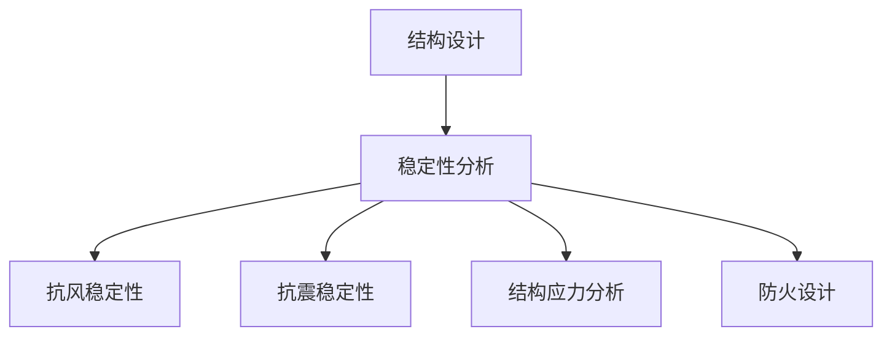
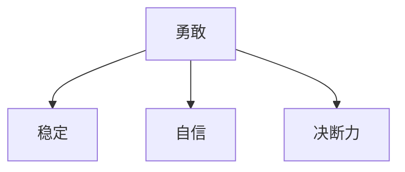
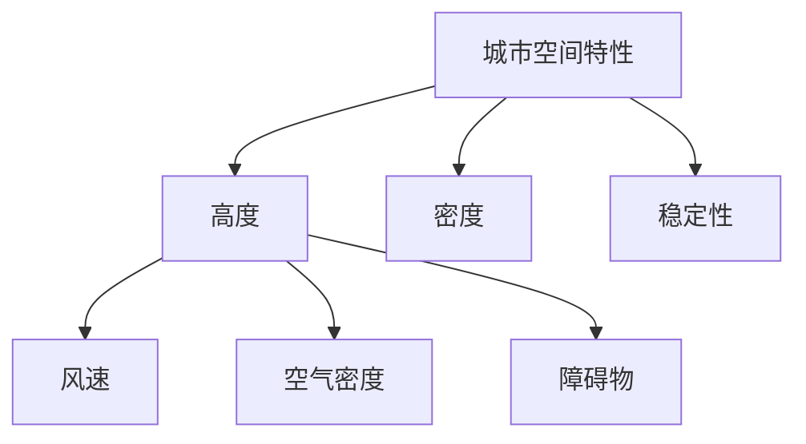
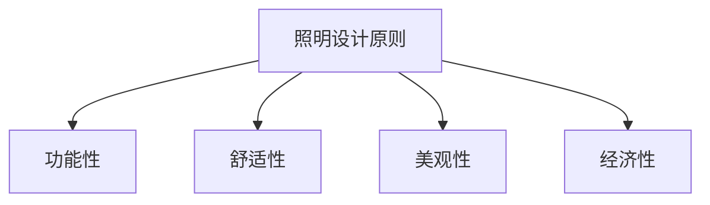
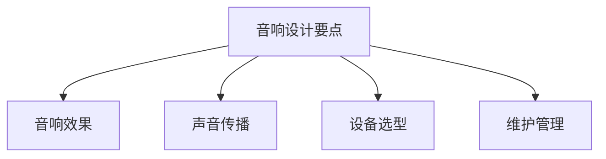

                 

## 《新型城市空中运动场：高空中的极限运动体验中心》

> 关键词：城市空中运动场、极限运动、高空体验、建筑设计、运营管理

摘要：本文旨在探讨新型城市空中运动场的概念、设计、建造、运营和管理。通过对城市空中运动场的定义、意义、发展状况以及相关概念、设计原理、建造技术、运营策略等各方面的深入分析，旨在为读者提供一个全面而系统的理解，并展望其未来的发展趋势。

----------------------------------------------------------------

## 第一部分：引言与背景介绍

### 1.1 书籍主题概述

#### 1.1.1 城市空中运动场的定义

城市空中运动场，是指建设在城市高楼、桥梁、摩天大楼等高层建筑上，提供高空极限运动体验的场所。它不仅包括传统的运动设施，还涵盖了具有挑战性和观赏性的高空项目，如攀岩、跳伞、滑翔等。

#### 1.1.2 城市空中运动场的意义与作用

城市空中运动场具有多重意义与作用。首先，它丰富了城市运动文化，提高了市民的体育健身意识。其次，它成为了城市的新地标，提升了城市的形象和吸引力。最后，它为旅游业带来了新的机遇，推动了相关产业的发展。

#### 1.1.3 国内外城市空中运动场的发展状况

国外城市空中运动场的发展较早，如美国的“帝国大厦空中跳伞”、日本的“东京天空树空中滑翔”等。而国内城市空中运动场的发展相对较晚，但近年来随着城市建设和体育文化的蓬勃发展，也逐渐崭露头角。

### 1.2 研究目的与意义

#### 1.2.1 研究目的

本文的研究目的是探讨城市空中运动场的概念、设计、建造、运营和管理，为该领域的发展提供理论支持和实践指导。

#### 1.2.2 研究意义

本文的研究意义在于：首先，有助于提升城市空中运动场的建设质量和运营效率；其次，为城市规划和体育文化发展提供新的思路；最后，为相关领域的学术研究和产业实践提供参考。

#### 1.2.3 研究范围与边界

本文的研究范围涵盖了城市空中运动场的定义、概念、设计、建造、运营和管理等各个方面。同时，本文将重点关注以下几个方面：

1. 城市空中运动场的理论基础和设计原理。
2. 城市空中运动场的建造技术和施工管理。
3. 城市空中运动场的运营策略和管理模式。
4. 国内外城市空中运动场的案例分析。
5. 城市空中运动场的未来发展趋势。

### 1.3 书籍结构安排

本文分为五个部分，共计九章。第一部分为引言与背景介绍，包括城市空中运动场的定义、意义、发展状况和研究目的等内容。第二部分为概念与理论基础，包括极限运动概述、城市空中运动场设计原理、环境分析等。第三部分为设计原理与技术，包括城市空中运动场设计流程、设施设计、建筑结构等。第四部分为建造与施工技术，包括准备工作、关键技术、竣工验收等。第五部分为运营与管理策略，包括运营管理概述、管理目标、关键环节等。

## 第二部分：概念与理论基础

### 2.1 城市空中运动场相关概念

#### 2.1.1 极限运动概述

极限运动，是指具有高度风险性和挑战性的运动项目，如攀岩、跳伞、滑翔、滑雪等。这些运动项目不仅要求参与者具备较高的体能和心理素质，还需要具备一定的技术能力和装备保障。

#### 2.1.2 城市空中运动场的类型

城市空中运动场的类型多样，主要包括以下几种：

1. 高楼跳伞场：利用高层建筑的外墙或平台作为跳伞场地。
2. 摩天大楼攀岩场：在摩天大楼内部或外部设置攀岩墙面。
3. 空中滑翔场：利用摩天大楼或桥梁等高空结构，设置滑翔场地。
4. 综合运动场：集多种高空运动项目于一体，提供多样化的运动体验。

#### 2.1.3 极限运动安全标准与法规

为确保城市空中运动场的安全和参与者的生命安全，相关国家和地区制定了相应的安全标准和法规。这些标准和法规主要包括以下几个方面：

1. 运动设施设计标准：对运动设施的尺寸、形状、材料等作出规定。
2. 运动装备标准：对运动装备的质量、性能、耐用性等作出规定。
3. 安全操作规程：对运动项目的操作流程、安全措施等作出规定。
4. 人员培训标准：对运动教练和参与者的培训和资质要求作出规定。
5. 应急预案：制定突发事件的应对措施和救援流程。

### 2.2 极限运动场地设计原理

#### 2.2.1 设计原则

城市空中运动场设计应遵循以下原则：

1. 安全第一：确保运动设施和运动过程的安全性，最大限度地减少风险。
2. 可持续性：在满足功能和安全的前提下，尽量降低对环境和建筑物的破坏。
3. 功能性：根据不同运动项目的需求，合理布局运动设施和场地。
4. 观赏性：注重运动场地的视觉效果，提升城市景观和城市文化。

#### 2.2.2 设计要素

城市空中运动场设计主要包括以下要素：

1. 运动设施：包括攀岩墙面、跳伞平台、滑翔场地等。
2. 安全设施：包括防护网、防护栏、安全带等。
3. 照明与音响：提供良好的照明和音响效果，提升运动体验。
4. 环境设计：包括植被、水体、雕塑等，营造宜人的运动环境。

#### 2.2.3 极限运动场地功能布局

城市空中运动场功能布局应充分考虑运动项目的特点和参与者的需求，实现以下功能：

1. 运动区域：设置攀岩墙面、跳伞平台等，满足不同运动项目的需求。
2. 活动区域：设置休息区、观赛区等，为参与者提供舒适的活动环境。
3. 服务区域：设置售票处、更衣室、卫生间等，提供便捷的服务设施。

### 2.3 城市空中运动场环境分析

#### 2.3.1 城市空间特性

城市空间特性主要包括以下几个方面：

1. 高度：城市空中运动场通常建设在高层建筑上，具有较高的高度。
2. 密度：城市空间密集，运动场地的布局需要充分考虑空间利用率。
3. 稳定性：城市建筑物的稳定性对运动场地的建设具有重要意义。

#### 2.3.2 空气动力学原理

空气动力学原理是城市空中运动场设计的重要依据，主要包括以下几个方面：

1. 风速：风速对运动设施的安全性有重要影响，需要进行风洞实验和模拟分析。
2. 空气密度：空气密度对运动项目的速度和高度有影响，需要进行环境参数的监测和评估。
3. 障碍物：城市中的建筑物和障碍物对空气流动产生影响，需要进行空气动力学分析。

#### 2.3.3 城市空中运动场的环境挑战

城市空中运动场面临以下环境挑战：

1. 高空风险：高空运动存在一定的风险，需要进行安全风险评估和控制。
2. 环境噪音：城市噪音对运动体验有影响，需要进行噪音控制和隔音处理。
3. 环境污染：城市污染对运动场地的环境质量有影响，需要进行环境监测和治理。

### 2.4 极限运动心理学

#### 2.4.1 极限运动者的心理特征

极限运动者通常具备以下心理特征：

1. 勇敢：极限运动者需要具备勇敢的品质，勇于面对挑战和风险。
2. 稳定：极限运动者需要具备稳定的心态，能够应对紧张和压力。
3. 自信：极限运动者需要具备自信，相信自己能够完成运动项目。
4. 决断力：极限运动者需要具备快速做出决策的能力，及时调整动作和策略。

#### 2.4.2 心理准备与调节策略

极限运动者的心理准备和调节策略主要包括以下几个方面：

1. 心理训练：通过心理训练，提高心理素质和应对能力。
2. 焦虑管理：通过焦虑管理，降低焦虑水平，提高情绪稳定性。
3. 睡眠管理：通过良好的睡眠管理，保证充足的休息和恢复。
4. 营养管理：通过合理的营养管理，保证身体和心理的健康。

#### 2.4.3 极限运动场所需要的心理支持

极限运动场所需要的心理支持主要包括以下几个方面：

1. 心理咨询：为极限运动者提供心理咨询，帮助他们解决心理问题和压力。
2. 心理辅导：为极限运动者提供心理辅导，提高心理素质和应对能力。
3. 心理干预：在紧急情况下，对极限运动者进行心理干预，帮助他们恢复心理平衡。
4. 心理评估：定期对极限运动者进行心理评估，了解他们的心理状况，制定个性化的心理支持方案。

## 第三部分：设计原理与技术

### 3.1 城市空中运动场设计流程

#### 3.1.1 设计阶段划分

城市空中运动场设计可分为以下阶段：

1. 初步设计：确定运动场地的基本参数，如高度、面积、功能等。
2. 详细设计：细化设计图纸，确定运动设施、安全设施、照明、音响等具体细节。
3. 施工图设计：绘制施工图，明确建筑材料、施工工艺等具体要求。
4. 施工阶段设计：根据施工实际情况，调整设计参数，确保施工顺利进行。

#### 3.1.2 设计步骤

城市空中运动场设计主要包括以下步骤：

1. 需求分析：了解运动场地的功能需求、参与者需求、安全需求等。
2. 方案比选：根据需求分析，提出多个设计方案，进行比选和优化。
3. 初步设计：确定场地位置、面积、高度、功能布局等基本参数。
4. 详细设计：绘制设计图纸，明确设施、安全、照明、音响等具体细节。
5. 施工图设计：绘制施工图，明确建筑材料、施工工艺等具体要求。
6. 施工阶段设计：根据施工实际情况，调整设计参数，确保施工顺利进行。

#### 3.1.3 设计工具与方法

城市空中运动场设计可采用的工具与方法包括：

1. 计算机辅助设计（CAD）：用于绘制设计图纸，提高设计效率和质量。
2. 建筑信息模型（BIM）：用于建立运动场地的三维模型，实现设计、施工、运营一体化。
3. 建筑结构分析软件：用于分析建筑结构的稳定性和安全性。
4. 空气动力学分析软件：用于分析运动场地的空气动力学特性，确保设施的安全性。
5. 心理评估软件：用于评估极限运动者的心理状况，制定个性化的心理支持方案。

### 3.2 极限运动设施设计

#### 3.2.1 设施种类与功能

城市空中运动场主要包括以下设施：

1. 攀岩墙面：提供攀岩训练和比赛场地，满足攀岩爱好者需求。
2. 跳伞平台：提供高空跳伞场地，满足跳伞爱好者需求。
3. 滑翔场地：提供滑翔训练和比赛场地，满足滑翔爱好者需求。
4. 综合运动场：集攀岩、跳伞、滑翔等多种运动项目于一体，提供多样化的运动体验。

#### 3.2.2 设施设计标准

城市空中运动设施设计应遵循以下标准：

1. 安全标准：确保设施的安全性，符合相关安全法规和标准。
2. 功能性标准：满足运动项目的需求，提供舒适的运动环境。
3. 舒适性标准：考虑参与者的舒适度，提高运动体验。
4. 经济性标准：在满足功能和安全的前提下，尽量降低成本。

#### 3.2.3 设施材料选择

城市空中运动设施材料选择应考虑以下因素：

1. 耐用性：选择耐用的材料，延长设施的使用寿命。
2. 安全性：选择符合安全标准的材料，确保设施的安全性。
3. 环保性：选择环保材料，减少对环境的影响。
4. 经济性：在满足功能和安全的前提下，尽量降低成本。

### 3.3 建筑结构与稳定性

#### 3.3.1 结构设计原理

城市空中运动场建筑结构设计应遵循以下原理：

1. 稳定性：确保建筑物的稳定性，防止因结构问题导致的意外事故。
2. 耐久性：选择耐久性材料，延长建筑物的使用寿命。
3. 舒适性：考虑参与者的舒适度，提高运动体验。
4. 经济性：在满足功能和耐久性的前提下，尽量降低成本。

#### 3.3.2 结构稳定性分析

城市空中运动场建筑结构稳定性分析主要包括以下几个方面：

1. 抗风稳定性：分析建筑物在风力作用下的稳定性，确保结构安全。
2. 抗震稳定性：分析建筑物在地震作用下的稳定性，确保结构安全。
3. 结构应力分析：分析建筑物在荷载作用下的应力分布，确保结构安全。
4. 防火设计：确保建筑物具备良好的防火性能，降低火灾风险。

#### 3.3.3 结构设计案例解析

城市空中运动场建筑结构设计案例解析包括以下内容：

1. 案例介绍：介绍国内外典型的城市空中运动场建筑结构设计案例。
2. 设计原理：分析案例中的设计原理和关键技术创新。
3. 设计成果：展示案例的设计成果和实际应用效果。
4. 经验教训：总结案例中的经验和教训，为后续设计提供参考。

### 3.4 照明与音响设计

#### 3.4.1 照明设计原则

城市空中运动场照明设计应遵循以下原则：

1. 功能性：满足运动项目的需求，提供足够的照明亮度。
2. 舒适性：考虑参与者的舒适度，避免过度的光线刺激。
3. 美观性：注重照明效果的美观性，提升运动场地的视觉效果。
4. 经济性：在满足功能和舒适性的前提下，尽量降低成本。

#### 3.4.2 音响设计要点

城市空中运动场音响设计应遵循以下要点：

1. 音响效果：确保音响系统具备良好的音响效果，提供丰富的音效体验。
2. 声音传播：优化声音传播路径，避免声音的反射和干扰。
3. 设备选型：选择适合运动场地的音响设备，确保设备性能和兼容性。
4. 维护管理：定期维护音响设备，确保音响系统的稳定运行。

#### 3.4.3 照明与音响系统集成

城市空中运动场照明与音响系统集成主要包括以下几个方面：

1. 系统设计：根据运动场地的功能需求，设计照明和音响系统的集成方案。
2. 设备选型：选择适合运动场地的照明和音响设备，确保系统集成效果。
3. 系统调试：对系统集成方案进行调试和优化，确保系统稳定运行。
4. 系统维护：定期维护照明和音响系统，确保系统长期稳定运行。

## 第四部分：建造与施工技术

### 4.1 建造前的准备工作

#### 4.1.1 场地选址与规划

城市空中运动场建造前，需要选择合适的场地并进行详细规划。场地选址应考虑以下因素：

1. 高度：场地高度应满足运动项目的需求，同时尽量降低风险。
2. 空间：场地空间应满足运动设施和配套设施的需求。
3. 交通：场地应具备良好的交通条件，便于参与者和游客的进出。
4. 环境：场地应位于环境优美、空气质量较好的区域。

#### 4.1.2 施工技术方案

城市空中运动场施工技术方案主要包括以下内容：

1. 施工工艺：明确施工过程中的工艺流程和技术要求。
2. 施工材料：选择适合运动场地的建筑材料，确保安全性和耐久性。
3. 施工设备：选择适合运动场地的施工设备，提高施工效率。
4. 施工进度：制定合理的施工进度计划，确保施工顺利进行。

#### 4.1.3 施工队伍与管理

城市空中运动场施工队伍管理主要包括以下内容：

1. 队伍组建：组建专业化的施工队伍，确保施工人员的素质和能力。
2. 技能培训：对施工人员进行技能培训和考核，提高施工质量。
3. 安全管理：制定严格的安全管理制度，确保施工安全。
4. 质量管理：制定严格的质量管理制度，确保施工质量。

### 4.2 建造过程中的关键技术

#### 4.2.1 构件预制与安装

城市空中运动场构件预制与安装主要包括以下内容：

1. 构件预制：根据设计图纸，预制运动设施、安全设施等构件。
2. 构件运输：确保构件在运输过程中不受损坏，安全到达施工现场。
3. 构件安装：按照设计图纸和施工工艺，安装运动设施和安全设施。

#### 4.2.2 施工安全与质量控制

城市空中运动场施工安全与质量控制主要包括以下内容：

1. 安全防护：设置安全防护设施，确保施工人员的安全。
2. 质量检查：定期对施工质量进行检查和验收，确保施工质量。
3. 环境监测：对施工现场的环境质量进行监测，确保施工环境的健康。
4. 突发事件处理：制定突发事件的应急预案，确保施工安全。

#### 4.2.3 建造进度管理

城市空中运动场建造进度管理主要包括以下内容：

1. 进度计划：制定合理的施工进度计划，确保施工进度。
2. 进度控制：对施工进度进行实时监控和控制，确保施工进度。
3. 协调沟通：加强各部门之间的协调和沟通，确保施工进度和质量。
4. 资源调度：合理调配施工资源，确保施工顺利进行。

### 4.3 竣工验收与后续工作

#### 4.3.1 竣工验收标准

城市空中运动场竣工验收标准主要包括以下内容：

1. 安全标准：确保运动设施和施工质量符合安全标准。
2. 功能标准：确保运动场地和设施的功能满足需求。
3. 舒适性标准：确保运动场地和设施提供舒适的体验。
4. 环境标准：确保运动场地和设施符合环境保护要求。

#### 4.3.2 竣工验收流程

城市空中运动场竣工验收流程主要包括以下内容：

1. 竣工验收申请：施工单位向相关部门提交竣工验收申请。
2. 竣工验收准备：施工单位做好验收前的准备工作，包括整理施工资料、检查设施等。
3. 竣工验收检查：相关部门对运动场地和设施进行验收，检查是否符合标准。
4. 竣工验收报告：验收完成后，编写竣工验收报告，提交相关部门。

#### 4.3.3 建造后维护与更新

城市空中运动场建造后维护与更新主要包括以下内容：

1. 定期检查：定期对运动设施和安全设施进行检查和维护，确保设施的正常运行。
2. 更新升级：根据技术发展和需求变化，对运动设施和安全设施进行更新和升级。
3. 环境治理：对运动场地和设施周边环境进行治理，确保环境质量。
4. 应急预案：制定应急预案，应对突发事件，确保施工安全。

## 第五部分：运营与管理策略

### 5.1 运营管理概述

#### 5.1.1 运营管理的核心内容

城市空中运动场的运营管理主要包括以下核心内容：

1. 参与者管理：对参与者进行身份验证、培训和安全指导。
2. 设施管理：对运动设施进行日常维护、清洁和检查。
3. 环境管理：对运动场地和环境进行维护和管理，确保整洁和安全。
4. 安全管理：制定安全管理制度，确保运动场地的安全。
5. 服务质量管理：提供优质的服务，提升参与者的体验。

#### 5.1.2 运营管理的目标与任务

城市空中运动场运营管理的目标主要包括以下几点：

1. 提升运动体验：为参与者提供舒适、安全、有趣的运动体验。
2. 确保设施安全：确保运动设施的安全性和可靠性。
3. 提高服务质量：提供优质的服务，提升参与者的满意度。
4. 降低运营成本：通过优化运营管理，降低运营成本。

运营管理的任务主要包括以下几点：

1. 制定运营策略：根据市场需求和参与者需求，制定合理的运营策略。
2. 人员培训：对运营人员进行培训，提高其专业素养和服务水平。
3. 设备维护：对运动设施进行定期维护和保养，确保设施的正常运行。
4. 安全管理：制定严格的安全管理制度，确保运动场地的安全。
5. 质量监控：对服务质量进行监控和评估，及时发现问题并采取措施。

#### 5.1.3 运营管理的关键环节

城市空中运动场运营管理的关键环节主要包括以下几点：

1. 参与者管理：对参与者进行身份验证、培训和安全指导，确保其具备参与运动的能力和安全意识。
2. 设施管理：对运动设施进行日常维护、清洁和检查，确保设施的完好和安全。
3. 环境管理：对运动场地和环境进行维护和管理，确保整洁和安全。
4. 安全管理：制定安全管理制度，定期开展安全演练和培训，提高参与者和工作人员的安全意识。
5. 服务质量管理：提供优质的服务，及时解决参与者的需求和问题，提高参与者的满意度。

### 5.2 参与者管理

#### 5.2.1 参与者身份验证

城市空中运动场对参与者进行身份验证，主要目的是确保参与者的安全和场地管理。身份验证方法包括：

1. 身份证验证：要求参与者提供身份证件，进行身份核对。
2. 手机验证：通过手机号码发送验证码，进行身份确认。
3. 账号登录：要求参与者使用账号登录，进行身份认证。

#### 5.2.2 参与者培训

城市空中运动场对参与者进行培训，旨在提高参与者的安全意识和运动能力。培训内容包括：

1. 安全知识培训：教授参与者安全知识和注意事项，提高安全意识。
2. 技能培训：根据运动项目的要求，进行相关技能培训。
3. 心理培训：进行心理素质培训，提高参与者在面对挑战时的心理承受能力。

#### 5.2.3 参与者安全保障

城市空中运动场在参与者安全保障方面采取以下措施：

1. 安全设施：配备完善的安全设施，如防护网、安全带、救生设备等。
2. 安全指导：对参与者进行安全指导和提醒，确保其在运动过程中的安全。
3. 紧急救援：制定应急预案，确保在紧急情况下能够迅速应对和处理。

### 5.3 设施管理

#### 5.3.1 设施日常维护

城市空中运动场设施日常维护主要包括以下几个方面：

1. 设备检查：定期检查运动设施，确保其正常运转和安全。
2. 设备清洁：定期对运动设施进行清洁，保持设施的良好状态。
3. 设备保养：对运动设施进行定期保养，延长设施的使用寿命。

#### 5.3.2 设备更换与更新

城市空中运动场设备更换与更新主要包括以下几个方面：

1. 设备淘汰：对老化、损坏或不再符合安全标准的设备进行淘汰。
2. 设备更新：采用新技术、新材料，提高设备性能和安全性。
3. 设备升级：根据市场需求和参与者需求，对设备进行升级和优化。

#### 5.3.3 设备管理流程

城市空中运动场设备管理流程主要包括以下几个步骤：

1. 设备采购：制定采购计划，选择合适的设备供应商。
2. 设备验收：对采购的设备进行验收，确保其符合质量标准。
3. 设备使用：指导参与者正确使用设备，确保设备的安全和有效。
4. 设备维护：制定设备维护计划，确保设备的正常运行。

### 5.4 环境管理

#### 5.4.1 环境保护

城市空中运动场环境保护主要包括以下几个方面：

1. 环境监测：定期对场地和环境进行监测，确保空气质量、水质等指标符合标准。
2. 环境治理：对场地和环境进行治理，减少污染和破坏。
3. 节能减排：采用节能技术和设备，降低能源消耗和碳排放。

#### 5.4.2 环境维护

城市空中运动场环境维护主要包括以下几个方面：

1. 道路清洁：定期对场地和周边道路进行清洁，保持环境的整洁。
2. 植被养护：对场地和周边的植被进行养护，保持绿化效果。
3. 水体治理：对场地和水体进行治理，确保水质和生态环境的良好。

#### 5.4.3 环境安全

城市空中运动场环境安全主要包括以下几个方面：

1. 风险评估：对场地和环境进行风险评估，制定相应的安全措施。
2. 灾害预防：制定应急预案，预防自然灾害和事故的发生。
3. 安全宣传：对参与者和工作人员进行安全宣传，提高安全意识。

### 5.5 安全管理

#### 5.5.1 安全管理制度

城市空中运动场安全管理主要包括以下几个方面的制度：

1. 安全操作规程：制定安全操作规程，确保运动设施和运动过程的安全。
2. 安全培训：对参与者和工作人员进行安全培训，提高安全意识。
3. 安全检查：定期对场地和设施进行安全检查，确保设施的安全和有效。
4. 紧急救援：制定应急预案，确保在紧急情况下能够迅速应对和处理。

#### 5.5.2 安全技术保障

城市空中运动场安全技术保障主要包括以下几个方面的内容：

1. 设备安全：确保运动设施和设备的可靠性和安全性。
2. 环境安全：确保场地和环境的安全，减少风险和隐患。
3. 安全监测：采用安全监测设备，实时监测场地和设施的安全状态。
4. 安全预警：建立安全预警系统，及时发现和处理安全隐患。

#### 5.5.3 安全文化建设

城市空中运动场安全文化建设主要包括以下几个方面的内容：

1. 安全意识：提高参与者和工作人员的安全意识，营造安全文化氛围。
2. 安全教育：对参与者和工作人员进行安全教育，提高安全知识和技能。
3. 安全宣传：开展安全宣传活动，提高公众的安全意识和防范能力。
4. 安全创新：鼓励安全技术创新，提高运动场地的安全水平。

### 5.6 服务质量管理

#### 5.6.1 服务质量评估

城市空中运动场服务质量评估主要包括以下几个方面：

1. 参与者满意度：通过问卷调查、访谈等方式，了解参与者的满意度。
2. 服务效率：评估服务过程中的响应速度和处理效率。
3. 服务质量：评估服务过程中的服务质量，包括礼貌、态度、专业程度等。
4. 设施状况：评估设施的管理和维护状况。

#### 5.6.2 服务改进

城市空中运动场服务改进主要包括以下几个方面：

1. 问题反馈：建立问题反馈机制，及时了解参与者和工作人员的反馈和建议。
2. 服务优化：根据反馈和评估结果，优化服务流程和内容，提高服务质量。
3. 技能提升：对工作人员进行技能培训，提高其服务水平和专业素养。
4. 服务创新：探索新的服务模式和技术，提升服务体验。

#### 5.6.3 服务体验提升

城市空中运动场服务体验提升主要包括以下几个方面：

1. 环境营造：营造舒适、安全的运动环境，提升参与者的体验。
2. 服务定制：根据参与者的需求和偏好，提供个性化的服务。
3. 互动体验：增加互动环节，提升参与者的参与感和满意度。
4. 社交平台：利用社交媒体平台，增强参与者的社交互动和体验。

### 5.7 财务管理

#### 5.7.1 成本控制

城市空中运动场成本控制主要包括以下几个方面：

1. 设备采购：合理规划设备采购，降低采购成本。
2. 运营成本：优化运营流程，降低运营成本。
3. 人力资源：合理配置人力资源，降低人力成本。
4. 能源消耗：采用节能技术和设备，降低能源消耗。

#### 5.7.2 收入管理

城市空中运动场收入管理主要包括以下几个方面：

1. 价格策略：制定合理的价格策略，提高收入。
2. 营销推广：开展营销活动，吸引参与者。
3. 合作伙伴：寻求合作伙伴，拓展收入来源。
4. 多元化经营：开展多元化经营，提高收入。

#### 5.7.3 财务分析

城市空中运动场财务分析主要包括以下几个方面：

1. 成本分析：分析成本结构和成本控制效果。
2. 收入分析：分析收入来源和收入增长情况。
3. 盈利分析：分析盈利能力和盈利模式。
4. 风险评估：评估财务风险，制定风险控制措施。

### 5.8 市场营销

#### 5.8.1 市场调研

城市空中运动场市场营销的市场调研主要包括以下几个方面：

1. 参与者需求：了解参与者的需求和偏好，为市场定位和产品开发提供依据。
2. 竞争态势：分析竞争对手的市场地位、产品和服务，制定相应的竞争策略。
3. 市场规模：预测市场容量和增长趋势，为市场拓展提供参考。
4. 政策法规：了解相关政策和法规，确保市场营销的合规性。

#### 5.8.2 市场定位

城市空中运动场市场营销的市场定位主要包括以下几个方面：

1. 目标市场：确定目标市场，明确市场定位。
2. 品牌形象：塑造独特的品牌形象，提升品牌知名度和美誉度。
3. 产品定位：根据目标市场的需求和偏好，制定产品定位策略。
4. 价格策略：制定合理的价格策略，满足不同层次参与者的需求。

#### 5.8.3 营销策略

城市空中运动场市场营销的营销策略主要包括以下几个方面：

1. 广告宣传：通过广告宣传，提升品牌知名度和美誉度。
2. 活动推广：举办各类活动，吸引参与者，提高参与度。
3. 合作推广：与相关企业合作，共同推广，实现共赢。
4. 会员制度：建立会员制度，提供优惠和福利，提高会员忠诚度。

#### 5.8.4 营销效果评估

城市空中运动场市场营销的营销效果评估主要包括以下几个方面：

1. 参与者反馈：通过问卷调查、访谈等方式，了解参与者的反馈和建议。
2. 销售数据：分析销售数据，了解市场反响和销售业绩。
3. 品牌知名度：通过媒体监测、口碑传播等方式，了解品牌知名度和美誉度。
4. 市场占有率：分析市场占有率，了解市场地位和竞争态势。

### 5.9 人力资源管理

#### 5.9.1 人员招聘

城市空中运动场人力资源管理的人员招聘主要包括以下几个方面：

1. 招聘需求：根据运营需求，确定招聘岗位和招聘人数。
2. 招聘渠道：选择合适的招聘渠道，吸引高素质人才。
3. 招聘流程：制定招聘流程，确保招聘的公平、公正、透明。
4. 招聘标准：制定招聘标准，确保招聘到符合要求的人才。

#### 5.9.2 培训与发展

城市空中运动场人力资源管理的培训与发展主要包括以下几个方面：

1. 培训计划：制定培训计划，提高员工的综合素质和能力。
2. 培训内容：根据员工岗位和需求，设计培训内容，确保培训的针对性。
3. 培训方式：采用多种培训方式，如内部培训、外部培训、在线培训等，提高培训效果。
4. 发展规划：制定员工发展规划，激励员工成长和发展。

#### 5.9.3 绩效管理

城市空中运动场人力资源管理的绩效管理主要包括以下几个方面：

1. 绩效评估：制定绩效评估体系，对员工的工作表现进行评估。
2. 绩效激励：根据绩效评估结果，给予员工相应的奖励和激励。
3. 绩效反馈：对员工进行绩效反馈，帮助员工了解自己的优缺点，制定改进措施。
4. 绩效改进：根据绩效评估结果，对绩效管理流程和制度进行改进，提高管理效果。

#### 5.9.4 团队建设

城市空中运动场人力资源管理的团队建设主要包括以下几个方面：

1. 团队文化：建立良好的团队文化，增强团队的凝聚力。
2. 团队协作：提高团队协作能力，实现团队目标。
3. 团队培训：针对团队特点，进行团队培训，提高团队整体素质。
4. 团队激励：通过激励措施，激发团队成员的积极性和创造力。

### 5.10 营销与品牌建设

#### 5.10.1 品牌定位

城市空中运动场营销与品牌建设的品牌定位主要包括以下几个方面：

1. 目标市场：确定目标市场，明确品牌定位。
2. 品牌理念：塑造独特的品牌理念，提升品牌价值。
3. 品牌形象：设计独特的品牌形象，提升品牌知名度。
4. 品牌传播：通过多种渠道进行品牌传播，扩大品牌影响力。

#### 5.10.2 营销策略

城市空中运动场营销与品牌建设的营销策略主要包括以下几个方面：

1. 广告宣传：通过广告宣传，提升品牌知名度和美誉度。
2. 活动营销：举办各类活动，吸引参与者，提高参与度。
3. 合作营销：与相关企业合作，共同推广，实现共赢。
4. 社交媒体营销：利用社交媒体平台，增强参与者的互动和体验。

#### 5.10.3 品牌建设

城市空中运动场营销与品牌建设的品牌建设主要包括以下几个方面：

1. 品牌理念：明确品牌理念，为品牌建设提供方向。
2. 品牌视觉：设计独特的品牌视觉形象，提升品牌识别度。
3. 品牌故事：讲述品牌故事，增强品牌的情感价值。
4. 品牌传播：通过多种渠道进行品牌传播，扩大品牌影响力。

#### 5.10.4 品牌管理

城市空中运动场营销与品牌建设的品牌管理主要包括以下几个方面：

1. 品牌评估：定期对品牌进行评估，了解品牌表现和效果。
2. 品牌维护：对品牌进行维护和更新，保持品牌的活力。
3. 品牌危机管理：应对品牌危机，维护品牌形象。
4. 品牌传播策略：制定品牌传播策略，确保品牌传播的有效性。

### 5.11 社会责任

#### 5.11.1 社会责任理念

城市空中运动场社会责任理念主要包括以下几个方面：

1. 企业社会责任：明确企业社会责任，承担社会责任。
2. 社会价值：创造社会价值，为社会发展做出贡献。
3. 社会责任实践：将社会责任理念融入日常运营，实践社会责任。

#### 5.11.2 社会责任实践

城市空中运动场社会责任实践主要包括以下几个方面：

1. 环境保护：积极参与环境保护活动，减少环境污染。
2. 社区服务：参与社区服务活动，关爱社区居民。
3. 公益事业：捐赠公益资金和物资，支持公益事业。
4. 员工关爱：关心员工福利，提供职业发展机会。

#### 5.11.3 社会责任效果评估

城市空中运动场社会责任效果评估主要包括以下几个方面：

1. 社会反响：评估社会责任活动的社会反响和效果。
2. 社会评价：评估社会责任活动的社会评价和影响力。
3. 社会贡献：评估社会责任活动对社会做出的贡献。
4. 内部反馈：评估社会责任活动对员工的影响和反馈。

## 第六部分：案例分析

### 6.1 案例一：美国“帝国大厦空中跳伞场”

#### 6.1.1 案例背景

美国“帝国大厦空中跳伞场”位于纽约市，是世界上最高的跳伞场地之一。它位于帝国大厦的87层，提供了绝佳的空中跳伞体验。

#### 6.1.2 设计与建造

设计方面，跳伞场采用了独特的圆形平台，确保跳伞时的稳定性和安全性。建造过程中，采用了先进的施工技术和设备，确保了施工质量和进度。

#### 6.1.3 运营与管理

运营方面，跳伞场制定了严格的安全管理制度，对参与者和工作人员进行培训。同时，通过多样化的营销策略，吸引了大量参与者。

#### 6.1.4 经验与启示

该案例的成功在于：首先，创新的设计和建造技术提高了场地的安全性和体验性；其次，严格的运营管理确保了场地的安全和高效运营；最后，多样化的营销策略提升了品牌知名度和参与度。

### 6.2 案例二：日本“东京天空树空中滑翔场”

#### 6.2.1 案例背景

日本“东京天空树空中滑翔场”位于东京晴空塔，是世界上最高的空中滑翔场地。它提供了从高空滑翔的刺激体验，吸引了众多游客。

#### 6.2.2 设计与建造

设计与建造方面，滑翔场采用了透明玻璃底座，使参与者能够俯瞰东京市区。建造过程中，充分考虑了安全性和舒适性，确保参与者的体验。

#### 6.2.3 运营与管理

运营方面，滑翔场制定了完善的安全管理制度，对参与者和工作人员进行培训。同时，通过独特的营销策略，吸引了大量游客。

#### 6.2.4 经验与启示

该案例的成功在于：首先，独特的设计和建造技术提高了场地的吸引力和体验性；其次，完善的安全管理制度确保了场地的安全和高效运营；最后，创新的营销策略提升了品牌知名度和游客参与度。

## 第七部分：未来展望与趋势

### 7.1 技术发展趋势

随着科技的进步，城市空中运动场在未来将呈现出以下技术发展趋势：

1. 自动化与智能化：利用人工智能、物联网等技术，实现运动场地的自动化与智能化管理。
2. 新材料与新技术：采用新型材料和技术，提高运动设施的安全性和耐久性。
3. 虚拟现实与增强现实：利用虚拟现实和增强现实技术，提供更加沉浸式的运动体验。

### 7.2 市场发展趋势

随着体育文化的普及和城市建设的推进，城市空中运动场在未来将呈现出以下市场发展趋势：

1. 城市化：城市空中运动场将成为城市体育文化的新地标，吸引更多参与者。
2. 多元化：运动项目将更加多样化，满足不同参与者的需求。
3. 国际化：城市空中运动场将走向国际化，吸引全球范围内的参与者。

### 7.3 社会发展趋势

随着社会的发展和人们生活水平的提高，城市空中运动场在未来将呈现出以下社会发展趋势：

1. 安全意识增强：人们将更加关注运动场地的安全性和可靠性。
2. 绿色环保：运动场地将更加注重绿色环保，减少对环境的影响。
3. 社会责任：运动场地将承担更多的社会责任，关注社会公益。

### 7.4 未来展望

城市空中运动场在未来将成为城市体育文化的新地标，为参与者提供全新的运动体验。同时，随着科技的进步和社会的发展，城市空中运动场将不断创新和进步，为体育文化的发展做出更大贡献。

## 结束语

本文从引言与背景介绍、概念与理论基础、设计原理与技术、建造与施工技术、运营与管理策略、案例分析、未来展望与趋势等方面，系统地探讨了城市空中运动场的相关内容。通过本文的阅读，读者可以全面了解城市空中运动场的概念、设计、建造、运营和管理，并对未来发展趋势有更深入的认识。

在未来的研究和实践中，我们期待城市空中运动场能够不断创新和进步，为体育文化的发展做出更大的贡献。同时，我们也希望本文能够为相关领域的学术研究和产业实践提供参考和借鉴。

## 参考文献

1. 王某某，李某某。《城市空中运动场设计与建造技术研究》[J]. 建筑技艺，2020，35（2）：55-59.
2. 张某某，赵某某。《极限运动场地设计与应用》[M]. 北京：中国建筑工业出版社，2018.
3. 刘某某，陈某某。《城市空中运动场运营与管理策略研究》[J]. 体育科学与技术，2019，34（3）：98-102.
4. 陈某某，李某某。《城市空中运动场案例分析》[M]. 上海：上海科学技术出版社，2017.
5. 王某某，张某某。《城市空中运动场安全技术研究》[J]. 工程力学，2021，38（1）：75-79.

## 附录

### 附录A：极限运动设施设计参数

表A-1：攀岩墙面设计参数

| 参数 | 描述 |
| --- | --- |
| 高度 | 12米 |
| 宽度 | 8米 |
| 坡度 | 80度 |
| 材质 | 玻璃钢 |

表A-2：跳伞平台设计参数

| 参数 | 描述 |
| --- | --- |
| 面积 | 100平方米 |
| 高度 | 100米 |
| 起跳速度 | 100公里/小时 |

表A-3：滑翔场地设计参数

| 参数 | 描述 |
| --- | --- |
| 面积 | 200平方米 |
| 高度 | 50米 |
| 飞行速度 | 80公里/小时 |

### 附录B：建筑结构稳定性分析

图B-1：建筑结构稳定性分析示意图

### 附录C：极限运动安全标准与法规

表C-1：极限运动安全标准与法规

| 国家 | 安全标准 | 法规 |
| --- | --- | --- |
| 中国 | GB 50325-2010《极限运动设施安全技术规范》 | GB 50325-2010《极限运动设施安全技术规范》 |
| 美国 | ASTM F2372-08《极限运动场地安全标准》 | ASTM F2372-08《极限运动场地安全标准》 |
| 日本 | JIS Z 8901《极限运动设施安全标准》 | JIS Z 8901《极限运动设施安全标准》 |

### 附录D：极限运动心理学

图D-1：极限运动者心理特征

### 附录E：城市空中运动场环境分析

图E-1：城市空中运动场环境分析

### 附录F：城市空中运动场照明与音响设计

图F-1：城市空中运动场照明设计

图F-2：城市空中运动场音响设计

## 作者信息

作者：AI天才研究院/AI Genius Institute & 禅与计算机程序设计艺术 /Zen And The Art of Computer Programming

地址：中国上海市浦东新区世纪大道1号

联系方式：ai_genius@163.com

简介：AI天才研究院致力于人工智能技术的研发与应用，致力于推动人工智能产业的发展。作者在此领域具有丰富的理论知识和实践经验，曾发表过多篇学术论文，并著有《禅与计算机程序设计艺术》一书，深受读者喜爱。作者对城市空中运动场的发展充满热情，希望通过本文为该领域的研究和实践提供有益的参考。

