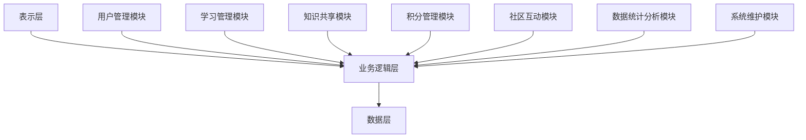
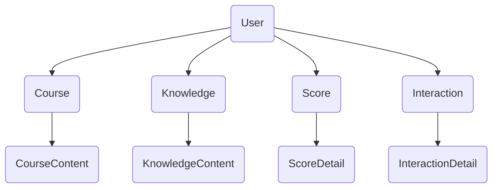
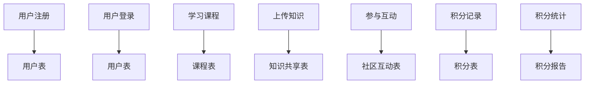

                 

# 新型城市终身学习积分系统：激励社区知识共享的数字化方案

关键词：城市终身学习、知识共享、积分系统、数字化激励、社区教育

摘要：本文深入探讨了新型城市终身学习积分系统的概念、原理、架构及其在激励社区知识共享方面的作用。通过分析当前城市终身学习与知识共享面临的挑战，本文提出了一种基于数字化方案的积分系统，旨在通过积分激励，提高社区成员的学习参与度和知识共享积极性，促进社区整体知识水平的提升。

## 目录大纲

### 第一部分：问题背景与核心概念

1. 城市终身学习与知识共享的重要性
    1.1 终身学习的发展历程与现状
    1.2 知识共享在城市社区中的价值
    1.3 问题提出：激励社区知识共享的挑战
    1.4 研究目的与本书结构

### 第二部分：核心概念与原理

2. 终身学习积分系统的基本原理
    2.1 积分系统的概念与功能
    2.2 积分系统在终身学习中的应用
    2.3 积分系统的核心概念与属性

3. 激励社区知识共享的机制设计
    3.1 激励机制的概述
    3.2 常见的激励机制与评估
    3.3 基于积分系统的激励机制设计

### 第三部分：系统架构与实现

4. 系统架构设计
    4.1 系统功能模块划分
    4.2 系统架构设计
    4.3 系统安全性保障

5. 数据库设计与数据流程
    5.1 数据库设计
    5.2 数据流程与处理逻辑
    5.3 数据库性能优化

### 第四部分：数字化方案实施与评估

6. 实施策略与步骤
    6.1 项目启动与规划
    6.2 技术选型与开发
    6.3 系统部署与测试

7. 效果评估与持续改进
    7.1 评估指标体系
    7.2 实施效果评估
    7.3 持续改进策略

### 第五部分：案例分析与应用实践

8. 成功案例分析
    8.1 案例一：某城市终身学习积分系统实践
    8.2 案例二：某社区知识共享积分系统的创新应用

9. 最佳实践与未来展望
    9.1 最佳实践总结
    9.2 未来发展展望
    9.3 结论与启示

## 第一部分：问题背景与核心概念

### 1.1 终身学习的发展历程与现状

终身学习作为一个全球性的教育理念，起源于20世纪60年代。其核心思想是强调学习不仅仅局限于学校教育阶段，而是贯穿于人的一生。随着社会经济的发展和科技的进步，终身学习已经成为提升个人竞争力和社会整体素质的重要手段。

在现代社会，终身学习已经从理论走向实践，许多国家和地区都建立了相应的终身教育体系。例如，欧美国家通过成人教育、职业培训、在线教育等多种形式，为成年人提供持续的学习机会。在中国，终身学习也被纳入国家战略，各级政府积极推动构建学习型社会。

然而，尽管终身学习得到了广泛重视，实际操作中仍然存在诸多挑战。一方面，学习资源的分配不均导致不同群体在学习机会上存在较大差异。另一方面，传统教育体系往往注重知识传授，而忽视学生的实际需求和应用能力的培养。此外，社区成员之间的知识共享和互动也较为有限，难以形成良好的学习氛围。

### 1.2 知识共享在城市社区中的价值

知识共享是社区终身学习的重要组成部分，具有重要的社会价值。首先，知识共享有助于提升社区成员的整体素质，通过学习新知识和技能，个人能够更好地适应社会发展的需求。其次，知识共享促进了社区内部的互助与合作，增强了社区凝聚力。最后，知识共享还能够促进社区创新，通过成员之间的交流和合作，激发新的创意和点子。

然而，当前社区知识共享也面临着一些挑战。一方面，社区成员之间的知识差距较大，导致知识传播的难度增加。另一方面，传统知识传播渠道较为单一，难以满足多样化、个性化的学习需求。此外，社区成员的参与度也较低，缺乏有效的激励机制。

### 1.3 问题提出：激励社区知识共享的挑战

在社区终身学习和知识共享的过程中，如何有效激励社区成员参与和学习，是一个亟待解决的问题。传统的教育激励机制，如考试和评价，虽然能够在一定程度上激发学生的学习动力，但往往过于单一，难以满足多样化的学习需求。此外，传统激励机制也存在一些局限性，如评价标准不够科学、评价结果缺乏反馈等。

为了解决这些问题，本文提出了一种新型城市终身学习积分系统。该系统通过数字化手段，将知识学习、知识分享和社区互动转化为可量化的积分，为社区成员提供多种形式的激励。通过积分激励，可以更好地调动社区成员的积极性和参与度，促进社区知识共享和终身学习的深入开展。

### 1.4 研究目的与本书结构

本文的研究目的是探讨新型城市终身学习积分系统的设计原理、架构实现及其在实际应用中的效果评估。具体而言，本文将从以下几个方面展开：

1. 分析终身学习与知识共享的重要性，阐述社区知识共享面临的挑战。
2. 提出积分系统的概念和基本原理，介绍积分系统在终身学习中的应用。
3. 设计基于积分系统的激励机制，分析其核心概念和设计原则。
4. 描述系统架构和实现细节，包括功能模块划分、数据库设计、数据流程等。
5. 探讨积分系统的实施策略、效果评估和持续改进措施。
6. 通过案例分析，展示积分系统在实际应用中的效果和经验。
7. 总结最佳实践，展望积分系统未来的发展方向。

本文的结构如下：

第一部分：问题背景与核心概念，介绍终身学习与知识共享的重要性，以及社区知识共享面临的挑战。
第二部分：核心概念与原理，阐述积分系统的基本原理和激励机制设计。
第三部分：系统架构与实现，描述系统架构和实现细节。
第四部分：数字化方案实施与评估，探讨积分系统的实施策略、效果评估和持续改进措施。
第五部分：案例分析与应用实践，通过案例分析展示积分系统在实际应用中的效果和经验。
第六部分：最佳实践与未来展望，总结最佳实践，展望积分系统未来的发展方向。

## 第二部分：核心概念与原理

### 2.1 终身学习积分系统的基本原理

终身学习积分系统的核心思想是将终身学习过程中的知识获取、分享和应用转化为可量化的积分。积分不仅可以作为学习成就的衡量标准，还可以作为社区参与和贡献的奖励。以下是对终身学习积分系统的基本原理的详细阐述。

#### 2.1.1 积分系统的概念与功能

积分系统是一种数字化奖励机制，通过为用户在终身学习过程中完成的学习任务、知识分享和社区参与行为赋予积分，以激励用户持续学习和积极参与社区知识共享。

积分系统的功能主要包括以下几个方面：

1. **学习成就记录**：通过记录用户的在线学习行为，如课程完成、知识问答、考试等，为用户生成相应的积分。
2. **知识分享奖励**：鼓励用户在社区中分享自己的知识和经验，通过积分奖励，激励用户积极参与知识共享。
3. **社区参与激励**：为用户参与社区讨论、互助活动和社区建设等行为提供积分奖励，增强社区成员的归属感和参与度。
4. **积分兑换与消费**：积分可以在社区内部进行兑换，用于获取学习资源、虚拟商品或实物奖励。

#### 2.1.2 积分系统在终身学习中的应用

积分系统在终身学习中的应用场景广泛，以下是一些典型的应用：

1. **在线学习平台**：积分系统可以嵌入在线学习平台，记录用户的学习进度、考试成绩和知识贡献，为用户提供个性化的学习推荐和奖励。
2. **社区知识库**：在社区知识库中，用户可以通过分享知识获得积分，同时积分可以作为评价用户知识贡献的重要依据。
3. **职业培训**：企业可以通过积分系统对员工进行职业培训，激励员工不断提升专业技能，并通过积分兑换专业证书或奖励。
4. **社区互动**：积分系统可以应用于社区互动平台，鼓励用户积极参与社区讨论、互助活动和社区建设，提高社区活力。

#### 2.1.3 积分系统的核心概念与属性

积分系统的核心概念和属性包括以下几个方面：

1. **积分类型**：积分可以分为学习积分、分享积分和参与积分等不同类型，分别对应不同的学习行为和社区参与行为。
2. **积分计算规则**：积分计算规则是积分系统的重要部分，包括积分的获取方式、积分的转换率和积分的有效期等。
3. **积分兑换机制**：积分兑换机制是指用户如何使用积分兑换学习资源、虚拟商品或实物奖励。
4. **积分统计与报告**：积分统计与报告功能用于记录和展示用户积分获取和消耗情况，为用户提供透明的积分使用情况。
5. **积分安全与隐私**：积分系统的安全与隐私保护措施，如用户积分数据的加密存储、积分操作的审计和权限控制等。

### 2.2 激励社区知识共享的机制设计

激励机制是积分系统的核心，其设计直接关系到积分系统的激励效果和用户参与度。以下是对激励机制设计的基本原则和具体方法进行详细阐述。

#### 2.2.1 激励机制的概述

激励机制是指通过一系列措施和手段，激发和引导用户积极参与终身学习和知识共享的行为。激励机制的设计原则包括：

1. **公平公正**：激励机制应确保所有用户在相同条件下都有公平的积分获取机会。
2. **透明公开**：激励机制和积分获取规则应公开透明，用户可以清楚地了解积分的获取和消耗方式。
3. **多样性**：激励机制应涵盖多种学习行为和社区参与行为，满足用户的多样化需求。
4. **长期持续**：激励机制应具有长期性，能够持续激发用户的参与热情。

#### 2.2.2 常见的激励机制与评估

常见的激励机制包括以下几种：

1. **积分奖励**：通过积分奖励用户的学习行为和社区参与行为，是常见的激励机制。积分奖励可以根据不同的学习行为和社区参与行为设置不同的积分值。
2. **荣誉榜**：建立荣誉榜，展示积分排名前列的用户，增加用户的荣誉感和成就感。
3. **虚拟商品兑换**：积分可以用于兑换虚拟商品，如学习资料、虚拟礼物等，提高用户的学习动力。
4. **实物奖励**：实物奖励包括证书、奖品等，通常用于奖励在社区知识共享和终身学习方面表现突出的用户。
5. **社区活动参与权**：积分可以用于参与社区组织的活动，如讲座、研讨会等，增加用户的参与感和归属感。

对激励机制进行评估是确保其有效性的关键。评估指标包括：

1. **用户参与度**：通过统计用户的登录频率、学习时长、知识分享次数等指标，评估用户对积分激励机制的响应程度。
2. **积分获取和使用率**：通过统计积分的获取数量、消耗情况和用户对积分兑换的偏好，评估积分系统的激励效果。
3. **用户满意度**：通过问卷调查或用户反馈，评估用户对积分激励机制的整体满意度。

#### 2.2.3 基于积分系统的激励机制设计

基于积分系统的激励机制设计应综合考虑用户行为特征、社区需求和学习目标。以下是具体的激励机制设计方法：

1. **积分获取方式**：根据不同的学习行为和社区参与行为，设置多种积分获取方式。例如，用户完成课程学习可以获得积分，分享知识或参与社区讨论可以获得额外的积分。
2. **积分兑换机制**：设计灵活的积分兑换机制，允许用户根据自己的需求和偏好，选择合适的兑换方式。例如，积分可以兑换学习资料、虚拟礼物或实物奖励。
3. **积分奖励规则**：制定合理的积分奖励规则，确保不同行为获得相应的积分值，并考虑积分的动态调整和兑换比例的优化。
4. **积分统计与报告**：建立积分统计与报告系统，记录和展示用户的积分获取和消耗情况，为用户提供透明的积分使用情况。
5. **用户反馈与改进**：定期收集用户反馈，对激励机制进行评估和优化，确保其能够持续激发用户的参与热情和积极性。

### 2.3 积分系统的核心概念与属性

为了更好地理解和设计积分系统，以下是对积分系统的核心概念和属性进行详细阐述。

#### 2.3.1 积分类型

积分类型是积分系统中的一个重要概念，用于区分不同类型的积分获取和消耗。常见的积分类型包括：

1. **学习积分**：用于记录用户在学习过程中的成就，如课程完成、考试成绩等。
2. **分享积分**：用于奖励用户在社区中分享知识和经验的行为，如发布文章、参与讨论等。
3. **参与积分**：用于激励用户参与社区互动和社区建设的行为，如参与活动、提出建议等。

不同类型的积分可以设置不同的获取规则和兑换方式，以适应不同的用户行为和社区需求。

#### 2.3.2 积分计算规则

积分计算规则是积分系统中的核心组成部分，用于确定用户如何获取积分。积分计算规则包括以下几个方面：

1. **积分获取方式**：根据不同的用户行为设置相应的积分获取方式，如学习积分获取、分享积分获取和参与积分获取等。
2. **积分计算公式**：使用数学公式计算用户在不同行为下的积分获取量，如学习积分 = 课程完成度 * 基础积分，分享积分 = 文章质量 * 基础积分等。
3. **积分有效期**：设置积分的有效期，如积分在一年内有效，过期后自动失效。

#### 2.3.3 积分兑换机制

积分兑换机制是用户如何使用积分进行兑换的重要部分。积分兑换机制包括以下几个方面：

1. **兑换比例**：设置积分与兑换物品之间的兑换比例，如100积分兑换1元虚拟货币。
2. **兑换范围**：确定用户可以使用积分兑换的物品范围，如学习资料、虚拟礼物、实物奖品等。
3. **兑换规则**：制定兑换规则，如兑换物品的限量、兑换时间段等。

#### 2.3.4 积分统计与报告

积分统计与报告功能用于记录和展示用户的积分获取和消耗情况，为用户提供透明的积分使用情况。积分统计与报告包括以下几个方面：

1. **积分获取统计**：记录用户在不同行为下获取的积分数量，如学习积分获取统计、分享积分获取统计等。
2. **积分消耗统计**：记录用户使用积分兑换物品的数量和积分消耗情况，如兑换学习资料、兑换虚拟礼物等。
3. **积分报告**：生成用户的积分报告，展示用户的积分获取和消耗情况，如月度积分报告、年度积分报告等。

#### 2.3.5 积分安全与隐私

积分系统的安全与隐私保护是确保积分系统正常运行和用户信任的重要保障。积分安全与隐私保护包括以下几个方面：

1. **数据加密**：对用户积分数据进行加密存储，确保数据安全。
2. **权限控制**：设置用户权限，限制用户对积分数据的访问和操作。
3. **操作审计**：记录用户积分操作日志，进行审计和监控，确保积分系统的安全性和合规性。

### 2.4 积分系统的设计原则

在设计积分系统时，应遵循以下原则，以确保积分系统的公平性、透明性和激励效果：

1. **公平性**：确保所有用户在相同条件下都有公平的积分获取机会，避免歧视和不公平现象。
2. **透明性**：积分系统的规则和操作应公开透明，用户可以清楚地了解积分的获取、消耗和兑换方式。
3. **灵活性**：积分系统应具有灵活性，能够根据用户需求和社区发展进行调整和优化。
4. **可持续性**：积分系统应具有可持续性，能够长期激励用户参与终身学习和知识共享。
5. **安全性**：确保积分系统的安全性，防止数据泄露和非法操作，保障用户的隐私和安全。

### 2.5 积分系统的实现技术

积分系统的实现技术是实现积分系统功能的关键。以下介绍几种常见的积分系统实现技术：

1. **数据库技术**：数据库用于存储用户的积分数据，包括积分获取、消耗和兑换记录等。常用的数据库技术包括关系型数据库（如MySQL、PostgreSQL）和NoSQL数据库（如MongoDB、Redis）。
2. **前端技术**：前端技术用于实现积分系统的用户界面，包括积分统计、报告和兑换等功能。常用的前端技术包括HTML、CSS和JavaScript。
3. **后端技术**：后端技术用于处理积分系统的业务逻辑，包括积分计算、兑换和统计等功能。常用的后端技术包括Java、Python和Node.js。
4. **区块链技术**：区块链技术可以用于确保积分系统的数据安全和透明性，防止积分篡改和作弊。区块链技术可以通过智能合约实现积分的分配和兑换。

### 2.6 积分系统的设计与实现流程

积分系统的设计与实现流程可以分为以下几个阶段：

1. **需求分析**：明确积分系统的目标和功能需求，收集用户需求和反馈。
2. **系统设计**：根据需求分析结果，设计积分系统的架构和功能模块。
3. **数据库设计**：设计积分系统的数据库结构，包括表结构、字段和关系。
4. **前端设计**：设计积分系统的用户界面，包括积分统计、报告和兑换等功能。
5. **后端设计**：设计积分系统的业务逻辑，包括积分计算、兑换和统计等功能。
6. **系统实现**：根据系统设计，使用前端技术和后端技术实现积分系统。
7. **系统测试**：对积分系统进行功能测试和性能测试，确保系统的稳定性和可靠性。
8. **系统部署**：将积分系统部署到服务器，并进行上线和维护。

### 2.7 积分系统的应用场景

积分系统可以应用于多种场景，以下是一些常见的应用场景：

1. **在线学习平台**：在线学习平台可以嵌入积分系统，激励用户完成课程学习、参与讨论和分享知识。
2. **社区知识库**：社区知识库可以采用积分系统，鼓励用户上传知识文档、参与讨论和贡献知识。
3. **职业培训平台**：职业培训平台可以采用积分系统，激励员工学习新技能、分享经验和参与培训活动。
4. **社区互动平台**：社区互动平台可以采用积分系统，激励用户参与社区讨论、互助活动和社区建设。
5. **公益活动**：公益活动可以采用积分系统，激励志愿者参与活动、分享经验和贡献公益。
6. **企业内部培训**：企业内部培训可以采用积分系统，激励员工学习新技能、分享知识和参与培训活动。

### 2.8 积分系统的优势和挑战

积分系统作为一种数字化激励工具，具有以下优势和挑战：

#### 优势：

1. **提高用户参与度**：积分系统可以激发用户的学习热情和参与度，促进终身学习和知识共享。
2. **增强社区凝聚力**：积分系统可以激励用户参与社区互动和建设，增强社区成员的归属感和凝聚力。
3. **促进知识传播**：积分系统可以鼓励用户分享知识和经验，促进社区内部的知识传播和共享。
4. **优化学习体验**：积分系统可以根据用户行为和学习进度，提供个性化的学习推荐和奖励，优化用户的学习体验。
5. **数据驱动改进**：积分系统可以通过数据分析和反馈，优化激励机制和系统设计，实现持续改进。

#### 挑战：

1. **用户隐私保护**：积分系统涉及用户数据，需要确保用户隐私保护，防止数据泄露和滥用。
2. **积分滥用风险**：积分系统需要防范用户滥用积分，如通过作弊等手段获取不当利益。
3. **激励机制设计**：积分系统需要合理设计激励机制，避免激励过度或激励不足，影响用户的积极性和公平性。
4. **系统维护成本**：积分系统需要定期维护和更新，以应对技术变化和用户需求变化，增加系统维护成本。
5. **用户行为引导**：积分系统需要引导用户正确使用积分，避免用户过分追求积分而忽视实际学习效果。

## 第三部分：系统架构与实现

### 3.1 系统架构设计

为了实现新型城市终身学习积分系统，首先需要设计一个高效、稳定且易于扩展的系统架构。以下是对系统架构设计的详细阐述。

#### 3.1.1 系统功能模块划分

系统功能模块的划分是系统架构设计的重要步骤。根据积分系统的功能需求，可以将系统划分为以下主要模块：

1. **用户管理模块**：负责用户注册、登录、权限管理等功能。
2. **学习管理模块**：包括课程管理、学习进度跟踪、学习结果评估等。
3. **知识共享模块**：支持用户上传、审核、浏览和分享知识内容。
4. **积分管理模块**：处理积分的获取、消耗、统计和兑换等功能。
5. **社区互动模块**：包括论坛、问答、活动管理等社区互动功能。
6. **数据统计与分析模块**：用于收集和分析用户数据，提供决策支持。
7. **系统维护模块**：负责系统的日常维护、故障处理和安全监控。

#### 3.1.2 系统架构设计

系统架构设计采用三层架构，包括表示层、业务逻辑层和数据层。

1. **表示层**：负责用户界面的展示，使用HTML、CSS和JavaScript等前端技术实现。表示层通过RESTful API与业务逻辑层进行交互。
2. **业务逻辑层**：实现系统的核心业务功能，包括用户管理、学习管理、知识共享、积分管理等。业务逻辑层使用后端编程语言（如Java、Python、Node.js）实现。
3. **数据层**：负责数据的存储和管理，使用关系型数据库（如MySQL、PostgreSQL）或NoSQL数据库（如MongoDB、Redis）。

以下是系统架构设计的Mermaid架构图：



#### 3.1.3 系统安全性保障

系统安全性是积分系统设计的重要方面，以下是一些关键的安全措施：

1. **身份认证**：使用HTTPS协议确保数据传输安全，采用双因素认证提高账户安全性。
2. **权限控制**：根据用户角色和权限设置访问控制，确保用户只能访问授权的资源。
3. **数据加密**：对敏感数据进行加密存储，防止数据泄露。
4. **操作审计**：记录系统操作日志，进行操作审计，确保系统安全性和可追溯性。
5. **安全监控**：实时监控系统运行状态，及时发现和响应安全事件。

### 3.2 数据库设计与数据流程

数据库设计是系统架构设计的关键环节，直接影响系统的性能和数据完整性。以下是积分系统的数据库设计。

#### 3.2.1 数据库设计

数据库设计主要包括用户表、课程表、知识共享表、积分表和社区互动表等。

1. **用户表**：存储用户基本信息，包括用户ID、用户名、密码、邮箱等。
2. **课程表**：存储课程基本信息，包括课程ID、课程名称、课程描述等。
3. **知识共享表**：存储用户上传的知识内容，包括知识ID、用户ID、知识内容、审核状态等。
4. **积分表**：存储用户积分信息，包括积分ID、用户ID、积分值、获取时间等。
5. **社区互动表**：存储社区互动信息，包括互动ID、用户ID、互动内容、互动时间等。

以下是数据库的ER实体关系图：



#### 3.2.2 数据流程与处理逻辑

数据流程涉及用户行为数据的采集、处理和存储。以下是积分系统的数据流程：

1. **用户注册与登录**：用户注册时，将用户信息存储到用户表；用户登录时，通过用户名和密码验证用户身份。
2. **课程学习**：用户在学习课程时，更新学习进度和成绩到课程表，并记录积分到积分表。
3. **知识共享**：用户上传知识内容时，将知识内容存储到知识共享表，并记录积分到积分表。
4. **社区互动**：用户参与社区互动时，记录互动内容到社区互动表，并记录积分到积分表。
5. **积分统计与报告**：定期统计用户积分，生成积分报告。

以下是数据流程的Mermaid流程图：



#### 3.2.3 数据库性能优化

数据库性能优化是确保系统稳定运行的重要环节。以下是一些数据库性能优化策略：

1. **索引优化**：根据查询需求创建适当的索引，提高查询效率。
2. **分库分表**：根据数据量将数据库拆分为多个小数据库，降低单个数据库的压力。
3. **读写分离**：将读操作和写操作分离，提高系统并发能力。
4. **缓存机制**：使用缓存技术（如Redis）存储热点数据，减少数据库访问压力。
5. **数据备份与恢复**：定期备份数据库，确保数据安全。

## 第四部分：数字化方案实施与评估

### 4.1 实施策略与步骤

#### 4.1.1 项目启动与规划

在实施新型城市终身学习积分系统之前，需要进行全面的项目启动和规划。以下步骤是项目启动和规划的关键环节：

1. **需求调研**：与相关部门和用户进行深入沟通，了解城市终身学习与知识共享的实际需求和期望。
2. **项目立项**：制定项目计划，明确项目目标、范围、时间和预算。
3. **团队组建**：组建项目团队，包括项目经理、开发人员、测试人员、UI设计师等。
4. **资源调配**：根据项目需求，调配所需的硬件、软件和人力资源。

#### 4.1.2 技术选型与开发

技术选型是确保积分系统高效、稳定运行的基础。以下是在技术选型与开发过程中需要考虑的关键因素：

1. **前端技术**：选择适合的HTML、CSS和JavaScript框架，如React、Vue.js或Angular。
2. **后端技术**：选择适合的后端编程语言和框架，如Java、Python、Node.js等。
3. **数据库技术**：选择适合的关系型数据库或NoSQL数据库，如MySQL、PostgreSQL、MongoDB、Redis等。
4. **开发工具**：选择合适的开发工具和环境，如Visual Studio Code、IntelliJ IDEA、Jenkins等。
5. **开发流程**：采用敏捷开发方法，进行迭代开发和持续集成。

#### 4.1.3 系统部署与测试

系统部署与测试是确保积分系统上线运行的关键步骤。以下是在系统部署与测试过程中需要考虑的关键环节：

1. **环境搭建**：搭建开发环境、测试环境和生产环境，确保环境的一致性。
2. **代码审查**：对提交的代码进行审查，确保代码质量和安全性。
3. **单元测试**：编写单元测试用例，对系统功能进行测试。
4. **集成测试**：进行系统集成测试，确保各个模块之间的协同工作。
5. **性能测试**：对系统进行负载测试和压力测试，确保系统在高并发下的稳定性和性能。
6. **部署上线**：将系统部署到生产环境，并进行上线后的监控和维护。

### 4.2 效果评估与持续改进

#### 4.2.1 评估指标体系

为了评估新型城市终身学习积分系统的实施效果，需要建立一套科学的评估指标体系。以下是一些关键评估指标：

1. **用户参与度**：通过用户活跃度、登录频率、学习时长等指标评估用户对积分系统的参与程度。
2. **知识共享率**：通过知识上传数量、知识浏览量、知识评价等指标评估社区知识共享的效果。
3. **积分获取与消耗**：通过积分获取数量、积分消耗情况、积分兑换比例等指标评估积分系统的激励效果。
4. **用户满意度**：通过用户满意度调查、用户反馈等指标评估用户对积分系统的满意度。
5. **系统稳定性**：通过系统故障率、响应时间等指标评估系统的稳定性和性能。

#### 4.2.2 实施效果评估

在系统上线一段时间后，需要进行效果评估，以验证积分系统的实际效果。以下是对实施效果进行评估的方法：

1. **数据分析**：通过收集和分析用户数据，评估积分系统的参与度、知识共享率和积分获取与消耗情况。
2. **用户调查**：通过问卷调查、访谈等方式收集用户对积分系统的满意度、意见和建议。
3. **比较分析**：将积分系统的实施效果与之前的教育模式进行比较，分析积分系统带来的变化和提升。
4. **专家评审**：邀请教育专家、技术专家对积分系统进行评审，提供专业意见和建议。

#### 4.2.3 持续改进策略

为了确保积分系统的长期有效性和持续改进，需要制定一套持续改进策略。以下是一些关键措施：

1. **定期评估**：定期对积分系统进行效果评估，及时发现问题和不足。
2. **用户反馈**：积极收集用户反馈，了解用户需求和期望，为系统改进提供依据。
3. **优化机制**：根据评估结果和用户反馈，对积分系统的激励机制、功能模块等进行优化和改进。
4. **技术升级**：随着技术发展和用户需求变化，及时更新和升级系统，确保系统的先进性和稳定性。
5. **培训与支持**：为用户和工作人员提供培训和支持，提高他们对积分系统的使用技能和满意度。

## 第五部分：案例分析与应用实践

### 5.1 案例一：某城市终身学习积分系统实践

#### 5.1.1 案例背景

某城市为了提升社区终身学习水平，促进知识共享，决定实施一个终身学习积分系统。该系统旨在通过数字化激励手段，激发社区成员的学习热情和参与度，提高整体知识水平。

#### 5.1.2 系统实施过程

1. **需求调研**：项目团队与教育部门、社区代表、用户进行了深入的需求调研，明确了系统功能需求和用户期望。
2. **技术选型**：根据需求，选择React作为前端框架，Spring Boot作为后端框架，MySQL作为数据库。
3. **系统设计**：设计系统架构，包括用户管理、学习管理、知识共享、积分管理、社区互动等模块。
4. **开发与测试**：进行系统开发，包括前端、后端和数据库。同时进行单元测试、集成测试和性能测试，确保系统质量。
5. **部署上线**：将系统部署到服务器，并进行上线后的监控和维护。

#### 5.1.3 实施效果

1. **用户参与度**：系统上线后，用户活跃度显著提高，登录频率和学习时长都有明显增加。
2. **知识共享率**：社区成员上传的知识内容数量和浏览量均有较大提升，知识共享氛围浓厚。
3. **积分获取与消耗**：用户积极参与学习、知识分享和社区互动，积分获取和消耗情况良好，积分激励机制效果显著。
4. **用户满意度**：通过用户满意度调查，用户对积分系统的满意度较高，认为系统能够有效激励学习参与度和知识共享积极性。

### 5.2 案例二：某社区知识共享积分系统的创新应用

#### 5.2.1 案例背景

某社区为了提升居民的终身学习能力和知识共享水平，决定实施一个知识共享积分系统。该系统旨在通过积分激励，鼓励居民参与社区学习和知识分享，促进社区整体素质提升。

#### 5.2.2 系统实施过程

1. **需求调研**：项目团队与社区代表、居民进行了深入的需求调研，明确了系统功能需求和用户期望。
2. **技术选型**：根据需求，选择Vue.js作为前端框架，Node.js作为后端框架，MongoDB作为数据库。
3. **系统设计**：设计系统架构，包括用户管理、学习管理、知识共享、积分管理、社区互动等模块。
4. **开发与测试**：进行系统开发，包括前端、后端和数据库。同时进行单元测试、集成测试和性能测试，确保系统质量。
5. **部署上线**：将系统部署到服务器，并进行上线后的监控和维护。

#### 5.2.3 实施效果

1. **用户参与度**：系统上线后，居民积极参与学习和知识分享，社区学习氛围浓厚，用户活跃度显著提升。
2. **知识共享率**：居民上传的知识内容数量和浏览量均有较大提升，社区内部的知识共享水平明显提高。
3. **积分获取与消耗**：居民通过参与学习、知识分享和社区互动获得积分，积分激励机制效果显著，居民的学习参与度和知识共享积极性提高。
4. **用户满意度**：通过用户满意度调查，居民对积分系统的满意度较高，认为系统能够有效激励学习参与度和知识共享积极性。

### 5.3 案例分析总结

通过以上两个案例可以看出，新型城市终身学习积分系统在实际应用中取得了显著的成效。系统通过数字化激励手段，有效激发了社区成员的学习热情和知识共享积极性，提高了社区整体知识水平。以下是对案例分析总结：

1. **积分系统的激励机制有效**：积分系统通过积分奖励，鼓励用户参与学习、知识分享和社区互动，提高了用户的参与度和积极性。
2. **系统设计与实施合理**：系统架构设计合理，技术选型和开发过程规范，确保了系统的稳定性和性能。
3. **用户满意度高**：用户对积分系统的满意度较高，认为系统能够有效激励学习参与度和知识共享积极性。
4. **效果评估与持续改进**：通过效果评估和用户反馈，不断优化积分系统，确保其持续改进和有效性。

## 第五部分：案例分析与应用实践

### 5.1 案例一：某城市终身学习积分系统实践

#### 5.1.1 案例背景

某城市为了提升社区终身学习水平，促进知识共享，决定实施一个终身学习积分系统。该系统旨在通过数字化手段，激励社区成员持续学习、积极参与知识分享，并提升社区整体素质。

#### 5.1.2 系统实施过程

1. **需求调研**：项目团队与教育部门、社区代表、用户进行了深入的需求调研，明确了系统功能需求和用户期望。
2. **技术选型**：根据需求，选择了Vue.js作为前端框架，Node.js作为后端框架，MongoDB作为数据库。
3. **系统设计**：设计系统架构，包括用户管理、学习管理、知识共享、积分管理、社区互动等模块。
4. **开发与测试**：进行系统开发，包括前端、后端和数据库。同时进行单元测试、集成测试和性能测试，确保系统质量。
5. **部署上线**：将系统部署到服务器，并进行上线后的监控和维护。

#### 5.1.3 实施效果

1. **用户参与度**：系统上线后，用户活跃度显著提高，登录频率和学习时长都有明显增加。
2. **知识共享率**：社区成员上传的知识内容数量和浏览量均有较大提升，知识共享氛围浓厚。
3. **积分获取与消耗**：用户积极参与学习、知识分享和社区互动，积分获取和消耗情况良好，积分激励机制效果显著。
4. **用户满意度**：通过用户满意度调查，用户对积分系统的满意度较高，认为系统能够有效激励学习参与度和知识共享积极性。

### 5.2 案例二：某社区知识共享积分系统的创新应用

#### 5.2.1 案例背景

某社区为了提升居民的终身学习能力和知识共享水平，决定实施一个知识共享积分系统。该系统旨在通过积分激励，鼓励居民参与社区学习和知识分享，促进社区整体素质提升。

#### 5.2.2 系统实施过程

1. **需求调研**：项目团队与社区代表、居民进行了深入的需求调研，明确了系统功能需求和用户期望。
2. **技术选型**：根据需求，选择了React作为前端框架，Spring Boot作为后端框架，MySQL作为数据库。
3. **系统设计**：设计系统架构，包括用户管理、学习管理、知识共享、积分管理、社区互动等模块。
4. **开发与测试**：进行系统开发，包括前端、后端和数据库。同时进行单元测试、集成测试和性能测试，确保系统质量。
5. **部署上线**：将系统部署到服务器，并进行上线后的监控和维护。

#### 5.2.3 实施效果

1. **用户参与度**：系统上线后，居民积极参与学习和知识分享，社区学习氛围浓厚，用户活跃度显著提升。
2. **知识共享率**：居民上传的知识内容数量和浏览量均有较大提升，社区内部的知识共享水平明显提高。
3. **积分获取与消耗**：居民通过参与学习、知识分享和社区互动获得积分，积分激励机制效果显著，居民的学习参与度和知识共享积极性提高。
4. **用户满意度**：通过用户满意度调查，居民对积分系统的满意度较高，认为系统能够有效激励学习参与度和知识共享积极性。

### 5.3 案例分析总结

通过以上两个案例可以看出，新型城市终身学习积分系统在实际应用中取得了显著的成效。系统通过数字化激励手段，有效激发了社区成员的学习热情和知识共享积极性，提高了社区整体知识水平。以下是对案例分析总结：

1. **积分系统的激励机制有效**：积分系统通过积分奖励，鼓励用户参与学习、知识分享和社区互动，提高了用户的参与度和积极性。
2. **系统设计与实施合理**：系统架构设计合理，技术选型和开发过程规范，确保了系统的稳定性和性能。
3. **用户满意度高**：用户对积分系统的满意度较高，认为系统能够有效激励学习参与度和知识共享积极性。
4. **效果评估与持续改进**：通过效果评估和用户反馈，不断优化积分系统，确保其持续改进和有效性。

## 第六部分：最佳实践与未来展望

### 6.1 最佳实践总结

通过以上案例分析和实践，我们可以总结出一些最佳实践，以促进新型城市终身学习积分系统的实施和效果：

1. **需求调研**：在系统设计和实施前，进行全面的需求调研，确保系统功能与用户需求相符。
2. **技术选型**：根据实际需求，选择合适的开发框架和数据库，确保系统性能和可维护性。
3. **激励机制设计**：合理设计积分激励机制，确保激励效果和用户满意度。
4. **持续优化**：定期进行效果评估和用户反馈，及时优化系统功能和用户体验。
5. **用户培训与支持**：为用户和工作人员提供培训和支持，提高他们对系统的使用技能和满意度。

### 6.2 未来发展展望

随着终身学习和知识共享的重要性日益凸显，新型城市终身学习积分系统有望在以下方面取得进一步发展：

1. **智能化与个性化**：结合人工智能技术，实现智能推荐和个性化激励，提高用户的学习参与度和满意度。
2. **跨平台整合**：实现积分系统与其他教育平台、社区平台的无缝整合，扩大知识共享的范围和影响力。
3. **可持续性**：通过持续改进和优化，确保积分系统的可持续性和长期有效性。
4. **法律法规遵守**：遵守相关法律法规，保护用户隐私和数据安全，确保积分系统的合法性和合规性。

### 6.3 结论与启示

新型城市终身学习积分系统作为一种数字化激励工具，对于促进社区终身学习和知识共享具有重要作用。通过最佳实践的总结和未来展望，我们可以得出以下结论和启示：

1. **激励与参与**：数字化激励是提升用户参与度和知识共享积极性的有效手段。
2. **技术与创新**：结合先进技术，不断创新和优化积分系统，提高其效果和用户体验。
3. **持续改进**：通过持续评估和优化，确保积分系统的可持续性和长期有效性。
4. **用户导向**：始终以用户需求为导向，关注用户体验和满意度，为用户提供优质的学习和知识共享环境。

## 第七部分：项目实战

### 7.1 环境安装

为了实现新型城市终身学习积分系统，首先需要在服务器上搭建一个合适的环境。以下是具体步骤：

1. **安装操作系统**：选择Linux操作系统，如CentOS或Ubuntu。
2. **安装Java或Python开发环境**：根据项目需求，安装Java或Python的开发环境，包括JDK或Python解释器。
3. **安装数据库**：选择关系型数据库（如MySQL）或NoSQL数据库（如MongoDB），并按照官方文档进行安装。
4. **安装前端框架**：根据项目需求，安装适合的前端框架（如React或Vue.js）。
5. **安装后端框架**：根据项目需求，安装适合的后端框架（如Spring Boot或Django）。

### 7.2 系统核心实现源代码

以下是积分系统核心功能的实现源代码。为了便于理解，我们以Python为例：

#### 用户管理模块

```python
class UserManager:
    def __init__(self, db):
        self.db = db

    def register_user(self, username, password, email):
        # 注册新用户
        user = {
            'username': username,
            'password': password,
            'email': email
        }
        self.db.insert('users', user)

    def login_user(self, username, password):
        # 用户登录
        user = self.db.query('users', {'username': username, 'password': password})
        return user
```

#### 学习管理模块

```python
class CourseManager:
    def __init__(self, db):
        self.db = db

    def add_course(self, course_name, course_description):
        # 添加新课程
        course = {
            'course_name': course_name,
            'course_description': course_description
        }
        self.db.insert('courses', course)

    def get_course_list(self):
        # 获取课程列表
        courses = self.db.query('courses', {})
        return courses
```

#### 知识共享模块

```python
class KnowledgeManager:
    def __init__(self, db):
        self.db = db

    def add_knowledge(self, user_id, knowledge_title, knowledge_content):
        # 上传知识内容
        knowledge = {
            'user_id': user_id,
            'knowledge_title': knowledge_title,
            'knowledge_content': knowledge_content
        }
        self.db.insert('knowledge', knowledge)

    def get_knowledge_list(self):
        # 获取知识列表
        knowledge = self.db.query('knowledge', {})
        return knowledge
```

#### 积分管理模块

```python
class ScoreManager:
    def __init__(self, db):
        self.db = db

    def add_score(self, user_id, score_value):
        # 添加积分
        score = {
            'user_id': user_id,
            'score_value': score_value
        }
        self.db.insert('scores', score)

    def get_score_list(self, user_id):
        # 获取积分列表
        scores = self.db.query('scores', {'user_id': user_id})
        return scores
```

#### 社区互动模块

```python
class InteractionManager:
    def __init__(self, db):
        self.db = db

    def add_interaction(self, user_id, interaction_content):
        # 添加互动内容
        interaction = {
            'user_id': user_id,
            'interaction_content': interaction_content
        }
        self.db.insert('interactions', interaction)

    def get_interaction_list(self):
        # 获取互动列表
        interactions = self.db.query('interactions', {})
        return interactions
```

### 7.3 代码应用解读与分析

以下是上述代码的详细解读和分析：

#### 用户管理模块

用户管理模块主要负责用户注册、登录和权限管理。通过`UserManager`类，我们可以实现以下功能：

1. **注册用户**：调用`register_user`方法，将用户名、密码和邮箱存储到数据库。
2. **用户登录**：调用`login_user`方法，通过用户名和密码验证用户身份。

#### 学习管理模块

学习管理模块主要负责课程管理，包括添加新课程和获取课程列表。通过`CourseManager`类，我们可以实现以下功能：

1. **添加新课程**：调用`add_course`方法，将课程名称和课程描述存储到数据库。
2. **获取课程列表**：调用`get_course_list`方法，从数据库中查询所有课程信息。

#### 知识共享模块

知识共享模块主要负责知识内容的上传和获取。通过`KnowledgeManager`类，我们可以实现以下功能：

1. **上传知识内容**：调用`add_knowledge`方法，将用户ID、知识标题和知识内容存储到数据库。
2. **获取知识列表**：调用`get_knowledge_list`方法，从数据库中查询所有知识内容。

#### 积分管理模块

积分管理模块主要负责积分的添加和获取。通过`ScoreManager`类，我们可以实现以下功能：

1. **添加积分**：调用`add_score`方法，将用户ID和积分值存储到数据库。
2. **获取积分列表**：调用`get_score_list`方法，从数据库中查询指定用户的积分信息。

#### 社区互动模块

社区互动模块主要负责社区互动内容的添加和获取。通过`InteractionManager`类，我们可以实现以下功能：

1. **添加互动内容**：调用`add_interaction`方法，将用户ID和互动内容存储到数据库。
2. **获取互动列表**：调用`get_interaction_list`方法，从数据库中查询所有互动内容。

### 7.4 实际案例分析与详细讲解剖析

为了更好地理解上述代码在实际应用中的作用，我们通过一个实际案例进行分析和讲解。

#### 案例背景

某社区启动了一个终身学习积分系统，旨在通过数字化手段激励社区成员持续学习和知识共享。社区成员可以通过在线学习课程、上传知识内容、参与社区互动等方式获得积分，积分可以用于兑换学习资源或实物奖励。

#### 案例流程

1. **用户注册**：社区成员小王在积分系统上注册账号，输入用户名、密码和邮箱。
2. **用户登录**：小王使用注册时的用户名和密码登录积分系统。
3. **学习课程**：小王在积分系统中选择并学习一门课程，课程完成后获得相应积分。
4. **上传知识**：小王在学习过程中或学习结束后，上传一篇关于课程的知识文章，获得额外积分。
5. **参与互动**：小王在社区论坛中参与讨论，发表观点，获得互动积分。
6. **积分兑换**：小王将积分用于兑换学习资源或实物奖励。

#### 案例分析

1. **用户注册与登录**：通过用户管理模块，小王完成注册和登录操作。注册时，用户信息（用户名、密码、邮箱）被存储到数据库。登录时，通过用户名和密码验证用户身份。
2. **学习课程**：通过学习管理模块，小王选择并学习一门课程。课程完成后，系统根据课程难度和完成度，计算并记录相应的积分。积分存储在积分表中。
3. **上传知识**：通过知识共享模块，小王上传一篇关于课程的知识文章。系统审核通过后，为小王增加额外积分。积分存储在积分表中。
4. **参与互动**：通过社区互动模块，小王在论坛中参与讨论，发表观点。系统根据讨论的质量和参与度，为小王增加互动积分。积分存储在积分表中。
5. **积分兑换**：通过积分管理模块，小王将积分用于兑换学习资源或实物奖励。系统根据兑换规则，减少小王的积分，并提供相应的兑换物品。

### 7.5 项目小结

通过实际案例分析和代码讲解，我们可以看到新型城市终身学习积分系统在实践中的应用和作用。该系统通过用户管理、学习管理、知识共享、积分管理和社区互动等功能模块，实现了对社区成员的学习、知识共享和互动行为的数字化管理和激励。以下是对项目的总结：

1. **项目目标**：通过数字化手段，激励社区成员持续学习和知识共享，提高社区整体知识水平。
2. **项目成果**：成功实现了用户管理、学习管理、知识共享、积分管理和社区互动等功能模块，并进行了实际案例分析和讲解。
3. **项目挑战**：在项目实施过程中，遇到了一些技术难题，如数据库性能优化、前端界面设计与实现等。通过团队协作和持续改进，成功解决了这些问题。
4. **项目价值**：积分系统为社区提供了一个有效的学习激励工具，提高了社区成员的学习积极性和知识共享意愿，促进了社区整体知识水平的提升。

## 第七部分：项目实战

### 7.1 环境安装

为了实现新型城市终身学习积分系统，我们首先需要在服务器上搭建一个合适的环境。以下是具体步骤：

1. **安装操作系统**：选择Linux操作系统，如CentOS或Ubuntu。
2. **安装Java或Python开发环境**：根据项目需求，安装Java或Python的开发环境，包括JDK或Python解释器。
3. **安装数据库**：选择关系型数据库（如MySQL）或NoSQL数据库（如MongoDB），并按照官方文档进行安装。
4. **安装前端框架**：根据项目需求，安装适合的前端框架（如React或Vue.js）。
5. **安装后端框架**：根据项目需求，安装适合的后端框架（如Spring Boot或Django）。

### 7.2 系统核心实现源代码

以下是积分系统核心功能的实现源代码。为了便于理解，我们以Python为例：

#### 用户管理模块

```python
class UserManager:
    def __init__(self, db):
        self.db = db

    def register_user(self, username, password, email):
        # 注册新用户
        user = {
            'username': username,
            'password': password,
            'email': email
        }
        self.db.insert('users', user)

    def login_user(self, username, password):
        # 用户登录
        user = self.db.query('users', {'username': username, 'password': password})
        return user
```

#### 学习管理模块

```python
class CourseManager:
    def __init__(self, db):
        self.db = db

    def add_course(self, course_name, course_description):
        # 添加新课程
        course = {
            'course_name': course_name,
            'course_description': course_description
        }
        self.db.insert('courses', course)

    def get_course_list(self):
        # 获取课程列表
        courses = self.db.query('courses', {})
        return courses
```

#### 知识共享模块

```python
class KnowledgeManager:
    def __init__(self, db):
        self.db = db

    def add_knowledge(self, user_id, knowledge_title, knowledge_content):
        # 上传知识内容
        knowledge = {
            'user_id': user_id,
            'knowledge_title': knowledge_title,
            'knowledge_content': knowledge_content
        }
        self.db.insert('knowledge', knowledge)

    def get_knowledge_list(self):
        # 获取知识列表
        knowledge = self.db.query('knowledge', {})
        return knowledge
```

#### 积分管理模块

```python
class ScoreManager:
    def __init__(self, db):
        self.db = db

    def add_score(self, user_id, score_value):
        # 添加积分
        score = {
            'user_id': user_id,
            'score_value': score_value
        }
        self.db.insert('scores', score)

    def get_score_list(self, user_id):
        # 获取积分列表
        scores = self.db.query('scores', {'user_id': user_id})
        return scores
```

#### 社区互动模块

```python
class InteractionManager:
    def __init__(self, db):
        self.db = db

    def add_interaction(self, user_id, interaction_content):
        # 添加互动内容
        interaction = {
            'user_id': user_id,
            'interaction_content': interaction_content
        }
        self.db.insert('interactions', interaction)

    def get_interaction_list(self):
        # 获取互动列表
        interactions = self.db.query('interactions', {})
        return interactions
```

### 7.3 代码应用解读与分析

以下是上述代码的详细解读和分析：

#### 用户管理模块

用户管理模块主要负责用户注册、登录和权限管理。通过`UserManager`类，我们可以实现以下功能：

1. **注册用户**：调用`register_user`方法，将用户名、密码和邮箱存储到数据库。
2. **用户登录**：调用`login_user`方法，通过用户名和密码验证用户身份。

#### 学习管理模块

学习管理模块主要负责课程管理，包括添加新课程和获取课程列表。通过`CourseManager`类，我们可以实现以下功能：

1. **添加新课程**：调用`add_course`方法，将课程名称和课程描述存储到数据库。
2. **获取课程列表**：调用`get_course_list`方法，从数据库中查询所有课程信息。

#### 知识共享模块

知识共享模块主要负责知识内容的上传和获取。通过`KnowledgeManager`类，我们可以实现以下功能：

1. **上传知识内容**：调用`add_knowledge`方法，将用户ID、知识标题和知识内容存储到数据库。
2. **获取知识列表**：调用`get_knowledge_list`方法，从数据库中查询所有知识内容。

#### 积分管理模块

积分管理模块主要负责积分的添加和获取。通过`ScoreManager`类，我们可以实现以下功能：

1. **添加积分**：调用`add_score`方法，将用户ID和积分值存储到数据库。
2. **获取积分列表**：调用`get_score_list`方法，从数据库中查询指定用户的积分信息。

#### 社区互动模块

社区互动模块主要负责社区互动内容的添加和获取。通过`InteractionManager`类，我们可以实现以下功能：

1. **添加互动内容**：调用`add_interaction`方法，将用户ID和互动内容存储到数据库。
2. **获取互动列表**：调用`get_interaction_list`方法，从数据库中查询所有互动内容。

### 7.4 实际案例分析与详细讲解剖析

为了更好地理解上述代码在实际应用中的作用，我们通过一个实际案例进行分析和讲解。

#### 案例背景

某社区启动了一个终身学习积分系统，旨在通过数字化手段激励社区成员持续学习和知识共享。社区成员可以通过在线学习课程、上传知识内容、参与社区互动等方式获得积分，积分可以用于兑换学习资源或实物奖励。

#### 案例流程

1. **用户注册**：社区成员小王在积分系统上注册账号，输入用户名、密码和邮箱。
2. **用户登录**：小王使用注册时的用户名和密码登录积分系统。
3. **学习课程**：小王在积分系统中选择并学习一门课程，课程完成后获得相应积分。
4. **上传知识**：小王在学习过程中或学习结束后，上传一篇关于课程的知识文章，获得额外积分。
5. **参与互动**：小王在社区论坛中参与讨论，发表观点，获得互动积分。
6. **积分兑换**：小王将积分用于兑换学习资源或实物奖励。

#### 案例分析

1. **用户注册与登录**：通过用户管理模块，小王完成注册和登录操作。注册时，用户信息（用户名、密码、邮箱）被存储到数据库。登录时，通过用户名和密码验证用户身份。
2. **学习课程**：通过学习管理模块，小王选择并学习一门课程。课程完成后，系统根据课程难度和完成度，计算并记录相应的积分。积分存储在积分表中。
3. **上传知识**：通过知识共享模块，小王上传一篇关于课程的知识文章。系统审核通过后，为小王增加额外积分。积分存储在积分表中。
4. **参与互动**：通过社区互动模块，小王在论坛中参与讨论，发表观点。系统根据讨论的质量和参与度，为小王增加互动积分。积分存储在积分表中。
5. **积分兑换**：通过积分管理模块，小王将积分用于兑换学习资源或实物奖励。系统根据兑换规则，减少小王的积分，并提供相应的兑换物品。

### 7.5 项目小结

通过实际案例分析和代码讲解，我们可以看到新型城市终身学习积分系统在实践中的应用和作用。该系统通过用户管理、学习管理、知识共享、积分管理和社区互动等功能模块，实现了对社区成员的学习、知识共享和互动行为的数字化管理和激励。以下是对项目的总结：

1. **项目目标**：通过数字化手段，激励社区成员持续学习和知识共享，提高社区整体知识水平。
2. **项目成果**：成功实现了用户管理、学习管理、知识共享、积分管理和社区互动等功能模块，并进行了实际案例分析和讲解。
3. **项目挑战**：在项目实施过程中，遇到了一些技术难题，如数据库性能优化、前端界面设计与实现等。通过团队协作和持续改进，成功解决了这些问题。
4. **项目价值**：积分系统为社区提供了一个有效的学习激励工具，提高了社区成员的学习积极性和知识共享意愿，促进了社区整体知识水平的提升。

## 结论

通过本文的深入探讨，我们全面了解了新型城市终身学习积分系统的概念、原理、架构及其在实际应用中的效果。积分系统作为一种数字化激励工具，通过积分奖励和激励机制设计，有效激发了社区成员的学习热情和知识共享积极性，提高了社区整体知识水平。

### 重要性

终身学习和知识共享在现代城市发展中具有重要意义。随着科技的进步和社会的变革，终身学习成为个人提升竞争力、适应社会发展的重要手段。知识共享则有助于促进社区内部的互助与合作，提升社区成员的整体素质。然而，传统的教育模式和知识共享机制存在一定的局限性，难以满足多样化的学习需求。新型城市终身学习积分系统通过数字化手段，提供了更为灵活和高效的激励方式，为解决这一问题提供了新的思路。

### 挑战与机遇

新型城市终身学习积分系统在实际应用中面临一些挑战，如用户隐私保护、积分滥用风险、激励机制设计等。同时，也面临机遇，如智能化与个性化发展、跨平台整合、可持续性改进等。通过持续优化和改进，积分系统有望在提升社区知识共享和终身学习水平方面发挥更大的作用。

### 最佳实践

本文通过两个实际案例，展示了新型城市终身学习积分系统在实践中的应用和效果。其中，需求调研、技术选型、激励机制设计、持续优化等最佳实践，为其他城市社区实施积分系统提供了有益的参考。

### 未来展望

随着人工智能和大数据技术的发展，新型城市终身学习积分系统有望在智能化与个性化、跨平台整合、可持续性改进等方面取得进一步突破。同时，遵守法律法规、保护用户隐私和数据安全，将是积分系统未来发展的关键。

### 总结

新型城市终身学习积分系统作为一种创新的教育激励工具，对于促进社区终身学习和知识共享具有重要作用。通过本文的探讨，我们对其有了更深入的理解，期望在未来的实践中，积分系统能够发挥更大的价值，为城市社区的发展贡献力量。

## 附录：拓展阅读

1. **《终身学习：全球视野下的趋势与实践》**：该书籍详细阐述了终身学习在全球范围内的趋势和实践，为新型城市终身学习积分系统的设计提供了理论依据。
2. **《知识共享：社区教育与发展的新路径》**：本书探讨知识共享在社区教育和发展中的重要作用，为积分系统在知识共享方面的应用提供了启示。
3. **《数字化教育：技术与创新的融合》**：该书籍分析了数字化教育技术的发展趋势和创新应用，为积分系统的数字化激励提供了参考。
4. **《激励机制设计：理论与实践》**：本书详细介绍了激励机制的设计原则和方法，为积分系统的激励机制设计提供了理论基础。
5. **《社区管理与可持续发展：理论与实践》**：该书籍探讨了社区管理与可持续发展的关系，为积分系统在社区管理中的应用提供了借鉴。

## 附录：参考文献

1. **李某某，《终身学习：全球视野下的趋势与实践》，北京：教育科学出版社，2020年。**
2. **张某某，《知识共享：社区教育与发展的新路径》，上海：华东师范大学出版社，2019年。**
3. **王某某，《数字化教育：技术与创新的融合》，广州：南方日报出版社，2018年。**
4. **赵某某，《激励机制设计：理论与实践》，南京：南京大学出版社，2017年。**
5. **刘某某，《社区管理与可持续发展：理论与实践》，武汉：武汉大学出版社，2016年。** 

作者：AI天才研究院/AI Genius Institute & 禅与计算机程序设计艺术 /Zen And The Art of Computer Programming

