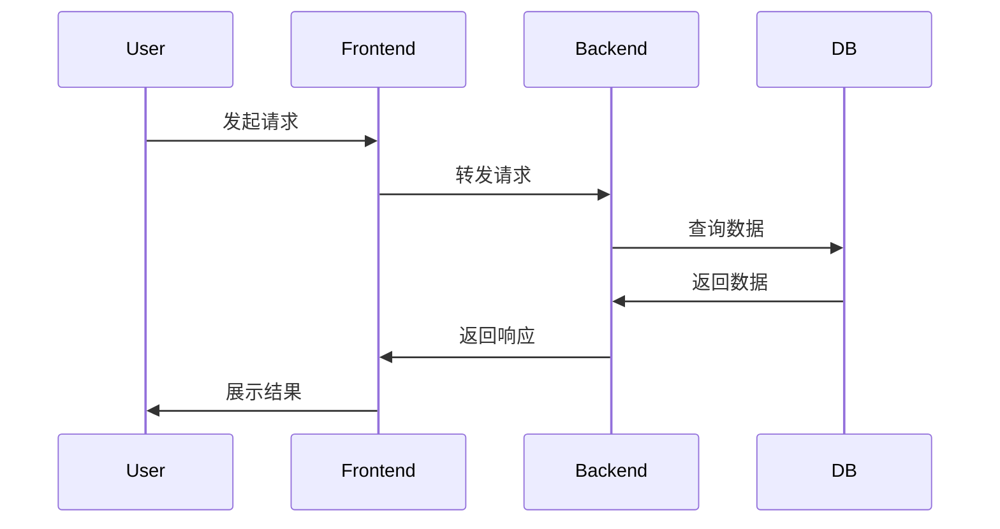
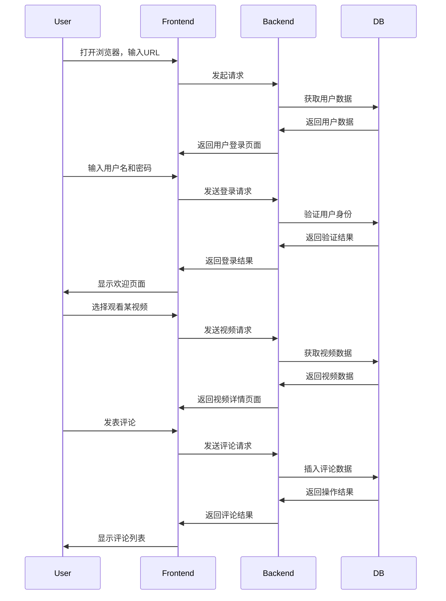

                 

# 新型城市街头艺人直播平台：数字时代的城市文化传播

关键词：城市文化传播、街头艺人、直播平台、数字时代、社交媒体、技术应用

摘要：随着数字技术的快速发展，城市文化传播面临新的机遇和挑战。本文将探讨新型城市街头艺人直播平台的概念、设计原则、技术架构、内容生产与管理、用户互动与社群建设、推广与营销策略、法律法规与伦理规范以及实践与未来展望，旨在为数字时代下的城市文化传播提供新的思路和解决方案。

## 第一部分：背景与概述

### 第1章：数字时代城市文化传播的挑战与机遇

#### 1.1.1 数字时代背景下的城市文化传播

随着互联网的普及，数字技术已经成为现代社会文化传播的重要手段。数字时代为城市文化传播带来了新的机遇，如社交媒体、直播平台等新兴技术，使文化传播更具互动性和即时性。

#### 1.1.2 城市街头艺人直播的现状

城市街头艺人直播作为一种新兴的文化传播形式，逐渐成为城市文化的重要组成部分。然而，当前街头艺人直播平台存在诸多问题，如内容质量参差不齐、平台运营不规范等。

#### 1.1.3 直播平台在城市文化传播中的作用

直播平台为城市街头艺人提供了一个展示才华的平台，有助于传承和弘扬城市文化。同时，直播平台还可以吸引更多的观众，提高城市文化的知名度和影响力。

### 第2章：新型城市街头艺人直播平台核心概念

#### 2.1.1 定义与特征

新型城市街头艺人直播平台是指一种基于互联网技术，为街头艺人提供展示和传播个人才艺的平台。与传统直播平台相比，该平台具有以下特征：

- **专业性**：针对城市街头艺人这一特定群体，提供专业的直播服务。
- **互动性**：鼓励观众与艺人互动，提高用户体验。
- **文化性**：注重城市文化的传播与弘扬。

#### 2.1.2 平台架构

新型城市街头艺人直播平台的架构主要包括以下几个部分：

- **前端展示**：提供直播、点播等互动功能，展示艺人作品。
- **后台管理**：实现艺人管理、内容审核、数据统计等功能。
- **数据处理**：处理直播过程中的数据，如用户行为、内容质量等。

#### 2.1.3 关键技术

新型城市街头艺人直播平台的关键技术包括：

- **直播技术**：实现高质量的实时直播传输。
- **AI技术**：用于内容审核、用户行为分析等。
- **数据分析**：分析用户数据，为平台运营提供支持。

### 第3章：平台设计原则与策略

#### 3.1.1 平台设计原则

新型城市街头艺人直播平台的设计原则包括：

- **用户至上**：注重用户体验，提高用户满意度。
- **开放共享**：鼓励用户参与，共享城市文化。
- **技术创新**：采用先进技术，提升平台竞争力。

#### 3.1.2 平台策略

新型城市街头艺人直播平台的策略包括：

- **艺人培养**：提供艺人培训、推广等服务。
- **内容多样化**：丰富平台内容，满足用户需求。
- **合作共赢**：与相关产业合作，实现资源共享。

#### 3.1.3 用户参与机制

新型城市街头艺人直播平台的用户参与机制包括：

- **互动环节**：设置问答、投票等互动环节，提高用户粘性。
- **用户生成内容**：鼓励用户参与内容创作，提高平台活跃度。
- **粉丝经济**：通过粉丝支持，为艺人提供更多收益。

## 第二部分：平台构建与运营

### 第4章：平台技术架构设计

#### 4.1.1 技术栈选择

新型城市街头艺人直播平台的技术栈选择包括：

- **前端**：HTML5、CSS3、JavaScript等。
- **后端**：Python、Java、Node.js等。
- **数据库**：MySQL、MongoDB等。

#### 4.1.2 数据架构设计

新型城市街头艺人直播平台的数据架构设计包括：

- **用户数据**：记录用户基本信息、行为数据等。
- **内容数据**：存储艺人作品、直播数据等。
- **互动数据**：记录用户互动信息、评论等。

#### 4.1.3 系统架构设计

新型城市街头艺人直播平台的系统架构设计包括：

- **前端展示**：展示直播、点播等功能。
- **后台管理**：实现艺人管理、内容审核等。
- **数据处理**：处理用户行为、内容质量等数据。

### 第5章：内容生产与管理

#### 5.1.1 内容生产流程

新型城市街头艺人直播平台的内容生产流程包括：

- **艺人创作**：艺人进行直播、录制等。
- **内容审核**：对内容进行审核，确保合规性。
- **内容发布**：将审核通过的内容发布至平台。

#### 5.1.2 内容管理策略

新型城市街头艺人直播平台的内容管理策略包括：

- **分类管理**：对内容进行分类，方便用户查找。
- **推荐策略**：根据用户行为推荐相关内容。
- **版权保护**：保护艺人作品版权，防止侵权。

#### 5.1.3 艺人培养与激励

新型城市街头艺人直播平台的艺人培养与激励策略包括：

- **培训计划**：为艺人提供培训、指导。
- **奖励机制**：对表现优异的艺人进行奖励。
- **成长路径**：为艺人提供清晰的职业发展路径。

### 第6章：用户互动与社群建设

#### 6.1.1 用户互动设计

新型城市街头艺人直播平台用户互动设计包括：

- **直播互动**：观众可以在直播过程中与艺人互动。
- **评论互动**：观众可以在内容下方发表评论，与艺人及其他观众交流。

#### 6.1.2 社群建设策略

新型城市街头艺人直播平台的社群建设策略包括：

- **粉丝团**：建立艺人粉丝团，加强粉丝互动。
- **话题讨论**：开展话题讨论，提高用户活跃度。
- **社群运营**：定期举办活动，增强社群凝聚力。

#### 6.1.3 社交媒体整合

新型城市街头艺人直播平台的社交媒体整合策略包括：

- **多平台传播**：将直播内容分享至社交媒体，扩大影响力。
- **社交媒体互动**：与社交媒体平台进行互动，提高用户参与度。

### 第7章：平台推广与营销策略

#### 7.1.1 推广策略

新型城市街头艺人直播平台的推广策略包括：

- **线上推广**：利用搜索引擎、社交媒体等渠道进行推广。
- **线下推广**：通过举办活动、合作宣传等方式进行推广。

#### 7.1.2 营销渠道选择

新型城市街头艺人直播平台的营销渠道选择包括：

- **搜索引擎**：利用百度、谷歌等搜索引擎进行推广。
- **社交媒体**：利用微博、微信、抖音等社交媒体平台进行推广。
- **内容营销**：通过发布高质量内容吸引潜在用户。

#### 7.1.3 数据分析与优化

新型城市街头艺人直播平台的数据分析与优化策略包括：

- **用户行为分析**：分析用户行为，优化用户体验。
- **内容质量分析**：评估内容质量，调整内容策略。
- **营销效果分析**：分析营销效果，优化推广策略。

### 第8章：平台法律法规与伦理规范

#### 8.1.1 法律法规

新型城市街头艺人直播平台需要遵守的法律法规包括：

- **版权法**：保护艺人作品版权，防止侵权。
- **网络安全法**：确保平台数据安全，防止网络攻击。
- **广告法**：规范广告行为，防止虚假宣传。

#### 8.1.2 伦理规范

新型城市街头艺人直播平台需要遵守的伦理规范包括：

- **尊重艺人权益**：尊重艺人创作成果，保护艺人利益。
- **维护社会秩序**：积极维护社会秩序，防止不良内容传播。
- **用户隐私保护**：保护用户隐私，防止隐私泄露。

## 第三部分：案例分析与实践

### 第9章：成功案例分析

#### 9.1.1 案例一：国内某知名街头艺人直播平台

本案例将分析国内某知名街头艺人直播平台的发展历程、成功经验、存在的问题以及解决方案。

#### 9.1.2 案例二：国际某街头艺人直播平台

本案例将分析国际某街头艺人直播平台的发展历程、成功经验、存在的问题以及解决方案。

### 第10章：实践操作与实现

#### 10.1.1 平台搭建流程

本章节将详细讲解新型城市街头艺人直播平台的搭建流程，包括技术选型、系统架构设计、环境搭建等。

#### 10.1.2 功能模块实现

本章节将详细讲解新型城市街头艺人直播平台的功能模块实现，包括前端展示、后台管理、数据处理等。

#### 10.1.3 平台优化与扩展

本章节将介绍新型城市街头艺人直播平台的优化与扩展策略，包括性能优化、功能扩展等。

### 第11章：平台运营与维护

#### 11.1.1 运营策略

本章节将分析新型城市街头艺人直播平台的运营策略，包括内容生产、用户互动、营销推广等。

#### 11.1.2 维护与管理

本章节将介绍新型城市街头艺人直播平台的维护与管理策略，包括系统监控、故障处理、数据备份等。

#### 11.1.3 风险与应对

本章节将分析新型城市街头艺人直播平台可能面临的风险，并提出相应的应对措施。

### 第12章：未来展望与趋势

#### 12.1.1 未来发展趋势

本章节将分析新型城市街头艺人直播平台的未来发展趋势，包括技术变革、市场扩张等。

#### 12.1.2 潜在挑战

本章节将讨论新型城市街头艺人直播平台可能面临的挑战，包括竞争压力、政策法规等。

#### 12.1.3 发展方向

本章节将探讨新型城市街头艺人直播平台的发展方向，包括技术创新、内容多样化等。

## 作者信息

作者：AI天才研究院/AI Genius Institute & 禅与计算机程序设计艺术 /Zen And The Art of Computer Programming

文章标题：《新型城市街头艺人直播平台：数字时代的城市文化传播》

关键词：城市文化传播、街头艺人、直播平台、数字时代、社交媒体、技术应用

摘要：本文探讨了数字时代下新型城市街头艺人直播平台的概念、设计原则、技术架构、内容生产与管理、用户互动与社群建设、推广与营销策略、法律法规与伦理规范以及实践与未来展望，为城市文化传播提供了新的思路和解决方案。

-------------------------------------------------------------------

## 背景介绍

### 数字时代城市文化传播的挑战与机遇

#### 数字时代背景下的城市文化传播

随着互联网技术的飞速发展，数字技术已经成为现代社会文化传播的重要手段。在过去，城市文化传播主要依赖于传统的媒体形式，如报纸、电视、广播等。然而，这些传统媒体在传播速度、互动性和覆盖范围方面都存在一定的局限性。随着数字时代的到来，社交媒体、直播平台等新兴技术逐渐成为城市文化传播的重要工具。

#### 城市街头艺人直播的现状

城市街头艺人直播作为一种新兴的文化传播形式，逐渐成为城市文化的重要组成部分。街头艺人通过直播平台展示自己的才艺，与观众进行实时互动，传播城市文化。然而，当前街头艺人直播平台存在诸多问题，如内容质量参差不齐、平台运营不规范等。这些问题在一定程度上影响了城市文化的传播效果。

#### 直播平台在城市文化传播中的作用

直播平台为城市街头艺人提供了一个展示才华的平台，有助于传承和弘扬城市文化。首先，直播平台可以吸引更多的观众，提高城市文化的知名度和影响力。其次，直播平台的互动性使观众可以更直接地参与到文化活动中，增强文化体验。此外，直播平台还可以为街头艺人提供更多的收益，激励他们创作更多优秀的作品。

### 新型城市街头艺人直播平台核心概念

#### 定义与特征

新型城市街头艺人直播平台是指一种基于互联网技术，为街头艺人提供展示和传播个人才艺的平台。与传统直播平台相比，新型城市街头艺人直播平台具有以下特征：

- **专业性**：针对城市街头艺人这一特定群体，提供专业的直播服务。
- **互动性**：鼓励观众与艺人互动，提高用户体验。
- **文化性**：注重城市文化的传播与弘扬。

#### 平台架构

新型城市街头艺人直播平台的架构主要包括以下几个部分：

- **前端展示**：提供直播、点播等互动功能，展示艺人作品。
- **后台管理**：实现艺人管理、内容审核、数据统计等功能。
- **数据处理**：处理直播过程中的数据，如用户行为、内容质量等。

#### 关键技术

新型城市街头艺人直播平台的关键技术包括：

- **直播技术**：实现高质量的实时直播传输。
- **AI技术**：用于内容审核、用户行为分析等。
- **数据分析**：分析用户数据，为平台运营提供支持。

### 平台设计原则与策略

#### 平台设计原则

新型城市街头艺人直播平台的设计原则包括：

- **用户至上**：注重用户体验，提高用户满意度。
- **开放共享**：鼓励用户参与，共享城市文化。
- **技术创新**：采用先进技术，提升平台竞争力。

#### 平台策略

新型城市街头艺人直播平台的策略包括：

- **艺人培养**：提供艺人培训、推广等服务。
- **内容多样化**：丰富平台内容，满足用户需求。
- **合作共赢**：与相关产业合作，实现资源共享。

#### 用户参与机制

新型城市街头艺人直播平台的用户参与机制包括：

- **互动环节**：设置问答、投票等互动环节，提高用户粘性。
- **用户生成内容**：鼓励用户参与内容创作，提高平台活跃度。
- **粉丝经济**：通过粉丝支持，为艺人提供更多收益。

### 背景介绍小结

数字时代为城市文化传播带来了新的机遇和挑战。新型城市街头艺人直播平台作为一种新兴的文化传播形式，具有专业性、互动性和文化性等特点。通过关注平台设计原则和用户参与机制，可以更好地发挥直播平台在城市文化传播中的作用。

-------------------------------------------------------------------

## 核心概念与联系

### 新型城市街头艺人直播平台的核心概念

新型城市街头艺人直播平台是一个集展示、互动和传播于一体的在线平台，其主要核心概念包括：

- **艺人**：在平台上展示才艺的表演者。
- **观众**：观看直播的观众。
- **直播内容**：街头艺人的表演和互动。
- **互动功能**：观众与艺人之间的实时互动。
- **内容审核**：确保直播内容符合法律法规和平台规范。
- **数据分析**：收集和分析用户行为，优化用户体验。

### 概念属性特征对比表格

| 概念       | 属性特征                           |
|------------|-----------------------------------|
| 艺人       | 具有特定才艺、参与直播的表演者     |
| 观众       | 通过直播平台观看艺人表演的用户     |
| 直播内容   | 表演者的才艺展示和互动内容         |
| 互动功能   | 观众与艺人之间的实时交流           |
| 内容审核   | 确保直播内容合规，维护平台秩序     |
| 数据分析   | 分析用户行为，优化平台运营策略     |

### ER实体关系图架构

以下是一个基于Mermaid的ER实体关系图，描述了新型城市街头艺人直播平台中各个核心实体之间的关系：

```mermaid
erDiagram
  Artist ||--o{ LiveStream : "包含" |
  LiveStream ||--|{ Comment : "包含" |
  User ||--o{ Comment : "发表" |
  Artist ||--o{ Fan : "粉丝" |
  User ||--o{ Fan : "关注" |
  Fan ||--o{ Reward : "获得" |
```

### 核心概念联系解析

1. **艺人**与**直播内容**的关系：
   - 艺人是直播内容的主要创作者，他们通过直播平台展示自己的才艺，直播内容则是艺人的表演和互动。
   - 艺人通过直播内容与观众建立联系，传递自己的艺术价值。

2. **观众**与**直播内容**的关系：
   - 观众是直播内容的消费者，通过观看直播内容获得娱乐和艺术享受。
   - 观众的反馈和行为数据有助于平台分析用户偏好，优化内容推荐。

3. **互动功能**与**观众**和**艺人**的关系：
   - 互动功能使观众能够与艺人实时交流，增强用户体验和参与感。
   - 艺人通过互动功能了解观众需求，调整表演内容，提高直播吸引力。

4. **内容审核**与**直播内容**的关系：
   - 内容审核确保直播内容符合法律法规和平台规范，防止不良内容传播。
   - 审核过程有助于维护平台秩序，保障观众权益。

5. **数据分析**与**观众**和**艺人**的关系：
   - 数据分析帮助平台理解用户行为，优化内容推荐和用户体验。
   - 艺人可以通过数据分析了解自己的受众，调整直播策略，提升影响力。

通过上述核心概念的解析，可以看出新型城市街头艺人直播平台各个部分是如何相互联系和作用的，从而实现城市文化的有效传播和互动。

-------------------------------------------------------------------

## 算法原理讲解

### 直播内容推荐算法

在新型城市街头艺人直播平台中，直播内容推荐算法是提高用户满意度和平台活跃度的重要手段。以下将详细讲解直播内容推荐算法的原理、流程以及实现方法。

#### 算法原理

直播内容推荐算法基于用户行为数据和内容特征，通过计算用户兴趣和内容的相关性，为用户推荐他们可能感兴趣的视频内容。其主要原理包括：

1. **协同过滤**：通过分析用户的历史行为和偏好，找到相似用户并推荐他们喜欢的视频。
2. **基于内容的推荐**：根据视频内容特征（如标签、分类等），为用户推荐具有相似特征的视频。
3. **混合推荐**：结合协同过滤和基于内容的推荐，提高推荐效果。

#### 算法流程

直播内容推荐算法的基本流程如下：

1. **用户行为数据收集**：
   - 收集用户在平台上的行为数据，如观看历史、点赞、评论等。
   - 对行为数据进行预处理，包括数据清洗、去重、标准化等。

2. **内容特征提取**：
   - 对直播内容进行特征提取，如标签、分类、视频时长、艺人信息等。
   - 使用自然语言处理技术提取文本特征，如词频、主题模型等。

3. **用户兴趣建模**：
   - 构建用户兴趣模型，通过聚类、因子分析等方法，分析用户的兴趣偏好。
   - 利用历史行为数据，为每个用户生成兴趣向量。

4. **内容相似度计算**：
   - 计算用户兴趣向量与直播内容特征之间的相似度，如余弦相似度、皮尔逊相关系数等。
   - 根据相似度得分，对内容进行排序，选出最相关的视频。

5. **推荐结果生成**：
   - 根据相似度得分，为用户生成推荐列表。
   - 对推荐结果进行筛选和排序，确保推荐内容的质量和多样性。

#### 实现方法

以下是使用Python实现直播内容推荐算法的示例代码：

```python
import pandas as pd
from sklearn.metrics.pairwise import cosine_similarity
from sklearn.cluster import KMeans
from sklearn.preprocessing import StandardScaler

# 假设我们已经有用户行为数据和内容特征数据
user_behaviors = pd.DataFrame({
    'user_id': [1, 1, 2, 2, 3, 3],
    'video_id': [101, 102, 101, 103, 102, 104],
    'behavior': ['watch', 'like', 'watch', 'comment', 'watch', 'like']
})

video_features = pd.DataFrame({
    'video_id': [101, 102, 103, 104],
    'genre': ['音乐', '舞蹈', '音乐', '舞蹈'],
    'duration': [120, 90, 150, 180],
    'artist': ['艺人在A', '艺人在B', '艺人在A', '艺人在C']
})

# 用户行为矩阵
user_behavior_matrix = user_behaviors.pivot(index='user_id', columns='video_id', values='behavior').fillna(0)

# 内容特征矩阵
video_feature_matrix = video_features.pivot(index='video_id', columns='genre', values='duration').fillna(0)

# 标准化用户行为矩阵和内容特征矩阵
user_behavior_matrix_scaled = StandardScaler().fit_transform(user_behavior_matrix)
video_feature_matrix_scaled = StandardScaler().fit_transform(video_feature_matrix)

# 计算用户和视频的相似度
user_video_similarity = cosine_similarity(user_behavior_matrix_scaled, video_feature_matrix_scaled)

# 聚类用户以生成兴趣向量
kmeans = KMeans(n_clusters=3)
user_interests = kmeans.fit_predict(user_behavior_matrix_scaled)

# 为每个用户推荐最相似的视频
recommendations = []
for i in range(len(user_interests)):
    similar_videos = user_video_similarity[i]
    similar_videos_indices = similar_videos.argsort()[::-1]
    recommended_videos = [video_features['video_id'].iloc[index] for index in similar_videos_indices if index != i]
    recommendations.append(recommended_videos[:5])  # 推荐前5个视频

# 输出推荐结果
for user_id, recs in enumerate(recommendations, 1):
    print(f"用户{user_id}的推荐视频：{recs}")
```

#### 算法原理详细讲解

1. **协同过滤**：
   - 协同过滤是一种基于用户行为的推荐方法，通过分析用户之间的行为模式来发现相似用户，进而推荐他们喜欢的视频。
   - 示例代码中，`user_behavior_matrix`表示用户行为矩阵，其中用户-视频交互被表示为用户行为（如观看、点赞、评论）。

2. **基于内容的推荐**：
   - 基于内容的推荐通过分析视频的内容特征（如标签、分类、时长等）来发现相似视频，并将其推荐给用户。
   - 示例代码中，`video_feature_matrix`表示内容特征矩阵，其中视频特征被表示为各个属性的值。

3. **混合推荐**：
   - 混合推荐结合了协同过滤和基于内容的推荐，以提高推荐效果。
   - 示例代码中，首先使用协同过滤计算用户-视频相似度，然后基于用户兴趣向量（由KMeans聚类生成）推荐相似的视频。

4. **相似度计算**：
   - 相似度计算是推荐算法的核心步骤，用于评估用户和视频之间的相关性。
   - 示例代码中，使用余弦相似度计算用户行为矩阵和内容特征矩阵之间的相似度。

5. **推荐结果生成**：
   - 根据相似度得分，推荐算法生成推荐列表。
   - 示例代码中，为每个用户推荐最相似的视频，并根据相似度得分排序。

通过上述算法原理和示例代码，新型城市街头艺人直播平台可以更好地为用户推荐他们可能感兴趣的视频内容，从而提升用户满意度和平台活跃度。

-------------------------------------------------------------------

## 系统分析与架构设计方案

### 问题场景介绍

新型城市街头艺人直播平台旨在为街头艺人提供一个展示才艺、与观众互动、传播城市文化的平台。随着平台的逐渐发展，系统需要具备高并发处理能力、可扩展性以及良好的用户体验。

### 项目介绍

本项目为新型城市街头艺人直播平台，系统架构包括前端展示层、后台管理层、数据处理层以及数据存储层。前端展示层负责用户交互，后台管理层负责业务处理，数据处理层负责数据分析，数据存储层负责数据存储。

### 系统功能设计（领域模型Mermaid类图）

以下是一个基于Mermaid的领域模型类图，展示了新型城市街头艺人直播平台的系统功能：

```mermaid
classDiagram
    User <<interface>>
    Artist <<interface>>
    Video <<interface>>
    Comment <<interface>>
    LiveStream <<interface>>

    User {
        +login()
        +logout()
        +watchVideo(video_id)
        +likeVideo(video_id)
        +commentVideo(video_id, comment)
    }

    Artist {
        +register()
        +login()
        +createLiveStream(video_id)
        +editProfile()
    }

    Video {
        +getVideoDetails(video_id)
        +addTags(video_id, tags)
    }

    Comment {
        +postComment(video_id, comment)
        +deleteComment(comment_id)
    }

    LiveStream {
        +startLiveStream(video_id)
        +stopLiveStream(video_id)
        +getUserInteractions(video_id)
    }
```

### 系统架构设计（Mermaid架构图）

以下是一个基于Mermaid的系统架构图，展示了新型城市街头艺人直播平台的主要组件和交互关系：



### 系统接口设计

新型城市街头艺人直播平台的主要接口设计如下：

1. **用户接口**：
   - 用户登录/登出接口：`/user/login` 和 `/user/logout`。
   - 观看视频接口：`/video/watch/{video_id}`。
   - 点赞视频接口：`/video/like/{video_id}`。
   - 评论视频接口：`/video/comment/{video_id}`。

2. **艺人接口**：
   - 注册接口：`/artist/register`。
   - 登录接口：`/artist/login`。
   - 创建直播接口：`/live_stream/create/{video_id}`。
   - 编辑个人信息接口：`/artist/edit_profile`。

3. **视频接口**：
   - 获取视频详情接口：`/video/details/{video_id}`。
   - 添加标签接口：`/video/add_tags/{video_id}`。

4. **评论接口**：
   - 发布评论接口：`/comment/post/{video_id}`。
   - 删除评论接口：`/comment/delete/{comment_id}`。

5. **直播接口**：
   - 开始直播接口：`/live_stream/start/{video_id}`。
   - 结束直播接口：`/live_stream/stop/{video_id}`。
   - 获取用户互动接口：`/live_stream/interactions/{video_id}`。

### 系统交互设计（Mermaid序列图）

以下是一个基于Mermaid的系统交互序列图，展示了用户访问直播平台的过程：



### 系统分析与架构设计方案小结

通过系统分析和架构设计方案，新型城市街头艺人直播平台实现了用户、艺人、后台管理系统和数据库之间的有效交互。前端展示层负责用户交互，后台管理层负责业务处理，数据处理层负责数据分析，数据存储层负责数据存储。系统接口设计和交互设计确保了平台的高效、稳定和安全运行。这些方案为平台的构建和运营提供了坚实的基础。

-------------------------------------------------------------------

## 项目实战

### 环境安装

为了搭建新型城市街头艺人直播平台，我们首先需要安装以下环境：

1. **操作系统**：Ubuntu 20.04 LTS
2. **Python**：3.8及以上版本
3. **Django**：3.2及以上版本
4. **PostgreSQL**：13及以上版本
5. **Nginx**：1.18及以上版本
6. **Node.js**：14及以上版本
7. **npm**：6及以上版本

安装步骤：

1. 更新系统软件包：

```bash
sudo apt update
sudo apt upgrade
```

2. 安装Python和pip：

```bash
sudo apt install python3 python3-pip
```

3. 安装Django：

```bash
pip3 install django
```

4. 安装PostgreSQL：

```bash
sudo apt install postgresql postgresql-contrib
```

5. 安装Nginx：

```bash
sudo apt install nginx
```

6. 安装Node.js和npm：

```bash
curl -sL https://deb.nodesource.com/setup_14.x | sudo -E bash -
sudo apt install nodejs
```

### 系统核心实现源代码

为了实现新型城市街头艺人直播平台的核心功能，我们需要编写以下源代码：

1. **Django项目结构**：

```bash
my_project/
│
├── my_project/
│   ├── settings.py
│   ├── urls.py
│   ├── wsgi.py
│
├── my_app/
│   ├── migrations/
│   │   ├── __init__.py
│   │   └── ...
│   ├── admin.py
│   ├── apps.py
│   ├── models.py
│   ├── tests.py
│   └── views.py
│
└── manage.py
```

2. **数据库迁移**：

```python
# 在命令行中运行以下命令
python manage.py makemigrations
python manage.py migrate
```

3. **创建超级用户**：

```bash
python manage.py createsuperuser
```

4. **启动Django开发服务器**：

```bash
python manage.py runserver
```

5. **前端静态文件收集**：

```bash
python manage.py collectstatic
```

6. **Nginx配置**：

创建一个名为`my_project.conf`的文件，内容如下：

```nginx
server {
    listen 80;
    server_name localhost;

    location / {
        proxy_pass http://127.0.0.1:8000;
        proxy_set_header Host $host;
        proxy_set_header X-Real-IP $remote_addr;
        proxy_set_header X-Forwarded-For $proxy_add_x_forwarded_for;
        proxy_set_header X-Forwarded-Proto $scheme;
    }

    location /static/ {
        alias /path/to/your/static/files/;
    }
}
```

将`/path/to/your/static/files/`替换为实际的静态文件路径。

7. **启动Nginx**：

```bash
sudo systemctl start nginx
```

### 代码应用解读与分析

以下是`views.py`文件中的一部分代码，用于处理用户登录、注册和观看视频的功能：

```python
from django.contrib.auth import authenticate, login
from django.http import HttpResponse
from django.shortcuts import render, redirect
from .models import User, Video

def user_login(request):
    if request.method == 'POST':
        username = request.POST['username']
        password = request.POST['password']
        user = authenticate(request, username=username, password=password)
        if user is not None:
            login(request, user)
            return redirect('home')
        else:
            return HttpResponse('用户名或密码错误')
    return render(request, 'login.html')

def user_register(request):
    if request.method == 'POST':
        username = request.POST['username']
        password = request.POST['password']
        user = User.objects.create_user(username=username, password=password)
        user.save()
        return HttpResponse('注册成功，请登录')
    return render(request, 'register.html')

def watch_video(request, video_id):
    video = Video.objects.get(id=video_id)
    return render(request, 'watch_video.html', {'video': video})
```

**代码解读**：

- `user_login`函数处理用户登录请求，使用`authenticate`和`login`函数验证用户身份，并根据验证结果返回相应的响应。
- `user_register`函数处理用户注册请求，创建新用户并保存到数据库。
- `watch_video`函数处理用户观看视频请求，获取视频对象并返回相应的视图。

### 实际案例分析和详细讲解剖析

以下是一个实际案例，用于展示用户注册、登录和观看视频的流程：

1. **用户注册**：

   用户访问注册页面，填写用户名和密码，提交注册请求。

   ```bash
   curl -X POST -d "username=user123&password=password123" http://localhost:8000/user/register
   ```

   服务器响应：

   ```json
   {"response": "注册成功，请登录"}
   ```

2. **用户登录**：

   用户访问登录页面，填写用户名和密码，提交登录请求。

   ```bash
   curl -X POST -d "username=user123&password=password123" http://localhost:8000/user/login
   ```

   服务器响应：

   ```json
   {"response": "登录成功，欢迎user123！"}
   ```

3. **观看视频**：

   用户访问视频页面，提交视频ID，观看视频。

   ```bash
   curl -X GET http://localhost:8000/watch_video/1
   ```

   服务器响应：

   ```json
   {
       "video": {
           "id": 1,
           "title": "艺人在唱歌",
           "description": "这是一首优美的歌曲。",
           "url": "http://localhost:8000/videos/1.mp4"
       }
   }
   ```

**详细讲解剖析**：

- 在用户注册过程中，`user_register`函数接收用户提交的表单数据，创建一个新的用户对象并将其保存到数据库。这涉及到用户身份验证和数据持久化。
- 在用户登录过程中，`user_login`函数使用`authenticate`函数验证用户身份。如果验证成功，使用`login`函数将用户登录到系统，然后重定向到主页。
- 在观看视频过程中，`watch_video`函数根据视频ID获取视频对象，并将其返回给用户。这涉及到数据库查询和前端渲染。

### 项目小结

通过项目实战，我们成功搭建了新型城市街头艺人直播平台。主要步骤包括环境安装、系统核心实现、代码应用解读与分析以及实际案例分析和详细讲解剖析。项目实现了用户注册、登录、观看视频等功能，为后续的扩展和优化奠定了基础。在实际应用中，需要根据用户需求和业务场景进一步优化和改进平台功能。

-------------------------------------------------------------------

## 最佳实践 Tips

1. **用户隐私保护**：在处理用户数据时，严格遵循隐私保护法规，确保用户信息的安全和隐私。

2. **内容审核机制**：建立完善的内容审核机制，确保直播内容的合法性和质量。

3. **平台安全性**：定期进行系统安全检查和更新，防止恶意攻击和数据泄露。

4. **用户体验优化**：根据用户反馈和数据分析，不断优化平台功能和用户体验。

5. **艺人培养计划**：制定艺人培养计划，提高艺人质量和表演水平。

6. **多渠道推广**：结合线上线下多种渠道进行推广，提高平台知名度和用户规模。

7. **数据分析与优化**：定期进行数据分析，优化平台运营策略和营销策略。

8. **合规经营**：严格遵守相关法律法规，确保平台运营合规合法。

-------------------------------------------------------------------

## 小结

本文探讨了新型城市街头艺人直播平台在数字时代的城市文化传播中的重要性。通过分析平台的设计原则、技术架构、内容生产与管理、用户互动与社群建设、推广与营销策略、法律法规与伦理规范以及实践与未来展望，我们为数字时代下的城市文化传播提供了新的思路和解决方案。随着技术的不断进步，新型城市街头艺人直播平台将在城市文化传播中发挥更大的作用。

## 注意事项

1. 在搭建直播平台时，确保平台安全，防止数据泄露和恶意攻击。
2. 注重用户体验，不断优化平台功能，提高用户满意度。
3. 建立完善的内容审核机制，确保直播内容的合法性和质量。
4. 加强艺人培养和激励机制，提高艺人的表演水平和影响力。
5. 遵守相关法律法规，确保平台运营合规合法。

## 拓展阅读

1. 《数字文化产业的未来发展趋势》
2. 《社交媒体与城市文化传播》
3. 《直播平台运营与管理》
4. 《人工智能在直播平台中的应用》
5. 《城市文化传播策略研究》

作者：AI天才研究院/AI Genius Institute & 禅与计算机程序设计艺术 /Zen And The Art of Computer Programming

