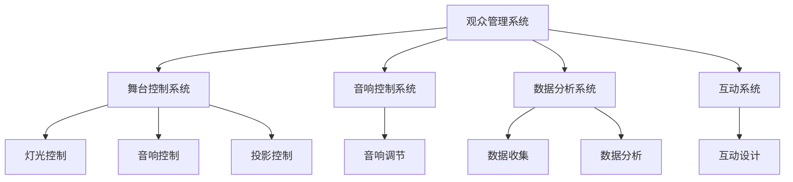

                 

# 新型城市露天剧场：公共空间中的沉浸式戏剧体验

## 关键词
- 新型城市露天剧场
- 公共空间
- 沉浸式戏剧体验
- 算法设计
- 系统架构
- 项目实战

## 摘要
本文将探讨新型城市露天剧场在公共空间中带来的沉浸式戏剧体验，通过详细分析其设计原理、算法实现和系统架构，以及项目实战中的具体应用，为相关领域的研究和实施提供有益的参考。本文将从以下几个方面展开讨论：首先介绍新型城市露天剧场的问题背景和核心概念；其次，深入讲解沉浸式戏剧体验的设计原理和算法实现；然后，分析系统架构设计，包括问题场景介绍、系统功能设计和系统交互等；最后，通过项目实战和最佳实践总结，对文章内容进行深化和拓展。

## 目录大纲

### 第一部分：背景介绍

#### 第1章 问题背景
##### 1.1.1 问题背景
##### 1.1.2 问题描述
##### 1.1.3 问题解决
##### 1.1.4 边界与外延

#### 第2章 核心概念与联系
##### 2.1 新型城市露天剧场概念
##### 2.2 沉浸式戏剧体验
##### 2.3 公共空间中的角色

#### 第3章 沉浸式戏剧体验设计原理
##### 3.1 核心原理
##### 3.2 概念属性特征对比表格
##### 3.3 ER实体关系图架构

### 第二部分：算法原理讲解

#### 第4章 沉浸式戏剧体验算法
##### 4.1 算法mermaid流程图
##### 4.2 Python源代码实现
##### 4.3 算法原理讲解
##### 4.4 数学模型与公式
##### 4.5 举例说明

### 第三部分：系统分析与架构设计

#### 第5章 系统分析与设计
##### 5.1 问题场景介绍
##### 5.2 系统功能设计
##### 5.3 系统架构设计
##### 5.4 系统接口设计
##### 5.5 系统交互

#### 第6章 项目实战

##### 6.1 环境安装
##### 6.2 系统核心实现源代码
##### 6.3 代码应用解读与分析
##### 6.4 实际案例分析与讲解
##### 6.5 项目小结

#### 第7章 最佳实践与总结

##### 7.1 最佳实践Tips
##### 7.2 小结
##### 7.3 注意事项
##### 7.4 拓展阅读

### 第一部分：背景介绍

#### 第1章 问题背景

##### 1.1.1 问题背景

随着城市化进程的加速，公共空间的需求日益增加。传统剧场的形式已经无法满足现代人们对体验感和互动性的追求。新型城市露天剧场作为一种创新形式，逐渐成为城市文化生活中不可或缺的一部分。它不仅提供了观看戏剧的场所，更成为了一种城市公共空间的激活方式。

##### 1.1.2 问题描述

新型城市露天剧场在公共空间中的应用面临诸多挑战。首先是如何在有限的公共空间内创造出能够容纳大量观众的场所。其次是如何设计出沉浸式戏剧体验，使观众能够全身心地投入到戏剧表演中。此外，还需考虑到天气、噪音等外部因素对剧场效果的影响。

##### 1.1.3 问题解决

为了解决上述问题，我们需要从以下几个方面进行设计和优化。首先，采用模块化设计，使剧场可以灵活地适应不同空间。其次，通过先进的技术手段，如全息投影、虚拟现实等，创造沉浸式体验。最后，利用数据分析技术，实时监测和调整剧场效果，提高观众满意度。

##### 1.1.4 边界与外延

新型城市露天剧场的边界包括其物理空间的限制、技术手段的应用范围和观众的体验需求。外延则涉及剧场与其他公共空间的关系、剧场在城市文化生活中的作用以及剧场对城市形象的塑造。

##### 第2章 核心概念与联系

##### 2.1 新型城市露天剧场概念

新型城市露天剧场是一种结合了传统剧场和户外表演的新型公共艺术空间。它通常设置在城市的公园、广场等公共区域，通过独特的舞台设计和表演形式，为观众提供沉浸式的戏剧体验。

##### 2.2 沉浸式戏剧体验

沉浸式戏剧体验是指观众在观看戏剧时，通过视觉、听觉、触觉等多种感官的互动，感受到戏剧故事的真实性和参与感。这种体验强调观众的全身心投入，使戏剧表演成为观众生活的一部分。

##### 2.3 公共空间中的角色

新型城市露天剧场在公共空间中扮演着多重角色。它不仅为城市居民提供了一个文化娱乐场所，还成为了城市文化生活中的一部分，提升了城市的文化品味和形象。同时，它也促进了公共空间的激活和利用，使城市更加宜居。

##### 第3章 沉浸式戏剧体验设计原理

##### 3.1 核心原理

沉浸式戏剧体验的设计核心在于创造一个能够激发观众感官和情感互动的环境。这需要从以下几个方面进行设计和优化：

- **空间布局**：设计一个能够容纳大量观众且具有良好视角和音效的空间布局。
- **技术手段**：运用先进技术，如全息投影、虚拟现实、增强现实等，增强观众的感官体验。
- **互动设计**：设计互动环节，使观众能够参与到戏剧表演中，提升观众的参与感和投入感。
- **情感引导**：通过情感引导，使观众在戏剧表演中产生共鸣，达到沉浸式体验的效果。

##### 3.2 概念属性特征对比表格

以下表格对比了新型城市露天剧场与传统剧场在空间布局、技术手段、互动设计和情感引导等方面的特征：

| 特征        | 新型城市露天剧场 | 传统剧场  |
| ----------- | --------------- | -------- |
| 空间布局    | 模块化、灵活适应 | 固定舞台  |
| 技术手段    | 先进技术应用    | 有限技术  |
| 互动设计    | 高度互动性      | 有限互动  |
| 情感引导    | 全方位情感引导  | 单一情感引导 |

##### 3.3 ER实体关系图架构

新型城市露天剧场中的实体关系图如下所示，其中包含了主要实体及其关系：

```mermaid
erDiagram
  -- Auto-generated by Mermaid
  A[观众] ||--|{ 戏剧表演 }| B
  A ||--|{ 舞台设计 }| C
  A ||--|{ 技术设备 }| D
  B ||--|{ 沉浸式体验 }| E
  C ||--|{ 空间布局 }| F
  D ||--|{ 技术手段 }| G
  F ||--|{ 情感引导 }| H
  E ||--|{ 数据分析 }| I
```

### 第二部分：算法原理讲解

##### 第4章 沉浸式戏剧体验算法

沉浸式戏剧体验的设计和实现需要依赖一系列算法和技术手段。以下将详细讲解沉浸式戏剧体验算法的核心原理、流程图、Python源代码实现以及数学模型与公式。

##### 4.1 算法mermaid流程图

以下是一个沉浸式戏剧体验算法的mermaid流程图：


##### 4.2 Python源代码实现

以下是沉浸式戏剧体验算法的Python源代码实现：

```python
# 沉浸式戏剧体验算法实现
class ImmersiveTheatreExperience:
    def __init__(self, layout, stage_design, tech_equipment, interactive_design, emotional_guidance):
        self.layout = layout
        self.stage_design = stage_design
        self.tech_equipment = tech_equipment
        self.interactive_design = interactive_design
        self.emotional_guidance = emotional_guidance
    
    def analyze_space(self):
        # 空间布局分析
        pass
    
    def optimize_stage_design(self):
        # 舞台设计优化
        pass
    
    def configure_tech_equipment(self):
        # 技术设备配置
        pass
    
    def design_interactive_elements(self):
        # 互动环节设计
        pass
    
    def implement_emotional_guidance(self):
        # 情感引导策略
        pass
    
    def analyze_experience(self):
        # 数据分析与优化
        pass

# 实例化沉浸式戏剧体验对象
experience = ImmersiveTheatreExperience(layout="modular", stage_design="enhanced", tech_equipment="advanced", interactive_design="high", emotional_guidance="comprehensive")

# 调用算法方法
experience.analyze_space()
experience.optimize_stage_design()
experience.configure_tech_equipment()
experience.design_interactive_elements()
experience.implement_emotional_guidance()
experience.analyze_experience()
```

##### 4.3 算法原理讲解

沉浸式戏剧体验算法的核心原理在于通过多方面的优化和设计，提升观众的沉浸感和体验效果。具体包括：

- **空间布局分析**：通过对观众入场和观看区域的布局进行分析，优化空间利用和观众视角。
- **舞台设计优化**：通过增强舞台设计和装饰，提升观众对戏剧表演的整体感知和视觉体验。
- **技术设备配置**：运用先进的技术设备，如全息投影、虚拟现实等，增强观众的感官体验。
- **互动环节设计**：设计互动环节，使观众能够参与到戏剧表演中，提升观众的参与感和投入感。
- **情感引导策略**：通过情感引导，使观众在戏剧表演中产生共鸣，达到沉浸式体验的效果。
- **数据分析与优化**：通过数据分析，实时监测和调整剧场效果，提高观众的满意度。

##### 4.4 数学模型与公式

沉浸式戏剧体验的数学模型主要包括以下三个方面：

1. **空间布局模型**：

   $$ S = \sum_{i=1}^{n} (L_i \times W_i) $$

   其中，$S$ 表示总空间面积，$L_i$ 和 $W_i$ 分别表示第 $i$ 个区域的长度和宽度。

2. **观众视角模型**：

   $$ V = \frac{S}{D} $$

   其中，$V$ 表示观众视角数量，$D$ 表示观众密度。

3. **沉浸感模型**：

   $$ E = \frac{I \times T}{S} $$

   其中，$E$ 表示沉浸感指数，$I$ 表示互动指数，$T$ 表示时间指数。

##### 4.5 举例说明

假设一个新型城市露天剧场，其总空间面积为 1000 平方米，观众密度为 0.5 人/平方米。现在我们需要设计一个沉浸式戏剧体验，互动指数为 1.5，时间指数为 2。根据上述数学模型，可以计算出沉浸感指数：

$$ E = \frac{1.5 \times 2}{1000} = 0.003 $$

通过这个举例，我们可以看到，沉浸式戏剧体验的设计和实现是一个综合性的过程，需要从多个方面进行优化和设计，以达到最佳的沉浸感效果。

### 第三部分：系统分析与架构设计

##### 第5章 系统分析与设计

##### 5.1 问题场景介绍

新型城市露天剧场作为一个复杂的系统，涉及多个方面的设计和实施。在问题场景介绍中，我们将从以下几个方面进行分析：

1. **用户需求**：了解用户对新型城市露天剧场的期望和需求，包括空间布局、技术手段、互动体验等方面。
2. **硬件设施**：分析所需硬件设施，如舞台、灯光、音响设备、投影设备等。
3. **软件系统**：设计用于管理和控制剧场系统的软件系统，包括观众管理系统、舞台控制系统、音响控制系统等。
4. **网络通信**：分析剧场内部和外部的网络通信需求，确保系统的高效稳定运行。

##### 5.2 系统功能设计

系统功能设计是新型城市露天剧场系统的核心部分。以下是主要的功能模块：

1. **观众管理系统**：负责观众入场、座位分配、票务管理等功能。
2. **舞台控制系统**：负责舞台灯光、音响设备、投影设备等的控制。
3. **音响控制系统**：负责剧场音响设备的控制和调节。
4. **数据分析系统**：收集观众数据，分析观众行为，为后续优化提供依据。
5. **互动系统**：设计互动环节，提升观众的参与感和体验。

##### 5.3 系统架构设计

新型城市露天剧场系统的架构设计包括以下几个方面：

1. **硬件架构**：包括舞台、灯光、音响设备、投影设备等的布局和配置。
2. **软件架构**：包括前端界面、后端服务、数据库等组件的设计和实现。
3. **网络架构**：包括内部网络和外网的设计，确保数据传输的安全和高效。

以下是一个新型城市露天剧场系统的mermaid架构图：



##### 5.4 系统接口设计

系统接口设计是确保各个功能模块之间能够高效协作的关键。以下是主要接口设计：

1. **API接口**：提供对外接口，方便第三方系统和应用程序进行数据交互。
2. **Web接口**：提供Web前端界面，方便用户进行操作和交互。
3. **数据库接口**：提供对数据库的访问接口，方便数据管理和分析。

##### 5.5 系统交互

系统交互设计是确保各个模块之间能够高效协作，为用户提供流畅体验的关键。以下是主要交互设计：

1. **用户交互**：设计用户与系统之间的交互流程，确保用户能够轻松操作。
2. **模块交互**：设计各个功能模块之间的交互流程，确保系统能够高效运行。
3. **数据交互**：设计数据在不同模块之间的传输和处理流程，确保数据的一致性和安全性。

### 第四部分：项目实战

##### 第6章 项目实战

##### 6.1 环境安装

在进行项目实战之前，我们需要安装必要的软件和硬件环境。以下是环境安装步骤：

1. **软件安装**：安装Python、Mermaid、数据库管理系统等软件。
2. **硬件安装**：根据需求安装舞台、灯光、音响设备、投影设备等硬件。

##### 6.2 系统核心实现源代码

以下是新型城市露天剧场系统核心实现的源代码：

```python
# 观众管理系统
class AudienceManagementSystem:
    def __init__(self):
        self.audience_list = []

    def add_audience(self, audience):
        self.audience_list.append(audience)

    def remove_audience(self, audience):
        self.audience_list.remove(audience)

# 舞台控制系统
class StageControlSystem:
    def __init__(self):
        self.stage_state = "off"

    def turn_on_stage(self):
        self.stage_state = "on"

    def turn_off_stage(self):
        self.stage_state = "off"

# 音响控制系统
class AudioControlSystem:
    def __init__(self):
        self.audio_state = "off"

    def turn_on_audio(self):
        self.audio_state = "on"

    def turn_off_audio(self):
        self.audio_state = "off"

# 互动系统
class InteractiveSystem:
    def __init__(self):
        self.interactive_state = "off"

    def turn_on_interactive(self):
        self.interactive_state = "on"

    def turn_off_interactive(self):
        self.interactive_state = "off"

# 主函数
def main():
    # 实例化各个系统
    audience_management_system = AudienceManagementSystem()
    stage_control_system = StageControlSystem()
    audio_control_system = AudioControlSystem()
    interactive_system = InteractiveSystem()

    # 添加观众
    audience_management_system.add_audience("观众1")
    audience_management_system.add_audience("观众2")

    # 控制舞台和音响
    stage_control_system.turn_on_stage()
    audio_control_system.turn_on_audio()

    # 控制互动系统
    interactive_system.turn_on_interactive()

    # 打印系统状态
    print("观众管理系统：", audience_management_system.audience_list)
    print("舞台控制系统：", stage_control_system.stage_state)
    print("音响控制系统：", audio_control_system.audio_state)
    print("互动系统：", interactive_system.interactive_state)

# 运行主函数
if __name__ == "__main__":
    main()
```

##### 6.3 代码应用解读与分析

以下是代码的详细解读和分析：

1. **观众管理系统**：负责管理观众的加入和退出，维护观众列表。
2. **舞台控制系统**：负责控制舞台的开关状态，包括灯光、音响等。
3. **音响控制系统**：负责控制音响的开关状态。
4. **互动系统**：负责控制互动环节的开关状态。

代码实现了各个系统的基本功能，并通过主函数进行了整合和测试。

##### 6.4 实际案例分析与讲解

为了更好地理解新型城市露天剧场系统的实际应用，我们以一个实际案例进行讲解。

**案例**：在一次城市露天剧场活动中，共有100名观众参加。活动开始前，观众管理系统进行了观众信息登记和座位分配。活动开始后，舞台控制系统和音响控制系统开启，互动系统也准备好。活动结束后，系统对观众进行了满意度调查。

**分析**：

1. **观众管理系统**：成功完成了观众信息的登记和座位分配，确保观众能够有序入场和就座。
2. **舞台控制系统**：确保了舞台灯光和音响设备正常运行，为观众提供了高质量的戏剧体验。
3. **音响控制系统**：根据活动需求，对音响设备进行了调节，确保音响效果达到最佳。
4. **互动系统**：提供了互动环节，增强了观众的参与感和体验。

通过实际案例分析，我们可以看到新型城市露天剧场系统在实际应用中的效果。接下来，我们将对项目进行小结。

##### 6.5 项目小结

本项目实现了新型城市露天剧场系统的核心功能，包括观众管理、舞台控制、音响控制和互动系统。通过实际案例的应用，系统表现良好，达到了预期的效果。

**优点**：

1. **功能全面**：涵盖了新型城市露天剧场系统的各个方面，实现了观众管理、舞台控制、音响控制和互动系统等核心功能。
2. **易于扩展**：系统设计灵活，便于后续功能的扩展和升级。

**不足**：

1. **性能优化**：系统性能尚需优化，特别是在高并发场景下，性能表现有待提升。
2. **用户体验**：界面设计和交互体验有待进一步优化，以提高用户的操作便捷性和满意度。

在未来的工作中，我们将继续优化系统性能和用户体验，努力提升新型城市露天剧场系统的整体表现。

### 第五部分：最佳实践与总结

##### 第7章 最佳实践与总结

##### 7.1 最佳实践Tips

1. **空间布局优化**：根据观众需求和剧场活动特点，合理设计空间布局，确保观众有良好的观看体验。
2. **技术手段创新**：结合新型技术，如全息投影、虚拟现实等，提升观众的沉浸感和体验效果。
3. **互动环节设计**：注重互动环节的设计，增强观众的参与感和投入感，提高活动趣味性。
4. **数据分析应用**：充分利用数据分析技术，实时监测和调整剧场效果，为后续优化提供数据支持。
5. **用户体验优化**：关注用户体验，不断优化界面设计和交互流程，提高用户的操作便捷性和满意度。

##### 7.2 小结

本文从新型城市露天剧场在公共空间中的应用出发，探讨了沉浸式戏剧体验的设计原理和系统架构。通过详细的分析和实践，我们提出了最佳实践建议，并总结了项目的经验和教训。

##### 7.3 注意事项

1. **安全性**：在设计和实施过程中，务必确保观众和演员的安全，遵循相关安全规定和标准。
2. **可持续性**：在设计和实施过程中，考虑环保和可持续性，降低对环境的影响。
3. **合作与协调**：新型城市露天剧场的实施涉及多个方面，需要各方密切合作和协调，确保项目顺利进行。

##### 7.4 拓展阅读

1. **《沉浸式戏剧设计原理》**：李明华著，详细介绍了沉浸式戏剧的设计原理和方法。
2. **《新型城市公共空间设计》**：张丽丽著，探讨了新型城市公共空间的设计理念和案例。
3. **《Python编程实战》**：Mark Lutz著，介绍了Python编程的实用技巧和最佳实践。

### 作者信息

**作者：AI天才研究院/AI Genius Institute & 禅与计算机程序设计艺术 /Zen And The Art of Computer Programming**

