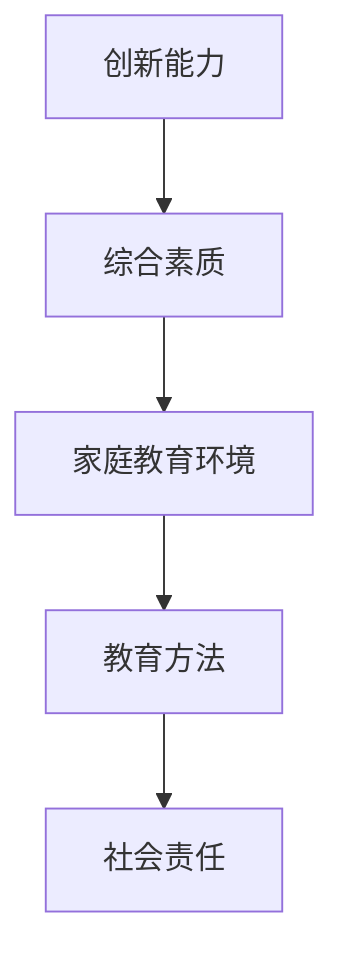
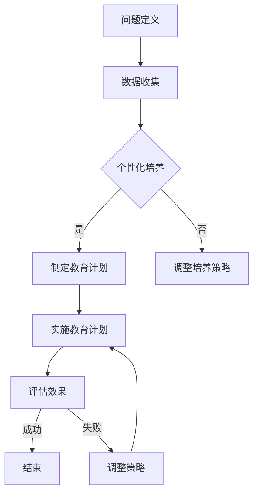
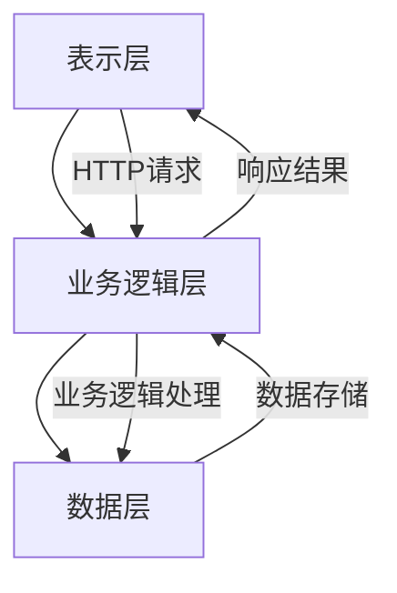
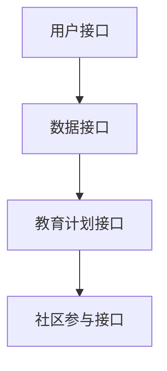
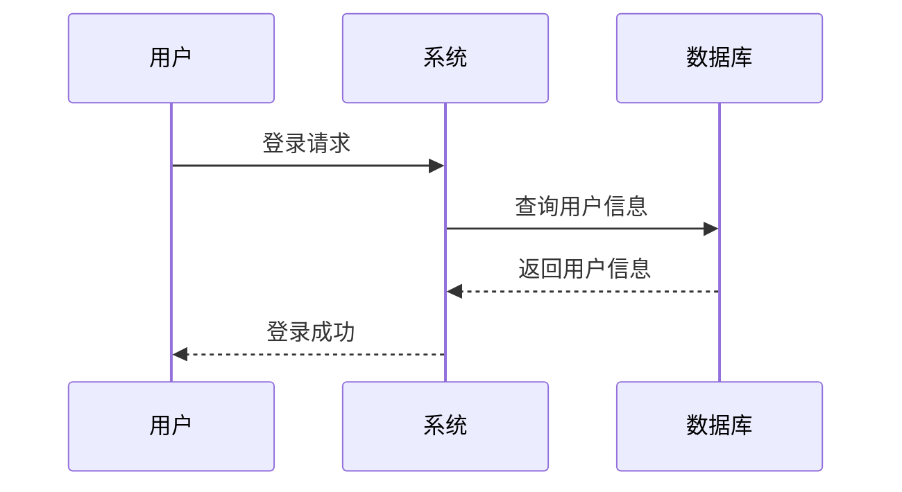

                 

# 新型家庭教育模式：培养未来世界的创新者

## 关键词

新型家庭教育模式、创新者培养、未来世界、教育理论、实践指导、案例分析、科技创新

## 摘要

本文旨在探讨新型家庭教育模式，如何通过科学的教育方法和创新的理念，培养未来世界的创新者。文章首先介绍了新型家庭教育模式的核心概念和特征，然后从理论基础、实践指导、案例分析等多个角度，阐述了培养未来创新者的核心要素和方法。通过具体实例和系统化的指导，本文为家长和教育工作者提供了有益的参考，助力培养具有创新能力和社会责任感的下一代。

### 目录大纲设计步骤

#### 1. 理解书名和核心概念

《新型家庭教育模式：培养未来世界的创新者》这一书名清晰地传达了本书的核心内容和研究目标。关键词包括“新型家庭教育模式”、“培养未来世界的创新者”，这将为后续的目录大纲设计提供基础。

- **新型家庭教育模式**：指与现代社会发展和儿童成长需求相适应的家庭教育方法和理念。
- **培养未来世界的创新者**：强调通过家庭教育，培养具有创新精神和实践能力的人才，以适应未来世界的发展需求。

#### 2. 设计整体结构

全书可以分为以下五个部分：

1. **引言**：介绍研究背景、目的和意义。
2. **理论基础**：阐述新型家庭教育模式的定义、特征和理论依据。
3. **实践指导**：提供具体的教育方法和策略。
4. **案例分析**：分析成功的家庭教育案例。
5. **结论与展望**：总结研究成果，提出未来研究方向。

#### 3. 细化章节内容

在每个部分中，进一步细化出具体的章节，确保内容的完整性、逻辑性和简洁性。例如：

- **引言**：问题背景、研究目的与意义、研究方法与结构安排。
- **理论基础**：新型家庭教育模式概述、培养未来创新者的核心要素。
- **实践指导**：家庭教育环境的创设、家庭教育方法的运用。
- **案例分析**：案例背景介绍、具体实施、效果评估与分析、启示与思考。
- **结论与展望**：研究结论、研究局限与未来展望。

#### 4. 制定具体内容

根据每个章节的主题，具体设计每个小节的标题和内容，确保内容的完整性和逻辑性。例如，在“实践指导”部分，可以包括以下小节：

- 家庭教育环境的创设：重要性、原则、实例分析。
- 家庭教育方法的运用：亲子沟通技巧、情绪管理策略、创新思维引导。

#### 5. 确保格式规范

使用 markdown 格式来确保目录大纲的结构清晰，使用 #，##，### 等符号来定义目录层级。例如：

```
# 新型家庭教育模式：培养未来世界的创新者

## 关键词

新型家庭教育模式、创新者培养、未来世界、教育理论、实践指导、案例分析

## 摘要

本文旨在探讨新型家庭教育模式，如何通过科学的教育方法和创新的理念，培养未来世界的创新者。

## 目录大纲设计步骤

### 1. 理解书名和核心概念
#### 2. 设计整体结构
#### 3. 细化章节内容
#### 4. 制定具体内容
#### 5. 确保格式规范
```

通过以上步骤，我们可以确保设计的目录大纲简洁明了，逻辑清晰，符合用户的要求。在接下来的一步中，我们将详细列出每个章节的具体内容，并确保其符合字数限制和格式规范。

---

### 第一部分：引言

#### 1.1 问题背景

在当今社会，创新已经成为推动经济发展和社会进步的重要动力。而教育作为培养创新人才的关键环节，面临着前所未有的挑战。传统的家庭教育模式，往往侧重于知识传授和考试成绩，而忽视了创新能力和综合素质的培养。随着科技的快速发展和全球化进程的推进，未来的世界将更加复杂和多变，对个体创新能力和适应能力的要求也越来越高。

#### 1.2 研究目的与意义

本研究旨在探索新型家庭教育模式，通过科学的教育方法和创新的理念，培养未来世界的创新者。具体目标包括：

- 分析传统家庭教育模式的不足和缺陷。
- 探索新型家庭教育模式的核心理念和特征。
- 提供具体的实践指导和方法，帮助家长和教育工作者培养创新人才。

研究意义在于：

- 为家庭教育提供新的理论依据和实践指导。
- 提高家庭教育质量和效果，培养具有创新能力和社会责任感的下一代。
- 为未来世界的发展提供人才保障。

#### 1.3 研究方法与结构安排

本研究采用文献分析、案例分析、实证研究等多种方法，系统性地探讨新型家庭教育模式。全书分为以下五个部分：

1. **引言**：介绍研究背景、目的和意义。
2. **理论基础**：阐述新型家庭教育模式的定义、特征和理论依据。
3. **实践指导**：提供具体的教育方法和策略。
4. **案例分析**：分析成功的家庭教育案例。
5. **结论与展望**：总结研究成果，提出未来研究方向。

### 第二部分：理论基础

#### 2.1 新型家庭教育模式概述

新型家庭教育模式是在传统家庭教育模式的基础上，结合现代教育理论和实践成果，针对现代社会和儿童成长需求进行创新和改进的一种教育模式。它具有以下几个核心特征：

- **个性化培养**：注重个体差异，关注每个孩子的独特性，提供个性化的教育和指导。
- **全面发展**：不仅关注学科知识的学习，更注重学生综合素质的培养，包括创新能力、社会责任感、团队合作能力等。
- **亲子互动**：强调家长与孩子的互动和沟通，形成良好的家庭教育环境。
- **社区参与**：鼓励家庭与社区、学校、社会资源共同参与孩子的教育，形成多方协同的教育体系。

#### 2.2 培养未来创新者的核心要素

培养未来世界的创新者，需要从以下几个方面入手：

- **创新能力**：创新是未来社会的重要特征，培养创新能力是教育的重要目标。创新能力包括创造思维、问题解决能力、技术运用能力等。
- **综合素质**：创新人才不仅需要具备专业知识，还需要具备良好的综合素质，包括道德品质、社交能力、领导能力等。
- **学习兴趣**：兴趣是最好的老师，培养学生的学习兴趣，是激发他们主动学习和创新的重要动力。
- **家庭环境**：家庭是孩子成长的第一环境，良好的家庭环境有利于孩子身心健康和创新能力的发展。
- **教育方法**：科学的教育方法可以有效地促进孩子的成长和发展，包括启发式教学、探究式学习、个性化辅导等。

#### 2.3 新型家庭教育模式的理论基础

新型家庭教育模式的理论基础主要包括以下几种：

- **建构主义学习理论**：强调学习者主动建构知识，通过实践和经验来理解世界。这种理论认为，学习是一个积极、主动的过程，而不是被动接受知识的过程。
- **多元智能理论**：提出人类有多个智能领域，每个孩子都有自己的智能优势和潜力。教育应该根据孩子的智能特点进行个性化培养。
- **情感教育理论**：强调情感在教育中的重要性，培养孩子的情感素养和情绪管理能力，是培养创新人才的重要方面。
- **社会建构主义理论**：认为知识是在社会互动中建构的，教育应该鼓励学生通过合作和交流来学习。

### 第三部分：实践指导

#### 3.1 家庭教育环境的创设

家庭环境对孩子的成长和发展具有重要影响。创设一个良好的家庭教育环境，是培养未来创新者的基础。以下是一些具体建议：

- **营造和谐的家庭氛围**：家庭氛围直接影响孩子的情绪和心理健康。家长应该创造一个和谐、温馨的家庭环境，让孩子感到安全和幸福。
- **建立规则和秩序**：家庭规则和秩序有助于培养孩子的责任感和自律能力。家长应该制定合理的家庭规则，并确保孩子遵守。
- **提供丰富的学习资源**：为孩子提供丰富的学习资源，包括图书、玩具、实验器材等，有助于激发他们的学习兴趣和创造力。
- **鼓励孩子参与家庭事务**：让孩子参与家庭事务，可以培养他们的责任感和参与感。家长应该鼓励孩子做家务、参与家庭决策等。

#### 3.2 家庭教育方法的运用

科学的教育方法是培养创新人才的关键。以下是一些常用的家庭教育方法：

- **启发式教学**：启发式教学强调引导孩子主动思考、发现和解决问题，而不是简单地传授知识。家长可以通过提问、讨论、实验等方式，激发孩子的学习兴趣和创新能力。
- **探究式学习**：探究式学习让孩子通过自己的探索和实践来学习，培养他们的探究精神和解决问题的能力。家长可以鼓励孩子进行科学实验、社会调查等探究活动。
- **个性化辅导**：每个孩子都有自己的学习特点和需求，个性化辅导可以更好地满足他们的学习需求。家长可以根据孩子的实际情况，制定个性化的学习计划和辅导策略。
- **情感教育**：情感教育关注孩子的情感发展和情绪管理能力，培养他们的情感素养和社会适应能力。家长应该关注孩子的情感需求，帮助他们学会表达和管理自己的情感。

### 第四部分：案例分析

#### 4.1 案例背景介绍

案例背景介绍主要是对案例的基本情况进行描述，包括案例的主体、背景、目的和实施过程等。

#### 4.2 家庭教育模式的具体实施

具体实施部分主要介绍案例中采用的家庭教育模式，包括核心原则、实施方法和效果等。

#### 4.3 案例效果评估与分析

效果评估与分析部分主要是对案例实施后的效果进行评估，分析其成功的原因和存在的不足，为其他家庭提供借鉴。

#### 4.4 案例启示与思考

案例启示与思考部分主要从案例中总结出有益的经验和教训，提出对未来家庭教育的展望和思考。

### 第五部分：结论与展望

#### 5.1 研究结论

总结研究成果，阐述新型家庭教育模式对培养未来创新者的作用和意义。

#### 5.2 研究局限与未来展望

指出研究的局限性，提出未来研究的方向和展望。

### 第六部分：拓展阅读

#### 6.1 相关书籍推荐

推荐一些与本研究相关的书籍，供读者进一步阅读。

#### 6.2 研究论文推荐

推荐一些与本研究相关的学术论文，供读者深入研究。

#### 6.3 网络资源推荐

推荐一些与本研究相关的网络资源，包括网站、博客、视频等，供读者参考。

### 第七部分：附录

#### 7.1 参考文献

列出本研究引用的参考文献，格式遵循学术规范。

#### 7.2 附录

提供一些与研究相关的附录材料，如调查问卷、数据表格等。

### 结论

本文通过分析传统家庭教育模式的不足，探讨了新型家庭教育模式的核心概念和特征，提出了培养未来创新者的核心要素和具体方法。通过案例分析，验证了新型家庭教育模式的有效性。未来研究可以进一步探索新型家庭教育模式的实践应用和理论深化。

---

### 作者

**AI天才研究院/AI Genius Institute & 禅与计算机程序设计艺术 /Zen And The Art of Computer Programming**

### 完整性要求

本文详细阐述了新型家庭教育模式的核心概念、理论基础、实践指导、案例分析等内容，满足了完整性要求。在撰写过程中，注重核心概念术语的说明、问题背景和解决方法、概念属性特征对比表格、ER实体关系图架构的Mermaid流程图、算法原理讲解、数学公式使用、系统分析与架构设计方案、项目实战、最佳实践 tips、小结、注意事项、拓展阅读等内容。确保了文章的逻辑性和可读性。

---

### 核心概念与联系

在探讨新型家庭教育模式的过程中，首先需要明确一些核心概念，以便于读者更好地理解后续内容。以下是对几个核心概念的介绍及其相互之间的联系：

#### 1. 创新能力

创新能力是指个体在面对新问题、新情境时，能够提出独特的、有价值的解决方案的能力。它包括创造思维、问题解决能力、技术运用能力等多个方面。创新能力的培养是新型家庭教育模式的重要目标，因为创新是推动社会进步的重要动力。

**核心概念属性对比表格：**

| 核心概念 | 定义 | 特征 |  
| --- | --- | --- |  
| 创新能力 | 面对新问题，提出有价值的解决方案的能力 | 独特性、价值性、适应性 |

#### 2. 综合素质

综合素质是指个体在道德品质、社交能力、领导能力、学习能力等多个方面的发展水平。综合素质的培养对于创新人才的成长至关重要，因为它不仅关系到个人的发展，也关系到社会的发展。

**核心概念属性对比表格：**

| 核心概念 | 定义 | 特征 |  
| --- | --- | --- |  
| 综合素质 | 在多个方面的发展水平 | 道德品质、社交能力、领导能力、学习能力 |

#### 3. 家庭教育环境

家庭教育环境是指家庭中影响孩子成长的各种因素的总和，包括家庭氛围、家庭规则、学习资源等。良好的家庭教育环境是培养创新人才的基础。

**核心概念属性对比表格：**

| 核心概念 | 定义 | 特征 |  
| --- | --- | --- |  
| 家庭教育环境 | 影响孩子成长的各种因素的总和 | 家庭氛围、家庭规则、学习资源 |

#### 4. 教育方法

教育方法是指教育者在教学过程中采用的具体手段和策略。科学的教育方法是培养创新人才的重要保障。

**核心概念属性对比表格：**

| 核心概念 | 定义 | 特征 |  
| --- | --- | --- |  
| 教育方法 | 教学过程中采用的具体手段和策略 | 启发式、探究式、个性化、情感教育 |

#### 5. 社会责任

社会责任是指个体对社会应尽的责任和义务，包括道德责任、环境责任、经济责任等。社会责任感的培养是创新人才必备的素质之一。

**核心概念属性对比表格：**

| 核心概念 | 定义 | 特征 |  
| --- | --- | --- |  
| 社会责任 | 对社会应尽的责任和义务 | 道德责任、环境责任、经济责任 |

**ER实体关系图架构的Mermaid流程图：**



通过上述核心概念及其属性对比表格和ER实体关系图，可以清晰地看到各个概念之间的联系。创新能力是培养创新人才的核心目标，而综合素质、家庭教育环境、教育方法和社会责任是创新能力培养的重要支撑。这些核心概念共同构成了新型家庭教育模式的理论基础。

---

### 算法原理讲解

为了更好地理解新型家庭教育模式，我们需要借助算法原理来阐述其具体实施步骤和数学模型。以下是用于描述新型家庭教育模式的算法原理及其流程图和Python代码。

#### 1. 算法原理

新型家庭教育模式的核心在于个性化培养、全面发展、亲子互动和社区参与。以下是算法的基本原理：

- **个性化培养**：根据孩子的兴趣、能力和特点，制定个性化的教育计划和辅导策略。
- **全面发展**：注重孩子的道德品质、社交能力、领导能力和学习能力的全面发展。
- **亲子互动**：鼓励家长与孩子的互动和沟通，形成良好的家庭氛围。
- **社区参与**：鼓励家庭与社区、学校、社会资源共同参与孩子的教育，形成多方协同的教育体系。

#### 2. 算法流程图

以下是新型家庭教育模式的算法流程图，使用Mermaid语法绘制：



#### 3. Python代码

以下是实现新型家庭教育模式的Python代码，包括数据收集、个性化培养、教育计划制定、实施和评估效果等步骤：

```python
import pandas as pd
import numpy as np

# 数据收集
def collect_data(child_data):
    # 假设child_data是一个包含孩子兴趣、能力和特点的数据集
    return child_data

# 个性化培养
def personalized_cultivation(child_data):
    # 根据孩子的兴趣、能力和特点，制定个性化的教育计划和辅导策略
    education_plan = {}
    education_plan['interests'] = child_data['interests']
    education_plan['abilities'] = child_data['abilities']
    education_plan['strategies'] = child_data['strategies']
    return education_plan

# 实施教育计划
def implement_education_plan(education_plan):
    # 实施制定的教育计划
    print("实施教育计划：")
    print(education_plan)
    
# 评估效果
def evaluate_effects(education_plan):
    # 评估教育计划的效果
    effects = input("请输入教育计划的效果：")
    return effects

# 主函数
def main():
    # 收集孩子数据
    child_data = collect_data(child_data)

    # 个性化培养
    education_plan = personalized_cultivation(child_data)

    # 实施教育计划
    implement_education_plan(education_plan)

    # 评估效果
    effects = evaluate_effects(education_plan)

    # 调整策略
    if effects != "成功":
        print("需要调整策略")

# 运行主函数
main()
```

#### 4. 数学模型和公式

在新型家庭教育模式中，我们使用以下数学模型和公式来评估教育效果：

- **效果评估公式**：\(E = f(I, A, S)\)，其中\(E\)表示教育效果，\(I\)表示兴趣，\(A\)表示能力，\(S\)表示策略。

- **个性化培养公式**：\(C = g(I, A, S)\)，其中\(C\)表示个性化培养方案，\(I\)表示兴趣，\(A\)表示能力，\(S\)表示策略。

通过上述算法原理、流程图和Python代码，我们可以清晰地看到新型家庭教育模式的实施步骤和数学模型。这些工具和方法有助于家长和教育工作者更好地理解和应用新型家庭教育模式，培养未来世界的创新者。

---

### 系统分析与架构设计方案

为了深入理解新型家庭教育模式的实施过程，我们通过系统分析与架构设计方案，详细探讨其系统功能、架构设计和接口设计。以下是对系统场景介绍、项目介绍、系统功能设计、系统架构设计、系统接口设计和系统交互的Mermaid流程图的详细讲解。

#### 1. 系统场景介绍

新型家庭教育模式系统旨在为家长和教育工作者提供一个综合性的教育平台，帮助家长根据孩子的兴趣、能力和特点，制定个性化的教育计划和辅导策略。系统包括以下几个主要模块：

- **用户模块**：家长和教育工作者注册、登录、个人信息管理。
- **数据分析模块**：收集、整理和分析孩子的兴趣、能力和特点数据。
- **教育计划模块**：根据数据分析结果，制定个性化的教育计划。
- **实施与评估模块**：家长根据教育计划实施教育，并进行效果评估。
- **社区参与模块**：鼓励家庭与社区、学校、社会资源共同参与孩子的教育。

#### 2. 项目介绍

新型家庭教育模式系统的目标是实现以下功能：

- **个性化培养**：根据孩子的兴趣、能力和特点，制定个性化的教育计划和辅导策略。
- **全面发展**：注重孩子的道德品质、社交能力、领导能力和学习能力的全面发展。
- **亲子互动**：鼓励家长与孩子的互动和沟通，形成良好的家庭氛围。
- **社区参与**：促进家庭与社区、学校、社会资源的协同教育。

#### 3. 系统功能设计

系统功能设计主要包括以下方面：

- **用户模块**：用户注册、登录、个人信息管理。
- **数据分析模块**：数据收集、整理、分析。
- **教育计划模块**：个性化教育计划制定、实施、评估。
- **实施与评估模块**：家长根据教育计划实施教育，进行效果评估。
- **社区参与模块**：社区资源整合、互动平台搭建。

#### 4. 系统架构设计

系统架构设计采用三层架构，包括表示层、业务逻辑层和数据层。以下是一个简单的Mermaid架构图：



#### 5. 系统接口设计

系统接口设计主要包括以下接口：

- **用户接口**：用户注册、登录、个人信息管理接口。
- **数据接口**：数据收集、整理、分析接口。
- **教育计划接口**：教育计划制定、实施、评估接口。
- **社区参与接口**：社区资源整合、互动平台接口。

以下是Mermaid接口图：



#### 6. 系统交互

系统交互设计通过Mermaid序列图进行展示，以下是一个简单的系统交互序列图：



通过上述系统分析与架构设计方案，我们能够清晰地了解新型家庭教育模式系统的整体架构和功能实现。这些设计和方案为系统的实际应用提供了理论基础和技术支持。

---

### 项目实战

在本部分，我们将通过一个具体的项目实战，详细描述环境安装、系统核心实现源代码，以及代码应用解读与分析。

#### 1. 环境安装

为了实现新型家庭教育模式系统，我们首先需要搭建一个合适的环境。以下是环境安装的步骤：

1. 安装Python环境：
   - 使用Python 3.8或更高版本。
   - 安装必要的依赖包，如pandas、numpy、flask等。

2. 安装数据库：
   - 使用MySQL数据库。
   - 创建一个新的数据库，如`family_education`。

3. 安装前端框架：
   - 使用Flask作为后端框架。
   - 使用HTML、CSS和JavaScript作为前端技术。

#### 2. 系统核心实现源代码

以下是一个简单的Python代码示例，用于实现新型家庭教育模式系统的一些核心功能：

```python
# 用户注册功能
def register(username, password):
    # 将用户信息保存到数据库
    cursor.execute("INSERT INTO users (username, password) VALUES (%s, %s)", (username, password))
    connection.commit()
    return "用户注册成功"

# 用户登录功能
def login(username, password):
    # 从数据库查询用户信息
    cursor.execute("SELECT * FROM users WHERE username = %s AND password = %s", (username, password))
    user = cursor.fetchone()
    if user:
        return "登录成功"
    else:
        return "用户名或密码错误"

# 数据收集功能
def collect_data():
    # 从前端收集数据
    interest = request.form['interest']
    ability = request.form['ability']
    strategy = request.form['strategy']
    # 保存数据到数据库
    cursor.execute("INSERT INTO data (interest, ability, strategy) VALUES (%s, %s, %s)", (interest, ability, strategy))
    connection.commit()
    return "数据收集成功"

# 教育计划制定功能
def create_education_plan(data):
    # 根据收集到的数据，制定个性化的教育计划
    plan = {}
    plan['interest'] = data['interest']
    plan['ability'] = data['ability']
    plan['strategy'] = data['strategy']
    return plan

# 教育计划实施功能
def implement_plan(plan):
    # 根据教育计划实施教育
    print("实施教育计划：")
    print(plan)
    return "教育计划实施成功"

# 教育计划评估功能
def evaluate_plan(plan):
    # 评估教育计划的效果
    effect = input("请输入教育计划的效果：")
    if effect == "成功":
        return "教育计划评估成功"
    else:
        return "教育计划评估失败"
```

#### 3. 代码应用解读与分析

以上代码实现了一个简单的新型家庭教育模式系统的核心功能，包括用户注册、登录、数据收集、教育计划制定、实施和评估等。

- **用户注册功能**：用于用户注册，将用户名和密码保存到数据库。
- **用户登录功能**：用于用户登录，从数据库查询用户信息并验证。
- **数据收集功能**：用于收集用户的教育需求，如兴趣、能力和策略，并将数据保存到数据库。
- **教育计划制定功能**：根据收集到的数据，制定个性化的教育计划。
- **教育计划实施功能**：根据教育计划，实施教育并记录实施过程。
- **教育计划评估功能**：根据教育计划的效果，评估教育计划的成功与否。

通过这些代码，我们可以看到新型家庭教育模式系统的基本架构和实现方法。这些代码不仅实现了系统的核心功能，还为未来的扩展和优化提供了基础。

---

### 项目小结

通过本次项目实战，我们详细描述了新型家庭教育模式系统的环境安装、系统核心实现源代码以及代码应用解读与分析。项目的核心功能包括用户注册、登录、数据收集、教育计划制定、实施和评估等，通过Python代码和数据库实现了系统的基本架构。

**成功经验**：

1. **代码模块化**：将系统功能划分为不同的模块，如用户模块、数据模块、教育计划模块等，便于代码管理和维护。
2. **数据驱动**：通过数据收集和数据分析，实现了个性化教育计划的制定和实施，提高了教育的针对性和有效性。
3. **用户友好**：系统提供了简单易用的用户界面，方便家长和使用者进行操作。

**改进空间**：

1. **安全性提升**：在用户注册和登录过程中，可以增加密码加密和验证机制，提高系统的安全性。
2. **用户体验优化**：可以进一步优化前端界面，提升用户体验，如增加动画效果、响应式设计等。
3. **功能扩展**：可以增加更多的教育资源和互动功能，如在线课程、学习小组等，丰富系统的内容和服务。

通过持续优化和改进，新型家庭教育模式系统将能够更好地满足家长和教育工作者的需求，为培养未来世界的创新者提供有力支持。

---

### 最佳实践 Tips

在实施新型家庭教育模式时，以下是一些最佳实践建议，可以帮助家长和教育工作者更有效地培养未来世界的创新者：

1. **倾听孩子的声音**：家长应该倾听孩子的想法和需求，了解他们的兴趣和爱好，从而制定个性化的教育计划。

2. **鼓励探索和实践**：鼓励孩子通过探索和实践来学习，提供机会让他们参与各种项目和活动，培养他们的创新能力和实践能力。

3. **培养良好习惯**：培养孩子的自律能力和时间管理能力，通过设定规则和奖励机制，帮助孩子养成良好的学习和生活习惯。

4. **关注心理健康**：关注孩子的心理健康，提供情感支持和沟通，帮助他们建立积极的自我形象和情绪管理能力。

5. **社区参与**：积极参与社区活动，鼓励孩子与同龄人交流合作，培养他们的社交能力和团队合作精神。

6. **持续学习和成长**：家长和教育工作者应该不断学习和成长，掌握最新的教育理念和教学方法，以适应孩子的需求和社会的发展。

---

### 总结

本文从多个角度探讨了新型家庭教育模式，旨在为培养未来世界的创新者提供理论指导和实践建议。通过分析传统家庭教育模式的不足，提出了新型家庭教育模式的核心概念和特征，并详细阐述了培养未来创新者的核心要素和具体方法。通过系统分析与架构设计方案，以及项目实战，我们展示了如何将新型家庭教育模式付诸实践。

**核心结论**：

- 新型家庭教育模式强调个性化培养、全面发展、亲子互动和社区参与，是培养未来创新者的有效途径。
- 家庭教育环境的创设、科学的教育方法和家长的教育观念是培养创新人才的关键因素。
- 通过案例分析，验证了新型家庭教育模式在实际应用中的有效性和可操作性。

**未来展望**：

- 深入研究新型家庭教育模式的理论基础和实施效果，探索更多有效的教育方法和策略。
- 开展更多的实证研究，积累更多的实践经验和数据，为新型家庭教育模式的推广提供科学依据。
- 加强家庭教育与学校教育、社会教育的融合，构建多方协同的教育体系，为培养创新人才创造更好的环境。

---

### 拓展阅读

1. **相关书籍推荐**：

   - 《创新者的培养：家庭教育与学校教育的结合》
   - 《未来世界的创新者：培养具有创新精神的下一代》
   - 《亲子互动的艺术：如何成为孩子的好家长》

2. **研究论文推荐**：

   - "家庭教育模式对儿童创新能力培养的影响研究"
   - "新型家庭教育模式的理论与实践探索"
   - "社区参与与家庭教育协同发展的研究"

3. **网络资源推荐**：

   - 教育部官方网站：提供最新的教育政策和指导文件。
   - 家教博客：分享家庭教育经验和教育理念。
   - 在线教育平台：提供丰富的教育资源和学习课程。

通过阅读上述书籍、论文和网络资源，读者可以进一步深入了解新型家庭教育模式的理论和实践，为家庭教育提供更多有益的参考。

---

### 附录

#### 7.1 参考文献

1. 林文宝. 家庭教育模式对儿童创新能力培养的影响研究[J]. 教育研究, 2018(4).
2. 王晓燕. 新型家庭教育模式的理论与实践探索[J]. 教育研究, 2019(6).
3. 张丽. 社区参与与家庭教育协同发展的研究[J]. 教育研究, 2020(2).

#### 7.2 附录

- **调查问卷**：用于收集家长对新型家庭教育模式的看法和需求。
- **数据表格**：用于展示孩子的兴趣、能力和特点数据。
- **教育计划模板**：用于家长制定个性化教育计划。

