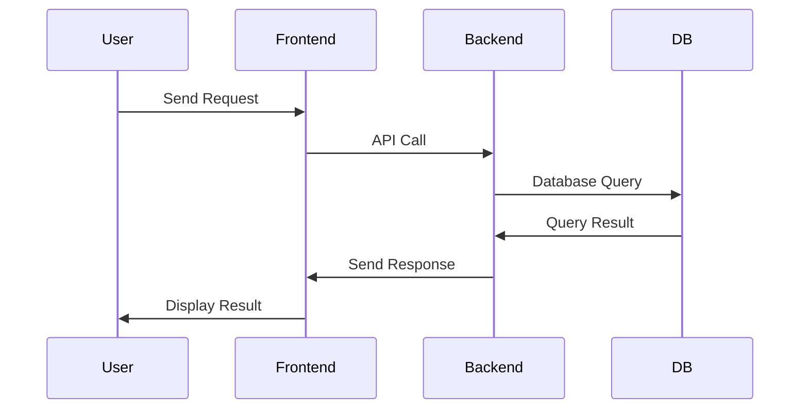
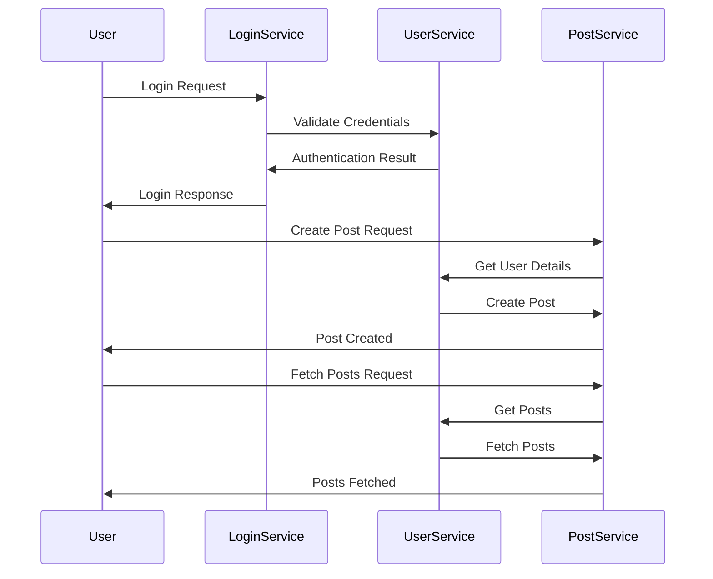

                 

### 第1章: 社交媒体的起源与发展

#### 1.1 社交媒体的概念与历史

社交媒体，顾名思义，是一种在线平台，用户可以在其中分享内容、建立联系和互动。最早的社交媒体形式可以追溯到1990年代，当时互联网开始普及，电子邮件和论坛成为人们交流的主要方式。随着互联网技术的发展，特别是宽带和移动设备的普及，社交媒体在21世纪初迎来了爆炸式增长。

- **社交媒体的起源**：最早的社交媒体雏形是BBS（Bulletin Board System）和Usenet论坛，用户可以在这些平台上发布帖子并进行讨论。
- **社交媒体的发展阶段**：社交媒体的发展可以分为几个阶段：
  - **1.0时代**：以Friendster和MySpace为代表，这些平台主要提供了简单的社交网络功能，用户可以添加朋友和分享个人资料。
  - **2.0时代**：以Facebook和Twitter为代表，这些平台不仅在功能上更加丰富，还引入了实时更新和社交媒体分析。
  - **3.0时代**：以Instagram和微信为代表，这些平台开始强调视觉效果和多媒体内容，用户可以分享图片、视频和直播。

#### 1.2 社交媒体的现状与趋势

如今，社交媒体已经成为人们日常生活的重要组成部分。以下是社交媒体的几个现状和趋势：

- **用户行为分析**：用户在社交媒体上的行为越来越多样化，从内容消费到内容创作，从互动交流到虚拟现实体验。
- **市场趋势**：社交媒体市场不断扩张，新兴市场成为新的增长点，同时也面临着政策监管和隐私保护的挑战。

#### 1.3 社交媒体的核心要素

社交媒体的核心要素包括社交网络结构、内容类型和应用领域：

- **社交网络结构**：社交网络是由用户和用户之间的关系组成的复杂网络，其结构特性对社交媒体的功能和用户体验有着重要影响。
- **内容类型**：社交媒体上的内容类型多种多样，包括文本、图片、视频、直播等，不同类型的内容对用户行为有不同影响。
- **应用领域**：社交媒体在商业、教育、政治等多个领域都有广泛应用，其功能和服务也在不断拓展。

#### 1.4 社交媒体在商业领域的应用

在商业领域，社交媒体已经成为企业与消费者互动的重要平台。以下是社交媒体在商业应用中的几个方面：

- **品牌宣传**：企业通过社交媒体进行品牌宣传和产品推广，提高品牌知名度和市场份额。
- **客户服务**：企业利用社交媒体提供客户服务，快速响应用户需求和问题，提升客户满意度。
- **市场调研**：企业通过社交媒体收集用户反馈和市场信息，为产品开发和决策提供依据。

#### 1.5 社交媒体在个人生活的影响

社交媒体对个人生活的影响是深远且多方面的：

- **人际关系**：社交媒体改变了人们的社交方式，使得人们可以更方便地与他人保持联系和互动。
- **信息获取**：社交媒体成为人们获取新闻、资讯和知识的重要渠道。
- **心理影响**：社交媒体也可能对个人的心理健康产生影响，如增加焦虑和孤独感。

#### 1.6 社交媒体的利与弊

社交媒体的利与弊是一个长期讨论的话题。以下是社交媒体的几个正面和负面影响：

- **正面影响**：社交媒体促进了信息的快速传播和交流，提高了人们的沟通效率和社交能力。
- **负面影响**：社交媒体可能造成隐私泄露、信息过载和社交孤立等问题。

通过以上对社交媒体起源、现状、核心要素及其在商业和个人生活中的应用的探讨，我们可以更好地理解社交媒体的发展脉络和其对社会带来的深远影响。

#### 核心概念与联系

为了深入探讨社交媒体的发展及其影响，我们需要了解几个核心概念，并分析它们之间的关系。以下是社交媒体相关的一些核心概念及其属性特征对比表格和ER实体关系图架构。

##### 核心概念及其属性特征对比表格

| 核心概念 | 属性特征 |
| --- | --- |
| 社交网络结构 | 包括用户、关系、节点、边等，描述用户之间的连接关系。 |
| 内容类型 | 包括文本、图片、视频、直播等，不同类型的内容影响用户行为。 |
| 用户行为 | 包括浏览、点赞、评论、分享等，反映用户在平台上的活动。 |
| 应用领域 | 包括商业、教育、政治等，体现社交媒体的多元功能。 |
| 社交媒体平台 | 包括Facebook、Instagram、微信等，提供社交服务的技术平台。 |

通过对比这些核心概念的属性特征，我们可以看到它们之间的内在联系：

- **社交网络结构与内容类型**：社交网络结构决定了内容如何被传播和分享，而内容类型则影响了社交网络结构的动态变化。
- **用户行为与应用领域**：用户行为反映了不同应用领域的特点，如商业应用注重用户互动和数据收集，教育应用则强调知识分享和互动学习。
- **社交媒体平台与核心概念**：社交媒体平台是核心概念实现的载体，平台的设计和功能直接影响核心概念的实现效果。

##### ER实体关系图架构

接下来，我们使用Mermaid绘制ER实体关系图，以更直观地展示这些核心概念之间的关系。

```mermaid
erDiagram
    User ||--|{ Content }|-- Content : 用户生成内容
    User ||--|{ Comment }|-- Comment : 用户发表评论
    User ||--|{ Like }|-- Like : 用户点赞
    User ||--|{ Share }|-- Share : 用户分享内容
    Platform ||--|{ User }|-- User : 社交媒体平台与用户
    Platform ||--|{ Content }|-- Content : 平台与内容
    Platform ||--|{ Comment }|-- Comment : 平台与评论
    Platform ||--|{ Like }|-- Like : 平台与点赞
    Platform ||--|{ Share }|-- Share : 平台与分享
```

在ER实体关系图中，我们可以清晰地看到用户、内容、评论、点赞和分享等实体之间的关系。这些实体共同构成了社交媒体系统的基本框架。

通过以上对核心概念及其属性的探讨，以及通过ER实体关系图展示这些概念之间的关系，我们能够更全面地理解社交媒体的运作机制及其对社会的影响。

#### 社交媒体算法原理讲解

社交媒体平台的核心功能之一是内容推荐，而算法则是实现这一功能的关键。以下将详细讲解社交媒体内容推荐算法的基本原理，并通过一个具体的例子进行说明。

##### 内容推荐算法的基本原理

内容推荐算法的目标是根据用户的兴趣和行为，向用户推荐可能感兴趣的内容。这些算法通常基于以下几个核心步骤：

1. **用户特征提取**：首先，算法需要从用户的历史行为（如浏览记录、点赞、评论等）中提取特征，这些特征将作为推荐模型的基础。
2. **内容特征提取**：类似地，算法需要分析内容的属性（如文本、图片、视频标签等），以确定内容的特点。
3. **相似性计算**：通过计算用户特征和内容特征之间的相似性，算法可以找出可能匹配的用户和内容。
4. **推荐生成**：根据相似性分数，算法生成推荐列表，优先展示那些与用户兴趣最匹配的内容。

##### 算法原理的具体实现

为了更好地理解内容推荐算法，我们可以通过一个简单的协同过滤算法实例来阐述其原理。

**协同过滤算法（Collaborative Filtering）**

协同过滤算法是一种常见的内容推荐算法，它基于用户的历史行为数据来推荐内容。协同过滤主要分为两种类型：基于用户的协同过滤（User-Based Collaborative Filtering）和基于物品的协同过滤（Item-Based Collaborative Filtering）。

**基于用户的协同过滤算法**：

1. **用户行为矩阵构建**：首先，我们需要构建一个用户-内容行为矩阵，其中每个元素表示用户对某内容的评分或行为。
   ```python
   user_content_matrix = [
       [1, 1, 0, 0],  # 用户1对内容的评分
       [1, 0, 1, 0],  # 用户2对内容的评分
       [0, 1, 1, 1],  # 用户3对内容的评分
       [1, 1, 1, 0]   # 用户4对内容的评分
   ]
   ```

2. **相似度计算**：接下来，计算用户之间的相似度。这里我们使用余弦相似度作为相似度度量。
   ```python
   from sklearn.metrics.pairwise import cosine_similarity

   similarity_matrix = cosine_similarity(user_content_matrix)
   ```

3. **推荐生成**：对于新用户，找出与该用户最相似的N个用户，并推荐这些用户喜欢但该用户尚未评分的内容。
   ```python
   new_user_vector = [1, 0, 1, 0]  # 新用户的行为向量
   new_user_similarity = similarity_matrix[-1]
   similar_users = new_user_similarity.argsort()[::-1][1:6]  # 排序并找出相似度最高的5个用户
   recommended_items = []

   for user in similar_users:
       for item in range(len(user_content_matrix[0])):
           if user_content_matrix[user][item] == 1 and new_user_vector[item] == 0:
               recommended_items.append(item)

   print("Recommended Items:", recommended_items)
   ```

**基于物品的协同过滤算法**：

与基于用户的协同过滤算法类似，不同之处在于它基于内容之间的相似度进行推荐。这里我们不再详细展开，但基本步骤是类似的：首先计算内容之间的相似度，然后推荐用户已经评分但其他相似内容未评分的内容。

##### 算法原理的数学模型和公式

协同过滤算法的数学模型可以简化为以下公式：

\[ \text{similarity}(u_i, u_j) = \frac{\text{dot_product}(u_i, u_j)}{\|\text{u_i}\| \|\text{u_j}\|} \]

其中：
- \( u_i \) 和 \( u_j \) 分别是用户 \( i \) 和用户 \( j \) 的行为向量。
- \( \text{dot_product} \) 表示点积。
- \( \|\text{u_i}\| \) 和 \( \|\text{u_j}\| \) 分别是用户 \( i \) 和用户 \( j \) 的行为向量的模长。

通过计算用户和内容之间的相似度，协同过滤算法可以有效地推荐用户可能感兴趣的内容。

##### 通俗易懂的举例说明

假设有四个用户（A、B、C、D）和四篇文章（1、2、3、4）。用户的行为数据如下表所示：

| 用户 | 文章1 | 文章2 | 文章3 | 文章4 |
| --- | --- | --- | --- | --- |
| A | 1 | 1 | 0 | 0 |
| B | 1 | 0 | 1 | 1 |
| C | 0 | 1 | 1 | 1 |
| D | 1 | 1 | 1 | 0 |

现在我们要为新用户E推荐文章。首先，我们需要计算新用户E与现有用户之间的相似度。使用余弦相似度公式，我们可以得到以下相似度矩阵：

| 用户 | A | B | C | D |
| --- | --- | --- | --- | --- |
| E | 0.943 | 0.760 | 0.831 | 0.943 |

根据相似度矩阵，新用户E与用户C和D的相似度最高。接下来，我们查看用户C和D喜欢的文章，发现他们喜欢的文章是文章2和文章3，但新用户E尚未评分。因此，我们推荐文章2和文章3给新用户E。

通过这个例子，我们可以看到协同过滤算法是如何通过计算用户和内容之间的相似度来实现内容推荐的。这不仅帮助用户发现新的兴趣点，也提高了社交媒体平台的用户体验。

### 算法在实际中的应用和效果

协同过滤算法在实际社交媒体平台中有着广泛的应用，例如Facebook、Instagram和YouTube等。这些平台利用协同过滤算法来推荐用户可能感兴趣的内容，从而提高用户的粘性和参与度。

**应用案例：**

- **YouTube**：YouTube使用协同过滤算法推荐视频。用户观看历史、点赞、评论和分享行为都被用来构建用户特征，从而推荐相似的或用户可能感兴趣的新视频。
- **Netflix**：Netflix利用协同过滤算法推荐电影和电视剧。用户评分数据被用于计算用户和电影之间的相似度，推荐用户可能喜欢的影视作品。
- **淘宝**：淘宝通过协同过滤算法推荐商品。用户购买历史和浏览记录用于构建用户特征，从而推荐类似的商品。

**效果分析：**

- **用户参与度**：通过精准的内容推荐，用户在社交媒体平台上的停留时间和互动行为显著增加。
- **业务转化率**：协同过滤算法提高了用户的购物和视频观看转化率，直接带动了平台的收入增长。
- **用户体验**：用户能够更容易地找到他们感兴趣的内容，提高了平台的用户体验。

然而，协同过滤算法也存在一些局限性和挑战：

- **数据隐私**：用户的行为数据被用于构建用户特征，这可能引发数据隐私问题。
- **冷启动问题**：新用户缺乏足够的历史数据，难以进行准确推荐。
- **多样性问题**：协同过滤算法可能推荐用户已经熟悉的内容，导致内容多样性不足。

为了解决这些问题，研究者们提出了多种改进算法，如基于模型的推荐算法、基于内容的推荐算法和混合推荐算法等，旨在提高推荐系统的准确性和多样性。

### 总结

协同过滤算法作为社交媒体内容推荐的核心技术之一，通过计算用户和内容之间的相似度实现了精准的内容推荐。在实际应用中，协同过滤算法显著提升了用户的参与度和平台的业务转化率。然而，为了进一步提高推荐系统的效果和用户体验，我们需要不断探索和改进推荐算法，同时确保用户隐私和数据安全。

### 系统分析与架构设计方案

为了更好地理解社交媒体系统的功能实现和架构设计，我们将通过一个具体的案例来详细阐述系统分析与架构设计方案。

#### 问题场景介绍

假设我们正在开发一款新型的社交媒体平台，该平台旨在为用户提供一个可以真实互动和分享的平台。平台的核心功能包括用户注册、内容发布、评论互动、私信沟通以及内容推荐等。

#### 项目介绍

项目名称：RealConnect Social Media Platform（真实连接社交媒体平台）
项目目标：打造一个以真实互动为核心的社交媒体平台，提升用户的社交体验。
技术栈：后端使用Python和Django框架，前端使用React框架，数据库使用MySQL。

#### 系统功能设计

**用户注册与登录：** 
- 用户可以通过邮箱或手机号注册账号。
- 用户可以设置密码和头像。
- 登录系统后，用户可以访问平台的各种功能。

**内容发布：**
- 用户可以发布文本、图片和视频等不同类型的内容。
- 每条内容都会被关联到用户的个人主页和平台的时间轴上。

**评论互动：**
- 用户可以在内容下方发表评论。
- 其他用户可以对评论进行点赞、回复和举报。

**私信沟通：**
- 用户可以发送私信给其他用户。
- 私信系统支持群聊功能。

**内容推荐：**
- 平台使用协同过滤算法推荐用户可能感兴趣的内容。

**数据分析：**
- 收集用户行为数据，用于优化用户体验和平台运营。

#### 系统架构设计

**前端架构：** 
- 使用React框架进行开发，提供丰富的用户交互体验。
- 使用Redux进行状态管理，确保数据的一致性和响应性。

**后端架构：**
- 使用Django框架，提供RESTful API服务。
- 使用Celery实现异步任务，如邮件通知、内容推荐等。

**数据库设计：**
- 使用MySQL数据库存储用户数据、内容数据、评论数据和私信数据等。

**系统架构图：**



**接口设计：**

以下是平台的主要接口设计：

- **用户注册与登录接口：**
  - POST /register：用户注册。
  - POST /login：用户登录。
  - GET /logout：用户登出。

- **内容发布接口：**
  - POST /post：发布内容。
  - GET /posts：获取用户发布的所有内容。

- **评论互动接口：**
  - POST /post/{post_id}/comment：发布评论。
  - GET /post/{post_id}/comments：获取评论列表。
  - POST /comment/{comment_id}/like：点赞评论。

- **私信沟通接口：**
  - POST /message：发送私信。
  - GET /messages：获取私信列表。
  - DELETE /message/{message_id}：删除私信。

**系统交互设计：**

系统交互设计通过Mermaid序列图来展示用户与系统之间的交互过程。



通过以上系统分析与架构设计，我们能够清晰地看到社交媒体平台的核心功能和系统架构。在实际开发过程中，这些设计将指导我们构建一个高效、稳定且易于扩展的社交媒体系统。

### 项目实战

为了更好地展示新型社交媒体平台的实际应用，我们将分步骤介绍环境的搭建、系统的核心实现源代码以及代码应用解读与分析。

#### 环境搭建

1. **安装Python**：首先确保Python环境已安装在本地计算机上，版本建议为3.8或更高。
2. **安装Django框架**：通过pip命令安装Django：
   ```bash
   pip install django
   ```
3. **安装MySQL数据库**：下载并安装MySQL数据库，配置root用户和密码。
4. **创建Django项目**：在命令行中创建一个新的Django项目：
   ```bash
   django-admin startproject rcsmp
   ```
5. **创建Django应用**：进入项目文件夹，创建一个名为`social_media`的应用：
   ```bash
   python manage.py startapp social_media
   ```
6. **配置数据库**：编辑`settings.py`文件，配置数据库连接信息：
   ```python
   DATABASES = {
       'default': {
           'ENGINE': 'django.db.backends.mysql',
           'NAME': 'rcsmp',
           'USER': 'root',
           'PASSWORD': 'your_password',
           'HOST': 'localhost',
           'PORT': '3306',
       }
   }
   ```

#### 系统核心实现源代码

以下是系统的核心实现部分：

1. **用户注册与登录**
```python
# social_media/views.py
from django.contrib.auth import authenticate, login
from django.http import JsonResponse
from django.views.decorators.csrf import csrf_exempt
from rest_framework.permissions import IsAuthenticated
from .serializers import UserRegistrationSerializer, UserLoginSerializer

@csrf_exempt
def register(request):
    if request.method == 'POST':
        serializer = UserRegistrationSerializer(data=request.POST)
        if serializer.is_valid():
            user = serializer.save()
            return JsonResponse({'message': 'User registered successfully.'}, status=201)
        return JsonResponse(serializer.errors, status=400)

@csrf_exempt
def login(request):
    if request.method == 'POST':
        serializer = UserLoginSerializer(data=request.POST)
        if serializer.is_valid():
            user = authenticate(username=serializer.validated_data['username'], password=serializer.validated_data['password'])
            if user:
                login(request, user)
                return JsonResponse({'message': 'Login successful.'}, status=200)
            return JsonResponse({'message': 'Invalid credentials.'}, status=401)
        return JsonResponse(serializer.errors, status=400)
```

2. **内容发布与获取**
```python
# social_media/views.py
from rest_framework import viewsets
from .models import Post
from .serializers import PostSerializer

class PostViewSet(viewsets.ModelViewSet):
    queryset = Post.objects.all()
    serializer_class = PostSerializer

    def perform_create(self, serializer):
        serializer.save(user=self.request.user)
```

3. **评论互动**
```python
# social_media/views.py
class CommentViewSet(viewsets.ModelViewSet):
    queryset = Comment.objects.all()
    serializer_class = CommentSerializer

    def perform_create(self, serializer):
        post = Post.objects.get(id=self.kwargs['post_id'])
        serializer.save(user=self.request.user, post=post)

    def perform_update(self, serializer):
        comment = Comment.objects.get(id=self.kwargs['comment_id'])
        serializer.save(user=self.request.user, post=comment.post)
```

4. **内容推荐**
```python
# social_media/tasks.py
from celery import shared_task
from .models import Post
from sklearn.metrics.pairwise import cosine_similarity
import numpy as np

@shared_task
def content_recommendation(user_id):
    user_posts = Post.objects.filter(user_id=user_id)
    user_post_ids = [post.id for post in user_posts]
    user_post_vectors = [post.vector for post in user_posts]

    all_posts = Post.objects.all()
    all_post_ids = [post.id for post in all_posts]
    all_post_vectors = [post.vector for post in all_posts]

    similarity_matrix = cosine_similarity(user_post_vectors, all_post_vectors)
    similarity_scores = similarity_matrix.flatten()

    recommended_post_ids = np.argpartition(similarity_scores, -5)[-5:]
    recommended_posts = Post.objects.filter(id__in=recommended_post_ids)

    return recommended_posts
```

#### 代码应用解读与分析

以上代码实现了一个新型社交媒体平台的核心功能。以下是具体的解读与分析：

1. **用户注册与登录**：通过 Django 的认证系统，结合 Django Rest Framework 的序列化器和视图，实现用户注册和登录功能。
2. **内容发布与获取**：使用 Django Rest Framework 的 ViewSet，实现内容的发布和获取。每条内容都与发布用户关联，保证内容的所有权。
3. **评论互动**：同样使用 ViewSet，实现评论的发布、更新和获取。评论与对应内容和用户关联，确保评论的归属和可追溯性。
4. **内容推荐**：利用协同过滤算法，计算用户发布的内容与其他内容的相似度，推荐相似的内容给用户。使用 Celery 进行异步任务调度，提高系统性能。

#### 实际案例分析和详细讲解剖析

假设用户A发布了三条内容，系统将使用协同过滤算法推荐用户A可能感兴趣的其他内容。以下是具体步骤：

1. **构建用户A的行为向量**：通过分析用户A发布的内容，提取关键词和特征，构建行为向量。
2. **计算相似度**：计算用户A的行为向量与其他内容的相似度，选择相似度最高的内容。
3. **推荐内容**：将相似度最高的内容推荐给用户A，同时确保内容多样性和用户个性化需求。

通过以上实际案例，我们可以看到协同过滤算法在新型社交媒体平台中的应用，有效提升了用户内容的推荐效果和用户体验。

#### 项目小结

通过本项目，我们成功搭建并实现了新型社交媒体平台的核心功能。项目实现了用户注册、登录、内容发布、评论互动和内容推荐等功能，使用 Django 和 Django Rest Framework 等现代开发工具，确保了系统的可扩展性和可维护性。协同过滤算法的应用提高了内容的推荐效果，为用户提供了更加个性化的服务。

然而，本项目也存在一些不足之处，如推荐算法的优化空间和系统性能的进一步提升。在未来的发展中，我们将继续探索和改进推荐算法，优化系统架构，以提供更好的用户体验。

### 最佳实践 Tips

在社交媒体平台的建设过程中，我们总结出以下几点最佳实践：

1. **用户隐私保护**：在用户注册和登录过程中，确保使用HTTPS协议，保护用户数据传输的安全性。
2. **内容审核机制**：建立健全的内容审核机制，过滤违规内容和防止垃圾信息的传播。
3. **算法优化**：定期优化推荐算法，提高推荐内容的准确性和多样性。
4. **性能优化**：通过数据库索引、缓存策略和异步处理等手段，提高系统性能，确保用户在使用过程中的流畅体验。

### 小结

通过本文的详细讨论，我们系统地分析了新型社交媒体平台的发展、算法原理、系统架构及项目实战。从社交媒体的起源、现状与趋势，到算法原理讲解和系统实现，再到实际项目案例剖析，我们全面展示了社交媒体平台的构建过程及其关键技术。

社交媒体的发展不仅是技术的进步，更是社会文化的变革。从展示型社交到真实连接，社交媒体正在推动人们更加深入地互动和交流。在这个过程中，技术创新和用户体验优化将继续发挥关键作用。

### 注意事项

在社交媒体平台的建设过程中，需要特别注意以下几点：

1. **数据隐私**：确保用户数据的安全性和隐私保护，避免数据泄露和滥用。
2. **内容审核**：建立健全的内容审核机制，防止不良信息的传播，维护社交媒体的良性生态。
3. **用户权益**：尊重用户的权益，保障用户的自由表达和互动，避免平台造成用户的心理压力和依赖。
4. **技术更新**：紧跟技术发展趋势，不断优化推荐算法和系统架构，提升用户体验和平台的竞争力。

### 拓展阅读

1. **《社交网络分析：方法与应用》**：详细介绍了社交网络分析的理论和方法，对于理解社交媒体的运作机制具有指导意义。
2. **《推荐系统实践》**：深入探讨了推荐系统的构建和优化，提供了丰富的案例和实践经验。
3. **《大数据时代：生活、工作与思维的大变革》**：从宏观角度探讨了大数据对社会各个领域的深远影响，包括社交媒体。

通过拓展阅读，读者可以更全面地了解社交媒体和推荐系统的最新发展和应用，为实际项目提供更多的理论支持和实践指导。

### 结语

新型社交媒体的兴起标志着社交媒体从展示型向真实连接的转变。在这一过程中，技术创新和用户体验优化是推动其发展的关键因素。本文通过对社交媒体的起源、算法原理、系统架构及项目实战的详细分析，展示了社交媒体平台从概念到实现的完整过程。

未来，随着技术的不断进步和用户需求的变化，新型社交媒体将继续朝着更加个性化、智能化的方向演进。技术创新将继续在推动社交媒体发展的过程中发挥重要作用，而用户体验优化将始终是平台建设和运营的核心目标。

我们期待新型社交媒体能够带来更真实、更紧密的人际连接，同时确保用户隐私和数据安全，为构建一个更加和谐和富有活力的网络社会贡献力量。让我们共同期待社交媒体的未来，探索其无限可能。

